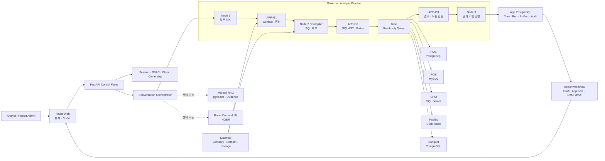

<div align="center">

# Answervice

### 기업 데이터에 질문하고, 근거 있는 답을 보고서로

객실·고객·식음료·시설·연회에 흩어진 호텔 데이터를<br />
자연어로 분석하고 검증 가능한 업무 보고서로 연결하는 Enterprise Intelligence Platform


<br />


[제품 문서](docs/README.md) · [PRD](docs/product/01_PRD.md) · [사용자 흐름](docs/product/02_유저플로우.md) · [아키텍처](docs/product/03_아키텍처.md)

</div>

---

## 목차

1. [한눈에 보기](#한눈에-보기)
2. [왜 Answervice인가?](#왜-answervice인가)
3. [사용자는 이렇게 분석합니다](#사용자는-이렇게-분석합니다)
4. [주요 기능](#주요-기능)
5. [현재 구현 범위](#현재-구현-범위)
6. [시스템 아키텍처](#시스템-아키텍처)
7. [기술 스택](#기술-스택)
8. [저장소 구조](#저장소-구조)
9. [팀 구성](#팀-구성)
10. [문서 안내](#문서-안내)

## 한눈에 보기

| 궁금한 점 | 답변 |
|---|---|
| 무엇을 만드는가? | 여러 업무 시스템의 데이터를 자연어로 분석하고, 결과와 근거를 보고서로 이어 주는 기업용 데이터 분석 서비스 |
| 누가 사용하는가? | 데이터 질문을 실행·저장하는 **분석 사용자**와 결과를 검토·승인하는 **보고서 관리자** |
| 무엇을 입력하는가? | 지표, 기간, 비교 대상과 조건을 담은 한국어 업무 질문 |
| 무엇을 받는가? | 설명, KPI, 차트, 표와 함께 기간·필터·지표 정의·데이터 출처·query 추적 정보 |
| 무엇이 다른가? | AI가 낸 SQL을 바로 실행하지 않고, 승인된 metadata·권한·SQL 정책을 통과한 읽기 전용 분석만 수행 |
| 어떤 데이터를 쓰는가? | 실제 고객 정보가 아닌 교육용 **합성 호텔 데이터** |

> **한 문장으로:** 데이터베이스나 SQL을 몰라도 업무 언어로 질문하되, 답이 어떤 기준과 데이터에서 나왔는지 다시 확인할 수 있게 만드는 프로젝트입니다.

## 왜 Answervice인가?

호텔의 운영 데이터는 PMS, POS, CRM, 시설, 연회 시스템에 나뉘어 있습니다. 현업 담당자가 하나의 질문에 답하려면 여러 부서에서 자료를 모으고, 서로 다른 기준을 맞추고, 결과를 다시 표와 보고서로 옮겨야 합니다.

**Answervice**는 사용자가 업무 언어로 질문하면 승인된 용어·데이터 자산·권한·계산 규칙 안에서 여러 원천을 읽기 전용으로 분석하고, 결과와 근거를 재사용 가능한 분석·보고서 자산으로 만드는 서비스입니다.

> **예시 질문**<br />
> 2025년 5월과 6월 GOLD 고객의 객실·식음료 매출을 비교하고, 차이가 큰 항목을 보고서로 만들어 줘.

| 기존 업무의 문제 | Answervice가 제공하는 방식 |
|---|---|
| 데이터가 시스템별로 분산됨 | Trino를 통한 5개 업무 원천의 연합 조회 |
| 같은 지표도 계산 기준이 달라짐 | DataHub 용어·자산과 Runtime Catalog 기반의 승인된 지표 정의 사용 |
| SQL 작성과 검증에 전문 인력이 필요함 | 다단계 AI 분석과 결정론적 SQL Guard 결합 |
| 결과의 출처와 조건을 다시 확인하기 어려움 | 기간·필터·업무 지표·데이터셋·query ID를 분석 결과 묶음에 함께 보존 |
| 분석 결과를 보고서로 다시 옮겨야 함 | 검증된 분석 결과를 보고서 초안·승인본·HTML/PDF로 연결 |

정해진 KPI를 같은 화면에서 반복 조회하는 일은 기존 BI가 더 적합합니다. Answervice는 **기존 대시보드에 없는 교차 질문을 안전하게 분석하고, 그 결과를 저장·재실행·보고서에 재사용하는 상황**에 집중합니다.

### 다루는 호텔 업무 데이터

| 업무 영역 | 원천 시스템 | 분석 예시 |
|---|---|---|
| 객실 | PMS · PostgreSQL | 객실 매출, 투숙·예약 기준 비교 |
| 식음료 | POS · MySQL | 업장·기간별 식음료 매출 비교 |
| 고객 | CRM · Microsoft SQL Server | 거래 시점의 회원 등급을 반영한 고객군 분석 |
| 시설 | Facility · ClickHouse | 유료시설 이용·매출 추이 분석 |
| 연회 | Banquet · PostgreSQL | 행사·기간별 연회 실적 분석 |

각 원천은 애플리케이션이 직접 수정하지 않습니다. Trino가 승인된 범위만 읽기 전용으로 조회하고, DataHub가 업무 용어와 데이터 자산의 의미·관계를 제공합니다.

## 사용자는 이렇게 분석합니다

```text
① 질문하기       ② 기준 확인         ③ 안전하게 분석       ④ 결과 이해          ⑤ 업무에 재사용
업무 언어 입력 → 지표·기간·권한 확인 → SQL 생성·정책 검증 → KPI·차트·표·근거 → 저장·재실행·보고서
```

1. **질문하기** — 분석 사용자가 지표·기간·비교 조건을 평소 업무 표현으로 입력합니다.
2. **기준 확인** — 표현이 모호하거나 승인 범위를 벗어나면 추측해 실행하지 않고, 선택 가능한 기준이나 수정 방법을 안내합니다.
3. **안전하게 분석** — 질문을 승인된 업무 지표(Metric)와 데이터 자산에 연결하고, 생성된 SQL의 읽기 전용 여부·컬럼·JOIN·함수·조회량을 검사합니다.
4. **결과 이해** — 설명, KPI, 차트와 표를 보여 주고 사용한 기간·필터·지표·데이터셋·query ID를 같은 결과에 묶습니다.
5. **업무에 재사용** — 분석 정의를 저장해 현재 권한과 최신 승인 데이터로 다시 실행하고, 검증된 결과를 보고서 초안과 승인 흐름에 연결합니다.

### 역할별 경험

| 역할 | 할 수 있는 일 | 안전 경계 |
|---|---|---|
| 분석 사용자 (`analyst`) | 자연어 분석, 기준 확인, 결과·근거 열람, 분석 저장·재실행, 자신의 보고서 초안 작성 | 모든 질문이나 임의 SQL이 아니라 현재 권한과 승인 catalog 범위만 사용 |
| 보고서 관리자 (`report_admin`) | 제출된 보고서 검토·승인·반려, 승인 버전 실행과 이력 확인 | 분석 사용자의 데이터 권한을 우회하거나 임의 자연어 분석을 실행하지 않음 |

### 결과 한 건에 함께 담기는 것

| 결과 구성 | 사용자가 확인하는 내용 |
|---|---|
| 요약 | 질문에 대한 핵심 해석과 비교 결과 |
| KPI · 차트 · 표 | 같은 검증 결과를 목적에 맞는 형태로 표현한 값 |
| 분석 조건 | 확정된 기간, 필터, 비교 기준과 집계 단위 |
| 의미 근거 | 사용한 업무 지표의 정의·단위와 승인된 DataHub 자산 |
| 실행 근거 | query ID, 분석 결과(Artifact) 식별자와 정책 Gate 결과 |

## 주요 기능

| 기능 | 사용자 가치 | 구현의 핵심 |
|---|---|---|
| 자연어 데이터 분석 | SQL 없이 새로운 업무 질문을 시작 | 질문 해석 → 승인 Context 결속 → Text-to-SQL |
| 모호성 확인과 안전 차단 | 잘못된 기준으로 그럴듯한 숫자를 만드는 일을 방지 | 기간·Metric·권한·데이터 범위를 서버에서 확정 |
| 다중 원천 연합 조회 | 여러 시스템의 데이터를 한 분석에서 비교 | Trino와 5개 read-only Source DB |
| 설명 가능한 분석 결과 | 숫자의 의미와 출처를 함께 검토 | Safe Result, Artifact, DataHub lineage |
| 분석 저장과 재실행 | 반복 보고 때 같은 분석 정의를 재사용 | Definition·Run·Artifact 분리, 현재 권한 재검증 |
| 보고서 워크플로 | 분석 결과를 복사하지 않고 보고서 자산으로 연결 | 블록 편집, 버전, 승인·반려, 실행 이력, HTML/PDF |
| 내부 지침 검색 | 내부 매뉴얼의 근거 문단과 함께 답변 | pgvector 기반 evidence-bound RAG, 선택 기능 |
| 객실 수요 예측 | 최대 7일의 객실 수요 후보를 별도 기능으로 확인 | HGBR 모델 artifact, 선택 기능 |

## 현재 구현 범위

아래 표는 **현재 코드에 연결된 기능 범위**를 나타냅니다. 운영 승인 상태는 같은 릴리스의 실제 Backend·DataHub·Trino·DB·모델 증거를 요구하는 [제품 요구사항 정의서](docs/product/01_PRD.md)에서 별도로 관리합니다.

| 영역 | 현재 코드 경로 |
|---|---|
| 분석 Core | Frontend → FastAPI → Context/권한 → Node 1·2·3 → G1·G2·G3 → Trino → Artifact 경로 통합 |
| 대화·재실행 | Conversation/Turn 영속화, 동시성·멱등성 경계, 분석 저장·조회·재실행 경로 통합 |
| 보고서 | Artifact 기반 초안, 블록 편집, Assistant, 버전·승인, 수동·예약 실행, HTML·PDF 렌더링 통합 |
| 내부 매뉴얼 RAG | pgvector 검색, 근거 제한 답변, 후속 질문, 문서 목록·원문 PDF 경로 통합. 기본값은 `RAG_FEATURE_ENABLED=0` |
| 객실 수요 ML | 합성 데이터로 검증한 HGBR v2.2 후보와 최대 7일 예측 API 통합. 기본값은 `ML_FEATURE_ENABLED=0` |
| Node 2 sLLM | OpenAI-compatible 전용 endpoint, SQL-only 계약, Compiler 보완, 1회 제한 Repair, 학습·평가·승격 Gate 구현 |
| 운영 안전성 | 외부 secret, PBKDF2 세션 principal, TLS Trino/DataHub, read-only source, fail-closed readiness 적용 |

> 고정 demo 응답이나 질문별 정답 SQL은 운영 경로에 없습니다. 승인된 데이터·metadata·권한·모델 구성이 불완전하면 `/readiness`는 의도적으로 `NOT_READY`를 반환합니다.

## 시스템 아키텍처



### 분석 파이프라인의 안전 경계

| 단계 | 책임 |
|---|---|
| Node 1 | 자연어 질문을 승인된 Metric·기간·필터·차원 후보로 구조화 |
| APP-G1 | Context 버전, 사용자 권한, metadata 관계, 기간과 데이터 범위 검증 |
| Node 2 / Compiler | 승인된 Context 안에서만 parameterized Trino SQL 후보 생성 |
| APP-G2 | SQLGlot AST로 단일 `SELECT`, allowlist, JOIN, 함수, 조회 예산과 read-only 정책 검사 |
| Trino | 5개 원천을 연합 조회하고 query ID·통계·실행 시간을 기록 |
| APP-G3 | 결과 schema, 행 수, 값 범위, 노출 정책과 근거 완전성 검사 |
| Node 3 | G3를 통과한 결과만 사용해 요약·비교·주의사항 생성 |

모델 출력은 언제나 **비신뢰 입력**입니다. 권한, 실행 여부, 최종 상태와 공개 가능한 결과는 서버의 결정론적 Gate가 결정합니다.

## 기술 스택

| 구분 | 기술 |
|---|---|
| Frontend | React 19, Vite 8, Recharts, dnd-kit, React Markdown, Nginx |
| Backend | Python 3.12, FastAPI, Pydantic, SQLAlchemy 2, Alembic, HTTPX |
| AI / LLM | OpenAI-compatible API, typed JSON Schema, SQLGlot, Node 1·2·Repair·3 pipeline |
| Data Platform | DataHub 1.7, Trino, Apache Polaris, S3-compatible object storage |
| Source DB | PostgreSQL, MySQL, Microsoft SQL Server, ClickHouse |
| RAG | pgvector, Qwen3 Embedding 후보, reranker, evidence-bound answer pipeline |
| ML | scikit-learn HistGradientBoostingRegressor, rolling validation, immutable model artifact |
| Report | Artifact lineage, versioned workflow, WeasyPrint HTML/PDF rendering |
| Infra / QA | Docker Compose, GitHub Actions, pytest, Node contract tests |

## 저장소 구조

```text
.
├─ app/
│  ├─ frontend/                 # React 분석·보고서 UI
│  └─ backend/                  # FastAPI API, orchestration, persistence
├─ src/
│  ├─ ai/                       # 모델 계약, prompt, SQL policy, Node 2 학습·평가
│  ├─ data/                     # DataHub·Trino·governance 도메인 계약
│  ├─ rag/                      # 내부 매뉴얼 검색·답변·평가
│  ├─ ml/                       # 객실 수요 예측 학습·serving artifact
│  └─ report/                   # 보고서 도메인·repository 계약
├─ infrastructure/
│  ├─ database/                 # Source DB, App DB, Trino, DataHub, Polaris
│  ├─ rag/                      # pgvector·RAG API Compose
│  └─ ml/                       # ML runtime Compose
├─ evals/                       # Gold set, RAG·ML·모델 평가 계약
├─ tests/                       # Backend, AI, Data, RAG, ML, Report, Frontend, E2E
├─ docs/product/                # 기획서, PRD, 사용자 흐름, 아키텍처 기준
└─ compose.yml                  # 전체 서비스 Compose 진입점
```

## 보안과 데이터 원칙

- 프로젝트 저장소에는 실제 고객 데이터 대신 합성 데이터를 사용합니다.
- Source DB는 애플리케이션에서 직접 쓰지 않으며 Trino의 최소 권한 read-only principal로 조회합니다.
- 모델 출력과 DataHub 자유 텍스트는 비신뢰 입력으로 처리하고 서버 정책으로 재검증합니다.
- 다중 statement, DDL/DML, 승인 밖 자산·컬럼·JOIN, 과도한 조회는 실행 전에 차단합니다.
- 로그인, API, 객체 소유권과 보고서 승인 권한을 서버의 Role→Capability 정책으로 검사합니다.
- 비밀번호, API key, TLS private key와 principal 파일은 Git에 포함하지 않습니다.
- dependency 실패를 fixture, 이전 Artifact, 빈 성공값 또는 숨은 fallback으로 대체하지 않습니다.

## 팀 구성

| 팀원 | GitHub | 담당 영역 |
|---|---|---|
| 박준희 | [hijun318-eng](https://github.com/hijun318-eng) | 프로젝트 통합, 실행 환경, 품질 관리 |
| 정승 | [jseung89](https://github.com/jseung89) | 데이터 플랫폼, DataHub·Trino, 합성 데이터 |
| 윤대성 | [YoonDaeSung-01](https://github.com/YoonDaeSung-01) | AI 분석 파이프라인, Text-to-SQL, 모델 학습·평가 |
| 김재홍 | [kkix1025](https://github.com/kkix1025) | Backend, 인증·권한, 데이터 영속화 |
| 송민지 | [nowis1350](https://github.com/nowis1350) | Frontend, 분석 결과 UX, 보고서 편집기 |

## 문서 안내

| 문서 | 내용 |
|---|---|
| [문서 지도](docs/README.md) | 제품 문서의 우선순위와 증거 원칙 |
| [프로젝트 기획서](docs/product/00_기획서.md) | 문제, 사용자, 가치와 제품 범위 |
| [제품 요구사항](docs/product/01_PRD.md) | Requirement, 인수 조건과 현재 판정 |
| [사용자 흐름](docs/product/02_유저플로우.md) | 로그인, 분석, 멀티턴, 실패와 보고서 흐름 |
| [기술 아키텍처](docs/product/03_아키텍처.md) | 컴포넌트 책임, 신뢰 경계와 전환 계약 |
| [아키텍처 시각화](docs/architecture/README.md) | Agent·분석·보고서·데이터 릴리스 다이어그램 |
| [Backend 가이드](app/backend/README.md) | API, 인증, runtime과 컨테이너 검증 |
| [RAG 가이드](src/rag/README.md) | 내부 매뉴얼 RAG 구성과 검증 |
| [Node 2 학습 가이드](src/ai/training/README.md) | 데이터셋, LoRA 학습, 평가와 승격 Gate |
| [보고서 도메인](src/report/README.md) | 보고서 버전·승인·실행 무결성 계약 |

---

<div align="center">

**Answervice — 데이터에 질문하고, 근거로 답하다.**

</div>
