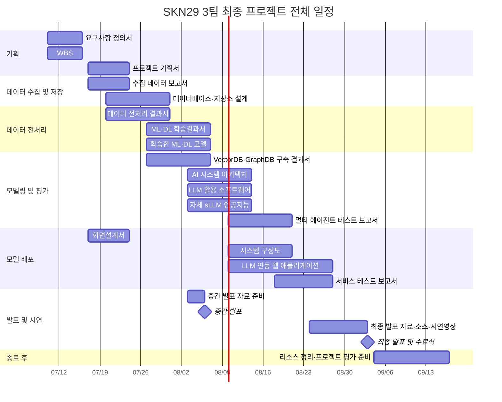

# AI Agent WBS

> 이 문서는 프로젝트 작업 상태의 단일 기준점이다. Codex를 포함한 AI 에이전트는 저장소 파일을 변경한 작업을 마칠 때 이 문서를 함께 갱신한다.

## 프로젝트 정보

| 항목 | 값 |
|---|---|
| 프로젝트 | 호텔 VOC/운영 이슈 분석 Agent |
| 교육 과정 | SK네트웍스 Family AI 캠프 29기 |
| 팀 | 3팀 |
| 프로젝트 기간 | 2026-07-10 ~ 2026-09-03 |
| 프로젝트 관리자 | `미정` |
| 최종 갱신 | `2026-07-15 16:39 KST` |
| 최종 갱신자 | `Codex` |

## 상태 및 작성 규칙

### 상태 값

| 상태 | 의미 |
|---|---|
| `TODO` | 아직 시작하지 않음 |
| `IN_PROGRESS` | 현재 작업 중 |
| `BLOCKED` | 외부 결정·권한·데이터 등이 필요해 진행 불가 |
| `REVIEW` | 구현은 끝났으며 사람 또는 다른 담당자의 검토 필요 |
| `DONE` | 완료 기준과 검증을 모두 충족 |
| `CANCELLED` | 합의에 따라 수행하지 않음 |

### 우선순위 값

- `P0`: 즉시 처리하지 않으면 일정 또는 핵심 기능이 중단됨
- `P1`: 현재 주차에 반드시 완료해야 함
- `P2`: 계획된 일반 작업
- `P3`: 개선 또는 선택 작업

### 갱신 원칙

1. 한 행은 검증 가능한 하나의 작업 단위로 작성한다.
2. 작업 ID는 `단계 코드-세 자리 번호` 형식을 사용한다. 예: `PLAN-001`, `DATA-001`.
3. 날짜는 `YYYY-MM-DD` 형식으로 작성한다.
4. 진척률은 `0`, `25`, `50`, `75`, `100` 중 하나를 기본으로 사용한다.
5. `DONE`은 진척률이 100이고 완료 기준 및 검증 결과가 기록된 경우에만 사용한다.
6. `BLOCKED`는 차단 사유와 해제에 필요한 결정 또는 행동을 비고에 기록한다.
7. 산출물·코드 경로는 저장소 루트 기준 경로로 기록한다.
8. 에이전트는 저장소 파일을 변경한 작업을 마칠 때 관련 행, 갠트 차트와 작업 로그를 함께 갱신한다.
9. 사실로 확인하지 않은 일정·담당자·기술은 임의로 채우지 않고 `미정`으로 둔다.
10. 기존 행을 삭제하지 않는다. 더 이상 수행하지 않는 작업은 `CANCELLED`로 변경하고 이유를 남긴다.

## 전체 일정 갠트 차트

> 산출물 마감 일정을 기준으로 구성한 계획이다. 시작일은 해당 주차의 시작일을 기준으로 배치했으며, 실제 작업 상태와 세부 일정은 아래 `작업 목록`을 기준으로 갱신한다.

### 주요 마일스톤

| 날짜 | 마일스톤 |
|---|---|
| 2026-07-16 | 요구사항 정의서 및 WBS 마감 |
| 2026-07-24 | 프로젝트 기획서, 수집 데이터 보고서 및 화면설계서 마감 |
| 2026-07-31 | DB·저장소 설계 및 데이터 전처리 결과서 마감 |
| 2026-08-06 | 중간 발표 |
| 2026-08-07 | ML/DL 및 VectorDB·GraphDB 관련 산출물 마감 |
| 2026-08-14 | AI 아키텍처, LLM 소프트웨어 및 sLLM 관련 산출물 마감 |
| 2026-08-21 | 멀티 에이전트 테스트 보고서 및 시스템 구성도 마감 |
| 2026-08-28 | 웹 애플리케이션 및 서비스 테스트 보고서 마감 |
| 2026-09-03 | 최종 발표, 개발 소스코드 및 시연영상 마감 |

## 작업 목록

| ID | 단계 | 주요 업무 | 세부 작업 | 담당자 | 상태 | 우선순위 | 시작일 | 마감일 | 진척률(%) | 선행 작업 | 완료 기준 | 검증 결과 | 산출물/경로 | 최종 갱신 | 비고 |
|---|---|---|---|---|---|---|---|---|---:|---|---|---|---|---|---|
| PLAN-001 | 기획 | 프로젝트 범위 정의 | 호텔 VOC/운영 이슈 분석 Agent의 사용자·문제·범위 확정 | 미정 | TODO | P1 | 미정 | 미정 | 0 | - | 사용자, 문제, 범위와 제외 범위가 문서화됨 | 미실행 | `docs/HOTEL_VOC_AI_AGENT.md` | 미정 | 예시 행: 실제 상태 확인 후 갱신 |
| PLAN-002 | 기획 | 요구사항 정의서 작성 | 호텔 VOC·운영 이슈 분석 AI Agent의 기능·데이터·AI·비기능 요구사항을 지정 Excel 양식에 작성 | Codex | REVIEW | P1 | 2026-07-15 | 2026-07-16 | 100 | PLAN-001 | 지정 양식의 7개 필드에 고유 ID를 가진 요구사항이 작성되고 원본 문서와 대조됨 | Excel Open XML 패키지 정상 압축 해제, 요구사항 34건·고유 ID 34건·헤더 병합 5건 확인 | `docs/호텔_VOC_AI_Agent_요구사항_정의서_3팀_junhee.xlsx` | 2026-07-15 | 팀 검토 후 요구사항 범위와 미정 성능 목표 확정 필요 |
| DATA-001 | 데이터 수집 및 저장 | 데이터 확보 | 사용할 VOC/운영 데이터 출처와 사용 조건 확정 | 미정 | TODO | P1 | 미정 | 미정 | 0 | PLAN-001 | 출처, 라이선스, 스키마와 데이터 구분이 기록됨 | 미실행 | 미정 | 미정 | 합성 데이터는 `synthetic`, seed, schema version 필수 |
| OPS-001 | 프로젝트 운영 | WBS 운영 체계 | AI 에이전트가 작업 종료 시 갱신하는 텍스트 기반 WBS 템플릿 구축 | Codex | DONE | P1 | 2026-07-15 | 2026-07-15 | 100 | - | Excel WBS 필드를 포괄하고 에이전트 갱신 규칙이 자동 인식 지침에 연결됨 | 문서 구조 및 필드 대응 검토 | `docs/AI_AGENT_WBS.md`, `AGENTS.md` | 2026-07-15 14:53 | WBS Excel 2종의 공통 필드 통합 |
| OPS-002 | 프로젝트 운영 | 일정 시각화 | 전체 산출물 일정과 마일스톤을 Mermaid 갠트 차트로 구성 | Codex | DONE | P1 | 2026-07-15 | 2026-07-15 | 100 | OPS-001 | 전체 프로젝트 기간, 산출물 일정과 발표 마일스톤이 한 화면에 표시됨 | Mermaid 문법 및 일정 대조 | `docs/AI_AGENT_WBS.md` | 2026-07-15 15:08 | 시작일은 해당 산출물 주차 기준 계획일 |
| OPS-003 | 프로젝트 운영 | Git 협업 | main 최신화 후 변경을 junhee 브랜치로 이전 | Codex | DONE | P1 | 2026-07-15 | 2026-07-15 | 100 | OPS-002 | 원격 최신 변경과 WBS 커밋이 junhee 브랜치에 충돌 없이 통합됨 | `origin/junhee`의 `8b0761e` 병합 및 ahead 2 확인 | `AGENTS.md`, `docs/AI_AGENT_WBS.md` | 2026-07-15 15:25 | main 직접 커밋을 피하고 개인 브랜치 규칙 준수 |
| OPS-004 | 프로젝트 운영 | Git 협업 | minji를 제외한 개인 브랜치를 dev에 직접 통합 | Codex | DONE | P1 | 2026-07-15 | 2026-07-15 | 100 | OPS-003 | junhee, seung, jaehong 브랜치가 dev 이력에 포함되고 minji는 제외됨 | 세 브랜치 ancestry 확인, minji 비포함 확인, `git diff --check` 통과 | `AGENTS.md`, `docs/AI_AGENT_WBS.md`, `docs/` | 2026-07-15 16:39 | 관리자 직접 merge 방식 적용 |

## 단계 코드

| 단계 | 코드 | 설명 |
|---|---|---|
| 기획 | `PLAN` | 문제 정의, 요구사항, WBS, 화면 기획 |
| 데이터 수집 및 저장 | `DATA` | 데이터 확보, 탐색, DB·저장소 설계 |
| 데이터 전처리 | `PREP` | 정제, 라벨링, 분할, 품질 검증 |
| 모델링 및 평가 | `MODEL` | ML/DL, RAG, 에이전트, sLLM, 평가 |
| 모델 배포 | `DEPLOY` | 애플리케이션, 인프라, 통합 테스트 |
| 발표 및 시연 | `DEMO` | 발표 자료, 소스코드 정리, 시연영상 |
| 프로젝트 운영 | `OPS` | 협업, 문서, 리소스, 회의 및 일정 관리 |

## 에이전트 작업 종료 절차

AI 에이전트는 저장소 파일을 변경한 작업을 종료하기 전에 다음 순서로 이 문서를 갱신한다.

1. 수행한 작업과 연결되는 기존 WBS 행을 찾는다.
2. 기존 행이 없으면 가장 적합한 단계 코드로 새 작업 ID를 생성한다.
3. 상태, 진척률, 산출물 경로, 최종 갱신 시각을 수정한다.
4. 실행한 테스트·검증 결과를 `검증 결과`에 짧게 기록한다.
5. 진행을 막는 사항이나 사람의 결정이 필요하면 `BLOCKED` 또는 `REVIEW`로 표시한다.
6. 일정 또는 상태가 바뀌었다면 갠트 차트의 해당 작업 기간과 상태를 동기화한다.
7. 아래 작업 로그 맨 위에 한 행을 추가한다.
8. 최종 답변에 WBS 갱신 여부와 변경한 작업 ID를 포함한다.

문서 조사·질문 답변처럼 저장소 파일을 변경하지 않은 작업은 WBS를 갱신하지 않는다.

## 작업 로그

최신 기록을 위에 추가한다. 한 작업에서 여러 WBS 항목을 변경했다면 ID를 쉼표로 구분한다.

| 일시(KST) | 작업 ID | 수행자 | 변경 요약 | 상태 변화 | 검증 | 관련 파일 |
|---|---|---|---|---|---|---|
| 2026-07-15 16:39 | OPS-004 | Codex | minji를 제외하고 junhee, seung, jaehong 브랜치를 dev에 직접 merge | TODO → DONE | 세 브랜치 ancestry 확인, minji 비포함 확인, `git diff --check` 통과 | `AGENTS.md`, `docs/AI_AGENT_WBS.md`, `docs/` |
| 2026-07-15 | PLAN-002 | Codex | 프로젝트 기준 문서 3종을 바탕으로 지정 Excel 양식에 요구사항 정의서 34건 작성 | TODO → REVIEW | Excel 패키지 압축 해제 및 데이터 행·고유 ID·병합 구조 검증 | `docs/호텔_VOC_AI_Agent_요구사항_정의서_3팀_junhee.xlsx`, `docs/AI_AGENT_WBS.md` |
| 2026-07-15 15:25 | OPS-003 | Codex | main 최신화 후 WBS 변경을 junhee 브랜치로 이전하고 원격 동시 변경 통합 | TODO → DONE | `origin/junhee`의 `8b0761e` 병합 및 ahead 2 확인 | `AGENTS.md`, `docs/AI_AGENT_WBS.md` |
| 2026-07-15 15:08 | OPS-002 | Codex | 전체 산출물 일정 및 주요 마일스톤 갠트 차트 추가 | TODO → DONE | Mermaid 문법 및 일정 대조 | `docs/AI_AGENT_WBS.md` |
| 2026-07-15 14:53 | OPS-001 | Codex | 에이전트 친화적 WBS와 작업 종료 갱신 규칙 추가 | TODO → DONE | 문서 구조 및 Excel 필드 대응 검토 | `docs/AI_AGENT_WBS.md`, `AGENTS.md` |
| YYYY-MM-DD HH:mm | OPS-000 | agent | 로그 작성 예시 | TODO → DONE | 검증 명령 또는 `문서 검토` | `path/to/file` |

## 기존 Excel 양식과의 필드 대응

| Excel WBS 항목 | 이 문서의 항목 |
|---|---|
| Task ID / WBS 번호 | ID |
| 주요 업무 | 주요 업무 |
| 세부 업무 / 작업 제목 | 세부 작업 |
| 담당자 / 작업 소유자 | 담당자 |
| 상태 | 상태 |
| 시작일 | 시작일 |
| 마감일 | 마감일 |
| 우선순위 | 우선순위 |
| 기간 | 시작일과 마감일로 계산 |
| 작업 완료 비율 | 진척률(%) |
| 단계별 갠트 영역 | 단계, 시작일, 마감일로 변환 |

이 문서를 Excel로 옮길 때는 `작업 목록` 표를 기준으로 사용한다. 갠트 차트가 필요하면 시작일·마감일·진척률을 이용해 별도로 생성한다.
