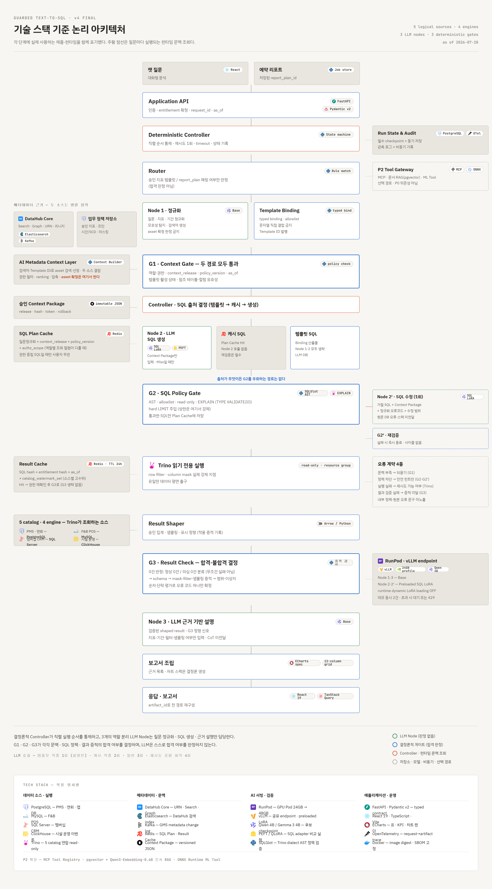
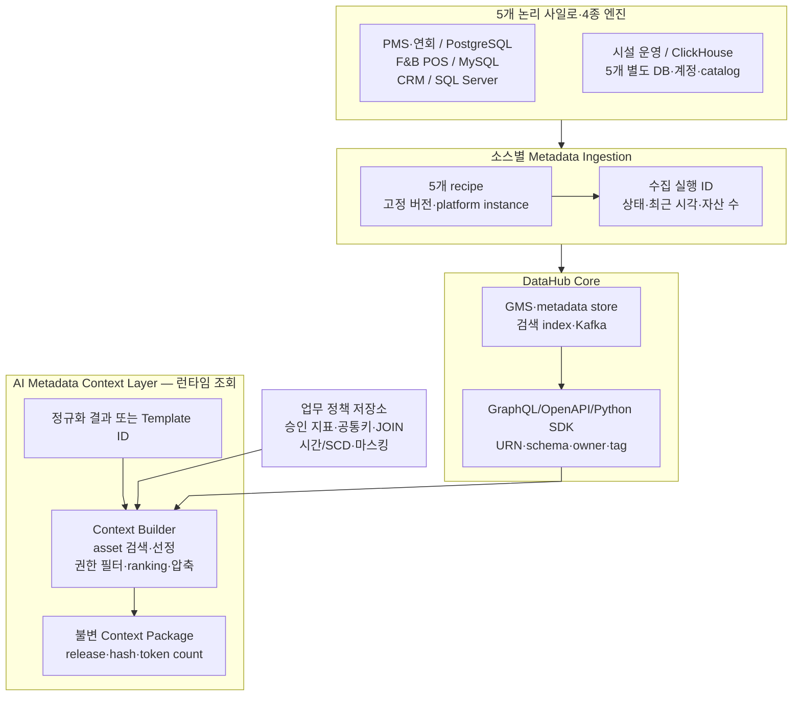

# DataHub Core 기반 대화형 데이터 분석·자동 리포팅 서비스 최종 기획서

| 항목 | 내용 |
|---|---|
| 문서 설명 | DataHub Core 기반 대화형 데이터 분석·자동 리포팅 서비스의 최종 기획서 |
| 문서 분류 | 일반 문서 |
| 버전 | v1.2 |
| 문서 기준일 | 2026-07-31 11:05 |
| 작성·수정 | 윤대성 / 3팀 사용자 요청·Codex 반영 |

> 문서 상태: 최종 기획서
> 문서 버전: v1.2 — 제품명·실행 일정·역할 편성·기술 스택 실측·개발 프로세스 章 정합성 보정
> 작성 기준일: 2026-07-31
> 적용 데이터: 워커힐 호텔 앤 리조트 운영 환경을 모사한 합성 데이터
> 대상 독자: 기획자, 데이터 엔지니어, AI 엔지니어, 프론트엔드·백엔드 개발자, 프로젝트 심사자

## 문서의 판단 표기

- **확정**: 본 기획의 입력 요구사항으로 고정된 범위와 원칙
- **가정**: 구현 계획을 구체화하기 위해 둔 전제이며 검증 결과에 따라 변경 가능
- **권고**: 현재 제약에서 가장 현실적인 우선안
- **추가 결정**: 비교·실측 또는 권한 있는 이해관계자의 승인이 필요한 항목

## 자주 쓰는 말을 쉽게 풀면

| 용어 | 이 문서에서 뜻하는 것 |
|---|---|
| Context Package | 질문에 답할 때 써도 되는 데이터·지표·JOIN·권한 정보를 한 묶음으로 정리한 것 |
| G1·G2·G3 | 각각 데이터 근거, SQL 안전성, 조회 결과를 확인하는 세 번의 검사 |
| Artifact | 질문·조건·출처·검증 결과를 함께 보관한 분석 결과물 |
| fixture | 같은 테스트를 반복할 수 있게 고정한 테스트 데이터 |
| trace | 한 요청이 Context·SQL·조회·결과·보고서를 거친 기록 |
| versioned | 누가 어떤 버전을 썼는지 다시 확인할 수 있게 버전 번호를 붙인 상태 |
| immutable | 승인 뒤 기존 내용을 고치지 않고, 바꿀 때 새 버전을 만드는 방식 |
| idempotency | 같은 요청이 여러 번 와도 결과를 한 번만 만드는 성질 |
| rollback | 문제가 생겼을 때 이전에 검증된 버전으로 되돌리는 절차 |
| Base·LoRA | Base는 기본 모델, LoRA는 SQL 생성 성능을 비교하기 위한 추가 학습 adapter |

---

## 1. 승인자용 프로젝트 요약

### 1.1 제품명과 한 문장 정의

본 제품의 정식 명칭은 **Answervice**이며, 모든 산출물·저장소·화면·API에서 이 이름을 사용한다. 2026-07-24 이전 산출물에 남아 있는 `SensePlace`(호텔 VOC·운영 지원 플랫폼)는 범위 전환 이전의 구형 명칭이며 현행 근거로 사용하지 않는다. 구형 제출본의 처리 상태는 `docs/markdown/02_WBS.md`에서 관리한다.

본 프로젝트는 DataHub Core를 5개 내외 사일로 데이터 소스의 **메타데이터 기준 시스템**으로 사용하고, 결정론적 Controller가 `질문 정규화 → 런타임 Context 조회 → SQL 출처 결정 → SQL 정책 검증 → 읽기 전용 실행 → 결과 증적 검증 → 근거 설명` 순서를 통제해 일반 사용자의 질문을 근거 있는 분석 결과와 반복 실행 가능한 보고서로 전환하는 프로젝트다.

### 1.2 핵심 가치

기업 데이터가 부서와 시스템별로 분리된 상황에서 원천 데이터를 먼저 전사 통합하는 대신, 다음 두 비용을 하나의 흐름으로 줄이는 것이 목표다.

1. 질문에 답할 데이터를 찾고 여러 시스템을 조회하는 탐색 비용
2. 조회 결과를 부서 횡단 보고서로 반복 취합하는 편집 비용

사용자는 데이터 위치와 SQL 문법을 몰라도 질문할 수 있어야 한다. 시스템은 답변과 함께 사용한 데이터셋·지표·필터·기간·기준 시각을 제시하고, 검증된 표·차트를 보고서 블록으로 재사용할 수 있어야 한다.

### 1.3 실행 범위와 우선순위

| 우선순위 | 이번 기획의 완료선 |
|---:|---|
| P0 | 런타임 Context 조회, G1·G2·G3, 읽기 전용 Text-to-SQL, Cache·Result Shaper, 결과·출처·차트, 챗↔보고서 왕복, 수동·스케줄 실행 |
| P1 | 5개 데이터 소스의 ingestion·카탈로그·커넥션 상태와 Context Layer 승인·버전 관리 |
| P2 후속 | MCP Tool 관리, 사내 운영 문서 RAG, ML-as-a-Tool은 I5 이후 별도 Gate로 착수하며 현재 P0/P1·I5 완료선에 포함하지 않음 |
| 후속 | 고객 360은 공통키·마스킹·권한·감사 준비 후 I5 이후 별도 단계로 구현하며 현재 P0/P1·I5 완료선에 포함하지 않음 |

워커힐 운영 환경은 실제 데이터가 아닌 합성 데이터로 모사하며, 특정 기업 성과를 주장하기 위한 사례가 아니라 이기종 데이터 연결 구조를 검증하기 위한 사례다.

### 1.4 성공의 정의

DataHub 설치나 화면 시연이 아니라, 다음 경로가 추적 가능하게 동작하는 것을 성공으로 본다.

```text
챗 질문 또는 저장된 report_plan_id
→ Router의 승인 템플릿·보고서 계획 매칭
→ Node 1의 질문 정규화 또는 결정론적 Template Binding
→ DataHub·업무 정책 기반 런타임 Context Package 구성
→ G1 Context Gate
→ 템플릿 SQL·SQL Plan Cache·Node 2 생성 SQL 중 출처 결정
→ G2 SQL Policy Gate
→ Result Cache 확인 또는 Trino 읽기 전용 실행
→ Result Shaper와 G3 Result Check
→ Node 3의 근거 기반 설명
→ 보고서 조립·artifact_id 저장
```

### 1.5 기술 적용 위치·도입 시점 요약

기술은 “사용 가능하다”는 이유로 동시에 도입하지 않는다. 각 기술의 적용 위치와 시작 조건을 다음과 같이 고정하고, 조건이 충족되지 않으면 다음 단계로 진행하지 않는다.

| 기술·기능 | 적용 위치 | 도입 시점·선행 조건 | 채택·확장 기준 |
|---|---|---|---|
| DataHub Core | 5개 소스·4종 엔진의 metadata ingestion·검색·자산 URN 제공 | 합성 schema와 5개 연결이 준비된 직후 | ingestion·API 검색·출처 trace 성공 |
| AI Metadata Context Layer | DataHub 자산에 지표·공통키·허용 JOIN·권한을 결합 | DataHub 자산 URN과 승인 주체가 정해진 뒤 | 대표 질문의 schema linking·JOIN 정확도 개선 |
| 역할 분리 sLLM | Node 1 질문 정규화, Node 2 SQL 생성·1회 수정, Node 3 근거 설명 | 역할별 입력·출력·평가 세트와 Gate 계약 확정 후 | 역할별 정확도와 전체 p95·VRAM·비용 충족 |
| 파인튜닝 비교 실험 | 동일 checkpoint의 baseline과 adapter 비교 | Context Package와 gold 평가 세트가 안정된 뒤 | 개선 여부와 무관하게 비교 결과를 남김 |
| 파인튜닝 제품 채택 | 반복되는 모델 원인 SQL 오류 개선 | metadata·정책·connector 오류를 먼저 제거한 뒤 | 정확도 개선, 안전·지연·비용 비열화 |
| SQL parser·정책 검증 | 생성 SQL과 실행 사이의 필수 통제 경계 | 첫 SQL 실행 전부터 | 허용·차단 fixture, Trino read-only·권한 테스트 통과 |
| Trino | 검증된 SQL로 5개 소스 읽기 | 5개 catalog·type mapping·읽기 계정 검증 후 | 단독 조회와 업무상 2~3개 소스 교차 조회 정확도·안정성 충족 |
| 선택적 배치 적재 | 반복되는 고비용 교차 조회의 최소 파생 데이터셋 | p95·scan·원본 부하 병목을 실측한 뒤 | 해당 질의의 안정성·비용 개선 |
| 보고서 스케줄 | 승인된 보고서 정의의 반복 실행 | 수동 실행과 부분 실패 처리가 안정된 뒤 | 동일 정의 버전의 재현 가능한 실행 |
| MCP Tool 관리·문서 RAG·ML Tool | P2 후속 Tool 확장 | I5 이후 별도 Gate 승인 시 | Tool별 권한·버전·오류·평가 계약 통과 |
| ONNX | P2 ML 모델의 서빙 형식 후보 | 모델·런타임·입출력 계약이 확정된 뒤 | 동일 품질에서 지연·메모리·운영성 개선 |
| 고객 360 | 후속 단계의 고객 단위 내부 분석 | I5 이후 공통키·중복 식별·마스킹·권한·감사 완료 후 | 별도 단계의 수용 기준과 일정을 승인 |

### 1.6 승인 시 확인할 핵심

| 승인 항목 | 본 기획의 답 |
|---|---|
| 핵심 차별점 | DataHub 자체가 아니라 승인·버전·token 제한을 가진 Context Layer와 SQL Guardrail, 분석 산출물의 보고서 재사용 |
| 데이터 구성 | 5개 논리 사일로, 4종 DB 엔진, 5개 DataHub recipe·Trino catalog |
| 실행 엔진 | Trino 잠정 확정; 단계 0에서 connector·type·read-only·2~3-source JOIN 검증 |
| AI 적용 | 모든 Node는 Base를 기준선으로 사용; 1회 비교 실험 뒤 제품 채택 Gate를 통과한 경우에만 사전 적재 SQL LoRA를 Node 2·2′에 적용 |
| 실행 통제 | 멀티 에이전트가 아닌 결정론적 Pipeline + 역할 분리 LLM Node 3개 + Gate 3개 |
| 시간·고객 의미 | 요청별 `as_of`·timezone 고정, CRM identity bridge와 event-time 등급 이력 사용 |
| 최대 병목 | full stack 자원 경합과 gold 120건 제작·검수 |
| 일정·인력 기준 | 5개 역할 트랙·10주 P0/P1 참조 일정, P2는 별도 |
| 운영 합격선 | role·mask·trace·retention·SCA·backup restore를 P0 수용 시험에 포함 |
| P2 | MCP Tool 관리, 사내 운영 문서 RAG, ML-as-a-Tool |

---

## 2. 문제 정의와 해결 논리

### 2.1 인과관계

```text
기업 데이터 사일로
  ├─ 질문의 답을 찾기 위해 여러 부서·시스템을 거쳐야 함
  │   └─ 메타데이터에 근거한 통제형 대화형 데이터 분석 Pipeline으로 해결
  └─ 부서 횡단 보고서를 사람이 반복 취합해야 함
      └─ 검증된 분석 결과를 재사용하는 자동 리포팅으로 해결
```

두 기능은 별도 제품이 아니다. 대화형 분석이 **근거 있는 분석 블록을 생성하는 앞단**이고, 자동 리포팅은 해당 블록을 **편집·승인·반복 실행하는 뒷단**이다. 따라서 질문, DataHub 자산, SQL, 검증 결과, 실행 결과, 시각화, 출처의 식별자가 보고서까지 유지되어야 한다.

### 2.2 현재 문제의 구조

- 데이터 위치와 의미를 찾기 위해 시스템 담당자와 데이터 담당자를 반복적으로 거친다.
- 동일 고객·예약 개념도 소스마다 식별자와 명칭이 달라 단순한 테이블 검색만으로는 조인할 수 없다.
- SQL을 작성할 수 있어도 소스별 방언, 접근권한, 기준 시각, 지표 정의를 동시에 맞춰야 한다.
- 분석 결과를 보고서에 옮기는 과정에서 질문 조건과 출처가 분리되어 재현성과 감사 가능성이 낮아진다.
- 정형 데이터의 수치와 정책 문서의 맥락이 서로 다른 경로에 있어 사용자가 직접 종합해야 한다.

### 2.3 해결 논리

1. DataHub Core가 소스별 스키마·설명·소유자·태그·기본 계보를 수집하고 검색 가능한 자산 식별자를 제공한다.
2. Router가 승인 템플릿·`report_plan_id`의 적중 여부만 결정하고, 적중하지 않은 질문은 Node 1이 지표·기간·검색어로 정규화한다.
3. AI Metadata Context Layer가 정규화 결과 또는 Template ID를 입력받아 DataHub와 업무 정책 저장소를 병렬 조회하고 승인 Context Package를 구성한다.
4. G1이 역할·권한·Context release·policy version·`as_of`·참조 자산의 유효성을 판정한다.
5. Controller가 템플릿 SQL, SQL Plan Cache, Node 2 생성 SQL 순으로 출처를 선택하고 모든 SQL을 G2로 보낸다.
6. G2가 AST, 접근권한, 허용 JOIN, 읽기 전용, `EXPLAIN`, hard LIMIT을 검사하고 실패 시 Node 2′에 한 번만 수정을 허용한다.
7. 검증된 SQL만 Trino에서 실행하며 row filter와 column mask를 조회 경계에서 실제 강제한다.
8. Result Shaper와 G3가 집계·샘플링·표시 상한과 schema·정책 증적·범위·이상치를 검증한다.
9. Node 3은 검증된 shaped result와 G3 신호만 설명하고, 결과·출처·조건을 하나의 artifact로 묶어 챗과 보고서가 왕복 사용한다.
10. P2에서는 문서 맥락 또는 예측이 필요한 질문에만 MCP로 등록된 RAG Tool과 ML Tool을 구분해 호출한다.

---

## 3. 목표와 범위

### 3.1 목표

| 목표 | 검증 가능한 상태 |
|---|---|
| 사일로 자산 탐색 | 5개 연결의 ingestion 성공, 소스별 자산 구분, DataHub API 검색 가능 |
| 근거 있는 대화형 분석 | 질문마다 데이터셋·지표·필터·기간·기준 시각과 실행 결과를 연결 |
| 안전한 Text-to-SQL | DataHub grounding, SQL AST 검증, 허용 JOIN·권한·읽기 전용·비용 정책 검사, 실행 결과 정확도 측정 |
| 부서 횡단 조회 | 5개 사일로에 배치된 4종 DB 엔진의 합성 데이터를 원본 이동 없이 조회 |
| 자동 리포팅 | 챗 결과를 보고서 블록으로 넣고 수동·스케줄 실행 후 실행 스냅샷 보존 |
| P2 수치와 맥락의 결합 | SQL 결과와 권한·버전이 확인된 문서 근거를 구분하여 제시 |
| 저지연 가능성 검증 | RunPod에서 동일 GPU type을 고정해 같은 checkpoint의 baseline과 fine-tuned 모델을 비교 |
| P2 확장 구조 검증 | 문서 RAG와 ML 모델을 Tool로 등록해 대화 중 호출하는 end-to-end 경로 재현 |

### 3.2 범위표

| 범위 | 우선순위 | 이번 프로젝트의 완료선 |
|---|---:|---|
| 메인 챗 | P0 | 자연어 질문부터 근거·표·차트까지의 읽기 전용 분석 흐름 |
| 자동 리포팅 | P0 | 제약형 grid 편집, AI 보조, 챗 왕복, 수동·스케줄 실행 |
| 데이터 카탈로그·커넥션 관리 | P1 | DataHub 자산 탐색과 5개 소스 상태 확인, API 사용 증명 |
| MCP Tool 관리 | P2 | SQL·문서·ML Tool의 메타정보, 활성 상태, 권한, 최근 실행 상태 |
| 사내 운영 문서 RAG | P2 | 유효·권한 있는 합성 문서 검색, 버전·기준 시점·인용 위치 표시 |
| ML-as-a-Tool | P2 | Feature Set부터 모델 Tool 호출까지 재현 가능한 1개 대표 경로 권고 |
| 고객 360 | 후속 | MVP와 분리하고 I5 이후 별도 Gate·일정으로 착수 |

---

## 4. 사용자와 핵심 사용자 시나리오

### 4.1 사용자별 책임과 요구

| 사용자 | 주요 목적 | 필요한 정보 | 허용 행동 |
|---|---|---|---|
| 현업 실무자 | 데이터를 찾아 질문하고 결과를 이해 | 표·차트, 지표 정의, 필터, 기간, 기준 시각, 부분 실패 | 질문, 후속 질문, 보고서에 담기 |
| 관리자 | 반복 보고서를 구성하고 실행 | 블록 출처, 실행 상태, 최신 실행 시각, 버전 | 블록 편집·승인, 수동 실행, 스케줄 설정 |
| 데이터·시스템 관리자 | 데이터 연결·권한·감사와 P2 Tool 관리 | ingestion, 자산, 유효 role, trace, Tool 스키마·버전·오류 | 커넥션·role mapping 확인, audit 조회, P2 Tool 활성화/비활성화 |
| 마케팅·CRM 사용자 | 고객 단위 내부 분석 | 마스킹된 프로필, 활동 이력, 파생 지표 | 후속 단계의 고객 360 조회·내부 분석 |

### 4.2 시나리오 A — 정형 데이터 분석

1. 실무자가 “이번 달 골드 회원의 객실 매출을 사업부별로 보여줘”라고 질문한다.
2. 에이전트가 DataHub API에서 관련 자산과 컬럼을 검색한다.
3. AI Metadata Context Layer가 CRM의 `customer_identity_map`과 `member_grade_history`, 매출 지표, 허용 JOIN, 요청 시작 시 고정한 기간 파라미터를 제공한다.
4. sLLM이 선택된 연합 쿼리 엔진의 SQL 방언으로 SQL을 생성한다.
5. SQL parser와 정책 검증기가 구문·참조 자산·권한·허용 JOIN·읽기 전용·실행 제한을 검사한다.
6. 검증된 SQL을 쿼리 실행 계층이 실행한다.
7. 사용자는 표·차트·설명과 함께 데이터셋, 지표, 필터, 기간, 기준 시각을 확인한다.
8. 사용자가 결과를 보고서에 담으면 분석 산출물 식별자와 출처가 함께 저장된다.

**수용 기준:** 화면에 표시된 출처 자산과 실제 실행 SQL의 소스가 일치하고, 같은 실행 스냅샷을 보고서에서 재현할 수 있다.

### 4.3 시나리오 B — 수치와 문서 맥락 결합(P2)

대표 질문은 “이번 달 골드 회원 객실 매출이 왜 줄었어?”다.

1. SQL Tool이 거래·투숙 발생 시점에 유효했던 등급을 기준으로 매출과 고객 수 변화를 조회한다.
2. 문서 Tool이 유효한 멤버십 정책 변경 문서를 검색한다.
3. 답변은 **관측된 수치**, **문서에 기록된 정책**, **두 근거를 바탕으로 한 해석**을 분리한다.

**사용 조건:** CRM 등급 이력이 겹치지 않는 유효기간으로 생성되고, 합성 데이터와 합성 문서에 해당 시점과 인과관계가 의도적으로 구성·검증된 경우에만 시연한다. 동시에 정책 변경 근거가 없는 반례 질문을 포함해, 시스템이 “매출 감소는 관측되지만 원인은 확인되지 않음”으로 답하는지 검증한다.

### 4.4 시나리오 C — 반복 보고서

1. 관리자가 주간 보고서 템플릿을 연다.
2. AI assistant에서 질문하거나 기존 챗 결과를 불러온다.
3. 미리보기에서 질문·필터·출처·기준 시각을 확인한다.
4. 승인 후 KPI·표·차트 블록을 12-column grid에 삽입한다.
5. 수동 실행으로 전체 블록을 검증한 후 주간 스케줄을 저장한다.
6. 실행 시 보고서 정의 버전과 결과 스냅샷을 분리해 보존한다.

**수용 기준:** AI가 승인 없이 기존 블록을 덮어쓰지 않으며, 실패 블록이 있어도 보고서 전체가 성공한 것처럼 표시되지 않는다.

### 4.5 시나리오 D — 다섯 번째 소스 온보딩

1. 기존 네 소스가 등록된 상태에서 다섯 번째 소스 ingestion recipe를 추가한다.
2. DataHub에서 새 소스의 자산과 소유자·도메인·태그가 구분되는지 확인한다.
3. DataHub API로 새 자산이 검색되는지 확인한다.
4. AI Metadata Context Layer에 필요한 공통키·지표·허용 JOIN을 승인 등록한다.
5. 동일 질문을 다시 실행하여 새 소스가 schema linking 후보와 실행 계획에 반영되는지 확인한다.

**수용 기준:** “DataHub에 보인다”에서 끝나지 않고, 새 자산의 DataHub 식별자가 생성 SQL의 catalog·schema·table 참조와 결과 출처로 연결된다.

---

## 5. 기능 우선순위와 요구사항

### 5.1 기능 우선순위표

| 우선순위 | 기능 | 필수 요구사항 | 완료 증거 |
|---:|---|---|---|
| P0 | 메인 챗 | 메타데이터 검색, SQL 생성·AST/정책 검증, 실행, 설명·표·차트·출처, 오류 유형 구분 | 대표 질문의 end-to-end 실행 기록 |
| P0 | 자동 리포팅 | 12-column 기반 블록 편집, AI 미리보기·승인, 챗 왕복, 수동·스케줄 실행, 버전 | 정의 버전과 실행 스냅샷이 남는 보고서 |
| P1 | 카탈로그·커넥션 | 5개 소스 상태, 최근 ingestion, 소유 조직, 자산 탐색, API 사용 | 소스별 ingestion 및 API 검증표 |
| P2 | MCP Tool 관리 | Tool 이름·설명·유형·버전·I/O 스키마·활성·권한·최근 오류 | SQL/RAG/ML Tool 레지스트리 화면과 호출 기록 |
| P2 | 문서 RAG | 유효·권한 필터, 문서명·버전·시점·인용 위치, SQL과 분리 종합 | 만료·권한 없음 문서 제외 테스트 |
| P2 | ML-as-a-Tool | Feature Set 버전, 기준 시점, 모델 변환·서빙·등록·호출, 예측 표시 | 동일 입력으로 재현되는 Tool 응답 |
| 후속 | 고객 360 | 공통키, 중복 식별, 마스킹, 접근권한, 감사 | I5 이후 별도 Gate에서 수용 기준 확정 |

### 5.2 공통 오류 계약

| 상태 | 의미 | 사용자 처리 | 기록 |
|---|---|---|---|
| 문맥 부족·질문 모호(G1) | 기간·지표·대상 또는 승인 자산이 확정되지 않음 | 필요한 조건만 재질문 | 질문, 정규화 결과, Context 후보 |
| 정책 차단(G2·G2′) | 지원 SQL 구조·권한·JOIN·비용 정책 위반 또는 수정 재실패 | 내부 정책을 노출하지 않는 안전한 사유·수정 힌트 | Gate·policy version·정규화 오류 코드 |
| 실행 실패(Trino) | 방언, timeout, connector 또는 source 오류 | 재시도 가능 여부와 실패 source 구분 | query ID, SQL hash, 안전한 실행 오류 코드 |
| 결과 증적 미달(G3) | schema·정책 적용 증적·범위·이상치 검사 실패 | 검증 실패로 종료하고 단정적 설명 금지 | G3 단계별 신호와 누락 증적 |
| 부분 실패 | 연합 조회 일부 또는 보고서 일부 블록 실패 | 성공·실패 결과를 분리 표시 | source·block별 상태 |
| 근거 부족 | 데이터 또는 문서가 결론을 지지하지 않음 | 단정하지 않고 추가 확인 필요 표시 | 사용 근거와 누락 항목 |

모든 오류 응답은 `trace_id`, 안전한 오류 코드, 수정 가능한 사용자 입력을 포함한다. 원문 DB 오류, 내부 정책 상세, stack trace, 모델 추론 과정은 사용자·Node 3에 노출하지 않는다.

---

## 6. AS-IS / TO-BE

| 관점 | AS-IS | TO-BE | 바뀌지 않는 책임 |
|---|---|---|---|
| 데이터 탐색 | 부서·시스템 담당자에게 위치와 의미를 문의 | DataHub 메타데이터와 승인 컨텍스트로 자산을 검색 | 자산 소유자와 접근 승인 책임 |
| SQL 작성 | 사용자가 소스별 스키마·방언을 직접 이해 | sLLM이 DataHub 문맥으로 연합 쿼리 SQL을 생성하고 parser·정책 검증기가 검사 | 원본 DB의 권한과 실행 제약 |
| 조인 | 담당자의 암묵지에 의존 | 승인된 공통키·JOIN만 사용 | 신규 관계의 검토·승인 |
| 결과 해석 | 수치와 기준을 별도로 확인 | 결과와 지표·필터·기간·기준 시각을 함께 표시 | 업무 판단의 최종 책임 |
| 보고서 | 여러 결과를 복사하고 주기마다 반복 작성 | 검증된 분석 블록을 재사용·재실행 | 게시·공유 전 사용자 승인 |
| 정책 맥락 | 운영 문서를 따로 검색 | SQL 수치와 RAG 문서 근거를 구분해 종합 | 문서 버전·권한 관리 |
| 모델 활용 | 모델이 시스템 내부에 고정 결합 | 버전과 I/O 계약을 가진 Tool로 호출 | 예측을 확정 사실로 보지 않음 |

---

## 7. 전체 논리 아키텍처

런타임 질문 경로와 메타데이터 준비 경로를 분리한다. 이 구분으로 DataHub ingestion과 실제 데이터 조회가 같은 실행 계층처럼 보이는 문제를 없애고, P2 Tool이 P0/P1 핵심 경로를 가리지 않도록 한다.

### 7.1 질문 실행·결과 활용 아키텍처



이 구조는 멀티 에이전트가 아니라 **결정론적 Pipeline + 역할 분리 LLM Node 3개 + Gate 3개**다. 역할 분리의 근거는 Node별 prompt, 입력·출력 schema, 평가 세트, 실패 모드가 서로 다르기 때문이다. 합격·불합격은 G1·G2·G3만 판정하고 LLM은 스스로 통과를 선언하지 않는다.

#### LLM Node

| Node | 책임 | 입력 | 책임이 아닌 것 |
|---|---|---|---|
| Node 1 — 질문 정규화 | 모호성 탐지, 지표·기간·검색어 구조화 | 사용자 질문, role, `as_of` | asset 확정, 권한·합격 판정 |
| Node 2 — SQL 생성 | 승인 Context Package로 Trino SQL 생성 | Context Package만 | 권한 판정, 실행 허용, 결과 계산 |
| Node 2′ — SQL 수정 | G2 거절 SQL을 승인 범위 안에서 1회 수정 | 거절 SQL, Context Package, 정규화 오류 코드, 수정 범위 | 원문 DB 오류·stack trace 처리, 반복 self-repair |
| Node 3 — 근거 기반 설명 | 검증된 결과를 지표·기간·필터·샘플링 여부와 함께 설명 | shaped result, G3 정형 신호 | SQL 정답 판정, CoT 수신, 수치 재계산 |

#### 결정론적 Gate

| Gate | 합격 판정 | 실패 처리 |
|---|---|---|
| G1 — Context Gate | 역할·권한, `context_release`, `policy_version`, `as_of`, 템플릿 활성 상태, 참조 테이블·컬럼 유효성 | 문맥 부족은 사용자 되묻기, 권한·비활성 자산은 안전 종료 |
| G2 — SQL Policy Gate | AST, allowlist, read-only, 승인 JOIN, 시간 함수, `EXPLAIN`, hard LIMIT | 정규화 오류 코드로 Node 2′ 수정 1회; 재검증 실패 시 종료 |
| G3 — Result Check | 정상·의심 0건 분류, schema, row filter·mask·샘플링 증적, 범위·이상치, 조건부 checksum | 증적 미달 사유와 `trace_id`를 반환하고 설명 Node 호출 금지 |

#### 실행 경로

- **템플릿 적중:** Router → Template Binding → 런타임 Context 조회 → G1 → 템플릿 SQL → G2 → 실행/캐시 → G3 → Node 3
- **SQL Plan Cache 적중:** Router → Node 1 → 런타임 Context 조회 → G1 → 캐시 SQL → G2 → 실행/캐시 → G3 → Node 3
- **일반 질문:** Router → Node 1 → 런타임 Context 조회 → G1 → Node 2 → G2 → 실행/캐시 → G3 → Node 3
- **SQL 수정:** 일반 경로의 G2 실패 → Node 2′ → G2′; 사이클 없이 한 번만 허용
- **예약 보고서:** 저장된 `report_plan_id`로 진입하고 활성 Template ID·Context release·권한·`as_of`를 다시 검증

DataHub Search·Graph와 업무 정책 저장소는 AI Metadata Context Layer의 병렬 입력이다. 런타임에는 Node 1의 정규화 결과 또는 Template ID가 검색을 촉발하며, Context Layer가 asset을 검색·선정해 승인 Context Package를 구성한다. P2 Tool Gateway는 Controller의 선택 경로이고, 비활성화되어도 P0 질문·보고서 경로는 완결된다.

### 7.2 메타데이터 준비 아키텍처



DataHub ingestion은 메타데이터 준비 파이프라인이고, Context Builder는 질문마다 실행되는 런타임 검색 계층이며, Trino는 실제 데이터 조회 파이프라인이다. DataHub와 Trino는 DataHub URN과 Trino의 `catalog.schema.table` 매핑으로만 연결한다.

### 7.3 배포 경계와 자원 축소 프로파일

DataHub Core quickstart만으로도 GMS·UI·Elasticsearch·MySQL·Kafka를 포함하고 공식 안내가 Docker 메모리 8GB 이상을 요구한다. 따라서 RunPod GPU Pod에는 vLLM 공유 endpoint와, 제품 채택 시 사용할 사전 적재 adapter만 두고 상태 저장 데이터 플랫폼과 분리한다. 기준선에서는 Node 1·2·2′·3 모두 Base를 사용한다. 비교 후 제품 채택 Gate를 통과한 경우에만 Node 2·2′가 SQL LoRA를 요청 단위로 선택하며 runtime dynamic adapter loading은 허용하지 않는다.

| 프로파일 | 기동 구성 | 사용 시점 | 완료로 인정되는 범위 |
|---|---|---|---|
| 전체 통합 | DataHub 전체 스택 + 5개 소스 DB + Trino + 애플리케이션 DB, RunPod는 별도 | 릴리스·중간 통합 검증 | 5개 ingestion, 5개 catalog, 2~3개 업무 JOIN, 장애 격리 |
| 표준 개발 | DataHub + Trino + 현재 시나리오에 필요한 2~3개 DB, 나머지 metadata는 유지 | 일상 개발·UI·SQL 정책 테스트 | 해당 시나리오만 인정하며 전체 통합 성공으로 보고하지 않음 |
| 분리 호스트 | DataHub host와 DB·Trino host를 물리 또는 VM 수준으로 분리 | 단일 장비의 RAM·I/O가 부족할 때 | 전체 통합과 동일하되 네트워크 지연·장애를 추가 측정 |

DataHub CLI ingestion은 GMS sink가 실행 중이어야 하므로 “CLI만 실행하고 DataHub를 끄는 방식”을 대안으로 보지 않는다. 전체 통합 프로파일이 실패하면 fixture를 줄여 성공으로 처리하지 않고, 호스트 분리 또는 메모리 증설을 먼저 결정한다.

### 7.4 계층별 책임

| 계층 | 책임 | 책임이 아닌 것 | 주요 인터페이스 |
|---|---|---|---|
| DataHub Core | metadata ingestion, 검색, 스키마·용어·소유자·태그·기본 계보 | 원천 데이터 저장, SQL 실행, 연합 조회 | DataHub API, 자산 URN |
| AI Metadata Context Layer | 정규화 결과·Template ID 기반 asset 검색, 승인 지표·공통키·JOIN·정책 결합, 권한 필터, ranking·압축·버전 | DataHub schema 복제 저장, LLM의 asset 자유 선택 | DataHub URN 기반 Context Package |
| Deterministic Controller | 직렬 실행 순서, SQL 출처 선택, timeout, 상태, 오류 계약, 수정 1회 상한 | 자연어 생성, 자율 Tool 계획 | request state, checkpoint, error code |
| Router·Template Binding | 승인 템플릿·report plan 매칭, typed parameter binding | 합격 판정, 문자열 직접 SQL 결합 | Template ID, bound SQL, route type |
| 역할 분리 LLM Node | 질문 정규화, SQL 생성·1회 수정, 근거 설명 | 권한·Gate 판정, SQL 실행, 수치 재계산 | 역할별 typed request/response |
| G1·G2·G3 | Context·SQL 정책·결과 증적의 합격 판정과 즉시 종료 | 자유 self-review, 모델 추론 신뢰 | gate result, normalized error code |
| SQL·Result Cache | 승인 SQL plan과 권한별 shaped result 재사용, version·watermark 기반 무효화 | Gate 우회, 권한이 다른 결과 공유 | cache key, stored evidence |
| Trino | 5개 catalog의 읽기 전용 조회, row filter·column mask, resource group, timeout | 메타데이터 기준 시스템 | Trino SQL, query ID, plan/result/error |
| Result Shaper | 승인 집계·샘플링·표시 상한 적용과 증적 생성 | 원시 대량 row의 모델 전달 | shaped result, sampling evidence |
| 애플리케이션 DB | Context 승인본, 보고서 정의, artifact, audit 저장 | 업무 원천 데이터 저장 | versioned records |
| 분석 산출물 | 질문·DataHub 자산·SQL·검증 결과·실행 결과·출처·시각화 사양의 연결 | 원본 데이터 영구 저장소 | artifact ID, snapshot ID |
| P2 MCP/RAG/ML | Tool 계약·상태, 유효 문서 인용, 버전 명시 예측 | P0 SQL 경로의 필수 의존성 | MCP tool call/result |

### 7.5 핵심 추적 식별자

한 요청에는 최소 `conversation_id`, `request_id`, `user_id`, `entitlement_hash`, `route_type`, `as_of`, `time_policy_version`, `context_release`, `template_id` 또는 `sql_plan_cache_key`, `sql_generation_model_version`, `sql_policy_version`, `g1_result`, `g2_result`, `query_execution_id` 또는 `result_cache_key`, `g3_result`, `artifact_id`가 연결되어야 한다. 보고서에는 `report_definition_version`, `report_plan_id`, `report_run_id`를 추가한다. 필수 checkpoint는 동기로 저장하고 세부 관측 로그는 비동기로 기록한다.

---

## 8. DataHub Core와 쿼리 계층

### 8.1 역할 경계

DataHub Core는 메타데이터 기준 시스템이다. 오픈소스 Analytics Agent가 이미 자연어→SQL→실행→차트, DataHub context, 다중 connection, multi-turn, Tool toggle을 제공하므로 **동일 문제 영역**임을 인정한다. 다만 실행 계층·모델 운영·상태 제어·안전 계약이 다르므로 “동일 기능 복제”로 축소하지 않는다.

| 기능 단위 | DataHub Analytics Agent | 본 프로젝트의 추가 책임 | 처리 방향 |
|---|---|---|---|
| 자연어→SQL→결과→차트 | 제공 | 동일 문제를 5-catalog 연합 조회와 보고서 재사용 계약으로 해결 | 비교 baseline으로 사용 |
| DataHub schema·업무 문맥 활용 | 제공 | 승인된 지표·공통키·JOIN·권한을 불변 버전으로 패키징 | Context Layer로 검증 |
| 쿼리 실행 | Snowflake·BigQuery·PostgreSQL·MySQL 등 개별 connection과 SQLAlchemy 계열 엔진 제공 | Trino 5개 catalog 간 이기종 교차 조회 | 연합 실행 계층이 차별점 |
| LLM 운영 | Anthropic·OpenAI·Google·Bedrock와 OpenAI-compatible endpoint 지원 | RunPod sLLM의 checkpoint·GPU·adapter·비용을 직접 통제하고 비교 | 자체 호스팅 가능 여부가 아니라 실험·운영 계약이 차이 |
| 실행 제어 | LangGraph ReAct graph | Deterministic Controller와 G1·G2·G3의 고정 상태 전이·실패 분기 | 자유 Tool 선택과 자율 루프를 사용하지 않음 |
| 실행 전 안전 통제 | Agent 실행 흐름에 포함 | SQLGlot AST, DataHub 자산 대조, Trino read-only·resource group·EXPLAIN을 독립 게이트로 강제 | 핵심 차별점 |
| 결과 재사용 | 대화·차트 제공 | `artifact_id`로 챗↔보고서 왕복, 정의 버전·실행 스냅샷 분리 | 핵심 차별점 |
| Context 품질 개선 | context quality와 write-back 기능 제공 | 승인 주체·token budget·압축·회귀 평가를 명시 | 운영 계약 추가 |
| MCP·문서·ML Tool | DataHub MCP와 Tool toggle 제공 | P2에서 필요한 Tool만 버전·권한·오류 계약으로 등록 | 핵심 범위와 분리 |

Analytics Agent를 fork하는 것을 전제로 하지 않는다. 단계 0에서 동일 질문 세트로 기능 중첩을 확인하고, Context Package·Guarded 검증·Trino 연합 조회·보고서 artifact가 독립적인 기여로 남는지 확인한다.

### 8.2 5개 사일로·4종 엔진 권고 구성

**권고 변경:** 5개 업무 사일로와 5개 connection은 유지하되, 엔진 종류는 PostgreSQL·MySQL·SQL Server·ClickHouse의 **4종**으로 둔다. 숫자를 채우기 위한 유사 엔진 추가보다 방언·타입·connector 차이를 검증하고, 다섯 번째 사일로는 별도 PostgreSQL DB·계정·catalog로 격리한다.

2026-07-28 기준 DataHub는 네 엔진의 ingestion source를 제공하고, Trino 483 문서는 네 connector를 모두 제공한다. 정확한 이미지 digest·DB 버전·드라이버는 단계 0에서 고정한다.

| 논리적 사일로 | 합성 데이터 | 권고 엔진 | 배치·커넥션 방식 | 분리 목적 |
|---|---|---|---|---|
| PMS | 예약, 객실, 투숙, 요금 | PostgreSQL | PMS 전용 인스턴스·DB·읽기 계정·ingestion recipe | 표준 RDB와 예약·투숙 관계 |
| F&B POS | 주문, 매장, 상품, 결제 | MySQL | POS 전용 인스턴스·DB·읽기 계정·recipe | 거래형 데이터와 MySQL 방언 |
| 멤버십 CRM | 고객, 등급, 포인트 | Microsoft SQL Server | CRM 전용 인스턴스·DB·읽기 계정·recipe | `member_no`와 SQL Server 방언 |
| 시설 운영 | 시설 이용, 점검, 장애 | ClickHouse | 시설 이벤트 전용 인스턴스·DB·읽기 계정·recipe | 분석형 조회·타입·집계 차이 |
| 연회·매출 | 연회 예약, 상품, 매출 | PostgreSQL | PMS와 분리된 DB·계정·catalog·recipe | 같은 엔진에서도 connection·업무 책임 격리 |

이 안은 **4개 엔진 런타임, 5개 논리 DB, 5개 자격증명, 5개 ingestion recipe, 5개 Trino catalog**를 사용한다. 각 사일로는 DataHub `platform_instance`와 Trino catalog로 구분한다. DataHub Core의 Apache 2.0 라이선스가 SQL Server 이미지·드라이버의 사용 조건까지 포괄하지 않으므로 개발·시연 조건은 별도 확인한다.

### 8.3 “커넥션 등록”의 정확한 전제

새 소스를 연결할 때 다음 조건이 충족된 경우에만 설정 중심 온보딩이 가능하다.

1. 해당 DB 엔진용 DataHub ingestion과 쿼리 커넥터·드라이버가 목표 버전에서 지원된다.
2. 인증정보와 네트워크 경로가 구성되어 있다.
3. SQL 방언과 데이터 타입 차이가 매핑되어 있다.
4. 원본 DB의 읽기 권한과 제품 내 데이터 접근권한이 승인되어 있다.
5. 공통키·지표·허용 JOIN이 AI Metadata Context Layer에 등록되어 있다.

새 엔진은 별도 커넥터 또는 어댑터 개발이 필요할 수 있으며, 이는 설정만으로 완료된다고 약속하지 않는다.

### 8.4 연합 쿼리 엔진 선택

**잠정 확정:** 연합 쿼리 엔진은 Trino를 사용한다. 현재 공식 connector 목록이 PostgreSQL·MySQL·SQL Server·ClickHouse를 모두 포함하고, catalog 간 조회, `EXPLAIN`, access control, resource group을 한 경로에서 적용할 수 있기 때문이다. 단계 0은 다른 엔진을 넓게 비교하는 단계가 아니라 다음 go/no-go를 검증하는 단계다.

- 5개 catalog의 연결과 타입 매핑
- 2~3개 catalog 간 업무 JOIN과 predicate·aggregation pushdown
- `read-only` system access control과 catalog·table·column 규칙
- source별 읽기 전용 계정, timeout, 결과 행 수, 동시 실행 제한
- `EXPLAIN (TYPE VALIDATE|IO)`와 query ID 기반 실행 추적

SQLGlot AST 검증만으로 안전성을 보장하지 않는다. Trino 자체를 `read-only`로 구성하고, 원천 DB 계정도 읽기 전용으로 제한한다. connector의 procedure·passthrough query와 `system` catalog는 일반 사용자 경로에서 차단한다.

Trino go/no-go 실패 시 되돌림은 다음처럼 고정한다.

1. 단일 connector·타입 문제면 해당 소스의 엔진을 검증된 엔진으로 교체하거나, 승인된 최소 컬럼만 PostgreSQL staging catalog에 적재해 Trino SQL 계약을 유지한다. staging 사용은 원본 연합 조회와 분리 표기한다.
2. 다수 connector 또는 Trino 자체의 안정성·권한 통제가 실패하면 교차 소스 P0를 중단한다. 앱 내부 federation을 임시 구현하지 않고, 쿼리 엔진 결정과 함께 SQL 방언·SQLGlot 정책·gold SQL을 다시 승인한다.

### 8.5 5개 소스·4종 엔진 검증 게이트

| 게이트 | 엔진별 검증 | 5개 소스 통합 검증 | 실패 처리 |
|---|---|---|---|
| 기동 | 고정 이미지·버전으로 재기동 | 정해진 순서 없이 health 확인 | 실패 엔진 이미지·버전 재선정 |
| DataHub ingestion | schema·table·column·owner·tag 수집 | 5개 platform instance 자산 분리 | recipe·driver 수정 후 재수집 |
| 쿼리 연결 | 읽기 계정, 타입·방언, limit | Trino에서 5개 catalog 조회 | connector 설정 또는 엔진 배치 재검토 |
| 교차 소스 JOIN | 단일 소스 결과 기준값 확인 | 2개·3개 catalog 업무 JOIN | 실패 조합과 타입 mapping 보완 |
| 정책 | 쓰기 차단, timeout, 결과 제한 | 소스 하나의 거부가 전체 권한을 우회하지 않음 | 실행 중단·부분 실패 계약 적용 |
| 자원 | idle·단일 질의 CPU/RAM/디스크 | DataHub·5 DB·Trino·앱 동시 부하 | full profile 실측, 불안정 시 split-host; 축소 dev profile은 수용 시험에 사용하지 않음 |
| 재현성 | seed·schema version 재적재 | 전체 환경 재생성 후 동일 결과 | 이미지 digest·seed·DDL 고정 |

전체 통합 프로파일에서는 5개 source가 동시에 조회 가능해야 하지만, 모든 질문에 5-way JOIN을 강제하지 않는다. 업무 시나리오는 실제 연관성이 있는 1~3개 source만 사용하며, 다섯 source의 연결 상태와 장애 격리는 별도 smoke test로 확인한다.

### 8.6 연합 조회와 배치 적재 경계

기본값은 원본 이동 없는 연합 조회다. 다음 현상이 실측된 구간만 배치 적재 후보로 전환한다.

- 동일한 대용량 교차 소스 조인이 보고서마다 반복된다.
- pushdown이 되지 않아 스캔량 또는 실행시간 제한을 지속적으로 초과한다.
- 소스별 기준 시각 차이 때문에 재현 가능한 보고서 스냅샷을 만들기 어렵다.
- 원본 시스템의 동시 조회 제한으로 스케줄 실행 안정성을 확보하지 못한다.

배치 후보가 되더라도 전사 정비로 확대하지 않고, 해당 보고서·지표에 필요한 최소 파생 데이터셋만 대상으로 별도 의사결정을 거친다.

### 8.7 DataHub 활용 시연 시나리오

| 단계 | 시연 내용 | 증거 |
|---:|---|---|
| 1 | 5개 recipe 실행 | 소스별 ingestion 실행 ID·상태·최근 시각 |
| 2 | DataHub에서 자산 탐색 | 소스, 스키마, 테이블, 컬럼, owner, domain, tag |
| 3 | API 검색 | 질문 키워드로 반환된 자산 URN과 필드 |
| 4 | Context 결합 | URN에 연결된 지표·공통키·허용 JOIN·방언·정책 버전 |
| 5 | SQL 생성·검증 | 사용한 자산 URN이 SQL의 catalog·schema·table과 정책 검증 근거에 포함 |
| 6 | SQL 실행 | DataHub에서 선택한 소스와 실제 실행 SQL catalog가 일치 |
| 7 | 결과 출처 | 표·차트에서 데이터셋·기간·기준 시각 확인 |
| 8 | 소스 온보딩 | 다섯 번째 소스 추가 후 API 검색부터 질문 반영까지 재현 |

---

## 9. DataHub 기반 Guarded Text-to-SQL

### 9.1 목적

DataHub 도입 목적은 SQL 표현력을 제한하는 것이 아니라, 관련 데이터셋·컬럼·업무 용어를 더 정확히 찾아 **Text-to-SQL의 schema linking과 의미 정확도를 높이는 것**이다. 따라서 주 경로에서는 별도 커스텀 DSL을 필수로 두지 않고, sLLM이 선택된 연합 쿼리 엔진의 SQL 방언을 직접 생성한다.

다만 “SQL을 자유롭게 생성한다”와 “아무 SQL이나 실행한다”는 구분한다. 생성 SQL은 parser 기반 구조 검사와 정책 검증을 모두 통과해야 하며, 검증되지 않은 SQL과 쓰기 쿼리는 실행하지 않는다.

### 9.2 AI Metadata Context Layer 상세 설계

Context Layer는 DataHub의 schema를 복제하는 저장소가 아니라, DataHub URN에 **승인된 업무 의미와 실행 정책을 연결하고 질문별 package를 만드는 계층**이다.

#### 저장 구조

| 레코드 | 핵심 필드 | 승인 책임 |
|---|---|---|
| `asset_binding` | DataHub URN, Trino `catalog.schema.table`, source version, active | 데이터 엔지니어 |
| `metric_definition` | metric ID, 이름·설명, source field, aggregation, time field, owner | 업무 데이터 steward |
| `time_policy` | timezone, calendar ID, 기간 경계 규칙, `as_of` 결정 방식, 허용 시간 함수 | 업무 데이터 steward + 데이터 엔지니어 |
| `dimension_history_policy` | dimension URN, business key, value field, `valid_from`·`valid_to`, event-time join 규칙 | CRM owner + 데이터 엔지니어 |
| `join_policy` | 좌·우 URN·field, cardinality, null 처리, 유효기간, 상태 | 데이터 엔지니어 + source owner |
| `term_alias` | 사용자 용어, 표준 용어, DataHub glossary term·asset URN | 업무 데이터 steward |
| `column_policy_ref` | column URN, sensitivity, masking·role policy ID | source owner·권한 관리자 |
| `context_release` | 포함 레코드 버전, approver, published_at, hash, rollback target | 프로젝트 데이터 책임자 |

레코드는 애플리케이션 PostgreSQL에 저장하고 DataHub URN을 외래 참조로 사용한다. 승인본은 불변 버전으로 publish하며 수정은 새 버전으로만 반영한다.

#### DataHub 검색 결과에서 Context Package를 만드는 규칙

1. Node 1의 정규화 결과 또는 Router의 Template ID를 런타임 검색 입력으로 사용한다. Node 1은 후보 검색어를 만들지만 asset을 확정하지 않는다.
2. 사용자 role과 domain으로 자산을 먼저 필터링해 권한 없는 자산은 LLM 입력에 넣지 않는다.
3. DataHub 상위 후보에서 schema·description·glossary·owner를 읽고 `asset_binding`이 없는 자산은 실행 후보에서 제외한다.
4. 상대 기간을 요청 시작 시각의 `time_policy`로 절대 기간과 `as_of`에 변환하고, 등급처럼 변하는 dimension은 `dimension_history_policy`의 event-time 규칙을 결합한다.
5. 승인 metric과 1~2 hop 안의 `join_policy`를 결합하고, 질문과 무관한 컬럼을 제거한다.
6. 시간·권한 정책→지표→dimension 이력→JOIN→선택 테이블·컬럼→설명→예시 쿼리 순으로 우선순위를 둔다.
7. 초기 상한은 **최대 8개 dataset, 60개 column, `min(6,000 tokens, 모델 유효 context의 25%)`**로 두고 평가 결과로 조정한다. 시간·권한·JOIN 정책은 잘라내지 않으며 초과 시 자산 후보를 줄이거나 사용자에게 범위를 재질문한다.
8. 최종 package에 `context_release`, `policy_version`, `time_policy_version`, `entitlement_hash`, `route_type`, `template_id` 또는 정규화 질문 ID, `token_count`, source URN, Trino FQN, hash를 기록한다.

#### 대표 질문의 Context Package 예시

```json
{
  "context_version": "ctx-2026-07-28.1",
  "policy_version": "sql-policy-3",
  "question": "이번 달 골드 회원의 객실 매출을 보여줘",
  "execution_time": {
    "as_of": "2026-07-28T00:00:00+09:00",
    "timezone": "Asia/Seoul",
    "calendar_id": "gregorian-kr",
    "period_start": "2026-07-01T00:00:00+09:00",
    "period_end_exclusive": "2026-07-28T00:00:00+09:00"
  },
  "user_scope": {
    "role": "hotel_analyst",
    "allowed_domains": ["pms", "membership"]
  },
  "assets": [
    {
      "urn": "urn:li:dataset:(urn:li:dataPlatform:postgres,pms.reservations,PROD)",
      "trino_fqn": "pms.public.reservations",
      "columns": ["reservation_id", "guest_id", "stay_date", "room_revenue"]
    },
    {
      "urn": "urn:li:dataset:(urn:li:dataPlatform:mssql,crm.customer_identity_map,PROD)",
      "trino_fqn": "crm.dbo.customer_identity_map",
      "columns": ["member_no", "pms_guest_id"]
    },
    {
      "urn": "urn:li:dataset:(urn:li:dataPlatform:mssql,crm.member_grade_history,PROD)",
      "trino_fqn": "crm.dbo.member_grade_history",
      "columns": ["member_no", "grade_code", "valid_from", "valid_to"]
    }
  ],
  "metrics": [
    {
      "id": "room_revenue",
      "field": "pms.public.reservations.room_revenue",
      "aggregation": "sum",
      "time_field": "pms.public.reservations.stay_date"
    }
  ],
  "joins": [
    {
      "left": "pms.public.reservations.guest_id",
      "right": "crm.dbo.customer_identity_map.pms_guest_id",
      "cardinality": "many_to_one",
      "status": "approved"
    },
    {
      "left": "crm.dbo.customer_identity_map.member_no",
      "right": "crm.dbo.member_grade_history.member_no",
      "cardinality": "one_to_many_temporal",
      "status": "approved"
    }
  ],
  "dimension_rules": [
    {
      "dimension": "membership_grade",
      "value": "crm.dbo.member_grade_history.grade_code",
      "event_time": "pms.public.reservations.stay_date",
      "validity": "valid_from <= event_time AND (valid_to IS NULL OR event_time < valid_to)"
    }
  ],
  "limits": {
    "read_only": true,
    "max_rows": 1000,
    "timeout_seconds": 30
  },
  "token_count": 1580
}
```

이 JSON은 LLM 출력 형식이 아니라 **LLM 입력과 감사 근거**다. “이번 달”의 기본값은 `time_policy`가 정한 month-to-date `[월 시작, as_of)`이며 모델이 임의 해석하지 않는다. “골드 회원”의 기본 의미는 **매출이 발생한 시점에 유효했던 등급**이며, 현재 등급을 묻는 질문은 별도 의도로 처리한다. SQL 생성 후 사용된 자산·컬럼·JOIN·시간 파라미터가 package와 일치하는지 AST에서 다시 확인한다.

### 9.3 처리 흐름

```text
자연어 질문 또는 report_plan_id
  → Application API에서 인증·entitlement·request_id·as_of 확정
  → Router에서 승인 템플릿/report plan 적중 여부 판단
  → Node 1 질문 정규화 또는 결정론적 Template Binding
  → DataHub Search·Graph + 업무 정책 저장소 런타임 조회
  → 승인 Context Package 구성
  → G1 Context Gate
  → Controller가 템플릿 → SQL Plan Cache → Node 2 생성 순으로 SQL 출처 선택
  → G2 SQL Policy Gate
     └─ 실패 시 Node 2′ 수정 1회 → G2′, 재실패 시 종료
  → Result Cache 적중 여부 확인
     ├─ Hit: entitlement 재확인 후 저장된 shaped result·증적을 G3로 전달
     └─ Miss: Trino 읽기 전용 실행 → Result Shaper → G3
  → Node 3 근거 기반 설명
  → 결정론적 차트 spec·근거 목록 조립
  → artifact_id로 응답·보고서 저장
```

4종 원천 엔진의 SQL을 모델이 각각 작성하게 하지 않고 Trino의 단일 SQL 방언을 목표로 한다. 원천별 방언·타입·pushdown은 검증된 connector와 실행 계층의 책임으로 둔다.

#### 경로별 LLM 호출 상한

| 경로 | LLM 호출 | 설명 |
|---|---:|---|
| 템플릿 적중 | 1회 | Node 1·2를 생략하고 Node 3만 호출 |
| SQL Plan Cache 적중 | 2회 | Node 1과 Node 3 호출 |
| 일반 질문 | 3회 | Node 1·2·3 호출 |
| G2 수정 포함 최악 경로 | 4회 | Node 2′ 수정 1회를 추가 |

데모 동시 실행은 2건으로 제한하고 초과 요청은 대기 또는 `429`로 반환한다. 고정 호출은 요청 단위 continuous batching으로 처리하되, 의존 단계의 LLM 호출을 억지로 병렬화하지 않는다.

#### 캐시 계약

- SQL Plan Cache key는 질문 정규화, `context_release`, `policy_version`, 필요 시 `authz_scope`를 포함한다. 권한 중립 SQL만 사용자 공통으로 재사용한다.
- Result Cache key는 `sql_hash`, `entitlement_hash`, `as_of`, `catalog_watermark_set`, 적용된 row filter·mask를 포함한다.
- Result Cache에는 shaped result와 G3 재검증에 필요한 증적을 함께 저장한다.
- Template·SQL Plan Cache는 G1·G2를 통과한다. Result Cache는 G2 통과 뒤에만 확인하며, Hit여도 인증·entitlement와 G3를 다시 확인한다.
- `catalog_watermark_set`은 이기종 5개 source의 완전한 동시 snapshot을 주장하지 않고, source별 고수위·기준 시각의 집합으로 기록한다.

### 9.4 SQL 표현 범위

| 구조 | 기본 처리 | 검증 기준 |
|---|---|---|
| `SELECT`·집계·필터·정렬 | 허용 | DataHub 자산·필드 존재, 사용자 권한 |
| CTE·서브쿼리 | 허용 후보 | parser 지원, 중첩·실행비용 제한 |
| JOIN | 허용 | Context Layer의 승인 관계 우선, key·cardinality·source 확인 |
| 윈도 함수 | 허용 후보 | 함수 allowlist와 결과·비용 검증 |
| 날짜·문자·수치 함수 | 허용 후보 | 목표 쿼리 엔진 함수 allowlist |
| `LIMIT` | 필수 적용 | 정책 상한 이하 |
| DML·DDL·프로시저·외부 함수 | 차단 | AST node와 statement type 검사 |

구체적인 함수 allowlist와 복잡도 상한은 대표 질문 커버리지와 실행비용 baseline을 측정한 뒤 확정한다. SQL 문자열 정규식만으로 안전성을 판단하지 않고 parser가 만든 AST를 기준으로 검사한다.

### 9.5 실행 전 검증 순서

1. **G1 Context Gate:** `as_of`, timezone, 달력, 기간 경계, role·entitlement, Context release, policy version, 템플릿 상태, 참조 자산·컬럼 유효성 확인
2. **G2 SQL Policy Gate:** 단일 statement, read-only, catalog·schema·table·column, JOIN key·cardinality, dimension 유효기간, 금지 함수·연산, hard LIMIT 확인
3. SQLGlot AST 검사 후 Trino `EXPLAIN (TYPE VALIDATE|IO)`로 계획·I/O 검사
4. G2 실패 시 거절 SQL, Context Package, 정규화 오류 코드, 수정 범위만 Node 2′에 전달하고 한 번만 수정
5. G2′ 재검증에 실패하면 사이클 없이 종료
6. 검증된 parameter와 SQL만 Trino에서 실행하고 row filter·column mask를 조회 경계에서 강제
7. Result Shaper가 승인 집계·샘플링·표시 상한을 적용하고 적용 증적을 기록
8. **G3 Result Check:** 정상·의심 0건 분류, schema, mask·filter·sampling 증적, 범위·이상치를 순차 단락 평가
9. checksum·재현성 검사는 승인 보고서 재실행처럼 비교 기준이 있을 때만 적용

앞 단계가 실패하면 뒤 단계로 진행하지 않는다. G3의 통과 여부는 정형 신호로만 결정하며 “SQL이 맞아 보이는가”와 같은 자유 self-review를 사용하지 않는다. Node 3에는 검증된 결과와 G3 신호만 전달하고 Node 2의 추론 과정은 전달하지 않는다.

### 9.6 DataHub의 기여 지점

| 단계 | DataHub 없이 | DataHub 적용 |
|---|---|---|
| schema linking | 제공된 schema 목록에 의존 | 검색·설명·domain·owner·tag로 관련 자산 선별 |
| 컬럼 선택 | 이름 유사도에 과도하게 의존 | 컬럼 설명과 업무 용어를 함께 사용 |
| 데이터 소스 선택 | prompt에 고정한 source에 의존 | 질문별 관련 platform instance·자산 URN 검색 |
| 결과 근거 | SQL 문자열 중심 | DataHub 자산·지표 정의·기준 시각 연결 |
| 신규 소스 | prompt와 예시를 직접 수정 | ingestion→API 검색→Context 반영 경로 검증 |

DataHub 효과는 동일 모델·질문 세트에서 `schema만 제공한 baseline`, `DataHub metadata 적용`, `DataHub + 승인 Context 적용`을 비교해 측정한다. 개선을 커스텀 DSL 컴파일러의 효과와 섞지 않는다.

### 9.7 사용자 노출

- 일반 사용자에게는 SQL보다 데이터셋·지표·필터·기간·JOIN 근거를 우선 표시한다.
- 권한 있는 데이터·시스템 관리자는 생성 SQL, AST 검증 결과, 실행계획과 오류를 확인할 수 있다.
- “SQL 보기”는 자유 SQL 편집·실행 콘솔로 확장하지 않는다.
- 사용자가 직접 입력한 SQL을 실행하는 기능은 이번 범위에 포함하지 않는다.

### 9.8 기대효과와 한계

| 기대효과 | 한계·비용 |
|---|---|
| DataHub metadata 품질이 SQL 선택 정확도에 직접 반영 | metadata가 부정확하면 생성 SQL도 잘못될 수 있음 |
| 고정 DSL보다 CTE·서브쿼리·윈도 함수 등 표현력 유지 | SQL AST·의미·비용 검증기 구현 필요 |
| Trino 한 방언으로 5개 source·4종 엔진 접근 | connector별 지원·pushdown 차이는 남음 |
| DataHub 적용 전후 정확도를 직접 비교 가능 | 실행 결과 정확도를 별도로 평가해야 함 |

---

## 10. sLLM 모델 전략과 RunPod 비교 실험

### 10.1 실험 목적

**확정:** sLLM 학습·평가·추론 실험 플랫폼은 RunPod를 사용한다. 특정 GPU를 사전 고정하지 않고 24GB profile을 먼저 측정한 뒤 OOM 또는 context 제약이 확인될 때만 48GB로 올린다.

실험 목적은 정확도 최대화가 아니라 **업무에 필요한 SQL 생성 정확도를 유지하면서 RunPod에서 비용·지연·VRAM이 균형 잡힌 단일 GPU profile을 찾는 것**이다. RunPod는 실행 플랫폼이고 GPU model은 별도 선택사항이므로, 정확한 GPU·지역·Cloud 유형·스토리지·CUDA 환경을 실험 기록에 고정한다.

### 10.2 sLLM 적용 위치와 책임 경계

MVP의 LLM 적용은 세 역할로 고정한다. 세 Node는 자율 계획·Tool 선택·무제한 루프가 없으므로 독립 에이전트라고 부르지 않는다.

| Node | sLLM 역할 | 결정론적 대체·통제 | 역할별 실패 모드 |
|---|---|---|---|
| Node 1 | 질문의 지표·기간·검색어 정규화와 모호성 탐지 | Router, DataHub Search, Context Layer, G1 | 잘못된 의도·검색어, 필요한 되묻기 누락 |
| Node 2·2′ | 승인 Context Package 기반 Trino SQL 생성과 1회 수정 | G2, SQLGlot, Trino `EXPLAIN`, 수정 상한 | source·field·JOIN·syntax·dialect 오류 |
| Node 3 | 검증된 shaped result의 근거 기반 설명 | G3, 결정론적 근거 목록·차트 spec | 근거 누락, 과도한 인과 단정, 수치 왜곡 |

다음 작업은 LLM에 맡기지 않는다.

- DataHub asset 최종 선정과 Context Package 승인
- 권한·허용 JOIN·SQL·결과의 합격 판정
- SQL 실행과 row filter·column mask 적용
- 결과의 집계·샘플링·수치 계산
- 보고서 저장·스케줄·감사 checkpoint

Node별 prompt, typed I/O schema, 평가 세트, 로그를 분리한다. Node 2의 추론 과정은 Node 3에 전달하지 않고, Node 3은 G3가 통과한 shaped result만 설명한다.

### 10.3 RunPod 실행 구조

| 용도 | RunPod 방식 | 권고 | 이유 |
|---|---|---|---|
| 후보 모델 점검·파인튜닝 | GPU Pod | 단일 GPU On-Demand Pod | SSH/Jupyter·custom container·학습 로그 관리에 적합 |
| baseline/fine-tuned 비교 | 동일 GPU Pod 또는 같은 GPU profile의 별도 Pod | GPU model·CUDA·image digest 고정 | 하드웨어 차이가 정확도·지연 비교에 섞이지 않게 함 |
| 모델·dataset·checkpoint | volume disk 또는 network volume | `/workspace` 저장 후 외부 백업 | container disk와 Pod 종료에 따른 유실 방지 |
| 데모 추론 | GPU Pod 우선 | benchmark와 같은 GPU로 시작 | cold start·fallback GPU 변수를 줄임 |
| 후속 API 서빙 | RunPod Serverless 선택 검토 | 모델 확정 후 별도 결정 | autoscaling 장점과 cold start·GPU fallback 변수를 비교 |

RunPod 공식 문서상 container disk는 Pod 중지·재시작 시 유실될 수 있고, volume disk는 Pod lease 동안, network volume은 Pod와 독립적으로 유지된다. network volume은 지역에 따라 GPU 선택을 제한할 수 있으므로 GPU 가용성과 storage 위치를 함께 결정한다. checkpoint는 Pod 내부에만 두지 않고 실험 종료 전에 별도 백업한다.

데모 서빙은 **RunPod의 공유 vLLM endpoint 1개**를 사용한다. 기준선에서는 Node 1·2·2′·3 모두 같은 Base를 사용한다. 1회 비교 뒤 제품 채택 Gate를 통과한 경우에만 Node 2·2′가 사전 적재 SQL LoRA를 요청 단위로 선택한다. runtime dynamic LoRA loading은 비활성화하고 채택 adapter 목록과 revision을 container image에 고정한다. SQL adapter를 Node 1·3에 적용하지 않아 질문 해석·설명 평가가 파인튜닝의 영향을 받지 않게 한다. 데모 동시 실행은 2건으로 제한하며 초과 요청은 대기 또는 `429`로 처리한다.

### 10.4 GPU profile 선정

2026-07-28 확인 기준 RunPod는 16GB, 24GB, 48GB, 80GB 이상 GPU 후보군을 제공한다. 가격과 가용성은 변동하므로 문서에 시간당 단가를 고정하지 않고 실험 시작 시 capture한다.

| profile | RunPod 후보 예시 | 사용 목적 | 권고 |
|---|---|---|---|
| 비용 우선 | L4·RTX A5000·RTX 3090 등 24GB | 3~8B급 baseline·QLoRA feasibility | **1차 후보** |
| 메모리 여유 | RTX A6000·A40 등 48GB | 긴 context, 7~8B 학습 안정성, export | 24GB OOM·불안정 시 비교 |

GPU 이름만으로 결정하지 않고 VRAM, host RAM, vCPU, CUDA 호환, region 가용성, 시간당 비용, 예상 학습 시간의 **총 실험비용**을 비교한다. benchmark 결과에는 정확한 RunPod GPU ID와 실행 시각을 기록한다.

### 10.5 모델 후보 선정 절차

특정 모델을 미리 확정하지 않고 다음 후보군을 동일한 소규모 평가 세트로 1차 선별한다.

| 후보 | 검토 이유 | 필수 확인 |
|---|---|---|
| Qwen3.5-4B | Vision Encoder를 포함한 4B multimodal checkpoint; Gated DeltaNet·attention을 결합한 dense FFN hybrid 구조, native context 262,144 | `--language-model-only`의 실제 VRAM, hybrid LoRA target module·adapter 호환성, main/nightly runtime 재현성, 한국어 SQL |
| Qwen3-4B Instruct 계열 | 구조와 runtime이 상대적으로 안정된 text-only 비교 후보 | 정확한 checkpoint·revision, tokenizer, 안정 릴리스 서빙, 구조화 SQL |
| Gemma 3 4B-IT | 다른 계열의 4B 품질·라이선스 비교 후보 | 한국어 SQL, 라이선스 조건, 안정 릴리스 학습·서빙 호환성 |

Qwen3.5-4B는 텍스트 입력이 가능하지만 checkpoint 자체를 text-only 모델로 분류하지 않는다. vLLM의 `--language-model-only`는 vision encoder와 multimodal profiling을 생략할 수 있으므로, 일반 로딩과 text-only 로딩의 peak VRAM을 따로 측정한다. 이 프로젝트의 SQL 생성에는 native 262K context를 요구하지 않고 non-thinking 8K·16K profile부터 측정한다.

현재 공식 model card는 vLLM nightly/main, SGLang main, Transformers main을 요구한다. 따라서 SGLang·Transformers를 **안정 릴리스 fallback**으로 간주하지 않는다. 고정 image에서 세 runtime의 기능·처리량·p95를 별도 실험할 수는 있지만, 안정 릴리스 재현성이 필수 조건이면 Qwen3.5-4B를 탈락시키고 Qwen3 또는 Gemma 후보로 돌아간다. 세 후보를 동일 gold subset으로 평가한 뒤 한 checkpoint만 선택하고, container image와 모델 SHA/revision을 고정해 baseline과 fine-tuned 모델을 비교한다.

### 10.6 비교 정의

- **Baseline:** Node 2가 선택한 동일 Instruct checkpoint의 Base를 사용하고, 동일한 Context Package·목표 SQL 방언·few-shot prompt만 적용한 구성
- **Fine-tuned:** 같은 Base에 자연어–SQL 데이터로 학습한 SQL 전용 LoRA/QLoRA adapter를 Node 2·2′ 요청에만 적용한 구성
- **통제 조건:** 동일 RunPod GPU type·Cloud/region, container image, CUDA·런타임, 양자화, 입력 세트, 최대 출력, 디코딩 설정, warm-up 방식
- **채택 원칙:** SQL adapter가 Node 2의 실행 결과 정확도·지연·VRAM을 종합해 baseline보다 실질적으로 낫지 않으면 제품에 적용하지 않는다. Node 1·3은 비교 기간에도 Base를 유지한다.

원시 pre-trained base model과 Instruct 모델을 혼용해 baseline이라고 부르지 않는다.

### 10.7 평가·학습 데이터 제작

최대 병목은 모델 학습이 아니라 신뢰할 수 있는 정답 세트 제작이다. 단계 1의 독립 산출물로 다음 규모와 검수 절차를 둔다.

| 구분 | 초기 목표 | 구성 | 검수 |
|---|---:|---|---|
| Gold test | 120건 | 단일 source 50, 2-source 35, 3-source 15, 모호·권한·금지·실패 20 | 데이터 엔지니어 작성 + 업무 reviewer 전수 승인 |
| Validation | 80~120건 | gold와 겹치지 않는 intent·JOIN·기간 조합 | 자동 실행 검증 + 층화 표본 30% 인간 검수 |
| Train | 600~1,000건 | template 생성, LLM 보조 질문 변형, 실패 유형 보강 | AST·실행 결과 자동 검증 + 층화 표본 20% 인간 검수 |

샘플마다 `question_id`, intent·paraphrase group, user role, `context_version`, 정답 DataHub URN, 허용 SQL 구조 또는 gold SQL, 예상 결과 checksum·검증 규칙, 허용·차단 여부, 오류 유형을 기록한다. 같은 의도의 표현 변형 그룹과 같은 join graph가 train/test에 나뉘지 않도록 group split을 적용한다.

LLM은 초안 질문과 표현 변형을 만들 수 있지만 정답 SQL·URN·실행 결과를 승인하지 않는다. Gold test는 학습·prompt 조정에 사용하지 않고, 평가 데이터 담당자를 단계 1에 명시한다.

### 10.8 파인튜닝·최적화 절차

1. 모델·라이선스·토크나이저·정확한 revision 검토
2. 자연어–SQL 학습 샘플과 목표 쿼리 엔진 방언 계약 확정
3. train/validation/test 분리와 중복·누수 검사
4. baseline few-shot 프롬프트 고정 및 평가
5. LoRA와 4-bit QLoRA 후보 설정
6. 선택한 RunPod GPU의 메모리 최적화
   - FP16 연산 후보
   - 4-bit QLoRA
   - gradient checkpointing
   - gradient accumulation
   - batch size와 context length 조정
7. 코드·라이브러리 버전, RunPod Pod/region/GPU ID, CUDA, VRAM, storage, seed, 로그, checkpoint 기록
8. 동일 평가 세트 재평가
9. 추론 런타임, 양자화, 모델·adapter 내보내기 검토
10. 정확도·안전·지연·운영 복잡도를 함께 보고 채택 판단

Unsloth는 우선 검토 도구이지 의무 기술이 아니다. 공개 VRAM 표의 최소치는 실제 프로젝트의 context와 batch를 보장하지 않는다. 사용 시 Unsloth 버전, 모델 호환성, 실제 peak VRAM, 학습 시간, 산출 형식을 기록한다.

### 10.9 파인튜닝 비교 실험과 제품 채택 게이트

**비교 실험 수행**과 **제품 채택**을 분리한다. 평가 데이터와 baseline이 안정되고 외부 비용·실행 권한이 확보되면 시간·횟수를 제한한 LoRA/QLoRA 비교 실험을 한 번 수행한다. 선행 조건이나 외부 권한이 충족되지 않으면 사유를 `Blocked` 또는 `Not Run`으로 남기며 I5 실패로 간주하지 않는다. 반복 튜닝과 제품 반영은 모델 원인 오류와 실질 개선이 확인된 경우에만 진행한다.

```text
DataHub ingestion·description·owner·tag 확인
→ 승인 지표·공통키·JOIN Context 확인
→ 목표 SQL 방언·parser·정책 검증기 고정
→ 동일 평가 세트로 few-shot baseline 측정
→ 실패 원인 분류
   ├─ metadata·정책·connector 원인 → 해당 계층 수정 후 baseline 재측정
   └─ 반복적인 모델 생성 원인 → 추가 파인튜닝 후보
→ 동일 checkpoint·GPU·조건으로 시간·횟수를 제한한 fine-tuned 비교 실험
→ 제품 채택 또는 baseline 유지
```

#### 비교 실험 시작 조건

- DataHub 5개 source의 ingestion과 API 검색이 안정적이다.
- 대표 질문에 필요한 지표·공통키·허용 JOIN이 승인되어 있다.
- Trino SQL 방언과 SQL policy version이 고정되어 있다.
- train/validation/test가 분리되고 test 정답 결과가 검증되어 있다.
- baseline의 정확도·차단률·p50/p95·VRAM·비용이 측정되어 있다.

#### 추가 반복 튜닝을 하지 않는 조건

- 잘못된 결과의 원인이 DataHub description 누락 또는 잘못된 metadata다.
- 필요한 공통키·지표·JOIN이 Context Layer에 등록되지 않았다.
- connector·type mapping·목표 SQL 방언 구현이 잘못되었다.
- 평가 데이터의 정답 SQL 또는 기대 결과가 신뢰할 수 없다.
- baseline이 합의된 기준을 충족하고 제한된 1회 실험이 의미 있는 개선을 보이지 않는다.

#### 채택 조건

- 같은 checkpoint, DataHub context, RunPod GPU, 양자화, decoding 조건으로 비교한다.
- 실행 결과 정확도와 source·column·JOIN 정확도가 사전에 정한 최소 개선폭을 넘는다.
- 금지 요소 차단률과 권한 검증 결과가 baseline보다 나빠지지 않는다.
- p95 지연, peak VRAM, 총 RunPod 비용이 승인된 SLO·예산 안에 있다.
- adapter·checkpoint·dataset·seed·환경을 재현할 수 있고 baseline으로 rollback할 수 있다.

한 조건이라도 충족하지 못하면 파인튜닝 모델을 제품 기본값으로 채택하지 않는다. “학습을 수행했다”는 사실 자체를 프로젝트 성과로 사용하지 않는다.

### 10.10 필수 지표 정의

| 지표 | 정의 |
|---|---|
| SQL 구문·AST 유효률 | 전체 출력 중 SQL parser와 기본 AST 검사를 통과한 비율 |
| source·table·column·지표 정확도 | 정답 구조와 DataHub 자산 기준 선택 정확도 |
| JOIN 정확도 | 필요한 source, key, 방향, 중복 증폭 방지 조건의 정확도 |
| 정규화 SQL/AST 구조 F1 | 정규화된 SQL 또는 AST 구성요소의 precision·recall |
| SQL 실행 성공률 | 실행 시도 중 오류 없이 완료된 비율 |
| 실행 결과 정확도 | 정답 결과 집합 또는 검증 규칙과 일치한 비율 |
| 금지 요소 차단률 | 금지 테이블·컬럼·연산 요청을 실행 전에 막은 비율 |
| 지연 | 평균, p50, p95 전체 SQL 생성 지연과 Time to First Token |
| 처리량 | 동일 조건의 tokens/sec, 배치 크기별 처리량 |
| 자원 | RunPod GPU type·region, peak VRAM, 모델·adapter 크기 |
| 비용 | Pod 실행시간, storage, 실험별 총 RunPod 비용 |
| 실패 유형 | schema, field, join, permission, parse, policy, timeout 등 유형별 건수 |

1인 대화 지연은 batch size 1로, 배치 처리량은 보고서 스케줄 실행을 가정한 별도 부하 조건으로 측정한다. 둘을 섞어 단일 “빠르다” 지표로 보고하지 않는다.

### 10.11 Baseline/Fine-tuned 비교표

실측 전 값은 비워 둔다.

| 항목 | Baseline | Fine-tuned | 판정 |
|---|---:|---:|---|
| 모델/checkpoint |  |  |  |
| 파라미터 규모 |  |  |  |
| RunPod GPU type·VRAM |  |  | 동일 조건 확인 |
| RunPod Cloud·region |  |  | 동일 조건 확인 |
| container image·CUDA |  |  | 동일 조건 확인 |
| 양자화·정밀도 |  |  |  |
| SQL 구문·AST 유효률 |  |  |  |
| source·table·column·지표 정확도 |  |  |  |
| JOIN 정확도 |  |  |  |
| 정규화 SQL/AST 구조 F1 |  |  |  |
| SQL 실행 성공률 |  |  |  |
| 실행 결과 정확도 |  |  |  |
| 금지 요소 차단률 |  |  |  |
| p50 전체 생성 지연 |  |  |  |
| p95 전체 생성 지연 |  |  |  |
| Time to First Token |  |  |  |
| tokens/sec |  |  |  |
| peak VRAM |  |  |  |
| 모델/adapter 크기 |  |  |  |
| Pod 실행시간 |  |  |  |
| 실험 총비용 |  |  |  |
| 실패 유형별 건수 |  |  |  |

### 10.12 SLO와 채택 게이트

저지연 목표는 baseline 측정 전에 수치로 확정하지 않는다. 먼저 warm/cold 상태, batch size 1, 동일 최대 출력에서 p50/p95와 사용자 시나리오 완료 시간을 측정한다. 이후 다음 순서로 SLO 후보를 정한다.

1. 오류 없이 사용할 수 있는 정확도·차단 기준을 먼저 충족한다.
2. 기준을 충족한 후보 중 p95와 peak VRAM이 안정적인 구성을 선택한다.
3. 사용자가 대기 상태를 이해할 수 있는 UI 피드백과 함께 허용 가능한 대화 지연을 사용자 테스트로 확인한다.
4. 배치 보고서 처리량 SLO는 대화 SLO와 별도로 정한다.

### 10.13 RunPod 비용·종료 조건

- 실험별 최대 실행시간과 최대 비용을 시작 전에 기록한다.
- 학습 완료·오류·무진전 기준을 정하고 종료 또는 Pod stop 조건을 둔다.
- GPU utilization과 peak VRAM이 낮은데 더 비싼 profile을 유지하지 않는다.
- volume disk는 중지 중에도 비용이 발생할 수 있으므로 checkpoint 백업 후 불필요한 Pod·storage를 정리한다.
- Serverless 검토 시 cold start, warm worker 비용, GPU fallback에 따른 지연 편차를 별도 측정한다.

---

## 11. 자동 리포팅·블록 에디터

### 11.1 보고서 데이터 모델

| 객체 | 내용 |
|---|---|
| Report Definition | 제목, 주기, 소유자, 레이아웃, 블록 정의, schedule, 정의 버전 |
| Block Definition | 유형, 질문/분석 artifact 참조, 필터, 크기·위치, 표시 설정 |
| Report Run | 실행 시작 시 고정한 `as_of`·timezone·calendar, 정의 버전, 사용자/스케줄, 전체 상태 |
| Block Run | 쿼리 실행 ID, 절대 기간 parameter, 결과 snapshot·checksum, 출처, 성공·실패 상태 |

정의와 실행 결과를 분리해야 과거 보고서 재현과 최신 결과 갱신을 모두 지원할 수 있다.

### 11.2 편집 원칙

- 텍스트, KPI, 표, 차트를 동일한 12-column grid에 배치한다.
- 한 행에 여러 블록을 놓고 정해진 단위로 폭과 높이를 변경한다.
- 임의 좌표·겹침을 허용하는 자유 배치는 MVP에서 제외한다.
- 데스크톱 레이아웃을 기준으로 작은 화면에서는 블록 순서를 유지해 단일 열 또는 제한된 열로 재배치한다.
- 차트·표는 원본 질문, 지표, 필터, 기간, 출처와 함께 저장한다.

### 11.3 AI assistant 삽입 계약

```text
질문 또는 챗 결과 선택
→ 데이터 검색·SQL 생성·검증·쿼리
→ 표/차트 후보 생성
→ 출처·필터·기준 시각 미리보기
→ 사용자 승인
→ 새 블록 삽입 또는 기존 블록의 새 버전 생성
```

AI는 기존 블록을 자동 덮어쓰지 않는다. 기존 블록 변경은 변경 전/후 요약과 승인 동작을 거치고, 취소 가능한 초안 상태로 저장한다.

### 11.4 챗과 보고서 왕복

- 챗 → 보고서: `artifact_id`를 통해 표·차트·질문·조건·출처를 함께 전달한다.
- 보고서 → 챗: 블록의 질문·조건을 새 대화 컨텍스트로 복사하되 원본 블록은 변경하지 않는다.
- 수정된 질문 결과를 보고서에 반영할 때는 새 블록으로 넣거나 명시적 교체 승인을 받는다.

### 11.5 실행 상태

`초안 → 승인됨 → 실행 중 → 성공/부분 성공/실패`를 구분한다. 부분 성공 보고서는 실패 블록과 마지막 성공 스냅샷의 사용 여부를 명시한다. 스케줄 실행은 자동 리포팅의 실행 방식이며 별도 제품 메뉴로 확장하지 않는다.

### 11.6 스케줄 활성화 게이트

보고서 정의를 만들었다는 이유만으로 즉시 스케줄을 활성화하지 않는다. 다음 조건을 모두 통과한 보고서만 자동 실행한다.

- 같은 정의 버전으로 수동 실행이 반복 성공한다.
- 블록별 질문·DataHub 자산·SQL policy·출처·기준 시각이 저장된다.
- 권한 만료, source timeout, 부분 실패 상태가 보고서에서 구분된다.
- timezone과 일·주·월 기준 시점이 확정되어 있다.
- 스케줄 시작 시 하나의 `as_of`를 고정하고 모든 블록이 같은 절대 기간 parameter를 사용한다.
- 실패 이력·수동 재실행 경로가 준비되어 있다.

질문, DataHub context 또는 SQL 생성 prompt가 바뀌면 기존 스케줄을 그대로 신뢰하지 않고 영향받는 대표 블록을 수동 재검증한다.

### 11.7 MVP 구현 깊이 권고

- 일간·주간·월간의 정해진 주기와 활성/비활성
- 하나의 timezone
- 실패 이력과 수동 재실행
- 최신 정의 버전을 다음 실행에 사용
- 외부 배포·복잡한 재시도 정책·다단 승인 워크플로는 제외

---

## 12. P2 Tool 확장: MCP 관리와 사내 운영 문서 RAG

### 12.1 원칙

이 절은 P0/P1 완료 후 시작한다. “숫자는 SQL로, 맥락은 문서로”를 Tool routing의 기본 규칙으로 두고, SQL 결과와 문서 검색 결과는 서로 다른 evidence type으로 반환한다.

### 12.2 대상과 메타데이터

| 대상 | 필수 메타데이터 |
|---|---|
| 운영 매뉴얼 | 문서명, 버전, 발효일, 만료일, 소유 조직, 권한 |
| 정책·규정 | 문서명, 조항/절, 승인 상태, 기준 시점 |
| 프로모션 | 유효 기간, 적용 대상, 채널, 버전 |
| 계약·제휴 조건 | 계약 버전, 유효 기간, 접근등급, 인용 위치 |

폐기·만료 문서와 권한 없는 문서는 retrieval 후보 생성 전에 제외한다. 답변에는 문서명, 버전, 기준 시점, 인용 위치를 표시한다.

### 12.3 처리 흐름

```text
문서 등록
→ 권한·상태·유효기간 검증
→ 파싱·chunk 생성
→ 문서/버전/인용 위치 메타데이터와 embedding 저장
→ 사용자 권한을 적용한 검색
→ 관련 chunk 반환
→ 답변에서 SQL 근거와 분리 표시
```

문서 본문의 명령문을 시스템 지시로 취급하지 않는다. 검색 결과는 인용 대상 데이터이며, Tool 호출·권한 변경·정책 우회를 유도하는 내용은 실행하지 않는다.

### 12.4 RAG 호출 판단

| 질문 유형 | SQL Tool | RAG Tool | 처리 |
|---|---:|---:|---|
| 매출·고객 수·이용률 등 정형 수치 | 사용 | 미사용 | SQL 결과와 데이터 기준 시각 제시 |
| 정책·매뉴얼·프로모션 조건 | 미사용 | 사용 | 문서명·버전·발효일·인용 위치 제시 |
| “왜 줄었나”처럼 수치와 정책 맥락이 모두 필요 | 사용 | 사용 | 관측 수치·문서 사실·해석을 분리 |
| 미래 예측·확률 | 조건부 | 조건부 | ML Tool 필요 여부를 별도 판단 |

RAG는 문서가 준비되었다는 이유로 모든 질문에 호출하지 않는다. 권한·버전·유효기간 필터가 구현되고 negative test를 통과한 뒤 활성화한다. 검색 문서가 수치 변화의 원인을 직접 입증하지 못하면 인과관계로 단정하지 않는다.

### 12.5 검색 스택과 한국어 임베딩 선정

P2 초기값은 별도 Vector DB 서비스를 추가하지 않고 애플리케이션 PostgreSQL의 `pgvector`를 사용한다. 합성 문서 규모에서는 운영 서비스 수를 줄이는 편이 우선이며, metadata filter·동시성·검색량이 측정 한계를 넘을 때만 전용 Vector DB를 비교한다.

| 후보 | 검토 이유 | 확인 항목 |
|---|---|---|
| Qwen3-Embedding-0.6B | Apache 2.0, 100개 이상 언어, 32K context, 32~1024 차원 조절 가능 | 한국어 정책 용어 Recall@5, CPU/GPU 지연, instruction 형식 |
| BGE-M3 | 다국어와 dense·sparse·multi-vector 비교 baseline | 한국어 긴 문서, 메모리, sparse 결합 공수 |
| Qwen3-Reranker-0.6B 또는 동급 | 상위 검색 결과의 재정렬 후보 | nDCG@10 개선폭 대비 p95·VRAM |

선정 평가는 한국어 동의어·약어, 조항 번호, 발효·만료일, 권한 필터가 포함된 최소 80개 질의로 수행한다. Recall@5, nDCG@10, 인용 위치 정확도, 무권한·만료 문서 검색 0건, p95를 함께 비교한다. 공개 benchmark 순위만으로 모델을 고르지 않는다.

### 12.6 MCP Tool 관리

DataHub Core 1.6의 self-hosted MCP server는 자산 검색·schema·lineage·SQL context 도구와 표준 hint를 제공한다. P0/P1은 직접 DataHub API를 사용하고, P2에서만 `mcp-server-datahub`와 사용자 정의 RAG·ML Tool을 하나의 registry에 등록해 관리성을 검증한다.

| Registry 필드 | 내용 |
|---|---|
| 식별·계약 | `tool_id`, 이름, 유형, semantic version, input/output JSON Schema |
| 실행 | transport·endpoint, timeout, retry, owner, health |
| 안전 | required role, read-only·destructive·idempotent hint, 활성 상태 |
| 감사 | 호출자, 입력 hash, 결과 상태, latency, 최근 오류, tool version |

UI의 on/off는 registry 상태를 바꾸는 기능이지 권한 검증을 대신하지 않는다. DataHub mutation Tool은 별도 승인 없이는 활성화하지 않는다.

---

## 13. ML-as-a-Tool

### 13.1 검증 목표

모델 정확도 경쟁보다 다음 연결을 재현 가능하게 만드는 것이 목표다.

```text
RDB Feature Set 조회
→ 입력 schema·기준 시점 검증
→ 모델 학습
→ ONNX 변환
→ ONNX Runtime 등으로 서빙
→ MCP Tool 등록
→ 대화 중 호출
```

### 13.2 Tool 계약

| 입력 | 출력 | 운영 메타데이터 |
|---|---|---|
| entity key, feature 기준 시점, 입력 schema version | 예측값, 선택적 score, 오류 상태 | model version, feature set version, 입력 기준 시점, 실행 ID |

UI는 예측 결과에 “모델 예측” 상태를 표시하고 실제 관측값이나 확정 사실과 시각적으로 구분한다.

### 13.3 모델 종류·개수 권고

| 선택지 | 장점 | 위험 |
|---|---|---|
| 예약 no-show 이진 예측 1개 | PMS 중심 Feature Set과 입력·예측 계약이 명확 | 클래스 불균형과 합성 패턴 과적합 |
| 시설 수요 회귀/예측 1개 | 시설 운영 DB까지 연결 가능 | 시간축 평가와 기준 시점 관리가 복잡 |
| 여러 모델 동시 구현 | Tool 확장성을 보여줌 | P2 목적 대비 공수와 실패 지점 증가 |

**권고:** MVP 이후 P2에서 예약 no-show 이진 예측 1개로 end-to-end 연결을 검증한다. 모델 종류를 최종 확정하기 전, 합성 데이터가 예측 가능한 패턴을 과도하게 심지 않는지 검토한다.

### 13.4 Feature Set 관리

Feature Set에는 이름, schema version, 소유자, 피처 목록·타입, 원천 자산 URN, 조회 SQL·정책 버전, event time, 기준 시점, 누락값 정책을 기록한다. 학습과 추론이 같은 시점 규칙을 사용하고 미래 정보가 섞이지 않는지 검사한다.

### 13.5 ML Tool 적용 게이트

ML Tool은 사용자가 미래 상태, 위험도, 확률, 수요 등 **예측을 명시적으로 요구한 경우**에만 후보가 된다. 현재·과거 수치 조회는 SQL Tool로 처리하고, 정책 설명은 RAG Tool로 처리한다.

활성화 전에는 다음을 확인한다.

- P0 메인 챗과 P1 DataHub·Context·Trino 경로가 안정화되어 있다. RAG는 결합 시나리오가 아니면 ML Tool의 선행 조건이 아니다.
- Feature Set의 event time·기준 시점과 미래 정보 누수 검사가 완료되어 있다.
- 모델 버전, 입력 schema, 오류·timeout, fallback 계약이 정해져 있다.
- 예측값을 사실과 구분하는 UI와 감사 로그가 준비되어 있다.
- 동일 입력 fixture로 재현성과 ONNX/서빙 결과 일치가 확인된다.

조건을 충족하지 않으면 Tool registry에 등록하더라도 비활성 상태로 유지한다.

---

## 14. 합성 데이터 전략

### 14.1 설계 원칙

- 실제 워커힐 데이터와 개인정보를 사용하지 않는다.
- 실제 고객과 혼동될 수 있는 이름·전화번호·이메일·계정 패턴을 피한다.
- 5개 소스는 별도 업무 책임과 식별자 체계를 가진다.
- 소스 간 관계는 우연히 맞는 문자열이 아니라 명시적 합성 매핑으로 관리한다.
- 생성 seed와 schema version을 기록해 동일 환경을 재생성한다.
- 데이터 정비 제품으로 확장하지 않고 참조 무결성과 시연 시나리오 성립을 검증한다.

### 14.2 소스별 주요 엔터티와 식별자

| 소스 | 주요 엔터티 | 로컬 식별자 예시 | 교차 소스 연결 |
|---|---|---|---|
| PMS | guest, reservation, stay, room | `guest_id`, `reservation_id` | 승인 customer map, 예약-매출 관계 |
| F&B POS | order, store, item, payment | `pos_customer_ref`, `order_id` | 멤버십 매핑, 투숙 기간 조건 |
| 멤버십 CRM | member, member_grade_history, customer_identity_map, point_txn | `member_no`, `pms_guest_id`, `pos_customer_ref`, `facility_user_ref`, `banquet_customer_id` | 교차 소스 고객 식별 bridge와 등급 이력의 기준 |
| 시설 운영 | facility, usage, inspection, incident | `facility_user_ref`, `usage_id` | 고객 매핑, 시설·기간 관계 |
| 연회·매출 | banquet_booking, product, revenue | `customer_id`, `event_id` | 고객 매핑, 매출 지표 관계 |

### 14.3 공통키와 JOIN 관리

공통 고객 매핑은 CRM SQL Server의 물리 bridge table인 `crm.dbo.customer_identity_map`으로 둔다. 이 테이블은 `member_no`와 PMS·POS·시설·연회 로컬 식별자를 연결하며 CRM ingestion recipe와 Trino `crm` catalog에 포함되고 별도 DataHub URN을 가진다. `member_no`당 같은 source 식별자의 중복, 한 로컬 식별자의 여러 활성 회원 매핑, 필수 매핑 누락을 fixture에서 검사한다.

회원 등급은 현재값 컬럼만 사용하지 않고 `crm.dbo.member_grade_history(member_no, grade_code, valid_from, valid_to)`로 관리한다. 유효기간은 `[valid_from, valid_to)` 반개구간이며 같은 회원의 기간 중첩을 금지한다. 별도 언급이 없는 “골드 회원 매출”은 거래·투숙 event time에 유효한 등급으로 계산한다. 현재 등급 기준 질문은 `as_of`를 사용한 별도 dimension rule로 처리한다. 승인·버전·시간·권한·직렬화 형식은 9.2의 Context Layer 계약을 사용한다.

### 14.4 참조 무결성과 패턴 검증

| 검증 | 기준 |
|---|---|
| PK·FK | 소스 내부 참조가 유효하고 의도한 orphan만 별도 표시 |
| 식별자 매핑 | 고객·예약·시설 매핑의 일대일/일대다 규칙이 문서화됨 |
| 시간 | timezone·`as_of`·기간 경계가 고정되고 예약·투숙·매출·문서 발효일의 순서가 논리적임 |
| 등급 이력 | `valid_from < valid_to`, 회원별 유효기간 비중첩, event-time 등급 JOIN 결과가 정답과 일치 |
| 상태 전이 | 예약·취소·투숙 완료 등 허용 전이만 생성 |
| 업무 패턴 | 성수기·요일·시설별 패턴이 seed 고정 후 재현됨 |
| 시연 인과 | SQL 수치와 문서 변경 시점이 의도대로 연결되되 결론을 강제하지 않음 |
| 개인정보 방지 | 실재 가능한 직접식별 값 형식을 사용하지 않음 |

### 14.5 DataHub 메타데이터 보강

각 자산에는 source/domain/owner/tag/description을 의도적으로 부여한다. 설명은 단순 테이블명 번역이 아니라 지표의 업무 의미, 기준 시각, 민감도, 연결 가능한 승인 관계를 찾을 수 있게 작성한다. 단, 승인 지표·공통키·정책의 최종 기준은 AI Metadata Context Layer에 둔다.

---

## 15. 화면·메뉴·디자인 방향

### 15.1 메뉴 구조

| 1차 메뉴 | 주요 화면 | 대상 |
|---|---|---|
| 분석 챗 | 대화 목록, 추천 질문, 결과·근거, 보고서에 담기 | 실무자 |
| 보고서 | 일간·주간·월간 목록, 블록 편집기, 실행 이력 | 관리자 |
| 데이터 카탈로그 | 커넥션 상태, DataHub 자산 검색 | 데이터·시스템 관리자 |
| 운영·감사 | 사용자별 유효 role·policy version, request ID trace, 보존·백업 상태 | 데이터·시스템 관리자·감사자 |
| Tool 관리(P2) | MCP Tool 목록·계약·상태 | 데이터·시스템 관리자 |
| 고객 360 | 고객 검색, 프로필, 활동, 내부 분석 챗 | 후속 단계 사용자 |

### 15.2 메인 챗

- 좌측: 대화 이력과 새 대화
- 중앙: 질문, 처리 상태, 설명, 표·차트, 후속 질문
- 결과 근거 영역: 데이터셋·지표·필터·기간·기준 시각·부분 실패
- 주요 행동: 보고서에 담기
- 모호 질문에는 전체 답변을 추측하기보다 필요한 조건 입력을 요청

### 15.3 보고서

- 상단: 주기, 소유자, 정의 버전, 마지막 실행, 전체 상태
- 중앙: 12-column grid 기반 블록 편집
- 우측: AI assistant, 데이터 검색, 챗 결과 가져오기, 미리보기
- 실행 영역: 수동 실행, 스케줄 활성화, 블록별 성공·실패
- 변경 시 저장 전 영향 범위와 기존 버전 유지 여부 표시

### 15.4 데이터 카탈로그·운영·감사·P2 Tool 관리

- 커넥션: 논리 소스, 엔진, 활성 상태, 최근 ingestion, 담당 조직, 오류
- 카탈로그: DataHub API 기반 검색 결과와 원본 DataHub 자산으로의 연결
- 운영·감사: 사용자·그룹별 유효 role과 policy version, `request_id` 검색, context→SQL→query→artifact trace, 마스킹 결과, retention·backup 상태
- P2 Tool: 이름, 설명, 유형, 버전, I/O schema, 활성 상태, 권한, 최근 호출·오류
- P2 전에는 Tool 관리 메뉴를 노출하지 않으며, on/off는 관리자 권한과 감사 기록을 요구

### 15.5 고객 360

I5 이후 후속 단계로 구현한다. 현재 P0/P1·I5 완료선에서는 메뉴와 직접 route를 비활성화하고, 별도 단계에서 공통키·중복 식별·마스킹·권한·감사 Gate를 통과한 뒤 고객 프로필, 마스킹된 식별정보, 활동 타임라인, 파생 지표, 내부 분석 챗을 제공한다. 외부 고객 상담 챗으로 해석하지 않는다.

### 15.6 디자인 원칙

- 정보 밀도: 결과, 근거, 상태를 한 화면에서 구분하되 상세 기술정보는 단계적으로 펼침
- 가독성: 표 헤더 고정, 단위·축·범례·데이터 없음 상태 명시
- 신뢰 표시: 출처, 기준 시각, 문서·모델 버전, 권한 상태를 결과 가까이에 배치
- 상태 표시: 실행 중, 지연, 부분 실패, 권한 부족, 근거 부족을 서로 다른 문구와 아이콘으로 표현
- 접근성: 키보드로 블록 이동·크기 변경의 대체 조작 제공, focus 순서와 명확한 label 보장
- 반응형: grid 순서를 보존하고 작은 화면에서 읽기 순서가 깨지지 않게 재배치
- 일관성: 공통 표·차트·상태·근거 컴포넌트와 디자인 토큰 사용

워커힐 디자인 시스템의 실제 브랜드 토큰은 별도 확인 후 확정한다. 확인 전에는 임의의 브랜드 색상·서체를 공식 토큰으로 표기하지 않는다.

---

## 16. 애플리케이션 기술 구조

### 16.1 잠정 기술 스택

프론트엔드는 확정된 `React + Vite`를 사용한다. 나머지는 최신 버전을 무조건 쓰기보다 2026-07-28 기준 유지보수성과 상호 호환성을 검증해 image·lockfile로 고정한다.

아래 표의 **`현재 구현`** 열은 2026-07-31 기준 `app/enterprise-react/package.json`과 실제 소스 트리에서 확인한 값이다. 계획과 구현이 다른 항목은 어느 쪽으로 수렴할지 I1 Contract Freeze에서 R1이 판정한다. 계획값을 확정 사실로 인용하지 않는다.

| 영역 | 잠정 선택 | 현재 구현(2026-07-31) | 적용 이유·주의점 |
|---|---|---|---|
| 프론트엔드 | React 19, Vite | React 19.2.7, Vite 8.1.5 — **일치** | 확정 조합의 현재 안정 major를 기준으로 호환성 검증 |
| 타입 체계 | TypeScript | **미도입** — `typescript` devDependency 없음, 소스는 `.jsx` 10 / `.tsx` 1 / `.ts` 4 | R5 typed client 계약은 현재 JSDoc·contract test로 대체 중. 도입 여부와 시점을 I1에서 결정 |
| 서버 상태 | TanStack Query | **미도입** | 도입 전까지 polling·cache·error 상태는 화면 모듈이 직접 관리 |
| 차트 | Apache ECharts | **`recharts` 3.10.0** | 현재 구현은 recharts. 표·KPI 요구를 충족하는지 확인한 뒤 유지 또는 교체를 I1에서 결정 |
| 보고서 배치 | `react-grid-layout` + 접근성 보완, drag 보조는 `dnd-kit` | **미도입** | 12-column 직렬화·resize를 먼저 충족하고 키보드 대체 조작 별도 구현 |
| API·계약 | FastAPI, Pydantic v2, OpenAPI | `app/backend`에 구현 진행 중 | Python AI·SQL 생태계와 typed contract |
| 애플리케이션 DB | PostgreSQL, SQLAlchemy 2, Alembic | `app/backend/migrations` Alembic chain 구성됨 | Context 승인본·artifact·report·audit 저장; P2에서 pgvector 추가 |
| 실행 흐름 | Deterministic Controller + 명시적 상태 머신 | Controller skeleton 단계 | 자유 ReAct가 아니라 Router→Context→G1→SQL Source→G2→Trino/Cache→G3→설명 순서를 강제 |
| SQL 검증·실행 | SQLGlot + Trino | `infrastructure/database/trino` 구성됨, G2 미구현 | G2의 Trino dialect AST·실행계획 검사와 Trino의 read-only·row filter·column mask를 분리 |
| sLLM 서빙 | RunPod GPU Pod + vLLM 공유 endpoint | 미착수(Wave 3 예정) | 전 Node Base 기준선; 채택 Gate 통과 시에만 Node 2·2′ Preloaded SQL LoRA, runtime dynamic loading OFF, 데모 동시 실행 2건 |
| 캐시 | PostgreSQL 또는 Redis-compatible cache를 구현 단계에서 고정 | 미결정 | SQL Plan Cache와 Result Cache를 분리하고 Gate 우회 금지·version/watermark 무효화 적용 |
| 관측성 | OpenTelemetry trace·metric·log | 미착수 | request→context→model→Trino→artifact 경로 연결 |
| 스케줄 실행 | 영속 job store와 worker 1개부터 시작 | 미착수(Wave 4 예정) | 동시 실행·재시도 요구가 확인될 때 queue를 분리 |

### 16.2 화면 모듈

| 모듈 | 책임 |
|---|---|
| Chat | 대화·응답 스트림, 결과 표·차트, 근거, 오류, 보고서 전송 |
| Report | report definition, grid 편집, assistant, 실행 이력 |
| Catalog | 커넥션 상태와 DataHub 검색 결과 |
| Operations & Audit | 유효 role·policy 조회, request trace, 보존·백업·복구 상태 |
| Tool Console(P2) | Tool schema·버전·권한·상태·호출 결과 |
| Customer 360 | I5 이후 후속 단계의 프로필·활동·내부 챗 |
| Shared Evidence | 데이터 근거와 기준 시각, P2 문서·모델 근거 표시 |
| Shared Status | 지연·부분 실패·권한·빈 결과 상태 |

### 16.3 상태와 API 경계

- 서버 상태: 대화, query run, report definition/run, ingestion, Tool status
- 편집 상태: 보고서 임시 레이아웃, 미리보기, 승인 전 변경
- 장시간 실행: request/run ID로 상태를 조회하고 블록별 상태를 갱신
- 차트: 서버가 전달한 데이터와 검증된 chart specification을 렌더링
- 권한: UI 숨김만으로 보호하지 않고 서버 권한 결과를 반영

### 16.4 라이브러리 선정 기준

| 영역 | 비교 기준 |
|---|---|
| 차트 | 표·차트 유형, 접근성, 반응형, 축·tooltip 제어, 번들 크기 |
| drag-and-drop | 키보드 대체 조작, touch, collision 정책, 유지보수 |
| grid layout | 12-column, resize, breakpoint, 직렬화, 충돌 처리 |
| 표 | 대용량 렌더링 필요성, 정렬·고정 헤더, 접근성, 라이선스 |

잠정 선택은 작은 proof of concept에서 번들 크기·접근성·React 19 호환성을 확인한 뒤 lockfile로 고정한다.

---

## 17. 보안·권한·감사

### 17.1 최소 보안 요구사항

| 영역 | 요구사항 | 검증 |
|---|---|---|
| 인증 | 향후 SSO 연결이 가능한 인증 경계와 사용자 식별자 | 세션 만료·위조 사용자 거부 |
| 역할 부여 | P0은 versioned `access-policy.yaml`과 DB migration으로 테스트 사용자·그룹·role을 seed하고 배포 관리자만 변경; 운영·감사 화면은 유효 role과 policy version을 조회 | 역할별 허용/거부와 임의 role 변경 차단 |
| 원본 권한 | 서비스 계정과 원본 DB의 읽기 권한을 우회하지 않음 | 쓰기 시도·무권한 테이블 차단 |
| Trino | system `read-only`, catalog·table·column rule, `system` catalog·procedure 차단, resource group | DDL·DML·passthrough·권한 우회 차단 |
| SQL 정책 | SQLGlot AST, 허용 dataset·column·JOIN, limit·timeout·scan 제한 | 정책별 negative test |
| 개인정보 마스킹 | 원본 승인 view·Trino file/OPA column mask를 조회 경계로 사용하고, 앱이 모델 입력·응답·로그·보고서에서 2차 redaction | role별 query result와 모든 출력 경로 누출 검사 |
| RAG(P2) | 문서 권한·유효기간 필터, prompt injection 대응 | 악성 문서 지시 무시 테스트 |
| 외부 모델 | 전송 가능한 metadata·질문·샘플 값 정책 | 정책 밖 payload 차단 |
| 공급망 | lockfile·image digest 고정, SBOM 생성, SCA와 container image scan을 release gate에 포함 | 미승인 critical/high 취약점 0건 또는 만료일 있는 예외 승인 |

### 17.2 감사 항목

질문, 사용자, `as_of`·time policy, metadata context version, 생성 모델·SQL 정책 버전, 생성 SQL 또는 안전한 해시·parameter, AST 검증 결과, Tool과 버전, 데이터셋 URN, 문서·모델 버전, 실행 상태, 오류, report definition/run ID를 연결한다. 민감한 원문 값은 감사 목적에 필요한 최소 범위로 저장하고 마스킹한다.

운영·감사 화면은 `request_id`, 사용자, 기간, 상태로 검색하고 `context_release → model/policy → query_id → artifact/report`를 한 화면에서 재구성한다. 원문 SQL·parameter·결과는 role과 retention 정책에 따라 별도 권한으로 열며, trace metadata는 JSON으로 내보낼 수 있게 한다.

### 17.3 제한의 적용 순서

권한과 정책은 UI, 에이전트, SQL parser·정책 검증기, 쿼리 실행 계층, 원본 DB에 중첩 적용한다. 앞단 필터가 누락되어도 원본 DB 권한과 실행 계층 제한이 마지막 경계로 작동해야 한다.

### 17.4 역할 변경과 SSO 경계

P0은 별도 IAM 제품을 만들지 않는다. 사용자·그룹·role mapping의 원본은 versioned policy 파일과 migration이며, 운영·감사 화면은 읽기 전용 확인과 test impersonation 없는 권한 검증만 제공한다. 실제 SSO 도입 시 IdP group을 내부 role에 매핑하고, 변경 주체·승인자·적용 시각을 감사 이벤트로 남긴다. 애플리케이션 사용자가 자신의 role을 변경하는 API는 두지 않는다.

### 17.5 보존·백업·복구 기준

아래 기간은 합성 데이터 MVP의 권고 초기값이며 실제 데이터 도입 전 보안·법무 승인을 다시 받는다.

| 데이터 | 초기 보존 | 삭제·복구 기준 |
|---|---:|---|
| 임시 query result cache | 24시간 | TTL 자동 삭제, 보고서 snapshot과 분리 |
| 일반 artifact result snapshot | 30일 | 만료 후 결과 payload 삭제, trace metadata 유지 |
| 승인 보고서 snapshot | 90일 | report owner의 보존 연장 승인 가능 |
| audit·policy·trace metadata | 180일 | append-only 저장 후 만료 archive·삭제 |
| report definition·Context release | 프로젝트 기간 + 90일 | 참조 중인 버전은 삭제 금지 |

애플리케이션 PostgreSQL은 일 1회 encrypted backup을 기본으로 하며 초기 복구 목표는 **RPO 24시간, RTO 4시간**이다. 릴리스 전 별도 환경에 backup을 restore해 Context release, role mapping, report definition, audit trace의 일관성을 확인한다. backup 암호화 키와 저장 위치는 운영 DB와 분리한다.

---

## 18. 평가 지표와 검증 계획

### 18.1 기준선 없이 확정하는 필수 합격선

| 영역 | 사전 확정 합격선 |
|---|---|
| 소스 연결 | 5개 논리 소스 모두 ingestion·DataHub API 검색·Trino catalog 조회 성공 |
| 추적성 | 운영·감사 화면과 JSON export에서 P0 성공 응답의 `request_id → time/context release → model/policy → query_id → artifact_id` 재구성률 100% |
| 안전 | DDL·DML·procedure·passthrough·권한 밖 요청의 원본 실행 0건 |
| 대표 질문 | 고정 30건: 단일 소스 10, 교차 소스 10, 모호·근거 부족 5, 권한·금지 5를 모두 올바른 성공 또는 중단으로 처리 |
| 시간 재현 | 같은 `as_of`·timezone·calendar·seed·Context·모델·정책 버전에서 동일 보고서 블록의 결과 checksum 일치율 100% |
| 출처 일치 | 화면 출처, Context Package URN, 생성 SQL catalog, 실제 실행 소스의 불일치 0건 |
| 개인정보 | 일반 role의 query result·모델 입력·응답·로그·보고서에서 직접식별 원문 노출 0건 |

정확도·p95·VRAM·비용처럼 환경과 모델에 따라 달라지는 목표는 단계 2 baseline을 측정한 뒤 수용치를 고정한다. “보고서 7일 → 수 분”은 실측 전 성과가 아니라 검증할 가설로만 둔다.

> **[미승인] 대표 질문 30건과 metric 승인값의 현재 상태**
> 위 표의 구성 비율(단일 10·교차 10·모호 5·권한 5)은 **설계 기준**이며, 개별 질문 문항과 metric 승인값은 2026-07-31 기준 아직 확정되지 않았다. `docs/markdown/collaboration/Gate_실행_카드_원장.md`의 R1-W1 카드는 `REPRESENTATIVE_QUESTION=N/A — 승인값 미확정, I1 승인 전 작성 금지`와 `METRIC_CONTRACT=N/A — 승인값 미확정`으로 기록돼 있고, 이는 현재 I1 Contract Freeze의 blocker다. 문항 작성은 R1의 I1 승인 이후에 착수하며, 그전에 작성된 문항은 평가 근거로 사용하지 않는다.

### 18.2 검증 매트릭스

| 영역 | 지표 | 검증 방법 | 합격 기준 |
|---|---|---|---|
| DataHub ingestion | 5개 소스·4종 엔진, 자산 수, platform instance 구분 | 소스별 recipe와 API 결과를 schema fixture와 대조 | 기대 자산·소유자·소스 식별자 일치 |
| Context Layer | schema linking, 승인 지표·JOIN·time/dimension 선택, package token | gold의 참조 URN·JOIN·기간·등급 이력과 package 비교 | 필수 합격선 30건 전부 올바른 근거 또는 중단 |
| Router·Template | 승인 템플릿·report plan 적중, typed binding, 오탐 | 템플릿 positive/negative와 잘못된 parameter 세트 | 미승인 템플릿 실행 0건, G1 우회 0건 |
| G1·G2·G3 | Context·SQL·결과의 판정, 1회 수정 상한, 즉시 종료 | Gate별 positive/negative·재검증 fixture | Gate 우회 0건, Node 2′ 2회 이상 호출 0건, G3 실패 후 Node 3 호출 0건 |
| Guarded Text-to-SQL | AST, source·column·JOIN, 결과 정확도, 차단 | gold positive/negative 세트와 실제 실행 결과 비교 | 금지 실행 0건; 정확도 목표는 baseline 후 고정 |
| Trino 연합 조회 | 단독·교차 조회 정확도, p50/p95, scan, timeout | 5개 catalog 단독과 업무상 2~3개 소스 JOIN | 결과 정답 일치; 성능 상한은 profile별 baseline 후 고정 |
| Cache | SQL Plan·Result Cache key, 권한·version·watermark 무효화 | role·`as_of`·policy·source watermark를 바꿔 반복 조회 | 권한 간 결과 공유 0건, Plan Cache의 G1·G2와 Result Cache의 G2 선행·entitlement·G3 우회 0건 |
| LLM 역할 분리 | Node 1·2·3 입력·출력·평가 분리, adapter 영향 격리 | 역할별 평가 세트와 요청별 model/adapter trace 대조 | Node 1·3의 SQL LoRA 적용 0건, Node 3 CoT 수신 0건 |
| 챗·보고서 | 시나리오 완료, 왕복 보존, 부분 실패 | 역할별 과업과 artifact/report ID 추적 | 필수 30건 trace·snapshot 유실 0건 |
| RAG(P2) | 한국어 Recall@5, nDCG@10, 인용, 권한·유효기간 | 80건 이상 한국어 query와 악성·만료 문서 세트 | 권한 밖·만료 문서 검색 0건; 품질 목표는 baseline 후 고정 |
| ML Tool(P2) | schema·version·기준 시점·재현 | 동일 fixture 반복 호출 | 응답 계약·버전 일치 |
| 보안·감사 | role mapping, column mask·redaction, trace, SCA·image scan | seeded role negative test, 전 출력 경로 검사, SBOM·scan report | 권한 우회·민감정보 노출 0건, 미승인 critical/high 0건 |
| 운영·복구 | 자원, backup restore, RPO/RTO | full/dev/split-host 반복 시연과 별도 DB restore | 필수 trace 100%, RPO 24시간·RTO 4시간 이내, profile별 peak 자원 기록 |

### 18.3 대표 질문 평가 원칙

- SQL 문자열이 달라도 결과와 의미가 같으면 실행 결과 정확도로 평가한다.
- 결과가 우연히 같아지는 작은 fixture를 피하고 경계값·빈 결과·중복 JOIN을 포함한다.
- 모호 질문과 권한 부족은 SQL 생성 성공이 아니라 올바른 중단으로 평가한다.
- 교차 소스 질문은 DataHub 검색 자산, 승인 JOIN, 실행 catalog가 모두 일치해야 한다.
- 합성 데이터에 의도한 결론이 있더라도 모델이 근거 없이 원인을 단정하면 실패로 분류한다.

### 18.4 평가 세트 제작 계획

| 세트 | 목표 규모 | 구성 | 제작·검수 |
|---|---:|---|---|
| 필수 수용 세트 | 30건 | 단일 10, 교차 10, 모호·근거 부족 5, 권한·금지 5 | 단계 1에서 전수 인간 검수; 릴리스 게이트에 사용 |
| gold 평가 세트 | 120건 | 단일 50, 2-source 35, 3-source 15, negative 20 | LLM 보조 초안 후 데이터 엔지니어와 업무 검수자가 SQL·URN·결과·허용 여부 전수 검수 |
| 개발 검증 세트 | 80~120건 | gold와 표현·템플릿 그룹이 겹치지 않게 분리 | 파인튜닝·prompt 반복 비교에 사용 |
| 학습 후보 세트 | 600~1,000건 | 승인 schema·지표·JOIN 조합에서 LLM 보조 생성 | 층화 20% 인간 검수; 미검수 샘플은 gold로 승격 금지 |

각 gold 항목은 `question`, `paraphrase_group`, `as_of`, `timezone`, `calendar_id`, `dimension_rule`, `expected_sql_or_plan`, `reference_urns`, `expected_result_hash`, `allow_or_block`, `error_type`, `reviewer`, `reviewed_at`을 가진다. 표현 변형 그룹 단위로 train·validation·gold를 분리해 누수를 막는다. 업무 검수자는 기간·등급 의미와 질문 의도를, 데이터 엔지니어는 SQL·JOIN·결과를, AI 엔지니어는 split·평가 코드를 승인한다. 이 세트 제작을 단계 1의 주 병목으로 보고 전담 시간을 배정한다.

### 18.5 사용자 시나리오 시간 측정

동일한 보고 과업을 기존 수동 절차와 제품 사용 절차로 정의하고, 시작·종료 조건을 고정한다. “질문 시작 → 근거 확인 → 표/차트 승인 → 보고서 삽입 → 실행 확인”까지 측정한다. 숙련도와 오류 재시도 시간을 함께 기록하고, 소수 시연 결과를 일반 ROI로 확대하지 않는다.

---

## 19. MVP와 후속 범위

### 19.1 MVP 구성

| 단계 | 포함 | 완료선 |
|---|---|---|
| 기반 MVP | 5개 논리 소스·4종 엔진 ingestion, DataHub API, Context Layer, Trino, SQLGlot·정책 검증 | 5개 catalog 단독과 대표 2~3-source 조회, 출처 trace |
| 사용자 MVP | 메인 챗, 근거·표·차트, 챗→보고서, 12-column grid, 수동 실행 | 대표 시나리오와 artifact 왕복 통과 |
| 운영 MVP | 커넥션 상태, 최소 감사, 일·주·월 스케줄 | 수동 재현·부분 실패 통과 후 schedule 활성화 |
| 필수 비교 실험 | 동일 RunPod GPU·checkpoint의 baseline과 1회 time-boxed LoRA/QLoRA adapter 비교 | 개선 여부와 원인·비용을 보고서로 제출; 제품 채택은 별도 게이트 |

P1로 분류된 카탈로그 화면 전체보다 **DataHub ingestion과 API 연동**은 P0 기능의 기술 선행 조건이다. 우선순위 표의 사용자 기능 순서와 기술 의존 순서를 혼동하지 않는다.

### 19.2 후속 범위

아래 항목은 모두 I5 이후 별도 실행 단계로 남긴다. 현재 P0/P1·I5 완료 여부와 99개 실행 태스크 집계에는 영향을 주지 않으며, 미착수·`Not Run`·`Blocked` 상태를 현재 릴리스 실패로 처리하지 않는다.

- P2 MCP Tool Registry와 관리 화면
- P2 한국어 운영 문서 RAG
- P2 ML-as-a-Tool 1개 대표 모델
- 고객 360
- 성능 병목이 확인된 분석의 최소 배치 적재
- 검증된 신규 엔진 adapter
- VOC·외부 리뷰·감성분석, 외부 고객 챗, 실시간 스트리밍은 별도 사업 범위

### 19.3 고객 360 후속 착수 조건

| 항목 | 후속 단계의 가치 | 현재 MVP에서 제외하는 이유 |
|---|---|---|
| 데모 가치 | 한 고객의 횡단 데이터를 직관적으로 표현 | 핵심 질문→보고서 흐름에 집중 |
| 공수 | identity resolution, 마스킹, 전용 UI·권한 증가 | 공통키는 분석 JOIN 검증 수준으로 제한 |
| 위험 | 실제 개인정보 제품처럼 오해될 수 있음 | 후속 기능과 합성·마스킹 경계를 명시해야 함 |

**결정:** 필수 MVP에서는 제외하되 후속 단계에서 구현한다. 공통키·마스킹·감사 구조는 기반 설계에 반영하고, I5 이후 별도 시간상자(time-box), 담당, 수용 기준을 승인한 뒤 착수한다.

---

## 20. 단계별 개발 계획과 산출물

아래는 **5개 역할 트랙 기준 10주 참조 일정**이다. P2는 P0/P1 승인 이후 별도 일정으로 잡는다.

> **실행 일정은 10주가 아니라 5.4주다.** 본 프로젝트의 확정 실행 기간은 **2026-07-29 ~ 2026-09-03(약 5.4주)**이며, 아래 10주 표는 각 단계의 **선후관계와 종료 조건을 정의하는 참조 모델**로만 사용한다. 실행 기준 문서는 `docs/markdown/ai_docs/5인_병렬구현_통합일정_20260729-20260903.md`와 `docs/markdown/02_WBS.md`다.
>
> 압축은 **기간 단축이 아니라 범위 축소**로 처리한다. 즉 단계를 겹쳐 같은 산출물을 더 빨리 만드는 방식이 아니라, 각 단계의 산출물 **폭을 줄이고 종료 조건은 유지**한다. 구체적으로:
>
> | 원 계획 | 압축 후 실행 범위 | 유지되는 종료 조건 |
> |---|---|---|
> | 5개 소스 전체 교차 조회를 단계 2에서 확보 | 대표 **2-source deterministic slice**를 먼저 완성(I2), 5 source는 catalog 단독 조회 + 승인된 2~3-source JOIN으로 검증(I3) | G1·G2·G3 우회 0건, 출처 일치 0건 불일치 |
> | 단계 1에서 gold 120건 전수 검수 | 필수 30건을 우선 확정하고 gold 120건은 I3까지 분할 제작 | 미검수 샘플의 gold 승격 금지 |
> | 단계 6에서 9~10주 안정화 | 08/28 기능 동결 → 08/31 RC1 → 09/02 코드·data·model·prompt·policy 동결 → 09/03 발표 | 18.1 필수 합격선 |
>
> 압축으로 감당하지 못하는 범위는 일정을 당기지 않고 **I5 이후 후속 단계(19.2)로 이관**한다. 실제 인원이 적으면 한 사람이 여러 트랙을 맡되, 단계를 겹쳐 일정을 낙관적으로 줄이지 않는다는 원칙은 그대로 유지한다.

| 기간 | 단계·주요 작업 | 핵심 산출물 | 종료 조건 |
|---|---|---|---|
| 1주 | 단계 0 — 자원·연결 spike | full/dev/split-host 자원표, Trino 5-catalog·read-only·mask 호환표, RunPod 24GB profile, 고정 버전 목록 | full profile 기동 또는 split-host 전환 결정, 5개 catalog 단독 조회 |
| 2~3주 | 단계 1 — 합성 schema·seed, DataHub recipe, Context Registry, 평가 세트 | 5개 schema와 seed, identity bridge·등급 이력, 5개 recipe, time/dimension 계약, 필수 30건·gold 120건 | 참조·기간 무결성, ingestion, 평가 세트 전수 검수 |
| 4~5주 | 단계 2 — 런타임 Context, Controller·Router, G1·G2, baseline Node 1·2 | versioned package, template binding, SQL Plan Cache, Gate policy, 역할별 I/O·평가, trace contract | 템플릿·캐시·일반 경로가 G1·G2를 우회하지 않고 5개 단독·대표 2~3-source 조회 |
| 6~7주 | 단계 3 — Result Cache·Shaper·G3, Node 3, 메인 챗·보고서 수동 실행 | 권한별 cache, 결과 증적, 근거 설명, 챗 UI/API, artifact/report schema, 12-column editor | G3 실패 후 설명 차단, Cache Hit 권한 재확인, P0 왕복·부분 실패·trace 통과 |
| 8주 | 단계 4 — 스케줄·운영 통합 | 영속 job, run history, role·감사 화면, retention, backup, SCA·image scan | 수동 재현, masking·trace·restore 후 기본 주기 schedule 통과 |
| 8주 병렬 | 단계 5 — 1회 파인튜닝 비교 실험 | 동일 환경 baseline/adapter 비교표, 로그·checkpoint | 실험 결과 제출; 제품 채택은 별도 결정 |
| 9~10주 | 단계 6 — full profile 안정화·평가·시연 | 수용 시험 보고서, peak 자원표, runbook, 잔여 리스크 | 18.1 필수 합격선과 승인된 baseline 수용치 통과 |
| 후속 | 단계 7 — P2 MCP 관리·문서 RAG·ML Tool | Tool registry, 문서 index, 선택 ML 경로 | 각각의 권한·버전·평가 게이트 통과 |

### 20.1 역할과 책임 (실제 5인 편성)

2026-07-29 역할 개편 이후의 확정 편성이다. 아래 5개 역할이 `docs/markdown/ai_docs/5인_병렬구현_0*_매뉴얼_최종안.md` 5종, 개인 branch, `Gate_실행_카드_원장.md`의 `EXECUTION_BUNDLE_ID`와 1:1로 대응한다.

| 역할 | 담당자 | 개인 branch | 주 책임 | 승인 책임 |
|---|---|---|---|---|
| **R1** 기술 PM·통합 플랫폼·품질·릴리스 | 박준희 | `junhee` | 공통 계약, 루트 Compose·`.env.example`·CI, 통합 test harness, Gate 판정, 보안·릴리스 증거, 평가 원장 관리 | **제품 수용, 계약 Freeze, 예외 승인, 최종 Gate, release SHA·version 동결** |
| **R2** 데이터 플랫폼·메타데이터·연합조회 | 정승 | `seung` | 5 source DDL·seed, identity bridge, DataHub recipe·ingestion, Trino catalog·type·JOIN, 정답 fixture | SQL·참조 무결성·connector 결과, 정답 hash |
| **R3** AI·모델·프롬프트·ModelOps | 윤대성 | `daesung` | Node 1·2·2′·3 I/O schema, prompt registry, fake adapter, 평가 runner, model serving, LoRA 비교 실험 | 모델·prompt·adapter 버전과 실패 분류 |
| **R4** 백엔드 Control Plane | 김재홍 | `jaehong` | FastAPI·OpenAPI·auth, Controller·Router, Context Builder, G1·G2·G3, Cache, Artifact/Report API, worker | API·migration·정책 버전, Gate 구현 정확성 |
| **R5** 프론트엔드·자동 리포팅 | 송민지 | `minji` | Chat·Evidence·표·차트, Report grid·editor·run history, Catalog·Audit UI, 상태·접근성 | 화면 계약과 사용성 |

**19.x 이전 판의 5개 트랙(기획·업무 도메인 / 데이터 엔지니어 / AI·백엔드 / 프론트엔드 / 인프라·QA)에서 옮겨진 책임**은 다음과 같다. 어느 트랙의 책임도 소실되지 않도록 명시한다.

| 구 트랙 | 이관처 | 비고 |
|---|---|---|
| 기획·업무 도메인 (질문·지표 정의, 지표 의미·질문 의도·결과 해석 승인) | **R1** | 전담 인원이 없으므로 R1이 겸임한다. 대표 질문·metric 승인값은 R1의 승인 항목이며 현재 미확정 상태다(18.1 참조) |
| 데이터 엔지니어 | R2 | 명칭만 변경 |
| AI·백엔드 | **R3 + R4로 분할** | 모델·prompt·평가 = R3, Controller·Gate·Cache·API = R4. Context Builder와 G1·G2·G3의 **구현 소유자는 R4**이며 R3은 Node I/O 계약만 소유한다 |
| 프론트엔드 | R5 | Report·자동 리포팅 책임이 추가됨 |
| 인프라·QA (배포, 관측성, 보안·복구·수용 시험, 독립 negative test) | **R1** | 전담 인원이 없으므로 R1이 겸임한다 |

gold 세트는 R1(업무 의미)과 R2(SQL·결과)가 공동 승인한다. SQL 정책과 원본 read-only는 R4가 구현하고, **R1이 구현자와 분리된 입장에서 negative test를 수행**한다. R1이 구현과 검증을 겸하는 영역(루트 Compose·CI·통합 harness)에서는 독립성이 확보되지 않으므로, 해당 영역의 검증 결과는 전원 확인 Gate(I0·I5)에서 팀 전체가 재확인한다.

### 20.2 병렬화 원칙

합성 schema, DataHub 자산 mapping, SQL policy 계약이 고정된 뒤 프론트엔드 mock contract, SQL parser·검증기, sLLM 평가 데이터를 병렬 개발할 수 있다. 단계 2의 baseline 측정과 실패 원인 분류가 끝나면 조건부 파인튜닝 실험은 메인 챗·보고서 개발과 병렬 진행할 수 있지만, 채택 게이트 통과 전에는 제품 기본 모델을 교체하지 않는다. 반대로 공통키·지표·오류 계약이 고정되기 전에 화면과 모델 데이터를 독립 제작하면 재작업이 커지므로 단계 2의 계약 승인을 공통 게이트로 둔다.

### 20.3 기술 도입 순서와 되돌림 지점

| 순서 | 결정 | 진행 조건 | 실패 시 되돌아갈 지점 |
|---:|---|---|---|
| 1 | DataHub ingestion 사용 | 5개 source 연결·자산 검색 가능 | ingestion recipe·source schema |
| 2 | Trino 연합 실행 | 5개 catalog·2~3-source JOIN·read-only·mask·EXPLAIN 통과 | 단일 실패는 엔진 교체 또는 최소 PostgreSQL staging; 다수 실패는 교차 소스 P0 중단 후 방언·policy·gold 재승인 |
| 3 | 런타임 Context Layer 사용 | 정규화 결과·Template ID로 DataHub·정책 병렬 조회, 승인 package 생성 | metadata description·승인 관계·검색 규칙 |
| 4 | Controller·Router·G1·G2 사용 | 모든 SQL 출처의 Gate 통과, 오류 계약·수정 1회 상한 | 템플릿 없이 일반 경로만 유지하되 Gate는 유지 |
| 5 | 역할 분리 Node 1·2 baseline 사용 | 역할별 I/O·평가 세트, 목표 SQL 방언·policy 고정 | 규칙 기반 질문 정규화 확대·prompt·context retrieval 수정 |
| 6 | Result Cache·Shaper·G3·Node 3 사용 | 권한 key, 증적, G3 실패 차단, 설명 수치 보존 | Cache 비활성·결정론적 결과 템플릿 |
| 7 | SQL LoRA 비교 실험 | stable Node 2 baseline과 gold 세트 준비 | 실험 중단·Base 결과만 제출 |
| 8 | 보고서 schedule | 수동 실행·report plan·버전·부분 실패 통과 | 수동 실행 상태 |
| 9 | SQL LoRA 제품 채택 | 모델 원인 오류의 유의미한 개선과 안전·지연·비용 비열화 | Node 2·2′ Base 유지 |
| 10 | 선택적 배치 | 연합 조회 병목 실측 | 원본 연합 조회 유지 |
| 11 | P2 MCP·RAG | P0/P1 release 이후 Tool 권한·버전·인용 검증 | P2 메뉴 비활성 |
| 12 | P2 ML Tool·ONNX | Feature Set·시점·재현성, 동일 품질의 운영 이점 | Tool 비활성·원 런타임 |

### 20.4 개발 프로세스와 형상 관리

5인이 동시에 하나의 저장소를 수정하므로, 충돌과 품질 저하를 사람의 주의력이 아니라 **경로 소유권과 자동 검사**로 통제한다.

**branch 전략.** 역할마다 개인 branch 하나를 고정 사용하고, 통합 branch는 `dev` 하나만 둔다. 개인 branch끼리는 직접 병합하지 않는다.

```text
junhee(R1) ─┐
seung (R2) ─┤
daesung(R3)─┼─→ dev ─→ (I5 이후) main
jaehong(R4)─┤
minji (R5) ─┘
```

**실행 단위.** 개별 작업 카드가 아니라 역할·Wave 단위의 `EXECUTION_BUNDLE_ID`(예: `R4-W2`)로 승인한다. 승인된 `TASK_CARD_RANGE` 안에서는 카드별 재승인 없이 진행하고, 목표 통합 Gate 도달·범위 완료·역할 밖 변경 필요·계약 충돌·필수 검증 실패의 5가지 조건에서만 멈춘다. 실행 묶음의 상태·기준 SHA·허용 경로는 `docs/markdown/collaboration/Gate_실행_카드_원장.md`가 단일 기준이다.

**경로 소유권.** 각 실행 묶음은 `ALLOWED_PATHS`(수정 가능 경로)와 `FORBIDDEN_PATHS`를 갖는다. 다른 역할 소유 파일은 직접 고치지 않고 change request로 넘긴다. 개인 일일보고와 공용 보고 자동화 경로는 전 역할에 열어 두되, 다른 역할의 개인 일일보고는 차단한다.

**병합 순서.** API·DB·model 연결 전에는 버전이 붙은 fixture와 fake adapter로 병렬 개발한다. 통합 Gate에서는 `R1 공통 계약 → R2 schema·seed → R3 Node schema·fake → R4 OpenAPI·Controller → R5 typed client·mock → R1 Compose·env·CI follow-up` 순으로 병합하고, 각 병합 직후 소비자 contract test를 실행한다.

### 20.5 자동 품질 Gate — GitHub Actions

R1이 매번 수동으로 확인하던 경로·테스트·증거 수집을 자동화하되, **판단 권한은 이관하지 않는다**. 자동화는 객관적으로 검사 가능한 사실만 판정하고, 의미·수용·승인은 R1이 판정한다.

**흐름.**

```text
개인 branch push
→ role-scope    : origin/dev 대비 변경 경로가 ALLOWED_PATHS 안인지 검사
→ 역할별 검사   : Python contract·문서/WBS·frontend build·Compose 설정
→ quality-gate  : 결과 집계 + GitHub Actions Summary에 R1 대시보드 출력
→ R1이 예외 항목만 검토 → 승인·보완 요청·보류 기록 → dev 병합
```

**검사 항목.**

| Job | 검사 내용 | 실행 대상 |
|---|---|---|
| `role-scope` | 변경 경로가 `ALLOWED_PATHS` 안인지, `git diff --check`, handoff manifest 정합성, R1 대시보드 생성 | 전 branch |
| `python-contracts` | Python compile 검사, 단위·계약·통합 test | 전 branch |
| `document-quality` | 문서 정책, WBS 형식, 일일보고 형식 검증 | 전 branch |
| `frontend-contracts` | `npm ci` 재현 설치, production build, 화면 계약 test | R5·`dev` |
| `compose-config` | DataHub service fragment, `dev`·`full`·`split-host` 3개 profile 설정 검증 | R1·R2·`dev` |
| `quality-gate` | 위 결과 집계와 최종 통과 판정 | 전 branch |

**판정 등급과 후속 처리.** 자동화 판정은 원장 상태와 분리해 사용한다.

| 판정 | 의미 | CI 차단 | 후속 처리 |
|---|---|:---:|---|
| `PASS` | 경로·SHA·diff·필수 필드·검증이 모두 일치 | — | R1 승인 후보로 표시 |
| `FAIL` | 허용 경로 침범, 필드 누락·형식 오류, 실패·중단된 검증 | **차단** | 원 소유 역할에 반환 |
| `REVIEW_REQUIRED` | 미실행 검증, change request, 잔여 위험, 외부 승인 요청 | 차단하지 않음 | R1 검토 큐에 표시 |
| `NOT_RUN` | 아직 handoff를 제출하지 않은 진행 중 묶음 | 차단하지 않음 | 제출 대기이며 성공으로 계산하지 않음 |
| `N/A` | 이미 통합·검증이 끝나 새 handoff가 필요 없음 | — | 추가 구현 없이 유지 |

**차단과 경고를 나눈 이유.** 잔여 위험이나 미실행 검증을 정직하게 기록한 역할이 CI 실패로 불이익을 받으면, 그 항목을 비워 두는 편이 유리해져 Gate가 수집하려는 증거 자체가 사라진다. 따라서 차단은 **증거의 무결성 위반**(경로 침범, 필드 누락, 실패한 검증)에만 적용하고, **불리한 사실의 자발적 보고**는 R1 검토 항목으로만 올린다.

**handoff manifest.** 역할이 통합 판정을 요청하기 전 `handoffs/<EXECUTION_BUNDLE_ID>.json`을 제출한다. 필수 항목은 실행 묶음 ID·역할·branch·기준 SHA·결과 SHA·완료 카드·변경 파일·계약 version·검증 결과·미실행 검증·change request·잔여 위험·외부 승인 필요 여부의 13개다. 초안은 `--write-handoff` 명령으로 생성하며, 이미 제출된 manifest는 덮어쓰지 않는다.

**자동화하지 않는 항목.** 다음은 R1 또는 사용자의 명시적 승인 대상으로 유지한다.

- 계약·소유권 변경, `ALLOWED_PATHS` 밖 변경, 실패한 검증의 예외 승인
- 외부 모델 사용, 비용 발생, 데이터 외부 전송, secret 등록, 외부 배포
- `dev`·`main` 병합, 최종 Gate 판정, release SHA와 version 동결
- 대표 질문의 정답 여부, 업무 수용성, 화면·접근성 수동 증거

GitHub Actions에는 읽기 권한만 부여하고 자동 commit·push·merge 권한을 주지 않는다. 자동화는 원장의 상태·계약 version·기준 SHA를 스스로 바꾸지 않으며, 다음 Wave 발행 조건을 계산하더라도 발행 자체는 R1의 수동 결정으로 남긴다.

**현재 미해결 사항.** 아래는 2026-07-31 기준 확인된 잔여 결함이며 21장 리스크 표에서 관리한다.

| 항목 | 내용 | 조치 예정 |
|---|---|---|
| 역할별 test 분리 | 현재 전 branch에서 전체 test를 실행해 타 역할 실패가 다른 역할을 차단함 | Wave 2 전 역할별 경로 분기 |
| `dev` 병합 경로 | `dev`는 경로 검사를 건너뛰고 PR 트리거가 없어 병합 시 검사가 돌지 않음 | PR 트리거 추가 + branch protection 명문화 |
| 원장 경로 정합성 | 일부 `ALLOWED_PATHS`가 실제 존재하지 않는 경로를 가리킴 | R1 승인 후 원장 교정 |
| 원장 파싱 취약성 | 원장 서식·블록 순서 변경 시 잘못된 허용 경로가 적용될 수 있음 | 명시 키 기반 선택으로 전환 |

---

## 21. 리스크와 완화책

| 리스크 | 영향 | 조기 신호 | 완화책 |
|---|---|---|---|
| 5개 소스·DataHub·Trino·앱의 자원 경합 | 전체 시연 중단 | swap, container restart, indexing 지연 | 단계 0에서 full/dev/split-host peak 측정; full 실패 시 DataHub Core·Trino를 별도 host로 분리. dev profile은 일상 개발용이며 수용 시험을 대체하지 않음 |
| DataHub Core 운영 부담 | 데모 불안정 | Kafka·검색·GMS health 악화 | 버전·memory limit 고정, health gate, 사전 ingestion snapshot, 재기동 runbook. GMS 없이 ingestion 가능하다고 가정하지 않음 |
| connector·타입·방언 불일치 | ingestion 또는 조회 중단 | driver/type coercion 오류 | PostgreSQL·MySQL·SQL Server·ClickHouse 버전 고정, 5개 catalog 단독·2~3-source JOIN spike, 문제 타입 명시 변환 |
| 연합 JOIN 성능 저하 | 대화·보고서 지연 | pushdown 실패, scan·timeout 증가 | Trino resource group·limit·timeout, 업무상 1~3-source 중심, 병목이 실측된 질의만 최소 배치 후보 |
| 잘못된 source·column·JOIN | 오답 또는 데이터 증폭 | 실행은 되지만 gold 결과 불일치 | DataHub grounding, 승인 JOIN, Context Package 제한, AST·실행 결과 평가 |
| 상대 기간·등급 시점 해석 불일치 | 동일 질문의 결과 변동·gold 불일치 | `current_date` 사용, 현재 등급과 event-time 등급 혼용 | `as_of`·timezone·calendar parameter 고정, 시간 함수 차단, CRM 등급 이력의 반개구간 JOIN |
| 고객 identity bridge 오류 | 교차 소스 중복·누락 | 한 로컬 ID가 여러 활성 회원에 매핑 | CRM `customer_identity_map` 물리 자산, DataHub URN, cardinality·중복 fixture |
| SQL 검증기의 과소·과대 차단 | 위험 SQL 실행 또는 정상 질문 거부 | negative test 통과 실패·지원 질문 차단 증가 | parser 기반 정책, 허용/차단 fixture, 정책 버전과 예외 승인 |
| sLLM의 잘못된 필드·지표 | 수치 오답 | schema는 유효하나 결과 불일치 | DataHub grounding, 승인 ID, 결과 정확도 평가, 모호성 재질문 |
| metadata·정책 문제를 성급한 파인튜닝으로 보정 | 원인 은폐·재학습 반복 | dataset을 늘려도 같은 source·JOIN 오류 지속 | baseline 실패 원인 분류, DataHub·Context·connector 수정 후 재측정 |
| gold 평가 세트 제작 병목 | 모델·SQL·보고서 검증 지연 | 리뷰 대기·정답 불일치·split 누수 | 단계 1 핵심 산출물로 120건 전수 검수, 역할별 공동 승인, 학습 데이터는 20% 층화 검수 |
| LLM Node 역할 혼선 | 평가·오류 책임 혼선 | Node 1이 asset을 확정하거나 Node 3이 합격을 선언 | 역할별 typed I/O·prompt·평가·로그, 합격 판정은 G1·G2·G3만 수행 |
| 공유 Base와 SQL 파인튜닝 충돌 | 질문 해석·설명 품질 저하, 채택 평가 오염 | SQL adapter 적용 후 Node 1·3 회귀 | Base는 공유하되 SQL LoRA는 Node 2·2′ 요청에만 적용, 역할별 회귀 평가 |
| 직렬 LLM 호출·동시 요청 지연 | 데모 queue 증가·timeout | 일반 질문 p95 증가, 동시 질문 적체 | 템플릿·Plan Cache 경로, 최대 4회 호출, 데모 동시 실행 2건·초과 대기/429, 단계별 p95 측정 |
| Cache 권한·시점 오염 | 다른 role·시점의 결과 노출 | cache hit 결과와 entitlement·`as_of` 불일치 | SQL/Result Cache 분리, entitlement·policy·watermark key, Hit 시 Gate 재검증 |
| 합성 데이터가 결론을 과도하게 유도 | 시연 신뢰 하락 | 질문 표현과 무관하게 같은 결론 | 반례·빈 결과 포함, 원인 단정 금지, 생성 규칙 공개 |
| Core와 Cloud 기능 혼동 | 범위·비용 오해 | Cloud 기능을 완료 항목으로 주장 | 기능별 출처·배포판 표시, Core 범위 검증 |
| DataHub 기본 UI/Analytics Agent 시연에 머묾 | 프로젝트 기여 약화 | 자체 trace·정책 검증·보고서 증거 부재 | Context Layer→SQL 생성→AST/정책 검증→쿼리→artifact 경로를 핵심 데모로 고정 |
| 과도·불완전한 metadata | token 초과·schema linking 저하 | package token 증가, 잘못된 자산 선택 | 권한 선필터, 최대 8 dataset·60 column·6k token, 우선순위 압축, package version·hash 기록 |
| 한 소스의 장애 전파 | 연합 조회·보고서 전체 실패 | 단일 connector 오류가 전체 요청을 중단 | source별 timeout·health, 부분 실패 계약, 실패 source 명시, 재시도 범위 제한 |
| RunPod GPU 메모리 부족·모델 비호환 | 학습·추론 실패 | OOM, export 실패 | 24GB→48GB profile 비교, 소형 후보, 4-bit QLoRA, context/batch 조정, peak VRAM 기록 |
| RunPod GPU 가용성·hardware 편차 | 비교 결과 왜곡·실험 지연 | 재시작 후 다른 GPU, region별 재고 부족 | GPU type·region·Cloud 고정, 실행 metadata 기록, fallback 결과 분리 |
| RunPod storage 유실·비용 누수 | checkpoint 손실·불필요한 과금 | container disk 저장, 종료되지 않은 Pod | `/workspace` 영속 storage, 외부 백업, 시간·비용 종료 조건 |
| Qwen3.5 multimodal·hybrid 호환성 | 24GB 산정 오류·LoRA/서빙 실패 | vision encoder 적재, target module 누락, main runtime 불안정 | `--language-model-only` VRAM 비교, 8K·16K profile, adapter smoke test, 안정 릴리스 미충족 시 Qwen3/Gemma로 복귀 |
| 애플리케이션 DB 무기한 누적·복구 실패 | 비용·감사·운영 중단 | snapshot 증가, restore 미검증 | TTL·retention, 일일 encrypted backup, RPO 24h·RTO 4h restore 시험 |
| 의존성·container 취약점 | 공급망 침해·release 지연 | critical/high CVE 또는 unsigned image | lockfile·digest·SBOM, SCA·image scan, 기한 있는 예외 승인 |
| P2 RAG 문서 권한·prompt injection | 잘못된 정책 답변·Tool 오용 | 만료·무권한 문서 인용, 명령 유도 | retrieval 전 권한·유효기간 필터, 문서를 비신뢰 데이터로 처리, citation·negative test |
| 고객 360 식별·권한 복잡도 | MVP 지연·정보 노출 | 중복 고객·마스킹 예외 | 현재 MVP 제외, I5 이후 별도 승인·감사 Gate |
| 보고서 스케줄 부분 실패 | 잘못된 보고서 배포 | 일부 블록 stale | 블록별 상태, 기준 시각, 마지막 성공값 사용 여부 표시 |
| 외부 모델 API 데이터 전송 | 정책 위반 | schema/sample value 외부 전송 | 최소 metadata, 값 비전송 기본, 전송 정책과 감사 |
| 자동 품질 Gate의 교차 역할 차단 | 한 역할의 실패가 무관한 역할 전체를 정지 | 자기 변경과 무관한 job 실패로 CI red | 역할별 test 경로 분기, 전체 회귀는 `dev`에서만 실행 (§20.5 미해결 사항) |
| `dev` 병합 경로의 검사 공백 | 검사되지 않은 변경이 통합 branch에 유입 | `dev` 이력에 role scope 판정 기록 없음 | PR 트리거 추가, branch protection 요구사항을 원장에 명문화 |
| 원장 서식 변경에 의한 Gate 무력화 | 잘못된 허용 경로 적용 또는 검사 우회 | 원장 편집 후 판정 결과가 갑자기 바뀜 | 명시 키 기반 실행 묶음 선택, 파싱 실패 시 통과가 아닌 차단, 원장 파싱 회귀 test |
| 자동 검사를 사람의 판단으로 오인 | 미검증 산출물의 조기 승인 | 자동 통과를 Gate 통과로 인용 | 자동 판정과 R1 판정의 분리를 Summary·원장·매뉴얼에 동일 문구로 고지 (§20.5) |

---

## 22. 확정사항·가정·추가 의사결정

### 22.1 확정사항

- DataHub Core는 메타데이터 기준 시스템이며 연합 쿼리 엔진이 아니다.
- 5개 논리 사일로를 PostgreSQL 2개 독립 DB, MySQL, SQL Server, ClickHouse의 **4종 엔진·5개 소스**로 구성한다.
- 연합 쿼리는 Trino로 잠정 확정하고, 단계 0에서 5개 catalog와 2~3-source JOIN·type mapping·read-only를 검증한다.
- 상대 기간은 요청 시작 시 `as_of`·timezone·calendar로 절대화하고 SQL의 실행 시각 의존 함수를 차단한다.
- 교차 고객 식별은 CRM의 `customer_identity_map`, 등급은 `member_grade_history`의 event-time 이력으로 계산한다.
- 메인 챗과 자동 리포팅은 P0다.
- MCP Tool 관리, 사내 운영 문서 RAG, ML-as-a-Tool은 I5 이후 P2 후속 단계다.
- 실행 구조는 멀티 에이전트가 아니라 결정론적 Controller, 역할 분리 LLM Node 3개, Gate 3개다.
- DataHub와 업무 정책 저장소를 질문마다 병렬 조회해 승인 Context Package를 구성하고, 템플릿·캐시·생성 SQL 모두 G1·G2를 통과한다.
- LLM은 Node 1 질문 정규화, Node 2·2′ SQL 생성·1회 수정, Node 3 근거 설명만 담당하며 권한·합격 판정·SQL 실행·수치 계산을 맡지 않는다.
- Result Cache Hit도 entitlement를 재확인하고 G3를 통과한다.
- RunPod vLLM은 전 Node Base를 기준선으로 사용하고, 제품 채택 Gate 통과 시에만 Node 2·2′가 Preloaded SQL LoRA를 요청 단위로 선택하며 runtime dynamic LoRA loading은 비활성화한다.
- 1회 time-boxed 파인튜닝 비교 실험은 수행하되, 제품 채택은 모델 원인 오류와 실질 개선이 확인될 때만 한다.
- 기본 조회는 원본 이동 없는 연합 조회다.
- 프론트엔드는 `React + TypeScript + Vite`다.
- 실제 워커힐 데이터·개인정보를 사용하거나 실제 성과로 표현하지 않는다.
- P0 role은 versioned policy로 부여하고 운영·감사 화면에서 유효 권한과 request trace를 조회한다.
- 고객 360은 I5 이후 후속 단계이며 현재 P0/P1·I5 완료선에는 포함하지 않는다.

### 22.2 가정

- 개발·시연 환경에서 PostgreSQL 2개 독립 DB, MySQL, Microsoft SQL Server, ClickHouse의 고정 버전을 실행할 수 있다.
- DataHub와 쿼리 엔진이 같은 logical source를 일관된 식별자로 연결할 수 있다.
- 각 소스에 읽기 전용 계정과 별도 ingestion recipe를 둘 수 있다.
- 업무 검수자와 데이터 엔지니어가 단계 1에 gold 120건을 공동 검수할 수 있다.
- RunPod 계정·예산·GPU Pod 배포 권한과 checkpoint 저장공간을 사용할 수 있다.
- baseline과 fine-tuned 비교 동안 동일 GPU type·region·container image를 고정할 수 있다.

### 22.3 기획 단계 의사결정

| 항목 | 판단 기준 | 권고·결정 시점 |
|---|---|---|
| full 또는 split-host 배포 | full profile peak RAM·재기동 안정성·운영 공수 | 단계 0에서 실측 후 선택. dev 축소 profile은 수용 시험 대체 불가 |
| 연합/배치 경계 | p95, scan, 원본 부하, 재현성 | 연합 기본; 단계 2·6에서 실측 병목 질의만 배치 후보 |
| SQL 허용 구조·노출 | 안전성, 질문 커버리지, parser·Trino 지원 | 단계 2에서 SELECT/CTE/서브쿼리/윈도 함수 allowlist와 관리자 SQL 노출 확정 |
| 파인튜닝 제품 채택 | gold 결과 정확도, 차단률, p95, 비용, 오류 원인 | 단계 5 비교 후 채택·미채택 결정 |
| 고객 360 후속 착수 | identity·권한·마스킹·감사 준비와 별도 일정 | I5 이후 후속 단계 Gate 승인 |

### 22.4 구현 단계 선택

| 항목 | 기본안 | 고정 시점 |
|---|---|---|
| sLLM revision·RunPod GPU | Qwen3.5-4B multimodal·hybrid 후보와 Qwen3-4B·Gemma 3 4B 비교, 24GB 우선·48GB fallback | 단계 0 runtime·adapter·VRAM, 단계 2 baseline |
| 차트·grid 라이브러리 | ECharts, react-grid-layout, dnd-kit 보조 | UI proof of concept 후 lockfile |
| P2 embedding·reranker | Qwen3-Embedding-0.6B, BGE-M3, Qwen3-Reranker 후보 | P2 한국어 80-query benchmark 후 |
| P2 vector 저장 | 애플리케이션 PostgreSQL+pgvector 우선 | P2 문서량·권한 필터 성능 확인 후 |
| ONNX | P2 ML Tool에서만 우선 검토 | 선택 모델·I/O 고정 후 |
| retention·backup | snapshot 30/90일, audit 180일, 일일 backup, RPO 24h·RTO 4h 초기값 | 실제 데이터 도입 전 보안·법무·운영 승인 |
| 공식 디자인 토큰 | 권한 확인 전 중립 토큰 | UI 착수 전 또는 승인 자료 수령 시 |

### 22.5 기술 도입 결정 기록 형식

각 기술을 활성화하거나 교체할 때 다음 항목을 한 건의 결정 기록으로 남긴다.

| 기록 항목 | 작성 내용 |
|---|---|
| 해결할 문제 | 현재 측정된 실패·병목·사용자 요구 |
| 적용 위치 | 아키텍처의 입력·출력 계층과 호출 주체 |
| 선행 조건 | schema·metadata·권한·평가 세트·런타임 준비 상태 |
| baseline | 도입 전 정확도·지연·비용·실패 유형 |
| 채택 기준 | 사전에 합의한 개선폭·안전·SLO·예산 |
| 중단 기준 | 무개선, 안전 저하, 비용 초과, 재현 불가 |
| 결정과 근거 | 채택·미채택·유보 및 실측 링크 |
| 버전·소유자 | 모델·정책·dataset·Tool·문서·담당자 |
| rollback | 이전 구성으로 돌아가는 절차 |

---

## 23. 종합 권고

1. **DataHub 설치보다 metadata trace를 먼저 성공 기준으로 고정한다.** 질문에 사용된 자산 URN이 Context Layer, 생성 SQL, 정책 검증, 결과 출처까지 이어져야 한다.
2. **5개 논리 사일로를 4종 엔진으로 검증한다.** PostgreSQL은 PMS와 연회·매출에 독립 DB·계정·catalog로 두고 MySQL·SQL Server·ClickHouse를 더한다. 숫자를 위한 유사 엔진 추가보다 방언·타입·연결 경계를 검증한다.
3. **DataHub와 Trino의 책임을 분리한다.** DataHub는 “무엇을 조회할지”의 메타데이터 근거를 제공하고, Trino는 검증된 SQL을 읽기 전용으로 실행한다.
4. **LLM을 에이전트가 아닌 세 역할 Node로 제한한다.** Node 1은 질문 정규화, Node 2·2′는 SQL 생성·1회 수정, Node 3은 G3 통과 결과 설명만 담당한다. 권한·합격 판정·실행·수치 계산은 결정론적 계층이 담당한다.
5. **Context Layer를 핵심 제품 산출물로 관리한다.** DataHub 검색을 승인 지표·시간·dimension 이력·JOIN·권한과 결합해 versioned JSON package로 만들고, `as_of`·크기 제한·승인자·hash를 감사에 남긴다.
6. **평가 세트 제작을 단계 1의 주 병목으로 둔다.** gold 120건을 LLM 보조로 초안하되 업무·데이터 담당자가 전수 검수하고, 표현 그룹 단위로 split한다.
7. **RunPod는 플랫폼으로 고정하고 공유 vLLM endpoint의 역할 격리를 실측한다.** 전 Node는 Base를 기준선으로 사용하고 제품 채택 Gate 통과 시에만 Node 2·2′가 사전 적재 SQL LoRA를 사용한다. Qwen3.5-4B를 text-only checkpoint로 오인하지 않고 `--language-model-only`·hybrid adapter 호환성을 검증하며, 안정 릴리스 조건을 못 맞추면 Qwen3·Gemma로 돌아간다.
8. **파인튜닝 실험과 제품 채택을 분리한다.** 비교 실험은 1회 time-box로 수행하고, metadata·Context·connector를 수정한 뒤에도 남는 모델 오류를 개선할 때만 제품에 채택한다.
9. **보고서는 분석 산출물의 재사용 계층으로 둔다.** 질문·조건·출처·`as_of`가 분리되지 않게 `artifact_id`를 유지하고 12-column grid·승인·버전·부분 실패를 우선한다.
10. **MCP 관리·운영 문서 RAG·ML Tool은 P2에서 각각 독립 게이트로 도입한다.** P0/P1 자원과 일정에 선반영하지 않는다.
11. **단계 0에서 자원 실패 경로를 먼저 검증한다.** full profile이 불안정하면 DataHub Core와 Trino를 split-host로 분리하고, 2~3-source dev profile은 일상 개발에만 사용한다.
12. **모든 선택 기술은 적용 위치·선행 조건·baseline·채택/중단 기준·rollback을 결정 기록으로 남긴다.** 구현 완료 여부가 아니라 해결하려는 문제와 실측 개선을 기준으로 관리한다.
13. **권한·감사·보존·복구를 P0 증거로 만든다.** versioned role mapping, Trino masking, request trace 화면, retention, SBOM·scan, backup restore를 수용 시험에 포함한다.
14. **Fast Path와 Cache는 LLM만 생략하고 Gate를 생략하지 않는다.** 템플릿·Plan Cache SQL은 G1·G2를, Result Cache는 entitlement 재확인과 G3를 항상 통과한다.

---

## 참고자료와 확인일

아래 자료만 최신성·역할 경계 확인에 사용했다. 모두 2026-07-28 확인 기준이다.

1. [DataHub 오픈소스 저장소 및 Quickstart](https://github.com/datahub-project/datahub) — GMS·UI·Elasticsearch·MySQL·Kafka 구성과 Docker Desktop 8GB 이상 권고 확인
   - [DataHub ingestion source 목록](https://docs.datahub.com/docs/generated/ingestion/sources/) — PostgreSQL, MySQL, SQL Server, ClickHouse source 지원 확인
2. [DataHub Core와 DataHub Cloud 비교](https://datahub.com/products/cloud-vs-core/) — Core와 관리형 Cloud 부가 기능의 경계 확인
3. [DataHub Analytics Agent](https://github.com/datahub-project/analytics-agent) — 자연어→SQL→실행→차트, SQLAlchemy 계열 connection, provider·OpenAI-compatible LLM, LangGraph ReAct 구조 확인
4. [DataHub MCP Server](https://docs.datahub.com/docs/features/feature-guides/mcp) — Core self-hosted MCP와 read-only·mutation Tool 경계 확인
5. [DataHub Structured Properties](https://docs.datahub.com/docs/features/feature-guides/properties/overview), [Logical Models](https://docs.datahub.com/docs/features/feature-guides/logical-models/overview) — 자산 속성과 논리 모델 기능 경계 확인
6. [Trino connector 목록](https://trino.io/docs/current/connector.html), [SQL Server connector](https://trino.io/docs/current/connector/sqlserver.html) — 4종 엔진 connector와 passthrough 주의점 확인
7. [Trino access control](https://trino.io/docs/current/security/file-system-access-control.html), [read-only system access control](https://trino.io/docs/current/security/built-in-system-access-control.html), [resource groups](https://trino.io/docs/current/admin/resource-groups.html), [EXPLAIN](https://trino.io/docs/current/sql/explain.html) — column mask·권한·자원·계획 검증 확인
8. [SQLGlot](https://github.com/tobymao/sqlglot) — Trino·PostgreSQL·MySQL·ClickHouse·T-SQL AST parsing 지원 확인
9. [Qwen3.5-4B](https://huggingface.co/Qwen/Qwen3.5-4B), [Qwen3](https://qwenlm.github.io/blog/qwen3/) — Vision Encoder·hybrid 구조·native context, `--language-model-only`, vLLM/SGLang/Transformers main 요구와 비교 후보 확인
10. [Qwen3-Embedding-0.6B](https://huggingface.co/Qwen/Qwen3-Embedding-0.6B), [pgvector](https://github.com/pgvector/pgvector) — P2 다국어 embedding과 PostgreSQL vector 저장 후보 확인
11. [RunPod GPU 모델](https://www.runpod.io/gpu-models), [Pod 개요](https://docs.runpod.io/pods/overview), [Pod storage](https://docs.runpod.io/pods/storage/types), [vLLM Serverless](https://docs.runpod.io/serverless/vllm/overview) — GPU·배포·영속 storage·서빙 선택 확인
12. [Mermaid flowchart](https://mermaid.js.org/syntax/flowchart) — subgraph 배치와 연결 제약을 확인하고 논리 아키텍처를 상하 구조로 재작성
13. [Large Language Models Cannot Self-Correct Reasoning Yet](https://arxiv.org/abs/2310.01798) — 외부 신호 없는 자유 self-review 대신 G3 정형 증적을 사용하는 근거
14. [vLLM LoRA Adapters](https://docs.vllm.ai/en/latest/features/lora/), [vLLM Security](https://docs.vllm.ai/en/latest/usage/security/) — Base·SQL LoRA 요청 분리, 사전 적재, runtime dynamic loading 비활성화 근거
15. [DataHub Search SDK](https://docs.datahub.com/docs/api/tutorials/sdk/search_client/) — 질문별 keyword·structured filter 기반 런타임 asset 검색 경로 확인

## 변경 내역

| 버전 | 일시 | 요약 |
|---|---|---|
| v1.2 | 2026-07-31 | 기획 검토 반영. 제품명 Answervice 정의(§1.1), 10주 참조안과 5.4주 실행 일정의 모순을 범위 축소 방식으로 명시(§20), 역할 구성을 실제 5인 R1~R5 편성으로 재작성하고 구 트랙 책임 이관표 추가(§20.1), 기술 스택에 현재 구현 실측값 열 추가(§16.1), 개발 프로세스·형상 관리와 자동 품질 Gate 章 신설(§20.4·20.5), 대표 질문 30건의 미승인 상태 표기(§18.1), CI Gate 관련 리스크 4건 추가(§21) |
| v1.1 | 2026-07-30 09:32 | P2·고객 360을 I5 이후 비차단 후속 단계로 고정하고, 전 Node Base 기준선·1회 LoRA 비교·조건부 제품 채택의 모순을 교정 |
| v1.0 | 2026-07-28 | DataHub Core 기반 대화형 분석·자동 리포팅 최종 기획서 작성 |
