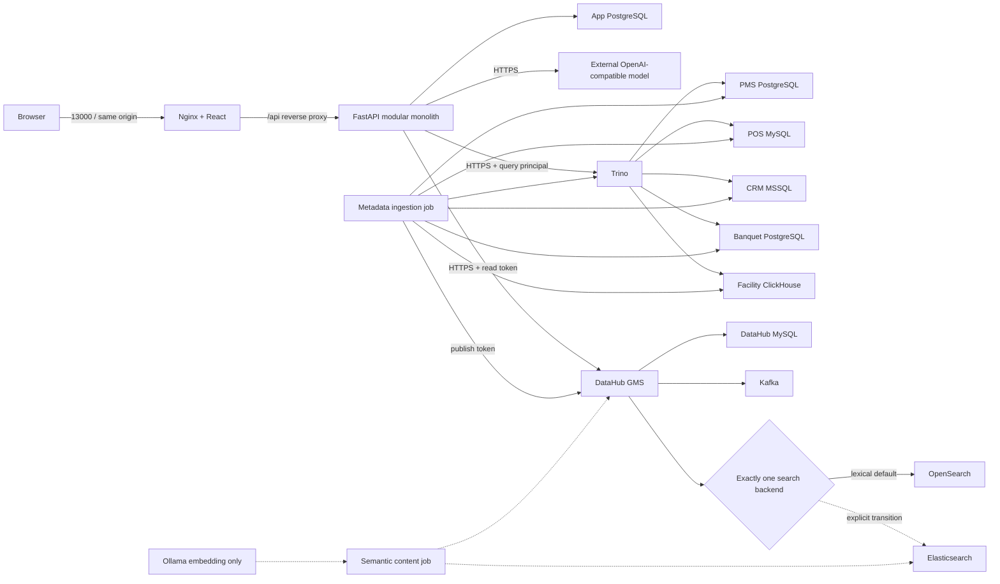

# Antigravity 전달 문서: Docker runtime 구성 정상화

> 작성 시점: 2026-08-17 KST
> 수신자: Antigravity
> 성격: 실행 지시서. 제품 요구사항의 권위 원본이 아니며, 코드·Compose·live runtime과 충돌하면 차이를 먼저 보고한다.
> 기본 결정: 현재 15.44 GiB Docker 환경에서는 **OpenSearch 기반 lexical 통합 환경을 안정화된 기본선으로 만들고**, semantic-search는 자원 게이트와 별도 전환 절차를 통과할 때만 활성화한다.

## 1. 목표와 완료 정의

현재 `answervice` Compose project에는 서로 다른 Compose 파일 조합으로 생성된 컨테이너가 섞여 있다. 기본 OpenSearch runtime은 실행 중이지만 semantic-search 컨테이너는 중단됐고, 애플리케이션 컨테이너만 root Compose로 최근 재생성됐다.

이번 작업의 목표는 컨테이너 수를 무조건 줄이는 것이 아니다. 다음 결과를 만든다.

1. 한 runtime mode에서 검색엔진은 정확히 하나만 사용한다.
2. 같은 Compose project의 모든 장기 실행 컨테이너는 하나의 canonical Compose 조합으로 생성된다.
3. 장기 실행 daemon, 운영자용 선택 서비스, 일회성 job의 lifecycle을 분리한다.
4. 앱 이미지 재빌드가 DB·Trino·DataHub 전체를 재시작하지 않는다.
5. 현재 장비에서 재현 가능한 lexical integration baseline을 먼저 확보한다.
6. semantic-search는 lexical baseline 위에 몰래 덧붙이지 않고 명시적 교체 배포로만 실행한다.
7. volume, secret, 사용자 변경 파일을 보존한다.

완료는 컨테이너가 `Up`으로 보이는 것이 아니라 아래 인수 조건과 실제 dependency readback이 모두 통과한 상태다.

## 2. 범위

### 포함

- root 및 하위 Compose fragment/profile 정리
- `start.ps1`, `stop.ps1`, semantic upgrade/rollback script의 호출 계약 정리
- app rebuild/recreate 절차 분리
- stale/orphan 컨테이너 판별과 승인 기반 정리 계획
- DataHub UI/Actions의 선택 profile 분리
- 검색 backend 상호 배타성 검증
- Compose merge 및 live runtime 검증 자동화
- 관련 README와 테스트의 계약 일치

### 제외

- volume 데이터 삭제 또는 초기화
- secret 값 변경·출력·저장소 반입
- 모델 endpoint 자체 배포
- 5개 원천 DB의 데이터 모델 변경
- DataHub, Trino, DB image version 업그레이드
- Git commit, push, PR

Backend의 `capacity profile 'qwen3.5-4b-answervice-sql-5120' source is unavailable`는 별도 model runtime 결함이다. Docker restart 정책으로 숨기지 말고 preflight/readiness 실패로 노출하되, 이 작업에서 임의의 mock endpoint나 fallback model을 추가하지 않는다.

## 3. 2026-08-17 확인된 live 사실

다음은 추정이 아니라 `docker ps`, `docker inspect`, `docker stats`, Compose source를 확인한 결과다.

| 항목 | 확인 결과 | 의미 |
|---|---|---|
| Docker memory limit | 15.44 GiB | full local all-in-one 환경의 절대 상한 |
| 실행 컨테이너 memory 합계 | 약 9.45 GiB | build cache, semantic ES, Ollama, 순간 peak를 제외하고 이미 약 61% 사용 |
| 가장 큰 daemon | GMS 1.75 GiB, CRM MSSQL 1.72 GiB, OpenSearch 1.69 GiB, Trino 1.22 GiB | semantic stack을 무조건 추가할 여유가 크지 않음 |
| DataHub UI | 약 538 MiB | 상시 필수 runtime이 아니라 운영자용 선택 서비스로 분리할 가치가 큼 |
| GMS effective search | `ELASTICSEARCH_HOST=opensearch`, `ELASTICSEARCH_IMPLEMENTATION=opensearch` | 현재 DataHub는 lexical OpenSearch runtime |
| Backend search mode | `DATAHUB_SEARCH_MODE=lexical` | semantic 결과를 사용하는 앱 runtime이 아님 |
| `semantic-elasticsearch` | `Exited (137)`, unhealthy, `OOMKilled=false` | 비정상 종료지만 OOM으로 단정할 수 없음 |
| `ollama` | `Exited (0)`, unhealthy | semantic daemon이 현재 활성 상태가 아님 |
| semantic content bootstrap | `Created` | dependency chain을 통과하지 못해 실행되지 않음 |
| Backend | running이지만 마지막 확인에서 unhealthy | image 생성 성공과 runtime readiness는 별개 |
| 앱 Frontend | healthy, `127.0.0.1:13000` | 앱 UI container 자체는 기동됨 |
| 앱 DB | healthy, host port `15432` | root override의 `25432`가 아닌 과거 하위 Compose generation |

`Exit 137`과 높은 memory 사용량은 자원 압박을 의심하게 하지만 `OOMKilled=false`이므로 OOM 확정 증거가 아니다. 로그와 Docker Desktop/WSL event를 추가 확인하기 전에는 원인을 단정하지 않는다.

### 혼합 배포 증거

- `app-postgres`는 `infrastructure/database/compose.yml`과 `compose.consumer.yml` 조합으로 생성됐다.
- 현재 Backend와 앱 Frontend는 root `compose.yml` 조합으로 생성됐다.
- GMS는 ingestion까지 포함한 lexical 조합으로 생성됐다.
- 중단된 semantic Elasticsearch만 semantic overlay가 포함된 조합으로 생성됐다.

같은 `COMPOSE_PROJECT_NAME=answervice`에 서로 다른 file/profile 집합을 반복 적용한 것이 현재 drift의 핵심 원인이다.

## 4. 냉정한 구조 판정

### 4.1 로컬 all-in-one은 운영 배포가 아니라 통합 검증 장비다

5개 원천 DB, 앱 DB, Trino, DataHub GMS, Kafka, DataHub MySQL, 검색엔진, Backend, Frontend를 한 Windows Docker Desktop에 넣은 구성은 교육·통합 검증에는 유효하다. 이를 production topology로 간주하면 안 된다.

실제 production 또는 장기 staging에서는 다음을 분리하는 것이 합리적이다.

- PMS/POS/CRM/시설/연회 DB는 외부 source system으로 연결한다.
- DataHub와 검색 backend는 앱 build lifecycle과 분리한다.
- 앱 배포가 Kafka, DataHub MySQL, 검색 index를 재생성하거나 재시작하지 않게 한다.
- semantic embedding 생성은 request-serving path가 아니라 bounded batch job으로 실행한다.

이번 작업은 production migration까지 수행하지 않는다. 다만 profile과 script가 향후 split-host 전환을 방해하지 않게 만든다.

### 4.2 비슷해 보이는 DB는 중복이 아니다

- `pos-mysql`은 업무 원천 DB이고 `answervice-mysql-1`은 DataHub 내부 저장소다.
- `app-postgres`, `pms-postgres`, `banquet-postgres`는 같은 engine을 사용하지만 책임·계정·volume·장애 경계가 다르다.

컨테이너 수를 줄인다는 이유로 이들을 하나의 DB instance에 합치지 않는다. 두 작은 PostgreSQL source를 합쳐 절약하는 memory보다 서로 다른 source system 경계를 훼손하는 비용이 더 크다.

### 4.3 OpenSearch와 semantic Elasticsearch는 동시에 유지하지 않는다

현재 runtime은 OpenSearch를 실제 사용한다. semantic overlay는 Elasticsearch와 Ollama를 추가하고 OpenSearch를 `legacy-search` profile로 밀어내도록 설계됐다. 두 검색 backend를 동시에 writer로 운영하면 index 권위와 rollback 상태가 불명확해진다.

따라서 mode는 다음 둘 중 하나여야 한다.

- `lexical`: OpenSearch 실행, semantic Elasticsearch/Ollama 미실행
- `semantic`: semantic Elasticsearch/Ollama 실행, OpenSearch 미실행

두 mode를 한 project에서 동시에 활성화하는 config는 validation 단계에서 실패시킨다.

### 4.4 Semantic search를 현재 기본값으로 강제하지 않는다

저장소 문서 사이에 실제 충돌이 있다.

- root README는 `full` 경로가 semantic overlay를 항상 사용한다고 설명한다.
- `SEMANTIC_SEARCH.md`는 Catalog 단계가 semantic producer까지 실행한다고 설명한다.
- 실제 `start.ps1`은 semantic overlay를 포함하지 않고 `full` + 선택적 `metadata-ingestion`만 실행한다.
- `tests/data/test_datahub_runtime_recipes.py`는 start script에 `compose.semantic-search.yml`이 없어야 한다고 검증한다.

이 상태에서 어느 한 문장을 근거로 semantic을 기본값으로 바꾸면 계약을 더 악화시킨다. 현재 장비와 live runtime에 맞는 현실적 기본선은 lexical이다. semantic은 `upgrade-datahub-runtime.ps1` 같은 명시적 전환 작업으로 유지한다. 제품 담당자가 semantic을 P0 release gate로 다시 확정하면, 그때 자원 증설 또는 외부 semantic dependency가 선행돼야 한다.

## 5. 목표 runtime mode

### 5.1 기본: `integration-lexical`

현재 장비에서 먼저 안정화할 mode다.

#### 장기 실행 필수

- `app-postgres`
- `backend`
- `frontend`
- `pms-postgres`
- `banquet-postgres`
- `pos-mysql`
- `crm-mssql`
- `facility-clickhouse`
- `trino`
- `kafka-broker`
- DataHub 내부 `mysql`
- `opensearch`
- `datahub-gms-quickstart`

#### 선택 실행

- `frontend-quickstart`: service actor/policy 발급 또는 DataHub 운영자 UI가 필요할 때만 실행
- `datahub-actions-quickstart`: 실제 Actions workflow가 존재하고 검증됐을 때만 실행

Repository에서 Actions workflow 소비 근거가 발견되지 않으면 Actions를 기본 mode에서 제외한다. 단순히 image가 upstream quickstart에 포함돼 있다는 이유만으로 상시 실행하지 않는다.

#### 일회성 job

- `app-migrations`
- `system-update-quickstart`
- `datahub-ingestion`

이들은 성공 후 `Exited (0)`인 것이 정상이다. daemon health 목록에 포함하거나 restart시키지 않는다. 성공한 컨테이너 인스턴스는 필요하면 정리할 수 있지만 서비스 정의는 유지한다.

### 5.2 선택: `semantic-transition`

다음 조건을 모두 만족할 때만 실행한다.

1. lexical baseline과 volume backup/readback 증거가 있다.
2. Docker에 시작 직전 최소 8 GiB free memory가 있다. 현재 약 9.45 GiB를 사용하는 상태에서는 충족하지 못한다.
3. 승인된 Ollama model tag와 full digest가 있다.
4. semantic Elasticsearch와 OpenSearch가 동시에 활성화되지 않는다.
5. GMS effective environment가 `semantic-elasticsearch`를 가리키는지 container inspect로 확인한다.
6. mapping, reindex, vector population, DataHub GraphQL 결과가 live readback에서 일치한다.

현재 장비에서 8 GiB free gate를 확보할 수 없다면 다음 중 하나를 선택한다.

- Docker memory allocation과 실제 host RAM을 증설한다. 전체 host 32 GiB, Docker 24 GiB 수준을 권장 출발점으로 삼되 측정으로 확정한다.
- Elasticsearch 또는 embedding service를 별도 host로 분리한다.
- semantic을 release gate에서 제외하고 lexical baseline만 운영한다.

메모리 gate를 낮춰 통과시키거나 healthcheck timeout만 늘리는 방식은 금지한다.

### 5.3 Docker 전문가 최종 권고 구조

P0에서는 Compose project를 앱과 인프라로 다시 쪼개지 않는다. 현재 병목은 독립 scale이 아니라 동일 release의 DataHub·Trino·DB·앱을 재현 가능하게 묶는 것이다. project를 분리하면 external network, cross-project readiness, release generation 동기화라는 새 운영 문제가 생긴다.

**하나의 canonical `answervice` project + 명시적 mode + 서비스 단위 lifecycle**을 사용한다. 앱 image 교체는 전체 project 재기동이 아니라 exact app service recreate로 처리한다.



중요한 책임 구분:

- 외부 OpenAI-compatible model은 질문 해석·SQL candidate·설명 생성을 담당한다.
- 로컬 Ollama는 DataHub vector semantic-search의 embedding만 담당한다.
- Ollama가 실행된다고 Backend model route가 준비되는 것이 아니다.
- lexical mode도 DataHub Glossary·Rule·Binding·policy를 사용한다. `lexical`은 업무 의미가 없다는 뜻이 아니라 vector 검색을 사용하지 않는다는 뜻이다.
- DataHub GMS와 Trino는 Backend readiness의 실제 필수 dependency다. UI나 Actions와 달리 기본 runtime에서 제외할 수 없다.

### 5.4 목표 network 경계

현재 Frontend가 `database-network`에 붙어 있어 모든 source DB와 같은 network 경계에 있다. 웹 정적 서버가 DB에 도달할 이유가 없으므로 수정 대상이다.

| network | 연결 서비스 | 목적 |
|---|---|---|
| `edge-network` | Frontend, Backend | Nginx의 `/api` reverse proxy와 Backend의 외부 model egress |
| `app-state-network` | Backend, app-postgres, app-migrations | 앱 영속 상태와 migration 격리 |
| `query-client-network` | Backend, Trino | Backend가 source DB에 직접 연결하지 않고 Trino만 호출 |
| `source-data-network` | Trino, 5개 source DB, metadata ingestion | query/metadata 수집에 필요한 source 접근 |
| `metadata-client-network` | Backend, GMS, ingestion/token/semantic jobs, 선택 UI/Actions | 인증된 DataHub API 호출 |
| `metadata-core-network` | GMS, DataHub MySQL, Kafka, 현재 search backend, SystemUpdate | DataHub 내부 저장·event·index 경계 |

네트워크를 나누고도 서비스가 여러 경계에 걸칠 수 있다. 예를 들어 GMS는 client/core 양쪽, Trino는 query/source 양쪽, ingestion job은 source/metadata-client 양쪽에만 연결한다. Frontend는 edge 외 network에 연결하지 않는다.

Source DB, App DB, DataHub MySQL, Kafka, 검색 backend는 기본 mode에서 host port를 publish하지 않는다. host DB client와 troubleshooting이 필요할 때만 별도 `debug-ports` override를 명시적으로 결합한다.

### 5.5 단일 origin과 공개 포트

Frontend Nginx에는 이미 `/api/` reverse proxy가 있다. 이를 실제 기본 경로로 사용한다.

- Frontend build의 `VITE_BACKEND_BASE_URL` 기본 계약을 `/api`로 맞춘다.
- 기본 사용자 진입점은 `127.0.0.1:13000` 하나만 publish한다.
- Backend `28000` 직접 publish는 integration/debug override로 이동한다.
- DataHub UI `19002`, GMS `18081`, Trino `18443`도 운영자 검증이 필요한 mode에서만 loopback publish한다.
- Browser cookie 인증은 same-origin을 기본으로 하고 CORS allowlist를 불필요하게 넓히지 않는다.

Nginx health만 통과했다고 앱이 ready인 것은 아니다. 사용자 smoke는 `/api/readiness`까지 확인한다.

### 5.6 image와 release 실행 방식

Local integration과 release 후보 배포를 구분한다.

| 용도 | App image 계약 | 실행 방식 |
|---|---|---|
| local integration | Compose `build` 허용 | 변경된 Backend/Frontend만 build/recreate |
| release candidate | 사전에 만든 immutable image digest | 배포 host에서 build하지 않고 digest를 pull/run |

P0 release unit은 code commit, app image digest, data checksum, DataHub/Rule/Binding/policy, model/prompt, migration을 하나의 `product_release_id`로 묶는다. Compose generation digest는 이 manifest를 대신하지 않고 그 안의 배포 증거가 된다.

`latest` tag, mutable model tag만으로 release를 식별하지 않는다. Ollama model도 tag와 실제 full digest를 함께 검증한다.

### 5.7 현재와 목표의 차이

| 현재 | 목표 |
|---|---|
| root와 하위 Compose를 같은 project에 교차 적용 | root canonical entrypoint 한 곳만 사용 |
| Frontend가 DB network에 연결 | Frontend는 edge network만 연결 |
| DB/Trino/GMS/search 포트가 기본 publish | 사용자 Frontend 외에는 mode별 debug/admin publish |
| Backend API가 별도 origin으로 노출 | Nginx `/api` same-origin 기본 |
| OpenSearch 실행 + semantic 잔여 컨테이너 | mode당 검색 backend 정확히 하나 |
| UI/Actions가 core와 함께 상시 실행 | admin/actions 선택 실행 |
| app build가 전체 stack lifecycle과 섞임 | app image build/recreate만 독립 실행 |
| config error도 restart policy에 맡김 | preflight 실패 후 명확히 중단 |
| 고정 `container_name` | Compose service DNS와 project 격리 사용 |

## 6. 구현 지시

### Phase 0. 증거 보존과 변경 경계

1. repository root와 `git status --short --branch`를 기록한다.
2. 기존 dirty worktree를 사용자 변경으로 간주한다.
3. 현재 project 컨테이너별 아래 값을 secret 없이 기록한다.
   - service name
   - image digest
   - compose config files label
   - config hash
   - state/health/exit code/OOMKilled
   - volume name
4. named volume 목록과 backup 존재 여부를 기록한다.
5. 삭제·정지 전 exact target 목록과 복구 경로를 사용자에게 제시하고 승인을 받는다.

`docker system prune`, `docker volume prune`, `docker compose down -v`, volume 직접 삭제는 실행하지 않는다.

### Phase 1. canonical Compose entrypoint 확립

모든 정상 기동은 repository root `compose.yml`을 유일한 entrypoint로 사용하게 한다. 하위 Compose 파일을 같은 project name으로 직접 실행하는 경로를 제거하거나 fail-fast시킨다.

구현 요구사항:

1. wrapper script가 mode별 file/profile 집합을 소유한다.
2. `docker compose config --format json` 성공 후에만 `up`을 실행한다.
3. resolved project name, file 목록, profile 목록, config digest를 계산해 배포 generation으로 기록한다.
4. 기존 project에 다른 generation의 장기 실행 컨테이너가 있으면 자동 merge하지 말고 중단한다.
5. `full`처럼 의미가 충돌하는 profile 이름은 즉시 재사용하지 않는다. 호환 alias가 필요하면 deprecation을 문서화한다.

권장 논리 mode:

| mode | search backend | local sources | 앱 | 관리자 UI | Actions |
|---|---|---:|---:|---:|---:|
| `integration-lexical` | OpenSearch | 포함 | 포함 | 기본 제외 | 기본 제외 |
| `integration-lexical-admin` | OpenSearch | 포함 | 포함 | 포함 | 필요 시 포함 |
| `semantic-transition` | Elasticsearch | 포함 | 전환 중 중지 가능 | bootstrap 성공 후 | bootstrap 성공 후 |
| `split-host` | 명시적 외부/선택 backend | 제외 | 포함 | 별도 | 별도 |

Compose profile만 복잡하게 늘리지 말고 wrapper에서 explicit service list를 사용하는 것을 우선한다. profile은 서비스 발견을 위한 보조 수단이지 배포 상태 머신이 아니다.

### Phase 2. 고정 container name과 host port 축소

가능하면 `container_name`을 제거한다. Compose service DNS를 사용하면 충분하며, 고정 이름은 다음 문제를 만든다.

- 병렬 검증 project 실행 불가
- stale container와 새 generation 충돌
- project name 격리 무력화
- script가 container 이름에 결합

제거 전 모든 script/test의 직접 이름 참조를 inventory하고 service label 또는 `docker compose ps -q <service>`로 교체한다.

DB host port는 기본 mode에서 publish하지 않는다. 개발자가 host DB client로 직접 접속해야 하는 경우에만 별도 debug override에서 `127.0.0.1`에 publish한다. Backend, Trino, DataHub는 Docker network service DNS를 사용한다.

앱 UI/API와 운영자 UI처럼 실제 host 접근이 필요한 포트만 기본 loopback binding을 유지한다.

### Phase 3. daemon과 job lifecycle 분리

1. migration/upgrade/ingestion/bootstrap은 `restart: "no"`를 유지한다.
2. wrapper가 one-shot container의 실제 exit code를 기다린다.
3. `Exited (0)`을 unhealthy daemon으로 보고 재기동하지 않는다.
4. `Created` 상태의 bootstrap은 성공으로 처리하지 않는다.
5. GMS/UI/Actions가 bootstrap 성공을 필요로 하는 mode에서는 exact dependency completion을 검증한다.

Backend는 영구 restart loop에 맡기기 전에 configuration preflight를 통과해야 한다. model route, manifest source, secret mount, DB URL, Trino/DataHub endpoint 형식이 잘못된 경우 명확히 실패시키고 반복 재시작으로 로그와 자원을 소모하지 않는다.

### Phase 4. 앱 build와 인프라 lifecycle 분리

Backend/Frontend 코드 변경 시 전체 stack에 `up --build`를 적용하지 않는다.

권장 순서:

1. canonical lexical config를 resolve하고 generation 일치를 확인한다.
2. `backend`, `frontend` image만 build한다.
3. schema 변경이 있으면 `app-migrations` one-shot을 실행하고 exit code 0을 확인한다.
4. `backend`만 dependency 재생성 없이 교체한다.
5. Backend health와 실제 readiness를 확인한다.
6. `frontend`만 교체한다.
7. 앱 HTTP smoke를 실행한다.

`--no-deps`를 사용할 때는 선행 dependency가 같은 generation으로 healthy한지 wrapper가 먼저 검증해야 한다. 무조건적인 `--no-deps`도 안전하지 않다.

### Phase 5. lexical baseline 재수렴

1. canonical lexical config의 예상 서비스 목록을 생성한다.
2. 현재 project의 실제 서비스 목록과 비교한다.
3. semantic 잔여 컨테이너와 다른 generation 컨테이너를 exact list로 분리한다.
4. volume을 보존한 상태의 stop/remove 계획을 사용자 승인 후 실행한다.
5. canonical lexical mode로 장기 실행 서비스와 필수 one-shot을 순서대로 재생성한다.
6. 모든 live readback을 수행한다.

`--remove-orphans`는 무엇을 제거할지 사전 diff가 확인된 경우에만 사용한다. 현재 project에는 semantic 전환 흔적이 있으므로 무검토 사용을 금지한다.

### Phase 6. 선택적 semantic 전환

Lexical baseline 완료와 별도 승인 전에는 실행하지 않는다.

1. DataHub 관련 named volume을 검증 가능한 방식으로 backup한다.
2. memory gate와 model digest를 확인한다.
3. OpenSearch writer를 중지한다.
4. semantic Elasticsearch와 Ollama를 시작한다.
5. SystemUpdate, token check, metadata ingestion, model bootstrap, semantic content bootstrap을 순차 실행한다.
6. GMS를 semantic Elasticsearch 설정으로 재생성한다.
7. effective environment, active index, vector population, GraphQL semantic result를 검증한다.
8. 성공한 뒤에만 UI/Actions를 시작한다.

중간 실패 시 semantic 성공 marker를 남기지 않는다. OpenSearch volume과 semantic Elasticsearch volume을 서로 재사용하지 않는다.

## 7. 우선 검토할 파일

아래 파일을 무조건 모두 수정하라는 의미가 아니다. 계약 중복과 drift 발생 경로를 먼저 추적할 inventory다.

- `compose.yml`
- `compose.app-postgres.override.yml`
- `app/backend/compose.fragment.yml`
- `app/frontend/compose.fragment.yml`
- `infrastructure/database/compose.yml`
- `infrastructure/database/datahub/compose.consumer.yml`
- `infrastructure/database/datahub/compose.ingestion.yml`
- `infrastructure/database/datahub/compose.semantic-search.yml`
- `infrastructure/database/scripts/start.ps1`
- `infrastructure/database/scripts/stop.ps1`
- `infrastructure/database/scripts/upgrade-datahub-runtime.ps1`
- `infrastructure/database/scripts/rollback-datahub-runtime.ps1`
- `README.md`
- `infrastructure/database/README.md`
- `infrastructure/database/datahub/SEMANTIC_SEARCH.md`
- `tests/integration/test_app_postgres_compose_override.py`
- `tests/data/test_datahub_runtime_recipes.py`
- `tests/data/test_semantic_search_profile.py`
- `tests/data/test_datahub_security_boundary.py`

문서 설명을 코드에 억지로 맞추지 않는다. 먼저 기본 mode와 semantic release gate를 결정하고 코드·테스트·문서를 같은 변경에서 일치시킨다.

## 8. 인수 조건

### 8.1 정적 Compose 계약

- 모든 지원 mode에서 `docker compose config --format json`이 성공한다.
- `integration-lexical`에는 `opensearch`만 있고 semantic Elasticsearch/Ollama가 없다.
- `semantic-transition`에는 semantic Elasticsearch/Ollama만 있고 OpenSearch가 없다.
- Backend container에는 publish token이 없다.
- DB migration credential은 Backend runtime에 없다.
- secret host path는 repository 외부 절대 경로만 허용한다.
- 기본 DB port가 불필요하게 host에 publish되지 않는다.
- one-shot job은 restart되지 않는다.

### 8.2 live lexical baseline

- 같은 project의 모든 장기 실행 컨테이너가 동일 canonical generation에 속한다.
- 앱 DB와 5개 source DB가 실제 runtime principal로 접근 가능하다.
- Trino가 TLS와 runtime principal로 terminal `SELECT 1`에 성공한다.
- GMS가 healthy이며 effective search host가 정확히 OpenSearch다.
- DataHub MySQL, Kafka, OpenSearch가 healthy다.
- metadata ingestion job이 exit code 0이고 live catalog readback이 일치한다.
- Backend가 healthy이며 model route preflight를 통과한다.
- Frontend가 healthy이고 Backend API에 연결된다.
- one-shot job은 성공 종료로 구분되고 daemon health 집계에 포함되지 않는다.
- 정상 steady state에서 Docker memory 사용이 10 GiB 안쪽인지 측정한다. 초과하면 임의 heap 축소 전에 service별 peak와 GC/health 영향을 기록한다.

### 8.3 semantic 전환

- 시작 직전 8 GiB free memory gate 통과
- `semantic-elasticsearch`가 OOM/137 없이 healthy
- Ollama model tag와 full digest 일치
- GMS effective search host가 semantic Elasticsearch
- OpenSearch container 미실행
- SystemUpdate/reindex 완료
- vector-backed dataset document 존재
- DataHub semantic GraphQL 결과와 Elasticsearch URN이 일치
- 실패 시 `CONFIGURED_NOT_VERIFIED` 또는 non-zero exit

### 8.4 회귀 검증

최소 다음을 실행하고 정확한 결과를 기록한다.

```powershell
python -m pytest -p no:cacheprovider `
  tests/integration/test_app_postgres_compose_override.py `
  tests/data/test_datahub_runtime_recipes.py `
  tests/data/test_semantic_search_profile.py `
  tests/data/test_datahub_security_boundary.py -q -ra

python infrastructure/database/datahub/semantic_compose_evidence.py --help
git diff --check
```

추가로 각 지원 mode의 resolved Compose JSON을 test가 읽어 다음을 exact 검증하게 한다.

- 서비스 집합
- search backend 상호 배타성
- dependency condition
- network membership/DNS alias
- port binding
- volume ownership
- secret mount read-only 여부
- restart policy

Mock 기반 test를 live Docker 통과로 보고하지 않는다.

## 9. 금지 사항

- 컨테이너가 많아 보인다는 이유로 DB 책임을 합치지 않는다.
- OpenSearch와 semantic Elasticsearch를 동시에 writer로 실행하지 않는다.
- semantic 실패를 lexical 성공으로 포장하지 않는다.
- `Exit 137`을 증거 없이 OOM으로 단정하지 않는다.
- Backend model source 실패를 fake/mock/fallback으로 숨기지 않는다.
- healthcheck interval/retry를 늘리는 것만으로 readiness를 해결하지 않는다.
- `restart: unless-stopped`로 영구 configuration error를 무한 재시작하지 않는다.
- root와 하위 Compose를 같은 project name에 임의로 교차 적용하지 않는다.
- repository 내부 `.env`를 암묵적으로 읽지 않는다.
- secret을 command line, log, 문서, generated config 산출물에 출력하지 않는다.
- `down -v`, volume prune, system prune을 실행하지 않는다.
- 기존 dirty worktree를 정리·복원·이동하지 않는다.

## 10. Antigravity 완료 보고 형식

최종 보고는 다음을 분리한다.

1. **결정**: 기본 mode와 semantic 정책
2. **변경 파일**: 파일별 책임과 변경 이유
3. **정리 대상**: 제거한 정확한 container와 보존한 volume
4. **정적 검증**: Compose merge/profile test 결과
5. **live 검증**: 실제 DB/Trino/GMS/Backend/Frontend 상태와 query/readback
6. **미실행 검증**: semantic 또는 외부 dependency 제약
7. **자원 측정**: steady/peak memory와 주요 service별 사용량
8. **남은 위험**: model endpoint, semantic 전환, split-host 미구현 등

`healthy`라는 단어는 Docker healthcheck와 실제 principal의 terminal operation이 모두 성공한 경우에만 사용한다.
