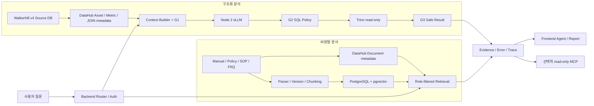

# Answervice v4 통합 개발 계획

| 항목 | 내용 |
|---|---|
| 문서 목적 | 사용자의 역할 분담 메모를 실제 구현·검증 가능한 v4 개발 계획으로 구체화한다. |
| 문서 상태 | `DRAFT` — 아이디어와 구현 결과를 계속 반영하는 팀 공동 작업 문서 |
| 버전 | v0.1 |
| 기준일 | 2026-08-13 KST |
| 목표 릴리스 | Walkerhill 공개 구조 기반 합성 데이터 v4와 Answervice Golden Path 통합 |
| 최우선 원칙 | 준비된 정답을 재생하지 않고, 승인된 Context와 실제 조회·검색 결과로 Golden Path를 통과한다. |

## 1. 결론

v4의 목표는 **Walkerhill 실제 내부 데이터를 흉내 내어 숨기는 것**이 아니다. 공개적으로 확인 가능한 시설·상품·멤버십 구조는 기준정보로 사용하고, 객실·식음·CRM·연회·시설 운영 거래는 현실적인 제약과 상관관계를 가진 합성 데이터로 만든다. 화면과 보고서에는 항상 `Walkerhill 공개 기준정보 기반 비공식 교육용 합성 데이터`임을 표시한다.

사용자가 최종 업로드하는 v4를 단일 데이터 기준선으로 동결한 뒤 아래 5개 작업 축을 운영한다.

1. 합성 데이터 현실성·품질·DataHub 담당
2. 비정형 문서 수집·정규화·버전·DataHub Document 담당
3. 청킹·임베딩·검색 평가·pgvector·RAG/MCP 설계 담당
4. Frontend UI/UX·보고서 에디터·브라우저 검증 담당
5. Backend·DataHub/시맨틱 레이어·G1/G2/G3·검색·sLLM Node 2 담당

각 담당자는 병렬로 준비할 수 있지만, 제품 기본 경로의 승격은 **v4 데이터 → Backend cutover → 검색·오류 계약 → sLLM → RAG → 최종 UI/E2E** 순으로 한 Slice씩 진행한다. 한 영역의 fixture나 mock이 다른 영역의 완료 근거가 될 수 없다.

## 2. 사실·결정·가정·추가 확인 필요

### 2.1 확인된 사실

아래 내용은 2026-08-13 현재 workspace 기준이며, 사용자가 최종 v4를 다시 올리면 재검증한다.

| 항목 | 현재 확인 내용 | 근거 |
|---|---|---|
| v4 데이터 후보 | 33개 Dataset, 308개 컬럼, 225,481행으로 기록돼 있다. | [v4 전환 결정](../../../infrastructure/database/walkerhill_v4/DECISION.md) |
| 데이터·메타데이터 Gate | 결정적 재생성, 원천·Serving 동등성, DataHub exact binding·lineage, held-out SQL 10건 실행이 완료된 것으로 기록돼 있다. | [v4 전환 결정](../../../infrastructure/database/walkerhill_v4/DECISION.md) |
| 애플리케이션 cutover | v4는 데이터·메타데이터 후보까지 승격됐지만 현재 애플리케이션 기본 경로는 아직 구형 8-view 계약에 결합돼 있다. | [v4 승격 계약](../../../infrastructure/database/walkerhill_v4/promotion_contract.v1.json) |
| Frontend | 현재 실제 route는 `/agent`, `/reports` 두 개다. 관리자·마이페이지는 아직 제품 route가 아니다. | [Frontend routing](../../../app/frontend/src/routing.js) |
| RAG 저장소 | `rag_documents`, `rag_chunks`, `vector(1024)`를 정의한 선택적 DDL은 있으나 현재 애플리케이션 migration·검색 API에 연결된 제품 경로는 아니다. | [P2 선택적 DDL](../../../infrastructure/database/sql/ddl/00b_answervice_app_p2_optional_postgresql.sql) |
| MCP | 현재 제품에는 본인 소유 Analysis Run을 읽는 `analysis.get_run@1.0.0` 최소 read-only Tool이 있다. RAG Tool은 없다. | [현재 진행 상황](21_AI_작업_인수인계_현재진행상황.md) |
| Node 2 provider | Backend에는 Node 2를 별도 OpenAI-compatible endpoint로 라우팅하고 `openai` 또는 `qwen` provider를 선택하는 경계가 있다. 현재 실행 기록은 GPT 계열 모델을 사용한다. | [Backend 모델 adapter](../../../app/backend/app/adapters/contract_model.py), [현재 진행 상황](21_AI_작업_인수인계_현재진행상황.md) |
| Node 2 일반화 간극 | 독립 baseline인 `src/ai/node2.py`에는 기존 3 Source 전용 JOIN ID가 고정돼 있다. v4의 10개 질문군·23개 Metric·6개 승인 JOIN을 그대로 지원하지 못한다. | [Node 2](../../../src/ai/node2.py), [v4 제품 계약](../../../infrastructure/database/walkerhill_v4/product_contract.v2.json) |

### 2.2 이번 문서의 결정

| 결정 | 적용 내용 |
|---|---|
| 최종 v4 우선 | 사용자가 최종 업로드한 v4의 manifest·checksum·contract를 기준선으로 삼고, 현재 workspace 수치는 재검증 전까지 참고값으로만 사용한다. |
| 현실성의 의미 | 공개 기준정보와 합성 운영 거래를 구분한다. 실제 Walkerhill 내부 스키마·고객·매출·운영 성과라고 주장하지 않는다. |
| Golden Path 독립성 | 생성기와 평가 질문·정답 SQL을 분리한다. Golden 질문을 통과하도록 KPI·행·정답을 코드나 데이터에 직접 심지 않는다. |
| 문서 저장 분리 | DataHub에는 문서 단위 metadata·owner·domain·관련 자산을 등록하고, 실제 정규화 본문·chunk·embedding은 PostgreSQL/pgvector에 저장한다. DataHub에 chunk별 entity를 만들지 않는다. |
| sLLM 재학습 기준 | 스키마가 바뀌었다는 이유만으로 재학습하지 않는다. catalog·시맨틱 계약·prompt·few-shot을 갱신한 뒤 held-out 실패 원인이 모델 능력일 때만 재학습한다. |
| UI 확장 기준 | 관리자·마이페이지는 실제 role, API, 사용자 작업이 확정된 경우에만 구현한다. 빈 화면이나 샘플 데이터로 메뉴 수만 늘리지 않는다. |
| 병렬 작업·순차 승격 | 담당자는 병렬로 산출물을 준비하되 제품 기본 경로는 Slice별 Exit Gate를 통과한 뒤 순차 승격한다. |

### 2.3 가정

- 5개 작업 축은 각각 주 담당자 1명이 소유한다.
- 실제 Walkerhill 내부 문서나 개인정보를 제공받지 않는 한, 비정형 문서도 공개자료 또는 명시적으로 합성한 내부 매뉴얼 형태로 구성한다.
- 기존 인증, role, G1·G2·G3, Trino read-only, Artifact 불변성은 v4에서도 축소하지 않는다.
- GPT는 비교 기준으로 남길 수 있지만 sLLM 실패를 숨기는 자동 fallback으로 사용하지 않는다.

### 2.4 추가 확인 필요

- 사용자가 올릴 최종 v4의 경로, `data_release_id`, schema/generator/seed version과 SHA-256
- sLLM 후보 모델명, endpoint, context length, structured output 지원 여부, 운영 GPU 환경
- 비정형 문서의 실제 출처, 사용 허가, 공개/합성 여부와 허용 role
- 배포된 DataHub Core에서 native `Document` entity API가 실제 동작하는지
- 관리자 페이지가 필요할 경우 `data_admin`의 실제 권한·API·감사 범위
- 마이페이지가 필요할 경우 사용자가 수정할 수 있는 실제 항목

## 3. v4에서 말하는 Golden Path

### 3.1 구조화 분석 Golden Path

```text
자연어 질문
→ 인증·role 확인
→ Node 1 지표·기간 후보 구조화
→ v4 DataHub Asset + 시맨틱 계약 + 권한으로 Approved Context 생성
→ G1 Context 검증
→ Node 2 sLLM의 Context-bound SQL 생성
→ G2 read-only·Asset·컬럼·JOIN·기간·자원 정책 검증
→ 실제 Trino v4 조회
→ G3 Schema·민감정보·증폭·Evidence 검증
→ Node 3 설명
→ request/query/artifact/trace 저장
→ Frontend 표·차트·근거·보고서 표시
```

### 3.2 비정형 문서 RAG Path

```text
문서 질문
→ 인증·role 확인
→ DataHub Document metadata와 pgvector 문서 상태·유효기간 필터
→ 구조 기반 chunk 검색
→ 필요 시 hybrid 검색·rerank
→ 인용 가능한 chunk만 Context로 전달
→ 근거 충분성 검사
→ 문서명·버전·section/page 인용과 함께 답변
→ retrieval trace 저장
```

초기에는 구조화 분석과 RAG를 각각 독립된 Vertical Slice로 통과시킨다. 두 경로가 따로 검증되기 전에는 하나의 복합 Agent 답변으로 합치지 않는다.

### 3.3 “실제 데이터로 통과하는 느낌”의 판정 기준

다음 조건을 모두 만족해야 한다.

- 질문별 정답 값이나 정답 SQL이 Frontend·Backend·생성기에 하드코딩돼 있지 않다.
- 기간·호텔·등급·업장·seed를 바꾸면 관계를 유지하면서 결과도 실제로 달라진다.
- 지원 질문과 유사하지만 개발 중 사용하지 않은 held-out 질문이 통과한다.
- 지원하지 않는 질문, 권한 밖 질문, 자산이 없는 질문은 명확하게 차단된다.
- 결과에는 `data_release_id`, DataHub URN, Trino FQN, Metric/JOIN version, query/artifact/trace ID가 남는다.
- 화면에는 합성 데이터임을 표시하되, 거래·집계·오류 흐름은 실제 운영 서비스처럼 동작한다.

## 4. 목표 아키텍처



DataHub는 발견·소유권·관계·상태의 기준이고, Backend의 승인 계약은 실행 허용의 기준이다. DataHub 설명이나 RAG 검색 점수가 권한·JOIN·SQL 실행을 승인하지 않는다.

## 5. 역할 분담 요약

| 작업 축 | 주 책임 | 핵심 산출물 | 주요 선행조건 | Exit Gate |
|---|---|---|---|---|
| A. 합성 데이터 | v4 현실성, 생성·검증, DataHub 동기화 | frozen release manifest, validation report, exact URN/FQN, held-out 결과 | 사용자 최종 v4 업로드 | 생성기 독립성·데이터 Gate·DataHub/Trino parity 통과 |
| B. 비정형 문서 | corpus, provenance, 정규화, 버전·권한 | document manifest, canonical text, DataHub Document 등록 | 문서 출처·허가·role 확정 | 문서별 checksum·버전·권한·DataHub↔DB 연결 통과 |
| C. 청킹·임베딩·MCP | chunking, embedding, pgvector, retrieval 평가 | chunk/index contract, embedding release, retrieval benchmark, MCP 제안 | B의 문서 표본과 metadata 계약 | held-out 검색·인용·권한 Gate 통과 |
| D. Frontend | 전체 UI/UX, 보고서 에디터, 상태·오류, 반응형 | 화면 상태표, 컴포넌트 개선, Playwright 증거 | E의 안정된 API/error 계약 | 실제 Backend 브라우저 Golden/실패/권한 흐름 통과 |
| E. Backend | v4 cutover, 시맨틱 레이어, G1/G2/G3, 검색, sLLM | API/DB migration, Context release, model release, trace/rollback | A의 frozen v4, C의 retrieval 계약 | 실제 Docker·HTTP·Trino·DataHub·sLLM E2E 통과 |

공통 파일을 동시에 수정하지 않는다. 각 담당자는 자기 영역의 계약 변경을 먼저 제안하고, Backend 담당자가 API·migration·runtime 통합 시점을 조정한다.

## 6. 작업 축 A — 합성 데이터 현실성·품질·DataHub

### 6.1 목표

사용자가 제공하는 최종 v4를 기준으로, Golden 질문만 맞히는 fixture가 아니라 여러 호텔 운영 질문에 일관되게 답할 수 있는 **공개 구조 기반 합성 데이터 제품**을 만든다.

### 6.2 작업 목록

| ID | 작업 | 완료 증거 |
|---|---|---|
| A-01 | 최종 v4 수령 후 `schema_version`, `generator_version`, `seed`, 기간, 파일 checksum을 동결한다. | immutable release manifest와 전체 SHA-256 |
| A-02 | 공개 기준정보와 합성 가정을 필드·Dataset 단위로 구분한다. | provenance class, source URL, retrieved date, synthetic label |
| A-03 | 객실·식음·CRM·연회·시설을 하나의 수요·달력·날씨·프로모션 driver로 연계하되 각 Source grain과 event time을 보존한다. | 생성기 코드, 상관관계 검증 결과 |
| A-04 | PK/FK, 시간, 금액, capacity, ledger, status transition, source↔serving 동등성을 독립 검증한다. | validation report와 위반 0건 목록 |
| A-05 | 생성기와 평가 질문·Gold SQL을 분리하고 다른 기간·seed·segment로 교란 검증한다. | held-out/perturbation report |
| A-06 | 5개 원천 DB와 Trino namespace에 적재하고 DataHub actual connector 결과에서 exact URN·FQN·lineage를 확정한다. | runtime load, DataHub binding/lineage report |
| A-07 | v4 canary 전까지 legacy를 rollback-only로 보존하고, canary 후 삭제 여부는 별도 승인받는다. | cutover·rollback rehearsal 기록 |

### 6.3 현실성 검사 항목

| Domain | 합성 데이터가 지켜야 할 관계 |
|---|---|
| 객실/PMS | 객실 inventory와 판매 가능 박수, 예약→체크인→체크아웃·취소·no-show 상태, 채널·세그먼트, 숙박일 배분과 checkout 인식 매출이 모순되지 않아야 한다. |
| 식음/POS | 업장·meal period·covers·주문·결제·환불이 연결되고, 객단가와 매출이 단순 난수 합계가 아니어야 한다. |
| CRM/멤버십 | 회원 등급 이력과 identity map에 event-time 유효기간을 적용하고, 포인트 적립·사용·소멸·잔액이 원장 수준에서 맞아야 한다. |
| 연회 | 문의→견적→확정→완료·취소 funnel, 행사장 capacity, 참석자, 객실 block pickup, 매출 인식일이 연결돼야 한다. |
| 시설·자원 | 이용, 사고, 중단시간, 인력·에너지·수도·폐기물이 점유·행사·계절과 완전히 독립된 난수가 아니어야 한다. |
| Cross-domain | 원시 fact-to-fact JOIN을 피하고 member/day 또는 hotel/day 사전 집계와 승인된 temporal JOIN만 사용한다. |

### 6.4 Golden Path 과적합 방지

- 대표 질문 문구와 정답 값을 생성기 입력으로 사용하지 않는다.
- 평가용 SQL은 생성·적재 코드와 다른 모듈에서 독립 집계한다.
- 개발 중 보지 않은 질문·기간·필터 조합을 held-out으로 유지한다.
- 한 개 snapshot만 통과시키지 않고 대체 seed 또는 기간 이동 candidate에서도 invariant를 검사한다.
- 합법적인 Serving View는 허용하되 질문별 정답 한 행을 저장한 테이블은 만들지 않는다.
- 0행, 부분 Source 실패, 유효하지 않은 등급·기간, 권한 밖 Metric도 negative set에 포함한다.

### 6.5 완료 기준

- 동일 release를 두 번 생성했을 때 manifest와 Dataset checksum이 일치한다.
- 구조·재무·시간·capacity·ledger·Serving parity Gate가 모두 통과한다.
- DataHub에 owner, domain, grain, provenance, synthetic 여부, sensitivity, preferred/deprecated 상태와 lineage가 조회된다.
- v4 지원 질문군 전부에서 G1·G2·Trino·G3 canary를 수행할 수 있는 Asset/Metric/JOIN 계약이 제공된다.
- 데이터·제품 코드 검색에서 질문별 고정 KPI·정답 행·정답 응답이 발견되지 않는다.
- 공개 기준정보와 합성값의 경계가 README·UI·Report Evidence에서 동일하게 표시된다.

### 6.6 제외 범위

- Walkerhill 실제 고객·매출·점유율을 추정하는 일
- 실제 개인정보나 비공개 내부 자료를 합성 데이터에 섞는 일
- 앱 canary 전에 기존 volume이나 legacy 자산을 물리 삭제하는 일
- 모델 성능 문제를 해결하기 위해 데이터에 정답 패턴을 심는 일

## 7. 작업 축 B — 비정형 문서·매뉴얼 corpus

### 7.1 목표

호텔 운영자가 실제로 검색할 법한 매뉴얼·정책·SOP·FAQ 형태의 문서를 만들고, 출처·버전·유효기간·권한을 추적할 수 있게 한다. 실제 내부 문서를 제공받지 않았다면 반드시 `합성 운영 문서`로 표시한다.

### 7.2 문서 범위

| 범위 | 예시 | 데이터 연계 |
|---|---|---|
| 객실 운영 | 예약 변경·취소, 체크인/체크아웃, no-show, 객실 정비 인계 | PMS 상태·시간 의미 |
| 식음 운영 | 영업 시간대, 주문·환불, 매출 마감, 알레르기 안내 | POS status와 업장 기준정보 |
| 멤버십 | 등급·적립·사용·소멸, 유효기간, 고객 문의 절차 | CRM 등급 이력·포인트 원장 |
| 연회 | 문의·견적·행사 확정, capacity, 객실 block, 매출 인식 | Banquet funnel·room block |
| 시설·안전 | 시설 이용, 점검, incident, downtime, 에너지 운영 | Facility event·resource data |
| 분석·권한 | Metric 정의, 데이터 책임자, 요청·승인·마스킹 절차 | DataHub·G1·G2·G3·role |

### 7.3 저장 책임 분리

| 저장소 | 저장 내용 | 저장하지 않는 내용 |
|---|---|---|
| DataHub `Document` | 문서 URN, 제목, subtype, 상태, owner, domain, 관련 Dataset, 공개/합성 출처, source reference, version/checksum custom property | chunk별 vector와 검색용 중복 본문 |
| App PostgreSQL `rag_documents` | 내부 `document_version_id`, DataHub Document URN, version, 유효기간, role, checksum, parser 상태 | embedding 자체 |
| PostgreSQL/pgvector `rag_chunks` | chunk text, section/page, 순서, embedding model/index version, vector, metadata | 권한 판정의 최종 결정 |
| 원본 저장소 | 원본 PDF/DOCX/Markdown과 immutable checksum | 검색 결과·embedding |

[DataHub 공식 Document API](https://docs.datahub.com/docs/api/tutorials/documents)는 native/external Document, owner/domain, 관련 자산, 공개 상태를 지원한다. 다만 실제 구현 전 현재 배포된 GMS와 SDK에서 같은 API가 동작하는지 canary로 확인한다.

### 7.4 작업 목록

| ID | 작업 | 완료 증거 |
|---|---|---|
| B-01 | 문서 inventory와 출처·사용 허가·공개/합성 분류를 만든다. | corpus manifest |
| B-02 | 원본을 보존하고 PDF/DOCX/Markdown을 canonical text로 정규화한다. | 원본 checksum, parser version, normalized checksum |
| B-03 | 문서 key와 version을 부여하고 효력 시작·만료·대체 관계를 기록한다. | version ledger |
| B-04 | 문서별 owner/domain/access role/sensitivity/related Dataset을 확정한다. | access matrix와 DataHub payload |
| B-05 | 문서 단위 DataHub `Document`를 upsert하고 실제 URN을 PostgreSQL 문서 row와 연결한다. | DataHub read-back, FK/URN 대조 |
| B-06 | C 담당자에게 canonical text와 section/page metadata를 전달한다. | handoff manifest |

### 7.5 최소 문서 계약

| 필드 | 의미 |
|---|---|
| `document_key` | 논리 문서의 불변 key |
| `document_version_id` | 문서 버전 row의 내부 ID |
| `datahub_document_urn` | 실제 upsert 후 확인한 DataHub URN |
| `title`, `document_type`, `owner_team`, `domain` | 사용자·검색용 metadata |
| `version_label`, `effective_from`, `expires_at`, `status` | 현재 효력 판정 |
| `access_roles` | 검색 전에 적용할 허용 role |
| `source_class` | `PUBLIC_REFERENCE`, `SYNTHETIC_DOCUMENT`, `AUTHORIZED_INTERNAL` 중 하나 |
| `source_uri_ref` | 원문 위치의 참조값; Secret을 포함하지 않는다. |
| `content_checksum`, `parser_version` | 중복·변경·재처리 판정 |
| `related_asset_urns` | 설명 대상 v4 Dataset/Metric과의 연결 |

### 7.6 완료 기준

- 모든 문서가 원본→정규화 본문→DataHub URN→문서 버전 row로 추적된다.
- 동일 checksum의 중복 문서를 재색인하지 않는다.
- 만료·폐기 문서는 기본 검색에서 제외되고 과거 답변의 출처로만 추적할 수 있다.
- 문서 role 필터가 chunk 검색보다 먼저 적용된다.
- 실제 내부 문서가 아닌 자료를 내부 공식 매뉴얼로 표시하지 않는다.
- chunk나 embedding을 DataHub entity로 대량 생성하지 않는다.

## 8. 작업 축 C — 청킹·임베딩·검색 평가·MCP

### 8.1 권장 시작점

현재 선택적 DDL의 `vector(1024)`와 맞고 다국어 문서를 지원하는 [BAAI/bge-m3](https://huggingface.co/BAAI/bge-m3)를 **1차 embedding 후보**로 둔다. 공식 모델 카드 기준 vector dimension은 1024이고 긴 입력을 지원한다. 확정 모델이 아니라 한국어 호텔 문서 held-out 평가의 baseline이다.

검색은 처음부터 복잡한 분산 검색 시스템을 추가하지 않는다.

1. 작은 corpus에서는 pgvector exact cosine search로 기준 recall을 만든다.
2. PostgreSQL lexical search와 dense 결과를 Reciprocal Rank Fusion으로 합친다.
3. 필요할 때만 [BAAI/bge-reranker-v2-m3](https://huggingface.co/BAAI/bge-reranker-v2-m3) 같은 다국어 reranker를 비교한다.
4. corpus 규모와 P95 latency가 실제로 문제일 때만 HNSW를 추가한다.

[pgvector 공식 문서](https://github.com/pgvector/pgvector)는 기본 exact nearest-neighbor 검색, HNSW/IVFFlat, hybrid search를 지원한다. approximate index는 recall을 바꾸므로 HNSW 적용 전후에 exact 결과와 비교한다.

### 8.2 청킹 baseline

아래 값은 시작 실험값이며 평가 전에 고정하고 held-out 결과를 본 뒤 변경한다.

| 항목 | baseline |
|---|---|
| 1차 경계 | 제목→절→문단의 문서 구조를 우선한다. 서로 다른 절·권한·버전을 합치지 않는다. |
| 일반 본문 | 약 500~800 token을 목표로 하되 문장·목록을 중간에서 자르지 않는다. |
| overlap | 같은 절 안에서만 10~15%를 허용한다. 제목·상위 section path는 모든 chunk에 반복한다. |
| 표 | 표 제목·column header·단위를 포함해 의미가 유지되는 행 묶음으로 만든다. |
| 정책/절차 | 조건, 예외, 수행 단계가 분리되지 않도록 조항·절차 단위로 묶는다. |
| page/section | 원본 page, heading path, 문단·표 index를 metadata로 보존한다. |
| 재색인 | `content_checksum + parser_version + chunker_version + embedding_model_version`이 바뀔 때만 수행한다. |

### 8.3 검색 pipeline

```text
질문 정규화
→ role·문서 상태·효력 기간·domain 필터
→ dense candidate + lexical candidate
→ RRF 결합
→ 선택적 rerank
→ 중복 chunk 제거와 문서 다양성 보정
→ 근거 충분성 판정
→ top-k chunk + 문서/버전/section/page citation 반환
```

검색 결과에는 최소한 다음을 포함한다.

- `retrieval_id`, `index_release`, `embedding_model_release`, `chunker_version`
- `document_version_id`, `datahub_document_urn`, `chunk_id`
- `title`, `version_label`, `section_path`, `page`
- dense/lexical/rerank score와 최종 rank
- 공개 가능한 snippet과 citation label
- 권한·만료 필터 적용 여부

### 8.4 평가 세트

| 유형 | 목적 |
|---|---|
| 정답 section 질문 | 관련 chunk가 top-k에 들어오는지 평가 |
| 동의어·약어·한영 혼용 | 업무 용어 변형에 대한 검색 안정성 평가 |
| 표·정책 예외 질문 | 표 header와 예외 조항 보존 여부 평가 |
| 여러 문서 종합 질문 | 문서 다양성과 중복 제거 평가 |
| 정답 없음 | 낮은 근거에서 답변을 만들지 않는지 평가 |
| 권한 밖 문서 | metadata·snippet·존재 여부가 누출되지 않는지 평가 |
| 만료/대체 문서 | 최신 문서를 우선하고 과거 버전을 오답으로 사용하지 않는지 평가 |

### 8.5 제안 Release Gate

수치는 corpus 표본을 확보한 뒤 팀이 동결하며, tuning set으로 held-out을 반복 최적화하지 않는다.

- `Recall@5` 제안 목표: 0.85 이상
- 답변에 사용한 citation의 근거 일치율 제안 목표: 0.95 이상
- 권한 밖 chunk·만료 문서 노출: 0건
- 정답 없음 질문에서 근거 없는 답변 생성: 0건
- exact search 대비 approximate search recall 저하가 승인 범위 안에 있음을 실측
- P50/P95 latency와 index 크기를 실제 환경에서 기록하며 미측정 상태를 `PASS`로 쓰지 않음

### 8.6 MCP 제안

MCP는 내부 RAG 구현의 선행조건이 아니다. Backend 내부 검색 API가 먼저 통과한 뒤 외부 client가 필요할 때만 추가한다.

| 우선순위 | Tool | 판단 |
|---|---|---|
| 유지 | `analysis.get_run@1.0.0` | 현재 read-only Tool을 회귀 보호한다. |
| 1차 후보 | `knowledge.search@1.0.0` | role-filtered 문서 검색 결과와 citation만 반환하는 read-only Tool로 제안한다. |
| 후순위 | `catalog.explain_asset@1.0.0` | 승인 Metric·Asset·owner·관련 문서를 설명할 운영/진단 수요가 확정될 때 검토한다. |
| 금지 | raw SQL 실행, embedding write, 문서 ingest/delete, 전체 문서 무제한 export | Golden Path와 권한 경계를 넓히므로 공개하지 않는다. |

`knowledge.search`의 `top_k`는 서버 상한을 두고, caller가 role·owner 필터를 임의로 확장하지 못하게 한다. Tool run에는 입력 hash, index/model version, 반환 citation ID, latency, 거부·실패 코드를 기록한다.

### 8.7 완료 기준

- parser/chunker/embedding/index version으로 동일 결과를 재현할 수 있다.
- 한국어 held-out 검색과 권한·만료 negative test가 Release Gate를 통과한다.
- 답변의 모든 사실 문장이 하나 이상의 허용된 citation과 연결된다.
- index가 바뀌어도 과거 retrieval trace의 model/index/document version을 확인할 수 있다.
- MCP를 추가한다면 내부 검색 API와 동일한 권한·감사 경계를 재사용한다.

## 9. 작업 축 D — Frontend UI/UX·보고서 에디터·Playwright

### 9.1 목표

현재 `/agent`, `/reports`의 기능을 실제 Backend 상태와 정확히 맞추고, 성공 화면뿐 아니라 로딩·부분 성공·빈 결과·권한·자산 없음·모델/조회 실패·재시도까지 일관된 사용자 경험으로 만든다.

권장 작업 Skill은 `frontend-design`과 `playwright`다. `frontend-design`으로 화면 체계와 시각 정합성을 검토하고, `playwright`로 실제 사용자 흐름과 반응형·권한·오류 회귀를 증명한다. 담당 환경에서 두 Skill의 사용 가능 여부를 착수 시 확인한다.

### 9.2 우선순위

| 우선순위 | 화면 | 범위 |
|---|---|---|
| P0 | Login/Session | 로그인, 만료, 재인증, logout, role 표시, 작성 중 상태 보존 |
| P0 | Agent | 질문 입력, 명확화, 실행 단계, 취소, 결과 표·차트, Evidence, 저장·재실행 |
| P0 | Reports | 목록, preview, editor, Block 상태, 저장, 승인·수동/예약 실행, 부분 실패 |
| P0 | 공통 상태 | loading, empty, error, forbidden, insufficient evidence, network, retry |
| P1 후보 | Admin | Data Source/DataHub, 문서 ingest/index, model release, 권한·감사 API가 실제 존재할 때만 구현 |
| P2 후보 | My Page | 실제 수정 가능한 프로필·세션·알림·개인 저장 항목이 확정될 때만 구현 |

### 9.3 작업 목록

| ID | 작업 | 완료 증거 |
|---|---|---|
| D-01 | 현재 화면의 IA, spacing, typography, 색상, form, table, chart, modal, focus 상태를 inventory한다. | UI audit와 재사용 token 목록 |
| D-02 | Backend status/error를 화면 상태와 1:1 매핑하고 임의 성공 전환을 제거한다. | 상태 매트릭스와 contract test |
| D-03 | 결과·Evidence·검색 근거에 v4 release, 합성 label, Metric·Source·기간·Gate·ID를 이해 가능한 순서로 표시한다. | 실제 성공 화면 |
| D-04 | 보고서 에디터의 drag, resize, keyboard, autosave/dirty, 실패 복구, 반응형 동작을 정리한다. | editor 회귀 증거 |
| D-05 | 오류 메시지에 부족한 정보와 다음 행동을 표시하되 권한 밖 자산명은 누출하지 않는다. | 오류별 실제 화면 |
| D-06 | 390px·tablet·desktop, keyboard navigation, focus, label, contrast, overflow를 검증한다. | viewport·접근성 점검 결과 |
| D-07 | Playwright CLI로 실제 Backend Golden/실패/권한/재시작 흐름을 반복한다. | screenshot·trace·evidence manifest |

### 9.4 사용자 오류 안내 원칙

| 상황 | 사용자에게 보여줄 내용 | 내부 trace에만 둘 내용 |
|---|---|---|
| 기간·Metric 부족 | 무엇이 빠졌는지, 승인 후보, 질문 수정 예시 | parser 원문, 후보 점수 |
| 권한 부족 | 요청 범위 중 허용되지 않은 데이터가 있음, 필요한 요청 절차, trace reference | 권한 밖 Asset의 상세 metadata와 policy rule |
| 관련 Asset 없음 | 승인된 데이터 자산/Binding이 준비되지 않았음, 관리자 문의 또는 다른 지표 선택 | 검색 후보·탈락 사유·DataHub payload |
| Source 장애/timeout | 현재 조회할 수 없는 Source, 재시도 가능 여부, 부분 결과 사용 여부 | endpoint, stack trace, credential 정보 |
| 결과 0행 | 조회는 성공했지만 해당 기간·조건의 행이 없음, 조건 변경 제안 | 실제 SQL과 query plan |
| G2 차단 | 요청이 허용된 SQL 정책으로 변환되지 못함, 질문 단순화 또는 관리자 문의 | 차단 AST·민감 literal·repair 상세 |
| RAG 근거 부족 | 답변 가능한 최신 문서 근거가 없음, 검색어/범위 변경 제안 | 권한 필터 전 candidate와 raw score |
| sLLM 계약 오류 | 분석 문장을 처리하지 못함, 입력 보존, 재시도 가능 여부 | raw model output과 transport detail |

Frontend는 서버가 제공한 공개용 `message`, `missing_requirements`, `required_action`, `retryable`, `suggestions`, `trace_id`를 표시한다. 권한이나 Asset 상태를 화면에서 추측하지 않는다.

### 9.5 Playwright 검증 흐름

Playwright Skill의 CLI 흐름을 사용하고 artifact는 `output/playwright/v4/` 아래에 둔다.

- 정상 v4 질문 → 실제 G1·G2·Trino·G3 → 표·차트·Evidence → Analysis 저장 → Report 전환
- Metric 모호성 선택과 새 request 생성
- 기간 누락, Asset 없음, 권한 거부, Source timeout, 결과 0행, RAG 근거 부족
- `hotel_analyst`, `report_admin`, 향후 확정될 `data_admin`의 route/API 차단
- session 만료 후 질문과 저장 전 Report 변경 보존
- Report Block drag/resize/keyboard/save/reload/부분 실패
- 390px·tablet·desktop에서 overflow와 핵심 action 접근성
- 화면·Report의 합성 데이터 label과 v4 release 표시

완료 증거는 request/trace/query/artifact 또는 retrieval/document/chunk ID와 screenshot을 연결한다. route interception, fixture, mock response는 제품 완료 근거로 사용하지 않는다.

### 9.6 완료 기준

- 실제 Backend 오류 코드마다 한 개의 명확한 화면 상태와 다음 행동이 있다.
- API 실패 시 이전 결과나 샘플 결과로 바뀌지 않는다.
- Agent와 Report의 숫자·기간·Source·Evidence가 실제 API/DB Artifact와 일치한다.
- editor 변경은 저장 성공 응답 뒤에만 완료 처리되고 재시작 후 복원된다.
- 주요 흐름이 keyboard로 가능하고 390px에서 가로 overflow가 없다.
- Frontend contract test, production build, 실제 브라우저 E2E가 모두 통과한다.

## 10. 작업 축 E — Backend·시맨틱 레이어·G1/G2/G3·검색·sLLM

### 10.1 목표

v4의 Dataset·Metric·JOIN·time·identity·권한 계약을 애플리케이션 기본 Context로 승격하고, 실패 원인을 사용자 행동으로 연결하며, Node 2를 검증된 sLLM endpoint로 전환한다.

### 10.2 작업 목록

| ID | 작업 | 완료 증거 |
|---|---|---|
| E-01 | v4 exact DataHub URN·Trino FQN·schema·Metric·JOIN 계약을 adapter/context registry에 연결한다. | immutable Context release와 checksum |
| E-02 | legacy 8-view 기본 선택을 중단하고 v4 preferred Asset만 검색·선택하되 rollback path를 유지한다. | canary와 rollback rehearsal |
| E-03 | catalog 검색을 business name·alias·description·domain·owner·status·권한으로 개선한다. | search benchmark와 rejection trace |
| E-04 | Context Builder와 G1이 Metric·Asset·Binding·JOIN·기간·role·version을 fail-closed로 검사하게 한다. | positive/negative contract test |
| E-05 | Node 2를 고정 3 Source JOIN에서 v4 Context-bound SQL plan/compiler로 일반화한다. | 10개 질문군 SQL/evidence 결과 |
| E-06 | Node 2 sLLM provider를 strict schema·timeout·최대 1회 Repair·release audit와 연결한다. | model comparison·held-out report |
| E-07 | G2에 read-only, approved Asset/column/JOIN/function, typed parameter, result cap, timeout을 유지한다. | write/policy negative test |
| E-08 | G3에 dynamic schema, row/size cap, 민감정보, JOIN 증폭, Evidence 검사를 유지한다. | result/evidence negative test |
| E-09 | RAG 문서·chunk repository와 role-filtered retrieval API를 migration·readiness·trace에 연결한다. | pgvector actual query와 API E2E |
| E-10 | 오류를 누락 정보·권한·Asset·Binding·Source·model·SQL policy·0행·근거·저장 실패로 분리한다. | 공개 오류 matrix와 실제 HTTP 증거 |
| E-11 | 승인된 `knowledge.search`가 필요하면 기존 MCP 인증·Registry·Tool Run 경계를 재사용한다. | MCP 성공·거부·미지원 Tool 증거 |

### 10.3 검색 실패를 설명하기 위한 내부 판정

검색은 단순히 “결과 없음”으로 끝내지 않고 다음 단계를 구분한다.

```text
질문에서 인식한 업무 용어
→ 전체 metadata 후보 존재 여부
→ 활성·preferred 후보 존재 여부
→ 현재 role 허용 후보 존재 여부
→ AssetBinding·Metric·JOIN 계약 완전성
→ Source readiness
→ 실제 query row 존재 여부
```

내부 trace에는 단계별 candidate 수와 정규화된 탈락 사유를 기록한다. 외부 응답에는 사용자가 행동을 바꿀 수 있는 범위만 공개한다.

| 내부 원인 | 외부 분류 | 다음 행동 |
|---|---|---|
| 질문에 Metric/기간 없음 또는 모호함 | `CONTEXT_INCOMPLETE` | 승인 후보 선택 또는 질문 보완 |
| metadata 후보 자체 없음 | `ASSET_NOT_FOUND` 계열 | 지원 업무 용어 확인 또는 관리자 등록 요청 |
| 후보는 있으나 role 필터 후 0건 | `ACCESS_DENIED` | 권한 요청; 제한 Asset 상세는 비공개 |
| Dataset은 있으나 Binding/Metric/JOIN 없음 | `SEMANTIC_CONTRACT_MISSING` 계열 | Data/Backend 담당자에게 계약 등록 요청 |
| Source readiness 실패 | `QUERY_SOURCE_UNAVAILABLE` 계열 | 재시도 또는 부분 결과 정책 확인 |
| 조회 성공·0행 | 성공 빈 결과 | 기간·필터 변경 제안; 오류로 위장하지 않음 |

기존 공개 error enum과 호환이 필요하면 내부 원인을 기존 code로 정규화하되 `missing_requirements`와 `required_action`으로 차이를 전달한다.

### 10.4 제안 오류 응답 필드

| 필드 | 역할 |
|---|---|
| `code`, `category` | 안정적인 기계 판정 |
| `message` | 비기술 사용자가 이해할 공개 문장 |
| `missing_requirements[]` | 부족한 기간·Metric·권한·Asset/Binding 유형 |
| `required_action` | 질문 수정, 후보 선택, 재시도, 권한/등록 요청 중 하나 |
| `retryable` | 같은 입력의 재시도 가능 여부 |
| `suggestions[]` | 현재 role에 허용된 승인 항목만 포함 |
| `trace_id` | 운영자가 내부 원인을 찾을 참조값 |
| `partial_sources[]` | 부분 성공일 때 공개 가능한 Source 상태 |

stack trace, Secret, raw model output, 민감 SQL literal, 권한 밖 Asset 이름은 응답하지 않는다.

### 10.5 Node 2 sLLM 전환 순서

1. 최종 v4의 catalog·Metric·JOIN·schema cache와 prompt/few-shot version을 동결한다.
2. 현재 GPT와 후보 sLLM을 동일한 train 미사용 held-out set으로 평가한다.
3. 실패를 `context 부족`, `schema 선택`, `SQL 문법`, `JOIN/Metric 의미`, `G2 정책`, `resource 정책`, `result 불일치`로 분류한다.
4. metadata·contract·prompt 문제를 먼저 수정하고 같은 범주의 새 held-out으로 재검증한다.
5. 남은 실패가 모델 일반화 부족일 때만 Node 2/Repair용 학습 데이터를 만든다.
6. train/dev/held-out을 문장 paraphrase만이 아니라 질문군·Metric·JOIN 조합 기준으로 분리한다.
7. 학습 모델은 strict output schema, G2 통과율, Trino 실행 성공, 독립 Gold 결과, negative policy set으로 비교한다.
8. 후보가 Gate를 통과하면 `NODE2_MODEL_PROVIDER=qwen`과 별도 endpoint를 기본으로 승격한다. GPT 자동 fallback은 사용하지 않는다.

재학습 산출물에는 base model, adapter, training data manifest/hash, prompt version, schema/context release, inference settings, 평가 결과와 rollback model을 기록한다. weight와 Secret은 Git에 넣지 않는다.

### 10.6 Node 2 완료 기준

- v4 10개 지원 질문군에서 승인 Context 밖 Asset·컬럼·JOIN을 사용하지 않는다.
- exact SQL 문자열 일치보다 G2 통과, 실제 실행, 결과 Schema·독립 Gold 일치, Evidence 완전성을 평가한다.
- policy negative set의 write·미승인 Asset·무제한 query·원시 fact-to-fact JOIN 허용은 0건이다.
- Repair는 Controller가 허용한 정규화 오류에 대해 최대 1회만 수행한다.
- 후보 sLLM은 동결한 GPT baseline 대비 안전성·정확성에 승인되지 않은 회귀가 없다.
- model/prompt/context/policy version과 attempt·latency·status가 trace에 남는다.

### 10.7 Backend 완료 기준

- v4가 기본 검색·Context·Trino 경로이고 legacy는 기본 선택에서 제외된다.
- 실제 Docker·HTTP에서 G1·G2·Trino·G3와 저장·재실행·Report 경로가 통과한다.
- DataHub/Trino/sLLM/pgvector dependency가 readiness에 분리돼 표시된다.
- Backend 재시작 뒤 request, query, artifact, retrieval, document/model/index version이 복원된다.
- 권한·write·미등록 Asset·만료 문서·모델/Source 장애 negative test가 fail-closed다.
- v4 canary 실패 시 legacy rollback 절차를 실제로 연습하고 결과를 남긴다.

## 11. 공통 Handoff 계약

### 11.1 사용자/데이터 담당 → Backend

| 필수 항목 | 설명 |
|---|---|
| `data_release_id` | v4 snapshot의 불변 ID |
| schema/generator/catalog/metric version, seed | 재현과 Context release 연결 |
| manifest/checksum | 파일·Dataset 변조·누락 확인 |
| exact DataHub URN·Trino FQN | 논리 이름 추측 금지 |
| Metric·JOIN·time·identity·filter 계약 | G1/G2 compiler 입력 |
| sensitivity·role·owner | 권한·마스킹·오류 안내 입력 |
| held-out case manifest | 생성기·prompt tuning에서 분리 |
| rollback target | cutover 실패 시 복귀 경로 |

### 11.2 문서 담당 → 청킹 담당

- canonical text와 원본/정규화 checksum
- 문서/버전 ID, DataHub URN, title/type/owner/domain
- section hierarchy, page, table/list marker
- effective/expiry/status, access roles, sensitivity
- related v4 Asset URN과 공개/합성/승인 내부 출처 분류

### 11.3 청킹 담당 → Backend/Frontend

- chunker/embedding/index release와 dimension/distance metric
- retrieval request/response schema와 top-k 상한
- role/status/effective filter 규칙
- citation label과 document/chunk ID
- score calibration과 no-answer 판정 방식
- held-out benchmark·latency·index size·재색인 절차

### 11.4 Backend → Frontend

- OpenAPI와 error/status enum
- 공개용 오류 필드와 suggestions
- Analysis·RAG Evidence schema
- 진행 단계·취소·재시도·부분 성공 계약
- role별 route/API capability
- v4 data/model/context/index release 표시값

## 12. 통합 순서

담당자별 준비는 병렬로 진행하되 아래 Slice를 한 번에 하나씩 제품 기본 경로에 승격한다.

| Slice | 통합 내용 | 병렬 준비 가능 작업 | Exit Gate |
|---|---|---|---|
| V4-0 기준선 동결 | 사용자 최종 v4, 계약·manifest·checksum 확정 | B 문서 inventory, C 평가 설계, D UI audit, E cutover 설계 | 모든 담당자가 같은 release ID와 계약을 참조 |
| V4-1 데이터 cutover | v4 Context/DataHub/Trino를 기존 구조화 Golden Path에 연결 | B/C 문서 ingest prototype, D 기존 화면 수정 | 실제 v4 질문→G1/G2/Trino/G3→Artifact→Report, rollback rehearsal |
| V4-2 검색·오류 | metadata 검색과 부족 정보·권한·Asset 안내를 Backend/Frontend에 연결 | C embedding benchmark, B corpus 보강 | 정상·모호·권한·Asset 없음·Source 장애·0행 브라우저 흐름 |
| V4-3 sLLM | Node 2 후보 평가, 필요 시 학습, 기본 endpoint 전환 | C RAG index, D model/error 상태 UI | held-out·정책 negative·실제 Trino 결과와 GPT baseline 대조 |
| V4-4 RAG | DataHub Document + pgvector + retrieval API + citation UI | 선택적 MCP 구현 | 최신/권한 문서 검색, citation, no-answer, 재시작 통과 |
| V4-5 최종 제품 | Frontend 정합성, Report, 선택적 MCP·관리자 화면 판단 | 발표·운영 증거 정리 | 실제 Docker·HTTP·브라우저 전체 회귀와 최종 demo 기록 |

Admin/My Page는 V4-5의 자동 포함 항목이 아니다. API·role·사용자 작업이 확정된 항목만 별도 Slice로 추가한다.

## 13. 통합 검증 매트릭스

| 계층 | 반드시 실행할 검증 | 완료로 보지 않는 근거 |
|---|---|---|
| 데이터 | 독립 aggregate, invariant, deterministic replay, perturbation, source↔serving parity | 생성기 자체의 `PASS`만 있는 경우 |
| DataHub | exact URN read-back, owner/domain/grain/sensitivity, lineage, preferred/deprecated | YAML이 존재하지만 ingest하지 않은 경우 |
| 시맨틱/G1 | Metric·Asset·Binding·JOIN·기간·role·version positive/negative | 승인 Context fixture만 통과한 경우 |
| Node 2/G2 | GPT/sLLM 동일 held-out, 정책 negative, 최대 1회 Repair, 실제 Trino 실행 | SQL 문자열 snapshot만 맞는 경우 |
| Trino/G3 | read-only negative, timeout/cancel, dynamic schema, row cap, PII·증폭·Evidence | 미리 저장한 결과를 반환한 경우 |
| RAG | exact 기준 recall, hybrid/rerank 비교, 권한·만료·no-answer, citation | 검색 예시 몇 건을 눈으로만 확인한 경우 |
| API/DB | 실제 migration, OpenAPI, request/trace/artifact/retrieval 영속성, 재시작 | in-memory repository만 사용한 경우 |
| Frontend | contract, production build, Playwright 실제 Backend 정상·실패·role·viewport | route intercept/mock response만 사용한 경우 |
| 보안 | 401/403, role leak, write 차단, Secret/PII 로그, MCP deny | UI에서 메뉴만 숨긴 경우 |
| 운영 | readiness, bounded timeout/retry, rollback rehearsal, 증거 manifest | 한 번의 happy-path 성공만 있는 경우 |

## 14. 공통 완료 정의

각 담당 항목은 아래를 모두 만족해야 `COMPLETED`다.

1. 입력 contract와 version이 동결돼 있다.
2. 코드·데이터·문서의 변경 파일과 소유권이 명확하다.
3. 정상·실패·권한·빈 결과 테스트가 있다.
4. 실제 runtime 경로의 ID·log·screenshot 또는 report가 있다.
5. fixture/mock 결과를 제품 성공 근거로 사용하지 않았다.
6. Secret·개인정보·Walkerhill 실제 성과로 오해할 표현이 없다.
7. 재실행·재시작 후 결과와 version lineage를 복원할 수 있다.
8. rollback 방법과 실행 조건이 적혀 있다.
9. 실행하지 못한 검증과 남은 위험이 분리돼 있다.
10. 다음 한 개의 통합 Slice가 정해져 있다.

## 15. 주요 위험과 대응

| 위험 | 영향 | 대응 |
|---|---|---|
| 합성 데이터를 실제 Walkerhill 데이터로 오해 | 신뢰·법적·발표 리스크 | 공개 기준정보/합성 거래 분리, UI·Report label, 금지 주장 검사 |
| Golden 질문 과적합 | demo는 통과하지만 일반 질문 실패 | 생성기/평가 분리, held-out, 기간·seed·segment perturbation |
| 최종 v4와 현재 파일 drift | 담당자별 서로 다른 schema 사용 | `data_release_id`·checksum 동결 전 통합 금지 |
| DataHub와 pgvector 문서 불일치 | 잘못된 버전·권한·출처 | DataHub URN + document_version_id + checksum read-back 대조 |
| RAG 권한 누출 | 제한 문서 제목·snippet 노출 | role/status/effective filter 선적용, negative test, 공개/내부 trace 분리 |
| approximate vector index recall 저하 | 관련 문서 누락 | exact baseline 대조 후 HNSW 승격 |
| sLLM schema/SQL 품질 부족 | Node 2 실패·정책 차단 증가 | metadata/prompt 수정 우선, 원인 기반 학습, GPT baseline 대조, 자동 fallback 금지 |
| Node 2의 기존 고정 JOIN | v4 질문군 확장 실패 | approved Context 기반 plan/compiler로 교체하고 계약 외 JOIN fail-closed |
| Frontend 범위 팽창 | 관리자·마이페이지가 핵심 E2E 지연 | 실제 API와 사용자 작업이 없는 화면은 보류 |
| 공통 파일 동시 수정 | merge 충돌·계약 drift | 영역별 소유권, contract-first handoff, 통합 담당자 1명 |

## 16. 아이디어 인박스와 판단 상태

사용자가 새 아이디어를 떠올리면 아래 표에 먼저 추가한다. `핵심 Golden Path`, `독립 Slice`, `후순위`, `제외` 중 하나로 분류한 뒤 구현한다.

| 아이디어 | 현재 판단 | 승격 조건 |
|---|---|---|
| 관리자 페이지 | 독립 Slice 후보 | `data_admin` role, 실제 관리 API, 감사·승인 동작 확정 |
| 마이페이지 | 후순위 | 사용자가 실제 수정할 항목과 저장 API 확정 |
| DataHub Document | RAG 필수 기반 | 현재 GMS native Document API canary 통과 |
| pgvector RAG | V4-4 독립 Slice | 문서 version/access 계약과 retrieval held-out 준비 |
| `knowledge.search` MCP | RAG 이후 선택 | 내부 검색 API·권한·감사 Gate 선통과, 외부 client 수요 확인 |
| 구조화+비정형 혼합 답변 | 후순위 | 두 경로가 각각 독립 Golden Path를 통과 |
| Node 2 sLLM 재학습 | 조건부 | v4 계약·prompt 갱신 후 held-out 실패 원인이 모델 능력으로 확인 |
| 추가 화면 | 아이디어별 판단 | 사용자 작업·role·Backend API·검증 시나리오가 모두 존재 |

## 17. 바로 시작할 다음 행동

| 주체 | 첫 행동 | 산출물 |
|---|---|---|
| 사용자/프로젝트 리드 | 최종 v4 업로드 후 기준선 선언 | release 경로, version, checksum, 변경 요약 |
| A 담당 | 최종 v4를 재생성·독립 검증하고 현재 후보와 diff | frozen manifest와 validation/perturbation report |
| B 담당 | 문서 후보를 출처·합성 여부·role·관련 Asset으로 inventory | corpus manifest v0.1 |
| C 담당 | B의 표본 문서로 구조 chunk baseline과 bge-m3 exact 검색 평가 준비 | chunk contract와 held-out set v0.1 |
| D 담당 | `/agent`, `/reports`의 상태·오류·반응형·editor audit | 우선순위 UI backlog와 Playwright flow 목록 |
| E 담당 | v4 product/schema contract와 현재 adapter/node2의 차이 분석 | cutover contract diff와 V4-1 변경 목록 |

첫 통합 목표는 **V4-1 데이터 cutover**다. RAG, MCP, 관리자·마이페이지를 먼저 기본 경로에 넣지 않는다.

## 18. 변경 내역

| 버전 | 일시 | 요약 |
|---|---|---|
| v0.1 | 2026-08-13 KST | 사용자 메모를 5개 작업 축, 계약, Slice, 완료 기준, 위험, 아이디어 인박스로 구체화 |
