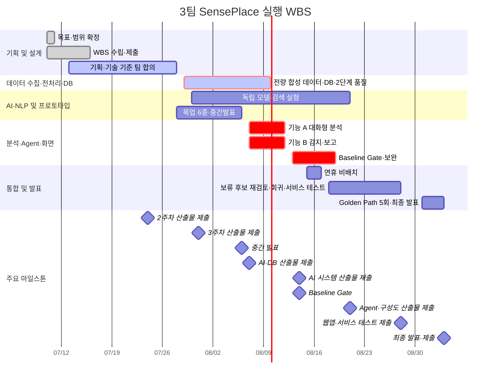

# SensePlace — 호텔 VOC·운영 지원 플랫폼 WBS

| 항목 | 내용 |
|---|---|
| 문서 설명 | SensePlace의 실행 작업, 담당, 상태, 일정, 산출물과 요구사항 추적 관계를 관리하는 WBS 작업본 |
| 문서 분류 | 산출물 작업본 |
| 버전 | v2.7 |
| 문서 기준일 | 2026-07-21 15:50 |
| 작성·수정 | 김재홍 |
| 산출물 번호 | 02 |
| 제출 일자 | 2026-07-16 |
| 대응 템플릿 | `templates/[기획] WBS_양식 (1)_27기_0팀.xlsx`, `templates/[기획] WBS_양식(2)_27기_0팀.xlsx` |

> 2026-07-10~09-03 · 5인(박준희·송민지·김재홍·정승·윤대성(파랑새)) · 실행 일정 63개 태스크 · 공식 산출물 21건 + 옵션 1건
> 공식 서비스명 **SensePlace** · `SensePlace_기획서_초안.md`의 Baseline·실험·Gate 일정을 실행 기준으로 사용한다.
> 실행 추적, 기획·요구사항 추적, 8주 개발 일정의 세 관점을 한 문서에 통합했다.

## 대응 양식 구조

두 WBS 양식은 대체 관계가 아니라 작업 목록과 일정 가시화를 각각 보완하는 기준으로 사용한다. 양식에 없는 프로젝트 고유 추적 필드는 기존 열의 하위 확장으로 유지한다.

| 양식 필드 | Markdown 대응 위치 | 적용 원칙 |
|---|---|---|
| 프로젝트 이름·관리자·날짜 | 문서 제목·상단 프로젝트 정보·문서 기준일 | 프로젝트 관리자 역할은 팀 운영 역할표를 따른다. |
| `Task ID`·`WBS 번호` | 실행 WBS의 `ID` | 기존 실행 ID 체계를 유지한다. |
| 주요 업무·작업 제목 | 실행 단계 제목 | 단계별 상위 업무를 구분한다. |
| 세부 업무 | 실행 WBS의 `작업 항목` | 검증 가능한 결과 단위로 작성한다. |
| 담당자·작업 소유자 | 실행 WBS의 `담당` | 첫 번째 이름을 결과 책임자로 해석한다. |
| 상태·우선순위 | 실행 WBS의 `현황`, Planning View의 `우선순위` | 확인되지 않은 완료율을 추정하지 않는다. |
| 시작일·마감일·기간 | 실행 WBS의 `시작`·`마감`, 8주 일정 | 기간은 시작일과 마감일로 검증한다. |
| 작업 완료 비율 | 실행 WBS의 `현황` | 근거 없는 백분율 대신 상태값을 사용한다. |
| Gantt timeline | 8주 핵심 개발 일정·Mermaid 일정 가시화 | 일정 변경 시 실행 WBS와 함께 동기화한다. |

## 통합 운영 기준

- **실행 기준:** 아래 **실행 WBS**의 담당·현황·시작일·마감일·제출일을 일상적인 진행 관리 기준으로 사용한다.
- **기획 기준:** 아래 **기획·요구사항 추적 관점**은 우선순위와 요구사항 ID의 누락 여부를 확인하는 추적표로 사용한다.
- **주차 기준:** **8주 핵심 개발 일정**은 발표·제출 마일스톤과 트랙 간 선후행 관계를 빠르게 확인하는 요약표다.
- **단일 기준:** 저장소의 WBS 일정·상태·작업 이력은 이 문서에서만 관리하며 별도 AI 전용 WBS를 만들지 않는다.
- 두 WBS는 관점에 따라 공정과 Task ID를 다르게 묶었으므로, 같은 ID가 항상 같은 작업을 뜻하지는 않는다. 작업명·산출물·요구사항 ID를 함께 대조한다.
- Excel 제출본은 이번 동기화 대상에서 제외하며 일정·상태의 단일 기준으로 사용하지 않는다.

### 작업 종료 갱신 규칙

1. 저장소 파일을 변경한 작업은 가장 가까운 **실행 WBS** 행의 현황·일정·산출물을 실제 결과에 맞게 갱신한다.
2. 대응 행이 없으면 해당 실행 단계의 다음 ID로 행을 추가하고 문서 상단 태스크 수와 **단계별 요약**을 함께 수정한다.
3. 현황은 `대기`, `진행`, `검토`, `차단`, `완료`, `취소` 중 하나로 기록한다. 확인되지 않은 완료 상태나 일정은 추정하지 않는다.
4. 일정이나 현황이 바뀌면 **8주 핵심 개발 일정**, **Mermaid 일정 가시화**, **산출물 제출 일정**의 관련 항목을 동기화한다.
5. 담당자가 여러 명이면 첫 번째 이름을 결과 책임자로 보고 나머지는 공동 작업·검토를 맡는다. `전원`은 공동 Gate·회의·최종 확인에만 사용한다.
6. PM은 B 백엔드·통합과 D AI·Agent가 함께 수행하는 구간에서 요구사항·연동 기준·수용 시나리오·테스트 조율·결함 분류·결과 보고를 책임지는 **업무 지원**을 맡는다. B·D의 핵심 기술 구현 책임은 바꾸지 않는다.
7. 작업 종료 시 문서 하단 **WBS 작업 로그** 맨 위에 일시, 실행 WBS ID, 변경 요약, 관련 파일을 한 줄로 기록한다(검증 세부는 commit·PR에 남기고 로그에는 핵심만).
8. 단순 조사·설명처럼 저장소 변경이 없는 작업은 WBS와 작업 로그를 갱신하지 않는다.

### 공용 ID·산출물·검증 연계

기존 실행 WBS ID는 유지한다. 공용 개발 작업은 아래 결과 단위로 `DOC-*`, `REQ-*`, `TC-*`, 실제 evidence path를 연결하며 test evidence가 없으면 완료로 표시하지 않는다.

| wbs_id | 검증 가능한 결과 | deliverable_id | requirement_ids | owner | start_date | due_date | status | dependency | evidence_path |
|---|---|---|---|---|---|---|---|---|---|
| `1.5` | SensePlace 기획·요구사항·WBS 범위 동기화 | `DOC-003` | 전체 Baseline | 박준희·송민지 | 07/13 | 07/24 | 검토 | SensePlace 결정 적용 | `docs/markdown/03_프로젝트기획서.md` |
| `1.6` | 공식 화면설계서 제출·후속 동기화 보류 | `DOC-013` | 화면 요구사항 | 송민지 | 07/13 | 07/24 | 진행 | 없음 | `docs/markdown/05_화면설계서_초안.md`는 이번 작업에서 변경하지 않음 |
| `1.7` | 데이터 항목·시간/grain·권한·8 intent(핵심 4종 P0 우선 E2E: 기간 KPI·전주 비교·시간대 도착·근거 조회)·평가 분리·LLM 모델 최소 합의 | `DOC-003`, `DOC-010` | 전체 Baseline | 박준희·김재홍·정승·윤대성 | 07/27 | 07/28 | 검토 | SensePlace 기획 | `docs/markdown/01_요구사항정의서.md`, `docs/markdown/walkerhill/워커힐_WISE_벤치마킹_적용안.md`, `docs/markdown/SensePlace_FastAPI_내부외부_연동범위.md` |
| `2.2`, `2.3`, `2.5`, `2.10` | 전량 합성 VOC·운영 fixture·manifest와 적재 전 validation | `DOC-004` | `REQ-F-001`, `REQ-NF-001` | 정승·박준희 | 07/29 | 08/05 | 대기 | `1.7` 최소 합의·LLM 모델 선택 완료 | 미생성 |
| `2.7`, `2.8`, `2.9` | PostgreSQL 합성 analytics view·metric catalog 설계 초안·검증 | `DOC-005` | `REQ-F-001`~`005` | 정승·김재홍 | 07/21 | 08/05 | 대기 | `2.9` 초안은 선행 가능, `1.7` 승인 후 전체 검증·validation 통과 fixture | 미생성 |
| `5.2`~`5.4`, `5.9`, `5.10` | 결정론적 KPI·적재 후 Gate·감지·교차분석·Incident 입력 완성 | `DOC-010` | `REQ-F-001`,`004`,`005` | 김재홍·정승·윤대성·박준희 | 08/07 | 08/12 | 대기 | analytics view | 미생성 |
| `6.1`~`6.4`, `6.9`, `6.12`~`6.14` | 기능 A 로그인·권한·job·plan·SQL Guard·차트 연결 | `DOC-014` | `REQ-F-002`,`003`, `REQ-NF-001` | 김재홍·윤대성·송민지 | 07/28 | 08/12 | 대기 | `1.7` 최소 합의 | 연동 경계 작업본: `docs/markdown/SensePlace_FastAPI_내부외부_연동범위.md` |
| `6.3`, `6.6` | 기능 B Incident workflow·evidence·DRAFT·결정 연결 | `DOC-014` | `REQ-F-004`~`007`, `REQ-NF-002` | 김재홍·윤대성·송민지·박준희 | 08/12 | 08/12 | 대기 | detection·evidence | 미생성 |
| `7.1` | 반례 세트 v2 21건 Baseline Gate evidence | `DOC-016` | Gate 차단 Baseline | 전원 | 08/13 | 08/14 | 대기 | 기능 A/B 완료 | 미생성 |
| `7.6` | 반례 Gate 자동 채점·후속 회귀 결과와 결함 조율 | `DOC-016` | `TST-001`, `TST-003` | 박준희·윤대성·김재홍 | 08/13 | 08/28 | 대기 | 기능 A/B 완료·Gate 판정 | 미생성 |
| `7.2`~`7.4` | Gate 보완·조건부 선택 기능·서비스 테스트 | `DOC-016` | 승인된 범위 | 박준희·전원 | 08/18 | 08/28 | 대기 | Gate 판정 | 미생성 |
| `8.4` | Golden Path 연속 5회·최종 통합 evidence | `DOC-016` | `REQ-NF-002` | 전원 | 08/31 | 09/02 | 대기 | Baseline 통과 | 미생성 |

## 🗓️ 8주 핵심 개발 일정

| 주차 | 기간 | 목표 | 마감 산출물 |
|---|---|---|---|
| **1주** | 07/10~16 | 기획·요구사항·데이터 착수 | 요구사항 정의서 · WBS |
| **2주** | 07/20~24 | 데이터 합성·수집·화면설계 | 프로젝트 기획서 · 수집 데이터 보고서 · 화면설계서 |
| **3주** | 07/27~31 | 합성 데이터·DB·계약·목업 병행 | DB/저장소 설계 문서 · 데이터 전처리 결과서 |
| 🎤 **4주** | 08/03~08/07 | 목업·기반 골격·독립 실험·중간발표 | 중간 발표 PT(08/06) · ML/DL 학습결과서·모델 · 벡터DB/GraphDB 구축 결과서 |
| **5주** | 08/10~14 | 기능 A/B 연결·Baseline Gate | AI 시스템 아키텍처 · LLM 활용 소프트웨어 · 자체 sLLM · Gate evidence |
| **6주** | 08/18~21 | Gate 보완·독립 실험·보류 후보 재검토 | 멀티 에이전트 테스트 보고서 · 시스템 구성도 |
| **7주** | 08/24~28 | 선택 확장·회귀·서비스 테스트 | LLM 연동 웹 애플리케이션 · 서비스 테스트 결과 보고서 |
| 🏁 **8주** | 08/31~09/03 | Golden Path 5회·최종 발표 | 최종 발표 PT · 소스코드 · 시연영상 |

**마일스톤:** 🎤 중간발표 08/06 · 🏁 최종발표 09/03

Baseline 43개는 최종 구현 범위이며 5주차 Gate 차단 항목과 동의어가 아니다. 기능 A·B 실행 경로와 최소 진실성·보안·회귀 기준은 8/12까지 연결해 8/13~14에 검증한다. `UI-004`의 단위·기간 표시는 Gate 차단이고 색상 외 구분만 비차단이다. `NFR-001`, `OPS-001`의 최종 검증도 Gate 비차단으로 7주차까지 수행하며, `TST-003`은 5주차 Gate 자동 채점·6~7주차 회귀·8주차 Golden Path 5회로 관리한다.

## 📈 Mermaid 일정 가시화

> 실행 WBS의 단계별 기간과 공식 제출 마일스톤을 요약한다. 실행 WBS의 일정·현황이 바뀌면 이 차트도 같은 작업에서 갱신한다.

## 👤 트랙별·주차별 최소 구현·Gate 연계

| 트랙 \ 주 | 2 | 3 | 4 | 5 | 6 | 7 |
|---|---|---|---|---|---|---|
| 데이터·DB | BIZ-005 DAT-008 | DAT-001~005 DAT-007 FUN-005 SEC-001 | REQ-F-001 품질 Gate | Gate 지원 | · | · |
| AI·NLP 실험 | · | AI-001 AI-002 | AI-004 AI-011 DAT-006 INT-002 | sLLM 비교 | TST-002 NFR-006 | · |
| 분석·에이전트 | · | metric catalog | AI-003 AI-005 AI-007 | FUN-006 FUN-013 AI-006 AI-008~010 TST-001 TST-003 Gate 채점 | TST-002 실험·TST-003 회귀 | TST-003 회귀·보류 후보 재검토 |
| 백엔드 | · | FUN-001 FUN-002 SEC-002 RBAC 골격 | Django job·FastAPI 골격 SEC-003 OPS-001 저장 골격 | INT-001 SEC-002 Gate 점검 SEC-003 NFR-002~003 | Gate 보완·SEC-002 운영 점검 | SEC-002 운영 점검·NFR-001 OPS-001 최종 검증(비차단) |
| 프론트 | · | 목업 fixture | 6종 중간발표 목업 | UI-001~003 UI-004 단위·기간 UI-005 RPT-001~002 기능 A/B 연결 | 회귀 | UI-004 색상 외 구분 최종 검증(비차단)·선택 확장 |

> 이 표는 최소 구현과 Gate 연계 시점을 요약한다. 최종 검증 종료일과 담당·현황의 단일 기준은 실행 WBS이며, 8주차에는 TST-003 Golden Path 5회와 전원 발표·시연·소스 정리를 수행한다. ID 내용은 요구사항 정의서 참조.

## 🚦 일정 운영 핵심 원칙
1. **3주차 최소 합의·DB 병행** — 데이터 항목·시간 단위·권한·8 intent·평가 분리·LLM 기본/대안 모델을 `1.7`에서 합의한다. 상세 DDL·endpoint·응답 schema는 기획 산출물로 만들지 않고 구현 설계에서 정하며, 변경 시 영향 행을 함께 갱신한다.
2. Baseline과 모델 실험 모두 **전량 합성 데이터**만 사용한다.
3. 수치·품질·이상 판정은 **SQL·Python·versioned rule**, LLM은 실행당 최대 1회 질문 해석 또는 근거 기반 서술만 담당한다.
4. 기능 A와 B는 8/12까지 연결하고 **8/13~8/14 반례 세트 v2 21건 Gate**를 수행한다.
5. Gate의 차단 기준은 기능 A·B 실행 경로와 최소 진실성·보안·자동 채점이다. `UI-004`의 단위·기간 표시는 Gate에서 확인하고 색상 외 구분, `NFR-001`, `OPS-001`의 최종 검증은 비차단으로 7주차까지 수행한다.
6. Gate 미통과 시 6주차에는 Baseline 보완을 우선하고 ML/DL·VectorDB·sLLM·멀티 Agent는 독립 실험으로 유지한다.
7. Golden Path 연속 5회는 8/31~9/2 최종 안정화에서 확인한다.
8. 8/15~17은 기본 작업을 배치하지 않는다. Gate 미통과 시에도 사전 합의한 자율 보완만 허용한다.
9. API key·PII·실제 호텔 데이터는 저장소와 로그에 남기지 않는다.

## 실행 WBS

일정 변경과 진행현황 갱신은 이 관점을 우선한다. 공식 제출일과 내부 검토일은 산출물 일정표와 함께 관리한다.

## 🔎 사용법 (xlsx)

- **필터:** 헤더 ▼로 단계/담당/현황별 보기 · **드롭다운:** 단계·담당·현황 목록 선택
- **간트 자동:** 시작일/마감일만 바꾸면 ■가 수식으로 자동 재배치 · **상태색·진척률 데이터바** 자동
- **틀 고정:** 좌측 작업정보+상단 날짜축 유지

## 📊 단계별 요약

| 단계 | 태스크 | 기간 |
|---|:--:|---|
| 기획 및 설계 | 7 | 07/10~07/24 |
| 데이터 수집·전처리·DB | 10 | 07/20~08/05 |
| AI·NLP 분석 | 7 | 07/27~08/07 |
| 프로토타입·중간발표 | 4 | 07/27~08/07 |
| 운영 분석 엔진 | 9 | 08/07~08/14 |
| Agent·화면·리포트 | 13 | 07/28~08/28 |
| 통합·테스트 | 8 | 08/10~08/28 |
| 최종 발표 준비 | 5 | 08/27~09/03 |

### 일정·부하 검증 결과

- **선후행:** 3주차 최소 데이터·연동 합의 작업본·합성 v0·적재 전 validation 뒤 DB 적재와 fixture를 완성하고, 4주차 FastAPI·Django·rule·query plan 골격 뒤 5주차 실제 연결과 Gate를 수행한다. `6.9 semantic plan → 6.12 SQL builder·Guard`, `5.3 analytical Gate → 5.9 trigger → 6.3 Incident` 순서를 유지한다.
- **5주차 위험:** 기능 A/B 연결과 Gate가 같은 주라 여유가 작다. 4주차까지 단위 모듈을 준비하고 5주차에는 연결·회귀만 허용한다. Gate 차단 결함이 남으면 `7.4` 선택 확장을 자동 취소한다.
- **5주차 당일 순서:** 08/12에는 `6.3` Incident 연결을 먼저 확인한 뒤 `6.6` 보고서 연결과 `6.11` 최종 smoke를 수행한다. 앞 단계가 실패하면 뒤 단계는 완료 처리하지 않는다.
- **Gate 진입 최소 기준:** 08/11 종료 시점에 `Incident·근거 → 템플릿 기반 DRAFT → 승인·보류·반려 저장` 경로의 준비 상태를 확인한다. 미충족 시 LLM 생성 문장·고급 UI·비차단 독립 실험을 축소하거나 `PARTIAL`·fallback으로 전환하되, 권한·read-only SQL·근거 추적·합성 표시·2단계 품질 검사는 축소하지 않는다.
- **결과 책임:** 윤대성의 5주차 Gate 핵심 결과는 통합한 `5.4 교차분석·근거`와 `6.3 Incident workflow·브리프` 2건으로 제한한다. `5.8 sLLM`은 비차단 독립 산출물이다. 김재홍의 builder·패키징·trigger는 `6.12 → 5.7 → 5.9` 순으로 배치했다.
- **역할 균형:** 참여 건수보다 첫 담당의 결과 책임과 Gate 중요도를 우선한다. 장기 실행·독립 실험이 핵심 업무와 겹치면 실험 범위를 축소하되, 정승의 데이터·DB 및 발표 책임과 김재홍·윤대성의 핵심 기술 책임은 다른 담당에게 넘기지 않는다.
- **발표·PM 경계:** 발표자료·대본·시연 구성·리허설·발표는 정승 책임이다. PM은 기술 구현 대신 수용 기준·결함·결과 보고를 맡고, 6주차 보류 후보 검토는 `7.2` Gate 보완 뒤 하루 단위로 분리했다.
- **휴일·수정창:** 주차표상 8/15~17에는 기본 작업을 배치하지 않는다. 6주차 Gate 보완, 7주차 서비스 테스트, 8주차 최종 안정화의 수정 창을 각각 보존한다.

## 🗂️ 전체 태스크 (63개 · ★=v2.5 신규/수정)

### 기획 및 설계

| ID | 작업 항목 | 산출물 | 담당 | 현황 | 시작 | 마감 | 제출일 |
|---|---|---|:--:|:--:|:--:|:--:|:--:|
| 1.1 | 킥오프 및 프로젝트 목표 확정 | 프로젝트 범위 | 전원 | 완료 | 07/10 | 07/10 |  |
| 1.2 | 사용자·업무 시나리오 정의 | 서비스 시나리오 | 박준희·송민지 | 완료 | 07/10 | 07/13 |  |
| 1.3 | 요구사항 및 SensePlace 현재 범위 확정·제출 | 요구사항 정의서 | 박준희·송민지 | 검토 | 07/10 | 07/24 | **07/16** |
| 1.4 | WBS 수립·제출 | WBS | 송민지 | 완료 | 07/10 | 07/16 | **07/16** |
| 1.5 | 프로젝트 기획서 작성·검토 | 프로젝트 기획서 | 박준희·송민지 | 검토 | 07/13 | 07/24 | **07/24** |
| 1.6 | 화면설계서 작성·제출(후속 동기화 보류) | 화면설계서 | 송민지 | 진행 | 07/13 | 07/24 | **07/24** |
| 1.7★ | 데이터 항목·시간/grain·권한·8 intent(핵심 4종 P0 우선 E2E)·평가 분리·LLM 모델 최소 합의 | 요구사항·연동 기준·백엔드 경계 합의 기록 | 박준희·김재홍·정승·윤대성 | 검토 | 07/27 | 07/28 |  |

### 데이터 수집·전처리·DB

| ID | 작업 항목 | 산출물 | 담당 | 현황 | 시작 | 마감 | 제출일 |
|---|---|---|:--:|:--:|:--:|:--:|:--:|
| 2.1 | 합성 VOC schema·label·template 설계안 | 합성 VOC 생성 기준안 | 정승·윤대성 | 대기 | 07/21 | 07/24 |  |
| 2.2 | 규칙 label+승인 모델 문장 다양화 합성 VOC v0 생성 | 합성 VOC | 정승 | 대기 | 07/29 | 07/29 |  |
| 2.3 | 객실·조식·인력 합성 운영 데이터 v0 생성 | 합성 운영 데이터 | 정승 | 대기 | 07/29 | 07/29 |  |
| 2.4 | 수집 데이터 현황·출처·품질 문서화 | 수집 데이터 보고서 | 정승 | 대기 | 07/20 | 07/24 | **07/24** |
| 2.5★ | 합성 데이터 적재 전 validation 구현(schema·PII·정합) | 전처리 데이터·validation 결과 | 정승·김재홍 | 대기 | 07/30 | 07/30 |  |
| 2.6 | v0 데이터 전처리 기준·결과 문서화 | 데이터 전처리 결과서 | 정승 | 대기 | 07/30 | 07/31 | **07/31** |
| 2.7 | PostgreSQL 합성 analytics view 설계 후 validation 통과분 적재 | DB 스키마·적재본 | 정승 | 대기 | 07/31 | 08/05 |  |
| 2.8 | DB·저장소·read-only 흐름 문서화 | 데이터베이스/저장소 설계 문서 | 김재홍·정승 | 대기 | 07/29 | 07/31 | **07/31** |
| 2.9★ | `metric_catalog`·role scope 초안 설계(`1.7`에서 검토·확정) | semantic catalog 초안 | 김재홍·정승 | 대기 | 07/21 | 07/27 |  |
| 2.10★ | 분리된 template·seed 기반 scenario·정답 manifest·회귀 fixture 구축 | 검증 리포트·정답표 | 박준희·정승 | 대기 | 07/29 | 08/05 |  |

### AI·NLP 분석

| ID | 작업 항목 | 산출물 | 담당 | 현황 | 시작 | 마감 | 제출일 |
|---|---|---|:--:|:--:|:--:|:--:|:--:|
| 3.1 | 합성 VOC 감성 분류 모델 비교 | 모델 비교 결과(독립 실험) | 윤대성 | 대기 | 07/30 | 07/31 |  |
| 3.2 | 합성 VOC 주제 분류 모델 비교 | 주제 분류 모듈(독립 실험) | 윤대성 | 대기 | 08/03 | 08/03 |  |
| 3.3 | 합성 VOC 키워드·군집 비교 | VOC 분석 모듈(독립 실험) | 윤대성 | 대기 | 08/04 | 08/04 |  |
| 3.4 | 2개 이상 모델 성능평가·오류 분석 | 머신러닝/딥러닝 학습결과서 | 윤대성 | 대기 | 08/05 | 08/05 | **08/07** |
| 3.5 | 최종 모델 저장·재현·연동 검증 | 학습한 ML/DL 모델 | 윤대성 | 대기 | 08/06 | 08/07 | **08/07** |
| 3.6 | 합성 VOC VectorDB 검색 성능 검증·GraphDB 미도입 사유 기록 | 벡터DB/GraphDB 구축 결과서(공식 명칭·pgvector 독립 실험) | 김재홍 | 대기 | 07/30 | 08/03 | **08/07** |
| 3.7★ | versioned rule 명세 동결·독립 seed 반례·임계값 민감도 검증 | rule 명세·Gate evidence | 윤대성·정승 | 대기 | 07/30 | 08/03 |  |

### 프로토타입·중간발표

| ID | 작업 항목 | 산출물 | 담당 | 현황 | 시작 | 마감 | 제출일 |
|---|---|---|:--:|:--:|:--:|:--:|:--:|
| 4.1★ | React 목업 6종 기본 흐름·역할 선택 | UI 프로토타입 | 송민지 | 대기 | 07/28 | 08/03 |  |
| 4.2★ | 합의된 역할·상태·근거·합성 표시를 반영한 fixture·차트·DRAFT 흐름 | 중간발표 화면 | 송민지·박준희 | 대기 | 07/29 | 08/05 |  |
| 4.3 | 중간발표 자료·대본·시연·리허설 통합 | 중간 발표 PT 자료 | 정승 | 대기 | 08/03 | 08/06 | **08/06** |
| 4.4 | 중간발표 진행 및 피드백 수집 | 피드백 목록 | 정승 | 대기 | 08/06 | 08/07 |  |

### 운영 분석 엔진

| ID | 작업 항목 | 산출물 | 담당 | 현황 | 시작 | 마감 | 제출일 |
|---|---|---|:--:|:--:|:--:|:--:|:--:|
| 5.1 | 중간발표 피드백 분류·Gate 영향 검토 | 수정 계획 | 박준희 | 대기 | 08/07 | 08/07 |  |
| 5.2 | 기능 A/B 공용 KPI·비가산 지표 계산 | KPI 모듈 | 정승 | 대기 | 08/07 | 08/10 |  |
| 5.3★ | 적재 후 analytical Gate 구현(bucket 완전성·집계 정합) | 분석 품질 Gate | 정승·김재홍 | 대기 | 08/07 | 08/10 |  |
| 5.4★ | 동일 기간 VOC·운영 교차분석과 관측·원인 후보·반대 근거·부족 데이터 구성 | 교차분석·근거 모듈 | 윤대성·정승·박준희 | 대기 | 08/11 | 08/11 |  |
| 5.6 | B·D 연동 기준·Fallback 수용 기준·아키텍처 문서화 | AI 시스템 아키텍처 | 박준희 | 대기 | 08/07 | 08/11 | **08/14** |
| 5.7★ | FastAPI 품질·query·Incident·LLM fallback 패키징 | LLM 활용 소프트웨어 | 김재홍·윤대성 | 대기 | 08/10 | 08/11 | **08/14** |
| 5.8★ | 합성 VOC sLLM·API LLM 비교 | 자체 sLLM 인공지능(독립 실험) | 윤대성 | 대기 | 08/05 | 08/14 | **08/14** |
| 5.9★ | batch 적재 완료→analytical Gate `READY`→감지 trigger | 트리거 모듈 | 김재홍 | 대기 | 08/11 | 08/11 |  |
| 5.10★ | versioned rule 명세 구현·생성 규칙과 독립성 교차 리뷰 | 탐지 rule 모듈 | 윤대성·정승 | 대기 | 08/04 | 08/07 |  |

### Agent·화면·리포트

| ID | 작업 항목 | 산출물 | 담당 | 현황 | 시작 | 마감 | 제출일 |
|---|---|---|:--:|:--:|:--:|:--:|:--:|
| 6.1 | Django session 로그인·3역할 골격 | 인증·RBAC | 김재홍 | 대기 | 07/28 | 07/30 |  |
| 6.2 | Django `/api/v1/*` job·polling·scope snapshot·audit·report decision API | 업무 API | 김재홍 | 대기 | 07/31 | 08/04 |  |
| 6.3★ | 기능 B Incident workflow·evidence·대응 옵션·브리프·보고서 DRAFT 통합 및 수용 시나리오 검증 | Agent 기능·Incident 브리프 | 윤대성·김재홍·박준희 | 대기 | 08/12 | 08/12 |  |
| 6.4 | 기능 A 질문·표·차트·설명 연결 | 대화형 분석 결과 | 송민지·김재홍 | 대기 | 08/07 | 08/12 |  |
| 6.6★ | 주간 보고서 DRAFT(윤대성)·저장/decision API(김재홍)·검토 UI(송민지) 연결 및 수용 기준(박준희) 검증 | 보고서·결정 이력 | 김재홍·윤대성·송민지·박준희 | 대기 | 08/12 | 08/12 |  |
| 6.7★ | 단일/다역할 Agent 비교·Fallback 테스트·결과 보고 | 멀티 에이전트 테스트 계획 및 결과 보고서(독립 실험) | 윤대성·박준희 | 대기 | 08/18 | 08/21 | **08/21** |
| 6.8 | SensePlace 배포 구성·최종 시연 환경·fallback·기술 스택 시각화 | 시스템 구성도 | 김재홍 | 대기 | 08/18 | 08/21 | **08/21** |
| 6.9★ | 보장 질문 8종 의도 해석·semantic plan 품질 | query plan 모듈 | 윤대성·김재홍 | 대기 | 07/31 | 08/03 |  |
| 6.10★ | 규칙 기반 후속 질문·드릴다운 UX 재검토 | 추천 질문 UX(보류·승인 후 후보) | 박준희·송민지 | 대기 | 08/20 | 08/20 |  |
| 6.11★ | Baseline build freeze·secret/권한/SQL/timeout 점검·smoke와 결함 분류 | 안전 검증 evidence | 박준희·김재홍 | 대기 | 08/12 | 08/12 |  |
| 6.12★ | 결정론적 SQL builder·read-only Guard·실행·job 연결 | SQL Guard·실행 모듈 | 김재홍 | 대기 | 08/05 | 08/10 |  |
| 6.13★ | 기능 A 결과 유형별 표·차트·단위·기간 표시 연결 | query 결과 UI | 송민지 | 대기 | 08/07 | 08/12 |  |
| 6.14★ | FastAPI 서비스 골격·내부 API 스텁 | 내부 서비스 골격 | 김재홍·윤대성 | 대기 | 08/03 | 08/07 |  |

### 통합·테스트

| ID | 작업 항목 | 산출물 | 담당 | 현황 | 시작 | 마감 | 제출일 |
|---|---|---|:--:|:--:|:--:|:--:|:--:|
| 7.1★ | 기능 A/B 반례 세트 v2 21건·intent 역할 matrix·복수 seed Baseline Gate | Gate 판정·통합 evidence | 전원 | 대기 | 08/13 | 08/14 |  |
| 7.2★ | Gate 결함 분류·재검증 조율·테스트 결과 보고 | 보완 기록·서비스 테스트 보고서 | 박준희·김재홍·송민지 | 대기 | 08/18 | 08/19 | **08/28** |
| 7.3 | Gate 판정 후 Baseline 배포·fallback·운영 이력 조회 최종 점검 | 개발된 LLM 연동 웹 애플리케이션 | 송민지·김재홍·정승·윤대성 | 대기 | 08/18 | 08/28 | **08/28** |
| 7.4★ | Gate 통과 후 팀이 별도 승인한 보류 후보 1~2건·회귀 테스트(미승인 시 자동 취소) | 선택 기능 | 전원 | 대기 | 08/24 | 08/28 |  |
| 7.5 | 대표 합성 데모 scenario·fallback 발표 자료 확정 | 데모 시나리오 | 정승 | 대기 | 08/24 | 08/28 |  |
| 7.6★ | 반례 세트 v2 Gate 자동 채점·후속 회귀 결과 보고와 결함 조율 | 정확도 리포트 | 박준희·윤대성·김재홍 | 대기 | 08/13 | 08/28 |  |
| 7.7★ | 외부 전달 필요성·대상 채널·연동 방식 검토 | 외부 전달 검토안(보류·승인 후 후보) | 박준희 | 대기 | 08/21 | 08/21 |  |
| 7.8★ | 합성 데이터 모델 편차 점검 | AI 윤리/편향성 점검 결과서(독립 실험) | 윤대성 | 대기 | 08/18 | 08/21 |  |

### 최종 발표 준비

| ID | 작업 항목 | 산출물 | 담당 | 현황 | 시작 | 마감 | 제출일 |
|---|---|---|:--:|:--:|:--:|:--:|:--:|
| 8.1 | 최종 발표자료·비즈니스 연계·대본 작성 | 최종 발표 PT 자료 | 정승 | 대기 | 08/27 | 09/03 | **09/03** |
| 8.2 | README·기술문서·소스코드 정리 | 프로젝트 개발 소스코드 | 김재홍·정승·윤대성 | 대기 | 08/27 | 09/03 | **09/03** |
| 8.3 | 대표 시나리오 발표 녹화·편집 | 시연영상 | 정승 | 대기 | 08/31 | 09/02 | **09/03** |
| 8.4 | Golden Path 연속 5회·기술 시연 점검 | 최종 안정화 evidence | 전원 | 대기 | 08/31 | 09/02 |  |
| 8.5 | 최종 발표·발표자료 제출 | 최종 발표 | 정승 | 대기 | 09/03 | 09/03 |  |

> SensePlace 동기화: 기능 A/B와 Gate 필수 secret 점검은 8/12, 반례 세트 v2 21건 Gate는 8/13~14, 연휴 기본 비배치 뒤 보완은 8/18부터다. ML/DL·VectorDB·sLLM·다역할 Agent·편차 점검은 독립 실험이고 후속 질문과 외부 전달은 팀이 필요성을 합의하기 전까지 보류한다.

---

## 🧑‍💻 담당별 요약

> 아래 건수는 실행 WBS의 개별·공동 지정 태스크만 집계한다. 괄호 안 결과 책임은 담당란의 첫 번째 이름 기준이며, `전원` 태스크 4건은 각 개인 목록에 중복하지 않는다.

**박준희(PM·B/D 업무 지원)** (참여 17건 · 결과 책임 12건): 1.2, 1.3, 1.5, 1.7, 2.10, 4.2, 5.1, 5.4, 5.6, 6.3, 6.6, 6.7, 6.10, 6.11, 7.2, 7.6, 7.7

**송민지(A 프론트·UX)** (참여 13건 · 결과 책임 7건): 1.2, 1.3, 1.4, 1.5, 1.6, 4.1, 4.2, 6.4, 6.6, 6.10, 6.13, 7.2, 7.3

**김재홍(B 백엔드·통합)** (참여 22건 · 결과 책임 12건): 1.7, 2.5, 2.8, 2.9, 3.6, 5.3, 5.7, 5.9, 6.1, 6.2, 6.3, 6.4, 6.6, 6.8, 6.9, 6.11, 6.12, 6.14, 7.2, 7.3, 7.6, 8.2

**정승(C 데이터·DB·발표)** (참여 24건 · 결과 책임 15건): 1.7, 2.1, 2.2, 2.3, 2.4, 2.5, 2.6, 2.7, 2.8, 2.9, 2.10, 3.7, 4.3, 4.4, 5.2, 5.3, 5.4, 5.10, 7.3, 7.5, 8.1, 8.2, 8.3, 8.5

**윤대성(D AI·Agent·파랑새)** (참여 21건 · 결과 책임 13건): 1.7, 2.1, 3.1, 3.2, 3.3, 3.4, 3.5, 3.7, 5.4, 5.7, 5.8, 5.10, 6.3, 6.6, 6.7, 6.9, 6.14, 7.3, 7.6, 7.8, 8.2

**전원** (4건): 1.1, 7.1, 7.4, 8.4

---

## 📦 산출물 제출 일정 (공식 21 + 옵션 1)

| 단계 | 산출물 | 제출일 | 내부검토 | WBS | 담당 | 현황 |
|---|---|:--:|:--:|:--:|:--:|:--:|
| 모델 배포 | 요구사항 정의서 | **07/16** | 07/15 | 1.3 | 박준희·송민지 | 검토 |
| 기획 | WBS | **07/16** | 07/15 | 1.4 | 송민지 | 완료 |
| 기획 | 프로젝트 기획서 | **07/24** | 07/23 | 1.5 | 박준희·송민지 | 검토 |
| 데이터 수집 및 저장 | 수집 데이터 보고서 | **07/24** | 07/23 | 2.4 | 정승 | 대기 |
| 모델 배포 | 화면설계서 | **07/24** | 07/23 | 1.6 | 송민지 | 대기 |
| 데이터 수집 및 저장 | 데이터베이스/저장소 설계 문서 | **07/31** | 07/30 | 2.8 | 정승·김재홍 | 대기 |
| 데이터 전처리 | 데이터 전처리 결과서 | **07/31** | 07/30 | 2.6 | 정승 | 대기 |
| 발표 및 시연 | 중간 발표 PT 자료 | **08/06** | 08/05 | 4.3 | 정승 | 대기 |
| 데이터 전처리 | 머신러닝/딥러닝 학습결과서 | **08/07** | 08/05 | 3.4 | 윤대성 | 대기 |
| 데이터 전처리 | 학습한 ML/DL 모델 | **08/07** | 08/05 | 3.5 | 윤대성 | 대기 |
| 모델링 및 평가 | 벡터DB/GraphDB 구축 결과서 | **08/07** | 08/05 | 3.6 | 김재홍·윤대성 | 대기 |
| 모델링 및 평가 | AI 시스템 아키텍처 | **08/14** | 08/13 | 5.6 | 박준희 | 대기 |
| 모델링 및 평가 | LLM 활용 소프트웨어 | **08/14** | 08/13 | 5.7 | 김재홍·윤대성 | 대기 |
| 모델링 및 평가 | 자체 sLLM 인공지능 | **08/14** | 08/13 | 5.8 | 윤대성 | 대기 |
| 모델링 및 평가 | 멀티 에이전트 테스트 계획 및 결과 보고서 | **08/21** | 08/20 | 6.7 | 윤대성·박준희 | 대기 |
| 모델 배포 | 시스템 구성도 | **08/21** | 08/20 | 6.8 | 김재홍 | 대기 |
| 모델 배포 | 개발된 LLM 연동 웹 애플리케이션 | **08/28** | 08/27 | 7.3 | 송민지·김재홍·정승·윤대성 | 대기 |
| 모델 배포 | 서비스 테스트 계획 및 결과 보고서 | **08/28** | 08/27 | 7.2 | 박준희·김재홍·송민지 | 대기 |
| 발표 및 시연 | 최종 발표 PT 자료 | **09/03** | 09/02 | 8.1 | 정승 | 대기 |
| 발표 및 시연 | 프로젝트 개발 소스코드 | **09/03** | 09/02 | 8.2 | 김재홍·정승·윤대성 | 대기 |
| 발표 및 시연 | 시연영상 | **09/03** | 09/02 | 8.3 | 정승 | 대기 |
| 모델링 및 평가 | AI 윤리/편향성 점검 결과서(옵션) | **옵션** | 08/26 | 7.8 | 윤대성 | 대기 |

`벡터DB/GraphDB 구축 결과서`는 공식 산출물 명칭을 유지한다. 공식 요건의 "VectorDB 또는 GraphDB"에 따라 본 프로젝트는 pgvector 기반 VectorDB 검색만 구축·검증하고 GraphDB 미도입 사유와 향후 적용 조건을 문서에 기록한다.

## 기획·요구사항 추적 관점

아래 표는 기능 범위, Must/Should 우선순위, 관련 요구사항 ID와 산출물 연결을 확인하기 위한 기획 기준표다. `PV-*`는 **Planning View 전용 ID**이며 일정·담당·완료 판정의 단일 원본은 위 실행 WBS ID다.

### 기획 대공정 구조

| # | 대공정 | 담당 | 주차 |
|---|---|---|---|
| 1 | 기획 및 요구사항 | 전원 | 1~1주 |
| 2 | 데이터·합성·시맨틱 카탈로그 | 정승 | 2~3주 |
| 3 | AI 모델(분류·이상탐지) | 윤대성 | 3~5주 |
| 4 | 분석 엔진 | 윤대성·정승 | 4~5주 |
| 5 | 에이전트·text-to-SQL | 윤대성·김재홍 | 5~6주 |
| 6 | 백엔드·연동 | 김재홍 | 5~7주 |
| 7 | 프론트·시각화 | 송민지 | 6~7주 |
| 8 | 평가·품질 | 윤대성·박준희 | 6~7주 |
| 9 | 통합·테스트·배포 | 전원 | 7~7주 |
| 10 | 최종 발표 | 정승 | 4~8주 |

### 1. 기획 및 요구사항 · 담당 전원

| ID | 세부 업무 | 담당 | 시작 | 마감 | 우선순위 | 관련 요구사항 | 산출물 |
|---|---|:--:|:--:|:--:|:--:|---|---|
| PV-1.1 | 킥오프·목표·범위 확정 | 전원 | 07/10 | 07/16 | 🔴Must | BIZ-001~005 | 프로젝트 범위 |
| PV-1.2 | 요구사항 정의서·현재 범위 확정·제출 | 전원 | 07/10 | 07/16 | 🔴Must | 전체 | 요구사항 정의서 |
| PV-1.3 | WBS·역할·API 계약 초안 | 박준희 | 07/10 | 07/16 | 🔴Must | - | WBS |
| PV-1.4 | 개발환경·Git·Docker Compose 설정 | 김재홍·정승 | 07/10 | 07/16 | 🟡Should | - | 개발환경 |

### 2. 데이터·합성·시맨틱 카탈로그 · 담당 정승

| ID | 세부 업무 | 담당 | 시작 | 마감 | 우선순위 | 관련 요구사항 | 산출물 |
|---|---|:--:|:--:|:--:|:--:|---|---|
| PV-2.1 | 합성 VOC schema·label·template 설계안 | 정승·윤대성 | 07/21 | 07/24 | 🔴Must | DAT-001,DAT-002,DAT-008 | 수집 데이터 보고서 |
| PV-2.2 | 데이터 항목·시간/grain·metric catalog·LLM 모델 최소 합의 | 박준희·김재홍·정승·윤대성 | 07/27 | 07/28 | 🔴Must | DAT-007,DAT-008,INT-001 | 요구사항·연동 기준 합의 기록 |
| PV-2.3 | 전량 합성 데이터 생성·scenario 주입 | 정승 | 07/29 | 08/05 | 🔴Must | DAT-003,DAT-008 | 합성 데이터 |
| PV-2.4 | 적재 전 정규화·schema·개인정보성 값 validation | 정승·김재홍 | 07/30 | 07/31 | 🔴Must | FUN-005,SEC-001 | 데이터 전처리 결과서 |
| PV-2.5 | PostgreSQL 합성 analytics view 구축·validation 통과분 적재 | 정승·김재홍 | 07/31 | 08/05 | 🔴Must | DAT-001~005,DAT-008 | DB/저장소 설계 문서 |
| PV-2.6 | semantic catalog·role scope | 김재홍·정승 | 07/21 | 07/31 | 🔴Must | DAT-007 | AI 시스템 아키텍처 |
| PV-2.7 | 분리된 template·seed 정답 manifest·fixture | 정승·윤대성 | 07/29 | 08/05 | 🔴Must | DAT-008,TST-003 | Gate evidence |

### 3. AI 모델(분류·이상탐지) · 담당 윤대성

| ID | 세부 업무 | 담당 | 시작 | 마감 | 우선순위 | 관련 요구사항 | 산출물 |
|---|---|:--:|:--:|:--:|:--:|---|---|
| PV-3.1 | 합성 VOC 감성 분류 2종 비교 | 윤대성 | 07/30 | 08/07 | 🎓실험 | AI-001 | ML/DL 학습결과서 |
| PV-3.2 | 합성 VOC 다중 주제 분류 비교 | 윤대성 | 08/03 | 08/07 | 🎓실험 | AI-002 | ML/DL 학습결과서 |
| PV-3.3 | 합성 정답 span·근거 문장 연결 검증 | 윤대성 | 08/03 | 08/14 | 🔴Must | AI-003 | LLM 활용 소프트웨어 |
| PV-3.4 | 합성 VOC 리뷰 군집·규칙 주제 정답표 비교 | 윤대성 | 08/04 | 08/07 | 🎓실험 | AI-011 | ML/DL 학습결과서 |
| PV-3.5 | 합성 VOC sLLM·API LLM 비교 | 윤대성 | 08/05 | 08/14 | 🎓실험 | AI-004 | 자체 sLLM 인공지능 |
| PV-3.6 | 합성 VOC VectorDB 검색 성능 검증·GraphDB 미도입 사유 기록 | 김재홍 | 07/30 | 08/03 | 🎓실험 | DAT-006,INT-002 | 벡터DB/GraphDB 구축 결과서(공식 명칭) |

### 4. 분석 엔진 · 담당 윤대성·정승

| ID | 세부 업무 | 담당 | 시작 | 마감 | 우선순위 | 관련 요구사항 | 산출물 |
|---|---|:--:|:--:|:--:|:--:|---|---|
| PV-4.1 | VOC 통계·증감률(코드) | 정승 | 08/03 | 08/07 | 🔴Must | AI-005 | LLM 활용 소프트웨어 |
| PV-4.2 | 운영지표 기간 비교(코드) | 정승 | 08/03 | 08/07 | 🔴Must | AI-007 | LLM 활용 소프트웨어 |
| PV-4.3 | VOC·운영 교차분석·관측·원인 후보·반대 근거·부족 데이터 | 윤대성·정승·박준희 | 08/11 | 08/11 | 🔴Must | AI-008,AI-009,BIZ-002,BIZ-003,NFR-003,NFR-005 | 교차분석·근거 모듈 |
| PV-4.4 | 적재 후 analytical Gate | 정승·김재홍 | 08/07 | 08/10 | 🔴Must | REQ-F-001,DAT-008 | Gate evidence |
| PV-4.5 | versioned rule 감지 구현·생성 규칙 독립성 리뷰 | 윤대성·정승 | 08/04 | 08/07 | 🔴Must | AI-006,FUN-013 | 탐지 rule 모듈 |

### 5. 에이전트·text-to-SQL · 담당 윤대성·김재홍

| ID | 세부 업무 | 담당 | 시작 | 마감 | 우선순위 | 관련 요구사항 | 산출물 |
|---|---|:--:|:--:|:--:|:--:|---|---|
| PV-5.1 | 기능 B Incident workflow·evidence·대응 옵션·브리프·수용 시나리오 | 윤대성·김재홍·박준희 | 08/12 | 08/12 | 🔴Must | REQ-F-005,REQ-F-006,NFR-005 | LLM 활용 소프트웨어 |
| PV-5.2 | batch READY·감지 trigger | 김재홍 | 08/11 | 08/11 | 🔴Must | FUN-013 | LLM 활용 소프트웨어 |
| PV-5.3 | 기능 A 보장 질문 8종 의도 해석·semantic plan 품질 | 윤대성·김재홍 | 07/31 | 08/03 | 🔴Must | FUN-006,AI-010 | query plan 모듈 |
| PV-5.4 | 규칙 기반 후속 질문·드릴다운 재검토 | 박준희·송민지 | 08/20 | 08/20 | 보류 후보 | FUN-012 | 편입 결정 기록 |
| PV-5.5 | 보고 DRAFT(윤대성)·저장/decision(김재홍)·검토 UI(송민지)·수용 기준(박준희) 연결 | 김재홍·윤대성·송민지·박준희 | 08/12 | 08/12 | 🔴Must | FUN-007,BIZ-004,RPT-001,RPT-002 | LLM 활용 소프트웨어·웹 애플리케이션 |
| PV-5.6 | 단일/다역할 Agent·Fallback 비교·결과 보고 | 윤대성·박준희 | 08/18 | 08/21 | 🎓실험 | TST-002 | 멀티 에이전트 테스트 보고서 |
| PV-5.7 | 결정론적 SQL builder·read-only Guard·job 실행 | 김재홍 | 08/05 | 08/10 | 🔴Must | AI-010,REQ-NF-001 | SQL Guard·실행 모듈 |
| PV-5.8 | 기능 A 결과 유형별 표·차트 연결 | 송민지 | 08/07 | 08/12 | 🔴Must | UI-005 | 웹 애플리케이션 |

### 6. 백엔드·연동 · 담당 김재홍

| ID | 세부 업무 | 담당 | 시작 | 마감 | 우선순위 | 관련 요구사항 | 산출물 |
|---|---|:--:|:--:|:--:|:--:|---|---|
| PV-6.1 | Django session·3역할·scope | 김재홍 | 07/28 | 07/30 | 🔴Must | FUN-001,FUN-002 | 웹 애플리케이션 |
| PV-6.2 | Django `/api/v1/*` job·polling·audit·report decision | 김재홍 | 07/31 | 08/04 | 🔴Must | REQ-F-003,REQ-F-007,SEC-003,OPS-001 | 웹 애플리케이션 |
| PV-6.3 | FastAPI `/internal/v1/*` 골격·내부 API 스텁 후 품질·query·Incident·보고서 DRAFT 통합 | 김재홍·윤대성 | 08/03 | 08/12 | 🔴Must | REQ-F-001,REQ-F-003~006 | LLM 활용 소프트웨어 |
| PV-6.4 | LLM 1회 호출·template Fallback | 김재홍·윤대성 | 08/07 | 08/12 | 🔴Must | INT-001,NFR-002 | LLM 활용 소프트웨어 |
| PV-6.5 | 주간 보고서 DRAFT·저장·decision·검토 UI·수용 기준 연결 | 김재홍·윤대성·송민지·박준희 | 08/12 | 08/12 | 🔴Must | RPT-001,RPT-002,SEC-003 | 웹 애플리케이션 |
| PV-6.6 | 외부 전달 필요성·대상 채널·연동 방식 검토 | 박준희 | 08/21 | 08/21 | 보류 후보 | INT-003 | 편입 결정 기록 |

### 7. 프론트·시각화 · 담당 송민지

| ID | 세부 업무 | 담당 | 시작 | 마감 | 우선순위 | 관련 요구사항 | 산출물 |
|---|---|:--:|:--:|:--:|:--:|---|---|
| PV-7.1 | 운영 홈·기능 A 진입·상태 | 송민지 | 08/07 | 08/11 | 🔴Must | UI-001 | 웹 애플리케이션 |
| PV-7.2 | 이슈 브리프·보고 DRAFT 흐름 | 송민지 | 08/11 | 08/12 | 🔴Must | UI-002,RPT-001 | 웹 애플리케이션 |
| PV-7.3 | 근거·반대 근거·부족 데이터 표시 | 송민지 | 08/11 | 08/12 | 🔴Must | UI-003 | 웹 애플리케이션 |
| PV-7.4 | 기능 A 표·차트·설명·단위·기간 표시 연결 | 송민지 | 08/07 | 08/12 | 🔴Must | UI-004,UI-005 | 웹 애플리케이션 |
| PV-7.5 | 색상 외 접근성 최종 검증(비차단) | 송민지 | 08/24 | 08/28 | 🟡Should | UI-004 | 서비스 테스트 결과서 |

### 8. 평가·품질 · 담당 윤대성·박준희

| ID | 세부 업무 | 담당 | 시작 | 마감 | 우선순위 | 관련 요구사항 | 산출물 |
|---|---|:--:|:--:|:--:|:--:|---|---|
| PV-8.1 | 반례 세트 v2 자동 채점·intent 역할 matrix·복수 seed·Golden Path 회귀 조율 | 박준희·윤대성·김재홍 | 08/13 | 09/02 | 🔴Must | TST-001,TST-003 | 서비스 테스트 결과서 |
| PV-8.2 | 합성 데이터 모델 편차 점검 | 윤대성 | 08/18 | 08/21 | 🎓실험 | NFR-006 | AI 윤리/편향성 점검 결과서 |

### 9. 통합·테스트·배포 · 담당 전원

| ID | 세부 업무 | 담당 | 시작 | 마감 | 우선순위 | 관련 요구사항 | 산출물 |
|---|---|:--:|:--:|:--:|:--:|---|---|
| PV-9.1 | 기능 A/B 반례 세트 v2 21건 Gate·5회 최종 재현 | 전원 | 08/13 | 09/02 | 🔴Must | TST-001,TST-003 | 서비스 테스트 결과 보고서 |
| PV-9.2 | 성능·가용성·timeout 점검 | 김재홍 | 08/13 | 08/28 | 🟡Should | NFR-001,NFR-002 | 서비스 테스트 결과서 |
| PV-9.3 | 배포 환경·시스템 구성도·비 Gate secret·운영 이력 조회 최종 점검 | 김재홍 | 08/18 | 08/28 | 🔴Must | SEC-002,OPS-001 | 시스템 구성도·서비스 테스트 결과서 |

### 10. 중간·최종 발표 · 담당 정승

| ID | 세부 업무 | 담당 | 시작 | 마감 | 우선순위 | 관련 요구사항 | 산출물 |
|---|---|:--:|:--:|:--:|:--:|---|---|
| PV-10.1 | 중간 발표 PT·발표(08/06) | 정승 | 08/03 | 08/07 | 🔴Must | - | 중간 발표 PT |
| PV-10.2 | 최종 발표 PT·비즈니스 연계 | 정승 | 08/31 | 09/03 | 🔴Must | - | 최종 발표 PT |
| PV-10.3 | 소스코드·README 정리 | 전원 | 08/31 | 09/03 | 🔴Must | - | 소스코드 |
| PV-10.4 | 대표 시나리오 발표 녹화·편집 | 정승 | 08/31 | 09/03 | 🔴Must | - | 시연영상 |
| PV-10.5 | 리허설·최종 발표·발표자료 제출(09/03) | 정승 | 08/31 | 09/03 | 🔴Must | - | 최종 발표 |

## WBS 작업 로그

최신 기록을 위에 추가한다. 저장소 변경이 없는 단순 조사·설명은 기록하지 않는다. 열은 일시·WBS ID·변경 요약·관련 파일 4개로 유지한다.

| 일시(KST) | WBS ID | 변경 요약 | 관련 파일 |
|---|---|---|---|
| 2026-07-21 | 1.4 | 실행 WBS 63개와 공식 산출물 21건+옵션 1건을 현재 Markdown 기준으로 동기화하고, 드롭다운·상태색·진척률·38일 평일 간트가 포함된 공식 Excel 산출물 생성 | `docs/deliverables/02_WBS_29기_3팀.xlsx`, `docs/markdown/02_WBS.md` |
| 2026-07-21 | 8.2 | `docs/markdown` 하위 HTML preview를 local-only로 분류해 Git 목록·업로드 대상에서 제외하고 보호 폴더의 기존 파일은 수정·삭제하지 않음 | `.gitignore`, `docs/markdown/02_WBS.md` |
| 2026-07-21 | 1.4, 8.2 | WBS 제목·표준 메타데이터·산출물 번호·제출일·대응 양식·최근 변경 내역을 문서관리 규칙에 맞게 추가하고 `Codex` 갱신자 표기를 제거 | `docs/markdown/02_WBS.md`, `docs/문서관리규칙.md`, WBS 양식 2종(읽기 전용) |
| 2026-07-21 | 1.7, 2.9, 5.7, 6.9, 6.14 | 구현 전 백엔드 상태·계약 충돌과 FastAPI 내부·외부 연동 경계를 검토하고, WISE 공개 방향·적용 경계 및 최신 SensePlace 계약에 맞는 편집 가능 Markdown 작업 문서 2건으로 정리 | `docs/markdown/walkerhill/워커힐_WISE_벤치마킹_적용안.md`, `docs/markdown/SensePlace_FastAPI_내부외부_연동범위.md`, 백엔드 작업영역 검토 문서, WBS |
| 2026-07-21 | 1.7, 3.7, 6.3, 7.1 | 마감 보완 4건: §15 완료형→계획·조건형, `VOC_PROMPT_INJECTION` 반례·테스트 전용 데이터 예외 추가, Incident 최소 식별자(`business_key`·단순 status) 정의, intent 핵심 4종 P0 우선 순서. "21건" 표기 불변, window 병합·lifecycle은 Scenario Pack 유보 | 기획서·프로젝트기획서·WBS |
| 2026-07-21 | 1.3, 1.5, 1.7, 6.x, 7.x | 활성 단일기준 정리: 공식 제목·감성 P0·Gate 21건+8주차 Golden Path·VOC 분리 schema·`job`/`audit_event`·API version·Incident DRAFT 경계, UI-004·OPS-001 검증 분리 | 기획 4문서 |
| 2026-07-21 | 1.3, 1.5, 3.6, 6.x, 7.x, 8.4 | Baseline 43 최종 범위와 5주차 Gate 차단 기준 분리, 비차단 최종검증·단계형 회귀 동기화, pgvector 수행·GraphDB 미도입 명시 | 기획 4문서 |
| 2026-07-21 | 1.7, 4.3~8.5 | R&R 재배분: 발표 전담 정승, PM은 B·D 공통구간 지원. 팀 확정 역할(PM 박준희·A 송민지·B 김재홍·C 정승·D 윤대성) | WBS·프로젝트기획서 |
| 2026-07-21 | 1.3~8.5 | 네 기획 문서 동기화: 서비스 범위·최소 데이터/연동 합의·21건 반례·평가 분리·역할·8주 일정, 실행 ID/Planning View ID 분리 | 기획 4문서 |
| 2026-07-20 | 1.3, 1.5, 1.7 | SensePlace 기획 통합: 단일 호텔·전량 합성, 기능 A/B, Django 세션 인증, 8 intent, 초기 반례 Gate, 독립 실험, 5회 최종 재현. 요구사항 62(=43+8+11) 분류·담당 트랙 표기 통일 | 기획 4문서 |
| 2026-07-20 | 1.5, 1.6 | 프로젝트 기획서 27기 양식 7목차 동기화, 화면설계서 관리자 의사결정 중심 정보 우선순위·MVP Golden Path·4화면·서비스 책임 확정 | 프로젝트기획서·화면설계서 |
| 2026-07-20 | 1.4, 8.2, 9.1 | 운영 기반 정리: WBS 단일기준 `02_WBS.md` 전환·작업 로그 신설, 일일/주간보고 통합·branch 병합 규칙, 보호 폴더(`final_project/`·`templates/`) 지정, 공용 작업 가이드·문서관리규칙 | AGENTS·문서관리규칙·collaboration·final_project |

> 2026-07-20 이전의 개별 편집 단위 기록은 위 항목으로 통합했다. 세부 diff는 git 이력에서 확인한다.

## 변경 내역

| 버전 | 일시 | 요약 |
|---|---|---|
| v2.8 | 2026-07-21 16:30 | 실행 WBS와 공식 산출물 일정을 Excel 산출물로 동기화 |
| v2.7 | 2026-07-21 15:50 | `docs/markdown` 하위 HTML preview의 local-only Git 제외 정책 반영 |
| v2.6 | 2026-07-21 15:44 | 문서관리 규칙에 맞춰 표준 메타데이터·산출물 정보·대응 WBS 양식과 최근 변경 내역을 추가 |
