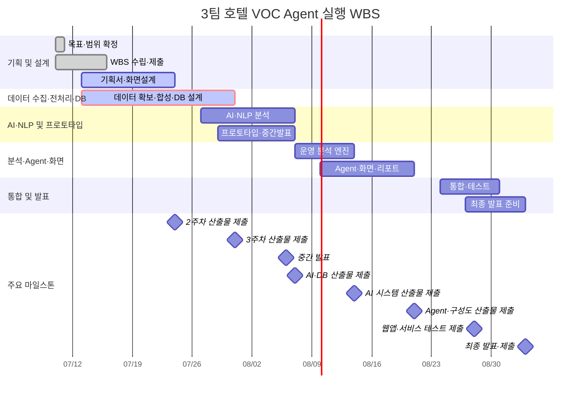

# 3팀 통합 WBS — 호텔 VOC·운영 이슈 분석 Agent (v2)

> 2026-07-10~09-03 · 5인(박준희·송민지·김재홍·정승·윤대성) · 실행 일정 61개 태스크 · 공식 산출물 21건 + 옵션 1건
> 실행 추적, 기획·요구사항 추적, 8주 개발 일정의 세 관점을 한 문서에 통합했다.
> 최종 갱신: 2026-07-20 15:44 KST · 갱신자: Codex

## 통합 운영 기준

- **실행 기준:** 아래 **실행 WBS**의 담당·현황·시작일·마감일·제출일을 일상적인 진행 관리 기준으로 사용한다.
- **기획 기준:** 아래 **기획·요구사항 추적 관점**은 우선순위와 요구사항 ID의 누락 여부를 확인하는 추적표로 사용한다.
- **주차 기준:** **8주 핵심 개발 일정**은 발표·제출 마일스톤과 트랙 간 선후행 관계를 빠르게 확인하는 요약표다.
- **단일 기준:** 저장소의 WBS 일정·상태·작업 이력은 이 문서에서만 관리하며 별도 AI 전용 WBS를 만들지 않는다.
- 두 WBS는 관점에 따라 공정과 Task ID를 다르게 묶었으므로, 같은 ID가 항상 같은 작업을 뜻하지는 않는다. 작업명·산출물·요구사항 ID를 함께 대조한다.
- Excel 통합본의 **WBS** 시트는 실행 추적, **기획 WBS** 시트는 기획·요구사항 추적에 사용한다.

### 작업 종료 갱신 규칙

1. 저장소 파일을 변경한 작업은 가장 가까운 **실행 WBS** 행의 현황·일정·산출물을 실제 결과에 맞게 갱신한다.
2. 대응 행이 없으면 해당 실행 단계의 다음 ID로 행을 추가하고 문서 상단 태스크 수와 **단계별 요약**을 함께 수정한다.
3. 현황은 `대기`, `진행`, `검토`, `차단`, `완료`, `취소` 중 하나로 기록한다. 확인되지 않은 완료 상태나 일정은 추정하지 않는다.
4. 일정이나 현황이 바뀌면 **8주 핵심 개발 일정**, **Mermaid 일정 가시화**, **산출물 제출 일정**의 관련 항목을 동기화한다.
5. 작업 종료 시 문서 하단 **WBS 작업 로그** 맨 위에 일시, 실행 WBS ID, 변경 결과, 검증과 관련 파일을 기록한다.
6. 단순 조사·설명처럼 저장소 변경이 없는 작업은 WBS와 작업 로그를 갱신하지 않는다.

### 공용 ID·산출물·검증 연계

기존 실행 WBS ID는 유지한다. 공용 개발 작업은 아래 결과 단위로 `DOC-*`, `REQ-*`, `TC-*`, 실제 evidence path를 연결하며 test evidence가 없으면 완료로 표시하지 않는다.

| wbs_id | 검증 가능한 결과 | deliverable_id | requirement_ids | owner | start_date | due_date | status | dependency | evidence_path |
|---|---|---|---|---|---|---|---|---|---|
| `1.5` | P0 범위와 기획서의 backlog 경계 검토 | `DOC-003` | 전체 P0 | 박준희·송민지 | 07/13 | 07/24 | 진행 | `DEC-005`~`009` 검토 | `docs/markdown/03_프로젝트기획서.md` |
| `1.6` | P0 4화면과 API·상태·권한 계약 정합 | `DOC-013` | `REQ-F-003`~`007`, `REQ-NF-001` | 송민지 | 07/13 | 07/24 | 진행 | `API-001`~`008` | `docs/markdown/05_화면설계서_초안.md` |
| `1.7` | 공용 통제·개발·data·API·test 명세와 구현 경계 확정 | `DOC-010`, `DOC-015` | 전체 P0 | 김재홍·정승 | 07/20 | 07/24 | 진행 | 없음 | `docs/markdown/final_project/00_project_control.md` 외 공용 문서 5개 |
| `2.2`, `2.3` | V1·V2 합성 fixture·manifest와 `TC-DQ-*` 통과 | `DOC-004` | `REQ-F-001`, `REQ-NF-001` | 정승·윤대성·김재홍 | 07/15 | 07/23 | 대기 | `02_data_standard_guide.md` | 미생성 |
| `2.7`, `2.8` | Django 단일 migration과 P0 8개 data 계약 검증 | `DOC-005` | `REQ-F-001`~`007` | 정승·김재홍 | 07/20 | 07/31 | 대기 | 합성 fixture | 미생성 |
| `4.4`, `4.5` | `RULE-001` signal·evidence와 `TC-UNIT-001` 통과 | `DOC-010` | `REQ-F-002`~`004` | 김재홍 | 08/10 | 08/14 | 대기 | `DATA-001`~`006` | 미생성 |
| `6.3`, `6.5` | `API-*` contract와 report fallback test 통과 | `DOC-014` | `REQ-F-003`~`007`, `REQ-NF-002` | 김재홍·윤대성·송민지·박준희 | 08/10 | 08/21 | 대기 | rule·evidence | 미생성 |
| `7.1`~`7.3` | P0 dashboard·signal detail·report 화면의 상태·권한 test 통과 | `DOC-013`, `DOC-014` | `REQ-F-003`~`007` | 송민지 | 08/18 | 08/21 | 대기 | 업무 API | 미생성 |
| `9.1` | `TC-E2E-001` V1→V2 Golden Path evidence 생성 | `DOC-016` | 전체 P0 | 전원 | 08/24 | 08/28 | 대기 | P0 구현 완료 | 미생성 |

## 🗓️ 8주 핵심 개발 일정

| 주차 | 기간 | 목표 | 마감 산출물 |
|---|---|---|---|
| **1주** | 07/10~16 | 기획·요구사항·데이터 착수 | 요구사항 정의서 · WBS |
| **2주** | 07/20~24 | 데이터 합성·수집·화면설계 | 프로젝트 기획서 · 수집 데이터 보고서 · 화면설계서 |
| **3주** | 07/27~31 | 전처리·DB·온톨로지 | DB/저장소 설계 문서 · 데이터 전처리 결과서 |
| 🎤 **4주** | 08/03~08/07 | 분류·이상탐지·통계·중간발표 | 중간 발표 PT(08/06) · ML/DL 학습결과서·모델 · 벡터DB/GraphDB 구축 결과서 |
| **5주** | 08/10~14 | 교차분석·원인후보·에이전트·text-to-SQL·아키텍처 | AI 시스템 아키텍처 · LLM 활용 소프트웨어 · 자체 sLLM |
| **6주** | 08/18~21 | 에이전트·대시보드·리포트·구성도 | 멀티 에이전트 테스트 보고서 · 시스템 구성도 |
| **7주** | 08/24~28 | 웹앱 통합·서비스 테스트 | LLM 연동 웹 애플리케이션 · 서비스 테스트 결과 보고서 |
| 🏁 **8주** | 08/31~09/03 | 최종 발표·시연 | 최종 발표 PT · 소스코드 · 시연영상 |

**마일스톤:** 🎤 중간발표 08/06 · 🏁 최종발표 09/03

## 📈 Mermaid 일정 가시화

> 실행 WBS의 단계별 기간과 공식 제출 마일스톤을 요약한다. 실행 WBS의 일정·현황이 바뀌면 이 차트도 같은 작업에서 갱신한다.

## 👤 트랙별·주차별 요구사항 배치

| 트랙 \ 주 | 2 | 3 | 4 | 5 | 6 | 7 |
|---|---|---|---|---|---|---|
| 데이터·DB | BIZ-005 DAT-008 FUN-003 FUN-004 | DAT-001 DAT-002 DAT-003 DAT-005 FUN-005 FUN-011 SEC-001 NFR-004 | DAT-004 | · | · | · |
| AI·NLP | · | AI-001 AI-002 | AI-003 AI-011 | FUN-008 AI-004 NFR-005 | NFR-006 | · |
| 분석·에이전트 | · | DAT-007 | BIZ-001 AI-005 AI-006 AI-007 | BIZ-002 BIZ-003 FUN-006 FUN-013 AI-008 AI-009 AI-010 NFR-003 OPS-003 | BIZ-004 FUN-007 FUN-012 RPT-002 TST-002 TST-003 | · |
| 백엔드 | · | · | DAT-006 INT-002 | INT-001 NFR-002 | FUN-001 FUN-002 FUN-009 SEC-002 | FUN-010 INT-003 SEC-003 NFR-001 OPS-001 OPS-002 TST-001 |
| 프론트 | · | · | · | · | UI-001 UI-002 UI-003 UI-005 RPT-001 | UI-004 |

> 8주차는 전원 발표·시연·소스 정리. ID 내용은 요구사항 정의서 참조.

## 🚦 일정 운영 핵심 원칙
1. **3주차까지 데이터+온톨로지 확보** — 늦으면 교차분석 전체가 밀린다.
2. 수치는 **온톨로지+SQL**로 정확히, LLM은 분류·설명·질문해석만.
3. **API 계약(Django↔FastAPI)** 4~5주차 조기 합의.
4. **트리거로 스스로 도는 장면 1개**는 반드시 데모에 (챗봇 아님 증명).
5. API 키 GitHub 노출 금지.

## 실행 WBS

일정 변경과 진행현황 갱신은 이 관점을 우선한다. 공식 제출일과 내부 검토일은 산출물 일정표와 함께 관리한다.

## 🔎 사용법 (xlsx)

- **필터:** 헤더 ▼로 단계/담당/현황별 보기 · **드롭다운:** 단계·담당·현황 목록 선택
- **간트 자동:** 시작일/마감일만 바꾸면 ■가 수식으로 자동 재배치 · **상태색·진척률 데이터바** 자동
- **틀 고정:** 좌측 작업정보+상단 날짜축 유지

## 📊 단계별 요약

| 단계 | 태스크 | 기간 |
|---|:--:|---|
| 기획 및 설계 | 7 | 07/10~07/24 |
| 데이터 수집·전처리·DB | 10 | 07/13~07/31 |
| AI·NLP 분석 | 7 | 07/27~08/07 |
| 프로토타입·중간발표 | 4 | 07/29~08/07 |
| 운영 분석 엔진 | 9 | 08/07~08/14 |
| Agent·화면·리포트 | 11 | 08/10~08/21 |
| 통합·테스트 | 8 | 08/24~08/31 |
| 최종 발표 준비 | 5 | 08/27~09/03 |

## 🗂️ 전체 태스크 (61개 · ★=v2 신규/수정)

### 기획 및 설계

| ID | 작업 항목 | 산출물 | 담당 | 현황 | 시작 | 마감 | 제출일 |
|---|---|---|:--:|:--:|:--:|:--:|:--:|
| 1.1 | 킥오프 및 프로젝트 목표 확정 | 프로젝트 범위 | 전원 | 완료 | 07/10 | 07/10 |  |
| 1.2 | 사용자·업무 시나리오 정의 | 서비스 시나리오 | 박준희·송민지 | 완료 | 07/10 | 07/13 |  |
| 1.3 | 요구사항 및 MVP 범위 확정·제출 | 요구사항 정의서 | 박준희·송민지 | 검토 | 07/10 | 07/16 | **07/16** |
| 1.4 | WBS 수립·제출 | WBS | 송민지 | 완료 | 07/10 | 07/16 | **07/16** |
| 1.5 | 프로젝트 기획서 작성·검토 | 프로젝트 기획서 | 박준희·송민지 | 대기 | 07/13 | 07/24 | **07/24** |
| 1.6 | 화면·데이터·분석 설계 | 화면설계서 | 송민지 | 진행 | 07/13 | 07/24 | **07/24** |
| 1.7★ | 개발환경·Git·최소 구조·공통 계약 확정 | 개발환경·저장소 기준 | 김재홍·정승 | 진행 | 07/20 | 07/24 |  |

### 데이터 수집·전처리·DB

| ID | 작업 항목 | 산출물 | 담당 | 현황 | 시작 | 마감 | 제출일 |
|---|---|---|:--:|:--:|:--:|:--:|:--:|
| 2.1 | 공개 호텔 리뷰 데이터 확보 | 원본 리뷰 데이터 | 정승 | 대기 | 07/13 | 07/22 |  |
| 2.2 | 한국어 합성 VOC 생성 | 합성 VOC | 정승·윤대성 | 대기 | 07/15 | 07/22 |  |
| 2.3 | 운영·인력·대기시간 데이터 생성 | 합성 운영 데이터 | 정승·김재홍 | 대기 | 07/15 | 07/23 |  |
| 2.4 | 수집 데이터 현황·출처·품질 문서화 | 수집 데이터 보고서 | 정승 | 대기 | 07/20 | 07/24 | **07/24** |
| 2.5 | 데이터 정제·통합 | 전처리 데이터 | 정승 | 대기 | 07/20 | 07/29 |  |
| 2.6 | 전처리 기준·결과 문서화 | 데이터 전처리 결과서 | 정승 | 대기 | 07/27 | 07/31 | **07/31** |
| 2.7 | 데이터베이스 설계 및 적재 | DB 스키마·적재본 | 정승·김재홍 | 대기 | 07/20 | 07/30 |  |
| 2.8 | DB·저장소 구조 및 흐름 문서화 | 데이터베이스/저장소 설계 문서 | 정승·김재홍 | 대기 | 07/27 | 07/31 | **07/31** |
| 2.9★ | 온톨로지·시맨틱 레이어(지표 정의) | 지표 정의 레지스트리 | 김재홍·정승 | 대기 | 07/27 | 07/31 |  |
| 2.10★ | 합성 데이터 검증·정답표 구축 | 검증 리포트·정답표 | 정승 | 대기 | 07/29 | 07/31 |  |

### AI·NLP 분석

| ID | 작업 항목 | 산출물 | 담당 | 현황 | 시작 | 마감 | 제출일 |
|---|---|---|:--:|:--:|:--:|:--:|:--:|
| 3.1 | 감성 분류 방식 비교·선정 | 모델 비교 결과 | 윤대성 | 대기 | 07/27 | 08/05 |  |
| 3.2 | 서비스 주제 분류 구현 | 주제 분류 모듈 | 윤대성 | 대기 | 07/29 | 08/05 |  |
| 3.3 | 키워드·반복 불만 추출 | VOC 분석 모듈 | 윤대성 | 대기 | 08/03 | 08/05 |  |
| 3.4 | 2개 이상 모델 성능평가·오류 분석 | 머신러닝/딥러닝 학습결과서 | 윤대성 | 대기 | 08/03 | 08/07 | **08/07** |
| 3.5 | 최종 모델 저장·재현·연동 검증 | 학습한 ML/DL 모델 | 윤대성 | 대기 | 08/03 | 08/07 | **08/07** |
| 3.6 | 벡터DB 구축·검색 성능 검증 | 벡터DB/GraphDB 구축 결과서 | 김재홍·윤대성 | 대기 | 07/29 | 08/07 | **08/07** |
| 3.7★ | 비지도 이상탐지·리뷰 군집 | ML/DL 학습결과서(비지도) | 윤대성 | 대기 | 08/03 | 08/07 |  |

### 프로토타입·중간발표

| ID | 작업 항목 | 산출물 | 담당 | 현황 | 시작 | 마감 | 제출일 |
|---|---|---|:--:|:--:|:--:|:--:|:--:|
| 4.1★ | React+Tremor 기본 레이아웃 | UI 프로토타입 | 송민지 | 대기 | 07/29 | 08/04 |  |
| 4.2★ | React 대시보드·차트 초안 | 중간발표 화면 | 송민지 | 대기 | 08/03 | 08/05 |  |
| 4.3 | 중간발표 자료·대본 통합 | 중간 발표 PT 자료 | 박준희·전원 | 대기 | 08/03 | 08/06 | **08/06** |
| 4.4 | 중간발표 및 피드백 수집 | 피드백 목록 | 전원 | 대기 | 08/06 | 08/07 |  |

### 운영 분석 엔진

| ID | 작업 항목 | 산출물 | 담당 | 현황 | 시작 | 마감 | 제출일 |
|---|---|---|:--:|:--:|:--:|:--:|:--:|
| 5.1 | 중간발표 피드백 반영·범위 조정 | 수정 계획 | 박준희·전원 | 대기 | 08/07 | 08/10 |  |
| 5.2 | 운영 KPI 계산 모듈 개발 | KPI 모듈 | 김재홍 | 대기 | 08/07 | 08/13 |  |
| 5.3 | 이상징후 탐지 규칙 구현 | 탐지 엔진 | 김재홍 | 대기 | 08/10 | 08/14 |  |
| 5.4 | VOC·운영지표 교차 분석 | 교차 분석 엔진 | 김재홍·윤대성 | 대기 | 08/10 | 08/14 |  |
| 5.5 | 원인 후보 점수 및 근거 생성 | 원인 후보 모듈 | 김재홍 | 대기 | 08/12 | 08/14 |  |
| 5.6 | 에이전트·데이터 흐름·Fallback 설계 | AI 시스템 아키텍처 | 김재홍·윤대성 | 대기 | 08/10 | 08/14 | **08/14** |
| 5.7★ | FastAPI AI 서비스·LLM·벡터DB 연동 패키징 | LLM 활용 소프트웨어 | 김재홍·윤대성 | 대기 | 08/10 | 08/14 | **08/14** |
| 5.8 | sLLM 파인튜닝·기본 모델 비교 | 자체 sLLM 인공지능 | 윤대성 | 대기 | 08/10 | 08/14 | **08/14** |
| 5.9★ | 능동형 트리거(이상징후 자동 조사) | 트리거 모듈 | 김재홍 | 대기 | 08/12 | 08/14 |  |

### Agent·화면·리포트

| ID | 작업 항목 | 산출물 | 담당 | 현황 | 시작 | 마감 | 제출일 |
|---|---|---|:--:|:--:|:--:|:--:|:--:|
| 6.1 | VOC 상세 분석 화면 | VOC 화면 | 송민지 | 대기 | 08/10 | 08/18 |  |
| 6.2 | 운영 이슈 분석 화면 | 운영 분석 화면 | 송민지 | 대기 | 08/13 | 08/20 |  |
| 6.3★ | LangGraph 에이전트 코어(supervisor) 구현 | Agent 기능 | 김재홍·윤대성 | 대기 | 08/13 | 08/19 |  |
| 6.4 | Agent 분석 결과 화면 연동 | Agent 화면 | 송민지·김재홍 | 대기 | 08/18 | 08/21 |  |
| 6.5 | 대응 옵션 생성 기능 | 추천 모듈 | 윤대성·김재홍 | 대기 | 08/18 | 08/21 |  |
| 6.6 | 주간 리포트 생성·박준희(PM) 사전 검토 | HTML/PDF 리포트 | 송민지·박준희 | 대기 | 08/18 | 08/21 |  |
| 6.7 | 멀티 에이전트 연동·예외 테스트 | 멀티 에이전트 테스트 계획 및 결과 보고서 | 김재홍·윤대성 | 대기 | 08/18 | 08/21 | **08/21** |
| 6.8 | 배포 구성·기술 스택 시각화 | 시스템 구성도 | 김재홍 | 대기 | 08/18 | 08/21 | **08/21** |
| 6.9★ | text-to-SQL(온톨로지 그라운딩·검증·시각화 연결) | t2SQL 도구·차트 | 송민지·김재홍 | 대기 | 08/13 | 08/20 |  |
| 6.10★ | 추천 질문 제안(답 가능 질문만) | 추천 질문 UX | 윤대성 | 대기 | 08/19 | 08/21 |  |
| 6.11★ | Django 로그인(Level2)·역할 권한 | 인증·RBAC | 김재홍 | 대기 | 08/18 | 08/21 |  |

### 통합·테스트

| ID | 작업 항목 | 산출물 | 담당 | 현황 | 시작 | 마감 | 제출일 |
|---|---|---|:--:|:--:|:--:|:--:|:--:|
| 7.1 | 전체 기능 통합(박준희(PM) 휴가 중 대행 체계) | 통합 시스템 | 송민지·김재홍·정승·윤대성 | 대기 | 08/24 | 08/27 |  |
| 7.2 | 기능·데이터·예외 서비스 테스트 | 서비스 테스트 계획 및 결과 보고서 | 송민지·김재홍·정승·윤대성 | 대기 | 08/24 | 08/28 | **08/28** |
| 7.3 | LLM 연동 웹 애플리케이션 배포·점검 | 개발된 LLM 연동 웹 애플리케이션 | 송민지·김재홍·정승·윤대성 | 대기 | 08/24 | 08/28 | **08/28** |
| 7.4 | 오류 수정 및 UI 개선 | 최종 서비스 | 전원 | 대기 | 08/27 | 08/31 |  |
| 7.5 | 대표 데모 데이터·시나리오 확정 | 데모 시나리오 | 박준희·전원 | 대기 | 08/27 | 08/31 |  |
| 7.6★ | eval 정답표 자동 채점·Langfuse 관측 | 정확도 리포트 | 김재홍·윤대성 | 대기 | 08/24 | 08/28 |  |
| 7.7★ | MCP 리포트 전달(읽기·승인, stretch) | MCP 연동 | 김재홍 | 대기 | 08/26 | 08/28 |  |
| 7.8★ | AI 윤리·편향성 점검(옵션·중요도 낮음) | AI 윤리/편향성 점검 결과서(옵션) | 윤대성 | 대기 | 08/24 | 08/26 |  |

### 최종 발표 준비

| ID | 작업 항목 | 산출물 | 담당 | 현황 | 시작 | 마감 | 제출일 |
|---|---|---|:--:|:--:|:--:|:--:|:--:|
| 8.1 | 최종 발표자료·비즈니스 연계·대본 작성 | 최종 발표 PT 자료 | 박준희·송민지 | 대기 | 08/27 | 09/03 | **09/03** |
| 8.2 | README·기술문서·소스코드 정리 | 프로젝트 개발 소스코드 | 김재홍·정승·윤대성 | 대기 | 08/27 | 09/03 | **09/03** |
| 8.3 | 대표 시나리오 녹화·편집 | 시연영상 | 송민지·박준희 | 대기 | 08/27 | 09/02 | **09/03** |
| 8.4 | 발표 리허설 및 최종 점검 | 최종 결과물 | 전원 | 대기 | 09/01 | 09/02 |  |
| 8.5 | 최종 제출·발표 | 최종 발표 | 전원 | 대기 | 09/03 | 09/03 |  |

> ★ v2 신규: 2.9 온톨로지 · 2.10 정답표 · 3.7 비지도 · 5.9 트리거 · 6.9 text-to-SQL · 6.10 추천질문 · 6.11 인증 Level2 · 7.6 eval · 7.7 MCP · 7.8 AI윤리(옵션) │ ★ 수정: 1.7 Docker 3스택 · 4.1~4.2 React · 5.7 FastAPI · 6.3 LangGraph

---

## 🧑‍💻 담당별 요약

**박준희(PM)** (9건): 1.2, 1.3, 1.5, 4.3, 5.1, 6.6, 7.5, 8.1, 8.3

**송민지** (17건): 1.2, 1.3, 1.4, 1.5, 1.6, 4.1, 4.2, 6.1, 6.2, 6.4, 6.6, 6.9, 7.1, 7.2, 7.3, 8.1, 8.3

**김재홍** (26건): 1.7, 2.3, 2.7, 2.8, 2.9, 3.6, 5.2, 5.3, 5.4, 5.5, 5.6, 5.7, 5.9, 6.3, 6.4, 6.5, 6.7, 6.8, 6.9, 6.11, 7.1, 7.2, 7.3, 7.6, 7.7, 8.2

**정승** (15건): 1.7, 2.1, 2.2, 2.3, 2.4, 2.5, 2.6, 2.7, 2.8, 2.9, 2.10, 7.1, 7.2, 7.3, 8.2

**윤대성** (22건): 2.2, 3.1, 3.2, 3.3, 3.4, 3.5, 3.6, 3.7, 5.4, 5.6, 5.7, 5.8, 6.3, 6.5, 6.7, 6.10, 7.1, 7.2, 7.3, 7.6, 7.8, 8.2

**전원** (8건): 1.1, 4.3, 4.4, 5.1, 7.4, 7.5, 8.4, 8.5

---

## 📦 산출물 제출 일정 (공식 21 + 옵션 1)

| 단계 | 산출물 | 제출일 | 내부검토 | WBS | 담당 | 현황 |
|---|---|:--:|:--:|:--:|:--:|:--:|
| 모델 배포 | 요구사항 정의서 | **07/16** | 07/15 | 1.3 | 박준희·송민지 | 검토 |
| 기획 | WBS | **07/16** | 07/15 | 1.4 | 송민지 | 완료 |
| 기획 | 프로젝트 기획서 | **07/24** | 07/23 | 1.5 | 박준희·송민지 | 대기 |
| 데이터 수집 및 저장 | 수집 데이터 보고서 | **07/24** | 07/23 | 2.4 | 정승 | 대기 |
| 모델 배포 | 화면설계서 | **07/24** | 07/23 | 1.6 | 송민지 | 대기 |
| 데이터 수집 및 저장 | 데이터베이스/저장소 설계 문서 | **07/31** | 07/30 | 2.8 | 정승·김재홍 | 대기 |
| 데이터 전처리 | 데이터 전처리 결과서 | **07/31** | 07/30 | 2.6 | 정승 | 대기 |
| 발표 및 시연 | 중간 발표 PT 자료 | **08/06** | 08/05 | 4.3 | 박준희·전원 | 대기 |
| 데이터 전처리 | 머신러닝/딥러닝 학습결과서 | **08/07** | 08/05 | 3.4 | 윤대성 | 대기 |
| 데이터 전처리 | 학습한 ML/DL 모델 | **08/07** | 08/05 | 3.5 | 윤대성 | 대기 |
| 모델링 및 평가 | 벡터DB/GraphDB 구축 결과서 | **08/07** | 08/05 | 3.6 | 김재홍·윤대성 | 대기 |
| 모델링 및 평가 | AI 시스템 아키텍처 | **08/14** | 08/13 | 5.6 | 김재홍·윤대성 | 대기 |
| 모델링 및 평가 | LLM 활용 소프트웨어 | **08/14** | 08/13 | 5.7 | 김재홍·윤대성 | 대기 |
| 모델링 및 평가 | 자체 sLLM 인공지능 | **08/14** | 08/13 | 5.8 | 윤대성 | 대기 |
| 모델링 및 평가 | 멀티 에이전트 테스트 계획 및 결과 보고서 | **08/21** | 08/20 | 6.7 | 김재홍·윤대성 | 대기 |
| 모델 배포 | 시스템 구성도 | **08/21** | 08/20 | 6.8 | 김재홍 | 대기 |
| 모델 배포 | 개발된 LLM 연동 웹 애플리케이션 | **08/28** | 08/27 | 7.3 | 송민지·김재홍·정승·윤대성 | 대기 |
| 모델 배포 | 서비스 테스트 계획 및 결과 보고서 | **08/28** | 08/27 | 7.2 | 송민지·김재홍·정승·윤대성 | 대기 |
| 발표 및 시연 | 최종 발표 PT 자료 | **09/03** | 09/02 | 8.1 | 박준희·송민지 | 대기 |
| 발표 및 시연 | 프로젝트 개발 소스코드 | **09/03** | 09/02 | 8.2 | 김재홍·정승·윤대성 | 대기 |
| 발표 및 시연 | 시연영상 | **09/03** | 09/02 | 8.3 | 송민지·박준희 | 대기 |
| 모델링 및 평가 | AI 윤리/편향성 점검 결과서(옵션) | **옵션** | 08/26 | 7.8 | 윤대성 | 대기 |

## 기획·요구사항 추적 관점

아래 표는 기능 범위, Must/Should 우선순위, 관련 요구사항 ID와 산출물 연결을 확인하기 위한 기획 기준표다. 실행 WBS의 공정·ID 체계와 다를 수 있다.

### 기획 대공정 구조

| # | 대공정 | 담당 | 주차 |
|---|---|---|---|
| 1 | 기획 및 요구사항 | 전원 | 1~1주 |
| 2 | 데이터·합성·온톨로지 | 정승 | 2~3주 |
| 3 | AI 모델(분류·이상탐지) | 윤대성 | 3~5주 |
| 4 | 분석 엔진 | 김재홍 | 4~5주 |
| 5 | 에이전트·text-to-SQL | 김재홍·윤대성 | 5~6주 |
| 6 | 백엔드·연동 | 김재홍 | 5~7주 |
| 7 | 프론트·시각화 | 송민지 | 6~7주 |
| 8 | 평가·품질 | 김재홍·윤대성 | 6~7주 |
| 9 | 통합·테스트·배포 | 전원 | 7~7주 |
| 10 | 최종 발표 | 전원 | 4~8주 |

### 1. 기획 및 요구사항 · 담당 전원

| ID | 세부 업무 | 담당 | 시작 | 마감 | 우선순위 | 관련 요구사항 | 산출물 |
|---|---|:--:|:--:|:--:|:--:|---|---|
| 1.1 | 킥오프·목표·범위 확정 | 전원 | 07/10 | 07/16 | 🔴Must | BIZ-001~005 | 프로젝트 범위 |
| 1.2 | 요구사항 정의서·MVP 범위 확정·제출 | 전원 | 07/10 | 07/16 | 🔴Must | 전체 | 요구사항 정의서 |
| 1.3 | WBS·역할·API 계약 초안 | 박준희 | 07/10 | 07/16 | 🔴Must | - | WBS |
| 1.4 | 개발환경·Git·Docker Compose 설정 | 김재홍·정승 | 07/10 | 07/16 | 🟡Should | - | 개발환경 |

### 2. 데이터·합성·온톨로지 · 담당 정승

| ID | 세부 업무 | 담당 | 시작 | 마감 | 우선순위 | 관련 요구사항 | 산출물 |
|---|---|:--:|:--:|:--:|:--:|---|---|
| 2.1 | 공개 리뷰 컬럼·스키마 조사(참고) | 정승 | 07/20 | 07/24 | 🔴Must | DAT-001 | 수집 데이터 보고서 |
| 2.2 | 스키마 정의서=온톨로지 초안 작성 | 정승 | 07/20 | 07/24 | 🔴Must | DAT-007,DAT-008 | DB/저장소 설계 문서 |
| 2.3 | 합성 데이터 생성(규칙+분포)·결측/이상치 주입 | 정승 | 07/20 | 07/31 | 🔴Must | DAT-003,DAT-008 | 합성 데이터 |
| 2.4 | 전처리·정규화·개인정보 마스킹 | 정승 | 07/27 | 07/31 | 🔴Must | FUN-005,SEC-001 | 데이터 전처리 결과서 |
| 2.5 | PostgreSQL+pgvector 구축·적재 | 정승 | 07/27 | 07/31 | 🔴Must | DAT-001~005,FUN-003,FUN-004,NFR-004 | DB/저장소 설계 문서 |
| 2.6 | 온톨로지/시맨틱 레이어(지표 정의) | 김재홍·정승 | 07/27 | 07/31 | 🔴Must | DAT-007 | AI 시스템 아키텍처 |
| 2.7 | 정답표 구축(eval 재료) | 정승 | 07/27 | 07/31 | 🟡Should | DAT-008,TST-003 | - |

### 3. AI 모델(분류·이상탐지) · 담당 윤대성

| ID | 세부 업무 | 담당 | 시작 | 마감 | 우선순위 | 관련 요구사항 | 산출물 |
|---|---|:--:|:--:|:--:|:--:|---|---|
| 3.1 | 감성 분류 2개 이상 비교·선정 | 윤대성 | 07/27 | 08/07 | 🔴Must | AI-001 | ML/DL 학습결과서 |
| 3.2 | 다중 주제 분류 | 윤대성 | 07/27 | 08/07 | 🔴Must | AI-002 | ML/DL 학습결과서 |
| 3.3 | 근거 문장 추출·분류 보정 | 윤대성 | 08/03 | 08/14 | 🔴Must | AI-003,FUN-008 | LLM 활용 소프트웨어 |
| 3.4 | 비지도 이상탐지·리뷰 군집 | 윤대성 | 08/03 | 08/07 | 🔴Must | AI-006,AI-011 | ML/DL 학습결과서 |
| 3.5 | 자체 sLLM 파인튜닝(옵션·강사 확인) | 윤대성 | 08/10 | 08/14 | 🟡Should | AI-004 | 자체 sLLM 인공지능 |
| 3.6 | 벡터DB 임베딩·검색 성능 검증 | 김재홍·윤대성 | 08/03 | 08/07 | 🟡Should | DAT-006,INT-002 | 벡터DB/GraphDB 구축 결과서 |

### 4. 분석 엔진 · 담당 김재홍

| ID | 세부 업무 | 담당 | 시작 | 마감 | 우선순위 | 관련 요구사항 | 산출물 |
|---|---|:--:|:--:|:--:|:--:|---|---|
| 4.1 | VOC 통계·증감률(코드) | 김재홍 | 08/03 | 08/07 | 🔴Must | AI-005 | LLM 활용 소프트웨어 |
| 4.2 | 운영지표 기간 비교(코드) | 김재홍 | 08/03 | 08/07 | 🔴Must | AI-007 | LLM 활용 소프트웨어 |
| 4.3 | VOC·운영 교차분석·매핑 | 김재홍·윤대성 | 08/10 | 08/14 | 🔴Must | AI-008 | AI 시스템 아키텍처 |
| 4.4 | 원인 후보 규칙 엔진·근거 | 김재홍 | 08/10 | 08/14 | 🔴Must | AI-009,BIZ-002,BIZ-003,NFR-003 | LLM 활용 소프트웨어 |
| 4.5 | 이상징후 규칙·임계값 관리 | 김재홍 | 08/10 | 08/14 | 🟡Should | AI-006,OPS-003 | - |

### 5. 에이전트·text-to-SQL · 담당 김재홍·윤대성

| ID | 세부 업무 | 담당 | 시작 | 마감 | 우선순위 | 관련 요구사항 | 산출물 |
|---|---|:--:|:--:|:--:|:--:|---|---|
| 5.1 | LangGraph 에이전트 코어(supervisor) | 김재홍·윤대성 | 08/10 | 08/21 | 🔴Must | FUN-006 | LLM 활용 소프트웨어 |
| 5.2 | 능동형 트리거(이상징후 자동 스캔) | 김재홍 | 08/10 | 08/14 | 🔴Must | FUN-013 | LLM 활용 소프트웨어 |
| 5.3 | text-to-SQL(온톨로지 그라운딩·검증·시각화) | 송민지·김재홍 | 08/10 | 08/21 | 🔴Must | AI-010,UI-005 | LLM 활용 소프트웨어 |
| 5.4 | 추천 질문 제안 | 윤대성 | 08/18 | 08/21 | 🟡Should | FUN-012 | LLM 활용 소프트웨어 |
| 5.5 | 대응 옵션 생성 | 윤대성·김재홍 | 08/18 | 08/21 | 🔴Must | FUN-007,BIZ-004 | LLM 활용 소프트웨어 |
| 5.6 | 멀티에이전트 라우팅·Fallback 테스트 | 김재홍·윤대성 | 08/18 | 08/21 | 🟡Should | TST-002 | 멀티 에이전트 테스트 보고서 |

### 6. 백엔드·연동 · 담당 김재홍

| ID | 세부 업무 | 담당 | 시작 | 마감 | 우선순위 | 관련 요구사항 | 산출물 |
|---|---|:--:|:--:|:--:|:--:|---|---|
| 6.1 | Django 로그인(Level2)·역할 권한 | 김재홍 | 08/18 | 08/21 | 🔴Must | FUN-001,FUN-002 | 웹 애플리케이션 |
| 6.2 | 관리자 기능(Django admin·규칙 관리) | 김재홍 | 08/18 | 08/21 | ⚪Could | FUN-009~011,SEC-003,OPS-001,OPS-002 | 웹 애플리케이션 |
| 6.3 | FastAPI AI 서비스·Django 게이트웨이 | 김재홍·윤대성 | 08/10 | 08/21 | 🔴Must | INT-001 | LLM 활용 소프트웨어 |
| 6.4 | LLM API·벡터DB 연동·Fallback | 김재홍·윤대성 | 08/10 | 08/14 | 🔴Must | INT-001,INT-002,NFR-002 | LLM 활용 소프트웨어 |
| 6.5 | 주간 HTML 리포트 생성 | 송민지·박준희 | 08/18 | 08/21 | 🔴Must | RPT-001,RPT-002 | 웹 애플리케이션 |
| 6.6 | MCP 읽기·전달(stretch) | 김재홍 | 08/24 | 08/28 | 🟡Should | INT-003 | 시스템 구성도 |

### 7. 프론트·시각화 · 담당 송민지

| ID | 세부 업무 | 담당 | 시작 | 마감 | 우선순위 | 관련 요구사항 | 산출물 |
|---|---|:--:|:--:|:--:|:--:|---|---|
| 7.1 | 실무자 대시보드(필터·KPI·추세) | 송민지 | 08/18 | 08/21 | 🔴Must | UI-001 | 웹 애플리케이션 |
| 7.2 | 관리자 요약 화면 | 송민지 | 08/18 | 08/21 | 🔴Must | UI-002 | 웹 애플리케이션 |
| 7.3 | 근거 리뷰·교차 변화 차트 | 송민지 | 08/18 | 08/21 | 🔴Must | UI-003 | 웹 애플리케이션 |
| 7.4 | text-to-SQL 결과 자동 시각화 | 송민지 | 08/18 | 08/21 | 🔴Must | UI-005 | 웹 애플리케이션 |
| 7.5 | 접근성·화면설계서 | 송민지 | 08/24 | 08/28 | 🟡Should | UI-004 | 화면설계서 |

### 8. 평가·품질 · 담당 김재홍·윤대성

| ID | 세부 업무 | 담당 | 시작 | 마감 | 우선순위 | 관련 요구사항 | 산출물 |
|---|---|:--:|:--:|:--:|:--:|---|---|
| 8.1 | eval 정답표 자동 채점·관측성(Langfuse) | 김재홍·윤대성 | 08/18 | 08/28 | 🟡Should | TST-003 | 서비스 테스트 결과서 |
| 8.2 | AI 윤리·편향성 점검(옵션·중요도 낮음) | 윤대성 | 08/18 | 08/21 | ⚪Could | NFR-005,NFR-006 | AI 윤리/편향성 점검 결과서 |

### 9. 통합·테스트·배포 · 담당 전원

| ID | 세부 업무 | 담당 | 시작 | 마감 | 우선순위 | 관련 요구사항 | 산출물 |
|---|---|:--:|:--:|:--:|:--:|---|---|
| 9.1 | 핵심 시나리오 서비스 통합 테스트 | 전원 | 08/24 | 08/28 | 🔴Must | TST-001 | 서비스 테스트 결과 보고서 |
| 9.2 | 성능·가용성 점검 | 김재홍 | 08/24 | 08/28 | 🟡Should | NFR-001,NFR-002 | 서비스 테스트 결과서 |
| 9.3 | 배포·시스템 구성도·API 키 점검 | 김재홍 | 08/18 | 08/28 | 🔴Must | SEC-002 | 시스템 구성도 |

### 10. 최종 발표 · 담당 전원

| ID | 세부 업무 | 담당 | 시작 | 마감 | 우선순위 | 관련 요구사항 | 산출물 |
|---|---|:--:|:--:|:--:|:--:|---|---|
| 10.1 | 중간 발표 PT·발표(08/06) | 전원 | 08/03 | 08/07 | 🔴Must | - | 중간 발표 PT |
| 10.2 | 최종 발표 PT·비즈니스 연계 | 전원 | 08/31 | 09/03 | 🔴Must | - | 최종 발표 PT |
| 10.3 | 소스코드·README 정리 | 전원 | 08/31 | 09/03 | 🔴Must | - | 소스코드 |
| 10.4 | 대표 시나리오 녹화·편집 | 송민지·박준희 | 08/31 | 09/03 | 🔴Must | - | 시연영상 |
| 10.5 | 리허설·최종 제출·발표(09/03) | 전원 | 08/31 | 09/03 | 🔴Must | - | 최종 발표 |

## WBS 작업 로그

최신 기록을 위에 추가한다. 실행 WBS의 상태·일정·산출물 변경이 없더라도 WBS 운영 방식이나 시각화를 변경한 작업은 가장 가까운 관련 ID로 기록한다.

| 일시(KST) | 실행 WBS ID | 변경 결과 | 검증 | 관련 파일 |
|---|---|---|---|---|
| 2026-07-20 15:44 | 1.3, 1.7, 9.1 | 공용 통제·data·API/AI·산출물 추적·test 인수 문서를 생성하고 기존 요구사항·WBS ID를 P0 `REQ-*`·`DOC-*`·`TC-*`에 mapping, 구현 경계 5개를 `.gitkeep`으로 추적 | 공용 문서 6개 제한과 기존 공통 명세 재사용, P0/확장·미도입 기술 상태·evidence 미생성 표기, 구현 경계만 생성하고 code·migration 미생성 확인 | `README.md`, `app/`, `src/`, `docs/markdown/01_요구사항정의서.md`, `docs/markdown/02_WBS.md`, `docs/markdown/final_project/` |
| 2026-07-20 15:23 | 1.6, 1.7 | 최소 MVP Golden Path, 4개 화면, 서비스별 책임, 공통 상태·API·데이터 계약과 저장소 구조 기준을 확정하고 기존 화면설계서에 P0 우선 규칙 반영 | 구현 파일·dependency 없음 확인, P0와 확장 분리, 빈 framework 폴더 미생성, 내부 문서 링크 점검 | `README.md`, `docs/markdown/05_화면설계서_초안.md`, `docs/markdown/final_project/` |
| 2026-07-20 12:44 | 8.2 | 전체 문서의 용도를 검토해 질문 주제별 기존 문서 참고 기준·작업별 참고 문서·충돌 처리 우선순위를 문서관리규칙에 추가 | Markdown 21개·템플릿 18개·제출본 2개·보조 이미지 1개 분류와 경로 확인, 새 문서 생성 지시 없음 확인 | `docs/문서관리규칙.md`, `docs/markdown/02_WBS.md` |
| 2026-07-20 12:17 | 1.4 | 별도 WBS·요구사항 검증 결과 문서를 삭제해 WBS 관리 문서를 정리 | 삭제 대상 1건과 잔여 참조 0건 확인 | `docs/markdown/02_WBS.md` |
| 2026-07-20 11:24 | 1.4 | WBS 단일 기준을 `02_WBS.md`로 전환하고 작업별 갱신 규칙·Mermaid Gantt·작업 로그 추가 | 실행 태스크 61개 유지, Mermaid 단계 8개·마일스톤 8개 및 참조 경로 확인 | `AGENTS.md`, `docs/markdown/02_WBS.md` |
