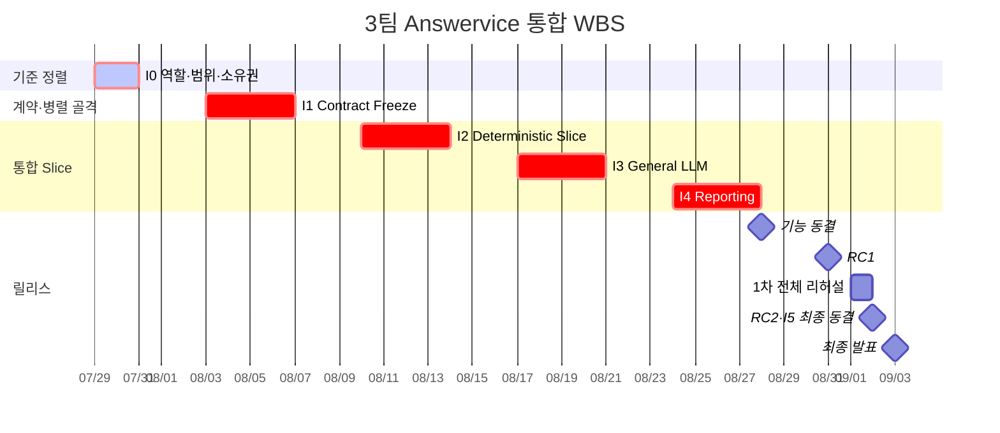

# Answervice — DataHub 대화형 분석·자동 리포팅 WBS

| 항목 | 내용 |
|---|---|
| 문서 설명 | Answervice 실행 작업·담당·상태·일정·산출물·Gate를 관리하는 공식 WBS 작업본 |
| 문서 분류 | 산출물 작업본 |
| 버전 | v8.02 |
| 문서 기준일 | 2026-08-04 16:20 |
| 작성·수정 | 김재홍·박준희·정승·윤대성·송민지 |
| 산출물 번호 | 02 |
| 제출 일자 | 2026-07-16 |
| 대응 템플릿 | `docs/templates/[기획] WBS_양식 (1)_27기_0팀.xlsx`, `docs/templates/[기획] WBS_양식(2)_27기_0팀.xlsx` |

## 한눈에 보기

| 항목 | 내용 |
|---|---|
| 프로젝트 기간 | 2026-07-10~09-03 |
| 집중 개발 기간 | 2026-07-29~09-03 (5.4주) |
| 팀 구성 | 5명 (R1~R5) |
| 실행 범위 | 실행 일정 99개 태스크 · I0~I5 통합 Gate |
| 제출 범위 | 공식 산출물 21건 + 옵션 1건 |
| 후속 범위 | I5 이후 비차단 백로그 4건 |

**읽는 순서:** 역할 → 통합 일정 → 단계별 요약 → 99개 상세 작업 → 산출물 제출 일정

**상태 기준:** `완료` 끝난 작업 · `진행` 수행 중 · `검토` 결과 확인 중 · `차단` 선결 조건 필요 · `대기` 착수 전

**기준 문서:** `docs/Answervice_기획서.md` · `docs/markdown/05_화면설계서.md` · `docs/markdown/collaboration/Gate_실행_카드_원장.md`

## 역할 및 책임

| 역할 | 담당자 | branch | 책임 영역 |
|---|---|---|---|
| R1 | 박준희 | `junhee` | 계약·통합·품질·릴리스 |
| R2 | 정승 | `seung` | 데이터·메타데이터·연합조회 |
| R3 | 윤대성 | `daesung` | AI·모델·프롬프트·ModelOps |
| R4 | 김재홍 | `jaehong` | 백엔드 Control Plane |
| R5 | 송민지 | `minji` | 프론트엔드·자동 리포팅 |

상세 역할 경계와 운영 원칙은 `AGENTS.md`, 실행 묶음과 상태는 `docs/markdown/collaboration/Gate_실행_카드_원장.md`를 따른다.

## 통합 Gate·병합 일정

| Gate | 기간 | 통과 기준 | 운영·`dev` 병합 기준 |
|---|---|---|---|
| I0 기준 정렬 | 07/29~07/31 | 역할·branch·P0/P1/P2·backend·frontend·파일 소유권 확정 | checkpoint: R1 기준 결정만 공유하고 역할 구현은 branch에서 계속 |
| I1 Contract Freeze | 08/03~08/07 | metric·time·schema·API·model·Report·health 계약과 fake 소비 가능 | Wave 1: 공통 계약·schema·fake·skeleton만 최소 병합 |
| I2 Deterministic Slice | 08/10~08/14 | PMS+CRM 대표 질문의 Context→G1→G2→Trino→G3→Artifact→화면 trace | Wave 2: `seung` → `daesung` → `jaehong` → `minji` → `junhee` |
| I3 General LLM | 08/17~08/21 | 5 catalog 단독·승인 JOIN·Node 통합·보안 기준선 | Wave 3: `seung` → `daesung` → `jaehong` → `minji` → `junhee` |
| I4 Reporting | 08/24~08/28 | Chat→Artifact→Report→manual/schedule→history, partial·retry 검증 | Wave 4 시작: `minji` proposal → `jaehong` 등록 후 역할별 완료분 통합 |
| RC1 | 08/31 | 필수 30건과 역할별 release 후보 판정 | Critical·High 결함만 소유 branch에서 수정 |
| 리허설 1 | 09/01 | 빈 환경 기동·재적재·성공·차단·partial·재시작 시연 | 승인된 순서로 전 역할 확인 |
| RC2·I5 | 09/02 | release SHA·runbook·code·data·model·prompt·policy 동결 | 승인 후 `dev`→`main`은 별도 승인 |
| 최종 발표 | 09/03 | 승인 SHA와 고정 fixture로 시연·질의응답 | 발표 중 code·설정 변경 금지 |

## 🗓️ 8주 핵심 개발 일정

| 구간 | 기간 | 목표 | 마감·Gate |
|---|---|---|---|
| 선행 1 | 07/10~07/16 | 요구사항·WBS 수립 | 요구사항 정의서·WBS |
| 선행 2 | 07/20~07/24 | 기획·데이터·화면 작업본 | 프로젝트 기획서·수집 데이터 보고서·화면설계서 |
| 실행 1 | 07/29~07/31 | 새 5인 역할·소유권 정렬, 데이터 계약 착수 | I0·DB/저장소 설계·전처리 결과 |
| 실행 2 | 08/03~08/07 | 계약·fixture·골격 동결, 중간 발표 | I1·중간 발표·ML/DL·공식 DB 관련 산출물 |
| 실행 3 | 08/10~08/14 | 대표 2-source 결정론적 전체 왕복 | I2·AI 아키텍처·LLM·sLLM 산출물 |
| 실행 4 | 08/17~08/21 | 5 source·일반 질문·보안 기준선 | I3·역할 분리 Node 비교 보고·시스템 구성도 |
| 실행 5 | 08/24~08/28 | 자동 리포팅·장애·복구·회귀 | I4·기능 동결·웹앱·서비스 테스트 |
| 실행 6 | 08/31~09/03 | RC1·리허설·I5·최종 발표 | 최종 PT·소스코드·시연영상 |

## 📈 Mermaid 일정 가시화

```mermaid
gantt
    title 3팀 Answervice 통합 WBS
    dateFormat  YYYY-MM-DD
    axisFormat  %m/%d

    section 기준 정렬
    I0 역할·범위·소유권             :crit, active, i0, 2026-07-29, 2026-07-31

    section 계약·병렬 골격
    I1 Contract Freeze              :crit, i1, 2026-08-03, 2026-08-07

    section 통합 Slice
    I2 Deterministic Slice           :crit, i2, 2026-08-10, 2026-08-14
    I3 General LLM                   :crit, i3, 2026-08-17, 2026-08-21
    I4 Reporting                     :crit, i4, 2026-08-24, 2026-08-28

    section 릴리스
    기능 동결                        :milestone, freeze_feature, 2026-08-28, 0d
    RC1                              :milestone, rc1, 2026-08-31, 0d
    1차 전체 리허설                  :rehearsal, 2026-09-01, 1d
    RC2·I5 최종 동결                 :milestone, rc2, 2026-09-02, 0d
    최종 발표                        :milestone, final, 2026-09-03, 0d
```

## 📊 단계별 요약

| 단계 | 태스크 | 기간 |
|---|:--:|---|
| 기준 정렬·통합 기반 | 8 | 07/29~08/07 |
| 데이터 플랫폼·메타데이터·연합조회 | 20 | 07/29~08/28 |
| AI·모델·프롬프트·ModelOps | 16 | 07/29~09/02 |
| 백엔드 Control Plane | 22 | 07/29~09/02 |
| 프론트엔드·자동 리포팅 | 20 | 07/29~09/03 |
| 통합 Gate·품질·릴리스 | 6 | 08/03~09/03 |
| 발표·공식 산출물 | 7 | 08/03~09/03 |

## 실행 WBS

아래 표에서 99개 실행 작업의 담당·상태·기간을 확인한다. 담당자가 여러 명이면 첫 번째 담당자가 결과 책임자다.

## 🗂️ 전체 태스크 (99개)

### 기준 정렬·통합 기반

| ID | 작업 항목 | 산출물 | 담당 | 현황 | 시작 | 마감 | 우선순위 |
|---|---|---|:--:|:--:|:--:|:--:|:--:|
| 1.1 | R1-00 저장소·기획서·AGENTS·WBS·역할 기준 정렬 | 결정·충돌 원장 | 박준희 | 완료 | 07/29 | 07/31 | 높음 |
| 1.2 | R1-01 P0/P1/P2·비목표·공식 산출물 대응 고정 | 범위표·제외 목록 | 박준희 | 완료 | 07/29 | 07/31 | 높음 |
| 1.3 | R1-02 파일 소유권·서비스 경계 Freeze | ownership matrix | 박준희 | 완료 | 07/29 | 07/31 | 높음 |
| 1.4 | R1-03 metric·time·schema·API·state·error 공통 계약 | contract version | 박준희 | 완료 | 08/03 | 08/07 | 높음 |
| 1.5 | R1-04 dev·full·split-host Compose skeleton | 통합 profile | 박준희 | 완료 | 08/03 | 08/07 | 높음 |
| 1.6 | R1-05 환경변수·Secret 계약 | `.env.example`·secret matrix | 박준희 | 완료 | 08/03 | 08/07 | 높음 |
| 1.7 | R1-06 역할별 CI·품질 Gate | CI jobs·fail policy | 박준희 | 완료 | 08/03 | 08/07 | 높음 |
| 1.8 | R1-08 I1 Contract Freeze 판정 | I1 판정서·fixture 소비 증거 | 박준희 | 완료 | 08/06 | 08/07 | 높음 |

### 데이터 플랫폼·메타데이터·연합조회

| ID | 작업 항목 | 산출물 | 담당 | 현황 | 시작 | 마감 | 우선순위 |
|---|---|---|:--:|:--:|:--:|:--:|:--:|
| 2.1 | R2-00 공통 데이터 계약 확인 | source·engine·owner 표 | 정승 | 완료 | 07/29 | 07/31 | 높음 |
| 2.2 | R2-01 5 source·4 engine registry | source registry | 정승 | 완료 | 07/29 | 07/31 | 높음 |
| 2.3 | R2-02 논리 모델·grain 정의 | entity 관계·grain | 정승 | 완료 | 07/29 | 07/31 | 높음 |
| 2.4 | R2-03 물리 schema·DDL·제약·index | versioned DDL | 정승 | 완료 | 07/29 | 08/07 | 높음 |
| 2.5 | R2-04 deterministic synthetic seed·scenario | seed·scenario manifest | 정승 | 완료 | 07/29 | 08/07 | 높음 |
| 2.6 | R2-05 customer identity bridge | `customer_identity_map` | 정승 | 완료 | 07/29 | 08/07 | 높음 |
| 2.7 | R2-06 event-time 회원 등급 이력 | `member_grade_history` | 정승 | 완료 | 07/29 | 08/07 | 높음 |
| 2.8 | R2-07 데이터 품질·전처리·reject 관리 | DQR·PREP 결과 | 정승 | 완료 | 07/30 | 08/07 | 높음 |
| 2.9 | R2-08 source·application read-only 계정 요구 | account matrix | 정승 | 완료 | 07/29 | 08/07 | 높음 |
| 2.10 | R2-09 DataHub ingestion recipe 5개 | versioned recipes | 정승 | 진행 | 07/29 | 08/21 | 높음 |
| 2.11 | R2-10 Metadata·owner·domain·tag·lineage 보강 | URN·lineage manifest | 정승 | 진행 | 08/10 | 08/21 | 높음 |
| 2.12 | R2-11 DataHub typed adapter | search·graph·health adapter | 정승 | 진행 | 08/10 | 08/21 | 높음 |
| 2.13 | R2-12 Trino catalog 5개 | connector·catalog 설정 | 정승 | 진행 | 07/29 | 08/21 | 높음 |
| 2.14 | R2-13 source↔Trino type mapping | type mapping matrix | 정승 | 진행 | 08/10 | 08/21 | 높음 |
| 2.15 | R2-14 승인 JOIN Registry | JOIN ID·cardinality·time 계약 | 정승 | 진행 | 08/10 | 08/21 | 높음 |
| 2.16 | R2-15 대표 2·3-source 정답 조회 | 정답 SQL·result hash | 정승 | 진행 | 08/10 | 08/21 | 높음 |
| 2.17 | R2-16 Trino/source 실행 adapter | query·status·cancel·health | 정승 | 진행 | 08/10 | 08/21 | 높음 |
| 2.18 | R2-17 source watermark·cache 무효화 입력 | watermark set | 정승 | 진행 | 08/17 | 08/28 | 높음 |
| 2.19 | R2-18 필수 30건·gold용 데이터 fixture | 평가 fixture | 정승 | 완료 | 08/17 | 08/28 | 높음 |
| 2.20 | R2-19 5번째 source 온보딩·재현 | runbook·URN→FQN trace | 정승 | 대기 | 08/24 | 08/28 | 높음 |

### AI·모델·프롬프트·ModelOps

| ID | 작업 항목 | 산출물 | 담당 | 현황 | 시작 | 마감 | 우선순위 |
|---|---|---|:--:|:--:|:--:|:--:|:--:|
| 3.1 | R3-00 AI P0/P2·공식 모델 산출물 대응 범위 확인 | model decision 초안 | 윤대성 | 완료 | 07/29 | 07/31 | 높음 |
| 3.2 | R3-01 Node 1·2·2′·3 I/O schema | versioned JSON schema | 윤대성 | 완료 | 08/03 | 08/07 | 높음 |
| 3.3 | R3-02 deterministic fake model adapter | fake adapter | 윤대성 | 완료 | 08/03 | 08/10 | 높음 |
| 3.4 | R3-03 Node 1 질문 정규화 | intent·metric·time 후보 | 윤대성 | 완료 | 08/03 | 08/21 | 높음 |
| 3.5 | R3-04 Node 2 Context 제한 SQL 생성 | Trino SQL·참조 목록 | 윤대성 | 진행 | 08/17 | 08/21 | 높음 |
| 3.6 | R3-05 Node 2′ 정규화 오류 1회 수정 | corrected SQL | 윤대성 | 진행 | 08/17 | 08/21 | 높음 |
| 3.7 | R3-06 G3 통과 결과의 Node 3 설명 | 근거·조건·주의 설명 | 윤대성 | 완료 | 08/10 | 08/21 | 높음 |
| 3.8 | R3-07 Prompt Registry | prompt ID·version·hash | 윤대성 | 완료 | 08/03 | 08/07 | 높음 |
| 3.9 | R3-08 필수 30건 평가 runner | schema·linking·SQL·result 평가 | 윤대성 | 완료 | 08/10 | 08/31 | 높음 |
| 3.10 | R3-09 Base model·Analytics Agent 기준선 비교 | 정확도·p50·p95·자원 비교표 | 윤대성 | 진행 | 08/17 | 08/21 | 높음 |
| 3.11 | R3-10 train·val·gold manifest 검수 | 학습 데이터 검수 기록 | 윤대성 | 진행 | 08/17 | 08/21 | 높음 |
| 3.12 | R3-11 time-boxed LoRA/QLoRA 1회 비교와 제품 채택 Gate | 비교 결과·adapter·rollback 증거 | 윤대성 | 완료 | 08/24 | 08/28 | 조건부 |
| 3.13 | R3-12 vLLM·RunPod serving | endpoint·health·manifest | 윤대성 | 대기 | 08/17 | 08/28 | 높음 |
| 3.14 | R3-13 production model client | retry·fallback·circuit 계약 | 윤대성 | 완료 | 08/17 | 08/28 | 높음 |
| 3.15 | R3-14 model trace·비용·재현성 | version·token·cost trace | 윤대성 | 진행 | 08/17 | 08/28 | 중간 |
| 3.16 | R3-15 model·prompt·adapter release 후보 고정 | model release manifest | 윤대성 | 대기 | 08/24 | 09/02 | 높음 |

### 백엔드 Control Plane

| ID | 작업 항목 | 산출물 | 담당 | 현황 | 시작 | 마감 | 우선순위 |
|---|---|---|:--:|:--:|:--:|:--:|:--:|
| 4.1 | R4-00 backend 경계·의존 방향 | architecture decision | 김재홍 | 완료 | 07/29 | 07/31 | 높음 |
| 4.2 | R4-01 공통 객체·OpenAPI·오류 계약 | versioned API contract | 김재홍 | 완료 | 07/29 | 08/07 | 높음 |
| 4.3 | R4-02 인증·request context middleware | role·as_of·trace context | 김재홍 | 완료 | 08/03 | 08/07 | 높음 |
| 4.4 | R4-03 application DB model·Alembic | migration head | 김재홍 | 완료 | 08/03 | 08/07 | 높음 |
| 4.5 | R4-04 Router·Template Binding | route decision | 김재홍 | 완료 | 08/03 | 08/10 | 높음 |
| 4.6 | R4-05 Controller 고정 상태 머신 | transition table | 김재홍 | 완료 | 08/03 | 08/10 | 높음 |
| 4.7 | R4-06 Context Registry·Builder | versioned Context Package | 김재홍 | 완료 | 08/10 | 08/14 | 높음 |
| 4.8 | R4-07 G1 Context Gate | decision·evidence | 김재홍 | 완료 | 08/10 | 08/14 | 높음 |
| 4.9 | R4-08 R3 Node typed client | model client·오류 처리 | 김재홍 | 완료 | 08/10 | 08/21 | 높음 |
| 4.10 | R4-09 G2 SQL Policy Gate | AST·policy decision | 김재홍 | 완료 | 08/10 | 08/14 | 높음 |
| 4.11 | R4-10 Node 2′·G2′ 수정 1회 통제 | repair counter | 김재홍 | 완료 | 08/10 | 08/14 | 높음 |
| 4.12 | R4-11 R2 Trino 실행 lifecycle 통제 | pass token·timeout·cancel | 김재홍 | 완료 | 08/10 | 08/14 | 높음 |
| 4.13 | R4-12 Result Shaper·G3 | shaped result·evidence | 김재홍 | 완료 | 08/10 | 08/14 | 높음 |
| 4.14 | R4-13 Node 3·승인 후 수정 불가 Artifact | artifact contract | 김재홍 | 완료 | 08/10 | 08/14 | 높음 |
| 4.15 | R4-14 SQL Plan·Result Cache | versioned cache key | 김재홍 | 완료 | 08/17 | 08/21 | 중간 |
| 4.16 | R4-15 Audit·Trace·관측 | linked request trace | 김재홍 | 완료 | 08/10 | 08/21 | 높음 |
| 4.17 | R4-16 R5 Report module 공통 등록 | analysis run contract | 김재홍 | 진행 | 08/24 | 08/28 | 높음 |
| 4.18 | R4-17 worker·schedule runtime | 영속 job·같은 요청 한 번만 처리·실패 격리 | 김재홍 | 대기 | 08/24 | 08/28 | 높음 |
| 4.19 | R4-18 권한·mask·민감정보 가림(redaction) | 보안 검증 증거 | 김재홍 | 완료 | 08/17 | 08/28 | 높음 |
| 4.20 | R4-19 retention·backup·restore hook | 보존 job·복구 절차 | 김재홍 | 대기 | 08/24 | 09/02 | 높음 |
| 4.21 | R4-20 health·backend Dockerfile·회귀 | service fragment | 김재홍 | 완료 | 08/24 | 09/02 | 높음 |
| 4.22 | R4-21 API·migration·policy release 동결 | backend release manifest | 김재홍 | 대기 | 08/31 | 09/02 | 높음 |

### 프론트엔드·자동 리포팅

| ID | 작업 항목 | 산출물 | 담당 | 현황 | 시작 | 마감 | 우선순위 |
|---|---|---|:--:|:--:|:--:|:--:|:--:|
| 5.1 | R5-00 frontend 후보·fixture 조사와 활성 app 결정안 | reuse·remove 결정표 | 송민지 | 완료 | 07/29 | 07/31 | 높음 |
| 5.2 | R5-01 IA·routing·design token | route·layout | 송민지 | 완료 | 07/29 | 07/31 | 높음 |
| 5.3 | R5-02 OpenAPI type·client·mock | typed client·fixture | 송민지 | 완료 | 08/03 | 08/07 | 높음 |
| 5.4 | R5-03 Chat shell·질문 흐름 | conversation UI | 송민지 | 완료 | 08/03 | 08/14 | 높음 |
| 5.5 | R5-04 실행 상태·오류 UI | state components | 송민지 | 완료 | 08/03 | 08/21 | 높음 |
| 5.6 | R5-05 Evidence·출처·조건 panel | URN·metric·filter·as_of UI | 송민지 | 완료 | 08/10 | 08/14 | 높음 |
| 5.7 | R5-06 결과 표·차트 | result components | 송민지 | 완료 | 08/10 | 08/14 | 높음 |
| 5.8 | R5-07 Chat→Report Artifact bridge | artifact action | 송민지 | 완료 | 08/10 | 08/14 | 높음 |
| 5.9 | R5-08 Report definition·version·run·block domain | Report contract | 송민지 | 완료 | 08/03 | 08/24 | 높음 |
| 5.10 | R5-09 독립 Report router·API module | router·contract test | 송민지 | 완료 | 08/17 | 08/24 | 높음 |
| 5.11 | R5-10 Report migration proposal | 단일 migration proposal | 송민지 | 완료 | 08/17 | 08/24 | 높음 |
| 5.12 | R5-11 12-column Report editor | add·move·resize·draft | 송민지 | 진행 | 08/24 | 08/28 | 높음 |
| 5.13 | R5-12 수동 실행·Run History | run·status·history UI | 송민지 | 대기 | 08/24 | 08/28 | 높음 |
| 5.14 | R5-13 daily·weekly·monthly schedule UI | schedule contract | 송민지 | 대기 | 08/24 | 08/28 | 높음 |
| 5.15 | R5-14 Catalog·Connection UI | source·asset·ingestion UI | 송민지 | 완료 | 08/17 | 08/28 | 중간 |
| 5.16 | R5-15 Operations·Audit trace UI | request trace UI | 송민지 | 대기 | 08/24 | 08/28 | 높음 |
| 5.17 | R5-16 접근성·반응형·보안 상태 표시 | QA evidence | 송민지 | 대기 | 08/24 | 08/31 | 높음 |
| 5.18 | R5-17 실제 API integration | production client | 송민지 | 대기 | 08/24 | 08/31 | 높음 |
| 5.19 | R5-18 frontend Dockerfile·build·E2E | service fragment | 송민지 | 대기 | 08/24 | 09/02 | 높음 |
| 5.20 | R5-19 발표 route·fallback fixture | demo runbook | 송민지 | 대기 | 08/31 | 09/03 | 높음 |

### 통합 Gate·품질·릴리스

| ID | 작업 항목 | 산출물 | 담당 | 현황 | 시작 | 마감 | 우선순위 |
|---|---|---|:--:|:--:|:--:|:--:|:--:|
| 6.1 | R1-07 필수 30건·gold 120건 평가 원장 관리 | reviewer·split·expected 원장 | 박준희·정승·윤대성 | 완료 | 08/03 | 08/31 | 높음 |
| 6.2 | R1-09 I2 Deterministic Slice 통합·판정 | 대표 질문 trace·result hash | 박준희·정승·윤대성·김재홍·송민지 | 완료 | 08/10 | 08/14 | 높음 |
| 6.3 | R1-10 I3 General LLM·보안 기준선 통합 | 일반 질문·model 비교·보안 결과 | 박준희·정승·윤대성·김재홍·송민지 | 완료 | 08/17 | 08/21 | 높음 |
| 6.4 | R1-11 I4 Reporting·worker·partial 통합 | Report 왕복 trace | 박준희·김재홍·송민지 | 대기 | 08/24 | 08/28 | 높음 |
| 6.5 | R1-12 read-only·mask·장애·복구·성능 검증 | 수용 시험 증거 | 박준희·정승·윤대성·김재홍·송민지 | 대기 | 08/24 | 09/02 | 높음 |
| 6.6 | R1-13 RC1·RC2·I5·최종 Release | release manifest·runbook·승인 SHA | 박준희·정승·윤대성·김재홍·송민지 | 대기 | 08/31 | 09/03 | 높음 |

### 발표·공식 산출물

| ID | 작업 항목 | 산출물 | 담당 | 현황 | 시작 | 마감 | 우선순위 |
|---|---|---|:--:|:--:|:--:|:--:|:--:|
| 7.1 | 중간 발표 자료·역할별 진행 근거·리허설 | 중간 발표 PT | 박준희·정승·윤대성·김재홍·송민지 | 진행 | 08/03 | 08/06 | 높음 |
| 7.2 | 최종 발표 story·PT·시간 배분 | 최종 발표 PT | 박준희·정승·윤대성·김재홍·송민지 | 대기 | 08/24 | 09/02 | 높음 |
| 7.3 | 데이터·AI·Control Plane·UI 역할별 근거와 Q&A | 발표 근거 묶음 | 박준희·정승·윤대성·김재홍·송민지 | 대기 | 08/31 | 09/02 | 높음 |
| 7.4 | 승인 SHA 소스·README·version manifest 패키징 | 프로젝트 소스코드 | 박준희·정승·윤대성·김재홍·송민지 | 대기 | 08/31 | 09/03 | 높음 |
| 7.5 | 성공·차단·partial·Report 시연 녹화 | 시연영상 | 송민지·박준희 | 대기 | 08/31 | 09/03 | 높음 |
| 7.6 | 1차·2차 전체 리허설과 결함 회귀 | 리허설 기록 | 박준희·정승·윤대성·김재홍·송민지 | 대기 | 09/01 | 09/02 | 높음 |
| 7.7 | 승인 환경 최종 발표·질의응답 | 발표 결과 | 박준희·정승·윤대성·김재홍·송민지 | 대기 | 09/03 | 09/03 | 높음 |

## 📦 산출물 제출 일정 (공식 21건 + 옵션 1건)

| 단계 | 산출물 | 제출일 | 내부검토 | WBS | 담당 | 현황 |
|---|---|:--:|:--:|:--:|:--:|:--:|
| 기획 | 요구사항 정의서 | **07/16** | 07/15 | 1.1 | 박준희 | 완료 |
| 기획 | WBS | **07/16** | 07/15 | 1.1 | 박준희 | 완료 |
| 기획 | 프로젝트 기획서 | **07/24** | 07/23 | 1.2 | 박준희 | 검토 |
| 데이터 수집 및 저장 | 수집 데이터 보고서 | **07/24** | 07/23 | 2.5 | 정승 | 대기 |
| 모델 배포 | 화면설계서 | **07/24** | 07/23 | 5.2 | 송민지 | 검토 |
| 데이터 수집 및 저장 | 데이터베이스/저장소 설계 문서 | **07/31** | 07/30 | 2.4 | 정승 | 검토 |
| 데이터 전처리 | 데이터 전처리 결과서 | **07/31** | 07/30 | 2.8 | 정승 | 검토 |
| 발표 및 시연 | 중간 발표 PT 자료 | **08/06** | 08/05 | 7.1 | 박준희·전원 | 검토 |
| 데이터 전처리 | 머신러닝/딥러닝 학습결과서 | **08/07** | 08/05 | 3.10 | 윤대성 | 대기 |
| 데이터 전처리 | 학습한 ML/DL 모델 | **08/07** | 08/05 | 3.16 | 윤대성 | 대기 |
| 모델링 및 평가 | 벡터DB/GraphDB 구축 결과서 | **08/07** | 08/05 | 3.1 | 윤대성·박준희 | 차단 |
| 모델링 및 평가 | AI 시스템 아키텍처 | **08/14** | 08/13 | 4.6 | 박준희·김재홍 | 대기 |
| 모델링 및 평가 | LLM 활용 소프트웨어 | **08/14** | 08/13 | 4.14 | 김재홍·윤대성 | 대기 |
| 모델링 및 평가 | 자체 sLLM 인공지능 | **08/14** | 08/13 | 3.16 | 윤대성 | 대기 |
| 모델링 및 평가 | 멀티 에이전트 테스트 계획 및 결과 보고서(공식 명칭; 역할 분리 Node 비교로 작성) | **08/21** | 08/20 | 3.10 | 윤대성·박준희 | 대기 |
| 모델 배포 | 시스템 구성도 | **08/21** | 08/20 | 1.5 | 박준희·김재홍 | 대기 |
| 모델 배포 | 개발된 LLM 연동 웹 애플리케이션 | **08/28** | 08/27 | 5.19 | 송민지·김재홍 | 대기 |
| 모델 배포 | 서비스 테스트 계획 및 결과 보고서 | **08/28** | 08/27 | 6.5 | 박준희·전원 | 대기 |
| 발표 및 시연 | 최종 발표 PT 자료 | **09/03** | 09/02 | 7.2 | 박준희·전원 | 대기 |
| 발표 및 시연 | 프로젝트 개발 소스코드 | **09/03** | 09/02 | 7.4 | 박준희·전원 | 대기 |
| 발표 및 시연 | 시연영상 | **09/03** | 09/02 | 7.5 | 송민지·박준희 | 대기 |
| 모델링 및 평가 | AI 윤리/편향성 점검 결과서(옵션) | **옵션** | 08/26 | 3.11 | 윤대성·박준희 | 대기 |

**공식 제출본:** `01_요구사항정의서_29기_3팀.xlsx`와 `02_WBS_29기_3팀.xlsx`는 Answervice 기준으로 교정한 공식 근거다. `03_프로젝트기획서_29기_3팀.docx`는 기획서 v1.2 내용을 반영했지만 PNG 시각 검증 전이므로 `검토` 상태를 유지한다.

**차단 산출물:** `벡터DB/GraphDB 구축 결과서`는 공식 목록에 있지만 P0/P1 구현 범위에는 VectorDB·GraphDB가 없다. R1·R3가 08/05까지 미도입 근거와 비교 실험 보고로 대체 가능한지 확인하며, 그전까지 `차단`을 유지한다.

## 업무 영역별 담당·기획서 연결

| 기획서 영역 | 주 책임 | WBS | 처리 기준 |
|---|---|---|---|
| §1~5 목표·범위·사용자·기능 | R1 박준희 | 1.1~1.4 | I0에서 P0/P1/P2와 비목표 고정 |
| §7 전체 아키텍처·추적 ID | R4 김재홍·R1 박준희 | 4.1~4.6, 4.16 | 고정 상태 전이·trace 계약 |
| §8 DataHub·Trino | R2 정승 | 2.1~2.20 | 5 catalog 단독·승인 2~3-source JOIN |
| §9 Context·Guarded Text-to-SQL | R4 김재홍 | 4.7~4.14 | G1·G2·G3 우회 0건 |
| §10 sLLM·RunPod | R3 윤대성 | 3.2~3.16 | 전 Node Base 기준선, 제한된 1회 비교·LoRA 채택 조건부 |
| §11 자동 리포팅 | R5 송민지·R4 김재홍 | 5.8~5.14, 4.17~4.18 | definition/run 분리·일부 실패·중복 실행 방지 |
| §12 MCP·문서 RAG | R1 박준희 | 1.2, F-01~F-02 | I5 이후 P2 후속, 현재 완료선 비차단 |
| §13 ML-as-a-Tool | R1 박준희 | 1.2, F-03 | I5 이후 P2 후속, 현재 완료선 비차단 |
| §14 합성 데이터 | R2 정승 | 2.4~2.9, 2.19 | deterministic seed·참조·기간 무결성 |
| §15 화면·메뉴 | R5 송민지 | 5.1~5.20 | P0/P1·접근성·오류 상태 |
| §16 애플리케이션 구조 | R1·R4·R5 | 1.3~1.8, 4.1~4.6, 5.1~5.3 | I0/I1에서 단일 entrypoint·frontend 결정 |
| §17 보안·권한·감사·복구 | R1·R2·R4·R5 | 2.9, 4.3, 4.16, 4.19~4.21, 6.5 | read-only·mask·민감정보 가림·restore |
| §18 평가 | R1·R2·R3 | 2.19, 3.9~3.15, 6.1~6.5 | 필수 30건·gold 120건·재현 |
| §19 MVP·후속 범위 | R1 박준희 | 1.2, F-01~F-04 | I5 이후 후속, 현재 완료선 비차단 |
| §20 개발·산출물 | 전 역할 | 1.1~7.7 | 07/29~09/03 압축 일정 적용 |
| §21 리스크 | R1 박준희 | 1.5~1.8, 6.5~6.6 | blocker·rollback·잔여 위험 기록 |
| §22 결정·가정 | R1 박준희 | 1.1~1.4 | I0/I1 결정 원장에 version 기록 |

## I5 이후 후속 단계 백로그

아래 네 항목은 기획서에 이미 포함된 후속 범위다. 현재 99개 실행 태스크, I1~I5 Gate, 09/03 발표 완료율에는 포함하지 않는다. I5 이후 R1이 별도 일정·계약·비용·보안 Gate를 승인할 때만 새 실행 묶음으로 발행하며, 그 전 상태가 `대기`, `Blocked`, `Not Run`이어도 현재 릴리스 실패로 판정하지 않는다.

| 후속 ID | 항목 | 착수 조건 | 주 책임 | 필수 인계 | 현재 상태 |
|---|---|---|---|---|:--:|
| F-01 | P2 MCP Tool Registry·호출 통제 | I5 완료, Tool I/O·권한·감사·오류 계약 승인 | R4 김재홍 | R3 adapter, R5 관리 UI, R1 보안 Gate | 대기 |
| F-02 | P2 사내 운영 문서 RAG | I5 완료, 문서 권한·버전·발효일·인용·평가 계약 승인 | R3 윤대성 | R2 metadata, R4 authz·trace, R5 근거 UI | 대기 |
| F-03 | P2 ML-as-a-Tool | I5 완료, feature·model I/O·버전·평가·표시 계약 승인 | R3 윤대성 | R2 feature data, R4 Tool Gate, R5 예측 표시 | 대기 |
| F-04 | 고객 360 | I5 완료, identity·중복·mask·role·감사 Gate와 별도 수용 기준 승인 | R5 송민지 | R2 identity·mask, R4 authz·trace, R1 범위 Gate | 대기 |

## 남은 결정

| 항목 | 현재 운용 기준 | 결정 시점 | 결정 책임 |
|---|---|---|---|
| 활성 frontend | `app/react`와 `app/enterprise-react` 중 하나만 선택 | I0 | R1·R5 |
| full·dev·split-host | dev로 병렬 개발, full 실패 시 split-host 전환 | I0/I1 | R1 |
| DataHub·Trino·connector 고정 version | 실행 전 고정하고 manifest 기록 | I1 | R1·R2 |
| Result Cache 구현 | versioned key 계약 우선, PostgreSQL·Redis는 profile 측정 후 선택 | I1/I3 | R1·R4 |
| model checkpoint·RunPod profile | Base 기준선 우선, 비용·자원 승인 후 외부 실행 | I1/I3 | R1·R3 |
| SQL LoRA 제품 채택 | 실제 결과 일치는 향상됐지만 p95가 증가해 Base 유지, serving 최적화·SLO 승인 뒤 재판정 | I4 이전 | R1·R3 |
| 공식 VectorDB/GraphDB 산출물 | 미도입 근거 제출 가능 여부 확인 전 `차단` | 08/05 | R1·R3 |
| 공식 03 제출본 시각 검증 | DOCX는 기획서 v1.2 내용으로 갱신됐으며 PNG render 전까지 `검토` | 다음 공식 제출 전 | R1·R3 |
