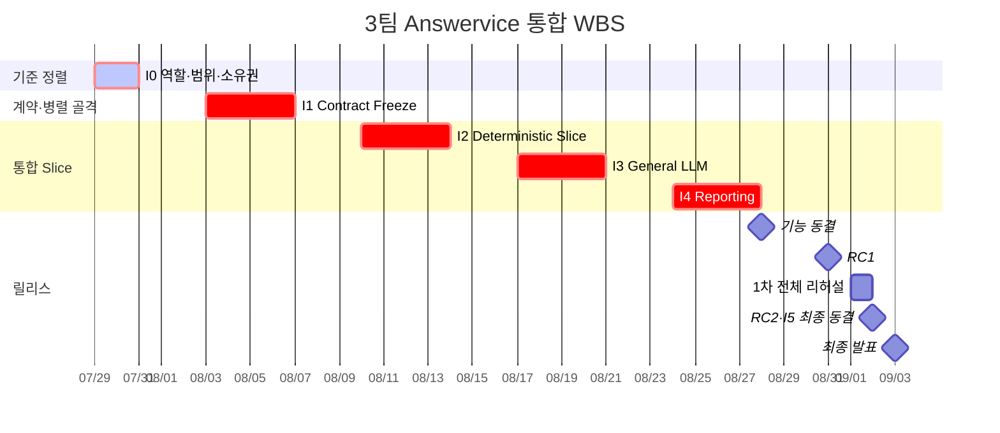

# Answervice — DataHub 대화형 분석·자동 리포팅 WBS

| 항목 | 내용 |
|---|---|
| 문서 설명 | Answervice의 실행 작업, 담당, 상태, 일정, 산출물, Gate와 병합 순서를 관리하는 공식 WBS 작업본 |
| 문서 분류 | 산출물 작업본 |
| 버전 | v5.7 |
| 문서 기준일 | 2026-07-30 09:54 |
| 작성·수정 | 박준희 / 송민지 |
| 산출물 번호 | 02 |
| 제출 일자 | 2026-07-16 |
| 대응 템플릿 | `templates/[기획] WBS_양식 (1)_27기_0팀.xlsx`, `templates/[기획] WBS_양식(2)_27기_0팀.xlsx` |

> 전체 프로젝트 기간 2026-07-10~09-03 · 역할 개편 적용일 2026-07-29 · 5인 · 실행 일정 99개 태스크 · 공식 산출물 21건 + 옵션 1건
>
> 기준 기획서는 `docs/Answervice_기획서.md`, 화면 기준은 `docs/markdown/05_화면설계서.md`, AI 실행 절차는 `docs/markdown/ai_docs/5인_병렬구현_*_매뉴얼_최종안.md`, Gate별 발행 값은 `docs/markdown/collaboration/Gate_실행_카드_원장.md`다.

## 대응 양식 구조

목록형과 갠트형 원본 양식을 함께 사용한다. Markdown에서는 대공정을 절 제목으로 두고, 실행 행에 목록형 필수 필드와 갠트형 입력 필드를 함께 유지한다.

| 양식 필드 | Markdown 대응 위치 | 적용 원칙 |
|---|---|---|
| 프로젝트 이름·관리자·기준 날짜 | 제목·상단 메타데이터 | 기술 PM은 박준희, 일정 기준은 KST |
| `Task ID`·`WBS 번호` | 실행 WBS의 `ID` | 숫자 ID는 공식 WBS, 괄호 안 `R*-**`는 역할 매뉴얼 카드 |
| 주요 업무·작업 제목 | 실행 WBS의 단계 제목 | 역할의 최종 책임 단위로 분리 |
| 세부 업무 | 실행 WBS의 `작업 항목` | 검증 가능한 결과와 카드 ID를 함께 기록 |
| 담당자·작업 소유자 | 실행 WBS의 `담당` | 첫 번째 담당자가 결과 책임자 |
| 상태 | 실행 WBS의 `현황` | `대기`, `진행`, `검토`, `차단`, `완료`, `취소`만 사용 |
| 시작일·마감일 | 실행 WBS의 `시작`·`마감` | 시작일은 마감일보다 늦을 수 없음 |
| 우선순위 | 실행 WBS의 `우선순위` | `높음`, `중간`, `조건부`로 구분 |
| 기간·완료 비율 | XLSX 변환 시 계산 | 근거 없는 백분율을 추정하지 않음 |
| Gantt timeline | 8주 일정·Mermaid | 일정 변경 시 실행 WBS와 함께 갱신 |

## 역할·책임·충돌 방지 기준

| 역할 | 담당자 | branch | 최종 책임 | 공용 경계 |
|---|---|---|---|---|
| R1 기술 PM·통합 플랫폼·품질·릴리스 | 박준희 | `junhee` | 계약·결정, root Compose·env·CI, 통합·보안·복구·release | 다른 역할의 서비스 내부를 대신 수정하지 않음 |
| R2 데이터 플랫폼·메타데이터·연합조회 | 정승 | `seung` | 5 source·4 engine, 합성 DDL·seed, DataHub, Trino, adapter·gold fixture | 공통 FastAPI·AI·frontend를 수정하지 않음 |
| R3 AI·모델·프롬프트·ModelOps | 윤대성 | `daesung` | Node 1·2·2′·3, prompt, 평가, serving, 조건부 LoRA | 권한·Gate·SQL 실행·결과 정답을 판정하지 않음 |
| R4 백엔드 Control Plane | 김재홍 | `jaehong` | FastAPI, Controller, Context, G1·G2·G3, cache·artifact·audit, worker | 공통 OpenAPI·Alembic chain의 단일 작성자 |
| R5 프론트엔드·자동 리포팅 | 송민지 | `minji` | 활성 frontend, Chat·Evidence·Report·Catalog·Audit UI | Report proposal은 R4가 공통 backend에 등록 |

운영 규칙:

1. 한 AI에는 한 번에 현재 통합 Wave의 역할별 실행 묶음 하나를 준다.
2. 담당자는 실행 묶음의 `TASK_CARD_RANGE`를 번호 순서대로 수행하며 카드 사이에 별도 승인을 기다리지 않는다.
3. 실행 묶음의 `ALLOWED_PATHS`만 수정하고 다른 역할 소유 파일은 change request로 넘긴다.
4. `CHECKPOINT_GATES`에서는 계약·증거만 확인하고, 목표 통합 Gate 또는 중단 조건에 도달할 때까지 역할 branch에서 계속 진행한다. 현재 일정의 단독 checkpoint는 I0다.
5. 목표 통합 Gate 도달·카드 범위 완료·허용 경로 밖 변경·계약 충돌·필수 검증 실패 시 멈추고 통합 판정을 기다린다.
6. 실제 연동 전에는 versioned fixture와 fake adapter로 병렬 개발한다.
7. 달력상 checkpoint나 부분 구현만으로 병합하지 않고 소비 가능한 산출물·검증·handoff가 준비된 역할 결과만 통합한다.
8. `fixture 통과`, `MERGED_DEV`, `VERIFIED_GATE`를 별도 상태로 관리한다.
9. R1은 통합 실패를 원 소유 역할에 반환하고 기능 내부를 대신 고치지 않는다.
10. `app/react`와 `app/enterprise-react` 중 활성 frontend 하나를 I0에서 결정하기 전에는 양쪽 구현을 병행하지 않는다.
11. Django와 자유 ReAct loop는 범위에서 제외하고 FastAPI의 고정 상태 전이를 기준으로 한다.

## Gate·병합 일정

| Gate | 기간 | 통과 기준 | 운영·`dev` 병합 기준 |
|---|---|---|---|
| I0 기준 정렬 | 07/29~07/31 | 역할·branch·P0/P1/P2·backend·frontend·파일 소유권 확정 | checkpoint: R1 기준 결정만 공유하고 역할 구현은 branch에서 계속 |
| I1 Contract Freeze | 08/03~08/07 | metric·time·schema·API·model·Report·health 계약과 fake 소비 가능 | Wave 1: 공통 계약·schema·fake·skeleton만 최소 병합 |
| I2 Deterministic Slice | 08/10~08/14 | PMS+CRM 대표 질문의 Context→G1→G2→Trino→G3→Artifact→화면 trace | Wave 2: `seung` → `daesung` → `jaehong` → `minji` → `junhee` |
| I3 General LLM | 08/17~08/21 | 5 catalog 단독·승인 JOIN·Node 통합·보안 기준선 | Wave 3: `seung` → `daesung` → `jaehong` → `minji` → `junhee` |
| I4 Reporting | 08/24~08/28 | Chat→Artifact→Report→manual/schedule→history, partial·retry 검증 | Wave 4 시작: `minji` proposal → `jaehong` 등록 후 역할별 완료분 통합 |
| RC1 | 08/31 | 필수 30건과 역할별 release 후보 판정 | Critical·High 결함만 소유 branch에서 수정 |
| 리허설 1 | 09/01 | 빈 환경 기동·재적재·성공·차단·partial·재시작 시연 | 승인된 순서로 전 역할 확인 |
| RC2·I5 | 09/02 | release SHA·runbook·code·data·model·prompt·policy 동결 | 승인 후 `dev`→`main`은 별도 승인 |
| 최종 발표 | 09/03 | 승인 SHA와 고정 fixture로 시연·질의응답 | 발표 중 code·설정 변경 금지 |

병합 직후 생산자 test와 소비자 contract test를 실행한다. 실행하지 않은 검증은 `Not Run`, 외부 환경 부족은 `Blocked`로 기록하며 병합만으로 Gate 통과라고 표시하지 않는다.

## 🗓️ 8주 핵심 개발 일정

| 주차 | 기간 | 목표 | 마감·Gate |
|---|---|---|---|
| 1주 | 07/10~07/16 | 요구사항·WBS 수립 | 요구사항 정의서·WBS |
| 2주 | 07/20~07/24 | 기획·데이터·화면 작업본 | 프로젝트 기획서·수집 데이터 보고서·화면설계서 |
| 3주 | 07/27~07/31 | 새 5인 역할·소유권 정렬, 데이터 계약 착수 | I0·DB/저장소 설계·전처리 결과 |
| 4주 | 08/03~08/07 | 계약·fixture·골격 동결, 중간 발표 | I1·중간 발표·ML/DL·공식 DB 관련 산출물 |
| 5주 | 08/10~08/14 | 대표 2-source 결정론적 전체 왕복 | I2·AI 아키텍처·LLM·sLLM 산출물 |
| 6주 | 08/17~08/21 | 5 source·일반 질문·보안 기준선 | I3·멀티 에이전트 비교 보고·시스템 구성도 |
| 7주 | 08/24~08/28 | 자동 리포팅·장애·복구·회귀 | I4·기능 동결·웹앱·서비스 테스트 |
| 8주 | 08/31~09/03 | RC1·리허설·I5·최종 발표 | 최종 PT·소스코드·시연영상 |

## 📈 Mermaid 일정 가시화

```mermaid
gantt
    title 3팀 Answervice 통합 WBS
    dateFormat  YYYY-MM-DD
    axisFormat  %m/%d

    section 기준 정렬
    I0 역할·범위·소유권             :crit, active, i0, 2026-07-29, 2026-07-31

    section 계약·병렬 골격
    I1 Contract Freeze              :crit, i1, 2026-08-03, 2026-08-07

    section 통합 Slice
    I2 Deterministic Slice           :crit, i2, 2026-08-10, 2026-08-14
    I3 General LLM                   :crit, i3, 2026-08-17, 2026-08-21
    I4 Reporting                     :crit, i4, 2026-08-24, 2026-08-28

    section 릴리스
    기능 동결                        :milestone, freeze_feature, 2026-08-28, 0d
    RC1                              :milestone, rc1, 2026-08-31, 0d
    1차 전체 리허설                  :rehearsal, 2026-09-01, 1d
    RC2·I5 최종 동결                 :milestone, rc2, 2026-09-02, 0d
    최종 발표                        :milestone, final, 2026-09-03, 0d
```

## 📊 단계별 요약

| 단계 | 태스크 | 기간 |
|---|:--:|---|
| 기준 정렬·통합 기반 | 8 | 07/29~08/07 |
| 데이터 플랫폼·메타데이터·연합조회 | 20 | 07/29~08/28 |
| AI·모델·프롬프트·ModelOps | 16 | 07/29~09/02 |
| 백엔드 Control Plane | 22 | 07/29~09/02 |
| 프론트엔드·자동 리포팅 | 20 | 07/29~09/03 |
| 통합 Gate·품질·릴리스 | 6 | 08/03~09/03 |
| 발표·공식 산출물 | 7 | 08/03~09/03 |

### 일정·부하 검증 결과

- R1은 공통 계약·통합·품질·릴리스의 결과 책임자지만 R2~R5 서비스 내부 구현을 대신하지 않는다.
- R2~R5는 I1 이전에도 fake·fixture를 사용할 수 있으나 실제 연동 완료로 표시하지 않는다.
- I2의 대표 질문은 PMS PostgreSQL과 CRM SQL Server를 사용하는 2-source 경로로 고정하고, 이후 5 catalog 단독과 승인된 2~3-source JOIN으로 확장한다.
- R4는 Report 공통 등록과 worker를, R5는 독립 Report domain·router·migration proposal과 UI를 담당해 Alembic·entrypoint 충돌을 피한다.
- R3의 Base model 비교는 필수이고 LoRA/QLoRA 제품 채택은 조건부다. 기획서의 고정 LoRA 표현과 채택 Gate 표현이 충돌하면 R1이 I1 결정 원장에 채택 여부를 기록하기 전까지 Base를 기본값으로 유지한다.
- 08/28 이후 P0 신규 기능을 추가하지 않고, 09/02 승인 후 code·dependency·model·seed·설정을 변경하지 않는다.

## 실행 WBS

공식 WBS의 숫자 ID와 역할 매뉴얼의 `R*-**` 카드를 작업 항목에 함께 적는다. 담당자가 여러 명이면 첫 번째 담당자가 결과 책임자다.

## 🗂️ 전체 태스크 (99개)

### 기준 정렬·통합 기반

| ID | 작업 항목 | 산출물 | 담당 | 현황 | 시작 | 마감 | 우선순위 |
|---|---|---|:--:|:--:|:--:|:--:|:--:|
| 1.1 | R1-00 저장소·기획서·AGENTS·WBS·역할 기준 정렬 | 결정·충돌 원장 | 박준희 | 진행 | 07/29 | 07/31 | 높음 |
| 1.2 | R1-01 P0/P1/P2·비목표·공식 산출물 대응 고정 | 범위표·제외 목록 | 박준희 | 진행 | 07/29 | 07/31 | 높음 |
| 1.3 | R1-02 파일 소유권·서비스 경계 Freeze | ownership matrix | 박준희 | 진행 | 07/29 | 07/31 | 높음 |
| 1.4 | R1-03 metric·time·schema·API·state·error 공통 계약 | contract version | 박준희 | 대기 | 08/03 | 08/07 | 높음 |
| 1.5 | R1-04 dev·full·split-host Compose skeleton | 통합 profile | 박준희 | 대기 | 08/03 | 08/07 | 높음 |
| 1.6 | R1-05 환경변수·Secret 계약 | `.env.example`·secret matrix | 박준희 | 대기 | 08/03 | 08/07 | 높음 |
| 1.7 | R1-06 역할별 CI·품질 Gate | CI jobs·fail policy | 박준희 | 대기 | 08/03 | 08/07 | 높음 |
| 1.8 | R1-08 I1 Contract Freeze 판정 | I1 판정서·fixture 소비 증거 | 박준희 | 대기 | 08/06 | 08/07 | 높음 |

### 데이터 플랫폼·메타데이터·연합조회

| ID | 작업 항목 | 산출물 | 담당 | 현황 | 시작 | 마감 | 우선순위 |
|---|---|---|:--:|:--:|:--:|:--:|:--:|
| 2.1 | R2-00 공통 데이터 계약 확인 | source·engine·owner 표 | 정승 | 대기 | 07/29 | 07/31 | 높음 |
| 2.2 | R2-01 5 source·4 engine registry | source registry | 정승 | 대기 | 07/29 | 07/31 | 높음 |
| 2.3 | R2-02 논리 모델·grain 정의 | entity 관계·grain | 정승 | 대기 | 07/29 | 07/31 | 높음 |
| 2.4 | R2-03 물리 schema·DDL·제약·index | versioned DDL | 정승 | 진행 | 08/03 | 08/07 | 높음 |
| 2.5 | R2-04 deterministic synthetic seed·scenario | seed·scenario manifest | 정승 | 진행 | 08/03 | 08/07 | 높음 |
| 2.6 | R2-05 customer identity bridge | `customer_identity_map` | 정승 | 진행 | 08/03 | 08/07 | 높음 |
| 2.7 | R2-06 event-time 회원 등급 이력 | `member_grade_history` | 정승 | 진행 | 08/03 | 08/07 | 높음 |
| 2.8 | R2-07 데이터 품질·전처리·reject 관리 | DQR·PREP 결과 | 정승 | 대기 | 08/03 | 08/07 | 높음 |
| 2.9 | R2-08 source·application read-only 계정 요구 | account matrix | 정승 | 진행 | 08/03 | 08/07 | 높음 |
| 2.10 | R2-09 DataHub ingestion recipe 5개 | versioned recipes | 정승 | 진행 | 08/10 | 08/21 | 높음 |
| 2.11 | R2-10 Metadata·owner·domain·tag·lineage 보강 | URN·lineage manifest | 정승 | 대기 | 08/10 | 08/21 | 높음 |
| 2.12 | R2-11 DataHub typed adapter | search·graph·health adapter | 정승 | 대기 | 08/10 | 08/21 | 높음 |
| 2.13 | R2-12 Trino catalog 5개 | connector·catalog 설정 | 정승 | 진행 | 08/10 | 08/21 | 높음 |
| 2.14 | R2-13 source↔Trino type mapping | type mapping matrix | 정승 | 대기 | 08/10 | 08/21 | 높음 |
| 2.15 | R2-14 승인 JOIN Registry | JOIN ID·cardinality·time 계약 | 정승 | 대기 | 08/10 | 08/21 | 높음 |
| 2.16 | R2-15 대표 2·3-source 정답 조회 | 정답 SQL·result hash | 정승 | 대기 | 08/10 | 08/21 | 높음 |
| 2.17 | R2-16 Trino/source 실행 adapter | query·status·cancel·health | 정승 | 대기 | 08/10 | 08/21 | 높음 |
| 2.18 | R2-17 source watermark·cache 무효화 입력 | watermark set | 정승 | 대기 | 08/17 | 08/28 | 높음 |
| 2.19 | R2-18 필수 30건·gold용 데이터 fixture | 평가 fixture | 정승 | 대기 | 08/17 | 08/28 | 높음 |
| 2.20 | R2-19 5번째 source 온보딩·재현 | runbook·URN→FQN trace | 정승 | 대기 | 08/24 | 08/28 | 높음 |

### AI·모델·프롬프트·ModelOps

| ID | 작업 항목 | 산출물 | 담당 | 현황 | 시작 | 마감 | 우선순위 |
|---|---|---|:--:|:--:|:--:|:--:|:--:|
| 3.1 | R3-00 AI P0/P2·공식 모델 산출물 대응 범위 확인 | model decision 초안 | 윤대성 | 대기 | 07/29 | 07/31 | 높음 |
| 3.2 | R3-01 Node 1·2·2′·3 I/O schema | versioned JSON schema | 윤대성 | 대기 | 08/03 | 08/07 | 높음 |
| 3.3 | R3-02 deterministic fake model adapter | fake adapter | 윤대성 | 대기 | 08/03 | 08/10 | 높음 |
| 3.4 | R3-03 Node 1 질문 정규화 | intent·metric·time 후보 | 윤대성 | 대기 | 08/03 | 08/21 | 높음 |
| 3.5 | R3-04 Node 2 Context 제한 SQL 생성 | Trino SQL·참조 목록 | 윤대성 | 대기 | 08/17 | 08/21 | 높음 |
| 3.6 | R3-05 Node 2′ 정규화 오류 1회 수정 | corrected SQL | 윤대성 | 대기 | 08/17 | 08/21 | 높음 |
| 3.7 | R3-06 G3 통과 결과의 Node 3 설명 | 근거·조건·주의 설명 | 윤대성 | 대기 | 08/10 | 08/21 | 높음 |
| 3.8 | R3-07 Prompt Registry | prompt ID·version·hash | 윤대성 | 대기 | 08/03 | 08/07 | 높음 |
| 3.9 | R3-08 필수 30건 평가 runner | schema·linking·SQL·result 평가 | 윤대성 | 대기 | 08/10 | 08/31 | 높음 |
| 3.10 | R3-09 Base model·Analytics Agent 기준선 비교 | 정확도·p50·p95·자원 비교표 | 윤대성 | 대기 | 08/17 | 08/21 | 높음 |
| 3.11 | R3-10 train·val·gold manifest 검수 | 학습 데이터 검수 기록 | 윤대성 | 대기 | 08/17 | 08/21 | 높음 |
| 3.12 | R3-11 time-boxed LoRA/QLoRA 비교와 채택 Gate | adapter·rollback 증거 | 윤대성 | 대기 | 08/24 | 08/28 | 조건부 |
| 3.13 | R3-12 vLLM·RunPod serving | endpoint·health·manifest | 윤대성 | 대기 | 08/17 | 08/28 | 높음 |
| 3.14 | R3-13 production model client | retry·fallback·circuit 계약 | 윤대성 | 대기 | 08/17 | 08/28 | 높음 |
| 3.15 | R3-14 model trace·비용·재현성 | version·token·cost trace | 윤대성 | 대기 | 08/17 | 08/28 | 중간 |
| 3.16 | R3-15 model·prompt·adapter release 후보 고정 | model release manifest | 윤대성 | 대기 | 08/24 | 09/02 | 높음 |

### 백엔드 Control Plane

| ID | 작업 항목 | 산출물 | 담당 | 현황 | 시작 | 마감 | 우선순위 |
|---|---|---|:--:|:--:|:--:|:--:|:--:|
| 4.1 | R4-00 backend 경계·의존 방향 | architecture decision | 김재홍 | 진행 | 07/29 | 07/31 | 높음 |
| 4.2 | R4-01 공통 객체·OpenAPI·오류 계약 | versioned API contract | 김재홍 | 진행 | 07/29 | 08/07 | 높음 |
| 4.3 | R4-02 인증·request context middleware | role·as_of·trace context | 김재홍 | 진행 | 08/03 | 08/07 | 높음 |
| 4.4 | R4-03 application DB model·Alembic | migration head | 김재홍 | 진행 | 08/03 | 08/07 | 높음 |
| 4.5 | R4-04 Router·Template Binding | route decision | 김재홍 | 진행 | 08/03 | 08/10 | 높음 |
| 4.6 | R4-05 Controller 고정 상태 머신 | transition table | 김재홍 | 진행 | 08/03 | 08/10 | 높음 |
| 4.7 | R4-06 Context Registry·Builder | versioned Context Package | 김재홍 | 대기 | 08/10 | 08/14 | 높음 |
| 4.8 | R4-07 G1 Context Gate | decision·evidence | 김재홍 | 대기 | 08/10 | 08/14 | 높음 |
| 4.9 | R4-08 R3 Node typed client | model client·오류 처리 | 김재홍 | 대기 | 08/10 | 08/21 | 높음 |
| 4.10 | R4-09 G2 SQL Policy Gate | AST·policy decision | 김재홍 | 대기 | 08/10 | 08/14 | 높음 |
| 4.11 | R4-10 Node 2′·G2′ 수정 1회 통제 | repair counter | 김재홍 | 대기 | 08/10 | 08/14 | 높음 |
| 4.12 | R4-11 R2 Trino 실행 lifecycle 통제 | pass token·timeout·cancel | 김재홍 | 대기 | 08/10 | 08/14 | 높음 |
| 4.13 | R4-12 Result Shaper·G3 | shaped result·evidence | 김재홍 | 대기 | 08/10 | 08/14 | 높음 |
| 4.14 | R4-13 Node 3·immutable Artifact | artifact contract | 김재홍 | 대기 | 08/10 | 08/14 | 높음 |
| 4.15 | R4-14 SQL Plan·Result Cache | versioned cache key | 김재홍 | 대기 | 08/17 | 08/21 | 중간 |
| 4.16 | R4-15 Audit·Trace·관측 | linked request trace | 김재홍 | 대기 | 08/10 | 08/21 | 높음 |
| 4.17 | R4-16 R5 Report module 공통 등록 | analysis run contract | 김재홍 | 대기 | 08/24 | 08/28 | 높음 |
| 4.18 | R4-17 worker·schedule runtime | queue·idempotency·dead-letter | 김재홍 | 대기 | 08/24 | 08/28 | 높음 |
| 4.19 | R4-18 권한·mask·redaction enforcement | 보안 검증 증거 | 김재홍 | 대기 | 08/17 | 08/28 | 높음 |
| 4.20 | R4-19 retention·backup·restore hook | 보존 job·복구 절차 | 김재홍 | 대기 | 08/24 | 09/02 | 높음 |
| 4.21 | R4-20 health·backend Dockerfile·회귀 | service fragment | 김재홍 | 대기 | 08/24 | 09/02 | 높음 |
| 4.22 | R4-21 API·migration·policy release 동결 | backend release manifest | 김재홍 | 대기 | 08/31 | 09/02 | 높음 |

### 프론트엔드·자동 리포팅

| ID | 작업 항목 | 산출물 | 담당 | 현황 | 시작 | 마감 | 우선순위 |
|---|---|---|:--:|:--:|:--:|:--:|:--:|
| 5.1 | R5-00 frontend 후보·fixture 조사와 활성 app 결정안 | reuse·remove 결정표 | 송민지 | 대기 | 07/29 | 07/31 | 높음 |
| 5.2 | R5-01 IA·routing·design token | route·layout | 송민지 | 대기 | 07/29 | 07/31 | 높음 |
| 5.3 | R5-02 OpenAPI type·client·mock | typed client·fixture | 송민지 | 대기 | 08/03 | 08/07 | 높음 |
| 5.4 | R5-03 Chat shell·질문 흐름 | conversation UI | 송민지 | 대기 | 08/03 | 08/14 | 높음 |
| 5.5 | R5-04 실행 상태·오류 UI | state components | 송민지 | 대기 | 08/03 | 08/21 | 높음 |
| 5.6 | R5-05 Evidence·출처·조건 panel | URN·metric·filter·as_of UI | 송민지 | 대기 | 08/10 | 08/14 | 높음 |
| 5.7 | R5-06 결과 표·차트 | result components | 송민지 | 대기 | 08/10 | 08/14 | 높음 |
| 5.8 | R5-07 Chat→Report Artifact bridge | artifact action | 송민지 | 대기 | 08/10 | 08/14 | 높음 |
| 5.9 | R5-08 Report definition·version·run·block domain | Report contract | 송민지 | 대기 | 08/03 | 08/24 | 높음 |
| 5.10 | R5-09 독립 Report router·API module | router·contract test | 송민지 | 대기 | 08/17 | 08/24 | 높음 |
| 5.11 | R5-10 Report migration proposal | 단일 migration proposal | 송민지 | 대기 | 08/17 | 08/24 | 높음 |
| 5.12 | R5-11 12-column Report editor | add·move·resize·draft | 송민지 | 대기 | 08/24 | 08/28 | 높음 |
| 5.13 | R5-12 수동 실행·Run History | run·status·history UI | 송민지 | 대기 | 08/24 | 08/28 | 높음 |
| 5.14 | R5-13 daily·weekly·monthly schedule UI | schedule contract | 송민지 | 대기 | 08/24 | 08/28 | 높음 |
| 5.15 | R5-14 Catalog·Connection UI | source·asset·ingestion UI | 송민지 | 대기 | 08/17 | 08/28 | 중간 |
| 5.16 | R5-15 Operations·Audit trace UI | request trace UI | 송민지 | 대기 | 08/24 | 08/28 | 높음 |
| 5.17 | R5-16 접근성·반응형·보안 상태 표시 | QA evidence | 송민지 | 대기 | 08/24 | 08/31 | 높음 |
| 5.18 | R5-17 실제 API integration | production client | 송민지 | 대기 | 08/24 | 08/31 | 높음 |
| 5.19 | R5-18 frontend Dockerfile·build·E2E | service fragment | 송민지 | 대기 | 08/24 | 09/02 | 높음 |
| 5.20 | R5-19 발표 route·fallback fixture | demo runbook | 송민지 | 대기 | 08/31 | 09/03 | 높음 |

### 통합 Gate·품질·릴리스

| ID | 작업 항목 | 산출물 | 담당 | 현황 | 시작 | 마감 | 우선순위 |
|---|---|---|:--:|:--:|:--:|:--:|:--:|
| 6.1 | R1-07 필수 30건·gold 120건 평가 원장 관리 | reviewer·split·expected 원장 | 박준희·정승·윤대성 | 대기 | 08/03 | 08/31 | 높음 |
| 6.2 | R1-09 I2 Deterministic Slice 통합·판정 | 대표 질문 trace·result hash | 박준희·정승·윤대성·김재홍·송민지 | 대기 | 08/10 | 08/14 | 높음 |
| 6.3 | R1-10 I3 General LLM·보안 기준선 통합 | 일반 질문·model 비교·보안 결과 | 박준희·정승·윤대성·김재홍·송민지 | 대기 | 08/17 | 08/21 | 높음 |
| 6.4 | R1-11 I4 Reporting·worker·partial 통합 | Report 왕복 trace | 박준희·김재홍·송민지 | 대기 | 08/24 | 08/28 | 높음 |
| 6.5 | R1-12 read-only·mask·장애·복구·성능 검증 | 수용 시험 증거 | 박준희·정승·윤대성·김재홍·송민지 | 대기 | 08/24 | 09/02 | 높음 |
| 6.6 | R1-13 RC1·RC2·I5·최종 Release | release manifest·runbook·승인 SHA | 박준희·정승·윤대성·김재홍·송민지 | 대기 | 08/31 | 09/03 | 높음 |

### 발표·공식 산출물

| ID | 작업 항목 | 산출물 | 담당 | 현황 | 시작 | 마감 | 우선순위 |
|---|---|---|:--:|:--:|:--:|:--:|:--:|
| 7.1 | 중간 발표 자료·역할별 진행 근거·리허설 | 중간 발표 PT | 박준희·정승·윤대성·김재홍·송민지 | 대기 | 08/03 | 08/06 | 높음 |
| 7.2 | 최종 발표 story·PT·시간 배분 | 최종 발표 PT | 박준희·정승·윤대성·김재홍·송민지 | 대기 | 08/24 | 09/02 | 높음 |
| 7.3 | 데이터·AI·Control Plane·UI 역할별 근거와 Q&A | 발표 근거 묶음 | 박준희·정승·윤대성·김재홍·송민지 | 대기 | 08/31 | 09/02 | 높음 |
| 7.4 | 승인 SHA 소스·README·version manifest 패키징 | 프로젝트 소스코드 | 박준희·정승·윤대성·김재홍·송민지 | 대기 | 08/31 | 09/03 | 높음 |
| 7.5 | 성공·차단·partial·Report 시연 녹화 | 시연영상 | 송민지·박준희 | 대기 | 08/31 | 09/03 | 높음 |
| 7.6 | 1차·2차 전체 리허설과 결함 회귀 | 리허설 기록 | 박준희·정승·윤대성·김재홍·송민지 | 대기 | 09/01 | 09/02 | 높음 |
| 7.7 | 승인 환경 최종 발표·질의응답 | 발표 결과 | 박준희·정승·윤대성·김재홍·송민지 | 대기 | 09/03 | 09/03 | 높음 |

## 📦 산출물 제출 일정 (공식 21 + 옵션 1)

공식 산출물 번호·마감은 일정 참고 문서를 유지하고, 새 역할의 결과 책임자와 관련 WBS를 연결한다. 제출 여부는 저장소 증거를 확인하기 전까지 추정하지 않는다.

| 단계 | 산출물 | 제출일 | 내부검토 | WBS | 담당 | 현황 |
|---|---|:--:|:--:|:--:|:--:|:--:|
| 기획 | 요구사항 정의서 | **07/16** | 07/15 | 1.1 | 박준희 | 검토 |
| 기획 | WBS | **07/16** | 07/15 | 1.1 | 박준희 | 진행 |
| 기획 | 프로젝트 기획서 | **07/24** | 07/23 | 1.2 | 박준희 | 검토 |
| 데이터 수집 및 저장 | 수집 데이터 보고서 | **07/24** | 07/23 | 2.5 | 정승 | 대기 |
| 모델 배포 | 화면설계서 | **07/24** | 07/23 | 5.2 | 송민지 | 검토 |
| 데이터 수집 및 저장 | 데이터베이스/저장소 설계 문서 | **07/31** | 07/30 | 2.4 | 정승 | 진행 |
| 데이터 전처리 | 데이터 전처리 결과서 | **07/31** | 07/30 | 2.8 | 정승 | 대기 |
| 발표 및 시연 | 중간 발표 PT 자료 | **08/06** | 08/05 | 7.1 | 박준희·전원 | 대기 |
| 데이터 전처리 | 머신러닝/딥러닝 학습결과서 | **08/07** | 08/05 | 3.10 | 윤대성 | 대기 |
| 데이터 전처리 | 학습한 ML/DL 모델 | **08/07** | 08/05 | 3.16 | 윤대성 | 대기 |
| 모델링 및 평가 | 벡터DB/GraphDB 구축 결과서 | **08/07** | 08/05 | 3.1 | 윤대성·박준희 | 차단 |
| 모델링 및 평가 | AI 시스템 아키텍처 | **08/14** | 08/13 | 4.6 | 박준희·김재홍 | 대기 |
| 모델링 및 평가 | LLM 활용 소프트웨어 | **08/14** | 08/13 | 4.14 | 김재홍·윤대성 | 대기 |
| 모델링 및 평가 | 자체 sLLM 인공지능 | **08/14** | 08/13 | 3.16 | 윤대성 | 대기 |
| 모델링 및 평가 | 멀티 에이전트 테스트 계획 및 결과 보고서 | **08/21** | 08/20 | 3.10 | 윤대성·박준희 | 대기 |
| 모델 배포 | 시스템 구성도 | **08/21** | 08/20 | 1.5 | 박준희·김재홍 | 대기 |
| 모델 배포 | 개발된 LLM 연동 웹 애플리케이션 | **08/28** | 08/27 | 5.19 | 송민지·김재홍 | 대기 |
| 모델 배포 | 서비스 테스트 계획 및 결과 보고서 | **08/28** | 08/27 | 6.5 | 박준희·전원 | 대기 |
| 발표 및 시연 | 최종 발표 PT 자료 | **09/03** | 09/02 | 7.2 | 박준희·전원 | 대기 |
| 발표 및 시연 | 프로젝트 개발 소스코드 | **09/03** | 09/02 | 7.4 | 박준희·전원 | 대기 |
| 발표 및 시연 | 시연영상 | **09/03** | 09/02 | 7.5 | 송민지·박준희 | 대기 |
| 모델링 및 평가 | AI 윤리/편향성 점검 결과서(옵션) | **옵션** | 08/26 | 3.11 | 윤대성·박준희 | 대기 |

`벡터DB/GraphDB 구축 결과서`는 공식 산출물 목록에는 있으나 현재 기획서의 P0/P1 구현 범위에는 VectorDB·GraphDB가 없다. R1·R3가 08/05까지 “미도입 근거와 비교 실험 보고로 제출 가능한지”를 확인하기 전까지 `차단`으로 유지하며, 확인 없이 P0에 신규 인프라를 추가하지 않는다.

## 기획서 추적성

| 기획서 영역 | 주 책임 | WBS | 처리 기준 |
|---|---|---|---|
| §1~5 목표·범위·사용자·기능 | R1 박준희 | 1.1~1.4 | I0에서 P0/P1/P2와 비목표 고정 |
| §7 전체 아키텍처·추적 ID | R4 김재홍·R1 박준희 | 4.1~4.6, 4.16 | 고정 상태 전이·trace 계약 |
| §8 DataHub·Trino | R2 정승 | 2.1~2.20 | 5 catalog 단독·승인 2~3-source JOIN |
| §9 Context·Guarded Text-to-SQL | R4 김재홍 | 4.7~4.14 | G1·G2·G3 우회 0건 |
| §10 sLLM·RunPod | R3 윤대성 | 3.2~3.16 | Base 필수, LoRA 채택 조건부 |
| §11 자동 리포팅 | R5 송민지·R4 김재홍 | 5.8~5.14, 4.17~4.18 | definition/run 분리·partial·idempotency |
| §12 MCP·문서 RAG | R1 박준희 | 1.2 | P2 후속, 별도 편입 전 미구현 |
| §13 ML-as-a-Tool | R1 박준희 | 1.2 | P2 후속, 별도 편입 전 미구현 |
| §14 합성 데이터 | R2 정승 | 2.4~2.9, 2.19 | deterministic seed·참조·기간 무결성 |
| §15 화면·메뉴 | R5 송민지 | 5.1~5.20 | P0/P1·접근성·오류 상태 |
| §16 애플리케이션 구조 | R1·R4·R5 | 1.3~1.8, 4.1~4.6, 5.1~5.3 | I0/I1에서 단일 entrypoint·frontend 결정 |
| §17 보안·권한·감사·복구 | R1·R2·R4·R5 | 2.9, 4.3, 4.16, 4.19~4.21, 6.5 | read-only·mask·redaction·restore |
| §18 평가 | R1·R2·R3 | 2.19, 3.9~3.15, 6.1~6.5 | 필수 30건·gold 120건·재현 |
| §19 MVP·후속 범위 | R1 박준희 | 1.2 | P2·고객 360 범위 통제 |
| §20 개발·산출물 | 전 역할 | 1.1~7.7 | 07/29~09/03 압축 일정 적용 |
| §21 리스크 | R1 박준희 | 1.5~1.8, 6.5~6.6 | blocker·rollback·잔여 위험 기록 |
| §22 결정·가정 | R1 박준희 | 1.1~1.4 | I0/I1 결정 원장에 version 기록 |

## 추가 결정 필요

| 항목 | 현재 운용 기준 | 결정 시점 | 결정 책임 |
|---|---|---|---|
| 활성 frontend | `app/react`와 `app/enterprise-react` 중 하나만 선택 | I0 | R1·R5 |
| full·dev·split-host | dev로 병렬 개발, full 실패 시 split-host 전환 | I0/I1 | R1 |
| DataHub·Trino·connector 고정 version | 실행 전 고정하고 manifest 기록 | I1 | R1·R2 |
| Result Cache 구현 | versioned key 계약 우선, PostgreSQL·Redis는 profile 측정 후 선택 | I1/I3 | R1·R4 |
| model checkpoint·RunPod profile | Base 기준선 우선, 비용·자원 승인 후 외부 실행 | I1/I3 | R1·R3 |
| SQL LoRA 제품 채택 | time-boxed 비교 Gate 전에는 Base 유지 | I4 이전 | R1·R3 |
| 공식 VectorDB/GraphDB 산출물 | 미도입 근거 제출 가능 여부 확인 전 `차단` | 08/05 | R1·R3 |

## WBS 작업 로그

최신 기록을 위에 추가한다. 작업 로그는 문서 변경 자체를 구현 완료 근거로 사용하지 않는다.

| 일시(KST) | WBS ID | 변경 요약 | 결과 구분 |
|---|---|---|---|
| 2026-07-30 09:54 | 1.1~1.2 | 첨부 요구사항 템플릿의 1시트·7열·병합 헤더·그룹 형식을 유지해 요구사항 75개를 `docs/deliverables/01_요구사항정의서_29기_3팀.xlsx` v1.0으로 변환하고 전체 시트 렌더링·ID·값을 검증 | 공식 요구사항 산출물 |
| 2026-07-30 09:49 | 5.2 | 기획 v1.0·요구사항 v1.0·활성 React 목업을 대조해 13개 공식 화면 ID와 IA·route·진입 조건·요구사항 추적·범위 제외 Gate·UI QA를 `05_화면설계서.md` v6.0으로 확정 | 화면설계 산출물 |
| 2026-07-30 09:42 | 1.1~1.2 | 최종 기획 v1.0의 P0/P1/P2 경계와 기능·데이터·AI·보고서·UI·보안·운영·비기능 요구사항 75개를 `01_요구사항정의서.md` v1.0으로 구조화하고 R1 계약 검토 대상으로 등록 | 요구사항 계약 초안 |
| 2026-07-29 17:24 | 1.1 | 역할별 자율 진행량과 병합 충돌을 균형화해 I1·I2·I3·I4~I5의 4개 통합 Wave로 조정하고 역할별 상세 카드 원장을 보강 | 역할·일정 계약 |
| 2026-07-29 17:07 | 1.1 | 역할별 실행을 단일 카드 승인 방식에서 Gate별 카드 범위 자율 실행·Gate 중단·통합 방식으로 변경하고 AGENTS·역할 매뉴얼·통합 일정·실행 카드 원장과 동기화 | 역할·일정 계약 |
| 2026-07-29 11:15 | 2.4~2.7, 2.9, 2.10, 2.13 | 6개 격리 DB Compose와 18개 source table·Application bootstrap, deterministic manifest, identity·등급 이력, read-only 계정, DataHub recipe 5개·Trino catalog 5개를 구성하고 health·권한·재시작·볼륨 재생성 fingerprint를 실구동 검증 | DB bootstrap·검증 자동화 |
| 2026-07-29 10:48 | 2.4 | `origin/dev`의 `docs/deliverables/05_데이터베이스저장소설계서_29기_3팀.xlsx` 등록·구조 검증 근거를 새 역할 WBS에 통합하고 기존 일정·담당·상태는 유지 | 설계 산출물 |
| 2026-07-29 10:33 | 1.1 | `AGENTS.md`와 `docs/markdown/02_WBS.md`를 기획서·최종 5인 매뉴얼의 역할·카드·Gate·병합·09/03 일정에 동기화하고 미결정 항목을 차단·결정 필요로 분리 | 역할·일정 계약 |
| 2026-07-28 16:11 | 이전 1.5 | 공식 프로젝트명을 Answervice로 동기화 | 기획 계약 |
| 2026-07-28 15:18 | 이전 1.6 | 최종 기획 기반 화면설계서 개편 근거 연결 | 설계 산출물 |
| 2026-07-27 17:44 | 이전 2.8 | 데이터 허브 기반 데이터베이스/저장소 설계 초안 근거 연결 | 설계 산출물 |

> v4.8 이전의 상세 작업 로그는 Git 이력에서 확인한다. v5.0은 기존 VOC·Django 중심 실행 행을 새 DataHub·FastAPI·5인 역할 기준으로 대체했으며 이전 완료 상태를 새 구현 카드의 완료로 승계하지 않았다.

## 변경 내역

| 버전 | 일시 | 요약 |
|---|---|---|
| v5.7 | 2026-07-30 09:54 | 요구사항 Markdown v1.0의 75개 항목을 공식 XLSX 템플릿에 변환·검증한 근거를 1.1~1.2 작업 로그에 연결하고 기존 일정·담당·상태는 유지 |
| v5.6 | 2026-07-30 09:49 | 화면설계서 v6.0의 기획·요구사항·목업 정합화 및 UI QA 근거를 5.2 작업 로그에 연결하고 기존 일정·담당·상태는 유지 |
| v5.5 | 2026-07-30 09:42 | 최종 기획 기반 요구사항정의서 v1.0 작성 근거를 1.1~1.2 작업 로그에 연결하고 기존 일정·담당·상태는 유지 |
| v5.4 | 2026-07-29 17:35 | R2 DB bootstrap 진행 근거를 보존하면서 4개 통합 Wave와 상세 실행 카드 운영 기준을 통합 |
| v5.3 | 2026-07-29 17:24 | 역할별 자율 구현과 병합 충돌을 균형화한 4개 통합 Wave 및 상세 실행 카드 기준 반영 |
| v5.2 | 2026-07-29 11:15 | v5.1 역할·일정 계약을 유지하고 DB Compose bootstrap의 DDL·seed·identity·등급 이력·계정·DataHub recipe·Trino catalog 실구동 근거를 새 R2 WBS ID에 연결 |
| v5.1 | 2026-07-29 10:48 | `origin/dev`의 DB 설계 XLSX 제출본 등록·구조 검증 근거를 WBS 2.4 작업 로그에 통합하고 v5.0 역할·일정 계약 유지 |
| v5.0 | 2026-07-29 10:33 | 프로젝트 계약을 DataHub 대화형 분석·자동 리포팅으로 바로잡고 5인 역할, 99개 작업, I0~I5, 병합 순서, 09/03 최종 일정, 공식 산출물 책임과 미결정 Gate를 동기화 |
| v4.8 | 2026-07-28 16:11 | 공식 프로젝트명을 Answervice로 변경 |
