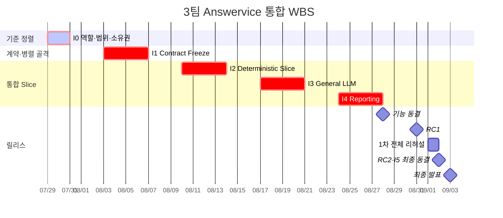

# Answervice — DataHub 대화형 분석·자동 리포팅 WBS

| 항목 | 내용 |
|---|---|
| 문서 설명 | Answervice의 실행 작업, 담당, 상태, 일정, 산출물, Gate와 병합 순서를 관리하는 공식 WBS 작업본 |
| 문서 분류 | 산출물 작업본 |
| 버전 | v7.29 |
| 문서 기준일 | 2026-07-31 14:55 |
| 작성·수정 | 김재홍·박준희·정승·윤대성·송민지 / 3팀 사용자 요청·Codex 반영 |
| 산출물 번호 | 02 |
| 제출 일자 | 2026-07-16 |
| 대응 템플릿 | `docs/templates/[기획] WBS_양식 (1)_27기_0팀.xlsx`, `docs/templates/[기획] WBS_양식(2)_27기_0팀.xlsx` |

> 전체 프로젝트 기간 2026-07-10~09-03 · 역할 개편 적용일 2026-07-29 · 5인 · 실행 일정 99개 태스크 · I5 이후 비차단 후속 4건 · 공식 산출물 21건 + 옵션 1건
>
> 기준 기획서는 `docs/Answervice_기획서.md`, 화면 기준은 `docs/markdown/05_화면설계서.md`, AI 실행 절차는 `docs/markdown/ai_docs/5인_병렬구현_*_매뉴얼_최종안.md`, Gate별 발행 값은 `docs/markdown/collaboration/Gate_실행_카드_원장.md`다.

## 대응 양식 구조

목록형과 갠트형 원본 양식을 함께 사용한다. Markdown에서는 대공정을 절 제목으로 두고, 실행 행에 목록형 필수 필드와 갠트형 입력 필드를 함께 유지한다.

| 양식 필드 | Markdown 대응 위치 | 적용 원칙 |
|---|---|---|
| 프로젝트 이름·관리자·기준 날짜 | 제목·상단 메타데이터 | 기술 PM은 박준희, 일정 기준은 KST |
| `Task ID`·`WBS 번호` | 실행 WBS의 `ID` | 숫자 ID는 공식 WBS, 괄호 안 `R*-**`는 역할 매뉴얼 카드 |
| 주요 업무·작업 제목 | 실행 WBS의 단계 제목 | 역할의 최종 책임 단위로 분리 |
| 세부 업무 | 실행 WBS의 `작업 항목` | 검증 가능한 결과와 카드 ID를 함께 기록 |
| 담당자·작업 소유자 | 실행 WBS의 `담당` | 첫 번째 담당자가 결과 책임자 |
| 상태 | 실행 WBS의 `현황` | `대기`, `진행`, `검토`, `차단`, `완료`, `취소`만 사용 |
| 시작일·마감일 | 실행 WBS의 `시작`·`마감` | 시작일은 마감일보다 늦을 수 없음 |
| 우선순위 | 실행 WBS의 `우선순위` | `높음`, `중간`, `조건부`로 구분 |
| 기간·완료 비율 | XLSX 변환 시 계산 | 근거 없는 백분율을 추정하지 않음 |
| Gantt timeline | 5.4주 실행 일정·Mermaid | 07/10~07/24 선행 산출물 구간과 07/29~09/03 확정 실행 구간을 구분하고, 일정 변경 시 실행 WBS와 함께 갱신 |

## 역할·책임·충돌 방지 기준

| 역할 | 담당자 | branch | 최종 책임 | 공용 경계 |
|---|---|---|---|---|
| R1 기술 PM·통합 플랫폼·품질·릴리스 | 박준희 | `junhee` | 계약·결정, root Compose·env·CI, 통합·보안·복구·release | 다른 역할의 서비스 내부를 대신 수정하지 않음 |
| R2 데이터 플랫폼·메타데이터·연합조회 | 정승 | `seung` | 5 source·4 engine, 합성 DDL·seed, DataHub, Trino, adapter·gold fixture | 공통 FastAPI·AI·frontend를 수정하지 않음 |
| R3 AI·모델·프롬프트·ModelOps | 윤대성 | `daesung` | Node 1·2·2′·3, prompt, 평가, serving, 시간·횟수 제한 LoRA 비교·조건부 채택 | 권한·Gate·SQL 실행·결과 정답을 판정하지 않음 |
| R4 백엔드 Control Plane | 김재홍 | `jaehong` | FastAPI, Controller, Context, G1·G2·G3, cache·artifact·audit, worker | 공통 OpenAPI·Alembic chain의 단일 작성자 |
| R5 프론트엔드·자동 리포팅 | 송민지 | `minji` | 활성 frontend, Chat·Evidence·Report·Catalog·Audit UI | Report proposal은 R4가 공통 backend에 등록 |

운영 규칙:

1. 한 AI에는 한 번에 현재 통합 Wave의 역할별 실행 묶음 하나를 준다.
2. 담당자는 실행 묶음의 `TASK_CARD_RANGE`를 번호 순서대로 수행하며 카드 사이에 별도 승인을 기다리지 않는다.
3. 실행 묶음의 `ALLOWED_PATHS`만 수정하고 다른 역할 소유 파일은 change request로 넘긴다.
4. `CHECKPOINT_GATES`에서는 계약·증거만 확인하고, 목표 통합 Gate 또는 중단 조건에 도달할 때까지 역할 branch에서 계속 진행한다. 현재 일정의 단독 checkpoint는 I0다.
5. 목표 통합 Gate 도달·카드 범위 완료·허용 경로 밖 변경·계약 충돌·필수 검증 실패 시 멈추고 통합 판정을 기다린다.
6. 실제 연동 전에는 versioned fixture와 fake adapter로 병렬 개발한다.
7. 달력상 checkpoint나 부분 구현만으로 병합하지 않고 소비 가능한 산출물·검증·handoff가 준비된 역할 결과만 통합한다.
8. `fixture 통과`, `MERGED_DEV`, `VERIFIED_GATE`를 별도 상태로 관리한다.
9. R1은 통합 실패를 원 소유 역할에 반환하고 기능 내부를 대신 고치지 않는다.
10. `app/react`와 `app/enterprise-react` 중 활성 frontend 하나를 I0에서 결정하기 전에는 양쪽 구현을 병행하지 않는다.
11. Django와 자유 ReAct loop는 범위에서 제외하고 FastAPI의 고정 상태 전이를 기준으로 한다.

## Gate·병합 일정

| Gate | 기간 | 통과 기준 | 운영·`dev` 병합 기준 |
|---|---|---|---|
| I0 기준 정렬 | 07/29~07/31 | 역할·branch·P0/P1/P2·backend·frontend·파일 소유권 확정 | checkpoint: R1 기준 결정만 공유하고 역할 구현은 branch에서 계속 |
| I1 Contract Freeze | 08/03~08/07 | metric·time·schema·API·model·Report·health 계약과 fake 소비 가능 | Wave 1: 공통 계약·schema·fake·skeleton만 최소 병합 |
| I2 Deterministic Slice | 08/10~08/14 | PMS+CRM 대표 질문의 Context→G1→G2→Trino→G3→Artifact→화면 trace | Wave 2: `seung` → `daesung` → `jaehong` → `minji` → `junhee` |
| I3 General LLM | 08/17~08/21 | 5 catalog 단독·승인 JOIN·Node 통합·보안 기준선 | Wave 3: `seung` → `daesung` → `jaehong` → `minji` → `junhee` |
| I4 Reporting | 08/24~08/28 | Chat→Artifact→Report→manual/schedule→history, partial·retry 검증 | Wave 4 시작: `minji` proposal → `jaehong` 등록 후 역할별 완료분 통합 |
| RC1 | 08/31 | 필수 30건과 역할별 release 후보 판정 | Critical·High 결함만 소유 branch에서 수정 |
| 리허설 1 | 09/01 | 빈 환경 기동·재적재·성공·차단·partial·재시작 시연 | 승인된 순서로 전 역할 확인 |
| RC2·I5 | 09/02 | release SHA·runbook·code·data·model·prompt·policy 동결 | 승인 후 `dev`→`main`은 별도 승인 |
| 최종 발표 | 09/03 | 승인 SHA와 고정 fixture로 시연·질의응답 | 발표 중 code·설정 변경 금지 |

병합 직후 생산자 test와 소비자 contract test를 실행한다. 실행하지 않은 검증은 `Not Run`, 외부 환경 부족은 `Blocked`로 기록하며 병합만으로 Gate 통과라고 표시하지 않는다.

## 🗓️ 8주 핵심 개발 일정

기획서 v1.2의 확정 실행 기간은 **2026-07-29~09-03(약 5.4주)**다. 아래 선행 1~2는 5.4주 실행 전의 기획·제출 이력이며, 실행 1~6만 현재 역할·Gate 실행 구간이다. 10주 참조 모델은 선후관계와 종료 조건을 설명할 뿐 실제 기간으로 사용하지 않는다. 압축은 작업 중첩이 아니라 I2 대표 2-source 우선, gold 120건 I3까지 분할 제작, I5 이후 후속 이관처럼 범위를 줄여 수행한다.

| 구간 | 기간 | 목표 | 마감·Gate |
|---|---|---|---|
| 선행 1 | 07/10~07/16 | 요구사항·WBS 수립 | 요구사항 정의서·WBS |
| 선행 2 | 07/20~07/24 | 기획·데이터·화면 작업본 | 프로젝트 기획서·수집 데이터 보고서·화면설계서 |
| 실행 1 | 07/29~07/31 | 새 5인 역할·소유권 정렬, 데이터 계약 착수 | I0·DB/저장소 설계·전처리 결과 |
| 실행 2 | 08/03~08/07 | 계약·fixture·골격 동결, 중간 발표 | I1·중간 발표·ML/DL·공식 DB 관련 산출물 |
| 실행 3 | 08/10~08/14 | 대표 2-source 결정론적 전체 왕복 | I2·AI 아키텍처·LLM·sLLM 산출물 |
| 실행 4 | 08/17~08/21 | 5 source·일반 질문·보안 기준선 | I3·역할 분리 Node 비교 보고·시스템 구성도 |
| 실행 5 | 08/24~08/28 | 자동 리포팅·장애·복구·회귀 | I4·기능 동결·웹앱·서비스 테스트 |
| 실행 6 | 08/31~09/03 | RC1·리허설·I5·최종 발표 | 최종 PT·소스코드·시연영상 |

## 📈 Mermaid 일정 가시화

```mermaid
gantt
    title 3팀 Answervice 통합 WBS
    dateFormat  YYYY-MM-DD
    axisFormat  %m/%d

    section 기준 정렬
    I0 역할·범위·소유권             :crit, active, i0, 2026-07-29, 2026-07-31

    section 계약·병렬 골격
    I1 Contract Freeze              :crit, i1, 2026-08-03, 2026-08-07

    section 통합 Slice
    I2 Deterministic Slice           :crit, i2, 2026-08-10, 2026-08-14
    I3 General LLM                   :crit, i3, 2026-08-17, 2026-08-21
    I4 Reporting                     :crit, i4, 2026-08-24, 2026-08-28

    section 릴리스
    기능 동결                        :milestone, freeze_feature, 2026-08-28, 0d
    RC1                              :milestone, rc1, 2026-08-31, 0d
    1차 전체 리허설                  :rehearsal, 2026-09-01, 1d
    RC2·I5 최종 동결                 :milestone, rc2, 2026-09-02, 0d
    최종 발표                        :milestone, final, 2026-09-03, 0d
```

## 📊 단계별 요약

| 단계 | 태스크 | 기간 |
|---|:--:|---|
| 기준 정렬·통합 기반 | 8 | 07/29~08/07 |
| 데이터 플랫폼·메타데이터·연합조회 | 20 | 07/29~08/28 |
| AI·모델·프롬프트·ModelOps | 16 | 07/29~09/02 |
| 백엔드 Control Plane | 22 | 07/29~09/02 |
| 프론트엔드·자동 리포팅 | 20 | 07/29~09/03 |
| 통합 Gate·품질·릴리스 | 6 | 08/03~09/03 |
| 발표·공식 산출물 | 7 | 08/03~09/03 |

### 일정·부하 검증 결과

- R1은 공통 계약·통합·품질·릴리스의 결과 책임자지만 R2~R5 서비스 내부 구현을 대신하지 않는다.
- R2~R5는 I1 이전에도 fake·fixture를 사용할 수 있으나 실제 연동 완료로 표시하지 않는다.
- I2의 대표 질문은 PMS PostgreSQL과 CRM SQL Server를 사용하는 2-source 경로로 고정하고, 이후 5 catalog 단독과 승인된 2~3-source JOIN으로 확장한다.
- R4는 Report 공통 등록과 worker를, R5는 독립 Report domain·router·migration proposal과 UI를 담당해 Alembic·entrypoint 충돌을 피한다.
- 기획서 v1.2의 기술 스택 표는 계획과 2026-07-31 실측을 분리한다. 활성 frontend는 React 19·Vite이며, TypeScript·TanStack Query·`react-grid-layout`·`dnd-kit`은 미도입 상태를 완료로 간주하거나 일정에 자동 편입하지 않는다. 차트는 현재 `recharts`를 유지하고 교체는 별도 계약 변경으로만 처리한다.
- 모든 Node는 Base를 기준선으로 유지한다. 평가 데이터·baseline·외부 비용 권한이 준비되면 R3가 시간·횟수를 제한한 LoRA/QLoRA 비교를 1회 수행하고, 선행 조건이 없으면 `Blocked` 또는 `Not Run` 사유를 남긴다. 제품 채택은 별도 Gate 통과 시에만 허용한다.
- 08/28 이후 P0 신규 기능을 추가하지 않고, 09/02 승인 후 code·dependency·model·seed·설정을 변경하지 않는다.

## 실행 WBS

공식 WBS의 숫자 ID와 역할 매뉴얼의 `R*-**` 카드를 작업 항목에 함께 적는다. 담당자가 여러 명이면 첫 번째 담당자가 결과 책임자다.

## 🗂️ 전체 태스크 (99개)

### 기준 정렬·통합 기반

| ID | 작업 항목 | 산출물 | 담당 | 현황 | 시작 | 마감 | 우선순위 |
|---|---|---|:--:|:--:|:--:|:--:|:--:|
| 1.1 | R1-00 저장소·기획서·AGENTS·WBS·역할 기준 정렬 | 결정·충돌 원장 | 박준희 | 완료 | 07/29 | 07/31 | 높음 |
| 1.2 | R1-01 P0/P1/P2·비목표·공식 산출물 대응 고정 | 범위표·제외 목록 | 박준희 | 완료 | 07/29 | 07/31 | 높음 |
| 1.3 | R1-02 파일 소유권·서비스 경계 Freeze | ownership matrix | 박준희 | 완료 | 07/29 | 07/31 | 높음 |
| 1.4 | R1-03 metric·time·schema·API·state·error 공통 계약 | contract version | 박준희 | 완료 | 08/03 | 08/07 | 높음 |
| 1.5 | R1-04 dev·full·split-host Compose skeleton | 통합 profile | 박준희 | 완료 | 08/03 | 08/07 | 높음 |
| 1.6 | R1-05 환경변수·Secret 계약 | `.env.example`·secret matrix | 박준희 | 완료 | 08/03 | 08/07 | 높음 |
| 1.7 | R1-06 역할별 CI·품질 Gate | CI jobs·fail policy | 박준희 | 완료 | 08/03 | 08/07 | 높음 |
| 1.8 | R1-08 I1 Contract Freeze 판정 | I1 판정서·fixture 소비 증거 | 박준희 | 완료 | 08/06 | 08/07 | 높음 |

### 데이터 플랫폼·메타데이터·연합조회

| ID | 작업 항목 | 산출물 | 담당 | 현황 | 시작 | 마감 | 우선순위 |
|---|---|---|:--:|:--:|:--:|:--:|:--:|
| 2.1 | R2-00 공통 데이터 계약 확인 | source·engine·owner 표 | 정승 | 완료 | 07/29 | 07/31 | 높음 |
| 2.2 | R2-01 5 source·4 engine registry | source registry | 정승 | 완료 | 07/29 | 07/31 | 높음 |
| 2.3 | R2-02 논리 모델·grain 정의 | entity 관계·grain | 정승 | 완료 | 07/29 | 07/31 | 높음 |
| 2.4 | R2-03 물리 schema·DDL·제약·index | versioned DDL | 정승 | 완료 | 07/29 | 08/07 | 높음 |
| 2.5 | R2-04 deterministic synthetic seed·scenario | seed·scenario manifest | 정승 | 완료 | 07/29 | 08/07 | 높음 |
| 2.6 | R2-05 customer identity bridge | `customer_identity_map` | 정승 | 완료 | 07/29 | 08/07 | 높음 |
| 2.7 | R2-06 event-time 회원 등급 이력 | `member_grade_history` | 정승 | 완료 | 07/29 | 08/07 | 높음 |
| 2.8 | R2-07 데이터 품질·전처리·reject 관리 | DQR·PREP 결과 | 정승 | 완료 | 07/30 | 08/07 | 높음 |
| 2.9 | R2-08 source·application read-only 계정 요구 | account matrix | 정승 | 완료 | 07/29 | 08/07 | 높음 |
| 2.10 | R2-09 DataHub ingestion recipe 5개 | versioned recipes | 정승 | 진행 | 07/29 | 08/21 | 높음 |
| 2.11 | R2-10 Metadata·owner·domain·tag·lineage 보강 | URN·lineage manifest | 정승 | 진행 | 08/10 | 08/21 | 높음 |
| 2.12 | R2-11 DataHub typed adapter | search·graph·health adapter | 정승 | 진행 | 08/10 | 08/21 | 높음 |
| 2.13 | R2-12 Trino catalog 5개 | connector·catalog 설정 | 정승 | 진행 | 07/29 | 08/21 | 높음 |
| 2.14 | R2-13 source↔Trino type mapping | type mapping matrix | 정승 | 진행 | 08/10 | 08/21 | 높음 |
| 2.15 | R2-14 승인 JOIN Registry | JOIN ID·cardinality·time 계약 | 정승 | 진행 | 08/10 | 08/21 | 높음 |
| 2.16 | R2-15 대표 2·3-source 정답 조회 | 정답 SQL·result hash | 정승 | 진행 | 08/10 | 08/21 | 높음 |
| 2.17 | R2-16 Trino/source 실행 adapter | query·status·cancel·health | 정승 | 진행 | 08/10 | 08/21 | 높음 |
| 2.18 | R2-17 source watermark·cache 무효화 입력 | watermark set | 정승 | 대기 | 08/17 | 08/28 | 높음 |
| 2.19 | R2-18 필수 30건·gold용 데이터 fixture | 평가 fixture | 정승 | 대기 | 08/17 | 08/28 | 높음 |
| 2.20 | R2-19 5번째 source 온보딩·재현 | runbook·URN→FQN trace | 정승 | 대기 | 08/24 | 08/28 | 높음 |

### AI·모델·프롬프트·ModelOps

| ID | 작업 항목 | 산출물 | 담당 | 현황 | 시작 | 마감 | 우선순위 |
|---|---|---|:--:|:--:|:--:|:--:|:--:|
| 3.1 | R3-00 AI P0/P2·공식 모델 산출물 대응 범위 확인 | model decision 초안 | 윤대성 | 완료 | 07/29 | 07/31 | 높음 |
| 3.2 | R3-01 Node 1·2·2′·3 I/O schema | versioned JSON schema | 윤대성 | 완료 | 08/03 | 08/07 | 높음 |
| 3.3 | R3-02 deterministic fake model adapter | fake adapter | 윤대성 | 완료 | 08/03 | 08/10 | 높음 |
| 3.4 | R3-03 Node 1 질문 정규화 | intent·metric·time 후보 | 윤대성 | 완료 | 08/03 | 08/21 | 높음 |
| 3.5 | R3-04 Node 2 Context 제한 SQL 생성 | Trino SQL·참조 목록 | 윤대성 | 대기 | 08/17 | 08/21 | 높음 |
| 3.6 | R3-05 Node 2′ 정규화 오류 1회 수정 | corrected SQL | 윤대성 | 대기 | 08/17 | 08/21 | 높음 |
| 3.7 | R3-06 G3 통과 결과의 Node 3 설명 | 근거·조건·주의 설명 | 윤대성 | 완료 | 08/10 | 08/21 | 높음 |
| 3.8 | R3-07 Prompt Registry | prompt ID·version·hash | 윤대성 | 완료 | 08/03 | 08/07 | 높음 |
| 3.9 | R3-08 필수 30건 평가 runner | schema·linking·SQL·result 평가 | 윤대성 | 완료 | 08/10 | 08/31 | 높음 |
| 3.10 | R3-09 Base model·Analytics Agent 기준선 비교 | 정확도·p50·p95·자원 비교표 | 윤대성 | 대기 | 08/17 | 08/21 | 높음 |
| 3.11 | R3-10 train·val·gold manifest 검수 | 학습 데이터 검수 기록 | 윤대성 | 대기 | 08/17 | 08/21 | 높음 |
| 3.12 | R3-11 time-boxed LoRA/QLoRA 1회 비교와 제품 채택 Gate | 비교 결과·adapter·rollback 증거 | 윤대성 | 대기 | 08/24 | 08/28 | 조건부 |
| 3.13 | R3-12 vLLM·RunPod serving | endpoint·health·manifest | 윤대성 | 대기 | 08/17 | 08/28 | 높음 |
| 3.14 | R3-13 production model client | retry·fallback·circuit 계약 | 윤대성 | 대기 | 08/17 | 08/28 | 높음 |
| 3.15 | R3-14 model trace·비용·재현성 | version·token·cost trace | 윤대성 | 대기 | 08/17 | 08/28 | 중간 |
| 3.16 | R3-15 model·prompt·adapter release 후보 고정 | model release manifest | 윤대성 | 대기 | 08/24 | 09/02 | 높음 |

### 백엔드 Control Plane

| ID | 작업 항목 | 산출물 | 담당 | 현황 | 시작 | 마감 | 우선순위 |
|---|---|---|:--:|:--:|:--:|:--:|:--:|
| 4.1 | R4-00 backend 경계·의존 방향 | architecture decision | 김재홍 | 완료 | 07/29 | 07/31 | 높음 |
| 4.2 | R4-01 공통 객체·OpenAPI·오류 계약 | versioned API contract | 김재홍 | 완료 | 07/29 | 08/07 | 높음 |
| 4.3 | R4-02 인증·request context middleware | role·as_of·trace context | 김재홍 | 완료 | 08/03 | 08/07 | 높음 |
| 4.4 | R4-03 application DB model·Alembic | migration head | 김재홍 | 완료 | 08/03 | 08/07 | 높음 |
| 4.5 | R4-04 Router·Template Binding | route decision | 김재홍 | 완료 | 08/03 | 08/10 | 높음 |
| 4.6 | R4-05 Controller 고정 상태 머신 | transition table | 김재홍 | 완료 | 08/03 | 08/10 | 높음 |
| 4.7 | R4-06 Context Registry·Builder | versioned Context Package | 김재홍 | 완료 | 08/10 | 08/14 | 높음 |
| 4.8 | R4-07 G1 Context Gate | decision·evidence | 김재홍 | 완료 | 08/10 | 08/14 | 높음 |
| 4.9 | R4-08 R3 Node typed client | model client·오류 처리 | 김재홍 | 완료 | 08/10 | 08/21 | 높음 |
| 4.10 | R4-09 G2 SQL Policy Gate | AST·policy decision | 김재홍 | 완료 | 08/10 | 08/14 | 높음 |
| 4.11 | R4-10 Node 2′·G2′ 수정 1회 통제 | repair counter | 김재홍 | 완료 | 08/10 | 08/14 | 높음 |
| 4.12 | R4-11 R2 Trino 실행 lifecycle 통제 | pass token·timeout·cancel | 김재홍 | 완료 | 08/10 | 08/14 | 높음 |
| 4.13 | R4-12 Result Shaper·G3 | shaped result·evidence | 김재홍 | 완료 | 08/10 | 08/14 | 높음 |
| 4.14 | R4-13 Node 3·승인 후 수정 불가 Artifact | artifact contract | 김재홍 | 완료 | 08/10 | 08/14 | 높음 |
| 4.15 | R4-14 SQL Plan·Result Cache | versioned cache key | 김재홍 | 대기 | 08/17 | 08/21 | 중간 |
| 4.16 | R4-15 Audit·Trace·관측 | linked request trace | 김재홍 | 완료 | 08/10 | 08/21 | 높음 |
| 4.17 | R4-16 R5 Report module 공통 등록 | analysis run contract | 김재홍 | 대기 | 08/24 | 08/28 | 높음 |
| 4.18 | R4-17 worker·schedule runtime | 영속 job·같은 요청 한 번만 처리·실패 격리 | 김재홍 | 대기 | 08/24 | 08/28 | 높음 |
| 4.19 | R4-18 권한·mask·민감정보 가림(redaction) | 보안 검증 증거 | 김재홍 | 대기 | 08/17 | 08/28 | 높음 |
| 4.20 | R4-19 retention·backup·restore hook | 보존 job·복구 절차 | 김재홍 | 대기 | 08/24 | 09/02 | 높음 |
| 4.21 | R4-20 health·backend Dockerfile·회귀 | service fragment | 김재홍 | 검토 | 08/24 | 09/02 | 높음 |
| 4.22 | R4-21 API·migration·policy release 동결 | backend release manifest | 김재홍 | 대기 | 08/31 | 09/02 | 높음 |

### 프론트엔드·자동 리포팅

| ID | 작업 항목 | 산출물 | 담당 | 현황 | 시작 | 마감 | 우선순위 |
|---|---|---|:--:|:--:|:--:|:--:|:--:|
| 5.1 | R5-00 frontend 후보·fixture 조사와 활성 app 결정안 | reuse·remove 결정표 | 송민지 | 완료 | 07/29 | 07/31 | 높음 |
| 5.2 | R5-01 IA·routing·design token | route·layout | 송민지 | 완료 | 07/29 | 07/31 | 높음 |
| 5.3 | R5-02 OpenAPI type·client·mock | typed client·fixture | 송민지 | 완료 | 08/03 | 08/07 | 높음 |
| 5.4 | R5-03 Chat shell·질문 흐름 | conversation UI | 송민지 | 진행 | 08/03 | 08/14 | 높음 |
| 5.5 | R5-04 실행 상태·오류 UI | state components | 송민지 | 진행 | 08/03 | 08/21 | 높음 |
| 5.6 | R5-05 Evidence·출처·조건 panel | URN·metric·filter·as_of UI | 송민지 | 진행 | 08/10 | 08/14 | 높음 |
| 5.7 | R5-06 결과 표·차트 | result components | 송민지 | 진행 | 08/10 | 08/14 | 높음 |
| 5.8 | R5-07 Chat→Report Artifact bridge | artifact action | 송민지 | 진행 | 08/10 | 08/14 | 높음 |
| 5.9 | R5-08 Report definition·version·run·block domain | Report contract | 송민지 | 완료 | 08/03 | 08/24 | 높음 |
| 5.10 | R5-09 독립 Report router·API module | router·contract test | 송민지 | 대기 | 08/17 | 08/24 | 높음 |
| 5.11 | R5-10 Report migration proposal | 단일 migration proposal | 송민지 | 대기 | 08/17 | 08/24 | 높음 |
| 5.12 | R5-11 12-column Report editor | add·move·resize·draft | 송민지 | 대기 | 08/24 | 08/28 | 높음 |
| 5.13 | R5-12 수동 실행·Run History | run·status·history UI | 송민지 | 대기 | 08/24 | 08/28 | 높음 |
| 5.14 | R5-13 daily·weekly·monthly schedule UI | schedule contract | 송민지 | 대기 | 08/24 | 08/28 | 높음 |
| 5.15 | R5-14 Catalog·Connection UI | source·asset·ingestion UI | 송민지 | 대기 | 08/17 | 08/28 | 중간 |
| 5.16 | R5-15 Operations·Audit trace UI | request trace UI | 송민지 | 대기 | 08/24 | 08/28 | 높음 |
| 5.17 | R5-16 접근성·반응형·보안 상태 표시 | QA evidence | 송민지 | 대기 | 08/24 | 08/31 | 높음 |
| 5.18 | R5-17 실제 API integration | production client | 송민지 | 대기 | 08/24 | 08/31 | 높음 |
| 5.19 | R5-18 frontend Dockerfile·build·E2E | service fragment | 송민지 | 대기 | 08/24 | 09/02 | 높음 |
| 5.20 | R5-19 발표 route·fallback fixture | demo runbook | 송민지 | 대기 | 08/31 | 09/03 | 높음 |

### 통합 Gate·품질·릴리스

| ID | 작업 항목 | 산출물 | 담당 | 현황 | 시작 | 마감 | 우선순위 |
|---|---|---|:--:|:--:|:--:|:--:|:--:|
| 6.1 | R1-07 필수 30건·gold 120건 평가 원장 관리 | reviewer·split·expected 원장 | 박준희·정승·윤대성 | 진행 | 08/03 | 08/31 | 높음 |
| 6.2 | R1-09 I2 Deterministic Slice 통합·판정 | 대표 질문 trace·result hash | 박준희·정승·윤대성·김재홍·송민지 | 진행 | 08/10 | 08/14 | 높음 |
| 6.3 | R1-10 I3 General LLM·보안 기준선 통합 | 일반 질문·model 비교·보안 결과 | 박준희·정승·윤대성·김재홍·송민지 | 대기 | 08/17 | 08/21 | 높음 |
| 6.4 | R1-11 I4 Reporting·worker·partial 통합 | Report 왕복 trace | 박준희·김재홍·송민지 | 대기 | 08/24 | 08/28 | 높음 |
| 6.5 | R1-12 read-only·mask·장애·복구·성능 검증 | 수용 시험 증거 | 박준희·정승·윤대성·김재홍·송민지 | 대기 | 08/24 | 09/02 | 높음 |
| 6.6 | R1-13 RC1·RC2·I5·최종 Release | release manifest·runbook·승인 SHA | 박준희·정승·윤대성·김재홍·송민지 | 대기 | 08/31 | 09/03 | 높음 |

### 발표·공식 산출물

| ID | 작업 항목 | 산출물 | 담당 | 현황 | 시작 | 마감 | 우선순위 |
|---|---|---|:--:|:--:|:--:|:--:|:--:|
| 7.1 | 중간 발표 자료·역할별 진행 근거·리허설 | 중간 발표 PT | 박준희·정승·윤대성·김재홍·송민지 | 대기 | 08/03 | 08/06 | 높음 |
| 7.2 | 최종 발표 story·PT·시간 배분 | 최종 발표 PT | 박준희·정승·윤대성·김재홍·송민지 | 대기 | 08/24 | 09/02 | 높음 |
| 7.3 | 데이터·AI·Control Plane·UI 역할별 근거와 Q&A | 발표 근거 묶음 | 박준희·정승·윤대성·김재홍·송민지 | 대기 | 08/31 | 09/02 | 높음 |
| 7.4 | 승인 SHA 소스·README·version manifest 패키징 | 프로젝트 소스코드 | 박준희·정승·윤대성·김재홍·송민지 | 대기 | 08/31 | 09/03 | 높음 |
| 7.5 | 성공·차단·partial·Report 시연 녹화 | 시연영상 | 송민지·박준희 | 대기 | 08/31 | 09/03 | 높음 |
| 7.6 | 1차·2차 전체 리허설과 결함 회귀 | 리허설 기록 | 박준희·정승·윤대성·김재홍·송민지 | 대기 | 09/01 | 09/02 | 높음 |
| 7.7 | 승인 환경 최종 발표·질의응답 | 발표 결과 | 박준희·정승·윤대성·김재홍·송민지 | 대기 | 09/03 | 09/03 | 높음 |

## 📦 산출물 제출 일정 (공식 21 + 옵션 1)

공식 산출물 번호·마감은 일정 참고 문서를 유지하고, 새 역할의 결과 책임자와 관련 WBS를 연결한다. 제출 여부는 저장소 증거를 확인하기 전까지 추정하지 않는다.

| 단계 | 산출물 | 제출일 | 내부검토 | WBS | 담당 | 현황 |
|---|---|:--:|:--:|:--:|:--:|:--:|
| 기획 | 요구사항 정의서 | **07/16** | 07/15 | 1.1 | 박준희 | 완료 |
| 기획 | WBS | **07/16** | 07/15 | 1.1 | 박준희 | 완료 |
| 기획 | 프로젝트 기획서 | **07/24** | 07/23 | 1.2 | 박준희 | 검토 |
| 데이터 수집 및 저장 | 수집 데이터 보고서 | **07/24** | 07/23 | 2.5 | 정승 | 대기 |
| 모델 배포 | 화면설계서 | **07/24** | 07/23 | 5.2 | 송민지 | 검토 |
| 데이터 수집 및 저장 | 데이터베이스/저장소 설계 문서 | **07/31** | 07/30 | 2.4 | 정승 | 검토 |
| 데이터 전처리 | 데이터 전처리 결과서 | **07/31** | 07/30 | 2.8 | 정승 | 검토 |
| 발표 및 시연 | 중간 발표 PT 자료 | **08/06** | 08/05 | 7.1 | 박준희·전원 | 대기 |
| 데이터 전처리 | 머신러닝/딥러닝 학습결과서 | **08/07** | 08/05 | 3.10 | 윤대성 | 대기 |
| 데이터 전처리 | 학습한 ML/DL 모델 | **08/07** | 08/05 | 3.16 | 윤대성 | 대기 |
| 모델링 및 평가 | 벡터DB/GraphDB 구축 결과서 | **08/07** | 08/05 | 3.1 | 윤대성·박준희 | 차단 |
| 모델링 및 평가 | AI 시스템 아키텍처 | **08/14** | 08/13 | 4.6 | 박준희·김재홍 | 대기 |
| 모델링 및 평가 | LLM 활용 소프트웨어 | **08/14** | 08/13 | 4.14 | 김재홍·윤대성 | 대기 |
| 모델링 및 평가 | 자체 sLLM 인공지능 | **08/14** | 08/13 | 3.16 | 윤대성 | 대기 |
| 모델링 및 평가 | 멀티 에이전트 테스트 계획 및 결과 보고서(공식 명칭; 역할 분리 Node 비교로 작성) | **08/21** | 08/20 | 3.10 | 윤대성·박준희 | 대기 |
| 모델 배포 | 시스템 구성도 | **08/21** | 08/20 | 1.5 | 박준희·김재홍 | 대기 |
| 모델 배포 | 개발된 LLM 연동 웹 애플리케이션 | **08/28** | 08/27 | 5.19 | 송민지·김재홍 | 대기 |
| 모델 배포 | 서비스 테스트 계획 및 결과 보고서 | **08/28** | 08/27 | 6.5 | 박준희·전원 | 대기 |
| 발표 및 시연 | 최종 발표 PT 자료 | **09/03** | 09/02 | 7.2 | 박준희·전원 | 대기 |
| 발표 및 시연 | 프로젝트 개발 소스코드 | **09/03** | 09/02 | 7.4 | 박준희·전원 | 대기 |
| 발표 및 시연 | 시연영상 | **09/03** | 09/02 | 7.5 | 송민지·박준희 | 대기 |
| 모델링 및 평가 | AI 윤리/편향성 점검 결과서(옵션) | **옵션** | 08/26 | 3.11 | 윤대성·박준희 | 대기 |

`docs/deliverables/01_요구사항정의서_29기_3팀.xlsx`와 `docs/deliverables/02_WBS_29기_3팀.xlsx`는 현재 Answervice 기준으로 교정해 공식 근거로 사용한다. `docs/deliverables/03_프로젝트기획서_29기_3팀.docx`는 기획서 v1.2 내용으로 갱신됐으나 PNG 시각 검증이 `Not Run`이므로 `검토`를 유지한다.

`벡터DB/GraphDB 구축 결과서`는 공식 산출물 목록에는 있으나 현재 기획서의 P0/P1 구현 범위에는 VectorDB·GraphDB가 없다. R1·R3가 08/05까지 “미도입 근거와 비교 실험 보고로 제출 가능한지”를 확인하기 전까지 `차단`으로 유지하며, 확인 없이 P0에 신규 인프라를 추가하지 않는다.

## 기획서 추적성

| 기획서 영역 | 주 책임 | WBS | 처리 기준 |
|---|---|---|---|
| §1~5 목표·범위·사용자·기능 | R1 박준희 | 1.1~1.4 | I0에서 P0/P1/P2와 비목표 고정 |
| §7 전체 아키텍처·추적 ID | R4 김재홍·R1 박준희 | 4.1~4.6, 4.16 | 고정 상태 전이·trace 계약 |
| §8 DataHub·Trino | R2 정승 | 2.1~2.20 | 5 catalog 단독·승인 2~3-source JOIN |
| §9 Context·Guarded Text-to-SQL | R4 김재홍 | 4.7~4.14 | G1·G2·G3 우회 0건 |
| §10 sLLM·RunPod | R3 윤대성 | 3.2~3.16 | 전 Node Base 기준선, 제한된 1회 비교·LoRA 채택 조건부 |
| §11 자동 리포팅 | R5 송민지·R4 김재홍 | 5.8~5.14, 4.17~4.18 | definition/run 분리·일부 실패·중복 실행 방지 |
| §12 MCP·문서 RAG | R1 박준희 | 1.2, F-01~F-02 | I5 이후 P2 후속, 현재 완료선 비차단 |
| §13 ML-as-a-Tool | R1 박준희 | 1.2, F-03 | I5 이후 P2 후속, 현재 완료선 비차단 |
| §14 합성 데이터 | R2 정승 | 2.4~2.9, 2.19 | deterministic seed·참조·기간 무결성 |
| §15 화면·메뉴 | R5 송민지 | 5.1~5.20 | P0/P1·접근성·오류 상태 |
| §16 애플리케이션 구조 | R1·R4·R5 | 1.3~1.8, 4.1~4.6, 5.1~5.3 | I0/I1에서 단일 entrypoint·frontend 결정 |
| §17 보안·권한·감사·복구 | R1·R2·R4·R5 | 2.9, 4.3, 4.16, 4.19~4.21, 6.5 | read-only·mask·민감정보 가림·restore |
| §18 평가 | R1·R2·R3 | 2.19, 3.9~3.15, 6.1~6.5 | 필수 30건·gold 120건·재현 |
| §19 MVP·후속 범위 | R1 박준희 | 1.2, F-01~F-04 | I5 이후 후속, 현재 완료선 비차단 |
| §20 개발·산출물 | 전 역할 | 1.1~7.7 | 07/29~09/03 압축 일정 적용 |
| §21 리스크 | R1 박준희 | 1.5~1.8, 6.5~6.6 | blocker·rollback·잔여 위험 기록 |
| §22 결정·가정 | R1 박준희 | 1.1~1.4 | I0/I1 결정 원장에 version 기록 |

## I5 이후 후속 단계 백로그

아래 네 항목은 기획서에 이미 포함된 후속 범위다. 현재 99개 실행 태스크, I1~I5 Gate, 09/03 발표 완료율에는 포함하지 않는다. I5 이후 R1이 별도 일정·계약·비용·보안 Gate를 승인할 때만 새 실행 묶음으로 발행하며, 그 전 상태가 `대기`, `Blocked`, `Not Run`이어도 현재 릴리스 실패로 판정하지 않는다.

| 후속 ID | 항목 | 착수 조건 | 주 책임 | 필수 인계 | 현재 상태 |
|---|---|---|---|---|:--:|
| F-01 | P2 MCP Tool Registry·호출 통제 | I5 완료, Tool I/O·권한·감사·오류 계약 승인 | R4 김재홍 | R3 adapter, R5 관리 UI, R1 보안 Gate | 대기 |
| F-02 | P2 사내 운영 문서 RAG | I5 완료, 문서 권한·버전·발효일·인용·평가 계약 승인 | R3 윤대성 | R2 metadata, R4 authz·trace, R5 근거 UI | 대기 |
| F-03 | P2 ML-as-a-Tool | I5 완료, feature·model I/O·버전·평가·표시 계약 승인 | R3 윤대성 | R2 feature data, R4 Tool Gate, R5 예측 표시 | 대기 |
| F-04 | 고객 360 | I5 완료, identity·중복·mask·role·감사 Gate와 별도 수용 기준 승인 | R5 송민지 | R2 identity·mask, R4 authz·trace, R1 범위 Gate | 대기 |

## 추가 결정 필요

| 항목 | 현재 운용 기준 | 결정 시점 | 결정 책임 |
|---|---|---|---|
| 활성 frontend | `app/react`와 `app/enterprise-react` 중 하나만 선택 | I0 | R1·R5 |
| full·dev·split-host | dev로 병렬 개발, full 실패 시 split-host 전환 | I0/I1 | R1 |
| DataHub·Trino·connector 고정 version | 실행 전 고정하고 manifest 기록 | I1 | R1·R2 |
| Result Cache 구현 | versioned key 계약 우선, PostgreSQL·Redis는 profile 측정 후 선택 | I1/I3 | R1·R4 |
| model checkpoint·RunPod profile | Base 기준선 우선, 비용·자원 승인 후 외부 실행 | I1/I3 | R1·R3 |
| SQL LoRA 제품 채택 | time-boxed 비교 Gate 전에는 Base 유지 | I4 이전 | R1·R3 |
| 공식 VectorDB/GraphDB 산출물 | 미도입 근거 제출 가능 여부 확인 전 `차단` | 08/05 | R1·R3 |
| 공식 03 제출본 시각 검증 | DOCX는 기획서 v1.2 내용으로 갱신됐으며 PNG render 전까지 `검토` | 다음 공식 제출 전 | R1·R3 |

## WBS 작업 로그

최신 기록을 위에 추가한다. 작업 로그는 문서 변경 자체를 구현 완료 근거로 사용하지 않는다.

| 일시(KST) | WBS ID | 변경 요약 | 결과 구분 |
|---|---|---|---|
| 2026-07-31 14:55 | 5.4~5.8, 6.2 | R5-W2 제품 `9a4d4e9`·handoff `b7f26f9`의 build·contract·integration·role gate·branch CI는 통과했지만, R4 `CONTEXT_INCOMPLETE`를 정책 차단과 구분하는 재질문 화면·contract/browser 증거가 없어 dev 병합을 보류했다. 실제 착수한 5개 카드를 진행으로 전환하고 새 기준 `6b37f57`의 REWORK를 발행했으며 일정 날짜는 유지했다. | R5-W2 재질문 상태 보완 |
| 2026-07-31 14:34 | 1.7, 4.5~4.14, 4.16 | R4-W2의 MERGED_DEV 전환 뒤 junhee CI run `30607094428`에서 실행 묶음 선택 테스트가 과거 `READY`를 고정 기대해 1건 실패한 것을 확인했다. 현재 원장 상태 `MERGED_DEV`를 기대하도록 R1 통합 테스트 한 줄을 교정했으며 R4 제품·계약과 WBS 일정·상태는 유지했다. | R4 상태 회귀 테스트 교정 |
| 2026-07-31 14:30 | 4.5~4.14, 4.16, 6.2 | R4-W2 제품 `cd9e9c6`·handoff `2924d0b`의 Context→G1→model→G2→repair 1회→query→G3→Artifact 흐름과 네 결과 trace, branch CI run `30606533152` PASS를 확인해 `e34442d`로 dev에 통합했다. pipeline 8건·integration 16건과 dev CI run `30606915908` PASS를 근거로 완료 카드를 완료로 전환하고 R1 평가 원장에 trace 근거를 연결했다. | R4-W2 dev 통합 |
| 2026-07-31 14:20 | 1.1, 1.7 | 기획서 v1.2와 동기화한 공식 WBS XLSX 단일 경로가 R1-W2 허용 범위에서 누락돼 junhee CI run `30606452633`의 role-scope만 실패한 것을 확인했다. 사용자 요청 범위인 해당 XLSX 경로만 Gate 원장에 승인하고 다른 deliverable은 계속 금지했으며 문서·Python·Compose PASS 결과는 유지했다. | 공식 WBS 경로 승인 |
| 2026-07-31 14:12 | 1.1~1.2, 3.10, 7.1~7.7 | 기획서 v1.2를 우선 기준으로 다시 대조해 10주 참조 모델과 5.4주 확정 실행 기간을 분리하고, 압축을 기간 중첩이 아닌 범위 축소로 명시했다. 실제 5인 역할·React/Vite 실측·미도입 frontend 후보·결정론적 역할 분리 Node·Git/CI 운영 경계를 유지했으며, 공식 WBS XLSX를 현행 99개 작업으로 교정하는 근거를 연결했다. | 기획서 v1.2·공식 WBS 동기화 |
| 2026-07-31 14:05 | 2.10~2.17, 6.2 | R2-W2 제품 `75f148b`·handoff `de0a26f`의 PMS/CRM metadata·adapter·승인 JOIN·GOLD hash·query lifecycle, data 14건·통합 16건·branch CI run `30605617536` PASS를 확인해 `5afb90b`으로 dev에 통합하고 dev CI run `30605760842` PASS를 확인했다. R2-W2는 완료했지만 WBS 행은 후속 5-source·3-source 확장이 남아 진행으로 전환하고 R1 평가 원장에 data 근거를 연결했다. | R2-W2 dev 통합 |
| 2026-07-31 13:58 | 3.7, 3.9, 6.2 | R3-W2 제품 `345a788`·handoff `f4f2563`의 G3 pass 전용 Node 3, deterministic 평가 runner, 허용 경로, AI 20건·통합 14건·branch CI run `30605387557` PASS를 확인해 `f2817a0`으로 dev에 통합하고 dev CI run `30605486384` PASS를 확인했다. R3-06·08을 완료로 전환하고 R1 평가 원장에 runner 도착 근거를 연결했으며 일정·간트 날짜는 유지했다. | R3-W2 dev 통합 |
| 2026-07-31 13:49 | 6.2 | 승인된 R1-W2를 시작하고 평가 원장 v0.2에 I2 성공·재질문·차단·source 실패 수용 슬롯과 역할별 필수 trace 근거를 고정했다. R2~R5 Wave 2 제품·handoff가 아직 없어 질문·SQL·hash·runner 출력은 만들지 않고 생산자 입력 대기를 유지했으며 일정·간트 날짜는 변경하지 않았다. | R1-W2 수용 기준 준비 |
| 2026-07-31 13:36 | 1.4~1.8, 3.1~3.4, 3.8, 4.1~4.4, 5.1~5.3, 5.9 | R3 제품 `4c8eedf`·handoff `cb10eca`와 R4 제품 `2fa5b49`·handoff `825a0c2`의 최종 version·범위·회귀·branch CI를 확인해 각각 `14259c8`·`04e5e6d`로 dev에 통합했다. data 8건·AI 15건·integration 16건·frontend build/contract·dev/full/split-host Compose·service fragment와 dev CI run `30604495881` PASS를 근거로 I0 `I0-v1.0.0`, common I1 `I1-v1.0.0`을 동결하고 R1-W1을 `VERIFIED_GATE`로 승인했다. Wave 1에서 완료 증거가 확정된 R1·R3·R4·R5 작업 상태를 완료로 갱신하고 기준 `04e5e6d`의 전 역할 Wave 2를 READY로 발행했다. 일정·간트 날짜는 유지했다. | I1 VERIFIED_GATE·Wave 2 승인 |
| 2026-07-31 13:14 | 1.4, 1.7, 2.1 | R2 제품 `7051f91`·handoff `510981b`의 data actual version `I1-v1.0.0`, 허용 범위, data·integration 회귀와 branch CI run `30603374739` PASS를 확인해 `7e5e16c`로 dev에 통합하고 dev CI run `30603556566` PASS를 확인했다. R2-W1-F4는 MERGED_DEV·WAIT로 전환하고 R1-03 blocker를 R3·R4로 축소했으며 기존 일정·간트와 Wave 2 PLANNED 상태는 유지했다. | R2 I1 최종 version 통합 |
| 2026-07-31 13:01 | 1.4, 1.7, 2.1 | R1의 data/model version 전환 테스트와 최신 R4 bundle 선택 보완을 `f3038c9`로 dev에 통합하고 GitHub Actions run `30603031072` PASS를 확인했다. 보관된 R2 변경을 새 기준에서 재검증하도록 `R2-W1-F4@f3038c9`를 재발행했으며 다른 역할 범위와 Wave 2는 변경하지 않았다. 기존 WBS 상태·일정·간트는 유지했다. | R2 finalization 재승인 |
| 2026-07-31 12:59 | 1.4, 1.7, 2.1, 3.2, 4.2 | R2-W1-F4의 data 8건은 통과했지만 R1 통합 테스트가 과거 DRAFT data version을 단일 기대해 중단된 것을 확인했다. R2 변경은 commit·push 없이 보관하고, R1 소유 통합 테스트가 승인된 data·model 최종 version의 전환 기간을 검증하도록 최소 수정했으며 새 R4-W1-F4 선택 기대도 원장과 정합화해 통합 14건을 통과했다. 새 dev 기준 SHA와 token 발행 전 기존 WBS 상태·일정·간트는 변경하지 않았다. | I1 version 전환 테스트 보완 |
| 2026-07-31 12:46 | 1.4, 1.7, 2.1, 3.1~3.3, 3.8, 4.2, 5.2, 5.9 | R5 제품 `c600f65`·handoff `3f143af`의 허용 경로·version·clean install·build·contract·role gate와 branch CI run `30602136889` PASS를 확인해 `5a52c8f`로 dev에 통합하고 dev CI run `30602295894` PASS를 확인했다. I1 최종 동결 전 실제 DRAFT를 재점검해 R2 data actual version, R3 model I/O·prompt·fixture version, R4 README OpenAPI 표기만 승격하는 `R2-W1-F4`·`R3-W1-F1`·`R4-W1-F4`를 READY로 발행했으며 Wave 2는 보류했다. 기존 WBS 상태·일정·간트는 변경하지 않았다. | R5 최종 version 통합·I1 승격 승인 |
| 2026-07-31 12:25 | 1.4, 1.7, 5.2 | 최신 `origin/dev` `b81f8e1`과 GitHub Actions run `30601436187` PASS를 확인해 남은 I1 차단 항목인 `R5-W1-F2`의 기준 SHA와 실행 token을 갱신하고 기존 허용 경로의 commit·minji push 승인을 유지했다. R2·R3·R4는 추가 작업 없이 대기하고 Wave 2는 I1 `VERIFIED_GATE` 전까지 `PLANNED`를 유지한다. 기존 WBS 상태·일정·간트는 변경하지 않았다. | R5 I1 동결 승인 갱신 |
| 2026-07-31 12:21 | 1.7, 3.1 | 사용자가 R3 최신 기획 문서를 dev에 병합하고 충돌 시 R3 작성물을 우선하도록 지시해 기존 cleanup 방침을 종료했다. origin/daesung `733307c`의 요약본과 공식 03 DOCX를 `a0ac7ed`로 dev에 통합하고 문서 정책·DOCX ZIP/구조·diff를 통과했으며, LibreOffice 부재로 PNG render는 Not Run으로 기록했다. 기존 상태·일정·간트는 변경하지 않았다. | R3 최신 기획 문서 사용자 override 통합 |
| 2026-07-31 12:14 | 1.7, 3.1 | R3가 복구 지시를 읽은 뒤 제출한 `733307c`에서 요약본 추가와 공식 `03_프로젝트기획서` DOCX 수정이 고유 diff로 남고 CI run `30600969172`가 실패한 것을 확인했다. `R3-W1-CLEAN`의 허용 경로를 현재 두 파일로 교정해 `origin/dev` 상태 복구 commit·push만 재허가했으며 기존 상태·일정·간트는 변경하지 않았다. | R3 branch 복구 범위 교정 |
| 2026-07-31 12:01 | 1.7, 3.1 | R3 `d044fb7`이 terminal 역할 허용 범위 밖 기획 요약 Markdown과 공식 DOCX를 추가해 CI가 실패한 것을 확인하고 dev 병합을 거부했다. 해당 두 파일만 `origin/dev` 상태로 복구하는 `R3-W1-CLEAN`을 READY·REWORK로 발행했으며 기능·Wave 2·다른 경로 변경은 허가하지 않았다. 기존 WBS 상태·일정·간트는 변경하지 않았다. | R3 branch 복구 발행 |
| 2026-07-31 11:55 | 1.4, 1.7, 2.10 | R2 제품 `23059a6`·handoff `b8ec6b9`의 허용 경로·manifest·data 8건·소비자 계약·CI run `30599951597` PASS를 확인해 `47c1f94`로 dev에 통합했다. `actual_checkout_at`, 승인 JOIN `pms_stay_to_crm_membership_grade_event_time_v1`, data candidate `I1-v1.0.0`을 I1 입력으로 승인했으며 R5 제출 전까지 기존 상태·일정·간트는 변경하지 않았다. R3 `d044fb7`은 terminal 허용 범위 밖 문서 추가와 CI failure로 병합하지 않았다. | R2 metric·JOIN 동결·dev 통합 |
| 2026-07-31 11:44 | 1.4, 1.7, 4.2 | R4 제품 `c83809a`와 handoff `9da78aa`의 허용 경로·manifest·backend 55건·GitHub Actions run `30599636125` PASS를 확인해 dev에 통합했다. R1 통합 test를 `OPENAPI-v1.0.0` 단일 version으로 고정하고 R4-W1-F3을 MERGED_DEV로 전환했으며, R2 metric·JOIN과 R5 UI·Report version 제출 전까지 기존 상태·일정·간트는 변경하지 않았다. | R4 OpenAPI 동결·dev 통합 |
| 2026-07-31 11:30 | 1.4, 1.7, 4.2 | R4 제품 결과 `c83809a`의 역할 범위와 전체 52건 중 51건 통과를 확인했다. 남은 1건은 R1 공통 계약이 기존 OpenAPI 초안 version만 기대한 전환 오류로 판정해 원장·통합 test에 `OPENAPI-v1.0.0` 후보를 추가하고, R4에는 제품 변경 없이 최신 dev와 handoff manifest만 재제출하도록 허가했다. R4 dev 통합 전까지 기존 상태·일정·간트는 변경하지 않았다. | R4 OpenAPI 전환 계약 보완 |
| 2026-07-31 11:24 | 1.4, 1.7, 4.2, 5.2 | R1 변경 `4f08263`을 `dev`에 통합하고 CI run `30598777511` PASS를 확인했다. 경로 정합성 제안의 안전한 항목을 승인해 R4 기본 경로를 실제 backend로 교정하고 활성 frontend·기획서·요구사항·화면설계서 소유권을 고정했으며, `app/react/**` 삭제는 별도 결정으로 보류했다. R2·R4·R5 후속 제출 전까지 기존 WBS 상태·일정·간트는 변경하지 않았다. | R1 경로·소유권 정합화 |
| 2026-07-31 11:05 | 1.4, 1.7, 2.10, 4.2 | `origin/dev` `e5eea60`과 CI run `30598022457` PASS를 확인하고 결과 전달 파일만 뒤따르는 commit을 허용하도록 R1 자동 검사를 수정했다. R2 제품 결과 `23059a6`은 전달 manifest 재제출만 허가하고, R4 복구 결과 `14bedf8`은 dev 대비 고유 diff 0건으로 수용해 OpenAPI version 동결 작업을 재발행했다. R2 통합과 R4·R5 version 동결 전까지 기존 WBS 행 상태·일정·간트는 변경하지 않았다. | R1 Gate 보완·R4 재발행 |
| 2026-07-31 10:25 | 1.4, 2.10, 4.2, 5.2 | 최신 `origin/dev` `e2ecee3`과 CI run `30596060168` PASS를 기준으로 R2 데이터 계약과 R5 화면·보고서 version 동결의 commit·개인 branch push를 승인했다. R4는 개인 branch의 허용 범위 밖 제출본 변경을 `origin/dev` 상태로 복구하는 작업만 승인하고 backend 동결은 보류했으며 R3와 Wave 2는 대기를 유지했다. 기존 WBS 행 상태·일정·간트는 변경하지 않았다. | I1 역할별 실행 허가 |
| 2026-07-31 10:12 | 1.4, 2.10, 4.2, 5.2 | `origin/dev` `68fc068`과 GitHub Actions run `30528089815` PASS를 확인해 원격 동기화 차단을 해제했다. I1 입력을 실제 schema와 대조해 기획 예시의 존재하지 않는 PMS 수익 필드와 PMS↔CRM event-time 승인 JOIN 미등록, OpenAPI·UI·Report의 `DRAFT` version을 남은 차단 원인으로 확정했다. R2·R4·R5에 version 동결만 수행하는 follow-up을 발행했으며 기존 상태·일정·간트는 유지했다. | I1 동결 보완 발행 |
| 2026-07-30 17:09 | 1.4~1.7, 2.10 | R2 DataHub consumer `731399d`를 dev에 통합하고 공식 source revision·blob, root dev 3개와 full·split-host 16개 service의 정적 구성을 검증했다. R1이 profile 소유 위치·env·seung Compose CI·한글 경로·공용 보고 예외를 보완했으며 실제 DataHub container 기동과 대표 질문·metric·최종 계약 version 동결 전까지 기존 진행·차단 상태와 일정은 유지했다. | R2 DataHub 통합·R1 Gate 보완 |
| 2026-07-30 15:47 | 1.4~1.7, 2.10, 4.21, 5.2, 5.19 | R4·R5 handoff를 dev에 통합하고 root Compose가 dev 3개 service와 full·split-host 9개 service를 정적으로 소비하도록 구성했으며 root `.env.example`과 Compose CI를 추가했다. DataHub Core consumer fragment·immutable version·official source가 없어 1.5~1.6은 진행, R1-03은 차단을 유지하고 R2-W1-F2를 READY로 발행했다. | R1 통합 profile 진행·R2 보완 발행 |
| 2026-07-30 14:57 | 1.7 | 기존 읽기 전용 CI에 실행 카드 원장의 최신 비-PLANNED `ALLOWED_PATHS`를 사용하는 role scope 검사를 추가하고, terminal 역할의 신규 구현 차단·개인 일일보고 허용·R5 npm ci/build/contract job을 구성했다. 자동 상태 변경·commit·push·merge는 제외했으며 전체 tests 29건을 통과했다. | R1 역할 Gate 자동화 1단계 |
| 2026-07-30 14:52 | 1.4, 4.21, 5.2, 5.19 | R2~R5 원격 작업을 확인해 R4 cleanup 전용 R4-W1-F2를 READY로 발행하고, R5 clean handoff `ba5617b`의 허용 경로·고정 lockfile·npm ci·production build·contract·container health·OpenAPI version을 독립 검증했다. R4·R5 dev 통합과 combined profile 검증 전 상태·일정·간트는 유지했다. | R4 READY·R5 재검토 |
| 2026-07-30 14:39 | 1.4, 2.10 | R2 handoff `055b265`의 지정 3개 파일을 dev에 통합하고 `R2_SERVICE_FRAGMENT_VERIFIED`와 전체 tests 26건을 통과해 R2-W1-F1을 MERGED_DEV로 전환했다. R4·R5 보완과 combined root Compose 검증 전 R1-03 차단·R2-W2 PLANNED 및 일정·간트는 유지했다. | R2 I1 fragment 통합 |
| 2026-07-30 14:16 | 1.4, 2.10, 4.21 | R2 handoff `055b265`의 service fragment·data 7건·Compose config를 검토해 REVIEW로 전환하고, R4 clean handoff `af6cc10`의 허용 경로 정리와 container readiness를 확인했다. R4 cleanup 결함·R2/R4 dev 통합·root Compose 소비자 검증과 R5 보완이 남아 상태·일정·간트는 유지했다. | R2·R4 I1 제출 재검토 |
| 2026-07-30 14:01 | 1.4, 5.2, 5.19 | R5 handoff `140563f`의 typed analysis·Report contract, deterministic mock, 금지 route 차단과 frontend contract test를 R1이 검토해 R5-01을 검토로 전환했다. branch net diff 오염, lockfile·고정 dependency·`npm ci` build·Dockerfile/health fragment·OpenAPI version 보완 전 R1-03 차단과 R5-18 대기를 유지하며 일정·간트 날짜는 변경하지 않았다. | R5 I1 제출 검토 |
| 2026-07-30 13:39 | 1.4, 2.10 | R2-W1-F1 READY 카드 `9925a88`이 최신 `origin/dev=4527375`에 이미 포함된 것을 확인하고 보고된 fragment 3개 파일만 commit·seung push하도록 허가했다. 최신 `origin/seung=cd8fdfc`에는 아직 제출되지 않아 R2-09 진행과 R1-03 차단을 유지하며 일정·간트 날짜는 변경하지 않았다. | R2 제출 허가 |
| 2026-07-30 12:56 | 1.4, 4.21 | `origin/jaehong` handoff `06632fa`의 backend image·non-root·health·OpenAPI와 backend 17건·AI 15건·data 7건·integration 1건을 R1이 독립 검토해 R4-20을 검토로 전환했다. 허용 경로 밖 application DDL 분리·dev 통합·combined database readiness와 R2·R5 follow-up 전 R1-03 차단은 유지하며 일정·간트 날짜는 변경하지 않았다. | R4 I1 제출 검토 |
| 2026-07-30 12:36 | 1.4, 2.10, 4.21, 5.2, 5.19 | R2-W1-F1·R4-W1-F1·R5-W1-F1을 READY로 발행해 역할별 허용 경로·완료 증거·검증·중단 조건을 고정했다. 대표 질문·metric은 승인 전 N/A로 유지하고 follow-up 결과 검증 전 기존 WBS 상태는 변경하지 않았다. | I1 보완 실행 허가 |
| 2026-07-30 12:32 | 1.4 | R3 model serving Dockerfile·실행 manifest는 I1 필수가 아니며 in-process fake adapter로 계약을 검증하고 R3-W3에서 제출하도록 판정했다. R3 service fragment blocker만 해제하고 R2·R4·R5 보완 대기로 R1-03 차단은 유지한다. | I1 blocker 범위 정정 |
| 2026-07-30 12:03 | 1.4 | R2 schema·seed·scenario와 R3 model I/O·prompt·fixture를 I1 입력으로 승인했다. R4·R5는 기존 Wave 1 계약 결함 재작업만 허가하고 clean package·runtime·typed contract·금지 route 차단·build 증거 도착 전 R1-03 차단과 Wave 2 불허를 유지한다. | R1 계약 승인·재작업 허가 |
| 2026-07-30 11:53 | 1.7, 6.1 | R1-03 차단 중 독립 진행 가능한 현재 Python producer·integration·문서 검증 CI baseline과 필수 30·gold 120 평가 원장 schema를 추가했다. 역할별 service build와 실제 평가 case는 handoff 대기로 남긴다. | R1 독립 기반 진행 |
| 2026-07-30 11:35 | 1.4 | 최신 통합 SHA에서 R2 data, R3 model I/O·prompt·fixture, R4 OpenAPI/state/error 계약을 확인했다. R5 typed UI·Report 계약과 P2·고객 360 route 차단 증거, R2~R5 service fragment는 미도착으로 R1-03 차단을 유지한다. | I1 계약 부분 입력·차단 유지 |
| 2026-07-30 10:49 | 1.1~1.2 | 재검토 결과를 반영해 `01_요구사항정의서.md`와 공식 XLSX의 대분류·75개 ID·본문을 v1.1로 양방향 동기화하고 최신 WBS·화면설계 참조와 XLSX 유효 데이터 범위 `A1:G79`·전체 시트 렌더링을 재검증 | 공식 요구사항 산출물 |
| 2026-07-30 10:41 | 2.1~2.9 | R2-W1의 5 source·4 engine·18 entity registry, DDL·seed state manifest, CRM identity·event-time 중첩 차단, DQR/PREP·reject, Trino read-only 정책을 구현하고 정적 7건·live DB 계약 검증을 통과했다. I1 통합 판정은 R1 검토 대기로 유지한다. | R2-W1 생산자 검증 |
| 2026-07-30 10:36 | 1.1~1.4 | `app/enterprise-react`를 활성 frontend로 확정하고 R1-00~02의 기준·범위·소유권 원장을 작성했다. R1-03은 R3 model과 R5 UI·Report contract 미도착으로 차단했다. | I0 결정·I1 계약 대기 |
| 2026-07-30 10:25 | 1.1 | R1~R5 Wave 1 실행 묶음의 기준 SHA를 현재 `dev`의 `2c2779d23738038d5cd0560cffa70c5b509991c3`으로 교정하고 개인 branch 기준 포함 여부를 확인 | 역할·실행 기준 |
| 2026-07-30 09:54 | 1.1~1.2 | 첨부 요구사항 템플릿의 1시트·7열·병합 헤더·그룹 형식을 유지해 요구사항 75개를 `docs/deliverables/01_요구사항정의서_29기_3팀.xlsx` v1.0으로 변환하고 전체 시트 렌더링·ID·값을 검증 | 공식 요구사항 산출물 |
| 2026-07-30 09:49 | 5.2 | 기획 v1.0·요구사항 v1.0·활성 React 목업을 대조해 13개 공식 화면 ID와 IA·route·진입 조건·요구사항 추적·범위 제외 Gate·UI QA를 `05_화면설계서.md` v6.0으로 확정 | 화면설계 산출물 |
| 2026-07-30 09:42 | 1.1~1.2 | 최종 기획 v1.0의 P0/P1/P2 경계와 기능·데이터·AI·보고서·UI·보안·운영·비기능 요구사항 75개를 `01_요구사항정의서.md` v1.0으로 구조화하고 R1 계약 검토 대상으로 등록 | 요구사항 계약 초안 |
| 2026-07-30 09:32 | 1.1~1.4, F-01~F-04 | 기획·WBS·통합 일정·역할 매뉴얼·Gate 절차를 교차 검토해 LoRA 기준선, worker·trace·보안·복구·UI 상태 계약을 교정하고 P2·고객 360을 I5 이후 비차단 후속 단계로 명시 | 문서·절차 계약 |
| 2026-07-29 18:41 | 4.1~4.6 | R4 경계·공통 API/오류 계약, request/trace context, 단일 Alembic skeleton, Fake `/analysis` route와 최소 상태 전이 골격을 추가했다. 실제 DB migration·FastAPI 기동·R2/R3/R5 연동은 미완료로 유지한다. | Control Plane 골격 |
| 2026-07-29 17:24 | 1.1 | 역할별 자율 진행량과 병합 충돌을 균형화해 I1·I2·I3·I4~I5의 4개 통합 Wave로 조정하고 역할별 상세 카드 원장을 보강 | 역할·일정 계약 |
| 2026-07-29 17:07 | 1.1 | 역할별 실행을 단일 카드 승인 방식에서 Gate별 카드 범위 자율 실행·Gate 중단·통합 방식으로 변경하고 AGENTS·역할 매뉴얼·통합 일정·실행 카드 원장과 동기화 | 역할·일정 계약 |
| 2026-07-29 11:15 | 2.4~2.7, 2.9, 2.10, 2.13 | 6개 격리 DB Compose와 18개 source table·Application bootstrap, deterministic manifest, identity·등급 이력, read-only 계정, DataHub recipe 5개·Trino catalog 5개를 구성하고 health·권한·재시작·볼륨 재생성 fingerprint를 실구동 검증 | DB bootstrap·검증 자동화 |
| 2026-07-29 10:48 | 2.4 | `origin/dev`의 `docs/deliverables/05_데이터베이스저장소설계서_29기_3팀.xlsx` 등록·구조 검증 근거를 새 역할 WBS에 통합하고 기존 일정·담당·상태는 유지 | 설계 산출물 |
| 2026-07-29 10:33 | 1.1 | `AGENTS.md`와 `docs/markdown/02_WBS.md`를 기획서·최종 5인 매뉴얼의 역할·카드·Gate·병합·09/03 일정에 동기화하고 미결정 항목을 차단·결정 필요로 분리 | 역할·일정 계약 |
| 2026-07-28 16:11 | 이전 1.5 | 공식 프로젝트명을 Answervice로 동기화 | 기획 계약 |
| 2026-07-28 15:18 | 이전 1.6 | 최종 기획 기반 화면설계서 개편 근거 연결 | 설계 산출물 |
| 2026-07-27 17:44 | 이전 2.8 | 데이터 허브 기반 데이터베이스/저장소 설계 초안 근거 연결 | 설계 산출물 |

> v4.8 이전의 상세 작업 로그는 Git 이력에서 확인한다. v5.0은 기존 VOC·Django 중심 실행 행을 새 DataHub·FastAPI·5인 역할 기준으로 대체했으며 이전 완료 상태를 새 구현 카드의 완료로 승계하지 않았다.

## 변경 내역

| 버전 | 일시 | 요약 |
|---|---|---|
| v7.29 | 2026-07-31 14:55 | R5-W2 제출의 build·contract·CI는 통과했으나 `CONTEXT_INCOMPLETE` 재질문 화면·증거 누락으로 병합을 보류하고 5.4~5.8을 진행으로 전환했으며 최소 REWORK 근거를 6.2에 연결 |
| v7.28 | 2026-07-31 14:34 | R4-W2 MERGED_DEV 전환에 맞춰 R1 실행 묶음 선택 회귀 테스트의 과거 READY 고정 기대를 교정한 근거를 1.7에 연결 |
| v7.27 | 2026-07-31 14:30 | R4-W2 고정 제어 흐름·네 결과 trace의 제품·handoff·branch/dev CI와 dev 통합 근거를 4.5~4.14·4.16·6.2에 연결하고 완료 카드를 완료로 전환 |
| v7.26 | 2026-07-31 14:20 | 공식 WBS XLSX 단일 경로의 R1-W2 scope 누락으로 발생한 junhee CI role-scope 실패를 기록하고 사용자 요청 범위에 맞춰 해당 경로만 승인 |
| v7.25 | 2026-07-31 14:12 | 기획서 v1.2 우선 대조 결과를 반영해 5.4주 실행 기간과 선행 산출물 구간을 분리하고, 범위 축소 원칙·현재 frontend 실측·결정론적 Node 비교·공식 01~03 제출본 상태를 교정했으며 공식 WBS XLSX 갱신 근거를 연결 |
| v7.24 | 2026-07-31 14:05 | R2-W2 data 계약·GOLD hash·adapter의 제품·handoff·branch/dev CI와 dev 통합 근거를 2.10~2.17·6.2에 연결하고 후속 확장 대상 행을 진행으로 전환 |
| v7.23 | 2026-07-31 13:58 | R3-W2 Node 3·평가 runner의 제품·handoff·branch/dev CI와 dev 통합 근거를 3.7·3.9·6.2에 연결하고 R3-06·08을 완료로 전환 |
| v7.22 | 2026-07-31 13:49 | R1-W2 착수와 I2 수용 슬롯·trace 근거 고정을 6.2에 연결하고 상태를 진행으로 전환했으며 생산자 handoff 전 실제 fixture·trace 생성은 보류 |
| v7.21 | 2026-07-31 13:36 | R3·R4 최종 version 통합과 전체 I1 회귀·dev CI PASS를 근거로 R1-W1을 VERIFIED_GATE로 승인하고 Wave 1 완료 증거가 확정된 R1·R3·R4·R5 행을 완료로 갱신했으며 기준 `04e5e6d`의 전 역할 Wave 2 READY 발행을 연결 |
| v7.20 | 2026-07-31 13:14 | R2 data actual version `I1-v1.0.0`의 제품·handoff·branch/dev CI와 dev 통합 근거를 1.4·1.7·2.1에 연결하고 R1-03 blocker를 R3·R4로 축소했으며 기존 일정·간트와 Wave 2 상태는 유지 |
| v7.19 | 2026-07-31 13:01 | R1 전환 테스트 보완의 dev 통합·CI PASS와 새 기준의 R2-W1-F4 재발행 근거를 1.4·1.7·2.1에 연결했으며 다른 역할과 Wave 2 상태는 유지 |
| v7.18 | 2026-07-31 12:59 | R2 finalization 중 발견한 R1 DRAFT 단일 기대를 전환 허용 통합 테스트로 보완하고 최신 R4 READY 선택 기대를 정합화한 근거를 1.4·1.7·2.1·3.2·4.2에 연결했으며 새 승인 발행 전 기존 상태·일정·간트는 유지 |
| v7.17 | 2026-07-31 12:46 | R5 UI·Report·fixture 최종 version 통합과 branch/dev CI 근거를 연결하고 I1 최종 승격만 수행하는 R2·R3·R4 follow-up 발행을 1.4·1.7·2.1·3.1~3.3·3.8·4.2·5.2·5.9에 기록했으며 기존 상태·일정·간트는 유지 |
| v7.16 | 2026-07-31 12:25 | 최신 dev·CI 기준으로 유일한 실행 가능 follow-up인 R5-W1-F2의 기준 SHA와 token을 갱신하고 R2·R3·R4 대기·Wave 2 PLANNED 판정을 1.4·1.7·5.2에 연결했으며 기존 상태·일정·간트는 유지 |
| v7.15 | 2026-07-31 12:21 | 사용자 override에 따라 R3 최신 요약본·공식 03 DOCX를 R3 우선으로 dev에 통합한 근거와 검증을 1.7·3.1에 연결했으며 기존 상태·일정·간트는 유지 |
| v7.14 | 2026-07-31 12:14 | R3 `733307c`의 최신 고유 diff와 CI failure를 재판정해 복구 허용 경로를 요약본·공식 03 DOCX로 교정한 근거를 1.7·3.1에 연결했으며 기존 상태·일정·간트는 유지 |
| v7.13 | 2026-07-31 12:01 | R3 허용 범위 밖 문서 제출과 CI failure를 확인해 dev 병합을 거부하고 두 파일 복구 전용 `R3-W1-CLEAN` 발행 근거를 1.7·3.1에 연결했으며 기존 상태·일정·간트는 유지 |
| v7.12 | 2026-07-31 11:55 | R2 metric·time field·event-time JOIN·data candidate 결과와 handoff·CI를 검증해 dev에 통합하고 근거를 1.4·1.7·2.10에 연결했으며 R5 제출 전까지 기존 상태·일정·간트는 유지 |
| v7.11 | 2026-07-31 11:44 | R4 OpenAPI 동결 결과·handoff·CI를 검증해 dev에 통합하고 `OPENAPI-v1.0.0` 단일 version 고정 근거를 1.4·1.7·4.2에 연결했으며 R2·R5 제출 전까지 기존 상태·일정·간트는 유지 |
| v7.10 | 2026-07-31 11:30 | R4 OpenAPI 후보의 교차 역할 test 1건 실패를 R1 전환 계약 결함으로 판정하고 원장·통합 test 보완과 manifest-only 재제출 근거를 1.4·1.7·4.2에 연결했으며 기존 상태·일정·간트는 유지 |
| v7.9 | 2026-07-31 11:24 | R1 변경의 dev 통합·CI PASS와 R4/R5 실제 경로·문서 소유권 정합화 근거를 1.4·1.7·4.2·5.2에 연결했으며 기존 상태·일정·간트는 유지 |
| v7.8 | 2026-07-31 11:05 | R1 handoff 자동 검사의 self-reference 결함 수정, R2 manifest-only 재제출 허가와 R4 branch 복구 수용·OpenAPI 동결 재발행 근거를 1.4·1.7·2.10·4.2에 연결했으며 기존 상태·일정·간트는 유지 |
| v7.7 | 2026-07-31 10:25 | 최신 dev·CI 기준으로 R2·R5의 I1 동결 보완 실행과 개인 branch push를 승인하고 R4 branch 원상복구 전용 REWORK를 분리했으며 R3·Wave 2 대기와 기존 상태·일정·간트를 유지 |
| v7.6 | 2026-07-31 10:12 | `origin/dev` `68fc068`·GitHub Actions run `30528089815` PASS로 원격 동기화 차단을 해제하고, I1 차단 원인을 실제 PMS 수익 필드·PMS↔CRM event-time JOIN·최종 계약 version으로 좁혀 R2/R4/R5 동결 follow-up 발행 근거를 1.4·2.10·4.2·5.2에 연결했으며 상태·일정·간트는 유지 |
| v7.5 | 2026-07-30 17:09 | R2 DataHub consumer의 dev 통합과 root 3-profile 정적 검증, R1 Gate 오탐·Compose CI 보완 근거를 1.4~1.7·2.10에 연결하고 실제 runtime·I1 계약 동결 전 기존 상태·일정·간트를 유지 |
| v7.4 | 2026-07-30 15:47 | R4·R5 dev 통합과 root Compose·env·CI 진행 근거를 1.4~1.7에 연결하고 1.5~1.6을 진행으로 전환했으며 DataHub consumer fragment 보완을 2.10의 R2-W1-F2 READY로 기록 |
| v7.3 | 2026-07-30 14:57 | R1-06 읽기 전용 역할 경로·R5 build 자동 검사와 검증 근거를 1.7에 연결하고 진행 상태·기존 일정·간트를 유지 |
| v7.2 | 2026-07-30 14:52 | R4 cleanup 전용 READY와 R5 clean handoff 재검토 근거를 1.4·4.21·5.2·5.19에 연결하고 통합 전 기존 상태·일정·간트를 유지 |
| v7.1 | 2026-07-30 14:39 | R2 I1 service fragment의 dev 통합·정적 소비 검증 근거를 1.4·2.10에 연결하고 common blocker 대기로 기존 상태·일정·간트를 유지 |
| v7.0 | 2026-07-30 14:16 | R2 fragment 제출과 R4 clean handoff 재검토 근거를 1.4·2.10·4.21에 연결하고 기존 상태·일정·간트를 유지 |
| v6.9 | 2026-07-30 14:01 | R5 handoff 부분 검토 근거를 1.4·5.2·5.19에 연결하고 R5-01을 검토로 전환했으며 R5-18과 기존 일정은 유지 |
| v6.8 | 2026-07-30 13:39 | R2-W1-F1 지정 파일의 commit·seung push 허가 근거를 1.4·2.10에 연결하고 제출 전 상태와 일정은 유지 |
| v6.7 | 2026-07-30 12:56 | R4 handoff 독립 검토 근거를 1.4·4.21에 연결하고 R4-20을 검토로 전환했으며 I1 차단과 기존 일정은 유지 |
| v6.6 | 2026-07-30 12:36 | R2·R4·R5 I1 follow-up READY 발행 근거를 1.4·2.10·4.21·5.2·5.19에 연결하고 검증 전 상태 유지 |
| v6.5 | 2026-07-30 12:32 | R3 Dockerfile·실행 manifest를 I1 비필수·R3-W3 제출로 판정하고 R1-03 blocker 범위를 R2·R4·R5 보완 대기로 정정 |
| v6.4 | 2026-07-30 12:03 | R2·R3 I1 입력 승인과 R4·R5 Wave 1 재작업 허가, R1-03 차단·Wave 2 불허 판정을 작업 근거에 반영 |
| v6.3 | 2026-07-30 11:53 | R1-03 차단 중 선행한 R1-06 Python CI baseline과 R1-07 평가 원장 schema를 진행 상태와 근거로 반영 |
| v6.2 | 2026-07-30 11:35 | R1-03의 R2·R3·R4 계약 도착과 R5 UI·Report·route 및 역할별 service fragment 차단 근거를 최신 통합 SHA에서 재판정 |
| v6.1 | 2026-07-30 11:28 | R1·R2 통합 WBS에 R5 요구사항·화면설계 산출물 근거를 시간순으로 통합 |
| v6.0 | 2026-07-30 11:20 | R1 I0 결정·계약 대기 기록과 R2-W1 생산자 검증 결과를 시간순으로 통합 |
| v5.9 | 2026-07-30 10:36 | 활성 frontend·범위·소유권 결정 완료와 R1-03 계약 입력 차단 상태를 WBS 1.1~1.4에 반영 |
| v5.8 | 2026-07-30 10:25 | Wave 1 실행 묶음의 기준 SHA 교정 근거를 WBS 1.1 작업 로그에 반영 |
| v5.7 | 2026-07-30 09:55 | 최신 dev의 R4 Control Plane 진행 근거와 기획·실행 절차 교정 및 I5 이후 후속 백로그를 충돌 없이 통합 |
| v5.4 | 2026-07-29 17:35 | R2 DB bootstrap 진행 근거를 보존하면서 4개 통합 Wave와 상세 실행 카드 운영 기준을 통합 |
