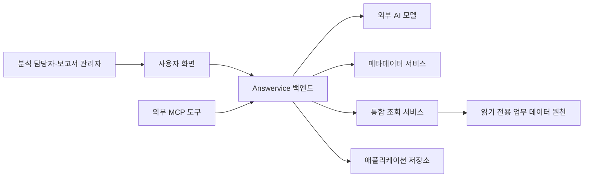
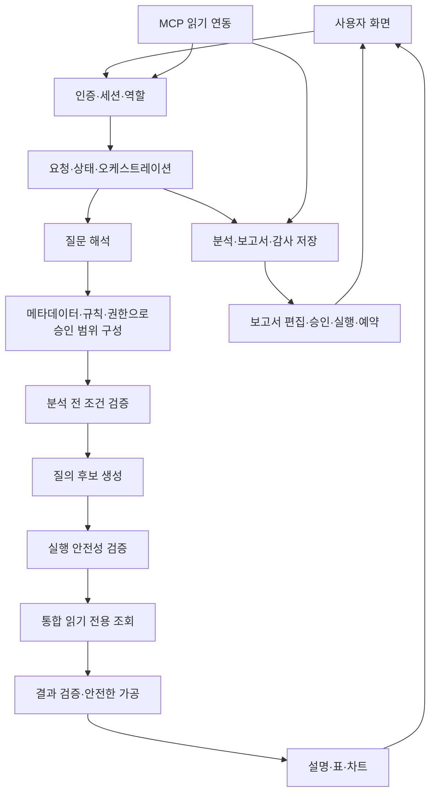
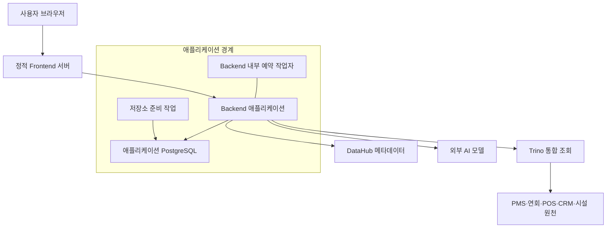
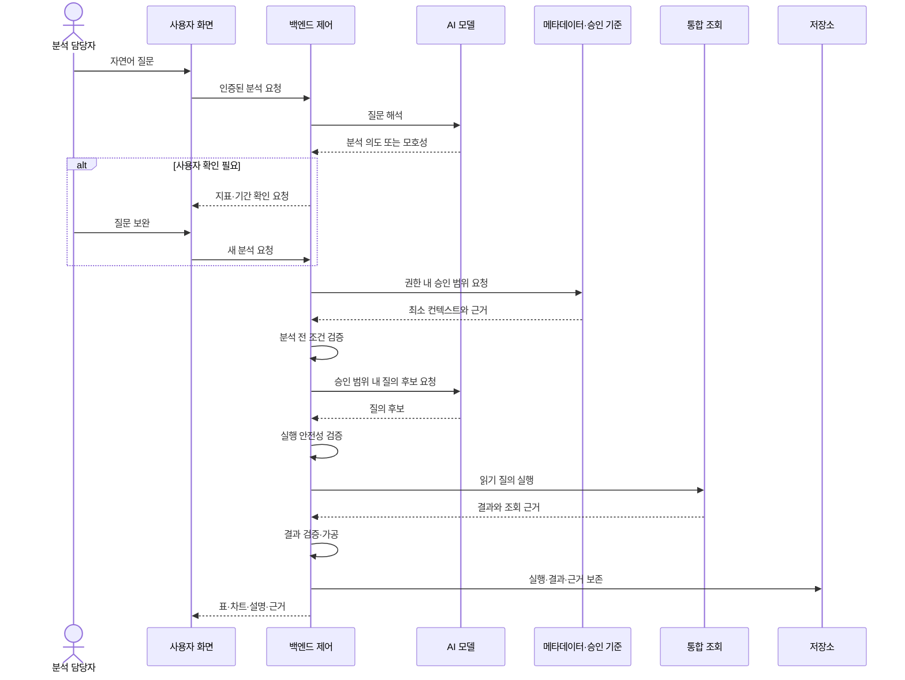
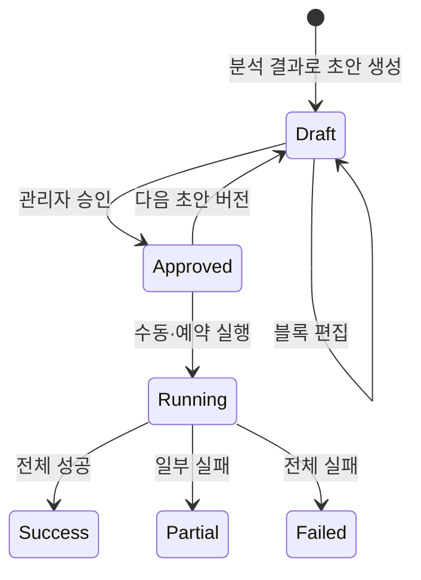
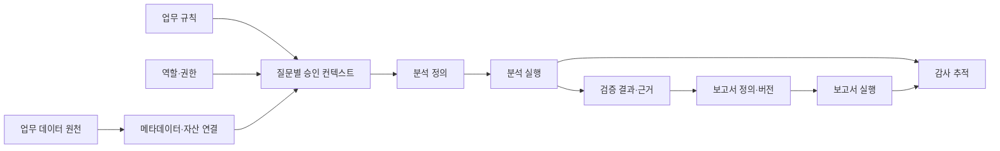

# Answervice 시스템 아키텍처

## 1. 문서 개요

| 항목 | 내용 |
|---|---|
| 목적 | 시스템 전체 구조, 구성요소 책임, 서비스 연결·데이터 흐름과 설계 이유를 설명한다. |
| 대상 독자 | 기획자, 개발자, 데이터·운영·테스트 담당자 |
| 기준일 | 2026-08-14 KST |
| 판단 기준 | 실행 코드·배포 설정과 승인된 E2E 기준 문서 |

이 문서는 저장소에서 확인되는 실행 구조를 기준으로 하며, 운영 확장이 필요한 영역은 별도로 구분한다.

상세 API, 요청·응답 형식, DB 테이블·컬럼, 클래스·함수, 환경값, 마이그레이션과 테스트 케이스는 별도 기술 문서에서 관리한다.

## 2. 아키텍처 목표와 설계 원칙

| 원칙 | 적용 이유 |
|---|---|
| AI와 통제 책임 분리 | AI는 해석·생성·설명을 돕지만 권한과 실행 허용 여부를 결정하지 않는다. |
| 질문별 최소 승인 범위 | 전체 데이터 사전 대신 현재 질문과 역할에 필요한 데이터·규칙만 사용한다. |
| 세 단계 검증 | 분석 조건, 실행 안전성, 결과 공개 가능성을 서로 다른 경계에서 확인한다. |
| 읽기 전용과 최소 권한 | 업무 원천 변경을 막고 권한 밖 데이터를 모델 입력 전부터 제외한다. |
| 실패 시 안전한 종료 | 모호함·권한·계약·조회·검증 실패를 성공 결과로 대체하지 않는다. |
| 실행과 근거 보존 | 분석 정의, 개별 실행, 결과와 감사 근거를 분리해 재현성과 이력을 유지한다. |
| 제한된 확장 | 예약 보고서와 MCP는 기존 권한·저장·감사 경계를 재사용한다. |

핵심 순서는 “승인 범위 구성 → 분석 전 조건 검증 → 질의 후보 생성 → 실행 안전성 검증 → 읽기 전용 조회 → 결과 검증”이다.

## 3. 시스템 컨텍스트

Answervice는 사용자의 질문과 보고서 작업을 받아 외부 AI, 메타데이터와 통합 조회 서비스를 연결하고 제품 상태와 실행 근거를 애플리케이션 저장소에 보존한다. 호텔·리조트 데이터는 합성 검증 데이터이며 제품 자체는 범용 기업 내부 분석 서비스다.

브라우저와 외부 도구는 업무 원천이나 AI 모델에 직접 연결하지 않는다. 백엔드가 인증, 승인 범위, 실행·결과 검증과 저장을 통제하는 신뢰 경계다.

## 4. 논리 아키텍처

| 구성요소 | 핵심 책임 | 주요 입력·출력 | 책임이 아닌 것 |
|---|---|---|---|
| 사용자 화면 | 질문, 확인, 결과·근거와 보고서 작업 제공 | 사용자 입력 ↔ 제품 상태 | 권한 판정, 데이터 직접 조회 |
| 인증·접근 통제 | 세션 유효성, 역할과 소유권 확인 | 인증정보 → 인증 주체·역할 | 브라우저가 주장한 역할 신뢰 |
| 제어·오케스트레이션 | 단계 순서, 취소·실패·최종 상태 관리 | 분석 요청 → 명시 상태 | AI 출력의 무검증 전달 |
| 질문 해석 | 자연어를 업무 분석 의도로 구조화하고 모호함 표시 | 질문 → 분석 의도·확인 요청 | 지표 규칙·권한 확정 |
| 승인 범위 구성 | 권한 안의 메타데이터·자산 연결·업무 규칙을 최소화 | 분석 의도·역할 → 승인 컨텍스트 | 전체 카탈로그 공개 |
| 분석·실행·결과 검증 | 조건 완전성, 읽기 정책과 공개 가능성 판단 | 컨텍스트·질의·결과 → 통과·차단 | 모델의 자기 합격 판정 신뢰 |
| 통합 조회 | 이기종 원천을 읽기 전용으로 교차 조회 | 검증 질의 → 원시 결과·조회 근거 | 업무 규칙 정의와 결과 설명 |
| 결과 표현 | 검증된 값으로 설명·표·차트 구성 | 안전한 결과 → 사용자 표현 | 새 수치나 인과관계 창작 |
| 애플리케이션 저장 | 분석·보고서·감사 상태와 근거 보존 | 실행 상태·결과 → 재조회 자산 | 업무 원천 데이터 복제 |
| 보고서·외부 연동 | 분석 자산의 보고서 재사용과 제한된 외부 조회 | 검증 자산 → 보고서·읽기 결과 | 임의 쓰기와 자동 승인 |

## 5. 배포 아키텍처

기본 배포는 Docker Compose 기반 데모 환경이다. Kubernetes, 관리형 클라우드, 운영 로드밸런서와 다중 인스턴스 조정은 기본 범위에 포함하지 않는다.

### 실행 단위와 신뢰 경계

- React 기반 프런트엔드는 정적 빌드 후 Nginx가 제공한다.
- FastAPI 백엔드는 인증, 분석, 보고서와 MCP 기능을 함께 제공한다.
- 애플리케이션 PostgreSQL 준비 작업은 백엔드 시작 전에 별도 실행된다.
- 예약 작업자는 별도 서비스가 아니라 백엔드 안의 단일 프로세스 작업자다.
- Trino는 다섯 논리 원천을 조회 시점에 연결하고 원천별 읽기 계정을 사용한다.
- DataHub는 별도 메타데이터 구성요소와 실행되며 운영 배포에서는 서비스 간 인증이 필요하다.
- AI 모델은 Compose 외부의 OpenAI 호환 서비스에 의존한다.

### 시작과 준비 상태

업무 원천·애플리케이션 저장소 → Trino와 분석용 뷰 → DataHub → 저장소 준비 → 백엔드와 예약 작업자 → 프런트엔드 순으로 준비된다. 백엔드는 저장소, 승인 기준, Trino, DataHub, AI 모델과 예약 작업자의 상태를 확인한다.

## 6. 핵심 연결과 데이터 흐름

### 6.1 인증과 권한

사용자가 로그인하면 서버가 서명 세션을 발급하고 브라우저는 보호된 쿠키로 유지한다. 서버는 매 요청에서 세션의 유효기간·폐기 상태와 역할을 다시 확인한다. 화면의 메뉴 제한은 보안 경계가 아니며 백엔드 판단이 최종이다.

분석 담당자와 보고서 관리자의 권한은 서버에서 분리한다. 보고서 승인·실행·예약은 화면 표시와 관계없이 인증된 관리자 역할에만 허용한다.

### 6.2 자연어 분석

모호함, 권한 부족, 정책 위반, 조회·검증·저장 실패가 발생하면 후속 단계나 결과 공개를 중단한다.

### 6.3 분석 저장·재실행

서버는 검증된 분석의 목적과 조건을 정의로 저장한다. 재실행은 과거 질의를 그대로 반복하지 않고 현재 권한·메타데이터·업무 규칙과 세 검증 경계를 다시 적용해 새 실행을 만든다. 과거 실행과 결과는 덮어쓰지 않는다.

### 6.4 보고서

검증되고 소유권이 확인된 분석 결과만 보고서 초안으로 전환한다. 승인 버전은 변경하지 않고 추가 편집은 새 초안 버전에서 수행한다. 실행은 블록별 결과를 저장해 전체 성공·일부 성공·실패를 구분한다.

### 6.5 예약 보고서

승인 보고서와 일정은 저장소에 보존된다. 백엔드 내부 작업자가 실행 시각이 된 일정을 확인하고 수동 실행과 같은 원칙으로 처리하며 동일 예약 시각의 중복을 막고 다음 시각을 갱신한다. 기본 구성은 단일 백엔드 프로세스를 전제로 한다.

### 6.6 보고서 작성 지원

검증된 분석 결과와 사용자 지시로 편집 가능한 초안을 제안한다. 모델은 자동 승인하거나 원본 값을 변경하지 않는다.

### 6.7 MCP 읽기 전용 연동

외부 도구는 인증, 분석 담당자 역할, 도구 활성 상태와 실행 소유권을 통과해야 한다. 본인 실행 조회만 허용하고 쓰기·소유권 변경·미등록 도구는 거부하며 호출 근거를 남긴다. MVP 범위는 P1 최소 읽기 기능이다.

## 7. 개념 데이터 아키텍처

업무 원천은 중앙에 모두 복사하지 않고 Trino가 조회 시점에 연결한다. 메타데이터는 의미와 위치를 설명하고, 승인된 자산 연결과 업무 규칙이 실행 이름·지표·기간·조인 기준을 보완한다. 분석 정의는 재사용 가능한 의도, 분석 실행은 한 번의 시도, 결과·근거는 공개 값과 생성 경위를 나타낸다. 보고서는 검증된 결과를 참조한다.

## 8. 인증·권한·보안 아키텍처

1. 인증 계층이 계정과 세션의 유효성·폐기 상태를 확인한다.
2. 역할·소유권 계층이 분석 담당자, 보고서 관리자와 본인 자산 범위를 구분한다.
3. 승인 컨텍스트가 권한 밖 데이터와 규칙을 모델 입력 전에 제외한다.
4. 분석 전·실행 전·결과 공개 전 검증이 각 단계의 허용 여부를 결정한다.
5. Trino와 업무 원천의 읽기 계정이 데이터 변경을 한 번 더 제한한다.
6. 감사 영역은 결정과 사용 버전을 남기되 비밀값·과도한 개인정보·전체 민감 결과·모델 비공개 추론은 제외한다.

AI는 사용자 역할, 허용 자산, 실행·공개 또는 보고서 승인 여부를 결정하지 않는다. 제품 역할 모델은 기업 IAM·SSO와 서비스 간 인증을 대체하지 않으며 운영 환경에서 별도 통합해야 한다.

## 9. 장애 처리와 운영 구조

| 장애 경계 | 처리 원칙 | 사용자 상태 |
|---|---|---|
| 인증·권한 | 기능 진입 전 거부하고 민감 인증정보를 노출하지 않는다. | 인증 필요·권한 거부 |
| 질문·승인 범위 | 모호함은 확인 요청, 기준 부족은 조회 전 차단 | 사용자 확인·근거 부족 |
| AI 모델 | 계약 불일치나 장애 시 출력을 사용하지 않는다. | 실패 |
| 실행 정책 | 읽기·승인 범위 위반은 조회 전에 차단한다. | 안전 정책 차단 |
| 데이터 조회 | 시간 초과·취소·원천 장애를 성공으로 바꾸지 않는다. | 실패·취소 |
| 결과 검증·저장 | 검증 전 원시 결과를 공개하지 않고 저장 실패를 성공 확정하지 않는다. | 근거 부족·실패 |
| 보고서 | 블록별 실패를 보존해 일부 성공과 전체 실패를 구분한다. | 일부 성공·실패 |
| 예약·MCP | 중복 실행을 막고 권한·소유권 위반을 감사 근거와 함께 거부한다. | 실패·권한 거부 |

준비 상태는 저장소, 승인 기준, 메타데이터, 통합 조회, AI 모델과 예약 작업자의 사용 가능 여부를 구분해 제공한다.

## 10. 주요 기술 선택과 이유

| 기술·방식 | 적용 영역 | 선택 이유 | 제약 |
|---|---|---|---|
| React·Vite, Nginx | 사용자 화면·정적 배포 | 상태 중심 UI와 단순한 빌드·제공 | 화면과 서버 계약 동기화 필요 |
| FastAPI·Pydantic | 백엔드 제어 | 명시적 계약과 일관된 상태·오류 처리 | 한 프로세스에 여러 책임이 결합 |
| PostgreSQL·SQLAlchemy·Alembic | 애플리케이션 영속성 | 트랜잭션, 이력 보존과 스키마 진화 | 업무 원천 복제 용도로 사용하지 않음 |
| DataHub와 승인 자산 연결 | 메타데이터·실행 연결 | 여러 원천의 의미와 실행 이름·업무 규칙을 연결 | 메타데이터만으로 권한·규칙을 보장하지 못함 |
| Trino | 이기종 통합 조회 | 원천 중앙 복사 없이 교차 분석 | 원천 가용성·타입·조인 비용 영향 |
| OpenAI 호환 모델 경계 | 해석·질의 후보·설명·작성 지원 | 제공자를 어댑터 뒤에서 동일 계약으로 사용 | 외부 가용성·비용·계약 변화 의존 |
| 결정론적 질의 정책 검사 | 실행 안전성 | 승인 자산·필드·필터와 금지 구문을 제품 정책으로 확인 | 정책과 회귀 검증의 지속 관리 필요 |
| Docker Compose | 데모 통합 실행 | 애플리케이션·데이터 플랫폼·합성 원천 재현 | 고가용성·자동 확장·무중단 배포 미지원 |
| 블록·불변 버전 보고서 | 보고서 편집·실행 | 원본 근거, 승인본과 부분 실패 보존 | 대규모 분산 실행은 추가 설계 필요 |
| 제한된 MCP 도구 | 외부 연동 | 전체 권한을 열지 않고 작은 읽기 기능부터 검증 | 범용 분석·쓰기는 제외 |

## 11. 운영 확장 방향

| 영역 | 기본 구조 | 운영 확장 시 고려사항 |
|---|---|---|
| 인증·권한 | 제품 세션과 역할 기반 접근 | 기업 IAM·SSO, 조직·속성 권한, 서비스 인증 연동 |
| 분석 통제 | 승인 컨텍스트와 세 단계 검증 | 정책 변경 승인, 구문 구조 기반 검증과 보안 회귀 강화 |
| 데이터 조회 | Trino 기반 읽기 전용 연합 조회 | 원천별 용량·지연 관리와 장애 격리 |
| 분석·보고서 저장 | PostgreSQL 기반 이력·근거 보존 | 보존·삭제·백업·복구 정책 확정 |
| 예약 실행 | 백엔드 내부 단일 프로세스 작업자 | 다중 인스턴스 조정 또는 작업 큐 분리 |
| 외부 연동 | 제한된 MCP 읽기 기능 | 도구별 권한 심사와 범위 확대 통제 |
| 배포·운영 | Docker Compose 기반 데모 환경 | 고가용성, 관측, 무중단 배포와 부하 검증 |

## 12. 제약사항과 위험

- 합성 데이터는 실제 기업의 데이터 분포·품질·민감도와 운영 조건을 대표하지 못한다.
- 승인되지 않은 지표·데이터·연결 규칙은 분석할 수 없다.
- 외부 AI, DataHub, Trino와 업무 원천 장애가 분석에 영향을 준다.
- 메타데이터와 업무 규칙이 어긋나면 분석이 차단되거나 신뢰 경계가 약해질 수 있다.
- 질의 정책은 구문 변형 대응을 위한 보안 회귀 검증이 필요하다.
- 제품 역할 모델은 실제 기업 인증·권한 체계를 대체하지 못한다.
- 단일 백엔드·Compose 구조는 다중 인스턴스, 고가용성과 무중단 운영을 제공하지 않는다.
- 장시간·대규모 부하, 백업 복원과 외부 운영 배포가 검증되지 않았다.

RAG와 ML-as-a-Tool은 제품 런타임 범위에 포함하지 않는다.

## 13. 상세 문서와 책임 경계

| 상세 영역 | 문서 |
|---|---|
| 제품 목적·범위·사용 방식 | [기획서](00_기획서.md) |
| 제품 요구사항과 완료 판정 | [PRD](01_PRD.md) |
| 사용자 목적별 흐름 | [유저 플로우](02_유저플로우.md) |
| E2E 기준 구조와 내부 계약 | [E2E 아키텍처 및 계약](e2e_mvp/derived/03_E2E_아키텍처_및_계약.md) |
| 문서 읽기 순서 | [E2E README](e2e_mvp/README.md) |
API 명세, 데이터 모델·컬럼, 화면 설계, 오류 코드, 운영 명령·환경 설정, 테스트 케이스, 모델 평가와 WBS는 각각의 별도 설계·운영·테스트·프로젝트 관리 문서에서 관리한다.
