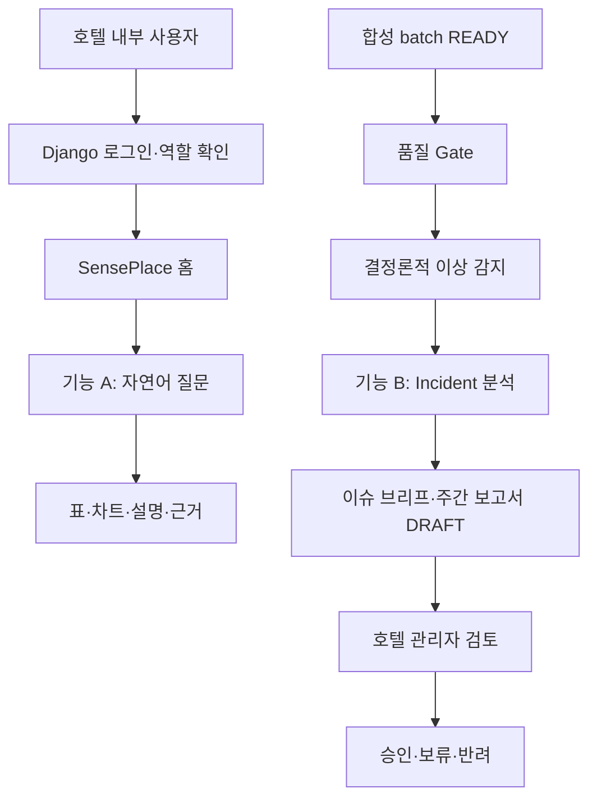
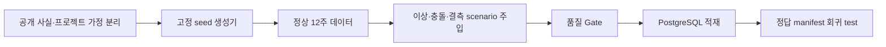

# 프로젝트 기획서 — 호텔 VOC·운영 이슈 분석 Agent (v2.4)

**SK네트웍스 Family AI 캠프 29기 3팀** · 그랜드 워커힐 서울 적용 가능성 검증 PoC

| 항목 | 내용 |
|---|---|
| 산출물 단계 | 기획·팀 검토 |
| 제출 일자 | 2026-07-24 |
| 프로젝트 기간 | 2026-07-10 ~ 2026-09-03 (8주) |
| 작성 팀원 | 박준희(PM) · 송민지 · 김재홍 · 정승 · 윤대성(파랑새) |
| 공식 서비스명 | **SensePlace** |
| 대상 | 그랜드 워커힐 서울 단일 호텔을 모델링한 합성 데이터 PoC |
| 1차 사용자 | 호텔 관리자 |
| 데모 역할 | F&B 관리자 · 객실 관리자(실제 조직·권한이 아닌 권한 차이 검증용) |
| 데이터 원칙 | 기업 내부 시스템·실제 내부 데이터 미사용 · 운영 데이터와 VOC 전량 합성 |
| 중간발표 | 2026-08-06 · 백엔드·DB·LLM을 연결하지 않은 프론트엔드 목업 |
| 기능 Baseline Gate | 2026-08-13 ~ 08-14 · 미통과 시 08-18까지 보완 후 확장 중단 여부 판단 |
| 현재 구현 상태 | 기획·설계 단계 · 실행 코드와 기술 통합은 검증 전 |
| 최신 통합 기준 | `SensePlace_기획서_초안.md` (2026-07-20) |
| 문서 기준일 | 2026-07-20 · v3.0 |

> 이 문서는 `SensePlace_기획서_초안.md`의 제품 방향을 프로젝트 기획서 양식에 맞춰 요약한다. 요구사항 ID·수용 기준은 `01_요구사항정의서.md`, 담당·일정·상태는 `02_WBS.md`에서 같은 기준으로 관리한다.

<details>
<summary>기준 문서와 적용 원칙</summary>

- 최신 제품·Baseline 방향: `docs/markdown/SensePlace_기획서_초안.md`
- 요구사항 ID·수용 기준: `docs/markdown/01_요구사항정의서.md`
- 일정·담당·상태: `docs/markdown/02_WBS.md`
- 공식 산출물 일정: `docs/markdown/final_project/최종_프로젝트_산출물_및_전체_일정.md`
- 기존 P0 통제 문서: `docs/markdown/final_project/00_project_control.md`, `docs/markdown/final_project/common_project_specification.md`

제품·기능·데이터·아키텍처·Gate는 `SensePlace_기획서_초안.md`를 우선한다. 기존 P0 통제 문서는 변경 이력과 세부 계약 참고로만 사용하며 `final_project/` 보호 파일은 수정하지 않는다. 화면설계서는 이번 동기화 범위에서 제외한다.

</details>

<details>
<summary>변경 이력</summary>

| 버전 | 기준일 | 주요 변경 |
|---|---|---|
| v3.0 | 2026-07-20 | 최신 SensePlace 초안의 2개 서비스 경로, Django·FastAPI 경계, 전량 합성 데이터, Baseline Gate·실험 분리·실데이터 파일럿 제안을 7개 공식 목차에 통합 |
| v2.4 | 2026-07-20 | 요구사항 정의서와 WBS 중심의 기준 문서 관계 정리 |
| v2.2 | 2026-07-20 | 27기 프로젝트 기획서 양식의 7개 목차와 동일한 제목·순서·계층으로 재구성 |

</details>

## 1. 프로젝트 주제

### 1.1 한 줄 정의

그랜드 워커힐 서울을 모델링한 합성 운영 데이터와 합성 VOC를 이용해, 호텔 관리자가 자연어로 운영 현황을 조회하고 시스템이 이상징후를 먼저 감지하여 **근거가 연결된 이슈 브리프와 주간 운영 보고서 초안**을 제공하는 내부 의사결정 지원 플랫폼을 구현한다.

### 1.2 프로젝트 전제와 표현 경계

- 기업 내부 PMS·POS·CRM·근태·VOC 시스템과 실제 내부 데이터에는 접근하지 않는다.
- 실제 호텔의 운영 문제, 인력 부족, VOC 증가, 도입 효과를 주장하지 않는다.
- 합성 데이터에서 함께 변한 지표는 원인이 아니라 확인이 필요한 후보로만 표현한다.
- 모든 화면·API·보고서에 `SYNTHETIC DEMO DATA`와 데이터·스키마·생성기 버전을 표시한다.
- 실제 호텔 조직명과 권한을 안다고 가정하지 않으며 역할은 데모 정책으로만 정의한다.

### 1.3 사용자와 시스템 경계

| 구분 | 역할 | 시스템 안의 완료 결과 |
|---|---|---|
| 호텔 관리자 | 전체 합성 운영 현황·이슈·보고서 검토 | 보고서 승인·보류·반려 결정 |
| F&B 관리자 | 조식 운영·인력·VOC 범위 질의·이슈 확인 | 허용 범위의 분석 결과와 근거 확인 |
| 객실 관리자 | 객실 집계·객실 VOC·제한된 조식 수요 확인 | 권한 범위 결과 확인 또는 거부 확인 |
| 시스템 밖 | 본사 경영진·실제 운영 담당자 | 본사 전송·실제 조치·성과 판단은 수동 업무 |

최종 시스템 종료 지점은 호텔 관리자의 승인·보류·반려다. 고객 메시지, 보상, 인력 배치, 티켓 생성과 본사 전송은 자동 실행하지 않는다.

### 1.4 목표

1. 고정 seed와 버전이 있는 합성 데이터로 정상·이상·충돌·결측 상황을 재현한다.
2. 역할별 허용 범위를 서버에서 강제하는 자연어 분석을 제공한다.
3. 데이터 품질 Gate 이후 결정론적 규칙으로 이상징후를 감지한다.
4. 운영지표와 VOC의 관측 사실·원인 후보·반대 근거·부족한 데이터를 구분한다.
5. 수치는 SQL·Python·규칙으로 계산하고 LLM은 근거 기반 서술에만 사용한다.
6. 주간 보고서 초안과 버전·승인 이력을 연결하고 실패 시 성공한 수치 결과를 보존한다.

### 1.5 비목표

- 실제 PMS·POS·CRM·근태·VOC 연동과 실제 온라인 리뷰 수집
- 실제 고객·직원 개인 데이터, 실시간 스트리밍과 다호텔 비교
- 완전 자유형 BI와 운영 조치 자동 실행
- 본사 계정·자동 전송과 고객 대상 챗봇
- GraphDB·GraphRAG·정식 OWL ontology·장기 memory·Agent swarm의 Baseline 의존성화
- 수요·매출·이탈 예측과 실제 비용 절감 효과 확정

### 1.6 단계와 일정

| 단계 | 기간 | 목표 | 데이터·연결 수준 | 완료 판단 |
|---|---|---|---|---|
| 계약·데이터·골격 선행 | 07/21~08/05 | API 응답 schema, 합성 schema, 권한표, 정답 manifest, metric catalog 동결 | 기능 연결 전 코드 골격·합성 데이터 | 계약 검토와 데이터 품질 Gate |
| 중간발표 데모 | 08/06 | 두 핵심 사용자 경로 설명 | 프론트엔드 fixture만 사용, 백엔드·DB·LLM 미연결 | 목업임을 고지하고 흐름이 끊김 없이 이해됨 |
| 기능 Baseline | 08/07~08/14 | 기능 A·B를 실제 합성 DB와 서비스에 연결 | Django, FastAPI, PostgreSQL, LLM 연동 | 완료 조건과 반례 16건 통과 |
| 검토·실험·선택 확장 | 08/17~09/02 | 피드백, 모델 실험, 승인된 확장, 회귀·안정화 | 실행 경로와 실험 경로 분리 | Golden Path 연속 5회 재현 |
| 최종발표 | 09/03 | 연결된 Baseline과 선택 확장 시연 | 실제 실행 결과 + fallback 자료 | 범위·수치·버전 일치 |

기능 Baseline Gate는 08/13~08/14에 실시한다. 미통과 시 08/18까지 Baseline만 보완하고, 이후에도 통과하지 못하면 기능 확장을 중단하며 독립 실험 보고서와 핵심 시연 안정화에 집중한다.

### 1.7 Baseline 핵심 기능

| 기능 | 시작 | 처리 | 종료 |
|---|---|---|---|
| A. 권한 기반 대화형 분석 | 사용자의 자연어 질문 | 역할 scope 확인 → semantic query plan → SQL Guard → read-only 조회 → 표·차트·설명 | 기간·단위·표본·timezone·근거가 있는 결과 또는 안전한 거부 |
| B. 이상 감지·자동 분석·주간 보고 | 합성 batch `READY` | 품질 Gate → 규칙 감지 → Incident workflow → 근거·반대 근거 → 보고서 초안 | 호텔 관리자의 승인·보류·반려 |

### 1.8 완료 정의(DoD)

| 영역 | 완료 조건 |
|---|---|
| 기능 A | 실제 로그인·역할 적용, 보장 질문 8종 실행, SQL·권한·금지 재집계 차단, 표·차트·설명 수치 일치 |
| 기능 B | 품질 Gate 선행, 정상 무경보, 이상 이슈 1건 생성, 충돌 시 인과 확정 금지, 결측 `NEEDS_DATA`, 중복 실행 방지, LLM 실패 `PARTIAL`, 보고서 결정 저장 |
| 데이터 | `is_synthetic`, dataset/schema/generator version, scenario, seed, virtual date, cutoff 기록 |
| 신뢰성 | 같은 입력·규칙·버전에서 수치 재현, 생성 가정과 탐지 규칙 분리, 비가산 지표 재집계 차단 |
| 안전 | Django가 검증한 scope만 전달, FastAPI read-only 접근, PII·secret 노출 0건, 외부 쓰기·자동 조치 없음 |
| 근거 | AI 서술 문장은 `evidence_id`와 연결되고 근거 없는 주장은 차단 또는 `PARTIAL` 처리 |
| 진실성 | 모든 결과에 합성·DRAFT·한계 표시, 목업과 실제 연결 상태를 혼동시키는 표현 없음 |

### 1.9 확정 결정

| 항목 | 확정 기준 |
|---|---|
| 서비스명 | `SensePlace` |
| Baseline 기능 | 기능 A 권한 기반 대화형 분석 + 기능 B 이상 감지·자동 분석·주간 보고 |
| 기술 구조 | Django session·DRF + Django worker + 별도 FastAPI + PostgreSQL + 외부 LLM API |
| 역할 | `HOTEL_MANAGER`, `FNB_MANAGER`, `ROOMS_MANAGER` |
| 데이터 | Baseline·모델 실험 모두 전량 합성, 실제·공개 리뷰 corpus 미사용 |
| 질문·검증 | 보장 질문 8종, 반례 16건, Golden Path 연속 5회 |
| 일정 | Gate 08/13~08/14, 보완 한계 08/18, 통과 전 선택 확장 금지 |
| 실험 | ML/DL·VectorDB·sLLM·Agent 구성 비교는 공식 산출물용 독립 트랙이며 Baseline 실행 의존성에서 제외 |

## 2. 문제 정의

공개자료만으로는 그랜드 워커힐 서울의 실제 VOC 분산, 수작업 보고, 처리 지연이나 분석 병목을 확인할 수 없다. 따라서 아래는 제품 필요성을 확정하는 사실이 아니라 합성 데이터 PoC와 후속 실데이터 파일럿에서 검증하거나 기각할 가설이다.

| ID | 문제 가설 | 프로젝트 검증 | 기각·축소 조건 |
|---|---|---|---|
| H1 | 자연어로 필요한 운영지표를 안전하게 찾는 과정이 관리자 분석 부담을 줄일 수 있다. | 보장 질문 성공률, 권한 차단, 결과 수치 일치 | 고정 대시보드가 더 정확하고 빠름 |
| H2 | 이상 감지 후 운영지표와 VOC 근거를 연결하면 확인 범위를 좁힐 수 있다. | 시나리오별 탐지·근거 연결·반례 통과 | 단순 규칙 리포트만으로 충분함 |
| H3 | 관측 사실·원인 후보·반대 근거를 분리하면 과잉 해석을 줄일 수 있다. | 금지 주장 차단, 담당자 수정·보류율 | 구분이 판단에 도움을 주지 않음 |
| H4 | 근거가 연결된 주간 초안이 보고 업무를 보조할 수 있다. | 수치 일치, 수정률, 승인·보류·반려 결과 | 수작업 대비 품질·시간 개선이 없음 |

### 2.1 주요 위험과 대응

| 위험 | 대응·Gate |
|---|---|
| 합성 결과를 실제 호텔 현황처럼 표현 | 모든 결과에 합성·가상 기준일 표시, 실제 문제·성과 주장 금지 |
| 생성 수식과 탐지 규칙의 자기검증 | 설정과 규칙을 분리하고 교차 리뷰, 정답 manifest를 런타임에서 차단 |
| VOC·운영 공통 키 또는 시간 정합성 부족 | 서비스 구역·기간·timezone 계약 검증 실패 시 `NEEDS_DATA` |
| LLM 환각과 수치 오류 | 수치 결정론 계산, 근거 ID 없는 문장 차단, 실패 시 `PARTIAL` |
| 권한 우회와 SQL 위험 | Django scope 원본, allowlist, parameter binding, read-only role, timeout·row limit |
| Django·FastAPI 이중 구조의 일정 위험 | 08/14 Gate에서 통합 복잡도 측정, 미통과 시 확장 포기와 범위 재결정 |
| 문서 간 범위 재확대 | 요구사항·WBS에서 Baseline·독립 실험·승인 후 확장·범위 밖을 구분하고 Gate 통과 전 확장 금지 |

## 3. 시장조사 및 BM 분석

### 3.1 기대 가치와 측정

| 가치 경로 | 제공 가치 | PoC 측정 항목 |
|---|---|---|
| 조회 | 권한 범위의 지표를 자연어로 탐색 | 보장 질문 성공률, SQL 차단률, 응답 수치 일치 |
| 탐지 | 정상·이상·결측을 재현 가능하게 구분 | 정답 manifest 대비 탐지 결과, 중복 실행 여부 |
| 진단 | 관측·지지·반대·부족 근거를 한 흐름에 연결 | 근거 적합률, 금지 주장 차단률, 검토자 수정률 |
| 보고 | 동일한 분석 이력으로 주간 초안 생성 | 보고서 수치 일치, 생성 성공·부분 성공, 결정 이력 |

매출 증가, 비용 절감과 실제 업무시간 단축은 본 PoC에서 산정하지 않는다. 실제 기준선과 비식별 데이터가 확보된 파일럿에서만 측정한다.

### 3.2 레퍼런스와 차별화

| 레퍼런스 | 참고 영역 | 이번 프로젝트의 초점 |
|---|---|---|
| Shiji ReviewPro | 호텔 리뷰·설문·운영 workflow | 합성 VOC와 운영지표를 동일 조건으로 연결 |
| TrustYou | 리뷰 통합·감성·주제 분석 | 한국어 VOC 구조화와 근거 문장 |
| Medallia | 역할별 CX 리포트와 closed-loop | 자동 실행 없는 검토·승인 경계 |
| Qualtrics | 경험·운영 데이터 연결 | 권한 기반 자연어 조회와 결정론적 분석 |

기존 서비스를 복제하지 않고 **합성 데이터 기반 호텔 운영 분석, 근거·반대 근거, 비확정 원인 후보, Human-in-the-loop**를 검증한다.

### 3.3 제공 형태와 실제 도입 제안

프로젝트 기간에는 단일 호텔용 내부 웹 PoC로 제공한다. 실제 도입은 다음 단계형 파일럿으로만 제안한다.

1. 비식별 표본 데이터로 schema·연결 키·집계 주기를 검증한다.
2. 실제 분포에 맞춰 임계값을 재보정하고 정밀도·오탐률을 측정한다.
3. 수작업 보고와 시스템 보조 보고의 시간·누락·수정률을 비교한다.

각 단계가 실패하면 효과를 주장하지 않고 범위를 축소하거나 중단한다. 상용화 방식과 가격은 실제 데이터 적합성·업무 효과·보안 비용을 확인한 뒤 검토한다.

## 4. 시스템 구성 기획

### 4.1 서비스 흐름



두 경로는 하나의 홈과 근거·보고서 이력에서 연결되지만 강제로 합치지 않는다. 기능 A는 질문 결과로 종료하고 기능 B는 호텔 관리자 결정으로 종료한다.

### 4.2 논리 아키텍처와 책임

| 계층 | 책임 | 금지 |
|---|---|---|
| Frontend | 역할 선택, 대화·차트·이슈·보고 검토 | 권한 최종 판단, 수치 계산 |
| Django + DRF | 외부 API, 인증·RBAC, scope 원본, job·report·decision·감사 이력 | 분석 view 직접 계산, LLM 판정 |
| Django worker | 비동기 실행·상태·retry·idempotency 관리 | 브라우저 직접 노출 |
| FastAPI | 품질 Gate·규칙 감지, query pipeline, Incident LangGraph, SQL Guard, 근거·설명 구성 | 로그인 원본, 승인 table 쓰기 |
| PostgreSQL | 합성 analytics view, run·evidence·report 저장 | LLM의 임의 직접 접근 |
| External LLM API | 근거 기반 질문 해석·설명·보고 문장 | 이상 판정, KPI 계산, 외부 시스템 쓰기 |

호출 방향은 `Client → Django → Worker → FastAPI → PostgreSQL/LLM`으로 고정한다. Browser는 FastAPI를 직접 호출하지 않고 FastAPI는 Django가 검증한 `scope_snapshot`만 신뢰한다.

### 4.3 Job·보고서 상태

```text
PENDING → RUNNING → SUCCEEDED
                  ↘ PARTIAL
                  ↘ NEEDS_DATA
                  ↘ FAILED
```

```text
DRAFT → APPROVED
      ↘ ON_HOLD → 새 DRAFT version
      ↘ REJECTED
```

사용자 요청은 `job_id`를 즉시 반환하고 UI가 Django를 polling한다. retry는 `idempotency_key`가 있는 요청에만 허용하며 승인된 보고서를 덮어쓰지 않는다.

### 4.4 중간발표 화면 계약

| 순서 | 화면 | 핵심 내용 |
|---:|---|---|
| 1 | 가상 로그인·역할 선택 | 호텔·F&B·객실 관리자, 합성·목업 고지 |
| 2 | 운영 홈 | 질의 진입, 합성 데이터 상태, 이상징후 카드 |
| 3 | 대화형 분석 | 질문, 목업 처리 단계, 표·차트·설명, 권한 범위 |
| 4 | 이상징후 상세 | 감지 지표·비교 기간·데이터 상태 |
| 5 | 이슈 브리프 | 관측 사실·원인 후보·반대 근거·추가 확인 |
| 6 | 주간 보고서 | DRAFT, 근거 ID, 한계, 승인·보류·반려 |

중간발표 fixture는 미리 동결한 JSON schema를 준수하고 `demo_mode=true`를 표시한다. 실제 backend·DB·LLM 연결 결과처럼 표현하지 않는다.

### 4.5 API 계약 요약

| 경계 | API | 기능 |
|---|---|---|
| Django 공개 | `POST /api/query-jobs` | 질문 job 생성 |
| Django 공개 | `GET /api/jobs/{job_id}` | job 상태·결과 polling |
| Django 공개 | `GET /api/incidents`, `GET /api/incidents/{run_id}` | 이슈 목록·브리프·근거 |
| Django 공개 | `GET /api/reports/{report_id}` | 보고서 version 조회 |
| Django 공개 | `POST /api/reports/{report_id}/decision` | 승인·보류·반려 저장 |
| FastAPI 내부 | `POST /internal/v1/quality-gates` | 결정론적 품질 검사 |
| FastAPI 내부 | `POST /internal/v1/detections` | 규칙 기반 감지 |
| FastAPI 내부 | `POST /internal/v1/query-runs` | Query workflow |
| FastAPI 내부 | `POST /internal/v1/incident-runs` | 조사·보고 초안 workflow |

모든 실행 context에는 `request_id`, `run_id`, `actor_id`, `role_code`, `scope_snapshot`, `dataset_version`, `virtual_as_of_date`를 포함한다.

### 4.6 Baseline과 실험·확장 경계

| 구분 | 범위 |
|---|---|
| Baseline 실행 경로 | semantic catalog, SQL Guard, 기능 A 명시적 pipeline, 기능 B LangGraph, 결정론적 품질·감지, 승인 workflow |
| 독립 실험 | ML/DL VOC 분류 비교, pgvector 유사 VOC 검색, sLLM 비교, 단일/다역할 Agent 비교 |
| 승인 후 확장 | Celery·Redis, MCP read-only adapter, RAG, 정식 ontology·GraphDB, 추가 시설·질문·이상 규칙 |
| 프로젝트 밖 | 실제 내부 시스템·실데이터·자동 조치·다호텔 상용 운영 |

실험 코드는 실행 경로가 의존하지 않도록 분리한다. 실험 실패가 Baseline 완료를 막지 않으며 실험 결과를 화면에 노출하면 참고 정보로만 표시한다.

## 5. 모델링 계획

### 5.1 실행 경로 모델링

| 영역 | 방식 | 검증 |
|---|---|---|
| 데이터 품질 | 결정론적 schema·정합 규칙 | 오류·결측 scenario별 `READY`/`NEEDS_DATA` |
| 이상 감지 | versioned rule, 실제 호텔 기준이 아닌 `PROJECT_CALIBRATION` 임계값 | 정상 무경보, 이상 trigger, 생성 규칙과 독립성 |
| 자연어 분석 | semantic query plan → allowlist SQL | 보장 의도 8종, 권한·범위·비가산 지표 차단 |
| 원인 후보 | 동기간 관측과 사전 정의 규칙 | 지지·반대·부족 근거 분리, 인과 표현 금지 |
| 보고서 | 결정론적 수치 + evidence 기반 LLM 서술 | 수치 일치, 근거 ID 연결, timeout fallback |

### 5.2 실험 트랙

| 실험 | 비교 | 실행 경로와의 관계 | 주요 지표 |
|---|---|---|---|
| VOC 분류 | TF-IDF+선형 모델 vs 한국어 사전학습 모델 | 런타임 판정에 미사용 | Macro F1, 클래스별 F1, 오류 유형 |
| 유사 VOC 검색 | pgvector 임베딩 검색 | 이슈 브리프 참고 섹션만 | Recall@K, 근거 적합률 |
| sLLM | API LLM과 동일 입력 비교 | 런타임 기본은 API LLM | 품질, 지연, 비용, 근거 준수 |
| Agent 구성 | 단일 구성 vs 계획·조사·작성 역할 | Baseline 논리 경로 재사용 | 정확성, 재현성, 지연, 실패율 |

### 5.3 반례 검증 범주

Baseline Gate에서는 정상, 운영·VOC 동시 이상, VOC만 이상, 운영만 이상, 핵심 결측, 권한 거부, SQL injection, 비가산 p90 재집계, 중복 batch, FastAPI timeout, LLM timeout·근거 외 주장, 승인 전 확정 노출과 목업 오인을 포함한 16개 반례를 검증한다. 세부 입력·기대 결과는 최신 초안의 §12.4를 기준으로 테스트 계약에 옮긴다.

## 6. 데이터 수집 전략

### 6.1 데이터 원칙

Baseline과 모델 실험 입력은 `synthetic_ops`와 `synthetic_voc`로 고정한다. 공개 자료는 호텔 범위와 도메인 용어를 참고하는 데만 사용하며 실제 호텔 운영 수치나 실제 VOC로 표현하지 않는다. 공개 리뷰 데이터셋과 실제 고객 데이터는 Baseline 및 모델 실험에 사용하지 않는다.

### 6.2 데이터 도메인

| 도메인 | 목적 | 제외 정보 |
|---|---|---|
| 객실 운영 | 조식 예상 수요의 상위 맥락 | 실제 요금·고객명·예약번호 |
| 조식 운영 | 도착·처리량·대기 이상 감지 | 실제 영업장명·결제 정보 |
| 조식 인력 | 운영지표와 함께 확인할 후보 근거 | 직원명·근태 사유·개인 평가 |
| VOC | 대기 이슈의 고객 관측 근거 | 실제 리뷰 원문·작성자·계정 |

Baseline 서비스 구역은 실제 시설명 대신 `GW_BREAKFAST_DEMO`를 사용한다. 매출·ADR·RevPAR·날씨·행사·온라인 crawling은 핵심 시나리오 통과 후 필요성을 확인한다.

### 6.3 생성·적재 흐름



탐지 규칙은 생성 수식을 참조하지 않고 관측 창과 비교 창의 통계만 사용한다. generator config와 rule은 분리하고 정답 manifest는 테스트 전용 경로에 두어 Agent가 접근하지 못하게 한다.

### 6.4 최소 데이터 계약

| 구분 | 핵심 테이블·항목 |
|---|---|
| metadata | `dataset_manifest`, `dim_date`, `dim_service_area` |
| facts | `fact_rooms_daily`, `fact_breakfast_15m`, `fact_breakfast_daily`, `fact_staff_shift`, `fact_voc` |
| platform | `metric_catalog`, `role_scope`, `query_run`, `analysis_run`, `evidence`, `report`, `report_decision` |

모든 timestamp는 UTC로 저장하고 Asia/Seoul로 표시한다. 결과에는 관측 창·비교 창·집계 단위·표본 수·timezone을 포함한다. p90 같은 비가산 지표는 15분 bucket 평균으로 재집계하지 않으며 허용 grain을 `metric_catalog`에서 제한한다.

### 6.5 공통 메타정보와 품질 Gate

필수 메타정보는 `is_synthetic`, `dataset_version`, `schema_version`, `generator_version`, `scenario_id`, `seed`, `virtual_as_of_date`, `data_cutoff`다.

품질 Gate는 다음을 검사한다.

1. 객실 재고·판매·투숙객·조식 대상 인원의 산술·범위 정합성
2. 15분 도착 합계와 일 합계, 대기·처리량·대기열의 비음수 조건
3. `occurred_at ≤ received_at`, PK 중복·FK 고아 0건
4. 필수 시간 bucket 누락 시 보간하지 않고 `NEEDS_DATA`
5. PII·secret과 실제 고객·직원 식별값 0건

### 6.6 필수 시나리오

| scenario | 기대 결과 |
|---|---|
| `NORMAL` | 이상징후 없음 |
| `BREAKFAST_CONGESTION` | 이상징후와 보고서 초안 생성 |
| `VOC_ONLY_SPIKE` | 근거 충돌, 원인 확정 금지 |
| `OPS_ONLY_SPIKE` | 운영 이상, VOC 근거 부족 표시 |
| `MISSING_DATA` | `NEEDS_DATA` |
| `ROLE_FORBIDDEN` | SQL 실행 전 거부 |
| `DUPLICATE_BATCH` | incident·report 각 1건 |
| `LLM_TIMEOUT` | 결정론적 수치 보존, `PARTIAL` |

## 7. 역할분담(R&R)

### 7.1 팀원별 역할

| 팀원 | 주 책임 | 본 기획 통합 후 우선 확인 |
|---|---|---|
| 박준희(PM) | 범위·기획, 의사결정 조율, 발표·시나리오 | SensePlace 범위와 Gate 통과 여부 승인 |
| 송민지 | 요구사항·WBS, 화면·UX, 화면 연동·통합 | 6개 목업 fixture와 기능 A/B 결과 흐름 준비 |
| 김재홍 | DB·백엔드, 운영 분석, Agent·서비스 통합 | Django·FastAPI 경계, worker·job·SQL Guard PoC |
| 정승 | 합성 데이터, 전처리, DB·품질·검증 | schema·seed·scenario·manifest와 품질 Gate 계약 |
| 윤대성(파랑새) | AI·NLP 모델, 평가, Agent·sLLM·안전 검토 | 근거 기반 서술 검증과 독립 실험 트랙 |

### 7.2 협업·승인 원칙

- 상세 담당·일정·현황은 `02_WBS.md`를 따른다.
- API·데이터·권한·상태 계약을 먼저 동결한 뒤 화면 fixture와 구현을 시작한다.
- 생성기와 탐지 규칙은 서로 다른 담당자가 교차 검토한다.
- Baseline Gate 통과 전에는 선택 확장을 실행 경로에 추가하지 않는다.
- 범위 변경 승인 시 요구사항·WBS·테스트 계약을 같은 변경 묶음으로 동기화한다. 화면설계서는 별도 요청 전까지 수정하지 않는다.
