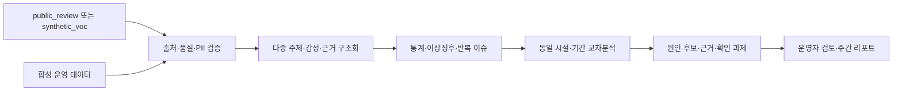

# 프로젝트 기획서 — 호텔 VOC·운영 이슈 분석 Agent (v2.4)

**SK네트웍스 Family AI 캠프 29기 3팀** · 서비스 가칭 **Hotel Signal AI** · 워커힐 적용 가능성 검증 PoC

| 항목 | 내용 |
|---|---|
| 산출물 단계 | 기획 |
| 제출 일자 | 2026-07-24 |
| 깃허브 경로 | `https://github.com/hijun318-eng/skn29_final_3team.git` |
| 프로젝트 기간 | 2026-07-10 ~ 2026-09-03 (8주) |
| 작성 팀원 | 박준희(PM) · 송민지 · 김재홍 · 정승 · 윤대성(파랑새) |
| 1차 사용자 | 고객경험·호텔 운영 담당자, 조식·F&B 팀장, 운영 총괄 |
| 1차 PoC 범위 | `01_요구사항정의서.md` 기준 조식 혼잡·대기 · 숙박·예약은 범위 변경 제안 |
| 데이터 원칙 | 워커힐 내부 데이터 미사용 · 공개 리뷰는 `public_review`로 구분 · 운영 데이터와 필요 시 VOC는 합성 |
| 현재 구현 상태 | 기획·설계 단계. `app/`, `src/`는 `.gitkeep`만 있으며 기술 스택과 통합 방식은 구현 검증 전 |
| 현재 일정 상태 | 2026-07-20 기준 기획서 갱신 후 팀 검토 단계 · 내부 검토 07/23 · 제출 07/24 |
| 문서 기준일 | 2026-07-20 · v2.4 |

> 요구사항·범위·수용 기준은 `docs/markdown/01_요구사항정의서.md`, 담당·일정·현황은 `docs/markdown/02_WBS.md`가 단일 기준이다. 이 문서는 방향과 의사결정 맥락을 설명하며 두 기준 문서를 임의로 대체하지 않는다.

기준 문서

- 요구사항: `docs/markdown/01_요구사항정의서.md`
- 일정·담당·상태: `docs/markdown/02_WBS.md`
- 범용 VOC Agent: `docs/markdown/voc/HOTEL_VOC_AI_AGENT.md`
- VOC-to-Action 개선안: `docs/markdown/voc/VOC_핵심개선사항_분석.md`
- 워커힐 기업·AI·데이터 범위: `docs/markdown/walkerhill/워커힐_기업분석.md`
- 워커힐 숙박·예약 범위: `docs/markdown/walkerhill/워커힐_기업분석_VOC관점.md`
- 공식 산출물 일정: `docs/markdown/final_project/최종_프로젝트_산출물_및_전체_일정.md`
- 과정 운영·공통 제약: `docs/markdown/final_project/최종_프로젝트_오프닝_자료_요약_3팀.md`
- 문서 사용 우선순위: `docs/문서관리규칙.md`

변경 이력

| 버전 | 기준일 | 주요 변경 |
|---|---|---|
| v2.4 | 2026-07-20 | 기준 문서 범위를 요구사항 정의서와 WBS 중심으로 정리 |
| v2.3 | 2026-07-20 | 파랑새 담당을 윤대성으로 반영하고 역할 관련 미결사항 삭제 |
| v2.2 | 2026-07-20 | 27기 프로젝트 기획서 양식의 7개 목차와 동일한 제목·순서·계층으로 재구성 |
| v2.1 | 2026-07-20 | 실명 R&R, 문제 가설, 워커힐·WISE 맥락, 데이터 사용 게이트, 기술 후보 상태, 범위 충돌, 안전·평가·DoD 최신화 |
| v2.0 | 2026-07-16 | 자율 분석 Agent 방향, 62개 요구사항, 8주 일정과 초기 기술 구성을 정리 |

## 1. 프로젝트 주제

### 1.1 한 줄 정의

호텔 VOC와 운영지표를 동일 시설·기간 기준으로 분석해 **이상징후, 원인 후보, 근거, 우선 확인 과제와 검토용 대응 옵션**을 제공하는 내부 운영자용 AI Agent를 구현한다.

### 1.2 워커힐 적용 맥락

- **확인된 사실:** 워커힐은 SK네트웍스의 호텔앤리조트 사업이며 숙박·식음·연회·레저·문화 등을 결합한 `All Around Destination`을 지향한다.
- **확인된 사실:** 고객용 `Walkerhill AI Guide`와 직원용 매출 조회·분석 서비스 `WISE`가 공개돼 있다.
- **해석:** 접점이 많은 복합 호텔에서는 같은 “대기”, “안내”, “예약” VOC도 시설·시간대·고객 여정에 따라 확인할 운영지표가 달라질 수 있다.
- **추가 확인 필요:** `WISE 2.0`의 실제 운영 범위, VOC 연계 여부와 기존 VOC 업무·도구는 공개자료만으로 확인되지 않는다.

따라서 본 프로젝트는 “워커힐에 VOC 문제가 있다”는 전제로 시작하지 않는다. 별도 구축, 기존 도구 도입, `WISE` 확장 중 어떤 방식이 적절한지는 실제 데이터 PoC와 현업 검증 후 판단한다.

### 1.3 목표

1. 출처가 확인된 `public_review` 또는 `synthetic_voc`와 합성 운영 데이터를 안전하게 적재하고 품질 상태를 표시한다.
2. VOC를 다중 주제·감성·근거 문장으로 구조화하고 반복 이슈·이상징후를 찾는다.
3. VOC와 운영지표를 동일 시설·기간 기준으로 비교해 재현 가능한 원인 후보와 확인 과제를 제시한다.
4. 자연어 질의와 이상징후 트리거를 통해 분석을 실행하고 근거 중심의 대시보드·주간 HTML 리포트를 제공한다.
5. AI가 원인이나 조치를 확정하지 않으며 운영자가 검토·수정·승인할 수 있게 한다.

### 1.4 비목표

- 워커힐의 실제 운영 문제나 인과관계 확정
- 고객 대상 FAQ·예약 챗봇 또는 `Walkerhill AI Guide` 대체
- 실제 PMS·POS·CRM·인력관리 시스템의 실시간 연동
- 보상·인력 배치·고객 메시지 등 운영 조치 자동 실행
- 직원 개인 감시·평가와 민감정보 기반 분석
- 네이티브 모바일 앱 개발(반응형 웹은 화면설계 범위에서 지원)
- 완전 자유형 BI, 상용 다중 호텔 운영, 자체 LLM 사전학습

### 1.5 사용자와 핵심 과업

| 사용자 | 핵심 질문 | 완료 결과 |
|---|---|---|
| 고객경험 담당자 | 어떤 VOC가 반복·증가했고 근거 리뷰는 무엇인가? | 주제·시설별 변화와 마스킹된 근거를 확인 |
| 호텔 운영 담당자 | VOC와 함께 변한 운영지표와 우선 확인 대상은 무엇인가? | 동일 조건의 수치, 원인 후보와 확인 과제를 검토 |
| 조식·F&B 팀장 | 담당 시설에서 어떤 대응 옵션을 검토해야 하는가? | 근거와 한계를 확인하고 외부 업무 절차에서 조치 여부 결정 |
| 운영 총괄·경영진 | 이번 주 위험 이슈와 우선순위는 무엇인가? | 주간 요약에서 상세 근거로 추적 |
| 시스템·데이터 관리자 | 입력 데이터와 분석 작업이 신뢰할 수 있는가? | 적재 오류, 출처, 버전, 작업 상태와 로그 확인 |

역할별 데이터 범위와 원문·다운로드 권한은 아직 확정되지 않았다. Core 시연에서는 최소 권한과 마스킹 원문을 기본으로 하고, 실제 역할 기반 접근제어 범위는 구현 전 승인한다.

### 1.6 추진 일정과 현재 상태

| 주차 | 기간 | 목표 | 마감 산출물 |
|---|---|---|---|
| 1주 | 07/10~07/16 | 기획·요구사항·데이터 착수 | 요구사항 정의서 · WBS |
| 2주 | 07/20~07/24 | 데이터 합성·수집·화면설계 | 프로젝트 기획서 · 수집 데이터 보고서 · 화면설계서 |
| 3주 | 07/27~07/31 | 전처리·DB·온톨로지 | DB/저장소 설계 문서 · 데이터 전처리 결과서 |
| 4주 | 08/03~08/07 | 분류·이상탐지·통계·중간발표 | 중간 발표 PT(08/06) · ML/DL 학습결과서·모델 · 벡터DB/GraphDB 구축 결과서 |
| 5주 | 08/10~08/14 | 교차분석·원인 후보·Agent·아키텍처 | AI 시스템 아키텍처 · LLM 활용 소프트웨어 · 자체 sLLM |
| 6주 | 08/18~08/21 | Agent·화면·리포트·구성도 | 멀티 에이전트 테스트 계획 및 결과 보고서 · 시스템 구성도 |
| 7주 | 08/24~08/28 | 웹앱 통합·서비스 테스트 | LLM 연동 웹 애플리케이션 · 서비스 테스트 계획 및 결과 보고서 |
| 8주 | 08/31~09/03 | 최종 발표·시연 | 최종 발표 PT · 프로젝트 개발 소스코드 · 시연영상 |

2026-07-20 기준 요구사항은 `검토`, WBS는 `완료`, 프로젝트 기획서는 본 갱신 후 `검토` 단계다. 화면설계와 데이터·개발환경 작업의 실제 진행 상태는 `02_WBS.md`에서 갱신한다. 중간발표는 08/06, 최종발표는 09/03이다.

### 1.7 완료 정의(DoD)

| 영역 | 완료 조건 |
|---|---|
| 데이터 | 출처와 사용 조건을 기록하고 모든 합성 데이터에 `synthetic`, seed, schema_version을 표시 |
| 핵심 흐름 | 승인된 대표 시나리오가 적재→분류→탐지→교차분석→근거→검토→리포트까지 연결 |
| 신뢰성 | 같은 입력·규칙·버전에서 수치가 재현되고 기간·단위·표본 수가 표시 |
| 안전 | 원인을 후보로만 표현하고 자동 조치가 없으며 PII·SQL 안전 검사 실패 시 분석 또는 도구 실행을 차단. prompt injection 방어는 요구사항 승인 시 별도 검사 |
| 개인정보 | 최소 수집·저장 전 비식별화와 역할별 데이터 범위 제한을 검증하고, 후순위 삭제·접근 로그 기능은 요구사항 승인 시 별도 수용 기준을 적용 |
| 근거 | 모든 주요 분석에 근거 수치·리뷰·규칙과 분석 한계를 제공 |
| Fallback | LLM·검색·일부 Agent 실패 시 성공한 통계 결과를 유지하고 실패 영역을 구분 |
| 평가 | 통합 동결 전에 분류·검색·이상탐지·SQL·Agent 라우팅·근거 적합성의 승인 임계값을 확정하고, 정답표·예외 평가를 통과하거나 예외 승인을 기록. 악성 입력 평가는 보안 요구사항 승인 시 포함 |
| 제품 | 요구사항 추적, 핵심 화면, HTML 리포트, 통합 테스트와 실행 가능한 배포본을 확인 |
| 산출물 | 발표·소스·시연·문서의 범위·수치·버전이 일치하고 21개 공식 산출물 일정에 맞게 제출 |

### 1.8 남은 결정 사항

1. 공개 리뷰의 실제 사용 출처·규모·기간·언어와 약관 검토 결과
2. 조식 대기 기본안을 유지할지 숙박·예약의 체크인 대기로 공식 변경할지
3. 기술 스택과 Django·FastAPI 분리 필요성
4. 로그인·RBAC·관리자 기능의 구현 깊이와 화면설계서 동기화
5. 자율 트리거 결과의 UI 진입점·알림 방식과 수동 분석 구분
6. 고정 질문 세트와 text-to-SQL 자유 질의의 경계·SQL 공개 수준
7. HTML·PDF 출력 및 반응형 웹 범위와 워커힐 브랜드 자산 사용 권한
8. 자체 sLLM 적용 범위, baseline 모델과 성공 기준
9. WISE·WISE 2.0의 VOC 기능과 별도 구축 필요성
10. 역할별 원문·다운로드 권한, 보존기간과 삭제 승인자
11. prompt injection 방어를 Core 보안 요구사항으로 추가할지

## 2. 문제 정의

공개자료로는 워커힐의 VOC 분산, 수작업 보고, 처리 지연이나 분석가 병목을 확인할 수 없다. 아래 내용은 구현을 정당화하는 확정 사실이 아니라 PoC에서 검증하거나 기각할 **문제 가설**이다.

| ID | 문제 가설 | 검증 방법 | 기각·축소 조건 |
|---|---|---|---|
| H1 | VOC와 운영지표를 시설·기간 기준으로 대조하는 데 반복 수작업이 필요하다. | 현업 인터뷰, 기존 보고서·업무 표본, 기준 소요시간 측정 | 기존 시스템이 같은 분석을 충분히 제공 |
| H2 | 반복 VOC와 이상징후를 조기에 찾기 어렵다. | 과거 표본 재생, 탐지 소요시간·재현율 비교 | 단순 규칙·기존 리포트로 충분히 탐지 |
| H3 | 원인 후보를 검토할 수치·원문 근거가 한 화면에 연결되지 않는다. | 담당자 과업 테스트, 근거 탐색 단계와 시간 측정 | 기존 화면에서 동일 근거를 더 효율적으로 제공 |
| H4 | 근거 기반 주간 브리핑이 운영 우선순위 검토에 도움이 된다. | 작성시간, 담당자 채택·수정률, 근거 적합성 평가 | 채택률이 낮거나 보고 업무를 줄이지 못함 |

**1차 사용자는 내부 운영자이며 최종 수혜자는 고객**이다. 가설이 기각되거나 기존 서비스와 중복되면 신규 구축 범위를 줄이거나 중단한다.

### 2.1 주요 리스크와 의사결정 게이트

| 리스크 | 대응과 결정 게이트 |
|---|---|
| 워커힐 내부 문제를 사실처럼 주장 | 모든 산출물에서 사실·가설·합성 결과를 구분하고 현업 인터뷰 전 확정 표현 금지 |
| 공개 리뷰의 약관·저작권·표본 품질 | 출처·약관·저장·삭제 검토를 통과한 데이터만 사용, 실패하면 합성 VOC로 전환 |
| VOC·운영 데이터 공통 키 부족 | 시설·기간·주제 계약과 노출량 분모가 없으면 원인 후보 생성을 차단 |
| `AI Guide`·`WISE`·상용 제품과 중복 | WISE 기능 확인 후 별도 구축·확장 모듈·상용 도입을 같은 기준으로 비교 |
| 기술 스택과 범위 과대 | WBS 1.7 기술 PoC 후 구조 확정, Must 흐름 우선, Should/Could 단계적 적용 |
| LLM 환각·수치 오류 | 수치는 결정론적 계산, 원문·규칙·기간·버전 표시, Fallback·회귀 테스트 |
| 개인정보·편향 | Core는 마스킹·역할별 데이터 제한을 적용하고, 연쇄 삭제·접근 로그·집단별 성능 평가는 요구사항 승인 후 후순위로 구현 |
| 문서 간 범위·ID 불일치 | `01`을 요구사항 기준으로 사용하고 WBS·기획서·관련 작업 문서의 범위와 ID를 함께 동기화 |

## 3. 시장조사 및 BM 분석

### 3.1 기대 가치

| 가치 경로 | 제공 가치 | PoC 측정 항목 |
|---|---|---|
| 탐지 | 증가·반복 VOC와 운영 이상을 빠르게 발견 | 탐지 소요시간, 유효 이슈 재현율 |
| 진단 | 수치·기간·원문을 함께 제공해 확인 과제를 좁힘 | 근거 적합률, 담당자 수정률 |
| 보고 | 동일 분석 이력으로 주간 브리핑 작성 | 보고서 작성시간, 채택률 |
| 품질 개선 | 분류·탐지 오류와 담당자 수정을 다음 평가에 반영 | 오류 유형, 수정률, 회귀평가 통과율 |

매출 증가나 비용 절감액은 공개자료와 합성 데이터만으로 산정하지 않는다. 실제 기준선과 비용이 확보된 뒤에만 비용편익을 계산한다.

### 3.2 레퍼런스 서비스와 차별화

| 레퍼런스 | 참고할 기능 | 이번 프로젝트의 초점 |
|---|---|---|
| Shiji ReviewPro | 호텔 리뷰·설문, 평판 대시보드, case 관리 | 호텔·시설·기간별 VOC 구조와 업무 흐름 |
| TrustYou | 리뷰 통합, 감성·주제 분석, 리뷰 응답 | 다중 주제와 근거 문장 중심 리뷰 구조화 |
| Medallia | 다채널 CX, 역할별 리포트, closed-loop 대응 | 이슈 전달·검토·상태·에스컬레이션 설계 |
| Qualtrics | 여정별 피드백과 운영·경험 데이터 연결 | VOC와 운영지표의 같은 기간 교차분석 |

기존 서비스를 복제하지 않고, **한국어 호텔 VOC + 운영지표 + 비확정 원인 후보 + 근거 + Human-in-the-loop**에 집중한다. 반대 근거 생성, 반복 이슈의 개선 백로그와 재발 추적은 요구사항 변경 승인 전 MVP에 추가하지 않는다.

## 4. 시스템 구성 기획

### 4.1 공식 요구사항 기준

- 정식 요구사항 62개: Must 40 · Should 14 · Could 8
- 현재 요구사항 문서상 MVP 포함: Must·Should 54개
- Could 8개는 후순위이며, 범위 변경은 `01_요구사항정의서.md`와 `02_WBS.md`를 함께 수정한 뒤 반영한다.
- 자체 sLLM은 공식 산출물 요구와 적용 적합성을 확인해야 하며, MCP 전달은 요구사항상 Should이지만 실행 WBS에서는 stretch로 관리한다.

### 4.2 핵심 처리 흐름

자연어 질문은 승인된 분석 의도 세트를 우선 사용하고, 범위 밖 질문은 임의로 답하지 않는다. 이상징후 트리거는 사용자 질의를 대체하는 전면 자율 실행이 아니라 승인된 조건에서 동일 분석 흐름을 시작하는 보조 진입점이다.

### 4.3 Core·후순위 경계

| 구분 | 범위 |
|---|---|
| Must·Core | CSV 검증·적재, 합성 메타 표시, VOC 분류·근거, KPI·이상징후, 교차분석, 원인 후보, 자연어 분석, 대시보드, 주간 HTML 리포트, 로그인·역할 데이터 제한, Fallback·재현성 검증 |
| Should·MVP 포함 | 분류 수정 이력, 자체 sLLM, 벡터 검색, 추천 질문, 설명가능성, 보안 환경관리, MCP 읽기·전달 등 `01`의 Should 14개 |
| Could·MVP 후순위 | 분류체계·컬럼 매핑 관리, 다운로드, 대용량 처리, 접근·작업 로그, 모델/API 상태, 편향성 점검과 PDF 출력 |
| Future·요구사항 외 | 실제 내부 시스템 연동, 자동 조치, 티켓·에스컬레이션, 반대 근거, 재발 추적, GraphRAG, 장기 메모리, 예측·시뮬레이션, 네이티브 앱, 다지점·다국어 운영 |

### 4.4 논리 구성과 기술 방향

| 계층 | 책임 | 문서상 선정 후보 | 현재 상태 |
|---|---|---|---|
| 사용자 화면 | 운영 브리핑, VOC·운영 분석, 근거 리뷰, 리포트 | React + Tremor | 구현 전 |
| 웹·권한 | 인증, 역할 권한, 관리자, API gateway | Django + DRF | 구현 전 |
| 분석 API | 분류·검색·Agent 실행, Fallback | FastAPI | 구현 전 |
| Agent | 질의 해석, 도구 라우팅, 조사·리포트 흐름 | LangGraph | 구현 전 |
| 데이터 | 정형 데이터, 분석 이력, 근거 검색 | PostgreSQL + pgvector | 구현 전 |
| 관측·평가 | 정답표 회귀평가, 실행 추적 | 결정론적 test + Langfuse 후보 | 구현 전 |

위 스택은 `01_요구사항정의서.md`와 WBS에 기록된 **선정 후보**다. 현재 저장소에는 실행 코드와 package·Python·Docker manifest가 없으므로 확정·구현 완료로 표현하지 않는다. WBS 1.7의 환경 PoC에서 팀 숙련도, 산출물 충족, 통합 복잡도, 테스트 가능성을 비교한 뒤 확정한다. Django와 FastAPI의 이중 백엔드도 효익보다 복잡도가 크면 단일 API 구조로 축소한다.

### 4.5 Agent와 안전 경계

- 도구 역할 후보: 데이터 품질 확인, VOC 분석, 운영 KPI 분석, 원인 후보 조합, 근거 검색, 리포트 생성
- 수치 계산은 SQL·Pandas·규칙이 담당하고 LLM은 분류·질의 해석·근거 기반 설명을 담당한다.
- LLM 실패 시 검증된 통계 결과는 유지하고 설명 영역만 실패로 표시한다.
- text-to-SQL은 허용 테이블·컬럼, read-only 계정, SQL AST 검사, 행 제한, timeout과 실행 로그를 적용한다.
- 최종 원인 판단과 운영 조치는 사용자가 담당하며 Agent는 외부 시스템에 쓰기 작업을 하지 않는다.

멀티 에이전트 수와 세부 역할은 아키텍처 산출물에서 확정하고, 라우팅·도구 실패·부분 성공·Fallback을 테스트한다.

**보안 요구사항 추가 제안:** 외부 리뷰와 VOC 원문을 명령이 아닌 비신뢰 데이터로 처리하고, 원문 속 지시가 system prompt·도구 권한·허용 작업을 변경하지 못하게 입력 경계·도구 allowlist·악성 입력 테스트를 적용한다. Core에 반영하려면 `01_요구사항정의서.md`와 WBS를 먼저 갱신한다.

### 4.6 대표 시나리오

현재 `01_요구사항정의서.md`는 조식 중심 MVP를 명시하지만 워커힐 VOC 관점 문서는 그랜드·비스타 숙박·예약으로 범위를 좁힌다. 공식 요구사항이 변경되기 전 기본 시나리오는 **조식 대기 증가와 이용객·근무 인원·대기시간 비교**로 유지한다. 체크인 대기 시나리오로 바꾸려면 요구사항·화면설계와 범위 문서를 함께 승인·동기화한다.

대표 흐름은 다음 조건을 만족해야 한다.

1. 승인된 시설·기간의 VOC와 운영 데이터가 적재된다.
2. 증가·반복 신호와 관련 운영지표가 결정론적으로 계산된다.
3. Agent가 원인 후보, 근거와 추가 확인 과제를 생성한다.
4. 사용자가 근거 리뷰·계산식·규칙·버전·한계를 확인한다.
5. 결과가 운영자 검토를 거쳐 주간 리포트에 반영된다.

정상 성공뿐 아니라 데이터 부족, 모호한 질문, 안전하지 않은 SQL, LLM 실패, 낮은 분류 신뢰도, 개인정보 마스킹 실패를 함께 시연·검증한다.

## 5. 모델링 계획

| 영역 | 계획 | 검증 기준 |
|---|---|---|
| 감성·주제 분류 | 규칙/기본 모델과 LLM 또는 sLLM 후보 비교, 다중 라벨과 근거 구간 저장 | Macro F1, 클래스별 F1, 긴급 VOC Recall, 근거 적합률 |
| 반복 이슈 | 임베딩·키워드·군집 후보 비교, 대표 VOC와 병합·분리 이력 검토 | Recall@K, cluster purity, 담당자 승인률 |
| 이상징후 | 최소 표본 조건을 둔 규칙·이동통계·비지도 방식 비교 | 과탐·누락, 탐지 지연, 재현성 |
| 교차분석 | 시설·기간·주제 매핑과 사전 정의 규칙으로 동시 변화 비교 | 계산 정답표, 공통 키 완전성, 분석 한계 표시 |
| 자연어 분석 | 보장 질문 세트 + 검증된 text-to-SQL 후보 | 질문 해석 정확도, SQL 성공률·안전성, 근거 연결률 |
| 리포트 | 결정론적 수치에 LLM 설명을 결합 | 수치 일치, 한계 포함, 담당자 수정률 |

평가 임계값은 데이터 규모와 baseline 측정 후, 모델·Agent 통합 동결 전에 팀 승인값으로 확정한다. `5초/30초`는 현재 목표값이며 측정 전 SLA로 약속하지 않는다.

## 6. 데이터 수집 전략

### 6.1 데이터 구성

| 데이터 구분 | 현재 상태 | 사용 조건 | 필수 메타정보 |
|---|---|---|---|
| `public_review` | 확보·사용 여부 검토 중 | 출처·약관·라이선스·수집 방법·삭제 정책·표본 품질 승인 | source, collected_at, period, language, license/terms |
| `synthetic_voc` | 공개 리뷰 사용이 어렵거나 한국어 평가셋이 부족할 때 생성 | 실제 내부 VOC처럼 표현 금지, 생성 규칙과 정답 라벨 보존 | `synthetic=true`, seed, schema_version, generator_version |
| `synthetic_ops` | 운영·인력·대기·점유 데이터를 합성 | 개인 식별값 금지, 의도한 관계·이상 구간과 정답표 기록 | `synthetic=true`, seed, schema_version, scenario_id |

공개 리뷰는 내부 VOC라고 부르지 않는다. Google Places API, Kaggle 등은 후보일 뿐이며 실제 사용 전 재배포·저장·삭제 조건을 확인한다. 공개·오픈데이터 사용 조건을 충족하지 못해 전량 합성 VOC로 전환할 경우 과정 제약 충족 여부를 별도로 승인받는다.

### 6.2 품질·개인정보 원칙

1. 원본·마스킹본·분석본을 분리하고 원문 접근을 최소화한다.
2. 개인정보 마스킹에 실패한 레코드는 분석·임베딩·다운로드를 차단한다.
3. 시설·기간·주제 공통 키, 노출량 분모, 결측·중복·시간대 정합성을 검증한다.
4. 학습·검증·테스트 데이터 누수를 막고 모델·규칙·프롬프트·스키마 버전을 기록한다.
5. Must인 역할별 데이터 범위 제한과 Should인 비밀정보 환경관리를 적용한다.
6. **후순위·요구사항 반영 필요:** 원문·파생 분석·임베딩 연쇄 삭제, 접근 로그, 보존기간·삭제 승인자와 언어·출처·시설별 편향성 평가는 `01`·WBS 승인 후 구현한다.

## 7. 역할분담(R&R)

### 7.1 팀원별 역할과 주요 WBS

| 팀원 | 주 책임 | 현재 주요 WBS |
|---|---|---|
| 박준희(PM) | 범위·기획, 의사결정 조율, 리포트 사전 검토, 발표·시나리오 | 1.2·1.3·1.5, 4.3, 6.6, 8.1·8.3 |
| 송민지 | 요구사항·WBS, 화면·UX, 화면 연동, 통합·발표 | 1.3~1.6, 4.1·4.2, 6.1·6.2·6.4·6.9 |
| 김재홍 | DB·백엔드, 운영 분석, Agent·연동·통합 | 1.7, 2.3·2.7~2.9, 5.2~5.7·5.9, 6.3·6.4·6.5·6.7·6.8·6.9·6.11 |
| 정승 | 공개·합성 데이터, 전처리, DB·품질·검증 | 1.7, 2.1~2.10 |
| 윤대성(파랑새) | 파랑새 운영, AI·NLP 모델, 평가, Agent·sLLM·안전 검토 | 2.2, 3.1~3.7, 5.4·5.6~5.8, 6.3·6.5·6.7·6.10 |

공동 통합·테스트·최종 제출의 상세 담당과 현황은 실행 WBS를 따른다.
