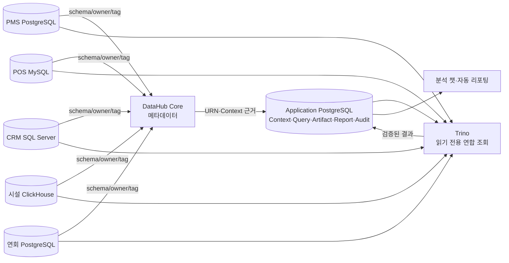
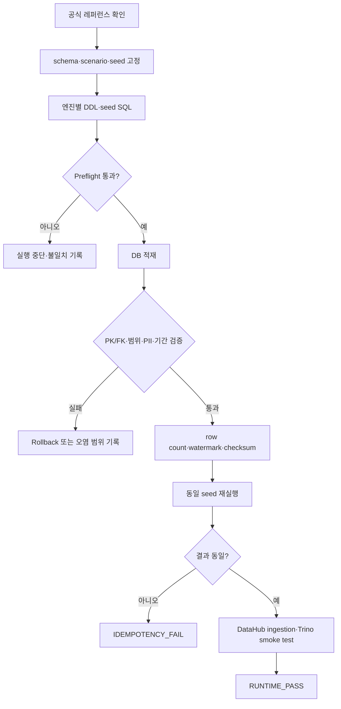

# Answervice 수집데이터보고서

| 항목 | 내용 |
|---|---|
| 문서 설명 | Answervice 합성 데이터의 수집 범위, 원천 시스템, 저장 구조와 검증 상태를 설명하는 작업본 |
| 문서 분류 | 산출물 작업본 |
| 버전 | v1.0 |
| 문서 기준일 | 2026-07-30 11:52 |
| 작성·수정 | 김재홍 |
| 산출물 번호 | 04 |
| 제출 일자 | — |
| 대응 템플릿 | `templates/[데이터 수집 및 저장] 수집 데이터 보고서_27기_0팀.docx` |

근거 문서: `04_수집데이터보고서_29기_3팀_v1.0_DB적재현행화.docx`, `05_데이터베이스저장소설계서_29기_3팀.xlsx`, `Answervice_기획서.md`

> 이 문서는 DOCX 내용을 그대로 복제한 것이 아니라, 핵심 판단을 빠르게 이해하도록 다시 정리한 설명본이다.

---

## /TL;DR

Answervice 데이터는 **실제 고객 데이터가 아니라 고정 seed로 만든 합성 데이터**다.

- 업무 데이터는 PMS, POS, CRM, 시설 운영, 연회·매출의 **5개 source DB**에 나누어 둔다.
- DB 엔진은 PostgreSQL, MySQL, SQL Server, ClickHouse의 **4종**이다.
- 질문·SQL 실행·근거·보고서·감사는 `hotel_datahub_app` PostgreSQL에 저장한다.
- 전체 설계는 **42개 물리 테이블, 571개 컬럼**이다.
- 관계 검증은 물리 FK 43건, 논리 참조 8건, 다형 참조 2건이며 대상·타입 오류는 0건이다.
- DataHub는 메타데이터를 수집하고, Trino는 여러 DB를 읽기 전용으로 조회한다.
- 현재 확인 가능한 것은 **설계와 정적 검증 PASS**다.
- 실제 DB의 row count·watermark·checksum 증거는 제공되지 않았으므로 **런타임 적재 완료라고 단정하지 않는다**.

---

## /ELI10

여섯 개의 서랍장이 있다고 생각하면 된다.

1. PMS 서랍에는 객실 예약과 투숙 자료가 있다.
2. POS 서랍에는 식음 매장의 주문과 결제 자료가 있다.
3. CRM 서랍에는 회원과 등급 이력이 있다.
4. 시설 서랍에는 시설 이벤트, 인력, 에너지 자료가 있다.
5. 연회 서랍에는 행사 예약과 매출 자료가 있다.
6. Application 서랍에는 “누가 어떤 질문을 했고, 어떤 자료로 답했고, 보고서가 어떻게 만들어졌는지”가 있다.

DataHub는 각 서랍의 **목록표와 설명서**를 만든다.

Trino는 승인된 경우 여러 서랍을 한 번에 읽는 **조회 창구**다.
Answervice는 그 결과를 표·차트·설명·보고서로 만든다.

중요한 점은 “서랍 설계도가 있다”와 “서랍에 실제로 물건을 넣어 확인했다”는 서로 다른 상태라는 것이다.

---

## /LISTIFY

### 1. 숫자로 보는 현재 구조

| 항목 | 값 |
|---|---:|
| 물리 테이블 | 42개 |
| 명세 컬럼 | 571개 |
| Application 테이블 | 24개 |
| 업무 source 테이블 | 18개 |
| source DB | 5개 |
| DB 엔진 | 4종 |
| 물리 FK | 43건 |
| 논리 참조 | 8건 |
| 다형 참조 | 2건 |
| 참조 대상·타입 오류 | 0건 |

### 2. 데이터베이스별 역할

| Database | DBMS | 테이블 | 역할 |
|---|---|---:|---|
| `hotel_datahub_app` | PostgreSQL | 24 | Context, 질문, SQL, artifact, 보고서, 감사, Reference |
| `hotel_pms` | PostgreSQL | 4 | 고객, 객실 공급, 예약, 투숙 |
| `hotel_pos` | MySQL | 4 | 매장, 시간대, 주문, 품목 |
| `hotel_crm` | SQL Server | 4 | 회원, 등급 이력, 포인트, 고객 map |
| `hotel_facility` | ClickHouse | 4 | 시설, 이벤트, 인력, 자원 |
| `hotel_banquet` | PostgreSQL | 2 | 연회 예약, 연회 매출 |

### 3. 고정 재현성 계약

```text
seed             = 20260728
schema_version   = schema-v4.6-websql
scenario_version = scenario-v4.6
fixture_version  = source-fixture-v4.6
property_id      = SYNTHETIC_HOTEL_001
generated_at     = 2026-07-28T05:00:00Z
timezone         = UTC 저장 / Asia/Seoul 업무 해석
```

---

## /VISUALIZE#1 데이터가 흐르는 구조



핵심 구분:

- DataHub: 무엇이 어디에 있고 무슨 뜻인지 관리
- Trino: 승인된 SQL로 실제 값을 읽음
- Application DB: 질문부터 보고서까지 실행 흔적 보존

---

## /VISUALIZE#2 적재와 검증 순서



---

## /SIMPLIFY

### 수집

공식 자료에서 숫자를 그대로 복사하는 방식이 아니다. 출처·공표일·모집단·주의사항을 기록하고, 합성 데이터의 약한 기준점으로만 사용한다.

### 생성

고정 seed와 버전으로 엔진별 SQL을 만든다. 같은 자연키와 seed를 사용하면 같은 결과가 나와야 한다.

### 저장

각 업무 source는 자기 DB에 저장한다. 질문·SQL·보고서는 Application DB에 저장한다.

### 검증

정적 검사, 실제 엔진 실행, 데이터 품질, 재실행 동일성, DataHub·Trino 활용을 차례로 검증한다.

### 활용

검증된 데이터만 분석 챗과 자동 리포팅에 사용한다. 질문, Context, SQL, 결과, 출처, 보고서 ID를 연결해 다시 확인할 수 있게 한다.

---

## /MUDA

### 제거한 낭비와 혼동

| 기존 문제 | 이번 현행화에서 제거한 방식 |
|---|---|
| VOC·조식 중심의 좁은 fixture 설명 | 5개 source·4종 엔진의 실제 프로젝트 구조로 교체 |
| JSONL·Parquet “적재 후보” 중심 | 물리 DB·DDL·seed·catalog 기준으로 변경 |
| 설계 PASS를 적재 PASS처럼 읽을 위험 | STATIC_PASS와 DB_EXECUTION_NOT_RUN 분리 |
| 모든 테이블을 본문에 장황하게 반복 | 본문은 도메인 요약, 부록은 42개 테이블 목록 |
| 외부 자료의 출처·기준일 불명확 | 공식 URL·공표일·확인일·사용 제한을 Reference로 관리 |
| 현재 등급과 과거 등급 혼용 | event-time 등급 이력으로 분리 |
| ClickHouse 관계를 일반 FK처럼 표기 | 논리 참조와 anti-join 검증으로 분리 |
| 비밀번호·접속 문자열을 DB에 보관 | Secret 원문이 아닌 `connection_ref`만 저장 |

### 아직 제거해야 할 낭비

- 실제 엔진 실행 없이 문서만 반복 생성하는 상태
- row count·watermark·checksum이 없는 “적재 완료” 주장
- 5개 source를 무조건 한 질문에 모두 JOIN하는 과도한 시연
- P2 Tool·RAG·ML을 P0 적재 검증보다 먼저 구현하는 일정 낭비

---

## 현재 판정

| 단계 | 상태 |
|---|---|
| 42개 테이블·571개 컬럼 명세 | 완료 |
| 물리·논리·다형 참조 검증 | PASS |
| 엔진별 source SQL 정적 검증 | PASS |
| 실제 DB DDL·seed 실행 | NOT_RUN 또는 증적 미확보 |
| source별 row count·watermark·checksum | 미확보 |
| 동일 seed 2차 실행 | 미확보 |
| DataHub 5개 ingestion | 미확보 |
| Trino 5개 catalog·교차 조회 | 미확보 |

따라서 현재 문서는 **DB 적재 구조 현행화본**이다. 최종 “적재 완료본”으로 승격하려면 런타임 증거를 붙여야 한다.

---

## 런타임 적재 후 반드시 추가할 표

| source | engine | 실행 ID | row count | max(source_updated_at) | checksum | 2차 재실행 | 판정 |
|---|---|---|---:|---|---|---|---|
| PMS | PostgreSQL |  |  |  |  |  |  |
| POS | MySQL |  |  |  |  |  |  |
| CRM | SQL Server |  |  |  |  |  |  |
| Facility | ClickHouse |  |  |  |  |  |  |
| Banquet | PostgreSQL |  |  |  |  |  |  |

---

## 공식 레퍼런스

| 구분 | URL | 적용 |
|---|---|---|
| DataHub ingestion source | https://docs.datahub.com/docs/generated/ingestion/sources/ | 4종 엔진 메타데이터 수집 확인 |
| Trino connector | https://trino.io/docs/current/connector.html | 5개 source 연합 조회 구조 |
| PostgreSQL | https://www.postgresql.org/docs/current/ | Application·PMS·연회 |
| MySQL | https://dev.mysql.com/doc/refman/8.4/en/ | POS |
| SQL Server | https://learn.microsoft.com/en-us/sql/sql-server/what-is-sql-server?view=sql-server-ver17 | CRM |
| ClickHouse | https://clickhouse.com/docs | 시설 운영 |
| SQLGlot | https://github.com/tobymao/sqlglot | Trino SQL AST 검증 |
| 한국관광 데이터랩 | https://datalab.visitkorea.or.kr/datalab/portal/getMetaInfoList.do | 수요·숙박 통계의 모집단·주의사항 |
| 문화체육관광부 | https://www.mcst.go.kr/site/s_policy/dept/deptView.jsp?pSeq=1985 | 관광숙박업 등록현황·공공누리 조건 |
| 국가법령정보센터 | https://www.law.go.kr/LSW/lsInfoP.do?lsiSeq=285439 | 공휴일·대체공휴일 기준 |

---

## 평가자에게 보여줄 한 문장

> Answervice는 실제 개인정보를 사용하지 않는 5개 사일로 합성 데이터를 4종 DBMS에 분리 저장하고, DataHub의 메타데이터와 Trino의 읽기 전용 연합 조회를 통해 질문·SQL·근거·보고서의 전 과정을 추적하도록 설계했다. 현재 설계와 정적 검증은 완료되었으며, 실제 엔진 적재 완료 판정은 row count·watermark·checksum·재실행 증적을 추가한 뒤 확정한다.

## 변경 내역

| 버전 | 일시 | 요약 |
|---|---|---|
| v1.0 | 2026-07-30 11:52 | 수집데이터보고서 작업본 등록 및 표준 문서 메타데이터 적용 |
