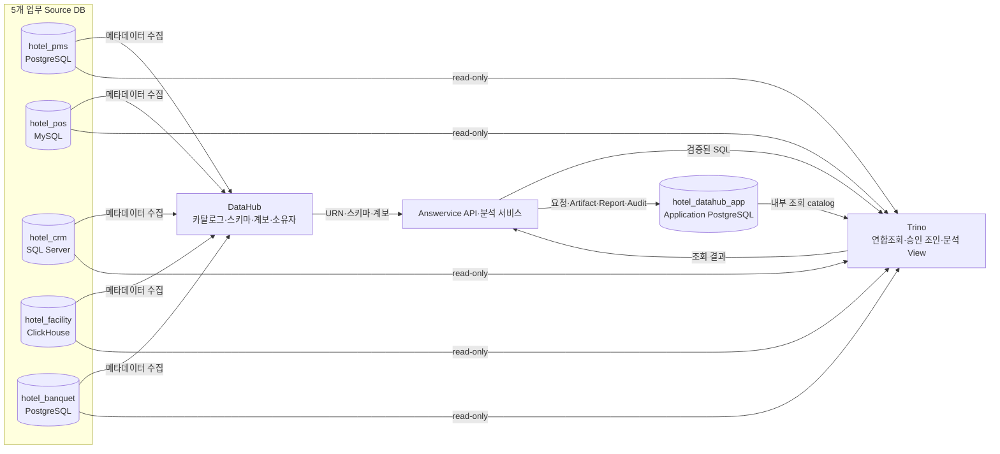
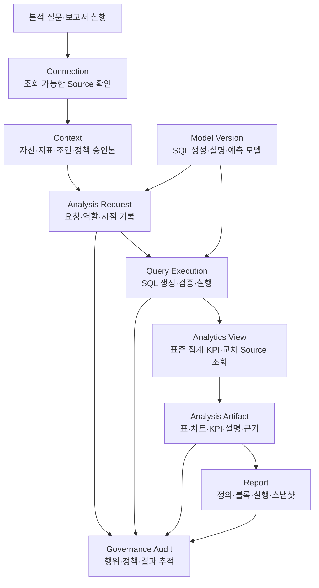
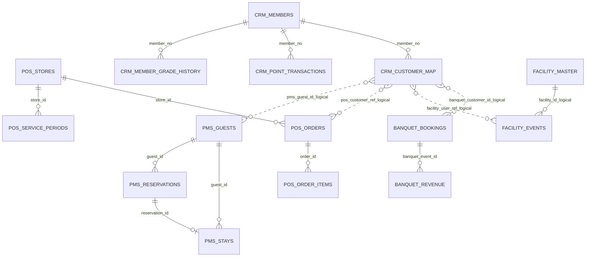

# Answervice 데이터베이스·저장소 설계서 통합 해설

| 항목 | 내용 |
|---|---|
| 문서 설명 | Answervice Application DB와 5개 Source DB, DataHub, Trino 저장 구조를 설명하는 작업본 |
| 문서 분류 | 산출물 작업본 |
| 버전 | v1.0 |
| 문서 기준일 | 2026-07-30 11:52 |
| 작성·수정 | 김재홍 |
| 산출물 번호 | 05 |
| 제출 일자 | — |
| 대응 템플릿 | `templates/[데이터 수집 및 저장] 데이터베이스_저장소 설계 문서_27기_0팀.docx` |

- 주 설계 문서: `05_Answervice_데이터베이스저장소설계서.docx`
- 상세 명세 별첨: `[별첨]Answervice_데이터테이블명세서.xlsx`
- 적용 범위: Application PostgreSQL, 5개 업무 Source DB, DataHub 메타데이터, Trino 연합조회, 분석 View
- 데이터 성격: 실제 운영 자료가 아닌 2022~2026년 합성 데이터
- 문서 상태: 정적 설계 검증 완료, DB·Trino·DataHub 실행 검증은 별도 수행 필요

---

## 요약

Answervice는 서로 다른 5개 업무 데이터베이스를 하나의 DB로 복사하지 않는다. 각 Source DB는 원자 데이터를 보관하고, DataHub는 데이터의 의미와 위치를 관리하며, Trino가 승인된 관계만 이용해 읽기 전용으로 조회한다. 분석 요청, SQL 실행 이력, 결과 표·차트, 보고서, 감사 기록은 Application PostgreSQL에 저장한다.

| 핵심 항목 | 설계 결과 |
|---|---:|
| 물리 데이터베이스 | 6개 |
| Application 테이블 | 24개 |
| Source 테이블 | 18개 |
| 전체 물리 테이블 | 42개 |
| 전체 명세 컬럼 | 571개 |
| Trino 분석 View | 8개 |
| 참조 관계 | 53건 |
| 물리 FK | 43건 |
| 논리 참조 | 8건 |
| 다형 참조 | 2건 |
| 권고 인덱스 | 110건 |

핵심 판단은 다음과 같다.

1. 원천 데이터는 Source DB에 유지한다.
2. Source 간 물리 FK는 만들지 않는다.
3. Source 간 연결은 승인된 논리 참조와 유효기간 조건으로 수행한다.
4. SQL 실행 경로는 읽기 전용으로 제한한다.
5. 실제 실적과 미래 전망을 `data_period_status`, `is_forecast`로 분리한다.
6. 실행하지 않은 DB·Trino·DataHub 검증은 성공으로 표시하지 않는다.

---

## 구현 목록

### 1. 데이터가 저장되는 위치

1. 업무 원자 데이터는 5개 Source DB에 저장한다.
2. 분석 서비스 운영 데이터는 Application PostgreSQL에 저장한다.
3. DataHub는 메타데이터와 계보를 관리하며 원천 거래 데이터를 저장하지 않는다.
4. Trino는 데이터를 장기 저장하지 않고 여러 Source를 조회한다.
5. 분석 View는 반복 사용되는 지표 계산과 안전한 조인을 표준화한다.

### 2. 질문이 결과로 바뀌는 순서

1. 사용자가 분석 질문을 입력한다.
2. `chat.analysis_requests`가 요청과 역할, 적용 정책을 기록한다.
3. Context가 사용할 자산, 컬럼, 지표, 조인 규칙을 묶는다.
4. SQL 생성 모델 또는 템플릿이 SQL을 만든다.
5. AST, 조인, 권한, 실행 계획을 검증한다.
6. Trino가 승인된 Source를 읽기 전용으로 조회한다.
7. 결과를 표, 차트, KPI, 설명 형태의 Artifact로 만든다.
8. 필요한 Artifact를 보고서 블록에 배치한다.
9. 전체 과정은 감사 이벤트와 trace ID로 추적한다.

### 3. 제출 문서에서 확인할 위치

| 확인하려는 내용 | DOCX | Excel |
|---|---|---|
| 전체 설계 목적과 구조 | 1~3장 | `00_표지`, `01_개요` |
| 논리 엔터티와 관계 | 4장 | `02_테이블목록`, `03_참조관계검증` |
| 논리 ERD | 4장 | 개요 요약 참조 |
| 물리 ERD | 5장 | 개별 테이블 시트 |
| 전체 컬럼 571개 | 주요 테이블만 본문 수록 | 42개 상세 시트 전체 수록 |
| PK·FK·논리 참조 | 5~6장, 부록 A | `03_참조관계검증` |
| 무결성·보안·보존 | 6~7장 | 각 컬럼의 제약·보안 등급 |
| 검증 결과 | 8장 | 개요 및 참조관계 검증 시트 |
| 변경 이력 | 9장 | 표지·개요 버전 정보 |

---

## 처리 순서

### 핵심 용어

| 용어 | 쉬운 설명 | Answervice에서의 적용 |
|---|---|---|
| 데이터베이스 | 데이터를 보관하는 독립 저장 공간 | Application 1개와 Source 5개 |
| 스키마 | 한 DB 안에서 업무 영역을 나누는 폴더 | `connection`, `context`, `chat`, `query`, `report` 등 |
| 테이블 | 같은 의미의 행을 모아 둔 구조 | 예약, 주문, 회원, 시설 이벤트 등 42개 |
| 컬럼 | 한 행을 설명하는 속성 | 예약일, 상태, 금액, 수정 시각 등 571개 |
| PK | 한 행을 유일하게 식별하는 키 | `reservation_id`, `request_id` 등 |
| 물리 FK | DB 엔진이 직접 무결성을 강제하는 참조 | 같은 DB 또는 같은 엔진 내부 관계 |
| 논리 참조 | DB가 아닌 정책과 조회 로직이 검증하는 관계 | CRM 고객키와 PMS·POS·Facility·Banquet 연결 |
| 다형 참조 | 대상 테이블이 행의 유형에 따라 달라지는 참조 | 감사 대상 ID, 포인트 연관 거래 ID |
| Context | 승인된 자산·지표·조인·권한 규칙 묶음 | SQL 생성과 실행 전 검증 기준 |
| Watermark | Source가 어느 시점까지 갱신되었는지 나타내는 값 | `source_updated_at`의 최대 시각 |
| Artifact | 조회 결과를 재사용 가능한 표·차트·KPI로 만든 산출물 | `artifact.analysis_artifacts` |
| Forecast | 미래 계획 또는 전망 데이터 | `is_forecast=true`로 실제 실적과 분리 |

### 왜 Source 간 FK를 만들지 않는가

서로 다른 DB 엔진 사이에서는 일반적인 물리 FK를 강제할 수 없다. 또한 Source 시스템은 독립적으로 운영되어야 하므로, 한 Source 장애나 키 변경이 다른 Source의 쓰기 작업을 막아서는 안 된다. 따라서 Source 간 관계는 다음 조건을 만족할 때만 논리적으로 연결한다.

- 승인된 Join Policy가 존재한다.
- 양쪽 키의 의미가 확인되어 있다.
- 이벤트 시각이 매핑의 `[valid_from, valid_to)` 범위에 포함된다.
- 요청 역할이 해당 자산과 컬럼을 조회할 수 있다.
- `source_updated_at <= as_of` 조건을 만족한다.

---

## 전체 저장·조회 구조



### 그림 해석

- Source DB는 업무 원자값을 보유한다.
- DataHub는 자산의 위치와 의미를 제공한다.
- Trino는 Source를 직접 수정하지 않고 조회만 수행한다.
- Application PostgreSQL은 서비스 실행과 결과 재현에 필요한 상태를 저장한다.

---

## 논리 데이터 흐름



### 논리 모델의 중심

- 질문 자체보다 중요한 것은 어떤 Context와 정책으로 실행했는지다.
- SQL 원문만 저장해서는 결과를 재현할 수 없다.
- 요청, 모델 버전, Context release, Source cutoff, 결과 checksum을 함께 남겨야 한다.

---

## 주요 Source 관계



실선 의미의 관계는 각 엔진이 강제하는 물리 FK다. 이름에 `_logical`이 붙은 관계는 Trino와 Join Policy가 검증하는 논리 참조다. Facility는 ClickHouse 특성상 같은 Source 안의 관계도 적재 검증 쿼리로 확인한다.

---

## 데이터베이스별 책임

| Database | Engine | 테이블 | 컬럼 | 주요 책임 |
|---|---|---:|---:|---|
| `hotel_datahub_app` | PostgreSQL | 24 | 308 | 연결 정보, Context, 분석 요청, SQL 실행, Artifact, Report, Audit, 모델, 선택 확장 |
| `hotel_pms` | PostgreSQL | 4 | 65 | 고객, 객실 공급, 예약, 투숙 |
| `hotel_pos` | MySQL | 4 | 57 | 매장, 서비스 시간대, 주문, 주문 품목 |
| `hotel_crm` | SQL Server | 4 | 44 | 회원, 등급 이력, 포인트, 교차 Source 고객키 매핑 |
| `hotel_facility` | ClickHouse | 4 | 56 | 시설, 이용·점검·장애 이벤트, 일별 인력, 자원 사용 |
| `hotel_banquet` | PostgreSQL | 2 | 41 | 행사 예약과 상품별 매출 |
| 합계 |  | 42 | 571 |  |

---

## Application PostgreSQL 구조

### P0 핵심 영역

| 스키마 | 핵심 테이블 | 역할 |
|---|---|---|
| `connection` | `data_sources`, `ingestion_runs` | Source와 DataHub recipe, Trino catalog, health 상태 연결 |
| `context` | `context_records`, `context_releases`, `context_packages` | 승인 자산·지표·조인·정책 버전과 요청별 입력 패키지 관리 |
| `chat` | `conversations`, `analysis_requests` | 대화와 분석 요청의 시작점 및 상태 관리 |
| `query` | `query_executions` | SQL 생성, 검증, 실행 통계, 결과 checksum 기록 |
| `artifact` | `analysis_artifacts` | 표, 차트, KPI, 설명, 근거를 재사용 가능한 결과로 저장 |
| `report` | `report_definitions`, `report_blocks`, `report_runs`, `block_runs` | 보고서 정의, 배치, 실행, 스냅샷 관리 |
| `governance` | `audit_events` | 요청부터 보고서까지 정책 적용과 행위 추적 |
| `model` | `model_versions`, `evaluation_runs` | 모델 버전, 실행 환경, 평가 결과 관리 |
| `reference` | 3개 기준 테이블 | 시장 기준점, 월별 수요지수, 영업일 달력 제공 |

### P2 선택 영역

| 스키마 | 테이블 | 적용 원칙 |
|---|---|---|
| `tooling` | `tool_registry`, `tool_runs` | P0/P1 Gate 전 기능 비활성화 |
| `rag` | `rag_documents`, `rag_chunks` | 합성 문서와 승인 권한만 사용 |
| `ml` | `feature_sets` | 객실수요예측 Feature 계약을 저장하되 학습 파일 자체는 DB에 저장하지 않음 |

---

## Trino 분석 View 8개

| View | Grain | 핵심 목적 |
|---|---|---|
| `analytics.hotel_daily_metrics` | 숙소·일자·객실유형 | 객실 공급, 판매, 매출, OCC, ADR, RevPAR |
| `analytics.hotel_monthly_metrics` | 숙소·월·사업부 | 여러 Source의 월 운영성과 통합 |
| `analytics.hotel_yearly_metrics` | 숙소·연도·사업부 | 연간 성과와 시장 기준점 비교 |
| `analytics.fnb_daypart_metrics` | 매장·일자·시간대 | F&B 순매출, 객단가, RevPASH |
| `analytics.facility_daily_metrics` | 시설·일자 | 이용, 장애, 중단시간, 이용당 매출 |
| `analytics.banquet_monthly_metrics` | 월·상품분류 | 문의, 확정, 취소, 참석자, 인식 매출 |
| `analytics.workforce_monthly_metrics` | 월·부서 | 근무시간, 인건비, FTE, HPOR, Labor CPOR |
| `analytics.resource_monthly_metrics` | 월·자원범위 | 객실박당 에너지, 수도, 폐기물, 비용 |

### 지표 계산 원칙

```text
OCC       = rooms_sold / available_room_nights
ADR       = room_revenue / rooms_sold
RevPAR    = room_revenue / available_room_nights
TRevPAR   = total_operating_revenue / available_room_nights
RevPOR    = total_operating_revenue / rooms_sold
RevPASH   = fnb_net_revenue / seat_hours_available
HPOR      = worked_hours / rooms_sold
Labor CPOR= labor_cost / rooms_sold
```

분모가 0이면 임의로 0을 반환하지 않는다. 결과를 `NULL`로 표시하고 `ZERO_DENOMINATOR` 사유 코드를 함께 제공한다. 서로 다른 fact 테이블은 먼저 동일한 grain으로 집계한 뒤 조인하여 행 증폭을 방지한다.

---

## 데이터 기간과 재현성

| 기간 | 상태 | Forecast | 의미 |
|---|---|---:|---|
| 2022-01-01~2024-12-31 | `REFERENCE_CALIBRATED` | false | 공개 기준점의 추세를 반영한 합성값 |
| 2025-01-01~2025-12-31 | `SYNTHETIC_ACTUAL_LIKE` | false | 공식 수요 흐름을 약하게 반영한 합성 실적 |
| 2026-01-01~2026-07-28 | `YTD_SYNTHETIC` | false | 기준일 이전 합성 YTD |
| 2026-07-29~2026-12-31 | `FORECAST_SCENARIO` | true | 미래 전망 시나리오 |

고정 재현성 기준은 다음과 같다.

```text
seed             = 20260728
schema_version   = schema-v4.6-websql
scenario_version = scenario-v4.6
property_id      = SYNTHETIC_HOTEL_001
synthetic        = true
fixture_version  = source-fixture-v4.6
```

재실행 전후 Source별 행 수, 최대 `source_updated_at`, 핵심 결과 checksum이 같아야 멱등성 PASS로 판정한다.

---

## 무결성·보안 핵심 규칙

### 무결성

1. 모든 테이블은 하나의 PK 또는 명시된 복합 고유키를 가진다.
2. 같은 엔진 내부의 안정 관계는 물리 FK로 구현한다.
3. Source 간 관계는 물리 FK를 금지하고 논리 참조로 관리한다.
4. 회원 등급은 현재 snapshot이 아니라 이벤트 시점의 등급 이력으로 판정한다.
5. 유효기간은 `[valid_from, valid_to)` 규칙을 사용한다.
6. Source fact에는 `source_updated_at`을 두어 point-in-time 조회를 가능하게 한다.
7. Forecast 데이터는 실제 실적 기본 조회에서 제외한다.
8. 금액은 KRW decimal로 저장하고 부동소수점 금액 타입을 사용하지 않는다.

### 보안

1. Source query 계정은 `SELECT`만 허용한다.
2. 비밀번호, 토큰, credential 원문은 테이블에 저장하지 않는다.
3. `connection_ref`, `endpoint_ref`, `artifact_ref`에는 Secret Manager 또는 환경변수 참조만 저장한다.
4. 질문, SQL, 오류, 결과 snapshot은 비식별 또는 최소 저장 원칙을 적용한다.
5. 일반 역할의 API, 로그, trace, Artifact, Report에서 직접 식별 원문 노출은 0건을 목표로 한다.
6. DDL, DML, procedure, passthrough, system catalog 요청은 분석 경로에서 차단한다.

### 보존·복구

| 대상 | 초기 보존 기간 |
|---|---:|
| Result cache | 24시간 |
| 일반 Artifact·실행 결과 | 30일 |
| 승인 Report snapshot | 90일 |
| Audit·Policy·Gate·Trace metadata | 180일 |
| Context release·Report definition | 프로젝트 존속 기간 + 종료 후 90일 |

초기 복구 목표는 `RPO 24시간`, `RTO 4시간`이다.

---

## 설계 검증 결과

### 정적 검증

| 검증 항목 | 결과 |
|---|---:|
| 테이블명 중복 | 0건 |
| 테이블 내 컬럼명 중복 | 0건 |
| PK 누락 또는 복수 PK 오류 | 0건 |
| 물리 FK 대상 누락 | 0건 |
| 물리 FK 타입 불일치 | 0건 |
| 전체 참조 관계 | 53건 |
| 물리 FK | 43건 |
| 논리 참조 | 8건 |
| 다형 참조 | 2건 |
| 참조 대상 누락 | 0건 |

### 실행 검증 상태

| 검증 항목 | 상태 | 완료 조건 |
|---|---|---|
| 엔진별 DDL 실행 | `DB_EXECUTION_NOT_RUN` | 6개 DB에서 DDL 실행 및 객체 수 대조 |
| FK·CHECK·UNIQUE negative test | `DB_EXECUTION_NOT_RUN` | 위반 데이터 삽입이 실제로 차단됨을 확인 |
| ClickHouse 논리 관계 검증 | `DB_EXECUTION_NOT_RUN` | orphan 검증 결과 0건 |
| DataHub ingestion | `DATAHUB_EXECUTION_NOT_RUN` | 5개 recipe 실행 후 자산·컬럼 수 대조 |
| Trino catalog 연결 | `TRINO_EXECUTION_NOT_RUN` | 5개 Source와 App catalog read-only 조회 성공 |
| 분석 View 8개 실행 | `TRINO_EXECUTION_NOT_RUN` | View 생성·조회·grain·KPI 검증 |
| Source write 차단 | `SECURITY_TEST_NOT_RUN` | 일반 query role의 INSERT·UPDATE·DELETE 성공 0건 |
| 재현성 검증 | `FIXTURE_EXECUTION_NOT_RUN` | 재실행 전후 row count·watermark·checksum 일치 |

정적 설계 검증은 문서와 명세의 구조적 일관성을 확인한 결과다. 실제 엔진에서 실행하지 않은 항목을 PASS로 간주해서는 안 된다.

---

## 문서별 역할

### `05_Answervice_데이터베이스저장소설계서.docx`

평가자가 설계의 목적, 논리, 관계, 보안, 검증 결과를 순서대로 이해할 수 있도록 작성한 주 제출 문서다.

- 표지 및 문서 통제
- 자동 목차와 장별 구성
- 모델링 방법과 정규화 수준
- DB·저장소 아키텍처
- 논리 데이터 모델과 논리 ERD
- 물리 데이터 모델과 영역별 물리 ERD
- 주요 테이블 상세 정의
- 제약 조건과 무결성 관리
- 보안·보존·백업·복구
- 설계 검증 결과
- 변경 이력과 적용 전략
- 전체 참조관계 부록

### `[별첨]Answervice_데이터테이블명세서.xlsx`

개발과 검증에 사용하는 상세 기준본이다.

- `00_표지`: 문서 식별정보, 범위, 버전, 사용 지침
- `01_개요`: DB·테이블·컬럼·참조 수, 영역별 요약, 검증 상태
- `02_테이블목록`: 42개 테이블 목록과 한 행의 의미
- `03_참조관계검증`: 물리·논리·다형 참조 53건 검증
- 이후 42개 시트: 테이블별 컬럼 정의, 타입, 길이, PK, FK, NN, 참조, 설명, 보안등급, 인덱스

DOCX와 Excel의 역할을 분리한 이유는 간단하다. 571개 컬럼을 DOCX에 모두 넣으면 평가용 설명 문서가 사전처럼 비대해지고, Excel만 제출하면 설계 의도와 판단 근거가 보이지 않는다. 주 문서와 상세 명세를 함께 사용해야 둘 다 해결된다.

## 변경 내역

| 버전 | 일시 | 요약 |
|---|---|---|
| v1.0 | 2026-07-30 11:52 | 데이터베이스·저장소 설계 작업본 등록 및 표준 문서 메타데이터 적용 |
