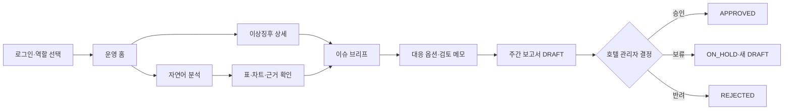

# SensePlace 호텔 VOC·운영 지원 플랫폼 화면설계서

| 항목 | 내용 |
|---|---|
| 문서 설명 | SensePlace의 정보 구조, 사용자 흐름, 화면 구성, 상태, 접근성 및 요구사항 추적 관계를 정의한 산출물 작업본 |
| 문서 분류 | 산출물 작업본 |
| 버전 | v4.0 |
| 문서 기준일 | 2026-07-28 14:16 |
| 작성·수정 | 송민지 |
| 산출물 번호 | 05 |
| 제출 일자 | 2026-07-24 |
| 대응 템플릿 | 없음 |
| 상태 | 전면 개편 초안 · Baseline 화면 계약 팀 검토 필요 |
| 프로젝트 | SensePlace 호텔 VOC·운영 이슈 분석 Agent |
| 요구사항 기준 | `01_요구사항정의서.md` |
| 구현 기준 | `../../app/enterprise-react/src` React 목업 |

> 이 문서는 단일 호텔의 전량 합성 VOC·운영 데이터를 사용하는 내부 운영 지원 PoC를 기준으로 한다. 현재 목업에 보이는 기업 DB 연결, Trino, 정식 온톨로지, MCP Tool, ONNX 예측 및 Customer 360은 구현 완료 사실이 아니라 확장 시연 fixture이며, Baseline 완료 근거로 사용하지 않는다.

## 1. 화면설계 개요

### 1.1 목적

SensePlace 화면은 호텔 관리자가 합성 VOC와 운영지표를 같은 서비스 영역·기간으로 확인하고, 이상징후의 관측 사실과 원인 후보를 구분해 검토한 뒤 주간 보고서 DRAFT를 승인·보류·반려하도록 지원한다.

화면설계의 목표는 다음과 같다.

1. 자연어 질문을 검증된 조회 결과·표·차트·근거로 연결한다.
2. 관측 사실, 원인 후보, 반대 근거, 부족 데이터를 분리한다.
3. AI 제안을 자동 실행하지 않고 사람의 검토와 결정으로 종료한다.
4. 모든 화면에서 합성 데이터, 기간, 단위, 데이터 상태와 산출 방식을 식별할 수 있게 한다.
5. 역할별로 허용된 서비스 영역과 데이터만 노출한다.
6. 중간발표 목업과 실제 백엔드·DB·LLM 연동 상태를 혼동시키지 않는다.

### 1.2 제품 범위

| 구분 | 화면 범위 | 적용 원칙 |
|---|---|---|
| Baseline 필수 | 로그인·역할 선택, 운영 홈, 분석 Agent, 이상징후·이슈 브리프, 주간 보고서 | 요구사항과 5주차 Gate의 직접 대상 |
| Baseline 보조 | 경량 데이터 카탈로그, 분석·오류 이력 | 허용 지표·차원·권한과 근거 추적을 지원 |
| 독립 실험 | VOC 분류·군집·pgvector·sLLM·Agent 구성 비교 | 실행 경로와 분리하고 참고 정보로만 표시 |
| 승인 후 확장 | 고객 VOC 360, DB 연결 관리, MCP read-only adapter, 정식 온톨로지·GraphDB, 일일·월간 보고서 | 팀 승인 전 Baseline 메뉴·완료 근거에서 제외 |
| 프로젝트 밖 | 실제 PMS·POS·CRM·근태·VOC 연동, 실고객 데이터, 실제 stream, 자동 조치, 다호텔 상용 운영 | 목업에서 연결된 것처럼 표현하지 않음 |

### 1.3 설계 상태 용어

| 상태 | 의미 |
|---|---|
| `현재 목업` | `app/enterprise-react/src`에 화면 또는 상호작용 코드가 존재함 |
| `목표 설계` | 요구사항상 필요하지만 현재 목업에 없거나 정합화가 필요한 화면 |
| `확장 목업` | 코드에는 있으나 Baseline 요구사항으로 승인되지 않은 시연 화면 |
| `미구현` | API·DB·LLM 또는 상태 저장이 연결되지 않은 상태 |
| `검토 필요` | 팀 결정 또는 요구사항 개정 전 확정할 수 없는 항목 |

### 1.4 충돌 기록과 적용 결정

| 항목 | 현재 목업·요청 | 활성 기획·요구사항 | 적용 결정 | 확인 필요 |
|---|---|---|---|---|
| 프로젝트 중심 | 범용 기업 사일로 통합·매출 전략 | 단일 호텔 합성 VOC×운영 분석 PoC | 화면의 주 흐름은 호텔 VOC·운영 의사결정으로 고정 | 범용 기업 확장을 발표 후속안으로 유지할지 팀 결정 |
| 데이터 연결 | Oracle·SQL Server·Salesforce 등 8개 연결 | 실제 내부 시스템 연동 제외 | 모든 연결 카드는 `synthetic connector fixture`로 표시 | 실데이터 파일럿 승인 전 실제 연결 금지 |
| 조회 기술 | Trino 연합 조회 | PostgreSQL 경량 시맨틱 카탈로그와 결정론 SQL builder·Guard | Trino는 확장 시연 라벨로만 유지 | 실행 기술 결정 시 별도 구현 계약 필요 |
| 의미 모델 | 정식 온톨로지와 traversal | 정식 ontology·GraphDB는 승인 후 확장 | Baseline은 지표·동의어·허용 차원·권한 카탈로그 사용 | 온톨로지 탭 유지 여부 팀 결정 |
| Tool 관리 | MCP Tool Registry | MCP adapter는 승인 후 확장 | 데이터 카탈로그 하위 확장 탭으로만 유지 | Baseline 메뉴에서는 완료 기능으로 표현 금지 |
| Customer 360 | 고객·예약·구매·매출 분석 | 공식 사용자는 호텔·F&B·객실 관리자 | `고객 VOC 360`으로 목적을 좁힌 확장 화면으로 정의 | 프런트 직원 역할과 개인정보 경계 승인 필요 |
| 보고서 | 일일·주간·월간·분기 | Baseline 필수는 주간 HTML DRAFT | 주간을 기본으로 두고 나머지는 확장 표시 | 추가 주기 승인 여부 팀 결정 |
| 모니터링 | 통합 관제 화면 삭제 | 기능 D 최신 상태·이상징후 조회 필요 | 별도 관제·맵 없이 운영 홈에 최소 상태를 통합 | `UI-001`~`002` 화면 계약 팀 확인 |

## 2. 사용자와 권한

### 2.1 Baseline 사용자

| 역할 | 주요 목적 | 허용 범위 | 주요 결정 |
|---|---|---|---|
| 호텔 관리자 `HOTEL_MANAGER` | 호텔 전체 주간 현황·이슈·보고서 검토 | 전체 합성 서비스 영역 | 보고서·대응안 승인·보류·반려 |
| F&B 관리자 `FNB_MANAGER` | 조식 운영·인력·F&B VOC 분석 | F&B와 허용된 연관 지표 | 근거 확인, 검토 메모, 담당 조치 확인 |
| 객실 관리자 `ROOMS_MANAGER` | 객실 집계·객실 VOC 분석 | 객실과 제한된 조식 수요 지표 | 근거 확인, 검토 메모, 권한 밖 결과 거부 확인 |
| 시스템 관리자 `Django staff` | 분석 작업·오류·감사 이력 확인 | 운영 메타데이터 | 오류 사유 확인; 업무 결정 권한과 분리 |

### 2.2 확장 사용자

| 역할 | 화면 | 목적 | Baseline 경계 |
|---|---|---|---|
| 프런트 직원 | 고객 VOC 360 | 고객 응대 중 투숙 맥락·VOC·관련 운영 상태와 권장 대응 확인 | 공식 역할·API·개인정보 기준 승인 전 확장 목업 |
| 데이터 관리자 | DB 연결 관리·확장 카탈로그 | connector·metadata·Tool 상태 확인 | 실제 credential·외부 시스템 연결은 제외 |

### 2.3 권한 표시 원칙

- 권한 밖 메뉴는 기본적으로 숨기고 직접 URL 접근은 서버에서 다시 거부한다.
- 권한 거부 화면에는 요청 역할, 허용 범위, 거부 사유와 돌아가기 동작을 제공한다.
- 프론트의 메뉴 숨김만으로 권한을 보장하지 않는다.
- 고객 식별값은 합성·마스킹 ID만 표시하며 실제 이름·연락처·예약번호를 저장하거나 노출하지 않는다.
- 보고서 결정, 분석 조회, 로그인 이력은 감사 대상으로 표시한다.

## 3. 정보 구조(IA)

### 3.1 목표 IA

```text
SensePlace
├─ 로그인·역할 선택                         Baseline
└─ WORKSPACE
   ├─ 운영 홈                              Baseline
   │  ├─ 주간 요약
   │  ├─ 데이터 최신 상태
   │  └─ 이상징후·우선 점검
   ├─ 분석 Agent                           Baseline
   │  ├─ 질문·분석 작업
   │  ├─ 표·차트
   │  └─ 근거·산출 정보
   ├─ 이상징후 상세                        Baseline
   │  ├─ 감지 지표·비교 기간·데이터 상태
   │  └─ 연계 이슈 브리프
   ├─ 이슈 브리프                          Baseline
   │  ├─ 관측 사실
   │  ├─ 원인 후보·반대 근거·부족 데이터
   │  └─ 대응 옵션·검토 메모
   ├─ 보고서                               Baseline
   │  ├─ 주간 DRAFT 목록
   │  ├─ drag and drop 편집기
   │  └─ 열람·승인·보류·반려
   └─ 고객 VOC 360                         승인 후 확장
      ├─ 고객·투숙 맥락
      ├─ VOC·운영 타임라인
      └─ 고객 응대 Copilot
└─ ADMINISTRATION
   ├─ 데이터 카탈로그                      Baseline 보조
   │  ├─ 지표·용어·허용 차원·권한
   │  ├─ 온톨로지                          승인 후 확장
   │  └─ MCP Tool                          승인 후 확장
   └─ DB 연결 관리                         승인 후 확장
```

별도 `통합 관제`, 지도 기반 현황 맵, 내부 리뷰 데이터 페이지는 두지 않는다. 기능 D의 장소별 최신 상태와 미조치 이상징후는 운영 홈의 요약 카드와 이슈 목록으로 제공한다.

### 3.2 라우트 계약

| 구분 | 경로 | 화면 ID | 현재 코드 | 목표 |
|---|---|---|---|---|
| Baseline | `/login` | `SCR-LOGIN-001` | 없음 | Django session 로그인·역할 선택 |
| Baseline | `/home` | `SCR-HOME-001` | 없음 | 운영 홈·최신 상태·이상징후 |
| Baseline | `/agent` | `SCR-AGENT-001` | 구현 | VOC 중심 분석 결과 구조로 정합화 |
| Baseline | `/alerts/:alertId` | `SCR-ALERT-001` | 없음 | 감지 지표·비교 기간·데이터 상태 |
| Baseline | `/issues/:issueId` | `SCR-ISSUE-001` | 없음 | 이슈 브리프와 대응 검토 |
| Baseline | `/reports` | `SCR-RPT-001` | 구현 | 주간 DRAFT 중심 목록 |
| Baseline | `/reports/:reportId` | `SCR-RPT-002` | `/reports` 내부 state | 독립 URL과 읽기 전용 확정본 |
| Baseline | `/reports/:reportId/edit` | `SCR-RPT-003` | `/reports` 내부 state | 독립 URL과 저장 상태 |
| 확장 | `/customers` | `SCR-CUS-001` | 구현 | 고객 분석에서 고객 VOC 대응으로 개편 |
| Baseline 보조 | `/catalog` | `SCR-CAT-001` | 구현 | 경량 시맨틱 카탈로그 중심으로 축소 |
| 확장 | `/catalog/ontology` | `SCR-ONT-001` | 구현 | `확장 시연` 고지 |
| 확장 | `/catalog/tools` | `SCR-MCP-001` | 구현 | `확장 시연` 고지 |
| 확장 | `/connections` | `SCR-CONN-001` | 구현 | `synthetic connector fixture` 고지 |

현재 라우터는 알 수 없는 경로를 `/agent`로 전환한다. 목표 구현에서는 비로그인 사용자를 `/login`, 로그인 사용자를 역할별 기본 화면 `/home`으로 전환한다.

## 4. 사용자 흐름

### 4.1 Baseline Golden Path



시스템 종료 지점은 호텔 관리자의 결정이다. 고객 메시지, 보상, 인력 배치, 외부 전송과 티켓 생성은 자동 실행하지 않는다.

### 4.2 대화형 분석 흐름

1. 사용자가 서비스 영역·기간을 선택하거나 자연어 질문에 포함한다.
2. 시스템이 역할 scope와 보장 intent 여부를 확인한다.
3. 미지원·공격·권한 위반 질문은 SQL 실행 없이 거부 사유를 표시한다.
4. 허용 질문은 semantic plan, 결정론적 read-only SQL builder, Guard 순으로 처리한다.
5. UI는 `대기 → 실행 중 → 완료·부분 성공·실패` 상태를 표시한다.
6. 결과는 요약, 최소 표, 적합한 차트, 단위·기간·필터, 근거 순으로 제공한다.
7. 추가 질의가 명시된 경우에만 최근 분기, 최대 반기 내 3점 이하 합성 리뷰를 표시한다.
8. 사용자는 이슈 브리프로 이동해 원인 후보와 대응 옵션을 검토한다.

### 4.3 보고서 흐름

```text
분석·Incident 결과
→ 근거 기반 주간 HTML DRAFT 생성
→ drag and drop 블록 편집
→ 관리자 검토
→ APPROVED / ON_HOLD / REJECTED
```

- DRAFT에는 생성 시각, 생성자, 데이터 버전, 근거 ID와 분석 한계를 표시한다.
- 승인본은 읽기 전용이며 새 편집은 새 DRAFT version을 생성한다.
- LLM 실패 시 결정론적 수치와 template 결과를 유지하고 `PARTIAL`로 표시한다.

### 4.4 고객 VOC 360 확장 흐름

```text
마스킹 고객 검색
→ 투숙·요청·VOC 타임라인 확인
→ 관련 객실·시설 운영 상태 확인
→ Agent의 원인 후보·응대 권고 확인
→ 직원 메모·담당 부서 이관 후보 기록
```

재방문 예측, 누적 매출, 마케팅 선호만 보여주는 일반 CRM 화면으로 끝내지 않는다. 고객 응대에 필요한 VOC 맥락, 현재 처리 상태, 권장 확인과 근거가 중심이어야 한다.

## 5. 공통 레이아웃과 디자인 시스템

### 5.1 공통 프레임

| 영역 | 구성 | 동작 |
|---|---|---|
| 사이드바 | `SENSE PLACE`, WORKSPACE, ADMINISTRATION, Demo Organization | 현재 메뉴 강조, 모바일 drawer 전환 |
| 상단 헤더 | 화면명, 한 줄 설명, 데이터 연결 상태, 알림, 사용자 | sticky, 긴 제목 줄바꿈, 상태의 합성 여부 표시 |
| 메타 스트립 | `SYNTHETIC DEMO DATA`, seed, schema version | 모든 업무 화면에 상시 표시 |
| 본문 | 카드·표·차트·대화·문서 | lazy loading과 페이지 전환 상태 제공 |
| 상태 피드백 | badge, toast, inline error, empty state | 색상·아이콘·텍스트를 함께 사용 |

### 5.2 시각 토큰

| 토큰 | 값 | 용도 |
|---|---|---|
| Ivory | `#f6f3ee` | 기본 배경 |
| Espresso | `#241a14` | 사이드바·주요 버튼 |
| Gold | `#a77a3d` | 강조·브랜드 포인트 |
| Charcoal | `#292d33` | 본문 텍스트 |
| Border | `#ddd6cd` | 카드·표 경계 |
| Green | `#3e8057` | 정상·완료 |
| Amber | `#a97528` | 주의·지연·검토 필요 |
| Coral | `#bd6258` | 오류·위험 |
| Blue | `#54738c` | 정보·진행 |
| 본문 글꼴 | `Pretendard, Inter, system-ui` | 본문·표·입력 |
| 제목 글꼴 | `Georgia, Times New Roman` | 화면 제목·문서형 제목 |

워커힐 톤앤매너를 참고한 엔터프라이즈 데모 스타일을 사용하되, 공식 브랜드 자산·상표 사용 권한이 확인되기 전 실제 워커힐 공식 서비스로 표현하지 않는다.

### 5.3 정보 표현 순서

1. 화면 목적과 현재 조건
2. 핵심 수치·변화
3. 표·차트
4. 관측 사실과 근거
5. 원인 후보·반대 근거·부족 데이터
6. 대응 옵션과 검토 동작
7. 산출 방식·버전·한계

### 5.4 진실성 문구

| 잘못된 표현 | 적용 표현 |
|---|---|
| `7개 시스템 연결` | `Synthetic connector 7/8 정상` |
| `주요 원인` | `원인 후보` |
| `AI 신뢰도 96%` | 검증된 품질 지표가 없으면 표시하지 않음 |
| `전략 적용 OCC +4.3%p` | `합성 시나리오 추정 · 관리자 검토 필요` |
| `Trino로 조회 완료` | `확장 시연 fixture · 실제 연결 없음` |
| `ONNX v2.3.1 예측` | 모델 파일·평가·서빙 근거가 있을 때만 실제 실행으로 표시 |

## 6. 화면 목록

| 화면 ID | 화면명 | 사용자 | 진입 조건 | 주요 기능 | 관련 요구사항 ID |
|---|---|---|---|---|---|
| `SCR-LOGIN-001` | 로그인·역할 선택 | 사내 사용자 | 비로그인 | session 로그인, 역할·합성 목업 고지 | `FUN-001`, `FUN-002`, `SEC-002`, `SEC-003` |
| `SCR-HOME-001` | 운영 홈 | 3개 관리자 역할 | 로그인 | 주간 요약, 데이터 상태, 이상징후, 질의 진입 | `UI-001`, `UI-002`, `UI-004`, `FUN-013`, `AI-005`~`007` |
| `SCR-AGENT-001` | 분석 Agent | 3개 관리자 역할 | 로그인·권한 scope | 질문, job 상태, 표·차트, 근거, 실행 정보 | `FUN-006`, `AI-010`, `UI-003`~`005`, `NFR-002`, `NFR-005` |
| `SCR-ALERT-001` | 이상징후 상세 | 3개 관리자 역할 | 운영 홈 이상징후 선택 | 감지 지표, 비교 기간, 데이터 상태, 브리프 연결 | `FUN-013`, `AI-005`~`007`, `UI-002`, `UI-004` |
| `SCR-ISSUE-001` | 이슈 브리프 | 3개 관리자 역할 | 이상징후 또는 분석 결과 | 관측 사실, 원인 후보, 반대 근거, 대응 검토 | `BIZ-001`~`004`, `FUN-007`, `AI-003`, `AI-008`, `AI-009` |
| `SCR-RPT-001` | 보고서 목록 | 관리자·실무자 | 로그인 | 주간 DRAFT·확정본 검색·필터 | `RPT-001`, `RPT-002`, `SEC-003` |
| `SCR-RPT-002` | 보고서 열람·결정 | 호텔 관리자 중심 | 보고서 선택 | 근거·한계, 승인·보류·반려, 감사 이력 | `BIZ-004`, `RPT-001`, `RPT-002`, `SEC-003`, `NFR-005` |
| `SCR-RPT-003` | 보고서 블록 에디터 | 작성 권한 사용자 | DRAFT 선택 | drag and drop, 편집, 저장, 미리보기 | `RPT-001`, `RPT-002`, `UI-004` |
| `SCR-CUS-001` | 고객 VOC 360 | 확장 프런트 직원 | 확장 역할 승인 | 투숙·VOC·운영 맥락, 응대 Copilot | 확장 제안 · `SEC-001`, `SEC-002` 경계 적용 |
| `SCR-CAT-001` | 데이터 카탈로그 | 관리자·분석 담당 | 로그인 | 지표·동의어·차원·권한·freshness 탐색 | `DAT-007`, `AI-010`, `NFR-005` |
| `SCR-ONT-001` | 온톨로지 맵 | 확장 데이터 관리자 | 확장 승인 | 업무 개체·관계 시각화 | 승인 후 확장 |
| `SCR-MCP-001` | MCP Tool Registry | 확장 데이터 관리자 | 확장 승인 | Tool contract·권한·상태 | 승인 후 확장 |
| `SCR-CONN-001` | DB 연결 관리 | 확장 데이터 관리자 | 확장 승인 | synthetic connector 상태·read-only 검토 | 승인 후 확장 |

## 7. 화면별 구성 요소와 동작

### 7.1 `SCR-LOGIN-001` 로그인·역할 선택

| 영역 ID | UI 요소 | 입력 / 출력 | 동작 | 상태 / 예외 | 접근성 | 관련 API |
|---|---|---|---|---|---|---|
| `LOGIN-01` | 서비스 로고·목업 안내 | 서비스명, 합성 데이터 고지 | 안내만 제공 | 이미지 실패 시 텍스트 로고 유지 | 로고 대체 텍스트 | Django session · 상세 경로 미확정 |
| `LOGIN-02` | 계정 입력 | ID·비밀번호 | 로그인 요청 | 필수값, 인증 실패, 잠금 상태 | label과 오류 연결 | Django session · 상세 경로 미확정 |
| `LOGIN-03` | 역할 확인 카드 | 서버가 허용한 역할 | 역할별 진입 범위 설명 | 임의 역할 변경 금지 | 키보드 선택·선택 상태 텍스트 | session role scope |
| `LOGIN-04` | 로그인 버튼 | 인증 요청 | 성공 시 `/home` 이동 | 중복 제출 방지·진행 표시 | 진행 상태 `aria-live` | Django session |

현재 목업에는 로그인 화면이 없다. 중간발표용 가상 역할 선택을 만들더라도 실제 인증·권한 적용처럼 표현하지 않는다.

### 7.2 `SCR-HOME-001` 운영 홈

| 영역 ID | UI 요소 | 입력 / 출력 | 동작 | 상태 / 예외 | 접근성 | 관련 API |
|---|---|---|---|---|---|---|
| `HOME-01` | 역할·서비스 영역·기간 | 허용 영역, 주간 기간 | 필터 변경 시 전체 요약 갱신 | 권한 밖 옵션 미표시 | 각 필터 label 제공 | `/api/v1/*` 조회 계약 미확정 |
| `HOME-02` | 데이터 준비 상태 | seed, schema, batch, freshness | 품질 상세 열기 | `READY`, `NEEDS_DATA`, `STALE` | 상태 아이콘+문구 | dataset·quality 조회 |
| `HOME-03` | 주간 KPI | VOC 건수·비율, 운영지표, 전주·4주 비교 | 카드에서 분석 Agent로 조건 전달 | 단위·기간·표본 누락 금지 | 카드 제목 구조화 | analytics 조회 |
| `HOME-04` | 이상징후 목록 | rule version, 지표, 비교 기간, 심각도 | 이슈 브리프 이동 | 정상 무경보, 결측, 지연 | 색상 외 아이콘·텍스트 | Incident 조회 |
| `HOME-05` | 우선 점검 항목 | 후보·담당 영역·최신 상태 | 상세 보기 | 개선 확정 표현 금지 | 우선순위 번호 제공 | Incident 조회 |
| `HOME-06` | 자연어 질의 진입 | 질문 예시 또는 직접 입력 | `/agent`로 질문 조건 전달 | 미지원 질문 사전 확정 금지 | input label·키보드 제출 | 분석 job 계약 미확정 |

통합 관제·현황 맵은 만들지 않는다. 최신 적재 시각, 장소별 상태, 미조치 이슈만 카드와 목록으로 요약한다.

### 7.3 `SCR-AGENT-001` 분석 Agent

| 영역 ID | UI 요소 | 입력 / 출력 | 동작 | 상태 / 예외 | 접근성 | 관련 API |
|---|---|---|---|---|---|---|
| `AGT-01` | 최근 분석 목록 | 질문명, 실행 시각, 상태 | 분석 이력 전환 | 권한 밖 이력 미노출 | 현재 선택 `aria-current` | 분석 이력 조회 |
| `AGT-02` | 질문 입력 | 자연어, 서비스 영역·기간 | job 생성, Enter 제출 | 공백·미지원·공격·권한 위반 차단 | 명시적 label·전송 버튼 | `/api/v1/*` job 계약 미확정 |
| `AGT-03` | 처리 단계 | scope, intent, plan, Guard, 조회, 서술 | polling 결과 반영 | queued, running, partial, failed | 단계 목록·현재 단계 텍스트 | job 상태 조회 |
| `AGT-04` | 결과 요약 | 결정론적 수치와 조건 | 상세 근거 이동 | 원인 확정·자동 실행 표현 금지 | 제목 계층·숫자 읽기 순서 | Incident 통합 응답 |
| `AGT-05` | 결과 표 | 지표·기간·단위·필터·표본 | 정렬·행 탐색 | 빈 결과와 0을 구분 | table header·caption | analytics 결과 |
| `AGT-06` | 결과 차트 | intent 결과 유형별 차트 | series·기간 확인 | 차트 생성 실패 시 표 유지 | 요약 문장·표 대체 | analytics 결과 |
| `AGT-07` | 근거 패널 | evidence ID, 허용 저점 리뷰, 운영 근거 | 근거 상세 열기 | 최초 VOC 요약에는 리뷰 원문 0건 | 좁은 화면에서 drawer 제공 | evidence 조회 |
| `AGT-08` | 분석 구분 | 관측 사실·원인 후보·반대 근거·부족 데이터 | 각 항목 접기·펼치기 | 근거 없으면 `NEEDS_DATA` | 구분 제목과 badge | Incident 응답 |
| `AGT-09` | 대응 옵션 | 옵션, 예상 효과, 비용·한계 | 이슈 브리프로 전달 | 자동 실행 금지 | 버튼 목적 명시 | Incident 응답 |
| `AGT-10` | 실행 정보 | run, rule, data, model version, elapsed | 상세 metadata 확인 | LLM 실패 시 `PARTIAL` | 정의 목록 사용 | analysis run 조회 |

현재 목업의 객실 매출 하락 질문, `주요 원인`, Trino 3개 catalog, ONNX v2.3.1 표시는 Baseline 실연 결과로 사용할 수 없다. VOC×운영 교차분석과 합성 fixture라는 경계를 전면에 표시해야 한다.

### 7.4 `SCR-ALERT-001` 이상징후 상세

| 영역 ID | UI 요소 | 입력 / 출력 | 동작 | 상태 / 예외 | 접근성 | 관련 API |
|---|---|---|---|---|---|---|
| `ALT-01` | 이상징후 헤더 | 서비스 영역, 감지 시각, 상태 | 운영 홈 복귀 | stale·closed·partial 구분 | 제목과 상태 텍스트 | detection 조회 |
| `ALT-02` | 감지 지표 | 현재값, 기준값, 증감, 단위 | 계산 조건 펼치기 | 임계 미충족 시 조사 생성 금지 | 단위와 비교 기간 표시 | detection 결과 |
| `ALT-03` | 비교 기간 | 관측 창, 전주·최근 4주 동일 요일 | 기간 상세 확인 | 다른 timezone·grain 혼합 금지 | 시간 범위를 문장으로 제공 | detection 결과 |
| `ALT-04` | 데이터 상태 | batch, freshness, quality, 결측 | 품질 상세 열기 | `READY`, `STALE`, `NEEDS_DATA` | 색상 외 아이콘·문구 | manifest·quality 조회 |
| `ALT-05` | 관련 VOC·운영 요약 | 주제별 VOC와 연관 운영지표 | 근거 이동 | 원인 후보를 이 화면에서 확정하지 않음 | 표·차트 대체 텍스트 | detection·evidence 조회 |
| `ALT-06` | 이슈 브리프 연결 | Incident ID, 조사 상태 | `/issues/:issueId` 이동 | 브리프 미생성·PARTIAL | 링크 목적 명시 | Incident 조회 |

### 7.5 `SCR-ISSUE-001` 이슈 브리프

| 영역 ID | UI 요소 | 입력 / 출력 | 동작 | 상태 / 예외 | 접근성 | 관련 API |
|---|---|---|---|---|---|---|
| `ISS-01` | 이슈 헤더 | 이슈명, 서비스 영역, 기간, 상태 | 이전 화면 복귀 | stale·closed·partial 구분 | 제목과 상태 텍스트 | Incident 조회 |
| `ISS-02` | 감지 출처 | alert ID, rule ID·version, 분석 run | 이상징후 상세 이동 | 출처 불일치 시 경고 | 식별자와 링크 설명 | Incident 조회 |
| `ISS-03` | 관측 사실 | 재현 가능한 수치·VOC 변화 | evidence 이동 | 다른 기간·영역 결합 금지 | 목록 구조 | Incident 통합 응답 |
| `ISS-04` | 원인 후보 | 사전 정의 후보와 지지 근거 | 후보별 상세 확인 | 인과 확정 표현 금지 | `후보` 문구 상시 표시 | Incident 통합 응답 |
| `ISS-05` | 반대 근거·부족 데이터 | 상충 지표, 결측, 추가 확인 | 현장 확인 메모 | 누락 시 완료 처리 금지 | 경고를 색상 외 텍스트로 제공 | Incident 통합 응답 |
| `ISS-06` | 대응 옵션 | 옵션, 예상 효과, 비용, 담당 후보 | 선택·메모 | 선택은 실행이 아님 | 선택 상태와 해제 동작 | decision 후보 저장 |
| `ISS-07` | 검토 메모 | 관리자 메모 | 저장 | 저장 실패·충돌 | label·글자 수 안내 | 검토 이력 저장 |
| `ISS-08` | 보고서 DRAFT 연결 | report ID·version·상태 | 보고서 열기 | 미생성·PARTIAL | 링크 목적 명시 | report 조회 |

### 7.6 `SCR-CUS-001` 고객 VOC 360

| 영역 ID | UI 요소 | 입력 / 출력 | 동작 | 상태 / 예외 | 접근성 | 관련 API |
|---|---|---|---|---|---|---|
| `CUS-01` | 마스킹 고객 검색 | synthetic customer ID | 고객 전환 | 실제 이름·연락처 검색 금지 | 검색 label·결과 수 안내 | 확장 계약 미정 |
| `CUS-02` | 고객·투숙 맥락 | 등급, 객실 유형, 현재 투숙 상태 | 관련 범위 확인 | 실고객 PII 금지 | 정의 목록 | 확장 계약 미정 |
| `CUS-03` | VOC 타임라인 | 문의·불만·요청·처리 상태 | 사건 선택 | VOC 없음·처리 지연 구분 | 시간순 목록 | 확장 계약 미정 |
| `CUS-04` | 관련 운영 상태 | 객실 정비·시설·예약 변경 | 관련 이슈 이동 | 연결 근거 없음 표시 | 상태 아이콘+텍스트 | 확장 계약 미정 |
| `CUS-05` | Agent 분석 | 감정, 긴급도, 반복 이슈, 원인 후보 | 근거 펼치기 | 예측·추정 라벨 | 근거와 본문 연결 | 확장 계약 미정 |
| `CUS-06` | 고객 응대 Copilot | 권장 확인, 답변 초안, 이관 후보 | 복사·메모·후속 질문 | 자동 발송·보상 금지 | 복사 성공 안내 | 확장 계약 미정 |
| `CUS-07` | 처리 메모 | 직원 확인·담당 부서 후보 | 임시 저장 | 공식 workflow 승인 전 로컬 목업 | label·저장 상태 | 확장 계약 미정 |

현재 화면의 누적 객실 매출, 구매 선호, 재방문 예측은 고객 응대 근거로 검증되지 않았다. 유지하려면 응대 우선순위와의 관계, 모델 근거, 개인정보 경계를 별도로 승인해야 한다.

### 7.7 `SCR-RPT-001` 보고서 목록

| 영역 ID | UI 요소 | 입력 / 출력 | 동작 | 상태 / 예외 | 접근성 | 관련 API |
|---|---|---|---|---|---|---|
| `RPL-01` | 보고서 생성 | 주간 기간 | 새 DRAFT 요청 | 중복 기간·생성 실패 | 진행 상태 안내 | report 생성 계약 미확정 |
| `RPL-02` | 유형·상태 필터 | 주간, DRAFT, APPROVED 등 | 목록 필터 | 일일·월간·분기는 확장 라벨 | select label | report 목록 조회 |
| `RPL-03` | 보고서 목록 | 기간, 상태, 생성자, version, 수정 시각 | 열람·편집 진입 | 빈 목록·권한 거부 | 표 header·행 동작 분리 | report 목록 조회 |
| `RPL-04` | 상태 설명 | DRAFT·PARTIAL·APPROVED·ON_HOLD·REJECTED | 도움말 표시 | 상태명 불일치 금지 | 텍스트 범례 | 없음 |

### 7.8 `SCR-RPT-003` 보고서 블록 에디터

| 영역 ID | UI 요소 | 입력 / 출력 | 동작 | 상태 / 예외 | 접근성 | 관련 API |
|---|---|---|---|---|---|---|
| `RPE-01` | 블록 라이브러리 | 요약·근거·성과·이슈·전망·기본 블록 | canvas로 drag and drop | 미지원 블록 차단 | 키보드 `추가` 대안 버튼 | DRAFT 조회·저장 |
| `RPE-02` | 문서 canvas | 2열 블록 | 순서·1칸/2칸 변경 | 모바일 1열 | 키보드 위·아래 이동 버튼 | DRAFT 저장 |
| `RPE-03` | 블록 편집 | 제목·텍스트·표·차트·KPI | 내용 편집·삭제 | 근거 블록 삭제 시 경고 | 입력 label·삭제 확인 | DRAFT 저장 |
| `RPE-04` | 자연어 차트 요청 | 차트 설명 | 차트 초안 생성 | 실패 시 원본 표 유지 | 결과 요약 제공 | 확장 기능 · 계약 미정 |
| `RPE-05` | 저장 상태 | 저장 중·저장됨·실패 | 자동·수동 저장 | 충돌·network 오류 | `aria-live` | DRAFT 저장 |
| `RPE-06` | 미리보기·PDF | HTML 미리보기 | 출력 준비 | PDF는 승인 후 기능 | 버튼 상태·진행 안내 | export 계약 미정 |
| `RPE-07` | 검토 요청 | DRAFT version | 보고서 열람 화면 이동 | 필수 근거·한계 누락 차단 | 오류 요약과 필드 연결 | report 상태 저장 |

마우스 drag and drop만으로 편집을 제한하지 않는다. 각 블록에 `위로`, `아래로`, `폭 변경`, `삭제` 동작을 제공해야 한다.

### 7.9 `SCR-RPT-002` 보고서 열람·결정

| 영역 ID | UI 요소 | 입력 / 출력 | 동작 | 상태 / 예외 | 접근성 | 관련 API |
|---|---|---|---|---|---|---|
| `RPD-01` | 문서 표지 | 주간 기간, DRAFT, 생성자·시각, data version | version 전환 | 정보 누락 시 검토 차단 | 문서 제목 구조 | report 조회 |
| `RPD-02` | 경영 요약 | 결정론적 수치+근거 기반 서술 | 근거 이동 | LLM 실패 시 template·PARTIAL | 문단과 근거 링크 | Incident·report 통합 응답 |
| `RPD-03` | 결정 안건 | 옵션, 효과, 비용, 담당 | 승인·보류 후보 선택 | 자동 실행 금지 | 버튼 상태 텍스트 | decision 저장 |
| `RPD-04` | 성과·이슈 | KPI, 표, 차트, 관측 사실 | 상세 확인 | 단위·기간·표본 누락 금지 | 표 대체 제공 | report 조회 |
| `RPD-05` | 반대 근거·한계 | 상관 한계, 결측, 표본, 합성 고지 | 펼치기 | 섹션 삭제 금지 | 기본 펼침 | report 조회 |
| `RPD-06` | 검토 메모 | 판단 사유 | 저장 | 필수 사유 정책은 팀 결정 | label·오류 안내 | decision 저장 |
| `RPD-07` | 결정 동작 | 승인·보류·반려 | 상태 저장·감사 이력 생성 | 호텔 관리자 외 거부 | 확인 dialog·focus 복귀 | decision 저장 |
| `RPD-08` | 확정본 | APPROVED version | 읽기 전용 열람 | 덮어쓰기 금지 | 읽기 전용 상태 안내 | report 조회 |

현재 목업의 다호텔 비교, 일일·월간·분기, PPT·공유는 Baseline 밖이다. 화면에 남길 경우 `확장 시연`으로 구분하고 실제 성공 toast만으로 완료를 주장하지 않는다.

### 7.10 `SCR-CAT-001` 데이터 카탈로그

| 영역 ID | UI 요소 | 입력 / 출력 | 동작 | 상태 / 예외 | 접근성 | 관련 API |
|---|---|---|---|---|---|---|
| `CAT-01` | 카탈로그 검색 | 지표·용어·데이터 제품명 | 결과 필터 | 빈 결과·권한 제외 | 검색 결과 수 안내 | catalog 조회 |
| `CAT-02` | 데이터 제품 목록 | source, domain, owner, freshness, quality | 상세 선택 | 합성 fixture 표시 | 표 header·caption | catalog 조회 |
| `CAT-03` | 지표 정의 | 이름, 계산식 설명, 단위, grain | 읽기 전용 확인 | 계산식 미승인 표시 | 정의 목록 | metric catalog 조회 |
| `CAT-04` | 허용 차원·권한 | role, service scope, dimension allowlist | 분석 Agent와 연결 | 권한 밖 항목 미표시 | 표와 텍스트 설명 | metric catalog 조회 |
| `CAT-05` | lineage·freshness | 원본·정제·view, 갱신 시각 | 상태 상세 | stale·quality failure | 색상 외 상태 | manifest·quality 조회 |

Baseline 카탈로그는 정식 온톨로지가 아니라 지표·동의어·허용 차원·조회 범위·권한을 고정하는 경량 시맨틱 카탈로그다.

### 7.11 확장 관리 화면

| 화면 ID | 핵심 요소 | 현재 목업 동작 | 반드시 표시할 경계 | 확장 승인 후 검토 |
|---|---|---|---|---|
| `SCR-ONT-001` | Customer·Reservation·Stay·Review 등 관계 맵 | 탭 전환·정적 그래프 | `정식 ontology/GraphDB 미연결` | entity resolution, 관계 contract, 접근권한 |
| `SCR-MCP-001` | Tool, version, health, allowed agent, permission | 정적 registry | `MCP 호출 미연결` | read-only adapter, audit, timeout, permission |
| `SCR-CONN-001` | connector, endpoint masking, health, read-only | 필터·정적 카드 | `synthetic connector fixture` | credential vault, connection test, secret masking |

MCP Tool은 별도 ADMINISTRATION 메뉴로 중복 노출하지 않고 데이터 카탈로그의 하위 탭에만 둔다.

## 8. 정상·빈 값·로딩·오류·권한 상태

### 8.1 공통 상태 정의

| 상태 | 표시 기준 | 사용자 동작 |
|---|---|---|
| `LOADING` | skeleton 또는 spinner와 대상 명칭 | 중복 실행 방지, 취소 가능 시 취소 제공 |
| `EMPTY` | 데이터가 없다는 설명과 현재 조건 | 필터 초기화 또는 이전 화면 |
| `READY` | 품질 Gate를 통과한 합성 데이터 | 분석·조회 가능 |
| `NEEDS_DATA` | 기간·grain·join key·필수 데이터 부족 | 부족 항목과 추가 확인 표시 |
| `STALE` | 허용 freshness 초과 | 마지막 갱신 시각과 새로고침 |
| `PARTIAL` | 일부 조회 또는 LLM 서술 실패 | 성공한 수치 유지, 실패 구간 재시도 |
| `ERROR` | 요청 실패와 추적 ID | 안전한 재시도 또는 돌아가기 |
| `FORBIDDEN` | 역할 scope 밖 | 거부 사유와 허용 화면 이동 |
| `DRAFT` | 검토 전 보고서 | 편집·검토 요청 |
| `APPROVED` | 승인된 불변 version | 읽기 전용 |
| `ON_HOLD` | 추가 확인 필요 | 보류 사유 확인·새 DRAFT |
| `REJECTED` | 반려 | 반려 사유 확인 |

### 8.2 화면별 필수 예외

| 화면 | 필수 예외 |
|---|---|
| 운영 홈 | 정상 무경보, batch 실패, stale, 권한 제한 |
| 분석 Agent | 미지원 intent, SQL 공격, 권한 위반, timeout, 빈 결과, `NEEDS_DATA`, `PARTIAL` |
| 이슈 브리프 | 반대 근거 존재, 결측, 다른 기간·영역 정렬 실패, rule version 불일치 |
| 보고서 | 생성 실패, 근거 누락, 저장 충돌, 승인 권한 없음, 승인본 수정 시도 |
| 고객 VOC 360 | 고객 없음, VOC 없음, 관련 운영 근거 없음, 접근 권한 없음 |
| 카탈로그 | 검색 결과 없음, freshness 지연, quality Gate 실패, 권한 제외 |
| 연결·Tool | 연결 오류, secret 비노출, timeout, read-only 위반 차단 |

## 9. 접근성 및 반응형 기준

### 9.1 접근성

- 모든 입력에 시각적 label을 제공하고 placeholder만으로 목적을 설명하지 않는다.
- 상태·증감·위험은 색상과 함께 아이콘, 문구, 부호를 사용한다.
- 모든 수치에 단위, 기준 기간, 비교 기간을 표시한다.
- 차트는 같은 수치의 표 또는 텍스트 요약을 제공한다.
- 키보드 focus 표시를 제거하지 않으며 논리적 탭 순서를 유지한다.
- toast, 저장 상태, 분석 진행은 `aria-live`로 전달한다.
- modal과 drawer는 focus trap과 닫기 후 focus 복귀를 지원한다.
- 보고서 편집기는 drag and drop 외 키보드 재정렬을 제공한다.
- 200% 확대에서도 본문 겹침, 카드 잘림, 가로 스크롤 강제를 최소화한다.
- `prefers-reduced-motion`에서 페이지 전환·progress animation을 제거한다.

### 9.2 반응형

| 구간 | 레이아웃 기준 |
|---|---|
| `1200px 초과` | 사이드바 고정, Agent 3열, 관리 카드 최대 4열 |
| `901~1200px` | Agent 근거 패널을 숨기지 않고 drawer 버튼으로 전환, 관리 카드 3열 |
| `651~900px` | 사이드바 drawer, 콘텐츠 1~2열, 표는 내부 스크롤 |
| `650px 이하` | 단일 열, Agent 이력 축소, 보고서 canvas 1열, 상단 핵심 동작만 유지 |

현재 CSS는 `1200px` 이하에서 Agent 근거 패널을 완전히 숨긴다. 목표 구현에서는 근거 접근성을 유지하는 drawer 또는 별도 섹션으로 변경한다.

## 10. 데이터·API·보안 표시 기준

### 10.1 현재 목업 데이터

| 항목 | 현재 값 | 해석 |
|---|---|---|
| seed | `20260727` | 목업 fixture 재현용 |
| schema version | `enterprise-demo-v1` | enterprise 목업 전용; Baseline schema 계약 아님 |
| 데이터 | `enterpriseDemoData.js` 정적 배열 | API·DB 연결 없음 |
| 상태 변경 | React local state | 새로고침 시 유지되지 않음 |
| connector·Tool·model | 정적 표시 | 실제 health·호출·서빙 결과 아님 |

### 10.2 연동 경계

| 경계 | 화면 책임 | 서버 책임 | 현재 상태 |
|---|---|---|---|
| Browser→Django | 입력·상태·결과 표시 | session, role scope, 감사 이력 | 미연결 |
| Django→FastAPI | job 상태와 실패 구간 표시 | 품질·감지·질문·Incident 요청 | 미연결 |
| FastAPI→DB | 결과·조건·근거 표시 | read-only, metric·dimension allowlist, SQL Guard | 미연결 |
| Django 보고 흐름 | DRAFT 편집·결정 UI | version·decision 저장, 승인본 보존 | 미연결 |

공개 API는 `/api/v1/*`, 내부 API는 `/internal/v1/*` prefix만 확정되어 있다. 개별 endpoint·필드·오류 코드는 구현 설계에서 확정하며 이 문서에서 임의 생성하지 않는다.

### 10.3 보안·개인정보

- 실제 고객·직원 식별정보, 실제 endpoint, credential, API key를 화면·fixture·로그에 넣지 않는다.
- endpoint는 마스킹하고 secret은 환경변수 또는 승인된 비밀 저장소에서만 관리한다.
- 자연어 질문과 VOC 원문 안의 지시는 데이터로만 취급하고 시스템 명령으로 실행하지 않는다.
- SQL은 read-only template과 allowlist를 통과한 경우에만 실행한다.
- 보고서 승인, 분석 조회, 오류와 역할 변경은 감사 로그와 연결한다.

## 11. 요구사항 추적표

| 요구사항 | 적용 화면 | UI 수용 기준 |
|---|---|---|
| `BIZ-001` | 운영 홈, Agent, 이상징후, 이슈 | 같은 서비스 영역·기간의 VOC와 운영지표만 비교 |
| `BIZ-002` | Agent, 이슈, 보고서 | 원인 확정이 아닌 후보·우선 점검으로 표현 |
| `BIZ-003` | Agent, 이슈, 보고서 | 모든 분석에 수치·기간·허용 근거 연결 |
| `BIZ-004` | 이슈, 보고서 | 대응안은 검토 옵션이며 자동 실행 없음 |
| `BIZ-005` | 전체 | 합성 데이터와 한계 상시 표시 |
| `DAT-007` | Agent, 카탈로그 | 허용 지표·동의어·차원·범위·권한 표시 |
| `FUN-001` | 로그인 | session 인증 성공·실패 표시 |
| `FUN-002` | 전체 | 역할별 메뉴·데이터 scope, 직접 URL 재검증 |
| `FUN-006` | Agent | 보장 intent만 실행, 미지원·공격은 실행 0건 |
| `FUN-007` | 이슈, 보고서 | 옵션 검토·메모·담당 후보, 자동 실행 없음 |
| `FUN-013` | 운영 홈, 이상징후 | rule 기반 이상징후와 정상 무경보 상태 |
| `AI-003` | Agent, 이슈, 보고서 | 합성 원문 정답 span과 evidence ID 연결 |
| `AI-005`~`009` | 운영 홈, Agent, 이상징후, 이슈 | 전주·4주 비교, 교차분석, 후보·반대 근거 분리 |
| `AI-010` | Agent, 카탈로그 | plan·Guard·read-only 실행 조건과 결과 근거 표시 |
| `INT-001` | Agent, 보고서 | LLM 실패에도 수치 유지·`PARTIAL` 표시 |
| `UI-001` | 운영 홈 | 역할 scope의 서비스 영역·기간 필터 |
| `UI-002` | 운영 홈, 이상징후, 이슈 | 주간 요약·위험 이슈·우선 점검 |
| `UI-003` | Agent, 이슈 | 추가 질의에만 허용 저점 리뷰와 운영 근거 |
| `UI-004` | 전체 | 색상 외 상태, 단위·기간, 접근성 |
| `UI-005` | Agent | 결과 유형별 최소 표·차트·설명 |
| `RPT-001` | 보고서 | 주간 HTML DRAFT, 생성자·시각·상태·version |
| `RPT-002` | 보고서 | 합성·상관·표본·결측·산출 한계 포함 |
| `SEC-001`~`003` | 전체 | 실제 PII 0건, 역할·secret, 감사 이력 |
| `NFR-001`~`003` | 전체 | 목표 시간 표시·부분 실패 격리·재현 metadata |
| `NFR-005` | Agent, 이슈, 보고서 | 근거·산출 방식·version·검토 상태 |
| `OPS-001` | 운영 관리자 화면 | 분석 작업·오류 이력과 사유 조회 |

Customer VOC 360, DB 연결 관리, 온톨로지, MCP Tool에는 직접 대응하는 승인된 Baseline 요구사항이 없다. 해당 화면을 유지하려면 요구사항 ID와 역할·보안·수용 기준을 먼저 추가해야 한다.

## 12. 현재 목업 정합성 및 개발 우선순위

### 12.1 현재 구현 요약

| 현재 화면 | 구현된 내용 | 정합성 판단 |
|---|---|---|
| `/agent` | 최근 분석, 대화, KPI, 전략 제안, 실행 단계, 데이터 제품 | UI 골격 활용 가능; VOC·근거·상태·표·차트·권한 기준 재구성 필요 |
| `/customers` | 고객 목록, 프로필, 여정, 선호, 고객 챗 | 확장 목업; 고객 VOC 대응 중심으로 개편 전 Baseline 제외 |
| `/reports` | 목록, drag and drop 편집기, 문서 열람·결정 | 골격 활용 가능; 주간 DRAFT·version·근거·한계·서버 저장 정합화 필요 |
| `/catalog` | 데이터 제품 explorer | 경량 시맨틱 카탈로그로 축소·정의 보강 필요 |
| `/catalog/ontology` | 정적 entity graph | 확장 시연 라벨 필요 |
| `/catalog/tools` | 정적 Tool registry | 확장 시연 라벨 필요 |
| `/connections` | synthetic 연결 카드·필터 | 확장 시연 라벨 필요 |
| 공통 shell | sidebar, sticky header, lazy page, 반응형 | 재사용 가능; 역할·합성·연결 상태 표현 보완 필요 |

### 12.2 P0 — 중간발표 전에 필요한 변경

1. 로그인·가상 역할 선택과 목업 고지를 추가한다.
2. 별도 통합 관제 없이 운영 홈에 주간 요약, 데이터 상태, 이상징후를 추가한다.
3. 분석 Agent를 객실 매출 전략에서 VOC×운영 교차분석으로 변경한다.
4. `주요 원인`을 `원인 후보`로 바꾸고 관측 사실·반대 근거·부족 데이터를 분리한다.
5. Agent 결과에 최소 표·차트, 단위·기간·필터·표본과 evidence ID를 추가한다.
6. 이상징후 상세와 이슈 브리프·대응 옵션·검토 메모 흐름을 추가한다.
7. 보고서 기본을 주간 HTML DRAFT로 제한하고 생성자·시각·version·근거·한계를 표시한다.
8. 모든 정적 연결·Tool·model 표시에 `synthetic fixture · 미연결`을 표시한다.
9. Customer VOC 360과 확장 관리 화면은 발표의 Baseline 흐름에서 분리한다.

### 12.3 P1 — Gate 연결

1. Django session·3역할·직접 URL 권한 검증을 연결한다.
2. 분석 job의 queued·running·partial·failed 상태를 연결한다.
3. 8개 보장 intent의 결과 유형별 표·차트 표시 matrix를 확정한다.
4. 저점 리뷰 추가 질의, SQL Guard 차단 사유, `NEEDS_DATA`를 연결한다.
5. 보고서 DRAFT 저장·decision API·감사 이력을 연결한다.
6. 1200px 이하 근거 drawer와 보고서 편집기 키보드 재정렬을 구현한다.

### 12.4 P2 — 승인 후 확장

- 고객 VOC 360 역할·데이터·개인정보 계약
- 실제 이기종 DB connector와 Trino 또는 대안 기술 검증
- MCP read-only adapter와 Tool 감사
- 정식 온톨로지·GraphDB
- ONNX 모델 서빙과 ML Tool 호출
- 일일·월간 보고서, 외부 공유·PPT·PDF

## 13. UI QA 기준과 현재 결과

| 검증 항목 | 기준 | 현재 결과 | 후속 |
|---|---|---|---|
| production build | Vite build 성공 | Pass — 2026-07-28, 1,786 modules | 코드 변경 후 반복 |
| 현재 라우트 | 7개 공개 경로 resolve | Pass — source·브라우저 smoke 기준 | 목표 `/login`, `/home`, `/alerts`, `/issues` 추가 필요 |
| 합성 metadata | 업무 화면에 label·seed·schema | Partial — 현재 5개 페이지 표시, 연결 상태 문구 보완 필요 | P0 |
| Baseline 목적 정합성 | VOC×운영 교차분석 | Fail — 현재 Agent가 객실 매출 전략 중심 | P0 |
| 분석 근거 | 기간·단위·표·차트·evidence | Partial — 일부 KPI·정적 단계만 존재 | P0~P1 |
| 상태·예외 | empty·loading·error·permission·partial | Partial — lazy loading과 일부 badge만 존재 | P1 |
| 보고서 workflow | DRAFT·version·decision 저장 | Partial — local state 상호작용만 존재 | P1 |
| 접근성 | 키보드·focus·색상 외 상태·200% | Not Run — 자동·수동 점검 미실행 | 7주차 최종 검증 |
| 반응형 | 1200·900·650px | Partial — CSS breakpoint 존재, 근거 패널 접근성 보완 필요 | P1 |
| API·권한 | session·scope·감사·read-only Guard | Not Run — backend 미연결 | 5주차 Gate |

### 13.1 최종 화면 수용 기준

1. 비로그인·권한 밖 접근이 허용되지 않는다.
2. 모든 업무 화면에 합성 데이터와 연결 상태가 사실대로 표시된다.
3. 운영 홈에서 역할 범위, 기간, 최신 상태, 이상징후와 우선 점검을 확인할 수 있다.
4. Agent는 미지원·공격·권한 위반 질문을 실행하지 않고 사유를 표시한다.
5. 지원 질문은 최소 표·차트·설명·단위·기간·필터·표본을 제공한다.
6. 분석 결과는 관측 사실·원인 후보·반대 근거·부족 데이터를 분리한다.
7. 보고서에는 DRAFT·생성자·시각·version·근거·한계가 있고 승인본은 불변이다.
8. 대응 옵션은 자동 실행되지 않으며 결정 이력이 남는다.
9. 200% 확대, 키보드, 모바일에서 핵심 근거와 결정 동작에 접근할 수 있다.
10. 확장 목업은 Baseline 구현·실DB 연결·실제 모델 호출로 오인되지 않는다.

## 14. 미결정 및 팀 확인 항목

| 항목 | 현재 제안 | 결정 전 제한 |
|---|---|---|
| 6개 Baseline 화면 계약 | 로그인, 운영 홈, Agent, 이슈 상세, 이슈 브리프, 주간 보고를 목표 IA로 사용 | 요구사항 `UI-001`~`005` 팀 확인 필요 |
| 역할별 기본 화면 | 로그인 후 `/home` | 현재 `/agent` 기본 진입 유지 여부 확인 |
| Customer VOC 360 | 프런트 응대 확장으로 유지 | Baseline 발표 흐름에서 제외 |
| 보고 주기 | 주간만 Baseline | 일일·월간·분기 생성·결정 기능 제외 |
| 카탈로그 탭 | 데이터 카탈로그만 Baseline | 온톨로지·MCP는 확장 고지 또는 숨김 |
| 연결 관리 | synthetic connector fixture | 실제 연결 테스트·등록 비활성 |
| 8개 intent 표시 matrix | 핵심 4종은 기간 KPI·전주 비교·시간대 도착·근거 조회 우선 | 나머지 4종과 결과 유형 팀 확정 필요 |
| 분석 성능 목표 | 대시보드 5초·단일 분석 30초 목표 | 실제 측정 전 Pass 표현 금지 |

## 변경 내역

| 버전 | 일시 | 요약 |
|---|---|---|
| v4.0 | 2026-07-28 14:16 | 현재 enterprise React 목업과 활성 요구사항을 대조해 Baseline·확장 경계를 재정의하고 IA, 사용자 흐름, 13개 화면 명세, 상태, 접근성, 추적성, 구현 gap과 개발 우선순위를 전면 재작성 |
| v3.5 | 2026-07-28 11:17 | 구형 React 목업 삭제에 따라 구현 기준 경로를 `app/enterprise-react/src`로 전환하고 상세 화면 정합성 재검토 상태 명시 |
| v3.4 | 2026-07-27 15:41 | React 프론트 목업 구현 기준 경로 변경 |
