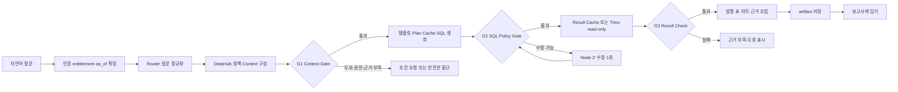

# DataHub Core 기반 대화형 데이터 분석·자동 리포팅 서비스 화면설계서

| 항목 | 내용 |
|---|---|
| 문서 설명 | 최종 기획 v1.0, 요구사항정의서 v1.0과 활성 React 목업을 대조해 사용자 경험, IA, 화면·상태·권한·접근성 및 구현 경계를 확정한 화면설계 산출물 |
| 문서 분류 | 산출물 작업본 |
| 버전 | v6.1 |
| 문서 기준일 | 2026-07-30 11:28 |
| 작성·수정 | 송민지·박준희 / 3팀 사용자 요청·Codex 반영 |
| 산출물 번호 | 05 |
| 제출 일자 | 2026-07-24 |
| 대응 템플릿 | 없음 |
| 상태 | 화면설계 최종본 · 구현·API 계약은 Gate별 검증 필요 |
| 프로젝트 적용 사례 | 합성 호텔 운영 환경의 분산 데이터 분석·자동 리포팅 |
| 내용 기준 | `../Answervice_기획서.md` v1.0, `01_요구사항정의서.md` v1.0 |
| 목업 기준 | `../../app/enterprise-react/src` v0.1.0, 2026-07-30 직접 확인 |

> 이 문서는 실제 워커힐 데이터나 개인정보를 사용하지 않는다. 화면의 업무 데이터는 `synthetic`으로 표시하고 seed와 schema version을 함께 노출한다. 현재 React 목업의 연결 상태, 분석 결과, Tool, 모델 정보는 정적 fixture이며 DataHub·Trino·DB·RunPod·MCP·ONNX의 실제 연동 완료 근거가 아니다.

## 1. 화면설계 개요

### 1.1 목적

본 서비스는 호텔 내 분산된 운영 데이터와 메타데이터를 연결하고, 결정론적 Controller와 역할 분리 LLM Node를 통해 자연어 질문을 검증된 데이터 분석과 반복 가능한 보고서로 전환한다. 화면은 단순 DB 조회 콘솔이 아니라 다음 의사결정 흐름을 지원한다.

1. 사용자가 자연어로 질문한다.
2. 시스템이 권한, 기준 시각, 관련 DataHub 자산, 지표, 공통키와 허용 JOIN을 확정한다.
3. 검증된 read-only SQL만 Trino에서 실행한다.
4. 결과를 표·차트·근거·한계와 함께 설명한다.
5. 사용자가 분석 산출물을 보고서 블록으로 재사용한다.
6. 관리자는 보고서 정의와 실행 결과를 구분해 검토·승인·수동 실행하고, 안정화된 정의만 스케줄링한다.
7. 데이터·시스템 관리자는 소스 연결, 자산, Context release, 요청 trace와 정책 적용 상태를 확인한다.

### 1.2 제품 원칙

| 원칙 | 화면 적용 |
|---|---|
| 근거 우선 | 결과 가까이에 데이터셋, 지표, 필터, 기간, `as_of`, 출처와 부분 실패를 표시한다. |
| 결정론적 통제 | LLM이 아닌 Controller와 G1·G2·G3가 순서와 합격 여부를 결정한다. |
| 역할 분리 | Node 1은 질문 정규화, Node 2·2′는 SQL 생성·1회 수정, Node 3은 검증 결과 설명만 담당한다. |
| read-only 실행 | 자유 SQL 편집·실행 UI를 제공하지 않으며 관리자도 검증 정보만 열람한다. |
| 정의와 실행 분리 | Report Definition, Report Run, Block Run을 구분해 과거 결과를 재현한다. |
| 합성 데이터 진실성 | 실제 기업 연결·실데이터·실성과로 오인할 표현을 사용하지 않는다. |
| 단계적 확장 | P2 Tool·RAG·ML 및 고객 360은 현재 요구사항 범위에서 제외하며 R1 편입 승인 전 route와 메뉴를 노출하지 않는다. |

### 1.3 범위와 우선순위

| 우선순위 | 화면 범위 | 완료 기준 |
|---|---|---|
| P0 사용자 MVP | 분석 챗, 결과·근거·표·차트, 챗→보고서, 보고서 목록·12-column 편집·미리보기·수동 실행 | 대표 질문이 올바른 결과 또는 안전한 중단으로 종료되고 `artifact_id`가 보고서까지 보존됨 |
| P0 운영 MVP | 인증 경계, 역할·정책 표시, 최소 운영·감사, 보고서 실행 이력 | 성공 요청의 request→context→query→artifact trace를 재구성함 |
| P1 사용자·관리 | 데이터 카탈로그, 커넥션 상태, DataHub 자산 검색, Context·정책 승인 정보 | 5개 논리 소스와 자산·URN·Trino FQN의 연결을 확인함 |
| P2 제외 | MCP·문서 RAG·ML-as-a-Tool·외부 Report 배포 | R1 편입 결정, 요구사항·WBS·실행 묶음 갱신 전 route·메뉴·worker·dependency 비활성 |
| 선택 제외 | 고객 360 | identity mapping·masking·전용 권한·일정 영향 승인 전 route와 메뉴 비활성 |
| 범위 밖 | VOC·외부 리뷰·감성분석, 외부 고객 챗, 실시간 스트리밍, 자동 조치, 자유 SQL 콘솔 | 별도 사업 범위로 관리함 |

DataHub ingestion과 API 연동은 카탈로그 화면의 P1 분류와 별개로 P0 분석 기능의 기술 선행 조건이다.

### 1.4 설계 상태 용어

| 상태 | 의미 |
|---|---|
| `목표 설계` | 최종 기획 v1.0에 따라 구현해야 하는 화면 또는 동작 |
| `현재 목업` | `app/enterprise-react/src`에 정적 화면 또는 local interaction 코드가 존재함 |
| `부분 정합` | 레이아웃은 활용할 수 있으나 데이터·권한·상태·용어 계약을 바꿔야 함 |
| `미구현` | API, DB, 모델, 저장 또는 실제 상태 전이가 연결되지 않음 |
| `범위 제외` | 현재 목업이 있어도 R1 편입 승인 전 route·메뉴·구현 계약에서 제외함 |
| `구현 차이` | 확정 목표 설계와 현재 정적 목업의 route·상태·데이터 계약이 다름 |

### 1.5 기준 문서 정합성과 적용 결정

`01_요구사항정의서.md` v1.0이 최종 기획 v1.0의 P0/P1/P2 경계를 75개 영구 ID로 구조화했으므로 본 문서의 화면 범위와 수용 기준은 두 문서에 동기화한다. 실제 목업은 레이아웃·상호작용 참고 근거이며 구현 완료나 route 승인 근거가 아니다.

| 항목 | 확정 적용 | 현재 목업 차이 | 처리 |
|---|---|---|---|
| 핵심 흐름 | 자연어 질문→Context/Gate→Trino→결과·근거→Artifact→Report | 분석 단계와 결과가 정적 fixture | typed 상태·오류·evidence 계약으로 교체 |
| 데이터 계층 | 5개 논리 소스·4종 엔진, DataHub URN, Trino FQN | 7개/8개 시스템과 ONNX·DuckDB 등 데모 표현 혼재 | 기획 registry와 합성 버전으로 통일 |
| 보고서 | definition·version·run·block run 분리, 12-column, 수동 실행 후 schedule | 목록과 2열 local editor가 한 route·state에 존재 | 독립 route와 서버 계약으로 분리 |
| 운영·감사 | request→context→query→artifact/report trace | 화면 없음 | P0 운영 화면 신설 |
| P2·고객 360 | 요구사항상 기본 제외 | `/catalog/tools`, `/customers` 직접 접근 가능 | 메뉴·route 차단 후 목업 코드만 보존 |

## 2. 사용자와 권한

### 2.1 사용자 역할

| 역할 | 주요 목적 | 주요 화면 | 허용 동작 |
|---|---|---|---|
| 일반 사용자 | 질문, 결과·근거 확인, 보고서 블록 전달 | 분석 챗, 허용 보고서 | 질문·후속 질문, 표·차트 탐색, `보고서에 담기` |
| 관리자 | 정의 편집, 승인, 실행·스케줄 관리 | 보고서 전체, 분석 챗 | 블록 편집·승인, 수동 실행, Gate 통과 후 스케줄 활성화 |
| 데이터·시스템 관리자 | 소스·자산·Context·정책·trace 상태 확인 | 데이터 카탈로그, 운영·감사 | 연결 상태 조회, 자산 검색, Context release·정책·request 확인 |
| 감사자 | 권한·정책·실행 증적 검토 | 운영·감사 | 읽기 전용 검색·내보내기 |
| 선택 범위 사용자 | 편입 승인 후 마스킹 고객 분석 | 고객 360 | 현재 범위에서는 접근 불가 |

내부 role 식별자와 사용자·그룹 mapping은 I1의 versioned `access-policy.yaml` 및 DB migration에서 확정한다. 화면은 유효 role과 policy version을 읽기 전용으로 보여주며 사용자가 자신의 role을 바꾸는 기능은 제공하지 않는다.

### 2.2 권한 표시 원칙

- 권한 밖 메뉴는 숨기고 직접 URL 접근은 서버에서 다시 거부한다.
- 권한 거부 시 요청 역할, 허용 범위, 안전한 사유, 돌아갈 화면을 제공한다.
- 데이터셋·컬럼·row filter·column mask 적용 상태를 근거 패널에 표시한다.
- 일반 사용자는 SQL보다 업무 지표와 데이터 출처를 우선 본다.
- 관리자용 SQL·AST·EXPLAIN은 별도 권한과 retention 정책 아래 접어서 표시한다.
- 원문 credential, DB 오류, stack trace, 내부 정책 상세, 모델 CoT는 화면에 노출하지 않는다.

## 3. 정보 구조(IA)

### 3.1 목표 IA

```text
대화형 데이터 분석·자동 리포팅 서비스
├─ 인증
│  └─ 로그인·유효 역할 확인
├─ 분석 챗                                      P0
│  ├─ 대화 목록·추천 질문
│  ├─ 처리 상태·모호성 재질문
│  ├─ 결과 요약·표·차트
│  ├─ 데이터 근거·기준 시각·부분 실패
│  └─ 보고서에 담기
├─ 보고서                                       P0
│  ├─ 일간·주간·월간 목록
│  ├─ 12-column 블록 에디터·AI assistant
│  ├─ 정의 미리보기·승인·수동 실행·스케줄
│  └─ Report Run·Block Run 이력
├─ 데이터 카탈로그                              P1 화면 / P0 기술 선행
│  ├─ 소스 연결 상태
│  ├─ DataHub 자산 검색·상세·lineage
│  ├─ 지표·시간·dimension·JOIN 정책
│  ├─ Context release·Trino FQN mapping
│  └─ Tool 관리                                 현재 범위 제외
├─ 운영·감사                                    P0 운영
│  ├─ 유효 role·policy version
│  ├─ request trace
│  ├─ 마스킹·오류·보존 상태
│  └─ backup·restore 상태
└─ 범위 제외 route
   ├─ Tool 관리                                 R1 편입 전 차단
   └─ 고객 360                                  R1 편입 전 차단
```

별도 통합 관제, 현황 맵, 내부 리뷰 데이터, 독립 온톨로지 맵은 목표 IA에 포함하지 않는다. 현재 목업의 `/catalog/ontology`는 자산 상세의 lineage·Context 관계로 흡수한다. MCP Tool·고객 360은 승인 전 메뉴와 직접 route를 모두 차단한다.

### 3.2 라우트 계약

| 우선순위 | 경로 | 화면 ID | 현재 코드 | 목표 |
|---|---|---|---|---|
| P0 | `/login` | `SCR-AUTH-001` | 없음 | 인증·유효 role·합성 환경 고지 |
| P0 | `/agent` | `SCR-CHAT-001` | 있음 | 메인 분석 챗의 기본 진입 경로 |
| P0 | `/reports` | `SCR-RPT-001` | 있음 | 일·주·월 정의와 최근 실행 목록 |
| P0 | `/reports/:reportId` | `SCR-RPT-002` | 내부 state | 정의·실행 상태·미리보기 독립 URL |
| P0 | `/reports/:reportId/edit` | `SCR-RPT-003` | 내부 state | 12-column 블록 에디터 독립 URL |
| P0 | `/reports/:reportId/runs` | `SCR-RUN-001` | 없음 | 실행 이력과 블록별 상태 |
| P0 | `/reports/:reportId/runs/:runId` | `SCR-RUN-002` | 없음 | 실행 snapshot·출처·오류 상세 |
| P1 | `/catalog` | `SCR-CAT-001` | 있음 | 연결 요약·자산 검색 허브 |
| P1 | `/catalog/assets/:assetId` | `SCR-AST-001` | 없음 | URN·schema·owner·tag·lineage·Trino mapping |
| P1 | `/catalog/connections` | `SCR-CONN-001` | `/connections` | 소스별 ingestion·catalog 상태; 기존 경로 redirect 검토 |
| P1 | `/catalog/context` | `SCR-CTX-001` | 없음 | 지표·시간·dimension·JOIN·release 확인 |
| P0 운영 | `/operations/audit` | `SCR-AUD-001` | 없음 | role·policy·request 검색 |
| P0 운영 | `/operations/audit/:requestId` | `SCR-AUD-002` | 없음 | context→SQL→query→artifact trace |
| 범위 제외 | `/catalog/tools` | 없음 | 정적 목업 | R1 편입 승인 전 404/권한 거부, 메뉴 미노출 |
| 범위 제외 | `/customers` | 없음 | 있음 | R1 편입 승인 전 404/권한 거부, 메뉴 미노출 |
| 목표 IA 제외 | `/catalog/ontology` | 없음 | 정적 목업 | `/catalog/assets/:assetId`의 lineage·Context 관계로 흡수 |

`/`는 인증된 사용자를 `/agent`로, 비로그인 사용자를 `/login`으로 보낸다. 존재하지 않는 경로를 분석 챗으로 조용히 전환하지 않고 404와 허용 메뉴를 제공한다.

## 4. 핵심 사용자 흐름

### 4.1 분석 챗 Golden Path



Fast Path와 Cache Hit도 권한과 Gate를 생략하지 않는다. 화면에는 내부 모델 추론이 아니라 사용자에게 필요한 진행 단계, 현재 조건, 안전한 오류만 표시한다.

### 4.2 모호·오류 흐름

1. 기간, 대상, 지표 또는 등급 기준이 모호하면 답을 추측하지 않고 수정 가능한 입력을 요청한다.
2. G1 실패는 필요한 조건, 권한 또는 Context 상태를 알려주고 SQL을 생성하지 않는다.
3. G2 실패는 쓰기·금지 자산·허용되지 않은 JOIN 등 안전한 범주만 보여준다.
4. Node 2′ 재검증도 실패하면 반복하지 않고 종료한다.
5. Trino 실패는 raw DB error 대신 `trace_id`, 안전한 오류 범주, 재시도 가능 여부를 표시한다.
6. G3 실패 또는 증거 부족이면 Node 3 설명과 보고서 삽입을 차단한다.

### 4.3 챗↔보고서 왕복

```text
검증된 분석 결과
→ artifact_id와 질문·필터·기간·출처 확인
→ 보고서와 삽입 위치 선택
→ 사용자 승인
→ 새 블록 초안 생성
→ 블록 편집·미리보기
→ 정의 승인·수동 실행
→ 안정성 Gate 통과 후 스케줄 활성화
```

보고서→챗은 블록 조건을 새 대화로 복사하고 원본 블록을 변경하지 않는다. 변경된 분석을 반영할 때는 새 블록 또는 명시적 교체 승인을 사용한다.

### 4.4 소스 온보딩·근거 추적

```text
소스별 ingestion 실행
→ 연결 상태 확인
→ DataHub 자산 검색
→ URN과 Trino FQN mapping 확인
→ 지표·공통키·JOIN·시간 정책 결합
→ Context release publish
→ 대표 질문 수동 검증
→ 분석 결과 출처에서 동일 자산 확인
```

커넥션 등록은 credential 입력만으로 완료되지 않는다. 목표 엔진의 ingestion·connector·driver, 읽기 권한, 타입, 공통키와 정책 등록이 모두 필요하다.

## 5. 공통 레이아웃과 디자인 시스템

### 5.1 공통 프레임

| 영역 | 구성 | 동작 |
|---|---|---|
| 사이드바 | 서비스 워드마크, 분석 챗, 보고서, 데이터 카탈로그, 운영·감사, 선택 메뉴 | 현재 메뉴 강조, 권한·단계별 메뉴 노출, 모바일 drawer |
| 상단 헤더 | 화면명, 한 줄 설명, 환경 상태, 알림, 사용자 | sticky, 긴 제목 한 줄 우선·공간 부족 시 말줄임 |
| 환경 스트립 | `SYNTHETIC`, seed, schema version, `as_of`, timezone | 업무 결과 화면에서 상시 확인 가능 |
| 본문 | 질문·결과·카드·표·문서 grid | 페이지별 skeleton과 독립 error boundary |
| 상세 패널 | 근거, AI assistant, 기술 trace | desktop 우측 panel, 작은 화면 drawer |
| 상태 피드백 | badge, inline error, toast, empty state | 색상·아이콘·문구를 함께 사용 |

### 5.2 시각 원칙

| 항목 | 기준 |
|---|---|
| 톤앤매너 | 워커힐 계열의 차분한 엔터프라이즈 인상을 참고하되 공식 브랜드 토큰으로 주장하지 않음 |
| 배경 | warm ivory 계열과 white card를 사용해 밀도 높은 표·결과를 구분 |
| 핵심색 | espresso는 구조·주요 행동, muted gold는 선택·강조에 제한적으로 사용 |
| 상태색 | green·amber·coral·blue를 쓰되 항상 아이콘과 텍스트를 병기 |
| 본문 글꼴 | 현재 목업의 `Pretendard, Inter, system-ui` 계열 유지 |
| 제목 글꼴 | 문서형 제목에 serif 사용 가능, 표·입력·상태에는 sans-serif 사용 |
| 글자 크기 | 본문 기본 15~16px, 표 14~15px, 작은 설명 최소 12px; 200% 확대에서 겹침 금지 |
| 정렬 | 헤더·버튼은 세로 중앙 정렬, 수치는 우측, 라벨과 문장은 좌측 정렬 |

공식 워커힐 디자인 토큰과 서체는 권한 있는 자료를 확인한 뒤 별도로 확정한다.

### 5.3 공통 결과 카드 순서

1. 질문과 절대 기간
2. 핵심 요약과 상태
3. KPI·표·차트
4. 데이터셋·지표·필터·JOIN 근거
5. 기준 시각·source watermark·부분 실패
6. 해석과 한계
7. `보고서에 담기`와 후속 질문

P2 결합 답변은 `관측 수치(SQL)`, `문서 사실(RAG)`, `해석`, `모델 예측(ML)`을 시각적으로 분리한다.

## 6. 화면 목록

| 화면 ID | 화면명 | 사용자 | 진입 조건 | 주요 기능 | 관련 요구사항 ID |
|---|---|---|---|---|---|
| `SCR-AUTH-001` | 로그인·유효 역할 | 전체 | 미인증 또는 세션 만료 | 인증, role·policy version, 합성 환경 고지 | REQ-F-001~002, REQ-S-001~002 |
| `SCR-CHAT-001` | 분석 챗 | 일반 사용자·관리자 | 인증·질문 권한 | 질문, Controller 상태, 결과·근거, 후속 질문, 보고서 전달 | REQ-F-003~010, REQ-AI-001~009, REQ-UI-003·007 |
| `SCR-RPT-001` | 보고서 목록 | 일반 사용자·관리자 | 보고서 조회 권한 | 일·주·월 정의, 상태, 최근 실행, 생성 | REQ-RPT-001·005·010, REQ-UI-004 |
| `SCR-RPT-002` | 보고서 상세·미리보기 | 관리자 | definition 조회·승인 권한 | 정의 버전, 블록 미리보기, 승인, 수동 실행, 스케줄 | REQ-RPT-001·005~006·009 |
| `SCR-RPT-003` | 12-column 블록 에디터 | 관리자 | 편집 가능한 DRAFT | drag·resize, AI assistant, Artifact 삽입, 저장 | REQ-RPT-002~004, REQ-UI-008~009 |
| `SCR-RUN-001` | 보고서 실행 이력 | 관리자 | run 조회 권한 | run 상태·`as_of`·정의 버전·block 성공/실패 | REQ-RPT-006~010 |
| `SCR-RUN-002` | 보고서 실행 상세 | 관리자·감사자 | run 상세 권한 | snapshot, checksum, source, 재실행, 부분 실패 | REQ-RPT-006~008, REQ-S-003 |
| `SCR-CAT-001` | 데이터 카탈로그 허브 | 데이터·시스템 관리자 | 자산 조회 권한 | 5개 source 상태, 자산 검색, 요약 지표 | REQ-D-002·005, REQ-UI-005 |
| `SCR-AST-001` | 데이터 자산 상세 | 데이터·시스템 관리자 | asset 권한·active mapping | URN, schema, owner, tag, lineage, Trino mapping | REQ-D-005·007·011, REQ-AI-001~002 |
| `SCR-CONN-001` | 연결 상태 | 데이터·시스템 관리자 | connection 조회 권한 | engine, ingestion, catalog, owner, 오류 | REQ-D-002~003·010, REQ-O-001 |
| `SCR-CTX-001` | Context·정책 | 데이터·시스템 관리자 | Context 조회 권한 | metric, time, dimension, JOIN, release, approval | REQ-D-008~009, REQ-AI-001~003 |
| `SCR-AUD-001` | 운영·감사 검색 | 데이터·시스템 관리자·감사자 | 감사 조회 권한 | role·policy, request 검색, retention·backup | REQ-S-003~005, REQ-O-002·004 |
| `SCR-AUD-002` | 요청 trace 상세 | 데이터·시스템 관리자·감사자 | request 상세 권한 | context→model/policy→query→artifact/report | REQ-AI-009, REQ-S-003, REQ-O-002 |

## 7. 화면별 구성 요소와 동작

### 7.1 `SCR-AUTH-001` 로그인·유효 역할

| 영역 ID | UI 요소 | 입력·출력 | 동작·상태 | 접근성 | API 경계 |
|---|---|---|---|---|---|
| `AUTH-01` | 서비스·환경 안내 | 서비스 정의, `SYNTHETIC` | 실제 기업 서비스 오인 방지 | 텍스트 로고와 설명 | 인증 전 정적 정보 |
| `AUTH-02` | 로그인 폼 | 사용자 식별자·인증정보 | 중복 제출 차단, 실패 사유 안전 표시 | label·오류 연결, `aria-live` | SSO 확장 가능한 인증 경계 |
| `AUTH-03` | 유효 역할 | role, group, policy version | 서버 결과 확인만 가능 | 정의 목록 | role mapping 조회 |
| `AUTH-04` | 시작 | 인증 결과 | 성공 시 `/agent` | 진행 상태 문구 | session/token 방식 미확정 |

### 7.2 `SCR-CHAT-001` 분석 챗

| 영역 ID | UI 요소 | 입력·출력 | 동작·상태 | 접근성 | API 경계 |
|---|---|---|---|---|---|
| `CHAT-01` | 대화 목록 | 제목, 최근 시각, 상태 | 새 대화·이력 전환 | 현재 대화 `aria-current` | conversation 조회 |
| `CHAT-02` | 추천 질문 | 역할·도메인별 예시 | 입력란에 채우기; 자동 실행 안 함 | 버튼 목적 명시 | 추천 규칙 |
| `CHAT-03` | 질문 입력 | 자연어, 선택 조건 | 제출·취소, 동시 2건 초과 대기/429 | label, Enter/버튼 동등 | request 생성 |
| `CHAT-04` | 조건 재질문 | 기간·대상·지표·기준 선택 | 수정 후 같은 request 흐름 재개 | 오류 요약과 field 연결 | G1 결과 |
| `CHAT-05` | 진행 상태 | Router, Context, G1, SQL, G2, 조회, G3, 설명 | 완료 단계와 현재 단계 갱신 | ordered list, `aria-live` | request polling/stream |
| `CHAT-06` | 결과 요약 | 검증된 shaped result | 0건·빈 결과·부분 실패 구분 | 제목 계층 | artifact 응답 |
| `CHAT-07` | KPI·표·차트 | 단위·축·범례·표본 | chart 실패 시 표 유지 | 표·텍스트 대체 | chart spec·result |
| `CHAT-08` | 근거 패널 | dataset URN, metric, filter, period, JOIN, `as_of`, watermark | 자산 상세·trace 이동 | drawer에서도 focus 유지 | evidence·asset |
| `CHAT-09` | 설명·한계 | 관측 결과, 해석, 근거 부족 | 인과 단정 금지 | 구획 제목 | Node 3 output |
| `CHAT-10` | 후속 행동 | 후속 질문, SQL 보기, 보고서에 담기 | SQL은 권한 사용자만 read-only; artifact 선택 | 버튼 상태 설명 | artifact·report |

일반 사용자의 진행 문구는 `질문 해석 → 데이터 근거 확인 → 안전성 검증 → 데이터 조회 → 결과 검증 → 설명 생성`으로 표현한다. Node와 Gate 기술명은 상세 보기에서만 제공한다.

### 7.3 `SCR-RPT-001` 보고서 목록

| 영역 ID | UI 요소 | 입력·출력 | 동작·상태 | 접근성 | API 경계 |
|---|---|---|---|---|---|
| `RPL-01` | 새 보고서 | 제목, 일·주·월, timezone | definition 초안 생성 | dialog focus 관리 | report definition 생성 |
| `RPL-02` | 필터 | 주기, 소유자, 상태 | URL query와 동기화 | label·결과 수 | definition 목록 |
| `RPL-03` | 목록 | 제목, 주기, owner, version, schedule, 최근 run·상태 | 상세·편집·이력 진입 | table header, 행별 동작 | definition+latest run |
| `RPL-04` | 상태 범례 | 초안·승인됨·실행 중·성공·부분 성공·실패 | 설명 펼치기 | 색상 외 문구 | 정적 계약 |
| `RPL-05` | 빈 상태 | 권한 내 보고서 0건 | 새 보고서 또는 필터 초기화 | 명확한 제목 | 없음 |

### 7.4 `SCR-RPT-003` 12-column 블록 에디터

| 영역 ID | UI 요소 | 입력·출력 | 동작·상태 | 접근성 | API 경계 |
|---|---|---|---|---|---|
| `RPE-01` | 보고서 메타 | 제목, 주기, owner, version, timezone | 초안 값 수정 | field label | definition 조회·저장 |
| `RPE-02` | 블록 라이브러리 | 텍스트, KPI, 표, 차트 | grid에 새 블록 추가 | 키보드 `추가` 제공 | block definition |
| `RPE-03` | 12-column canvas | `x`, `y`, `w`, `h`, 순서 | drag, resize, 충돌 없는 직렬화 | 이동·폭·높이 버튼 대안 | layout 저장 |
| `RPE-04` | 블록 설정 | 제목, artifact, 질문, filter, display | 편집·복제·삭제 | 삭제 확인·focus 복귀 | block 저장 |
| `RPE-05` | AI assistant | 데이터 검색, 질문, 챗 결과 가져오기 | 출처 미리보기 후 삽입 승인 | 결과 요약과 취소 | artifact 검색·생성 |
| `RPE-06` | 변경 비교 | 이전·이후 요약 | 기존 블록 교체 승인; 자동 덮어쓰기 금지 | 차이 문장 제공 | block version |
| `RPE-07` | 저장 상태 | 저장 중·저장됨·충돌·실패 | 자동·수동 저장 | `aria-live` | optimistic concurrency |
| `RPE-08` | 미리보기 | desktop·작은 화면 순서 | 정의 상세로 이동 | 읽기 순서 유지 | preview |

기존 정기 보고서의 경영진 결론, 결정 안건, 운영 대응 검토, 성과, 주요 이슈, 호텔 비교, 실행 과제, 전망 시나리오는 초기 템플릿 콘텐츠로 유지한다. 각 항목은 독립 Block Definition으로 변환하고 검증된 artifact를 참조한다.

### 7.5 `SCR-RPT-002` 보고서 상세·미리보기

| 영역 ID | UI 요소 | 입력·출력 | 동작·상태 | 접근성 | API 경계 |
|---|---|---|---|---|---|
| `RPD-01` | 정의 헤더 | 주기, owner, version, 마지막 run, 전체 상태 | version 전환 | 문서 제목 구조 | definition 조회 |
| `RPD-02` | grid 미리보기 | text·KPI·table·chart block | 각 블록 출처 열기 | 모바일 읽기 순서 유지 | definition+artifact |
| `RPD-03` | 영향 범위 | 변경 block, context/policy 영향 | 승인 전 확인 | 목록 구조 | version diff |
| `RPD-04` | 정의 승인 | 초안→승인됨 | 권한 확인·감사 기록 | confirm dialog | approval 저장 |
| `RPD-05` | 수동 실행 | 승인 정의·하나의 `as_of` | 실행 시작·상태 이동 | 진행 안내 | report run 생성 |
| `RPD-06` | 스케줄 | 활성/비활성, 일·주·월, timezone | 반복 수동 성공·오류 계약 충족 시만 활성 | 비활성 사유 텍스트 | schedule 저장 |
| `RPD-07` | 새 버전 편집 | 최신 definition 복제 | 기존 승인본 불변 | 버튼 목적 명시 | definition version 생성 |

### 7.6 `SCR-RUN-001`·`SCR-RUN-002` 보고서 실행

| 영역 ID | UI 요소 | 입력·출력 | 동작·상태 | 접근성 | API 경계 |
|---|---|---|---|---|---|
| `RUN-01` | 실행 목록 | run ID, trigger, version, `as_of`, 시작·종료, 상태 | 상세 진입·필터 | table header | report run 목록 |
| `RUN-02` | 실행 요약 | 전체 성공·부분 성공·실패 | 마지막 성공값 사용 여부 확인 | 상태 문구 | report run 상세 |
| `RUN-03` | 블록 상태 | block run, query ID, snapshot, checksum, source | 성공 블록·실패 블록 분리 | 행별 상태 읽기 | block run 상세 |
| `RUN-04` | 부분 실패 결정 | stale snapshot 사용 여부 | 사용 여부를 명시적으로 선택 | 경고와 label | run decision |
| `RUN-05` | 수동 재실행 | 전체 또는 허용된 실패 범위 | 같은 정의·새 run 생성 | 중복 방지 | run 생성 |
| `RUN-06` | 근거·trace | asset, policy, query, artifact | 감사 상세 이동 | 링크 목적 명시 | audit trace |

### 7.7 `SCR-CAT-001` 데이터 카탈로그 허브

| 영역 ID | UI 요소 | 입력·출력 | 동작·상태 | 접근성 | API 경계 |
|---|---|---|---|---|---|
| `CAT-01` | 메타데이터 흐름 | 5개 source→DataHub/Context→Trino→Chat/Report | 역할 경계 설명 | 좌→우 텍스트 순서 | 설명 데이터 |
| `CAT-02` | 요약 | source 5, 정상/지연/오류, asset, context release | 상태 필터로 이동 | 수치+항목명 | ingestion·catalog 요약 |
| `CAT-03` | 연결 상태 | logical source, engine, ingestion, Trino catalog, owner, error | 연결 화면 이동 | fixed header·가로 스크롤 | connection 상태 |
| `CAT-04` | 자산 검색 | keyword, domain, platform instance, owner, tag | 결과 필터·상세 진입 | 검색 label·결과 수 | DataHub Search API |
| `CAT-05` | 데이터 제품·자산 | URN, schema, source, owner, freshness, quality | 자산 상세 | 표 caption | DataHub API |
| `CAT-06` | Context 요약 | metric, JOIN, time policy, active release | Context 화면 이동 | 정의 목록 | Context registry |
| `CAT-07` | 탭 | 카탈로그·연결·Context·Tool(P2) | P2 전 Tool 탭 비노출 | 현재 탭 명시 | route 권한 |

현재 목업의 Trino·DuckDB 병기 중 목표 실행 엔진은 Trino다. DuckDB는 최종 기획의 제품 경로가 아니므로 UI와 데이터에서 제거 대상이다. 화면 수치는 실제 API 연결 전까지 `synthetic fixture`로 표시한다.

### 7.8 `SCR-AST-001` 데이터 자산 상세

| 영역 ID | UI 요소 | 입력·출력 | 동작·상태 | 접근성 | API 경계 |
|---|---|---|---|---|---|
| `AST-01` | 자산 식별 | DataHub URN, platform instance, domain | 복사·원본 DataHub 이동 | 복사 결과 안내 | DataHub API |
| `AST-02` | schema | column, type, description, sensitivity | 검색·접기 | table header | schema 조회 |
| `AST-03` | 소유·품질 | owner, tag, freshness, quality | 담당·상태 확인 | 색상 외 상태 | metadata 조회 |
| `AST-04` | lineage | upstream·downstream | 관계 상세 | 목록 대체 | Graph API |
| `AST-05` | 실행 mapping | Trino `catalog.schema.table`, active | Context 화면 이동 | code와 설명 | asset binding |
| `AST-06` | 승인 관계 | metric, join policy, role | 읽기 전용 확인 | 정의 목록 | Context registry |

### 7.9 `SCR-CONN-001` 연결 상태

| 영역 ID | UI 요소 | 입력·출력 | 동작·상태 | 접근성 | API 경계 |
|---|---|---|---|---|---|
| `CON-01` | 소스 목록 | PMS PostgreSQL, POS MySQL, CRM SQL Server, 시설 ClickHouse, 연회 PostgreSQL | source 상세 전환 | 목록·현재 선택 | connection registry |
| `CON-02` | 연결 정보 | engine/version, platform instance, catalog, masked endpoint | 읽기 전용 확인 | credential 미노출 | config metadata |
| `CON-03` | ingestion | recipe version, run ID, 최근 시각, 자산 수, 상태 | 재수집 요청은 별도 승인 | status `aria-live` | ingestion status |
| `CON-04` | Trino 상태 | catalog, read-only, type mapping, last query check | smoke 결과 확인 | 표 구조 | Trino health |
| `CON-05` | 책임·오류 | owner, error category, retry scope | 안전한 진단 정보 | raw error 미노출 | operation event |

credential 등록·수정·connection test의 쓰기 기능은 인증정보 저장 방식과 승인 절차가 확정된 뒤 추가한다. 목업의 `데이터 소스 연결` 버튼은 그 전까지 비활성 또는 설명용이다.

### 7.10 `SCR-CTX-001` Context·정책

| 영역 ID | UI 요소 | 입력·출력 | 동작·상태 | 접근성 | API 경계 |
|---|---|---|---|---|---|
| `CTX-01` | release | version, hash, approver, published, rollback target | active·과거 version 전환 | version 관계 설명 | context release |
| `CTX-02` | asset binding | URN↔Trino FQN, source version, active | 자산 상세 이동 | 표 header | asset binding |
| `CTX-03` | 지표 | metric ID, aggregation, time field, owner | 정의 확인 | 단위·grain 포함 | metric definition |
| `CTX-04` | 시간·dimension | timezone, calendar, `as_of`, event-time validity | 기간 예시 확인 | 반개구간을 문장으로 설명 | time/dimension policy |
| `CTX-05` | JOIN 정책 | 좌·우 URN/field, cardinality, null, 유효기간, 상태 | 관계 필터 | 표 caption | join policy |
| `CTX-06` | 권한·mask | sensitivity, role, policy ID | 권한 범위 확인 | 실제 값 미노출 | column policy ref |

Context 변경 UI는 P1 초기에는 읽기 전용으로 시작한다. 승인·publish·rollback 동작은 승인 주체와 감사 계약이 구현된 후 활성화한다.

### 7.11 `SCR-AUD-001`·`SCR-AUD-002` 운영·감사

| 영역 ID | UI 요소 | 입력·출력 | 동작·상태 | 접근성 | API 경계 |
|---|---|---|---|---|---|
| `AUD-01` | 검색 | request ID, user, 기간, 상태 | URL query·결과 필터 | label·결과 수 | audit 조회 |
| `AUD-02` | 역할·정책 | user/group, effective role, policy version | 읽기 전용 확인 | 정의 목록 | access policy |
| `AUD-03` | trace timeline | request→time/context→model/policy→query/cache→artifact/report | 단계 상세 펼치기 | ordered list | trace store |
| `AUD-04` | Gate 증적 | G1·G2·G3 result, error category | 권한별 상세 | pass/fail 문구 | gate checkpoint |
| `AUD-05` | 마스킹 | row filter, column mask, redaction 적용 여부 | 적용 증적 확인 | 원문 값 미노출 | query evidence |
| `AUD-06` | 보존·백업 | retention, latest backup, restore test, RPO/RTO | 운영 상태 확인 | 시간 절대값 제공 | operation status |
| `AUD-07` | JSON export | trace metadata | 권한·감사 후 내보내기 | 완료 안내 | export |

### 7.12 범위 제외 목업 — Tool 관리

| 영역 ID | UI 요소 | 입력·출력 | 동작·상태 | 접근성 | API 경계 |
|---|---|---|---|---|---|
| `TOOL-01` | Tool 목록 | name, type, semantic version, owner, active, health | 유형·상태 필터 | table header | registry 조회 |
| `TOOL-02` | 계약 | input/output JSON Schema, transport, endpoint, timeout, retry | schema 펼치기 | code 설명 | registry 상세 |
| `TOOL-03` | 안전 | required role, read-only/destructive/idempotent hint | 활성 조건 확인 | 경고 문구 | policy 조회 |
| `TOOL-04` | 실행 이력 | caller, input hash, status, latency, recent error, version | 감사 상세 이동 | 실제 입력값 최소화 | tool audit |
| `TOOL-05` | 활성화 | on/off | 관리자 권한·확인·감사 기록 | 비활성 사유 | registry 변경 |

현재 `/catalog/tools` 목업은 구현 참고 자료로만 보존한다. REQ-SCP-001에 따라 R1 편입 전 메뉴·route·registry 변경을 활성화하지 않으며 공식 화면 ID를 부여하지 않는다.

### 7.13 범위 제외 목업 — 고객 360

| 영역 ID | UI 요소 | 입력·출력 | 동작·상태 | 접근성 | API 경계 |
|---|---|---|---|---|---|
| `C360-01` | 고객 검색 | 마스킹 식별자 | 승인 범위의 고객 전환 | label·결과 수 | identity 조회 |
| `C360-02` | 프로필 | 합성·마스킹 정보, 등급 기준 시각 | PII 없는 요약 | 정의 목록 | CRM/PMS shaped view |
| `C360-03` | 활동 | 예약·투숙·F&B·시설·연회 타임라인 | source·기간 필터 | 시간순 목록 | federated result |
| `C360-04` | 파생 지표 | 매출·이용·등급 이력 | 근거 자산 이동 | 단위·기간 | artifact |
| `C360-05` | 내부 분석 챗 | 고객 scope가 고정된 질문 | 권한·mask 적용 분석 | scope 안내 | chat request |

현재 `/customers` 목업은 구현 참고 자료로만 보존한다. REQ-SCP-002에 따라 identity mapping·masking·전용 권한·일정 영향 승인 전 메뉴와 직접 route를 차단하며 공식 화면 ID를 부여하지 않는다. 외부 고객 챗, 자동 메시지와 자동 보상은 포함하지 않는다.

## 8. 상태·오류·빈 값 계약

### 8.1 공통 상태

| 상태 | 표시 기준 | 사용자 동작 |
|---|---|---|
| `LOADING` | 대상 명칭이 있는 skeleton 또는 progress | 중복 제출 방지, 가능한 경우 취소 |
| `EMPTY` | 데이터 0건과 조건을 함께 표시 | 필터 수정·새 질문 |
| `READY` | 조회·표시 가능한 상태 | 분석 또는 편집 진행 |
| `DELAYED` | ingestion·source·요청 지연 | 최근 정상 시각과 재시도 범위 확인 |
| `PARTIAL` | 일부 source·block만 성공 | 성공 범위와 실패 범위, stale 사용 여부 확인 |
| `ERROR` | 안전한 오류 범주와 `trace_id` | 허용된 재시도 또는 관리자 문의 |
| `FORBIDDEN` | 역할·자산·동작 권한 없음 | 허용 화면으로 이동 |
| `INSUFFICIENT_EVIDENCE` | G1·G3 근거 부족 | 조건 보완; 보고서 삽입 차단 |

### 8.2 분석 처리 상태

| 사용자 표시 | 내부 checkpoint | 실패 시 |
|---|---|---|
| 요청 준비 | 인증·entitlement·`as_of` | 인증 또는 권한 안내 |
| 질문 해석 | Router·Node 1 | 필요한 조건 재질문 |
| 데이터 근거 확인 | Context Builder·G1 | Context·권한·기간 보완 |
| 안전성 검증 | SQL source·G2·G2′ | 1회 수정 후 안전한 중단 |
| 데이터 조회 | Result Cache·Trino·Shaper | timeout·source 오류·부분 실패 |
| 결과 검증 | G3 | 설명·보고서 삽입 차단 |
| 설명 생성 | Node 3·chart spec | 검증 수치는 유지하고 설명만 `PARTIAL` |
| 산출물 저장 | artifact | 저장 실패 시 재시도, 중복 방지 |

### 8.3 보고서 상태

| 상태 | 의미 | 허용 동작 |
|---|---|---|
| `DRAFT` | 편집 중인 definition version | 편집·미리보기·승인 요청 |
| `APPROVED` | 실행 가능한 불변 definition version | 수동 실행·새 version 생성 |
| `RUNNING` | 하나의 `as_of`로 block 실행 중 | 상태 확인·허용 시 취소 |
| `SUCCESS` | 모든 block 성공 | snapshot 열람·스케줄 안정성 근거 |
| `PARTIAL_SUCCESS` | 일부 block 실패 | 실패·stale 사용 여부 확인·재실행 |
| `FAILED` | 유효한 보고서 결과 생성 실패 | 오류 확인·수동 재실행 |

## 9. 접근성 및 반응형

### 9.1 접근성

- 모든 입력은 시각적 label과 프로그램적 이름을 가진다.
- 상태·증감·위험은 색상 외에 아이콘, 문구, 부호를 사용한다.
- 표는 caption·header·단위를 제공하고 긴 표는 container 내부에서만 가로 스크롤한다.
- 차트는 같은 결과의 표 또는 핵심 수치 요약을 제공한다.
- 비동기 진행·저장·오류는 `aria-live`로 전달하되 과도한 반복을 피한다.
- drawer·dialog는 focus trap, Escape, 닫은 뒤 focus 복귀를 지원한다.
- 블록 에디터는 drag·resize 외에 위·아래 이동, 폭·높이 단계 조절 버튼을 제공한다.
- 200% 확대에서 워드마크, 헤더, 버튼, 표가 겹치지 않는다.
- `prefers-reduced-motion`에서는 페이지 전환·progress animation을 줄인다.

### 9.2 반응형

| 구간 | 레이아웃 기준 |
|---|---|
| `1440px 초과` | sidebar 고정, Chat 3영역, Report canvas+assistant, 감사 timeline+detail |
| `1025~1440px` | Chat 근거 또는 Report assistant 폭 축소, 표 container scroll |
| `769~1024px` | sidebar drawer, 우측 panel drawer, 보고서 12-column은 6-column 환산 |
| `768px 이하` | 단일 열, grid의 원래 읽기 순서 유지, 핵심 행동 sticky footer 검토 |

작은 화면에서도 근거와 블록 실패 상태를 숨기지 않는다. 보고서 block은 `y`, `x` 순서로 재배치하고 임의로 중요도를 바꾸지 않는다.

## 10. 데이터·API·보안 표시 기준

### 10.1 현재 목업 데이터

| 항목 | 현재 값 | 해석 |
|---|---|---|
| seed | `20260727` | 정적 목업 fixture 재현 값 |
| schema version | `enterprise-demo-v1` | 최종 기획의 5-source schema 계약과 별개 |
| 데이터 | `enterpriseDemoData.js` 정적 배열 | DataHub·Trino·DB 연결 없음 |
| 상태 변경 | React local state | 새로고침 후 보존되지 않음 |
| connector·Tool·model | 정적 표시 | 실제 health·호출·서빙 결과 아님 |

목표 합성 데이터는 source별 schema version과 seed를 기록하고, 5개 논리 DB·4종 엔진·CRM identity bridge·회원 등급 이력의 참조 무결성을 검증해야 한다.

### 10.2 API·상태 경계

| 경계 | 프론트 책임 | 서버 책임 | 현재 상태 |
|---|---|---|---|
| 인증·권한 | 유효 role·거부·policy version 표시 | 사용자 식별, entitlement, session·token | 미연결 |
| 분석 request | 질문, 진행·결과·오류·근거 렌더링 | Controller, Context, Gate, Cache, Trino, artifact | 미연결 |
| 보고서 | definition 편집, run·block 상태 표시 | version, approval, snapshot, schedule, audit | 미연결 |
| 카탈로그 | 검색·상태·mapping 표시 | DataHub API, ingestion, Context registry | 미연결 |
| 운영·감사 | 검색·timeline·export | checkpoint, trace, retention, backup status | 미연결 |
| P2 Tool | contract·health·result type 표시 | registry, authz, call, audit | 미연결 |

개별 endpoint와 payload는 OpenAPI 계약 확정 전 임의로 만들지 않는다. 장시간 요청은 `request_id` 또는 `run_id`로 조회하고, 프론트는 서버 상태와 보고서 편집 상태를 분리한다.

### 10.3 보안·감사

- 브라우저, 모델 입력, 결과, 로그, 보고서에 실제 직접식별정보와 secret을 넣지 않는다.
- source 계정과 Trino는 read-only로 제한하고 SQLGlot 정책과 중첩 적용한다.
- 일반 사용자에게 procedure, passthrough, `system` catalog, 자유 SQL 실행을 제공하지 않는다.
- cache 결과도 entitlement, `as_of`, policy, source watermark와 mask를 재확인한다.
- 감사 화면은 최소 `conversation_id`, `request_id`, user, entitlement hash, route, `as_of`, Context release, policy, model, Gate, query/cache, artifact를 연결한다.
- raw DB error, stack, 내부 policy 상세와 모델 CoT는 안전한 오류 계약으로 치환한다.

## 11. 추적성과 수용 기준

### 11.1 기획·요구사항 추적표

| 기획·요구사항 | 적용 화면 | UI 수용 기준 |
|---|---|---|
| §4·REQ-F-003~010 | 분석 챗, 보고서 | 질문→근거→Artifact→보고서 흐름 또는 안전한 중단을 완료함 |
| §5·REQ-SCP-001~003 | 전체 IA | P0/P1만 노출하고 P2·고객 360·외부 배포 route를 차단함 |
| §7·§9·REQ-AI-001~009 | 분석 챗, 감사 | Controller와 G1·G2·G3의 성공·중단·version을 재구성함 |
| §8·REQ-D-002~010 | 카탈로그, 자산, 연결, Context | DataHub URN·Trino FQN·source·시간·JOIN 계약이 일치함 |
| §11·REQ-RPT-001~010 | 보고서 전체 | definition/run 분리, 12-column, Artifact 왕복, 부분 실패를 지원함 |
| §14·REQ-D-001·004 | 전체 | `SYNTHETIC`, seed, schema/scenario version, `as_of`를 표시함 |
| §15·REQ-UI-001~010 | 전체 | 단일 React 앱, 메뉴·상태·접근성·반응형·feature Gate를 충족함 |
| §17·REQ-S-001~005 | 인증, 감사, 전체 | role·mask·trace·retention·backup·export 권한을 확인함 |
| §18·REQ-NFR-005 | 전체 | 필수 30건과 적용 가능한 build·type·contract·E2E 증거를 기록함 |

### 11.2 화면 최종 수용 기준

1. 비로그인·권한 밖 직접 URL 접근을 서버가 거부한다.
2. 모든 업무 결과에 `synthetic`, seed, schema version, `as_of`, timezone을 표시한다.
3. 분석 챗은 모호·권한·금지·근거 부족 질문을 SQL 실행 또는 설명 생성 전에 올바르게 중단한다.
4. 성공 결과는 표·차트·단위·기간·필터·지표·DataHub 자산·source를 연결한다.
5. Cache Hit도 권한과 G2 또는 G3가 생략되지 않았음을 trace에서 확인한다.
6. `보고서에 담기`는 질문·조건·출처를 `artifact_id`로 함께 전달한다.
7. 보고서 편집기는 12-column drag·resize와 키보드 대체 조작을 지원한다.
8. 정의 version, run, block run, snapshot, 부분 실패와 stale 사용 여부를 구분한다.
9. 스케줄은 수동 반복 성공과 오류·권한·시간 기준 Gate 전에는 활성화할 수 없다.
10. 카탈로그는 5개 논리 소스, ingestion, DataHub 자산, Trino catalog, Context release의 관계를 보여준다.
11. 감사 화면은 성공 P0 요청의 request→context→query→artifact/report trace를 재구성한다.
12. 200% 확대, 키보드, 768px 이하에서도 근거·오류·핵심 동작에 접근할 수 있다.

## 12. 현재 React 목업 정합성과 개발 순서

### 12.1 현재 구현 요약

| 현재 경로 | 구현된 골격 | 최종 기획 정합성 | 필요한 변경 |
|---|---|---|---|
| `/agent` | 대화, 정적 5단계 trace, KPI·전략 카드, 데이터 제품, 질문 입력 | 부분 정합 | Router→Context→G1→SQL→G2→Query→G3, typed evidence·오류·Artifact로 재구성 |
| `/reports` | 유형·상태 필터, 목록, 2열 drag editor, local 확정·PDF 상호작용 | 부분 정합 | 독립 route, 12-column, definition/run 분리, 수동 실행·schedule Gate·서버 저장 |
| `/catalog` | 7개 시스템 요약, 연결 현황, Explorer, 데이터 제품 | 부분 정합 | 5개 source·4종 engine, DataHub URN·Trino FQN·Context 계약으로 교체 |
| `/connections` | 8개 정적 연결 카드, 상태 필터, 연결 테스트·등록 버튼 | 부분 정합 | `/catalog/connections`로 정리하고 초기 쓰기 동작 비활성·ingestion 상태 중심으로 변경 |
| `/catalog/tools` | 정적 Tool registry | P2 목업 | P2 전 비노출, contract·권한·감사 필드 보강 |
| `/catalog/ontology` | 정적 entity graph | 목표 범위 아님 | 독립 route 제거 또는 DataHub lineage·Context 관계로 대체 |
| `/customers` | 고객 프로필·여정·선호·챗 | 선택 범위 | MVP navigation에서 숨기고 identity·mask 승인 후 재평가 |
| 공통 shell | sidebar, header, lazy page, `SYNTHETIC` strip, mobile drawer | 재사용 가능 | 새 IA, role/policy, 404, page error boundary, feature Gate 반영 |

### 12.2 프론트엔드 개발 순서

1. route와 sidebar를 최종 IA에 맞추고 `/agent`를 기본 화면으로 정한다.
2. 공통 `RequestStatus`, `EvidencePanel`, `SourceBadge`, `Empty/Error/Forbidden` 컴포넌트 계약을 만든다.
3. 분석 챗을 typed mock contract로 재구성하고 Controller 상태·오류·artifact 이동을 구현한다.
4. 보고서를 목록, 상세, editor, run history, run detail의 독립 페이지로 분리한다.
5. editor를 12-column serialization과 키보드 대체 조작으로 교체하고 기존 콘텐츠를 block template으로 이관한다.
6. 카탈로그를 자산 검색, 자산 상세, 연결, Context 화면으로 분리한다.
7. 운영·감사 검색과 trace timeline을 typed fixture로 먼저 구현한다.
8. OpenAPI 확정 후 기존 dependency 범위에서 최소 typed client로 서버 상태를 연결하고 local fixture fallback을 명시적으로 분리한다.
9. P2 Tool과 고객 360은 feature flag와 권한 Gate 뒤에 둔다.

### 12.3 구현 전 선행 계약

| 계약 | 필요한 결정 |
|---|---|
| 요구사항 기준 | `01_요구사항정의서.md` v1.0의 75개 ID; R1 계약 검토 후 I1 version 고정 |
| 명칭 | 서비스명 `Answervice`; 공식 워커힐 브랜드로 오인하지 않는 중립 wordmark |
| 인증 | session/token/SSO 연결 방식과 role mapping payload |
| 분석 API | request 상태, Gate 결과, result·evidence·artifact typed schema |
| 보고서 API | definition, block, run, block run, approval, schedule version contract |
| 카탈로그 API | DataHub search·asset·ingestion과 Context registry 응답 계약 |
| 오류 계약 | 안전한 error category, editable input, retryability, `trace_id` |
| 디자인 토큰 | 공식 워커힐 토큰 사용 권한 또는 중립 엔터프라이즈 토큰 확정 |

## 13. UI QA 계획과 현재 결과

| 검증 항목 | 목표 기준 | 현재 결과 | 후속 |
|---|---|---|---|
| production build | Vite build 성공 | Pass — 2026-07-30, 1,786 modules·546ms | 코드 변경 시 반복 |
| 현재 7개 route | 오류 없이 렌더링 | Pass — 2026-07-30 직접 탐색, console warn/error 없음 | 목표 route 추가 후 반복 |
| 최종 기획 목적 | DataHub 기반 분석·보고서 흐름 | Partial — 정적 골격만 존재 | P0 재구성 |
| 분석 근거 | result·URN·metric·period·source | Fail — typed evidence 미연결 | P0 |
| Controller 상태 | G1·G2·G3와 안전한 중단 | Fail — 정적 단계만 존재 | P0 |
| 보고서 모델 | definition/run/block run 분리 | Fail — local state 단일 화면 | P0 |
| 12-column editor | drag·resize·직렬화·키보드 | Partial — 기존 2열 drag editor | P0 |
| DataHub·Trino | 5 source·asset·catalog·trace | Fail — static fixture | 기술 spike·P1 화면 |
| 운영·감사 | request trace 100% 재구성 | Fail — 화면 없음 | P0 운영 |
| 접근성 | keyboard, focus, 200%, chart alternative | Not Run — DOM 구조만 확인 | 화면별 자동·수동 QA |
| 반응형 | 1440·1024·768·360px | Partial — 1440·768·360에서 가로 overflow 없음, 1024·보고서 grid 미검증 | 새 grid·drawer QA |
| P2·고객 360 Gate | 비활성 시 route·메뉴 미노출 | Fail — 현재 route 직접 접근 가능 | feature flag·server authz |

## 14. 확정 결정과 구현 Gate

| 항목 | 확정 설계 | 구현 Gate |
|---|---|---|
| 프로젝트 공식 범위 | 최종 기획 v1.0·요구사항 v1.0의 P0/P1 | I1에서 계약 version 승인 |
| 서비스명·frontend | `Answervice`, `app/enterprise-react` 단일 활성 앱 | package·화면·배포 표기 회귀 확인 |
| Tool·고객 360 | 현재 범위 제외 | R1 편입, 요구사항·WBS·실행 묶음 갱신 전 route 차단 |
| Context 편집 | P1은 읽기 전용, publish는 승인 workflow 후 | UI에서 임의 release 변경 금지 |
| 연결 쓰기 기능 | 초기에는 상태 조회 중심 | credential 저장·테스트 동작 비활성 |
| SQL 상세 노출 | 권한 관리자 read-only | 자유 편집·실행 콘솔 금지 |
| 공식 디자인 토큰 | 중립 enterprise token 유지 | 승인 전 공식 워커힐 브랜드로 표현 금지 |

## 변경 내역

| 버전 | 일시 | 요약 |
|---|---|---|
| v6.1 | 2026-07-30 11:28 | 시간순 병합 기준에 따라 10:49 확정본을 화면설계 기준으로 채택하고 요구사항 추적·P2 및 고객 360 차단 계약을 보존 |
| v6.0 | 2026-07-30 09:49 | 최종 기획 v1.0·요구사항정의서 v1.0·활성 React 목업을 대조해 13개 공식 화면 ID, 진입 조건·요구사항 추적, 확정 IA·route, P2·고객 360 차단, 현재 목업 gap과 7개 route·반응형·build QA 결과를 최종 동기화 |
| v5.1 | 2026-07-28 16:11 | 공식 프로젝트명을 Answervice로 확정하고 서비스명 정의를 동기화 |
| v5.0 | 2026-07-28 15:18 | 최종 기획 v1.0을 기준으로 제품 목적·P0/P1/P2 범위, 사용자·IA·라우트, Guarded Text-to-SQL 흐름, 15개 화면 상세, 12-column 보고서·실행 이력, DataHub·Context·Trino·운영 감사, 상태·보안·접근성·추적성·현재 목업 개발 순서를 전면 재작성하고 활성 요구사항 충돌을 명시 |
| v4.1 | 2026-07-28 15:11 | 데이터 카탈로그의 통합 구조·요약 지표·연결 소스 현황·제품 탐색 구성과 `/connections` 이동, 합성 fixture 경계, 반응형·브라우저 QA 결과를 현재 목업에 맞춰 동기화 |
| v4.0 | 2026-07-28 14:16 | 당시 활성 요구사항과 enterprise React 목업을 대조해 Baseline·확장 경계, IA, 화면 상세, 상태, 접근성, 추적성, 구현 gap과 개발 우선순위를 전면 재작성 |
