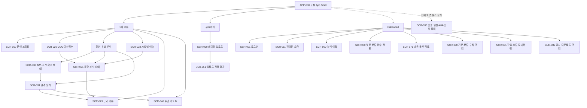
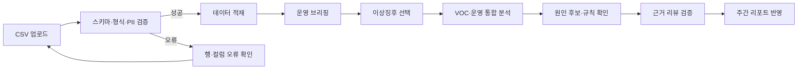
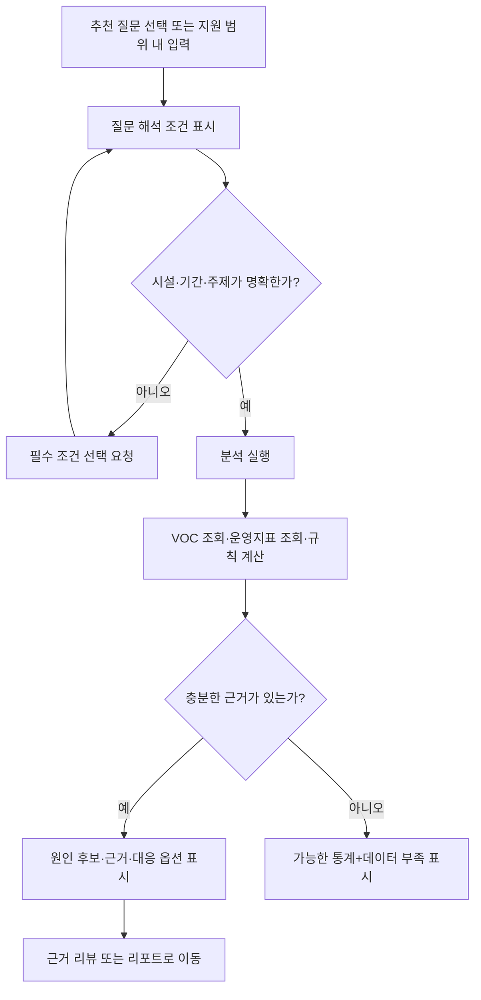
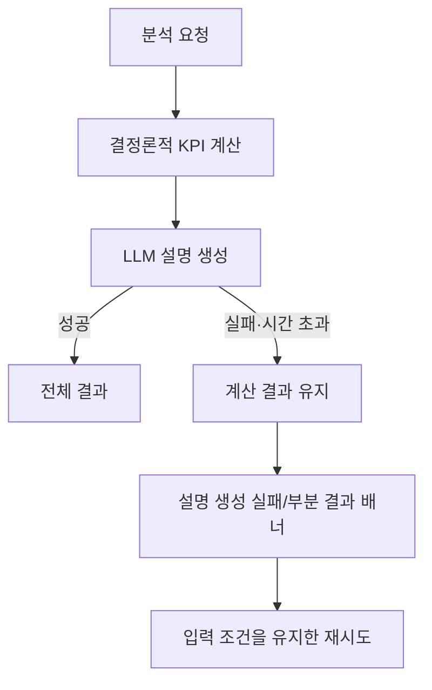
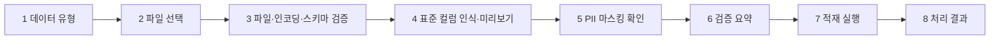

# Hotel Signal AI 화면설계서

> 호텔 VOC와 운영지표를 같은 시설·기간 기준으로 교차분석하여, 원인 후보와 우선 점검 항목을 근거와 함께 제공하는 내부 운영자용 AI Agent의 화면 설계 기준입니다.

## 0. 문서 사용 안내

### 0.1 목적

이 문서는 기획, UI/UX 디자인, 프론트엔드 구현, 백엔드 API 설계, QA가 동일한 화면 범위와 상태를 공유하기 위한 기준 문서입니다. 단순 화면 목록이 아니라 다음 항목까지 정의합니다.

- 사용자와 권한
- 정보 구조와 화면 전환
- 화면별 입력·출력·상호작용
- 정상·로딩·빈 결과·부분 성공·오류 상태
- 데이터와 AI 결과의 신뢰성 표시
- 반응형·접근성·콘텐츠 기준
- 요구사항과 화면 간 추적 관계

### 0.2 기준 문서

우선순위가 충돌할 경우 아래 순서로 판단합니다.

1. `docs/markdown/01_요구사항정의서.md`
2. `docs/markdown/voc/HOTEL_VOC_AI_AGENT.md`
3. `docs/서비스흐름도.png`
4. 본 화면설계서

별도 시각 레퍼런스인 첨부 호텔 VOC 대시보드 이미지는 **디자인 분위기와 레이아웃 계층만** 참고합니다. 이미지 안의 서비스명, 메뉴명, 수치, 지표 정의, 사용자 역할과 기능은 요구사항 근거로 사용하지 않습니다.

### 0.3 범례

| 표기 | 의미 |
|---|---|
| `Core` | 이번 MVP에서 반드시 설계·구현할 범위 |
| `Enhanced` | Core 완료 후 일정·배포 방식에 따라 구현할 범위 |
| `Future` | 실제 연동 또는 차기 고도화 범위 |
| `TBD` | 고객사·팀·기술 검토 후 확정해야 하는 항목 |
| `N/A` | 해당 화면 또는 역할에 적용하지 않는 항목 |

### 0.4 설계 시 반드시 지킬 원칙

1. 화면에서 인과관계를 확정하지 않습니다. `원인` 대신 `원인 후보`, `함께 관찰된 변화`, `우선 점검 항목`을 사용합니다.
2. 수치와 KPI는 결정론적 계산 결과로 표시하고, LLM이 생성한 설명과 시각적으로 구분합니다.
3. 분석 결과에는 기간, 비교 기간, 시설, 단위, 표본 수, 데이터 출처, 모델·규칙 버전, 생성 시각을 표시합니다.
4. 근거 리뷰를 생성하지 않습니다. 저장된 리뷰 ID와 마스킹된 원문·근거 문장만 표시합니다.
5. 합성 운영 데이터가 포함된 모든 화면과 리포트에는 `합성 데이터`를 명확히 표시합니다.
6. 운영 데이터가 없거나 표본이 부족하면 원인 후보를 생성하지 않고 가능한 VOC 통계와 제한 사유만 제공합니다.
7. 대응 옵션은 검토·선택·메모 기능이며 고객 응대, 보상, 인력 배치, 운영 명령을 자동 실행하지 않습니다.
8. 내부 추론 과정은 노출하지 않습니다. 사용자에게는 `질문 해석`, `데이터 조회`, `계산`, `근거 연결`, `결과 생성`과 같은 처리 단계만 표시합니다.
9. 기술 스택은 확정된 화면 계약이 아닙니다. 프로젝트 문서의 Streamlit·Plotly는 MVP 권장안으로만 취급합니다.

### 0.5 시각 레퍼런스 적용 범위

- 첨부 이미지는 좌측 내비게이션, 상단 헤더, 요약 카드와 상세 영역의 정보 계층만 참고합니다.
- 색상값, 글꼴, 세부 치수와 컴포넌트 외형은 이 문서에서 확정하지 않고 별도 UI 디자인 단계에서 결정합니다.
- 특정 호텔의 로고·상호·이미지·예시 수치·기능은 복제하지 않으며, 사진과 브랜드 자산은 사용 권한을 확인한 경우에만 적용합니다.

기능·데이터·AI 안전 원칙은 기준 문서가 항상 우선하며 시각 레퍼런스로 화면 ID, 계산식, 권한 또는 검증 기준을 변경하지 않습니다.

## 1. 서비스와 UX 목표

### 1.1 서비스 한 줄 정의

호텔 VOC 변화와 같은 기간의 운영지표 변화를 함께 보여주고, 운영자가 검토할 원인 후보와 점검 방향을 근거 수치·리뷰와 연결해 제공하는 서비스입니다.

### 1.2 사용자가 완료해야 하는 핵심 과업

| 우선순위 | 사용자 과업 | 성공 결과 |
|---:|---|---|
| 1 | 이번 주 부정 VOC와 주요 이상징후 파악 | 시설·주제별 관측 지표 정렬 결과와 변화량을 확인함 |
| 2 | VOC와 운영지표의 동시 변화 확인 | 같은 시설·기간의 일 단위 VOC와 일 집계 운영지표를 비교하고 시간대 운영 상세를 별도로 확인함 |
| 3 | 원인 후보의 근거 검증 | 적용 규칙, 표본 수, 근거 리뷰를 확인함 |
| 4 | 사전 정의 질문으로 분석 실행 | 해석 조건을 확인하고 재현 가능한 결과를 받음 |
| 5 | 주간 보고 내용 생성 | 분석 결과와 한계가 포함된 HTML 리포트를 확인함 |
| 6 | 데이터 품질 확인 | 업로드 성공·실패 건수와 행·컬럼별 오류를 확인함 |

### 1.3 비목표

- 실제 호텔 문제의 인과관계 확정
- 고객 자동 응답 또는 운영 조치 자동 실행
- 완전 자유형 자연어 분석
- 실시간 OTA 수집과 PMS·POS·CRM 전면 연동
- 대규모 다국어·다지점 운영
- MVP에서의 PDF 출력

## 2. 사용자·역할·권한

### 2.1 사용자 유형

| 역할 | 주요 목표 | 우선 정보 | 주요 진입 화면 |
|---|---|---|---|
| 고객경험 담당자 | 반복 불만과 근거 리뷰를 분석하고 보고 | VOC 추세, 주제, 원문, 리포트 | `SCR-010`, `SCR-020`, `SCR-023`, `SCR-040` |
| 호텔 운영 담당자 | 호텔 전반의 시설·시간대 운영 상황과 VOC 관계 확인 | 방문객, 인력, 대기, 점유율, 점검 항목 | `SCR-010`, `SCR-021`, `SCR-022` |
| 객실·F&B 팀장 | 담당 시설의 이슈 근거를 확인하고 개선안을 검토 | 시설별 이슈, 원인 후보, 근거 리뷰, 대응 옵션 | `SCR-021`, `SCR-022`, `SCR-023`, Enhanced의 `SCR-071` |
| 총지배인·경영진 | 위험 이슈와 개선 우선순위를 빠르게 파악 | 요약, 순위, 핵심 수치, 주의 문구 | `SCR-010`, Enhanced의 `SCR-011`, `SCR-040` |
| 시스템 관리자 | 업무 사용자를 지원하며 데이터 품질·분류 기준·작업 상태 관리 | 업로드, 오류, 버전, 감사 로그 | `SCR-050`, Enhanced의 `SCR-080`~`SCR-082` |

문서 안의 역할 용어는 다음처럼 해석합니다.

- `실무자`: 고객경험 담당자, 호텔 운영 담당자, 객실·F&B 팀장의 상위 표현
- `검수자`: Enhanced에서 낮은 신뢰도 검토 권한을 부여받은 고객경험 담당자 또는 시스템 관리자
- `데모 운영자`: Core 로컬 시연에서 업로드를 맡도록 지정된 사용자이며, 권한 모델에서는 시스템 관리자로 매핑
- 관리자는 업무 사용자 4개 역할을 대체하지 않는 지원 역할

### 2.2 범위별 권한 전제

| 항목 | Core | Enhanced |
|---|---|---|
| 인증 | 로컬 단일 사용자 시연에서는 생략 가능 | 데모 계정 로그인과 역할 기반 접근제어 |
| 경영진·실무자 구분 | 같은 데이터에서 화면 구성만 공통 제공 가능 | 역할별 기본 화면과 데이터 범위 적용 |
| 원문 조회 | 마스킹된 원문만 표시 | 역할별 원문·다운로드 권한 통제 |
| 데이터 업로드 | 데모 운영자 또는 관리자 역할로 수행 | 세부 권한과 감사 로그 적용 |
| 설정 변경 | 화면 노출 제외 또는 읽기 전용 | 관리자만 변경·버전 생성 가능 |
| 대응 옵션 | 결과에서 제안 내용 조회 | 선택·메모·검토 상태 저장 |

### 2.3 권한 매트릭스

`조회`는 마스킹된 정보 기준이며 실제 역할명과 범위는 고객사 협의 후 확정합니다.

| 기능 | 경영진 | 고객경험 | 운영 담당 | 관리자 |
|---|---:|---:|---:|---:|
| 운영 브리핑 조회 | 허용 | 허용 | 허용 | 허용 |
| VOC·운영 상세 조회 | 요약 중심 | 허용 | 허용 | 허용 |
| 근거 리뷰 조회 | 제한 가능 | 허용 | 업무 범위 내 허용 | 허용 |
| AI Agent 질의 | 허용 | 허용 | 허용 | 허용 |
| 주간 리포트 생성·조회 | 허용 | 허용 | 조회 | 허용 |
| CSV 업로드 | 차단 | 조건부 | 조건부 | 허용 |
| 분류·규칙 설정 | 차단 | 차단 | 차단 | 허용 |
| 작업 재처리·감사 조회 | 차단 | 차단 | 차단 | 허용 |
| 원문·분석 다운로드 | `TBD` | `TBD` | `TBD` | 정책 범위 내 허용 |

## 3. 범위 정의

### 3.1 Core MVP

- CSV 기반 VOC·합성 운영 데이터 업로드와 품질 검증
- 주간 운영 브리핑
- VOC 이상징후 목록
- VOC·운영지표 동일 조건 비교
- 시설·시간대별 이슈 조회
- 규칙 기반 원인 후보와 우선 점검 항목
- 사전 정의 질의 10개
- 근거 리뷰와 근거 문장 조회
- 주간 HTML 리포트 미리보기·생성
- 합성 데이터, 데이터 부족, 부분 실패, 분석 한계 표시

### 3.2 Enhanced MVP

- 로그인과 역할별 첫 화면·데이터 범위
- 경영진 전용 요약
- 분석·리포트 이력
- 낮은 신뢰도 결과 검토·수정 이력
- 대응 옵션 선택·메모·검토 상태
- 주제·시설·컬럼 매핑·임계값·규칙 관리
- 작업·오류 모니터링과 실패 작업 재처리
- 감사 로그와 다운로드 권한 통제

### 3.3 Future

- 실제 PMS·POS·CRM·VOC·설문·인력관리 시스템 연동
- 실제 사내 SSO·IDP 연동과 실권한 체계
- PDF 출력
- 실시간 VOC 알림
- 티켓·담당 부서 배정·에스컬레이션
- 혼잡 예측·시뮬레이션
- 다지점·다국어 분석

고객 자동 응답과 운영 조치 자동 실행은 Future 후보가 아니라 현재 프로젝트의 명시적 비목표·금지 범위입니다. 별도 요구사항 승인 전까지 화면 또는 로드맵 기능으로 표현하지 않습니다.

## 4. UX 원칙과 용어

### 4.1 UX 원칙

| 원칙 | 화면 적용 기준 |
|---|---|
| Evidence first | 요약보다 근거 수치와 리뷰로 이동하는 경로를 항상 제공 |
| Same context | VOC와 운영지표에 동일 시설·기간을 적용. Core VOC는 일 단위, 운영 데이터는 일 집계 비교와 시간대 상세를 구분 |
| Human in the loop | 원인 후보와 대응 옵션은 운영자가 검토하고 최종 판단 |
| Explain limits | 데이터 부족·합성 데이터·낮은 분류 점수·부분 실패를 숨기지 않음 |
| Progressive disclosure | 브리핑에서는 요약, 상세에서는 계산값·규칙·원문 제공 |
| Reproducible result | `analysis_id`, 필터, 출처, 버전, 생성 시각으로 결과 재조회 가능 |
| Operational language | 통계 용어보다 호텔 운영 용어를 우선하고 단위·기준을 병기 |

### 4.2 화면 용어 표준

| 사용 용어 | 설명 | 사용하지 않을 표현 |
|---|---|---|
| 원인 후보 | 규칙과 관찰된 변화로 우선 검토할 가능성 | 확정 원인, 원인 판정 |
| 관련 운영지표 | VOC와 같은 조건에서 함께 비교한 지표 | 원인을 증명한 지표 |
| 우선 점검 항목 | 운영자가 실제 상황을 확인할 대상 | 자동 조치, 즉시 실행 |
| 대응 옵션 | 사람이 검토할 수 있는 선택지 | 실행 명령, 자동 개선 |
| 데이터 부족 | 계산 또는 후보 생성 조건 미충족 | 분석 결과 없음만 표시 |
| 합성 데이터 | 프로젝트 검증용으로 생성한 운영 데이터 | 실제 호텔 데이터 |
| 규칙 기반 계산 | 코드·통계 규칙으로 재현되는 결과 | AI 추정값 |
| AI 생성 설명 | 계산 결과를 바탕으로 생성한 설명 | 확정 사실 |

### 4.3 예시 문구

허용:

> 조식 방문객과 대기시간이 함께 증가했습니다. 혼잡 시간대의 인력 배치와 입장 간격을 우선 점검할 수 있습니다.

금지:

> 직원 수 부족 때문에 조식 불만이 증가했습니다.

## 5. 정보 구조

### 5.1 전체 사이트맵



### 5.2 1차 내비게이션

프로젝트 기준 문서의 여섯 가지 주요 메뉴를 유지합니다. 자연어 분석은 `원인 후보 분석` 화면의 주 기능이자 전역 진입점으로 제공합니다.

| 순서 | 메뉴 | 대상 화면 | 노출 범위 |
|---:|---|---|---|
| 1 | 운영 브리핑 | `SCR-010` | Core |
| 2 | VOC 이상징후 | `SCR-020` | Core |
| 3 | 원인 후보 분석 | `SCR-021`, `SCR-030`, `SCR-031` | Core |
| 4 | 시설별 이슈 | `SCR-022` | Core |
| 5 | 근거 리뷰 | `SCR-023` | Core |
| 6 | 주간 리포트 | `SCR-040` | Core |

메뉴는 텍스트 라벨로 식별 가능해야 하며 현재 위치를 색상 외 방식으로도 구분합니다.

`SCR-021`, `SCR-030`, `SCR-031`은 별개의 1차 메뉴가 아닙니다. 사용자에게는 모두 같은 페이지 제목과 breadcrumb인 `원인 후보 분석`으로 보이며, 아래 상태를 구분하기 위한 논리적 화면 ID입니다.
### 5.3 유틸리티·관리 메뉴

| 메뉴 | 대상 화면 | 노출 대상 |
|---|---|---|
| 데이터 업로드 | `SCR-050`, `SCR-051` | Core 데모 운영자·관리자 |
| 분석·리포트 이력 | `SCR-060` | Enhanced 실무자·관리자 |
| 검토함 | `SCR-070`, `SCR-071` | Enhanced 검수자·관리자 |
| 관리자 | `SCR-080`~`SCR-082` | Enhanced 관리자 |

## 6. 공통 App Shell

### 6.1 레이아웃

공통 화면은 내비게이션과 본문으로 구성합니다. 본문은 페이지 제목·설명, 지속 안내, 전역 필터, 선택적 AI 질문 진입점, 화면별 콘텐츠, 분석 메타정보 순서로 제공합니다. 화면 폭이 좁아져도 이 정보 순서와 현재 분석 문맥을 유지하며, 구체적인 배치·간격은 별도 UI 디자인에서 결정합니다.
### 6.2 사이드바·페이지 헤더

| 요소 | 표시 내용 | 동작·규칙 |
|---|---|---|
| 브랜드 블록 | 서비스명과 설명 | 선택 시 역할별 기본 화면으로 이동 |
| 1차 메뉴 | 아이콘, 메뉴명, 현재 위치 | 현재 위치를 색상 외 표시와 `aria-current="page"`로 구분 |
| 유틸리티 | 데이터 업로드, 이력, 설정·관리 | 1차 메뉴와 구분선을 두고 권한·범위에 따라 노출. 기능이 없을 때 빈 메뉴를 만들지 않음 |
| 데이터 상태 | 합성 데이터, 적재 시각, 정상·지연·오류 | 페이지 헤더 또는 공통 상태 영역에서 계속 확인 가능해야 함 |
| 사용자 블록 | 이름, 역할, 사용자 메뉴 | 사이드바 최하단. Enhanced에서만 실제 인증·로그아웃 동작 적용 |
| 페이지 제목·설명 | 표준 화면명과 화면 목적 | 메뉴명·breadcrumb와 용어를 동일하게 유지 |
| 기간 선택 | 현재 기간과 비교 기간 | 우측 첫 번째 행동. 현재 기간 변경 시 비교 기간은 같은 길이로 자동 계산 |
| 주요 행동 | `주간 리포트`, `분석 실행`, `리포트 생성` 등 | 한 페이지에서 가장 중요한 행동 하나를 우선 표시 |
| 데이터 메타 | 최종 적재, 데이터 상태, 합성 데이터 | 분석 생성 시각과 데이터 적재 시각을 구분 |

### 6.3 전역 필터

| 필터 | 형식 | 기본값 | 검증·상호작용 |
|---|---|---|---|
| 호텔 | 단일 선택 | 가용 호텔 또는 전체 | 권한 범위 내 항목만 표시 |
| 시설 | 다중 선택 | 전체 시설 | 호텔 선택에 따라 선택지 갱신, 기존 무효 선택 해제 안내 |
| 현재 기간 | 시작일·종료일 | 최신 완료 주간 | 시작일은 종료일보다 늦을 수 없음 |
| 비교 기간 | 자동 계산·읽기 전용 | 현재 기간 바로 이전의 동일 길이 | Core에서는 사용자가 변경하지 않음. 사용자 지정 비교는 별도 요구사항 승인 시 Enhanced로 검토 |
| 채널 | 다중 선택 | 전체 | 리뷰 데이터에 존재하는 채널만 표시 |
| 주제 | 다중 선택 | 전체 | 복수 주제 분석 결과 기준 |
| 감성 | 다중 선택 | 전체 | 긍정·중립·부정 |

`현재 기간`과 나머지 필터는 같은 전역 필터 상태를 사용하며 별도 쿼리나 중복 값을 만들지 않습니다. 좁은 화면에서도 기간과 적용된 필터를 확인하고 한 번에 변경할 수 있어야 합니다.

공통 규칙:

- `적용` 버튼을 눌러야 쿼리를 실행하며, 여러 필터를 바꾸는 동안 불필요한 재조회는 하지 않습니다.
- 적용 후 필터 요약을 칩으로 표시하고 `전체 초기화`를 제공합니다.
- 화면 이동과 브라우저 뒤로 가기 후에도 전역 필터, 선택한 이슈, 스크롤 위치를 가능한 범위에서 유지합니다.
- 주간 리포트에서 보고 기간을 별도로 선택하면 해당 기간과 바로 이전의 동일 길이 비교 기간을 다시 자동 계산합니다.
- 필터 변경 시 KPI·차트·목록은 동일 조건으로 갱신되어야 합니다.
- 데이터가 없는 선택지는 숨기지 말고 비활성화 이유 또는 가용 기간을 표시합니다.
- 최대 조회 기간과 다중 선택 개수는 `TBD`입니다.

### 6.4 전역 AI 질문 진입점

- placeholder: `예: 최근 조식 대기 관련 부정 리뷰가 증가한 기간을 분석해줘`
- 완전 자유질의를 지원하는 것처럼 표현하지 않습니다.
- 입력창 아래에 사전 정의 질문 카테고리와 예시를 제공합니다.
- 질문 실행 시 `SCR-030`으로 이동하고 전역 필터를 분석 조건의 기본값으로 전달합니다.
- 질문에 시설·기간이 명시되면 해석 결과에서 전역 필터와의 충돌을 알려주고 사용자가 확정하도록 합니다.

### 6.5 공통 메타정보 영역

모든 분석 결과 화면에서 아래 정보를 접을 수 있는 `분석 정보` 영역으로 제공합니다. 단, 기간·표본 수·합성 데이터 여부는 접어도 화면 요약에 계속 노출합니다.

- `analysis_id`
- 현재 기간과 비교 기간
- 호텔·시설·주제·채널·감성 조건
- 데이터 출처와 원본 파일 식별 정보
- 표본 수
- `synthetic`, seed, schema version
- 모델, 프롬프트, 분류체계, 규칙 버전
- `rule_id`
- 생성 시각과 시간대

### 6.6 화면 레이아웃 패턴

모든 화면을 대시보드처럼 카드로 잘게 나누지 않습니다. 정보 성격에 따라 다음 패턴을 사용합니다.

| 패턴 | 적용 화면 | 구성 원칙 | 하단 상세 |
|---|---|---|---|
| Overview | `SCR-010`, `SCR-011` | 핵심 KPI → 추이·순위 → 관찰·점검 → 최근 근거 | 전체 폭 최근 VOC·요약 테이블 |
| Explore | `SCR-020`, `SCR-022`, `SCR-060` | 요약 → 추이·비교 → 필터·정렬 목록 | 선택 행 drawer |
| Analyze | `SCR-021`, `SCR-030`, `SCR-031` | 조건 요약 → 핵심 수치 → 동시 변화·원인 후보 | 근거 리뷰·점검 옵션 |
| Review | `SCR-023`, `SCR-070`, `SCR-071` | 목록과 선택 상세 | 좁은 화면에서는 목록→상세 단계 전환 |
| Report | `SCR-040` | 생성 조건·목차와 리포트 미리보기 | 분석 링크·메타정보 |
| Create | `SCR-050`, `SCR-051` | 단계·설정과 업로드·검증 결과 | 오류표·메타정보 |
| Admin | `SCR-080`~`SCR-082` | 탭·필터 → 표·상세 | 모바일 기능 차단 또는 조회 전용 |

같은 화면에서 정보 순서와 정렬은 일관되게 유지하되 구체적인 열 비율과 간격은 UI 디자인 단계에서 확정합니다.

## 7. 핵심 사용자 흐름

### 7.1 데이터 준비부터 리포트까지



### 7.2 자연어 질의 흐름



### 7.3 부분 장애 흐름



### 7.4 주요 화면 전환

| 출발 화면 | 사용자 행동 | 도착 화면 | 유지할 문맥 |
|---|---|---|---|
| 모든 주요 화면 | 전역 질문 실행 | `SCR-030` | 전역 필터, 입력 질문 |
| `SCR-010` | 전체·부정 VOC 카드 선택 | `SCR-020` | 호텔·시설·기간·감성 |
| `SCR-010` | 이상징후 선택 | `SCR-021` | 호텔·시설·기간·주제, anomaly ID |
| `SCR-010` | 시설 정렬 목록 선택 | `SCR-022` | 호텔·기간·시설 |
| `SCR-010` | 주간 리포트 선택 | `SCR-040` | 호텔·현재/비교 기간 |
| `SCR-020` | 이상징후 행 선택 | `SCR-021` | 탐지 규칙과 조건 |
| `SCR-020` | 근거 수·리뷰 선택 | `SCR-023` | anomaly ID, 시설·기간·주제 |
| `SCR-021` | 근거 리뷰 보기 | `SCR-023` | analysis ID, 원인 후보, review ID |
| `SCR-021` | 리포트에 반영 | `SCR-040` | analysis ID, 요약·근거 참조 |
| `SCR-021` | 대응 옵션 검토 | Enhanced `SCR-071` | analysis ID, 원인 후보, 옵션 |
| `SCR-022` | 시설·시간대 이슈 선택 | `SCR-021` | 시설·시간대·주제 |
| `SCR-022` | 근거 리뷰 선택 | `SCR-023` | 시설·날짜·주제, review ID |
| `SCR-030` | 분석 완료 | `SCR-031` | 질문, 해석 조건, analysis ID |
| `SCR-031` | 계산 상세 선택 | `SCR-021` | analysis ID, 시설·기간·주제 |
| `SCR-031` | 근거 리뷰 보기 | `SCR-023` | analysis ID, review ID |
| `SCR-031` | 리포트에 반영 | `SCR-040` | 분석 요약과 근거 참조 |
| `SCR-040` | 근거 상세 선택 | `SCR-021` 또는 `SCR-023` | 보고 기간, analysis ID |
| `SCR-023` | 분석으로 돌아가기 | 진입한 `SCR-021` 또는 `SCR-031` | 필터, 선택 리뷰, 스크롤 위치 |
| `SCR-050` | 파일 검증 완료 | `SCR-051` | 업로드 ID, 파일 메타정보 |
| `SCR-051` | 적재 완료 | `SCR-010` | 새 데이터 기간·시설, 업로드 ID |
| `SCR-051` | 오류 수정·파일 교체 | `SCR-050` | 데이터 유형, 파일 메타정보 |
| `SCR-060` | 과거 분석·리포트 선택 | `SCR-021` 또는 `SCR-040` | 당시 조건·출처·버전 |

### 7.5 역할별 업무 여정과 최종 의사결정

| 사용자 | 업무 여정 | 완료 지점 |
|---|---|---|
| 고객경험 담당자 | 운영 브리핑 → VOC 이상징후 → 원인 후보 분석 → 근거 리뷰 → 주간 리포트 | 근거가 연결된 보고 내용 확인 |
| 호텔 운영 담당자 | 운영 브리핑 또는 시설별 이슈 → 운영지표 확인 → 원인 후보 분석 → 점검 옵션 검토 | 현장 점검 대상 확인 |
| 객실·F&B 팀장 | 시설별 이슈 → 원인 후보·근거 확인 → 대응 옵션 검토 | 외부 업무 절차에서 조치 여부 결정 |
| 총지배인·경영진 | 운영 브리핑 또는 경영진 요약 → 주간 리포트 → 주요 이슈 상세·근거 확인 | 우선 검토 대상과 한계 인지 |

서비스 화면의 최종 단계는 자동 실행이 아니라 다음 순서로 끝납니다.

```text
원인 후보·근거·대응 옵션 확인
→ 운영자 또는 팀장의 최종 검토
→ 필요한 경우 호텔의 기존 외부 업무 절차에서 조치
→ 본 서비스에는 자동 실행 결과를 성공으로 표시하지 않음
```

## 8. 화면 목록

### 8.1 전체 인벤토리

| 화면 ID | 화면명 | 범위 | 주요 사용자 | 핵심 요구사항 |
|---|---|---|---|---|
| `APP-000` | 공통 App Shell | Core | 전체 | `FUN-007`, `UI-005`, `OPS-003`, `NFR-005` |
| `SCR-001` | 로그인 | Enhanced | 전체 | `FUN-001`, `FUN-002`, `SEC-001`, `TST-004` |
| `SCR-010` | 운영 브리핑 | Core | 경영진·실무자 | `UI-001`, `AI-004`, `AI-006`, `UI-005` |
| `SCR-011` | 경영진 요약 | Enhanced | 경영진 | `BIZ-003`, `UI-004`, `RPT-002` |
| `SCR-020` | VOC 이상징후 | Core | 고객경험·운영 담당자 | `AI-004`, `FUN-007`, `UI-005` |
| `SCR-021` | 원인 후보 분석 — 통합 분석 상태 | Core | 실무자 | `BIZ-001`, `AI-005`~`AI-007`, `UI-002` |
| `SCR-022` | 시설별 이슈 | Core | 운영 담당자 | `AI-005`, `AI-006`, `UI-002` |
| `SCR-023` | 근거 리뷰 | Core | 실무자 | `FUN-006`, `AI-002`, `SEC-002` |
| `SCR-030` | 원인 후보 분석 — 질문·조건 확인 상태 | Core | 경영진·실무자 | `AI-008`, `AI-009` |
| `SCR-031` | 원인 후보 분석 — 결과 상태 | Core | 경영진·실무자 | `UI-003`, `BIZ-002`, `BIZ-004` |
| `SCR-040` | 주간 리포트 | Core | 경영진·고객경험 | `RPT-001`, `OPS-003`, `NFR-005` |
| `SCR-050` | 데이터 업로드 | Core | 데모 운영자·관리자 | `FUN-003`, `FUN-004`, `DAT-001`~`DAT-006` |
| `SCR-051` | 업로드 검증 결과 | Core | 데모 운영자·관리자 | `FUN-005`, `TST-001` |
| `SCR-060` | 분석·리포트 이력 | Enhanced | 실무자·관리자 | `FUN-010`, `RPT-004`, `OPS-002` |
| `SCR-070` | 낮은 신뢰도 분류 결과 검토 | Enhanced | 검수자·관리자 | `AI-003`, `DAT-005` |
| `SCR-071` | 대응 옵션 검토 | Enhanced | 실무자 | `FUN-008`, `BIZ-004` |
| `SCR-080` | 기준·분류·규칙 관리 | Enhanced | 관리자 | `FUN-009`, `NFR-006`, `OPS-002` |
| `SCR-081` | 작업·오류 모니터링 | Enhanced | 관리자 | `OPS-001`, `OPS-004`, `NFR-003` |
| `SCR-082` | 감사·다운로드 관리 | Enhanced | 관리자 | `SEC-004`, `SEC-005`, `OPS-005` |
| `SCR-090` | 인증·권한·404·전체 장애 상태 | Core·Enhanced | 전체 | `FUN-002`, `SEC-001`, `NFR-003`, `TST-005` |

### 8.2 화면 상태 코드

| 코드 | 상태 | 설명 |
|---|---|---|
| `S0` | Initial | 최초 진입·아직 실행하지 않음 |
| `S1` | Loading | 데이터 또는 화면 요소 조회 중 |
| `S2` | Success | 필수 데이터가 정상 표시됨 |
| `S3` | Empty | 업로드 데이터 또는 필터 결과가 없음 |
| `S4` | Insufficient | 표본·비교 기간·운영 데이터가 부족함 |
| `S5` | Partial | 일부 계산은 성공했지만 설명·지표 일부가 실패함 |
| `S6` | Error | 사용자가 해결하거나 재시도해야 하는 오류 |
| `S7` | Forbidden | 권한이 없어 접근할 수 없음 |
| `S8` | Disabled | 현재 범위 밖 또는 선행 조건 미충족 |

용어는 다음처럼 통일합니다.

- 내부 상태명 `S5 Partial`, 사용자 문구 `일부 결과`
- 업로드 검증 오류가 있는 파일은 `검증 실패`이며 적재 성공과 혼합하지 않음
- 감성·주제 점수는 `낮은 분류 점수`, 원인 후보에는 종합 신뢰도 등급을 사용하지 않음
- 사용자 페이지명은 `원인 후보 분석`, `VOC·운영 통합 분석`은 상태 부제
- Core는 `HTML 리포트 생성·조회`, Enhanced 권한이 있는 경우에만 `다운로드`

### 8.3 화면별 상태 적용 매트릭스

`S3`~`S5`는 원래 화면 안에서 inline alert·빈 영역·부분 결과로 표시합니다. `S7`과 App Shell을 표시할 수 없는 전체 `S6`만 `SCR-090`으로 전환합니다.

| 화면 | 적용 상태 | 핵심 문구·CTA | 유지할 입력·문맥 |
|---|---|---|---|
| `APP-000` | `S0`, `S1`, `S2`, `S6`, `S7` | 데이터 없음이어도 shell 유지·업로드 CTA | 역할, 접근 경로 |
| `SCR-001` | `S0`, `S1`, `S2`, `S6` | 로그인 실패·다시 입력 | ID, 비밀번호는 정책에 따라 초기화 |
| `SCR-010` | `S1`~`S7` | 데이터 없음→업로드, 표본 부족→기간 확대 | 전역 필터, 선택 카드 |
| `SCR-011` | `S1`~`S7` | 요약 없음→관측 지표 보기, 권한 없음→`SCR-090` | 기간, 시설 |
| `SCR-020` | `S1`~`S7` | 후보 없음→탐지 기준 표시, 데이터 부족→기간 변경 | 필터, 정렬 기준 |
| `SCR-021` | `S0`~`S8` | 분석 조건 없음→질문/이슈 선택, 운영 데이터 없음→VOC만 보기 | 필터, anomaly·analysis ID, 차트 선택 |
| `SCR-022` | `S1`~`S7` | 운영 데이터 없음→VOC 일별 보기, 기준 불일치→비교 해제 | 시설, 날짜, 운영 시간대 |
| `SCR-023` | `S1`~`S7` | 근거 없음·마스킹 실패·권한 없음 구분 | analysis ID, review ID, 검색 필터 |
| `SCR-030` | `S0`~`S8` | 모호한 질문→조건 보완, 미지원→추천 질문 | 질문, 해석 조건, 전역 필터 |
| `SCR-031` | `S1`, `S2`, `S4`~`S7` | 부분 결과·시간 초과·LLM 실패를 결과 안에 표시 | analysis ID, 질문, 완료 단계 |
| `SCR-040` | `S0`~`S8` | 분석 없음→분석 선택, 메타 누락→생성 차단 | 보고 기간, 포함 analysis ID |
| `SCR-050` | `S0`, `S1`, `S2`, `S6`~`S8` | 파일 오류→수정 후 재업로드 | 데이터 유형, 파일 메타정보 |
| `SCR-051` | `S1`, `S2`, `S6`, `S7` | 검증 실패→적재 0건·파일 교체 | 업로드 ID, 오류 필터 |
| `SCR-060` | `S1`~`S7` | 이력 없음·원본 만료·부분 결과 구분 | 검색 조건, 선택 이력 |
| `SCR-070` | `S1`~`S7` | 검토 대상 없음·동시 수정·저장 실패 | 검토 필터, 미저장 수정값 |
| `SCR-071` | `S0`~`S3`, `S6`~`S8` | 옵션 없음·저장 실패·읽기 전용 구분 | analysis ID, 상태, 메모 |
| `SCR-080` | `S0`~`S3`, `S6`~`S8` | 설정 없음·충돌·적용 불가 | 탭, 초안, 검증 결과 |
| `SCR-081` | `S1`~`S7` | 작업 없음·부분 성공·재처리 불가 | 작업 필터, 실행 ID |
| `SCR-082` | `S1`~`S3`, `S6`, `S7` | 로그 없음·정책 미확정·권한 없음 | 기간, 사용자, 행위 필터 |
| `SCR-090` | 전체 `S6`, `S7`, 인증·404·점검 | 안전한 복귀·로그인·재시도 | 복구 가능한 이전 경로만 보존 |

### 8.4 대표 프로토타입 시나리오

UI/UX 시안과 데모 콘텐츠는 아래 한 시나리오를 우선 사용하면 화면 간 데이터가 일관됩니다. 수치는 실제 운영 실적이 아닌 프로젝트 설명용 합성 예시입니다.

| 항목 | 예시 값 |
|---|---|
| 사용자 질문 | `최근 조식 관련 부정 리뷰가 증가한 원인 후보를 분석해줘.` |
| 시설·주제 | 조식 레스토랑 · 조식 대기 |
| 부정 VOC | 이전 기간 대비 `+31%` |
| 오전 8~9시 방문객 | 이전 기간 대비 `+24%` |
| 근무 인원 | 이전 기간과 동일 |
| 평균 대기시간 | `13분 → 25분` |
| 원인 후보 | 방문객과 대기시간 증가가 함께 관찰되어 혼잡 시간대 운영 여력 점검 필요 |
| 대응 옵션 | 추가 인력 배치, 이용시간 분산, 권장 조식 시간 안내, 음식 보충 주기 검토 |
| 고정 한계 | 합성 운영 데이터이며 인과관계를 확정하지 않음 |

프로토타입 화면 흐름:

```text
SCR-010 조식 이상징후 선택
→ SCR-021 VOC·운영 동시 변화와 원인 후보 확인
→ SCR-023 마스킹된 근거 리뷰 확인
→ SCR-031 AI 설명과 대응 옵션 검토
→ SCR-040 주간 리포트 반영
```

## 9. 화면 상세 설계 — Core MVP

### 9.1 `APP-000` 공통 App Shell

| 항목 | 내용 |
|---|---|
| 목적 | 모든 분석 화면에서 동일한 데이터 문맥과 서비스 상태를 유지 |
| 사용자 | 전체 |
| 선행 조건 | 앱 접근 가능. 데이터가 없어도 shell은 열리고 업로드 CTA를 제공함 |
| 진입 | 서비스 최초 접속 또는 로고 선택 |
| 종료 | 로그아웃, 브라우저 종료 |
| 연결 요구사항 | `FUN-007`, `UI-005`, `OPS-003`, `NFR-005` |

#### 구성요소

| 영역 | 요소 | 표시·동작 |
|---|---|---|
| 사이드바 | 브랜드 블록 | `HOTEL SIGNAL AI`와 `VOC·운영 분석 Agent`; Core와 Enhanced 실무자는 `SCR-010`, Enhanced 경영진은 `SCR-011`로 이동 |
| 사이드바 | 1차 메뉴 | 메뉴명과 `aria-current` 등 색상 외 수단으로 현재 위치 구분 |
| 사이드바 하단 | 데이터·사용자 | 합성 데이터, 적재 상태, 이름·역할·사용자 메뉴를 본문과 겹치지 않게 고정 |
| 페이지 헤더 | 제목·설명 | 표준 화면명, 한 줄 목적, 도움말 |
| 페이지 헤더 | 기간·주요 행동 | 기간 선택과 화면별 주요 행동 한 개 |
| 페이지 헤더 | 데이터 메타 | 합성 데이터 여부, seed, schema version, 최종 적재 시각, 정상·지연·오류 상태 |
| 본문 상단 | 전역 필터 | 호텔·시설·현재/비교 기간·채널·주제·감성 |
| 본문 상단 | AI 질문 | Overview에서는 compact 진입점, Analyze에서는 주 입력 영역으로 제공; 실행 후 `SCR-030`으로 이동 |
| 본문 | 화면 콘텐츠 | 각 화면의 로딩을 독립 처리 |

#### 공통 상호작용

- 필터 변경 전·후 값을 구분하고 `적용` 전에는 조회를 실행하지 않습니다.
- 적용된 필터는 URL 또는 세션 상태 등 구현 가능한 방식으로 화면 이동 간 유지합니다.
- 권한이 없는 메뉴는 Enhanced에서 숨길 수 있지만 직접 URL 요청은 반드시 `SCR-090/S7`로 차단합니다.
- 합성 데이터 배지는 닫기 기능을 제공하지 않습니다.
- 전체 오류로 오해하지 않도록 개별 위젯 실패는 해당 위젯 안에서 표시합니다.

#### 수용 기준

- [ ] 필터를 적용하면 현재 화면의 모든 KPI·차트·목록이 같은 조건으로 갱신됩니다.
- [ ] 화면 이동 후에도 적용한 필터가 유지됩니다.
- [ ] 합성 데이터 분석에서는 헤더와 주요 결과에 합성 데이터 표시가 보입니다.
- [ ] 메뉴의 현재 위치를 색상 외 텍스트·아이콘·접근성 상태로 확인할 수 있습니다.
- [ ] 화면 폭이 달라져도 페이지 제목·필터·본문 순서와 기능이 유지됩니다.

### 9.2 `SCR-010` 운영 브리핑

| 항목 | 내용 |
|---|---|
| 목적 | 이번 주 주요 VOC와 운영 이상징후를 한 화면에서 파악하고 선택한 관측 지표로 시설·주제를 정렬 |
| 사용자 | 경영진, 고객경험 담당자, 운영 담당자 |
| 범위 | Core |
| 선행 조건 | 분석 가능한 VOC 데이터, 가능한 경우 같은 기간 운영 데이터 |
| 진입 | 기본 메뉴 `운영 브리핑` |
| 주요 다음 화면 | `SCR-021`, `SCR-022`, `SCR-030`, `SCR-040` |
| 연결 요구사항 | `BIZ-001`, `FUN-007`, `AI-004`, `AI-006`, `UI-001`, `UI-005`, `NFR-004`, `NFR-005`, `OPS-003` |

#### 정보 구성 순서

| 순서 | 영역 | 표시 원칙 |
|---:|---|---|
| 1 | AI 질문 진입 | 지원 범위와 추천 질문을 제공하고 `SCR-030`으로 이동 |
| 2 | 핵심 KPI | 전체 VOC, 부정 VOC, 부정 VOC 비율, 평균 평점과 비교 기준 표시 |
| 3 | 추이·순위 | 부정 VOC의 일 단위 추이와 선택 기준에 따른 시설·주제 순위 표시 |
| 4 | 관찰·점검 | 관찰 사실, 관련 운영지표, 판정 규칙, 점검 항목과 근거 수 표시 |
| 5 | 관련 운영지표 | 평균 대기시간과 선택 운영지표의 값·단위·집계 기준 표시 |
| 6 | 최근 근거 VOC | 마스킹된 리뷰, 감성·채널·근거 연결 상태와 전체 보기 제공 |

페이지 제목은 메뉴와 동일한 `운영 브리핑`을 사용합니다. `이번 주 고객 경험과 운영 신호`는 설명 문구로만 표시합니다.
#### KPI 카드

| 카드 | 주 값 | 보조 값 | 필수 메타정보 | 클릭 동작 |
|---|---|---|---|---|
| 전체 VOC | 현재 기간 리뷰 수 | 이전 기간 대비 건수 증감률 | `n`, 기간 | `SCR-020`으로 이동, 현재 필터 유지 |
| 부정 VOC | 부정 리뷰 수 | 이전 기간 대비 증감률 | `n`, 감성 분류 완료 수 | `SCR-020`으로 이동, 감성=`부정` 추가 |
| 부정 VOC 비율 | 부정 리뷰 수 / 분류 완료 전체 리뷰 수 | 이전 기간과 `%p` 차이 | 분자·분모 | `SCR-020`으로 이동, 감성=`부정` 추가 |
| 평균 평점 | 정규화 평균 | 이전 기간 차이 | 원본 평점 척도, `n` | `SCR-020`으로 이동, 평점 기준 정렬 |
| 평균 대기시간 | 분 단위 평균 | 이전 기간 증감률 | 시설·집계 단위 | `SCR-021` 운영지표 상세 |
| 선택 운영지표 | 방문객·근무 인원·점유율 중 문맥에 맞는 값 | 이전 기간 증감률 | 단위·집계식 | `SCR-022` 시설 상세 |

카드 공통 규칙:

- 첫 행의 1차 KPI는 `전체 VOC`, `부정 VOC`, `부정 VOC 비율`, `평균 평점` 4개입니다. `평균 대기시간`과 `선택 운영지표`는 관련 운영지표 strip에 둡니다.
- 현재 기간과 비교 기간을 툴팁 또는 보조 텍스트로 표시합니다.
- 이전 건수 0 또는 결측값이면 무한대·임의 증가율 대신 `비교 기준 0건` 또는 `데이터 부족`을 표시합니다.
- 경고 상태는 색상만 사용하지 않고 `주의`, `표본 부족`, `계산 실패` 텍스트와 아이콘을 함께 사용합니다.
- 표본 수는 `n=120`처럼 표시합니다.

#### 차트와 목록

| 컴포넌트 | 표시 내용 | 상호작용 |
|---|---|---|
| 부정 VOC 추이 | `review_date` 기준 일 단위 건수, 비율, 이동평균 | 지점 선택 시 시설·주제·날짜 상세 |
| 시설·주제 정렬 목록 | 사용자가 선택한 기준, 순서, 시설, 주제, 부정 VOC 변화, 관련 KPI, 상태 | 기본 기준은 부정 VOC 건수 변화. 행 선택 시 `SCR-021` 또는 `SCR-022` |
| 주요 이상징후 | 탐지 시각, 시설, 주제, 변화, 탐지 규칙, 탐지 상태 | `분석하기`로 `SCR-021` 이동 |
| 관련 운영지표 | 방문객, 근무 인원, 고객 100명당 인원, 평균·최대 대기, 수용률·점유율 | 지표별 단위·계산식 툴팁 |
| 우선 점검 항목 | 원인 후보 기반 점검 대상, 관련 수치, 근거 수 | `근거 보기`, `AI로 분석` |
| 최근 근거 VOC | `review_date`, 시설·주제, 마스킹된 1~2줄 리뷰, 감성, 채널, 근거 연결 상태 | 행 또는 `전체 보기` 선택 시 현재 필터를 유지해 `SCR-023` 이동 |

AI 인사이트 영역은 인과 화살표를 사용하지 않습니다. 항목 사이에는 `같은 시설·기간`, `함께 관찰`, `규칙 기준 충족`처럼 관계의 성격을 명시하고, 전역적인 `높음 87%` 같은 임의 신뢰도 배지를 표시하지 않습니다.

#### 상태별 설계

| 상태 | 화면 표현 | 다음 행동 |
|---|---|---|
| `S1` 로딩 | KPI skeleton, 차트별 로딩, 적용 필터 유지 | 취소는 선택 사항, 중복 적용 차단 |
| `S2` 정상 | 전체 카드·차트·목록과 분석 정보 표시 | 상세 분석·리포트 이동 |
| `S3` 데이터 없음 | `아직 업로드한 데이터가 없습니다` | `데이터 업로드` |
| `S3` 필터 결과 없음 | 현재 적용 필터 칩과 가용 기간 표시 | `필터 초기화` |
| `S4` 표본 부족 | KPI는 가능한 범위에서 표시하고 이상징후는 비활성 | 기간 확대 또는 필터 완화 |
| `S4` 운영 데이터 없음 | VOC 카드·추이는 유지, 운영 카드·원인 후보 비활성 | 운영 데이터 업로드 안내 |
| `S5` 일부 지표 실패 | 성공 위젯은 유지, 실패 위젯 내부 오류 | 해당 위젯 재시도 |
| `S6` 전체 조회 실패 | 오류 코드·발생 시각·재시도 가능 여부 | `다시 조회` |

#### 수용 기준

- [ ] 주간 데이터로 진입하면 기간·단위·비교 기준이 있는 KPI와 차트가 표시됩니다.
- [ ] 모든 구성요소가 동일 필터 조건을 사용합니다.
- [ ] 유효 리뷰 10건 미만이면 이상징후를 생성하지 않고 표본 수를 표시합니다.
- [ ] 합성 운영 데이터 분석이면 화면 상단과 관련 KPI에 합성 데이터 표기가 보입니다.
- [ ] 순위나 이상징후를 선택하면 선택 문맥을 유지한 상세 화면으로 이동합니다.
- [ ] 화면 폭이 달라져도 핵심 KPI → 추이·순위 → 관찰·점검 → 최근 근거 VOC의 정보 순서가 유지됩니다.
- [ ] 미확정 위험·우선순위 등급이나 인과 표현 없이 관찰값·규칙·근거 상태로만 강조합니다.
- [ ] 최근 근거 VOC는 마스킹되며 시간 정보가 없는 `review_date` 데이터에 임의 시각을 생성하지 않습니다.

### 9.3 `SCR-020` VOC 이상징후

| 항목 | 내용 |
|---|---|
| 목적 | 기간·시설·주제별 VOC 변화 중 규칙 기준을 충족한 이상징후를 탐색 |
| 사용자 | 고객경험 담당자, 운영 담당자 |
| 범위 | Core |
| 선행 조건 | 감성 분류가 완료된 VOC 데이터 |
| 진입 | 1차 메뉴 `VOC 이상징후`, 브리핑의 이상징후 목록 |
| 주요 다음 화면 | `SCR-021`, `SCR-023` |
| 연결 요구사항 | `AI-004`, `FUN-007`, `UI-005`, `NFR-004`, `NFR-005` |

#### 화면 구성

1. 탐지 후보·기준 충족·표본 부족·계산 실패 요약
2. 전역 조건, 탐지 상태와 정렬 기준 필터
3. 이상징후 발생 추이와 적용 규칙·표본 기준
4. 이상징후 테이블
5. 선택 행의 간단 요약 `EvidenceDrawer`

탐색에 필요한 정보 밀도를 유지하되 모든 항목을 별도 카드로 나누지 않습니다.
#### 이상징후 테이블

| 열 | 표시 규칙 |
|---|---|
| 탐지 일시 | `YYYY.MM.DD HH:mm KST` |
| 시설 | 표준 시설명 |
| 주제 | 주제·하위 주제 |
| 현재 기간 | 시작일~종료일 |
| 부정 VOC | 현재 건수, 이전 건수, 증감률 |
| 부정 비율 | 현재 비율, 이전 비율, `%p` 차이 |
| 표본 수 | 현재·이전 `n` |
| 탐지 규칙 | `rule_id`, 규칙 버전 |
| 관련 KPI | 함께 비교 가능한 운영지표 요약 |
| 상태 | `주의`, `표본 부족`, `데이터 부족`, `계산 실패` |
| 행동 | `통합 분석`, `근거 보기` |

#### 탐지 기준 표시

- MVP 기본 기준은 현재 기간 유효 리뷰 10건 이상입니다.
- `부정 VOC 건수 20% 이상 증가` 또는 `부정 VOC 비율 10%p 이상 증가`일 때 후보로 생성합니다.
- 기준은 코드 상수가 아닌 규칙 버전과 연결해 표시합니다.
- 임계값이 변경되면 과거 결과는 당시 버전을 유지합니다.

#### 상태와 예외

- 탐지 후보가 없으면 `현재 조건에서 탐지 기준을 충족한 이상징후가 없습니다`와 적용 기준을 함께 표시합니다.
- 비교 기간 데이터가 없으면 후보를 생성하지 않고 가용 기간을 안내합니다.
- 표본이 부족하면 정상으로 분류하지 않고 별도 상태로 둡니다.
- 기본 정렬은 부정 VOC 건수 변화량이며 사용자가 부정 비율 `%p` 변화 등 관측 지표를 선택할 수 있습니다. 별도 우선순위·심각도 산식이 승인되기 전에는 임의 점수나 위험 등급을 만들지 않습니다.

#### 수용 기준

- [ ] 이상징후 행마다 현재·비교 기간, 두 종류의 VOC 변화, 표본 수와 규칙이 보입니다.
- [ ] 표본 부족·비교 기간 부족을 정상 상태와 구분합니다.
- [ ] 행 선택 시 시설·기간·주제를 유지한 통합 분석으로 이동합니다.

### 9.4 `SCR-021` 원인 후보 분석 — 통합 분석 상태

| 항목 | 내용 |
|---|---|
| 목적 | 같은 시설·기간의 일 단위 VOC와 일 집계 운영지표를 비교하고, 운영지표의 시간대 상세와 원인 후보를 검토 |
| 사용자 | 고객경험 담당자, F&B·객실·시설 운영 담당자 |
| 범위 | Core |
| 선행 조건 | VOC 데이터, 원인 후보 생성 시 같은 조건의 운영 데이터 |
| 진입 | 이상징후·시설 이슈·AI 결과의 `상세 분석` |
| 주요 다음 화면 | `SCR-023`, `SCR-030`, `SCR-040` |
| Core 연결 요구사항 | `BIZ-001`, `BIZ-002`, `BIZ-004`, `FUN-006`, `FUN-007`, `AI-004`~`AI-007`, `UI-002`, `UI-005`, `DAT-007`, `NFR-004`, `NFR-005` |
| Enhanced 확장 | `FUN-008` 대응 옵션 선택·메모·상태 저장 |

사용자에게 보이는 페이지 제목과 breadcrumb는 `원인 후보 분석`입니다. `VOC·운영 통합 분석`은 선택한 이상징후 또는 시설 이슈를 분석하는 현재 상태의 부제입니다.

#### 정보 구성 순서

1. 선택한 시설·주제·현재/비교 기간과 `analysis_id`
2. 합성 데이터 여부, 표본 수, 생성 시각과 리포트 반영 행동
3. VOC와 선택 운영지표의 현재·비교 값
4. 일 단위 동시 변화와 운영지표 시간대 상세
5. 사실·계산값·규칙·한계가 포함된 원인 후보
6. 마스킹 근거 리뷰와 읽기 전용 대응 옵션
7. 데이터·분석 한계, 출처와 버전

화면 폭이 좁아지면 위 순서를 유지해 세로로 재배치합니다.
#### 비교 요약

| 항목 | 현재 기간 | 비교 기간 | 변화 | 표시 규칙 |
|---|---:|---:|---:|---|
| 전체 VOC | 건수 | 건수 | 증감률 | 표본 수 병기 |
| 부정 VOC | 건수 | 건수 | 증감률 | 분류 완료 건수 병기 |
| 부정 비율 | `%` | `%` | `%p` | 건수 증감과 혼동하지 않게 단위 고정 |
| 평균 평점 | 점 | 점 | 차이 | 정규화 기준 툴팁 |
| 방문객 | 명 | 명 | 증감률 | 동일 시설·일 집계, 시간대 상세 별도 |
| 근무 인원 | 명 또는 인시 | 명 또는 인시 | 증감률 | 원본 스키마 기준 단위 표시 |
| 고객 100명당 인원 | 명/100명 | 명/100명 | 차이 | 계산식 툴팁 |
| 평균·최대 대기시간 | 분 | 분 | 증감률 | 평균과 최대 분리 |
| 수용률·점유율 | `%` | `%` | `%p` | 지표 정의 표시 |

#### 동시 변화 차트

- Core VOC 계약에는 `review_date`만 있으므로 VOC는 일 단위로 표시합니다. 운영 데이터는 같은 시설·날짜로 일 집계하여 VOC와 비교하고, 시간대 값은 별도 상세 차트로 제공합니다.
- `review_datetime`이 요구사항과 데이터 계약에 승인되기 전에는 시간대별 VOC를 표시하거나 임의 시간을 생성하지 않습니다.
- VOC와 일 집계 운영지표의 시설·기간·날짜 기준이 일치했음을 차트 상단에 표시합니다.
- 단위가 다른 지표를 같은 축처럼 오해하지 않도록 축·범례·단위를 명확히 분리합니다.
- 일 단위 동시 변화 차트 tooltip에는 날짜, 시설, VOC 값, 운영지표 일 집계값, 단위, 표본 수, 데이터 출처를 표시합니다.
- 운영 시간대 상세 차트 tooltip에는 날짜·hour, 시설, 운영 KPI 값·단위·출처만 표시합니다.
- 일 단위 차트 지점 선택 시 해당 날짜의 KPI와 근거 리뷰를 강조합니다. 운영 시간대 지점 선택은 운영 KPI 상세만 갱신하며 리뷰를 임의 시간대에 연결하지 않습니다.
- 차트 아래에 같은 데이터를 읽을 수 있는 표 대체 보기를 제공합니다.
- 이전 값이 0이거나 결측이면 임의 비율을 그리지 않고 상태 표시를 사용합니다.

#### 원인 후보 카드

| 영역 | 필수 내용 |
|---|---|
| 제목 | `원인 후보 1 · 혼잡 시간대 운영 여력 점검`처럼 비확정 표현 |
| 관찰된 사실 | VOC·방문객·근무 인원·대기시간의 계산값 |
| 함께 변한 지표 | 15% 이상 변화 등 규칙 충족에 사용된 지표 |
| 적용 규칙 | `rule_id`, 버전, 임계값, 계산 시각 |
| 근거 상태 | 표본 수, 근거 리뷰 수, 데이터 완전성, 규칙 충족 여부. 단일 종합 점수는 만들지 않음 |
| 우선 점검 항목 | 운영자가 현장에서 확인할 구체적 대상 |
| 한계 | 합성 데이터, 상관관계, 누락 데이터, 낮은 감성·주제 분류 점수 |
| 행동 | `근거 리뷰 보기`, `AI로 다시 분석`, `리포트에 반영` |

원인 후보는 VOC 이상징후와 관련 운영지표가 규칙을 충족할 때만 표시합니다. 조건 미충족 시 빈 카드 대신 `원인 후보를 제시할 근거가 충분하지 않습니다`를 표시합니다.

#### 대응 옵션

- Core에서는 생성된 원인 후보와 연결된 사전 정의 옵션을 읽기 전용으로 표시합니다. 원인 후보가 생성되지 않으면 옵션도 만들지 않고 제한 사유를 표시합니다.
- Enhanced에서만 선택·메모·검토 상태를 저장합니다.
- 버튼 문구는 `실행`이 아닌 `검토하기`, `검토 메모`를 사용합니다.
- 고정 안내: `이 옵션은 외부 운영 시스템에 자동 실행되지 않습니다.`

#### 상태별 설계

| 상태 | 표시 |
|---|---|
| 정상 | 비교 요약, 차트, 원인 후보, 근거 리뷰, 한계 모두 표시 |
| 운영 데이터 없음 | VOC 결과 유지, 운영 영역과 원인 후보 비활성, 부족한 데이터 유형 표시 |
| 비교 기간 0건 | 절대값은 표시하고 증가율 대신 `비교 기준 0건` |
| 유효 리뷰 10건 미만 | 표본 부족 배너, 이상징후·원인 후보 생성 안 함 |
| 운영지표 일부 누락 | 가용 지표만 표시, 누락 지표를 별도 목록으로 명시 |
| 규칙 미충족 | `관찰된 변화는 있으나 원인 후보 기준 미충족` |
| 계산 실패 | 실패한 KPI만 오류, 성공 결과 유지 |

#### 수용 기준

- [ ] VOC와 일 집계 운영지표가 같은 시설·기간·날짜 기준으로 표시되고, 운영 시간대 상세는 별도로 구분됩니다.
- [ ] 원인 후보 카드에 계산값, 표본 수, `rule_id`, 버전, 한계가 있습니다.
- [ ] 원인 후보를 확정 사실처럼 표현하지 않습니다.
- [ ] 운영 데이터가 없으면 후보를 생성하지 않고 가능한 VOC 통계만 제공합니다.
- [ ] 대응 옵션이 외부 조치를 실행하지 않는다는 안내가 보입니다.

### 9.5 `SCR-022` 시설별 이슈

| 항목 | 내용 |
|---|---|
| 목적 | 시설별 일 단위 VOC와 운영지표를 비교하고, 시간대별 혼잡·인력·대기 지표에서 점검 대상을 탐색 |
| 사용자 | F&B·객실·프런트·주차·시설 운영 담당자 |
| 범위 | Core |
| 선행 조건 | 시설 코드가 정규화된 VOC·운영 데이터 |
| 진입 | 1차 메뉴 `시설별 이슈`, 브리핑 시설 순위 |
| 주요 다음 화면 | `SCR-021`, `SCR-023` |
| 연결 요구사항 | `BIZ-001`, `AI-005`, `AI-006`, `UI-002`, `NFR-005` |

#### 구성요소

| 영역 | 내용 |
|---|---|
| 시설 선택 | 전체 또는 한 개 시설, 권한 범위 적용 |
| 시설 KPI | VOC, 부정 비율, 방문객, 인원, 대기, 수용률·점유율 |
| 시설 비교 | 시설별 동일 단위 순위와 비교표 |
| 시간대 heatmap | 요일×시간대의 방문객·근무 인원·대기·수용률 등 운영지표. 시간대별 VOC는 표시하지 않음 |
| 주요 주제 | 시설별 반복 불만 주제와 근거 수 |
| 이슈 목록 | 시설·시간대·주제·변화·상태·분석 행동 |

운영지표가 많으면 핵심 지표를 먼저 보여주고 나머지는 지표 전환 또는 상세표에서 제공합니다. 시설 이슈 선택 시 현재 조건을 유지한 상세 보기를 엽니다.

#### 상호작용

- 비교표에서 시설을 선택하면 상세 패널과 시간대 heatmap을 갱신합니다.
- heatmap cell을 선택하면 같은 시설·날짜·운영 시간대 조건으로 `SCR-021`에 이동합니다. VOC는 선택 날짜의 일 단위 값으로 표시합니다.
- 서로 집계 주기가 다른 시설은 비교 경고를 표시하고 순위에서 직접 비교하지 않습니다.
- 운영지표가 없는 시설도 VOC 정보는 표시하되 `운영 데이터 없음` 상태로 구분합니다.

#### 수용 기준

- [ ] 시설 간 비교에서 지표 단위와 집계 기준이 보입니다.
- [ ] 시간대 선택 후 통합 분석으로 시설·시간대가 유지됩니다.
- [ ] 비교 기준이 다른 시설은 같은 순위로 오해되지 않게 경고합니다.

### 9.6 `SCR-023` 근거 리뷰

| 항목 | 내용 |
|---|---|
| 목적 | 분석 결과에 사용된 실제 근거 리뷰와 분류 결과를 검증 |
| 사용자 | 고객경험 담당자, 업무 범위 내 운영 담당자, 관리자 |
| 범위 | Core |
| 표시 방식 | `SCR-023`은 독립 검색 화면. 분석 안의 빠른 보기는 공통 컴포넌트 `EvidenceDrawer` |
| 선행 조건 | 마스킹·분류가 완료된 리뷰 |
| 진입 | 1차 메뉴, 분석 결과의 `근거 보기` |
| 연결 요구사항 | `FUN-006`, `DAT-005`, `DAT-007`, `AI-001`, `AI-002`, `SEC-002`, `NFR-005` |

#### 정보 구성

검색·날짜·채널·시설·주제·감성·분류 점수 필터와 리뷰 목록, 선택 리뷰 상세를 제공합니다. 좁은 화면에서는 목록에서 상세로 단계 전환하되 선택한 필터와 목록 위치를 유지합니다.

`EvidenceDrawer`는 선택한 analysis ID와 review ID를 유지한 빠른 보기입니다. 독립 화면과 동일한 마스킹·권한·필드 규칙을 사용하되 검색·대량 필터는 제공하지 않으며, `전체 근거 리뷰 보기`를 선택하면 `SCR-023`으로 이동합니다.
#### 리뷰 상세 필드

| 필드 | 표시 규칙 |
|---|---|
| `review_id` | 복사 가능한 내부 식별자, 개인정보가 포함되면 안 됨 |
| 리뷰 날짜·채널 | `YYYY.MM.DD`, 표준 채널명 |
| 호텔·시설 | 권한 범위 내 표준명 |
| 마스킹 원문 | PII를 복원할 수 없는 형태, 기본 접힘 가능 |
| 근거 문장 | 원문 안에서 강조하되 강조만으로 의미를 전달하지 않음 |
| 주제·하위 주제 | 한 리뷰의 복수 주제를 모두 표시 |
| 감성 | 주제별 긍정·중립·부정 |
| 감성·주제 분류 신뢰도·점수 | 값, 의미, 검토 임계값 `TBD` |
| 버전 | 모델·프롬프트·분류체계 버전 |
| 연결 분석 | analysis ID, 원인 후보, 리포트 ID |

#### 개인정보·권한 규칙

- 화면, 검색 결과, 내보내기, 오류 로그에 동일한 마스킹을 적용합니다.
- 마스킹 실패가 감지되면 원문을 표시하지 않고 관리자 검토 상태로 전환합니다.
- 원문 열람 권한이 없는 사용자는 근거 문장 요약과 통계만 볼 수 있도록 Enhanced에서 제한합니다.
- 보존 기간 만료 리뷰는 삭제 사실과 정책 식별 정보만 표시하며 원문을 복구하지 않습니다.

#### 상태별 설계

| 상태 | 문구·동작 |
|---|---|
| 결과 없음 | `현재 조건에 해당하는 근거 리뷰가 없습니다` + 필터 초기화 |
| 근거 미연결 | `이 분석에는 연결된 근거 리뷰가 없습니다` + 분석 정보 보기 |
| 낮은 분류 점수 | `검토 필요` 배지, 감성·주제 점수 의미와 원문 검토 유도 |
| 마스킹 실패 | 원문 숨김, `개인정보 처리 확인 필요` |
| 권한 없음 | 원문 숨김, 관리자 문의 안내 |
| 보존 만료 | 만료 일자·정책 표시, 원문 비노출 |

#### 수용 기준

- [ ] 근거 보기에서 마스킹된 원문, 근거 문장, 날짜, 채널, 주제, 감성, 점수와 모델 버전이 보입니다.
- [ ] 한 리뷰의 복수 주제와 주제별 감성을 표현할 수 있습니다.
- [ ] 마스킹되지 않은 개인정보가 화면·로그·다운로드에 노출되지 않습니다.

### 9.7 `SCR-030` 원인 후보 분석 — 질문·조건 확인 상태

| 항목 | 내용 |
|---|---|
| 목적 | 지원 범위 내 질문을 선택·입력하고 해석 조건을 확인한 뒤 분석 실행 |
| 사용자 | 경영진, 고객경험 담당자, 운영 담당자 |
| 범위 | Core |
| 선행 조건 | 최소 VOC 데이터, 질문별 필요한 운영 데이터 |
| 진입 | 원인 후보 분석 메뉴, 전역 AI 질문 입력 |
| 주요 다음 화면 | `SCR-031` |
| Core 연결 요구사항 | `AI-008`, `AI-009`, `TST-003`, `TST-005` |
| Enhanced 성능 목표 | `NFR-002` 30초 응답 목표. Core에서도 시간 초과·부분 결과 상태는 설계함 |

이 화면은 독립 1차 메뉴가 아니라 `원인 후보 분석`의 최초·질문 조건 확인 상태입니다. 사용자가 분석을 확정하면 같은 페이지에서 `SCR-031/S1` 처리 중 상태로 전환하고, 완료 시 `S2`, 일부 완료 시 `S5` 결과를 표시합니다.

#### 최초 화면

1. 질문 입력창
2. `지원하는 질문` 안내
3. 사전 정의 질문 10개를 목적별 카드로 제공
4. Core는 예시 시나리오 제공. 최근 실행 조건은 분석 이력이 있는 Enhanced에서만 제공
5. 데이터 가용 기간·시설 요약

#### 사전 정의 질문

1. 최근 부정 VOC가 가장 많이 증가한 시설은 어디인가?
2. 조식 대기 관련 부정 리뷰가 증가한 기간의 운영지표를 보여줘.
3. 객실 청결 불만의 전주 대비 변화를 보여줘.
4. 주차 불만이 증가한 시간대와 관련 운영지표를 보여줘.
5. 방문객은 증가했지만 근무 인원이 유지된 시간대를 찾아줘.
6. 평균 대기시간과 부정 VOC가 함께 증가한 시설을 보여줘.
7. 특정 이슈의 근거 리뷰 원문과 근거 문장을 보여줘.
8. 이번 주 경영진용 주요 위험 이슈를 요약해줘.
9. 개선 우선순위가 높은 시설과 판단 근거를 보여줘.
10. 데이터 부족 또는 분석 실패가 발생한 항목을 보여줘.

#### 질문 해석 확인

질문을 제출하면 즉시 결과를 확정하지 않고 다음 조건을 먼저 표시합니다.

| 조건 | 표시·수정 방식 |
|---|---|
| 분석 의도 | 지원 질문 카테고리와 설명 |
| 호텔·시설 | 추출값, 전역 필터값과 충돌 시 경고 |
| 현재 기간 | 추출 또는 기본 기간, 날짜 수정 가능 |
| 비교 기간 | 기본적으로 바로 이전의 동일 길이 |
| 주제·감성 | 추출값을 칩으로 표시, 수정 가능 |
| 요청 지표 | VOC와 관련 운영지표 목록 |
| 데이터 가용성 | 가용·일부 부족·불가 상태 |

필수 조건이 모호하면 임의로 실행하지 않고 한 번에 필요한 선택 항목을 제시합니다. 사용자가 `이 조건으로 분석`을 선택하면 분석을 시작합니다.

#### 처리 단계

| 순서 | 사용자 표시 | 완료 조건 |
|---:|---|---|
| 1 | 질문 해석 | 의도·시설·기간·주제 확정 |
| 2 | 데이터 범위 확인 | VOC·운영 데이터 가용성 확인 |
| 3 | VOC 조회 | 대상 리뷰·분류 결과 조회 |
| 4 | 운영지표 조회 | 같은 시설·기간의 일 집계와 필요한 시간대 운영 상세 조회 |
| 5 | 통계·규칙 계산 | 결정론적 KPI와 규칙 실행 |
| 6 | 근거 리뷰 연결 | 저장된 review ID·근거 문장 선택 |
| 7 | 결과 설명 생성 | 계산과 근거를 바탕으로 설명 생성 |

- 단순 spinner 대신 현재 단계, 완료 단계, 경과 시간을 표시합니다.
- 내부 사고 과정이나 숨겨진 추론은 표시하지 않습니다.
- 30초가 넘어가면 부분 결과와 현재 상태, 재시도 안내를 제공합니다.
- 중복 실행을 막고 질문·필터 입력은 유지합니다.

#### 예외 처리

| 예외 | 표현 | 다음 행동 |
|---|---|---|
| 지원 범위 밖 질문 | `현재 지원하지 않는 질문입니다` + 가까운 추천 질문 | 추천 질문 선택 |
| 시설·기간 모호 | 필요한 필드 강조 | 조건 수정 후 실행 |
| VOC 없음 | 가용 기간·시설 표시 | 기간·시설 변경 |
| 운영 데이터 없음 | VOC 분석 가능 범위 표시, 후보 생성 안 함 | 운영 데이터 업로드 또는 결과 보기 |
| 처리 시간 초과 | 완료된 단계와 부분 결과 표시 | 같은 조건으로 재시도 |
| LLM 실패 | 계산 결과 유지, `설명 생성 실패` | 설명만 재시도 |

#### 수용 기준

- [ ] 10개 고정 질문이 모두 선택 가능한 형태로 제공됩니다.
- [ ] 분석 전 해석된 의도·기간·시설·주제·지표를 확인할 수 있습니다.
- [ ] 처리 상태가 고수준 단계로 표시됩니다.
- [ ] 시간 초과·LLM 실패 후에도 입력 조건과 성공한 계산 결과가 유지됩니다.

### 9.8 `SCR-031` 원인 후보 분석 — 결과 상태

| 항목 | 내용 |
|---|---|
| 목적 | 한 분석 ID 아래 질문 해석, 계산, 원인 후보, 근거와 옵션을 일관되게 제공 |
| 사용자 | 경영진, 고객경험 담당자, 운영 담당자 |
| 범위 | Core |
| 선행 조건 | `SCR-030` 분석 실행 완료 또는 부분 완료 |
| 진입 | Agent 처리 완료, 분석 이력 재조회 |
| 주요 다음 화면 | `SCR-021`, `SCR-023`, `SCR-040` |
| Core 연결 요구사항 | `BIZ-002`, `BIZ-004`, `AI-007`~`AI-009`, `UI-003`, `NFR-005`, `OPS-002`, `OPS-003` |
| Enhanced 확장 | `NFR-003` 부분 장애 격리 성능·복구 기준 |

이 화면은 `원인 후보 분석`의 처리 중·완료·부분 완료 상태입니다. 질문 입력으로 돌아가더라도 직전 질문·해석 조건과 결과 스크롤 위치를 복구합니다.

#### 결과 카드 순서

1. 질문 원문과 해석된 조건
2. 분석 상태·analysis ID·생성 시각
3. 한 문장 결과 요약
4. VOC 변화와 관련 운영지표 변화
5. 동시 변화 차트
6. 원인 후보와 적용 규칙
7. 우선 점검 항목
8. 근거 리뷰
9. 검토 가능한 대응 옵션
10. 데이터·분석 한계와 전체 메타정보

#### 필수 출력 계약

| 항목 | 필수 여부 | 규칙 |
|---|---:|---|
| 질문과 해석 조건 | 필수 | 원문과 구조화 조건을 함께 표시 |
| analysis ID | 필수 | 화면·저장 결과·리포트 연결 키 |
| 현재·비교 기간 | 필수 | 날짜 범위와 비교 방식 |
| 호텔·시설·주제 | 필수 | 전체인 경우도 명시 |
| VOC 수치 | 필수 | 건수, 부정 비율, 증감률·`%p`, 표본 수 |
| 운영지표 | 조건부 필수 | 데이터 없으면 누락 사유 표시 |
| 원인 후보 | 조건부 필수 | 규칙과 근거 충족 시만 표시 |
| 근거 리뷰 ID | 필수 | 근거가 없으면 그 사실 표시 |
| 대응 옵션 | 필수 | 검토용이며 자동 실행 아님을 표시 |
| 규칙·모델 버전 | 필수 | `rule_id`, 모델·프롬프트·분류체계 버전 |
| 데이터 출처 | 필수 | 합성 여부 포함 |
| 생성 시각 | 필수 | KST 기준 |
| 한계 문구 | 필수 | 상관관계·데이터 부족·합성 데이터 등 |

#### 결과 출처 구분

- 수치 영역: `규칙 기반 계산` 배지
- 설명 문장: `AI 생성 설명` 배지
- 원인 후보: `버전 관리 규칙으로 생성` 배지
- 리뷰: `원본 데이터 근거` 배지

#### 피드백

`도움됨 / 도움되지 않음`과 사유 수집은 UX 권장 항목이며 Core 필수 요구사항은 아닙니다. 구현 시 `Enhanced 제안`으로 표시하고 분석값이나 운영 조치를 자동 변경하지 않습니다.

권장 사유:

- 근거 부족
- 수치 오류 의심
- 질문 해석 오류
- 설명 불명확
- 기타

#### 부분 성공 상태

| 성공 영역 | 실패 영역 | 화면 결과 |
|---|---|---|
| KPI·규칙 계산 | LLM 설명 | 계산 카드 유지, 설명 실패 배너, 설명만 재시도 |
| VOC 계산 | 운영 데이터 조회 | VOC 결과 유지, 원인 후보 미생성 |
| KPI 계산 | 근거 리뷰 연결 | 수치 유지, `연결된 근거 리뷰 없음` |
| 일부 운영지표 | 나머지 운영지표 | 가용 지표만 표시하고 누락 목록 제공 |

#### 수용 기준

- [ ] 지원 질문 성공 시 필수 항목이 한 analysis ID로 연결됩니다.
- [ ] 규칙 기반 계산과 AI 생성 설명을 구분할 수 있습니다.
- [ ] 실패 영역이 있어도 성공한 계산 결과를 숨기지 않습니다.
- [ ] 결과에서 근거 리뷰와 원본 분석 상세로 이동할 수 있습니다.
- [ ] 인과관계 미확정과 운영자 최종 판단 문구가 보입니다.

### 9.9 `SCR-040` 주간 리포트

| 항목 | 내용 |
|---|---|
| 목적 | 분석 완료 주간의 핵심 결과와 한계를 HTML 리포트로 미리보기·생성 |
| 사용자 | 경영진, 고객경험 담당자, 운영 담당자 |
| 범위 | Core |
| 선행 조건 | 보고 기간 내 저장된 분석 결과 또는 계산 가능한 데이터 |
| 진입 | 1차 메뉴 `주간 리포트`, 분석 결과의 `리포트에 반영` |
| 주요 다음 화면 | `SCR-021`, `SCR-023` |
| Core 연결 요구사항 | `RPT-001`, `OPS-003`, `NFR-005` |
| Enhanced 확장 | `RPT-002`, `RPT-004`, `SEC-005` |
| Future 비노출 | `RPT-003` PDF 출력 |

#### 리포트 생성 조건

| 필드 | 입력 방식 | 기본값·검증 |
|---|---|---|
| 보고 기간 | 주간 날짜 선택 | 전역 필터의 현재 기간, 시작≤종료 |
| 호텔·시설 | 단일·다중 선택 | 권한 범위 내 전체 |
| 포함 이슈 | 체크 목록 | 기간 내 주요 이상징후 |
| 포함 분석 | analysis ID 목록 | 현재 문맥의 분석 결과 우선 |
| 생성자 | 읽기 전용 | 로그인 사용자 또는 `데모 사용자` |
| 리포트 형식 | HTML 고정 | PDF 선택 항목은 Core에서 숨김 |

#### Core 필수 섹션

1. 보고 기간·생성 시각·생성자·데이터 범위
2. 주요 VOC와 이전 기간 변화
3. 관련 운영지표 변화
4. 원인 후보와 적용 계산값·규칙
5. 우선 점검 항목과 읽기 전용 대응 옵션
6. 근거 리뷰와 원본 분석 링크
7. 데이터 출처·모델·규칙 버전
8. 합성 데이터와 인과 추정 한계·주의사항

Enhanced에서는 `경영진용 핵심 요약`, 합의된 산식에 따른 `시설별 개선 우선순위`, 생성 이력과 역할별 다운로드 통제를 추가합니다. 산식이 확정되기 전에는 숫자 위험 등급을 만들지 않고 부정 VOC 건수·비율 변화 등 사용자가 선택한 관측 지표 기준으로만 정렬합니다.

#### 정보 구성

리포트 화면은 보고 기간·생성 상태, 합성 데이터·생성 조건, 포함할 분석과 목차, HTML 미리보기, 원본 분석 링크와 메타정보 순서로 제공합니다. 인쇄·HTML 저장 결과에서는 앱 내비게이션과 조작 영역을 제외하고, 합성 데이터 여부와 분석 한계를 리포트 상단에서 확인할 수 있어야 합니다.
#### 상태별 설계

| 상태 | 화면 표현 | 행동 |
|---|---|---|
| 생성 전 | 조건 선택, 포함할 데이터 미리 요약 | `미리보기 생성` |
| 생성 중 | 섹션별 처리 단계, 입력 조건 잠금 | 중복 생성 차단 |
| 생성 완료 | HTML 미리보기, 생성 시각·ID | Core는 결과 조회, Enhanced 권한이 있으면 HTML 다운로드 |
| 필수 데이터 부족 | 누락 섹션과 이유 | 조건 변경 또는 가능한 섹션만 미리보기 |
| 필수 메타정보 누락 | analysis ID·출처·모델·규칙 버전 중 누락 항목 표시 | 최종 HTML 생성 차단, 원본 분석 재처리 안내 |
| 생성 실패 | 오류 코드·발생 단계·시각 | 조건 유지 후 재시도 |
| 다운로드 권한 없음 | 버튼 비활성 + 이유 | 관리자 문의 |

#### 규칙

- 화면 미리보기와 생성된 HTML의 섹션 순서·내용을 일치시킵니다.
- 리포트 수치와 원본 analysis ID의 수치가 달라지지 않아야 합니다.
- 합성 데이터 배지는 리포트 첫 화면과 데이터 한계 섹션에 모두 표시합니다.
- PDF 기능은 Core 화면에서 숨깁니다. Future 범위가 승인된 뒤 별도 화면 상태로 추가합니다.
- 다운로드 파일에도 마스킹을 적용하는 기능은 Enhanced 권한 정책과 연결합니다.

#### 수용 기준

- [ ] 생성된 HTML에 Core 필수 8개 섹션이 포함됩니다.
- [ ] 기간·생성 시각·생성자·analysis ID와 적용 버전을 식별할 수 있습니다.
- [ ] 합성 데이터와 분석 한계가 보고서에서 명확히 보입니다.
- [ ] 생성 실패 후 입력 조건을 유지한 채 재시도할 수 있습니다.

### 9.10 `SCR-050` 데이터 업로드

| 항목 | 내용 |
|---|---|
| 목적 | VOC와 합성 운영 데이터 CSV를 구분해 업로드하고 적재 전 검증 |
| 사용자 | Core 데모 운영자, 관리자 |
| 범위 | Core |
| 선행 조건 | UTF-8 CSV 파일, 필요한 경우 데이터 사용 권한 |
| 진입 | 유틸리티 메뉴 `데이터 업로드`, 데이터 없음 상태의 CTA |
| 주요 다음 화면 | `SCR-051` |
| 연결 요구사항 | `FUN-003`, `FUN-004`, `DAT-001`~`DAT-006`, `SEC-002`, `OPS-003`, `TST-001` |

#### 탭 구조

| 탭 | 용도 | 필수 데이터 표기 |
|---|---|---|
| VOC 데이터 | 고객 리뷰·VOC CSV | 출처, 수집일, 이용 조건, 실제·공개 데이터 구분 |
| 운영 데이터 | 프로젝트용 합성 운영 CSV | `synthetic=true`, seed, schema version |

#### 업로드 단계



#### 파일 선택 영역

- drag and drop과 파일 선택 버튼을 모두 제공합니다.
- 지원 형식: `UTF-8 CSV`
- 표시: 파일명, 확장자, 크기, 선택 시각
- 파일 최대 크기와 최대 건수는 `TBD`이며 임의 수치로 안내하지 않습니다.
- 파일을 교체하면 이전 검증 결과를 폐기하고 새 업로드 ID를 생성합니다.
- VOC와 운영 데이터를 같은 실행에서 혼합 적재하지 않습니다.

#### VOC 필수 컬럼

| 컬럼 | 형식·검증 | 미리보기 표시 |
|---|---|---|
| `review_id` | 문자열, 파일·기존 데이터 내 고유 | 마스킹 불필요한 내부 ID |
| `hotel_id` | 등록된 호텔 식별자 | 표준 호텔명과 함께 표시 |
| `source` | 출처 식별자 | 출처 URL·수집일 메타와 연결 |
| `review_date` | `YYYY-MM-DD` | 로컬 표시 형식과 원본 값 |
| `rating_original` | 원본 평점 척도에 맞는 수치 | 정규화 예정 값 미리보기 |
| `review_text_original` | 비어 있지 않은 텍스트 | PII 마스킹 미리보기 |
| `channel` | 표준 또는 매핑 가능한 채널 | 매핑 결과 |
| `facility` | 표준 또는 매핑 가능한 시설 | 매핑 결과 |

#### 운영 데이터 필수 컬럼

| 컬럼 | 검증·표시 |
|---|---|
| `hotel_id`, `facility` | 등록 항목 또는 명시적 매핑 필요 |
| `date`, `hour` | 날짜와 시간 범위 형식 검증 |
| `visitor_count`, `staff_count` | 0 이상의 수치, 결측 별도 표시 |
| `wait_time_minutes` | 0 이상의 분 단위 수치 |
| `capacity` | 0 이상의 수치, 0일 때 비율 계산 제한 |
| `occupancy_rate` | 정의된 범위 검증, 단위 `%` 명시 |
| `group_guest_count` | 0 이상의 수치 |
| `event_flag`, `holiday_flag` | 허용 boolean 값으로 변환 가능해야 함 |

Core에서는 표준 컬럼 자동 인식 결과를 읽기 전용으로 보여줍니다. 원본 컬럼명을 사용자가 직접 매핑하는 편집 기능은 `FUN-009` Enhanced 범위이며, Core에서 표준 컬럼명이 아니면 오류와 필요한 표준명을 안내합니다.

#### 합성 데이터 업로드 메타정보

| 메타정보 | 기본 프로젝트 값 | 규칙 |
|---|---|---|
| `synthetic` | `true` | 합성 운영 데이터 여부 |
| `seed` | `29` | 재현 가능한 생성 seed |
| `schema_version` | `mvp_v1` | 데이터 계약 버전 |

세 값은 반드시 기록하지만 CSV의 행 컬럼인지 파일·업로드 단위 메타정보인지는 `TBD`입니다. UI는 파일과 함께 값을 입력·확인하고, 저장 방식이 확정되면 같은 화면 계약을 유지합니다.

#### 검증 요약

| 카드 | 의미 |
|---|---|
| 전체 행 | 헤더 제외 전체 레코드 수 |
| 정상 행 | 모든 필수 검증 통과 |
| 오류 행 | 하나 이상의 오류 포함 |
| 중복 행 | review ID 또는 복합 키 중복 |
| 결측 행 | 필수값 누락 |
| PII 감지 | 마스킹 대상 패턴을 포함한 행 수 |

#### 개인정보와 데이터 분리

- PII 감지 원문을 전체 노출하지 않고 마스킹 결과만 미리보기로 제공합니다.
- 마스킹 처리 실패가 한 건이라도 있으면 파일 전체 적재를 차단하고 안전한 오류 코드만 표시합니다.
- 원본과 정제본의 저장 위치·식별자를 분리해 표시합니다.
- 오류 레코드는 적재하지 않는다는 안내를 적재 버튼 주변에 표시합니다.
- 허용 조합은 `공개 VOC + 프로젝트용 합성 운영 데이터`입니다.
- 공개 리뷰와 실제 고객사 VOC를 하나의 VOC 데이터 세트에 섞지 않습니다.
- 합성 운영 레코드와 실제 운영 레코드를 하나의 운영 데이터 세트에 섞지 않습니다.
- 금지 조합이 감지되면 파일 전체 적재를 차단하고 어떤 데이터 구분이 충돌했는지 표시합니다.

#### Core 적재 정책

- Core는 파일 단위 원자적 적재를 적용합니다. 검증 오류가 한 건이라도 있으면 전체 파일을 적재하지 않습니다.
- 사용자는 오류 행을 수정한 뒤 파일을 다시 업로드합니다.
- `정상 행`은 검증을 통과한 행을 뜻하며 `적재 성공 건수`와 구분합니다.
- 모든 행이 검증을 통과하고 적재가 완료된 뒤에만 `적재 성공`으로 표시합니다.

#### 수용 기준

- [ ] VOC와 운영 데이터가 별도 탭·업로드 ID로 처리됩니다.
- [ ] 필수 컬럼 누락, 중복 ID, 날짜·수치 형식, 결측을 적재 전에 검증합니다.
- [ ] 합성 운영 데이터에 synthetic·seed·schema version이 표시됩니다.
- [ ] PII 마스킹 결과를 확인하고 오류 레코드를 저장하지 않습니다.

### 9.11 `SCR-051` 업로드 검증 결과

| 항목 | 내용 |
|---|---|
| 목적 | 업로드·검증·적재 상태와 오류 원인을 행·컬럼 단위로 확인 |
| 사용자 | Core 데모 운영자, 관리자 |
| 범위 | Core |
| 선행 조건 | `SCR-050`에서 파일 검증 또는 적재 실행 |
| 진입 | 업로드 단계 완료, 업로드 이력 선택 |
| 연결 요구사항 | `FUN-005`, `DAT-001`, `DAT-002`, `DAT-005`, `OPS-003`, `TST-001` |

#### 처리 상태

| 상태 | 의미 | 화면 표현 |
|---|---|---|
| 대기 | 작업 큐 등록 | 예상 순서를 확정할 수 없으면 표시하지 않음 |
| 검증 중 | 인코딩·스키마·행 검증 | 단계형 progress |
| 처리 중 | 정제·마스킹·적재 | 처리 건수와 현재 단계 |
| 완료 | 정상 데이터 적재 완료 | 성공 건수와 데이터 버전 |
| 검증 실패 | 오류 행이 한 건 이상 존재 | 오류 목록 표시, 적재 건수 0, 파일 수정 후 다시 업로드 |
| 실패 | 파일 또는 작업 단위 실패 | 오류 코드·단계·재시도 가능 여부 |

#### 오류 테이블

| 열 | 내용 |
|---|---|
| 행 번호 | CSV 헤더를 고려한 원본 행 위치 |
| 컬럼명 | 오류가 발생한 필드 |
| 입력값 | PII는 마스킹, 너무 긴 값은 축약 |
| 오류 유형 | 필수값·형식·중복·범위·인코딩·매핑·PII 등 |
| 오류 사유 | 사용자가 수정할 수 있는 문장 |
| 권장 수정 | 올바른 형식 또는 선택 가능한 값 |

#### 결과 행동

- `오류만 보기`, 오류 유형 필터, 행 번호 검색
- 오류 목록 다운로드는 Enhanced의 다운로드 권한 정책이 적용된 뒤 제공하며 Core에서는 노출하지 않음
- `파일 교체` 시 업로드 화면으로 돌아가고 데이터 유형·메타정보는 유지
- 실패 작업 재처리는 Enhanced이며, 구현 시 새 실행 ID를 생성하고 이전 이력을 유지

#### 예시 오류 문구

| 코드 예시 | 사용자 문구 |
|---|---|
| `UPL-COL-001` | `필수 컬럼 review_id가 없습니다. 템플릿의 컬럼명을 확인해 주세요.` |
| `UPL-DATE-001` | `42행 review_date를 YYYY-MM-DD 형식으로 입력해 주세요.` |
| `UPL-DUP-001` | `review_id RV-102가 파일 안에서 중복되었습니다.` |
| `UPL-ENC-001` | `UTF-8 형식으로 읽을 수 없습니다. 파일 인코딩을 확인해 주세요.` |
| `UPL-SYN-001` | `합성 운영 데이터에는 synthetic=true, seed, schema_version 메타정보가 필요합니다.` |

#### 수용 기준

- [ ] 상태가 대기·검증 중·처리 중·완료·실패로 구분됩니다.
- [ ] 오류 행·컬럼·마스킹된 입력값·사유·수정 방법을 확인할 수 있습니다.
- [ ] 성공·실패·중복·결측 건수를 서로 다른 값으로 표시합니다.
- [ ] 오류 레코드가 저장되지 않았음을 처리 결과에서 확인할 수 있습니다.

## 10. 화면 상세 설계 — Enhanced MVP

### 10.1 `SCR-001` 로그인

| 항목 | 내용 |
|---|---|
| 목적 | 데모 계정 인증과 역할별 시작 화면 적용 |
| 사용자 | 전체 |
| 범위 | Enhanced |
| 연결 요구사항 | `FUN-001`, `FUN-002`, `SEC-001`, `SEC-004`, `TST-004` |

#### 로그인 화면

- 서비스명과 내부 운영자용 서비스 안내
- 계정 ID와 비밀번호
- `로그인` 버튼과 처리 중 상태
- 오류 문구는 계정 존재 여부를 과도하게 노출하지 않음
- 합성 데이터 사용 서비스임을 로그인 전에도 안내 가능
- 실제 SSO·인증 방식은 `TBD`

#### 수용 기준

- [ ] 유효한 계정만 접속할 수 있습니다.
- [ ] 역할별 기본 화면과 허용 메뉴가 적용됩니다.
- [ ] 비인가 화면·API·다운로드 요청은 `SCR-090/S7`로 연결되고 거부 로그가 남습니다.

### 10.2 `SCR-011` 경영진 요약

| 항목 | 내용 |
|---|---|
| 목적 | 경영진에게 원문보다 주요 위험과 우선순위를 먼저 제공 |
| 사용자 | 총지배인·경영진 |
| 범위 | Enhanced |
| 연결 요구사항 | `BIZ-003`, `UI-004`, `RPT-002`, `FUN-002` |

#### 구성

- 이번 주 핵심 요약 3~5개
- 시설별 주요 위험 이슈와 변화량
- 개선 우선순위와 판단 근거 수치
- 데이터 부족·합성 데이터·인과 미확정 주의 문구
- 주간 리포트 바로가기
- 상세 권한이 있는 경우에만 원문·규칙 상세로 이동

개선 우선순위 산식이 확정되기 전에는 `우선 검토 후보`로 표시하고 부정 VOC 건수·비율 변화처럼 사용자가 선택한 관측 지표로 정렬합니다. 합의된 산식이 승인된 뒤에만 `개선 우선순위` 라벨, 계산 근거와 버전을 표시합니다.

#### 수용 기준

- [ ] 경영진 역할의 첫 화면에서 요약·위험·우선순위가 먼저 보입니다.
- [ ] 이슈마다 근거 수치와 주의 문구가 있습니다.
- [ ] 실무자 상세 범위와 권한 차이가 적용됩니다.

### 10.3 `SCR-060` 분석·리포트 이력

| 항목 | 내용 |
|---|---|
| 목적 | 과거 분석과 리포트를 당시 조건·버전으로 재조회 |
| 사용자 | 고객경험 담당자, 관리자 |
| 범위 | Enhanced |
| 연결 요구사항 | `FUN-010`, `RPT-004`, `OPS-002`, `NFR-005` |

#### 검색 조건과 목록 열

| 검색 조건 | 목록 필드 |
|---|---|
| 생성 기간 | analysis/report ID |
| 생성자 | 유형: 분석·리포트 |
| 호텔·시설·주제 | 조건 요약 |
| 성공·부분 성공·실패 | 생성 시각·생성자·상태 |
| 모델·규칙 버전 | 모델·프롬프트·분류체계·규칙 버전 |
| 합성 데이터 여부 | 원본 파일·데이터 버전 식별 정보 |

- 과거 결과를 최신 설정으로 덮어쓰지 않습니다.
- 재실행은 새 analysis ID를 생성하고 원본과 연결합니다.
- 삭제된 원본은 삭제 정책과 식별 정보만 표시합니다.

#### 수용 기준

- [ ] 분석 조건·데이터 출처·버전·상태를 검색할 수 있습니다.
- [ ] 리포트에서 원본 분석과 파일을 식별할 수 있습니다.
- [ ] 과거 결과는 당시 설정과 수치로 재조회됩니다.

### 10.4 `SCR-070` 낮은 신뢰도 분류 결과 검토

| 항목 | 내용 |
|---|---|
| 목적 | 기준 이하 감성·주제 분류 결과를 사람이 검토하고 수정 이력을 보존 |
| 사용자 | 검수자, 관리자 |
| 범위 | Enhanced |
| 연결 요구사항 | `AI-001`~`AI-003`, `DAT-005`, `SEC-002` |

#### 목록과 상세

| 목록 | 상세 |
|---|---|
| review ID | 마스킹 원문·근거 문장 |
| 주제·감성 | 현재 주제·감성·점수 |
| 신뢰도·검토 상태 | 제안 수정값 |
| 모델 버전 | 수정 전후 비교 |
| 생성·검토 시각 | 수정자·시각·메모 |

검토 상태는 `미검토`, `검토 중`, `수정 완료`, `변경 없음`, `보류`를 권장하며 최종 명칭은 팀 합의 후 확정합니다. 신뢰도 임계값은 `TBD`입니다.

#### 예외

- 동시 수정 감지 시 상대의 변경 내용을 먼저 보여주고 덮어쓰지 않습니다.
- 저장 실패 시 입력값을 유지합니다.
- 원문 권한이 없으면 수정 기능도 비활성화합니다.

#### 수용 기준

- [ ] 기준 이하 결과에 검토 필요 표시가 보입니다.
- [ ] 수정 전후 값, 수정자, 시각이 기록됩니다.
- [ ] 원문은 마스킹된 상태로만 표시됩니다.

### 10.5 `SCR-071` 대응 옵션 검토

| 항목 | 내용 |
|---|---|
| 목적 | 원인 후보별 대응 옵션을 검토·선택하고 메모와 상태를 기록 |
| 사용자 | 고객경험·운영 담당자 |
| 범위 | Enhanced |
| 연결 요구사항 | `FUN-008`, `BIZ-004` |

#### 필드와 상태

- 연결 analysis ID·원인 후보·시설·기간
- 사전 정의 대응 옵션
- 진행 상태: `검토 전`, `검토 중`, `검토 완료`
- 판단: `채택 제안`, `보류`, `제외`
- 담당 메모, 작성자, 수정 시각
- 연결 근거 수치·리뷰 수
- 고정 안내: `선택 내용은 외부 운영 시스템에 자동 실행되지 않습니다.`

#### 수용 기준

- [ ] 옵션별 상태와 메모를 저장할 수 있습니다.
- [ ] 사용자·시각·선택 내용이 기록됩니다.
- [ ] 실행·자동 적용으로 오해할 버튼이나 문구가 없습니다.

### 10.6 `SCR-080` 기준·분류·규칙 관리

| 항목 | 내용 |
|---|---|
| 목적 | 주제·시설·컬럼 매핑·임계값·대응 옵션을 설정과 버전으로 관리 |
| 사용자 | 관리자 |
| 범위 | Enhanced |
| 연결 요구사항 | `FUN-009`, `NFR-006`, `OPS-002` |

#### 탭

| 탭 | 관리 대상 |
|---|---|
| 주제 분류 | 주제·하위 주제·사용 여부 |
| 시설 | 호텔별 시설·표준명·원본 매핑 |
| 컬럼 매핑 | 입력 컬럼과 표준 스키마 |
| 이상징후·원인 규칙 | 임계값, 조건, `rule_id` |
| 대응 옵션 | 옵션 템플릿과 적용 주제·시설 |
| 버전 이력 | 초안·현재 적용·과거 버전 |

#### 변경 규칙

- `초안 저장`과 `다음 분석부터 적용`을 구분합니다.
- 변경 요약, 영향 범위, 적용 시점, 변경자·시각을 표시합니다.
- 과거 버전을 삭제하거나 이력을 다시 쓰지 않고 새 버전을 생성합니다.
- 되돌림도 과거 버전을 복사한 새 버전으로 기록합니다.
- 중복 시설·주제, 잘못된 임계값, 기존 데이터 충돌을 적용 전에 검증합니다.

#### 수용 기준

- [ ] 설정 변경이 버전·변경자·시각과 함께 저장됩니다.
- [ ] 적용 시점 이후의 새 분석에만 변경값이 적용됩니다.
- [ ] 새 시설을 추가해도 기존 데이터와 충돌하지 않고 필터에 반영됩니다.

### 10.7 `SCR-081` 작업·오류 모니터링

| 항목 | 내용 |
|---|---|
| 목적 | 업로드·전처리·분석·리포트 작업 상태를 조회하고 실패 작업 재처리 |
| 사용자 | 관리자 |
| 범위 | Enhanced |
| 연결 요구사항 | `OPS-001`, `OPS-004`, `NFR-003`, `TST-005` |

#### 목록 필드

- 실행 ID와 원본 실행 ID
- 작업 유형
- 현재 단계와 진행률
- 대기·실행 중·완료·부분 성공·실패 상태
- 시작·종료 시각과 처리 시간
- 처리 성공·실패 건수
- 오류 코드와 안전한 오류 요약
- 재처리 가능 여부
- 데이터·모델·규칙 버전

#### 재처리

- 실패 원인을 확인한 뒤 `재처리`를 선택합니다.
- 입력 데이터와 조건을 요약한 확인 화면을 제공합니다.
- 재처리하면 새 실행 ID를 만들고 이전 실행과 연결합니다.
- 같은 작업의 중복 실행을 감지하면 사용자에게 선택지를 안내합니다.
- 원본이 없거나 보존 기간이 끝났다면 재처리하지 않습니다.

#### 수용 기준

- [ ] 실패 작업에서 단계·오류 코드·재처리 가능 여부가 보입니다.
- [ ] 재처리 시 새 실행 ID가 생성되고 이전 이력이 유지됩니다.
- [ ] 오류 화면에 stack trace, API key, 원본 PII를 노출하지 않습니다.

### 10.8 `SCR-082` 감사·다운로드 관리

| 항목 | 내용 |
|---|---|
| 목적 | 사용자 행위와 다운로드 권한·보존 정책을 확인 |
| 사용자 | 관리자 |
| 범위 | Enhanced |
| 연결 요구사항 | `SEC-004`, `SEC-005`, `OPS-005` |

#### 감사 로그

| 필드 | 내용 |
|---|---|
| 사용자 | 사용자 ID·역할 |
| 시각 | `YYYY.MM.DD HH:mm:ss KST` |
| 행위 | 로그인·조회·다운로드·설정 변경·재처리 |
| 대상 | 화면·analysis ID·report ID·설정 버전 |
| 결과 | 성공·거부·실패 |
| 접근 정보 | 승인된 범위의 IP·세션 식별자, 세부 항목 `TBD` |

#### 다운로드 정책

- 역할별 원문·분석 결과·리포트 다운로드 허용 여부
- 파일 생성 전 권한 재확인
- 파일에도 동일한 PII 마스킹 적용
- 거부 요청은 파일을 만들지 않고 감사 로그 기록
- 보존 기간·삭제 승인자·삭제 방식은 고객사 협의 전 `TBD`

#### 수용 기준

- [ ] 로그인·조회·다운로드·설정 변경 이력을 사용자·시각·대상·결과로 조회할 수 있습니다.
- [ ] 다운로드 권한 없는 요청은 파일을 생성하지 않고 차단됩니다.
- [ ] 원본·정제본·분석 결과·로그의 정책 상태를 구분해 표시합니다.

## 11. 공통 시스템 상태

### 11.1 `SCR-090` 전체 화면 상태

`SCR-090`은 App Shell이나 원래 화면 자체를 안전하게 표시할 수 없는 경우에만 사용합니다. 데이터 없음, 표본 부족, 운영 데이터 없음, 시간 초과와 부분 성공은 사용자가 문맥을 잃지 않도록 원래 화면 안의 inline 상태로 표시합니다.

| 상태 | 제목 | 필수 내용 | 기본 행동 |
|---|---|---|---|
| 인증 필요 | `로그인이 필요합니다` | 세션 만료 여부, 입력 보존 가능 여부 | 로그인으로 이동 |
| 접근 거부 | `접근 권한이 없습니다` | 현재 역할, 제한 메뉴, 문의 경로 | 이전 화면 |
| 페이지 없음 | `요청한 화면을 찾을 수 없습니다` | 안전한 경로 안내 | 운영 브리핑 |
| 전체 시스템 오류 | `서비스를 불러오지 못했습니다` | 안전한 오류 코드, 발생 시각, 재시도 가능 여부 | 다시 시도 |
| 점검 중 | `서비스 점검 중입니다` | 점검 범위·예상 종료는 확인된 경우만 | 새로고침 |

### 11.2 오류 표현 원칙

- 사용자가 해결 가능한 오류와 시스템 오류를 구분합니다.
- 오류 코드는 사용자 문의와 로그 검색에 필요한 안전한 식별자만 표시합니다.
- stack trace, API key, 비밀번호, 토큰, 마스킹 전 리뷰 원문을 표시하지 않습니다.
- 중요한 오류는 사라지는 toast가 아닌 화면 내 alert로 유지합니다.
- 재시도 후에도 필터·질문·파일 메타정보·메모 입력을 유지합니다.
- 과거 성공 결과를 현재 요청의 성공 결과처럼 대신 표시하지 않습니다.
- 부분 장애에서는 성공한 수치와 실패한 설명을 분리합니다.

### 11.3 빈 상태의 다음 행동

한 빈 상태에 여러 경쟁 CTA를 제공하지 않고 가장 직접적인 행동 하나를 우선합니다.

| 원인 | 우선 CTA | 보조 정보 |
|---|---|---|
| 업로드 데이터 없음 | `데이터 업로드` | 필요한 CSV 종류 |
| 필터 결과 없음 | `필터 초기화` | 데이터 가용 기간 |
| 비교 기간 없음 | `기간 변경` | 현재 선택 기간과 가능한 범위 |
| 표본 부족 | `기간 확대` | 현재·최소 표본 수 |
| 운영 데이터 없음 | `VOC 결과만 보기` | 후보 생성 불가 이유 |
| 권한 없음 | `관리자 문의` | 현재 역할과 요청 기능 |

## 12. 공통 컴포넌트 명세

이 절은 화면 간 동작과 데이터 표시를 일관되게 구현하기 위한 최소 계약만 정의합니다. 색상, 서체, 정밀 치수와 장식은 별도 UI 디자인에서 결정합니다.

### 12.1 공통 구조·조회 컴포넌트

| 컴포넌트 | 필수 내용·동작 | 필수 상태 |
|---|---|---|
| `AppSidebar` | 권한별 1차 메뉴, 데이터 상태, 사용자 정보 | 기본, 축소, 모바일 메뉴, 권한 제한 |
| `PageHeaderActionBar` | 화면명, 설명, 기간, 주요 행동, 데이터 메타 | 기본, 문맥 로딩, 좁은 화면 재배치 |
| `GlobalFilterBar` | 호텔·시설·기간·비교 기간·채널·주제·감성; 적용 전 조회 금지; 화면 이동 시 문맥 유지 | 기본, 변경됨, 조회 중, 오류 |
| `GlobalAiCommandBar` | 지원 범위, 추천 질문, 질문 입력, 실행; 실행 중 중복 제출 차단 | 대기, 입력, 실행 가능, 실행 중, 미지원, 오류 |
| `AnalysisMetadata` | analysis ID, 적용 조건, 출처, 버전, 생성 시각; 누락 항목 명시 | 접힘, 펼침, 불완전 |
| `DashboardSectionCard` | 제목, 도움말, 본문, 전체 보기, 메타정보 | 로딩, 정상, 결과 없음, 일부 결과, 오류 |

### 12.2 분석·근거 컴포넌트

| 컴포넌트 | 최소 표시 계약 | 주요 규칙 |
|---|---|---|
| `KpiCard` | 지표명, 값, 단위, 현재·비교 기간, 비교값, 표본 수, 계산 기준 | `0`과 `null`을 구분하고 정상·이상징후·표본 부족·계산 실패를 구분 |
| 차트·`RankedMetricList` | 제목, 요약, 축·단위, 범례, 표본 수, 출처, 누락 여부 | 실제 값과 정렬 기준을 명시하고 표 형태 대체 보기 제공 |
| `ObservationFlow` | 관찰 사실, 동일 시설·기간의 운영지표, 판정 규칙, 점검 항목 | 인과관계로 단정하지 않고 불완전·표본 부족 상태를 표시 |
| `RecentEvidenceTable` | 날짜, 시설·주제, 마스킹 리뷰, 감성, 채널, 연결 상태 | 정렬·필터·페이지 정보와 PII 마스킹 유지 |
| `EvidenceDrawer` | analysis/review ID, 마스킹 원문, 분류 정보, 전체 보기 | 동일한 권한·마스킹 정책 적용, 닫기·전체 보기 후 분석 문맥 유지 |
| `ReviewActionList` | 검토 옵션, 근거 수, 상태, 메모 | Core는 조회 중심이며 자동 실행 금지; Enhanced에서만 승인된 검토 상태 변경 |

### 12.3 입력·상태·알림

- 주요 행동은 한 영역에서 하나를 우선하며, 비활성 상태에는 이유와 해결 방법을 함께 제공합니다.
- 입력 오류는 해당 필드와 구조적으로 연결하고 수정 방법을 안내합니다.
- 질문·업로드·리포트 실행 중에는 중복 제출을 차단합니다.
- 상태는 색상만으로 구분하지 않고 문구와 아이콘 또는 패턴을 함께 사용합니다.
- 부정 감성, 시스템 오류, 데이터 부족은 서로 다른 의미로 표시합니다.
- `Drawer`는 현재 분석 문맥을 유지한 상세 정보, `Modal`은 중요한 확인이나 짧은 입력, `Toast`는 일시적 완료 알림, `Inline alert`는 계속 확인해야 하는 제한·오류에 사용합니다.
- Modal은 키보드 초점을 내부에 유지하고 닫은 뒤 실행 전 요소로 돌려보냅니다.

### 12.4 처리 진행·업로드·리포트

| 패턴 | 필수 표시·동작 |
|---|---|
| `AgentStepProgress` | 실행 ID, 전체·현재 단계, 경과 시간, 완료·진행·대기·실패 상태; 내부 추론 비노출 |
| `UploadDropzone`·검증 요약 | 파일명·크기·유형·지원 형식, 전체·정상·오류·중복·결측·적재 건수 |
| `DataErrorTable` | 행·컬럼·마스킹 값·사유·수정 방법; 정렬·필터·안전한 상세 보기 |
| `ReportPreview` | 섹션 목차, 본문, 데이터·모델·분류체계 버전, 생성 상태 |
| `VersionMetadata` | 모델·프롬프트·분류체계·규칙 버전; 필수 버전 누락 시 작업 차단 |

처리 중 이탈 시 작업 지속 여부를 안내합니다. 실패한 작업은 기존 결과를 덮어쓰지 않고 새 실행 ID로 재시도하며, 일부 결과가 유효하면 성공 범위와 실패 범위를 함께 표시합니다.
## 13. 데이터 시각화 기준

### 13.1 KPI 계산 표시

| 지표 | UI 계산 설명 |
|---|---|
| 부정 VOC 비율 | `부정 리뷰 수 ÷ 감성 분류 완료 전체 리뷰 수 × 100` |
| 건수 증감률 | 이전 건수>0이면 `(현재-이전) ÷ 이전 × 100`. 이전 건수가 0·null이면 증감률은 null로 두고 `비교 기준 0건` 또는 `비교 데이터 없음`과 현재·이전 절대값을 표시 |
| 비율 변화 | 현재 비율과 이전 비율의 퍼센트포인트 차이 |
| 고객 100명당 인원 | `근무 인원 ÷ 방문객 × 100`, 방문객 0이면 데이터 부족 |
| 평균 대기시간 | 동일 시설·시간 단위의 평균, 단위 `분` |
| 최대 대기시간 | 동일 시설·시간 단위의 최대, 단위 `분` |
| 수용률·점유율 | 데이터 계약의 분모 정의를 tooltip에 표시, 실제 정의 `TBD` 가능 |

계산식은 사용자가 접근할 수 있는 tooltip·도움말에 제공하되, 화면의 핵심 콘텐츠를 가리지 않게 합니다.

### 13.2 이상징후 표현

- 기본 후보 조건: 유효 리뷰 10건 이상
- 부정 VOC 건수 20% 이상 증가 또는 부정 비율 10%p 이상 증가
- 원인 후보는 관련 운영지표가 규칙 기준으로 15% 이상 변화한 경우에만 생성
- 임계값과 조건은 `rule_id`·버전과 연결
- 정상과 데이터 부족을 같은 상태로 합치지 않음
- 심각도 산식이 미확정인 동안 임의 점수나 위험 등급을 만들지 않음

### 13.3 동시 변화 차트

- Core에서는 VOC 일 단위와 운영지표 일 집계를 같은 날짜축으로 맞춥니다. 시간대 운영지표는 별도 상세 차트에 표시합니다.
- 단위가 다르면 이중 축 사용 여부를 명확히 알리고, 가능하면 작은 다중 차트로 분리합니다.
- 차트 위에 `같은 시설·기간 기준으로 비교했습니다`를 표시합니다.
- 변화가 함께 관찰됐다는 의미만 전달하며 인과 화살표를 사용하지 않습니다.
- 데이터 누락 구간은 0으로 연결하지 않고 끊김·누락 상태로 표시합니다.

### 13.4 색상·패턴

- 긍정·중립·부정 감성은 텍스트 라벨과 함께 사용합니다.
- 이상징후 상태와 감성 색상의 의미를 분리합니다.
- 비교 기간은 점선, 현재 기간은 실선처럼 색 외 패턴으로도 구분합니다.
- 선택 상태는 굵기·테두리·아이콘을 함께 사용합니다.
- 인쇄·고대비·색각 다양성에서도 구분 가능한 조합을 사용합니다.

## 14. AI 신뢰·안전 UX

### 14.1 모든 AI 결과의 필수 정보

- 질문 원문과 해석 조건
- 분석 기간과 비교 기간
- 호텔·시설·주제·지표
- 데이터 출처와 표본 수
- 근거 리뷰 ID·근거 문장
- 규칙 또는 계산식과 `rule_id`
- 모델·프롬프트·분류체계·규칙 버전
- 생성 시각
- 합성 데이터 여부
- 감성·주제 분류 결과가 있을 때 해당 분류 점수와 의미
- 데이터·분석 한계
- `원인 후보이며 인과관계가 확정된 것이 아님`
- `최종 판단과 조치는 운영자가 수행`
- `외부 운영 시스템에 자동 실행되지 않음`

### 14.2 분류 점수와 원인 후보 근거

- 감성·주제 분류 점수는 해당 분류 모델의 값으로만 표시하며 원인 확률로 해석하지 않습니다.
- 분류 임계값은 고객사·평가 결과 확정 전 `TBD`이며, 확정 전에는 `높음/낮음` 같은 임의 등급을 만들지 않습니다.
- 원인 후보에는 단일 `AI 신뢰도`를 표시하지 않습니다. 규칙 충족 여부, 표본 수, 근거 리뷰 수, 데이터 완전성을 각각 보여줍니다.
- Agent 설명에는 별도의 종합 신뢰도 점수를 만들지 않고 계산 출처와 한계를 표시합니다.
- 기준 이하 분류 결과는 `검토 필요`로 표시하고 원문 검토를 유도합니다.

### 14.3 설명과 계산의 분리

| 정보 | 생성 주체 | UI 라벨 |
|---|---|---|
| VOC·운영 KPI | SQL·Pandas·명시적 규칙 | `규칙 기반 계산` |
| 이상징후·원인 후보 | 버전 관리된 규칙 | `규칙 기반 후보` |
| 감성·주제·근거 문장 | AI/NLP 모델 | `AI 분류` |
| 질문 해석·설명 문장 | LLM | `AI 생성 설명` |
| 최종 판단 | 호텔 운영자 | `운영자 검토 필요` |

### 14.4 금지 패턴

- 근거 없는 리뷰·수치 생성
- `AI가 원인을 확정했습니다`와 같은 문구
- LLM 실패 시 이전 설명을 새 결과처럼 표시
- 실제 데이터와 합성 데이터를 같은 표식 없이 혼합
- 대응 옵션을 즉시 실행하는 것처럼 보이는 버튼
- 지원하지 않는 자유질의를 전부 처리하는 것처럼 보이는 안내

## 15. 콘텐츠·문구 가이드

### 15.1 문체

- 한국어 존댓말을 사용합니다.
- 한 문장에 하나의 핵심 정보를 담습니다.
- 통계 용어 뒤에 호텔 운영 의미를 덧붙입니다.
- 시스템이 확실히 아는 사실과 제안·한계를 분리합니다.
- 오류에서 사용자를 탓하지 않고 수정 가능한 행동을 안내합니다.

### 15.2 권장 문구

| 상황 | 권장 문구 |
|---|---|
| 원인 후보 | `방문객과 대기시간 증가가 함께 관찰되어 혼잡 시간대 운영 여력을 우선 점검할 수 있습니다.` |
| 인과 한계 | `이 결과는 같은 기간의 변화 관계를 보여주며 인과관계를 확정하지 않습니다.` |
| 합성 데이터 | `프로젝트 검증용 합성 운영 데이터가 포함되어 실제 운영 상황과 다를 수 있습니다.` |
| 운영 데이터 없음 | `관련 운영 데이터가 없어 원인 후보는 생성하지 않았습니다. VOC 통계는 확인할 수 있습니다.` |
| 표본 부족 | `현재 조건의 유효 리뷰는 7건으로, 이상징후 기준 10건에 미달합니다.` |
| LLM 실패 | `수치 계산은 완료했지만 설명을 생성하지 못했습니다. 계산 결과를 먼저 확인할 수 있습니다.` |
| 자동 실행 제한 | `선택한 대응 옵션은 검토용이며 외부 운영 시스템에 자동 실행되지 않습니다.` |
| 지원 질문 제한 | `현재는 안내된 분석 질문을 중심으로 지원합니다. 아래 질문에서 선택해 주세요.` |

### 15.3 금지 문구

- `직원 부족이 불만의 원인입니다.`
- `AI가 문제의 원인을 밝혔습니다.`
- `이 조치를 바로 적용합니다.`
- `데이터 없음`만 단독 표시
- `오류가 발생했습니다`만 단독 표시
- 합성 데이터를 `실제 호텔 운영 데이터`로 지칭

## 16. 시각 디자인 적용 원칙

화면설계서에서는 기능과 정보 우선순위만 정하며, 색상값·서체·간격·그림자·모션·정밀 치수는 별도 UI 디자인 산출물에서 확정합니다.

- 화면명, 조회 조건, 핵심 결과, 근거, 다음 행동의 순서가 장식보다 먼저 인식되어야 합니다.
- 감성, 오류, 데이터 부족, 검토 상태는 서로 다른 의미로 표시하고 색상 외 문구·아이콘·패턴을 함께 사용합니다.
- 차트의 현재·비교 기간과 누락 구간은 색상만이 아니라 라벨·선 형태·표 대체 보기로 구분합니다.
- 승인된 로고·사진·서체만 사용하며, 미승인 자산이나 레퍼런스 이미지를 복제하지 않습니다.
- 장식 이미지는 정보 전달에 사용하지 않으며 없어도 모든 기능과 정보가 유지되어야 합니다.
- 실제 시안은 접근성 기준과 다양한 화면 폭에서 검증한 뒤 확정합니다.
## 17. 반응형 설계

운영 분석은 데스크톱을 우선하되, 좁은 화면에서도 조회 문맥과 핵심 결과가 유지되어야 합니다.

### 17.1 공통 원칙

- 좁은 화면에서는 내비게이션을 접을 수 있는 메뉴로 전환하고, 페이지 제목·기간·주요 행동·본문 순서를 유지합니다.
- KPI·차트·분석 패널은 정보 우선순서에 따라 세로로 재배치합니다.
- 테이블은 핵심 열을 먼저 보여주고 나머지 정보는 상세 보기에서 제공합니다.
- `ObservationFlow`는 관계 라벨과 인과 단정 금지 문구를 유지한 채 세로로 재배치합니다.
- 필터 변경은 한 번에 적용하며, 적용된 기간·시설과 필터 개수는 결과 화면에서도 확인할 수 있어야 합니다.
- 화면 확대 또는 재배치 후에도 기능, 초점 순서, 선택한 이슈와 분석 문맥이 손실되지 않아야 합니다.

### 17.2 화면별 지원 정책

| 화면군 | 태블릿 | 모바일 |
|---|---|---|
| 운영 브리핑·VOC 분석 `SCR-010`~`SCR-023` | 전체 기능 | 조회·필터·근거 확인 지원 |
| AI 분석 `SCR-030`~`SCR-031` | 전체 기능 | 질문·진행·결과 확인 지원 |
| 주간 리포트 `SCR-040` | 전체 기능 | 생성 결과 조회 지원; 생성·다운로드는 데스크톱 안내 가능 |
| 데이터 업로드 `SCR-050`~`SCR-051` | 전체 기능 | 작업 차단 후 데스크톱 이용 안내 |
| 로그인 `SCR-001` | 전체 기능 | 전체 기능 |
| Enhanced 운영 `SCR-060`~`SCR-071` | 전체 기능 | 조회 중심; 편집·대량 검토는 데스크톱 안내 |
| 관리자 `SCR-080`~`SCR-082` | 전체 기능 | 작업 차단 또는 조회 전용 |

모바일에서 지원하지 않는 기능은 숨기기만 하지 않고 제한 이유와 데스크톱에서 이어서 할 방법을 안내합니다.
## 18. 접근성

목표 기준은 WCAG 2.2 AA입니다.

### 18.1 필수 검증

- [ ] 텍스트와 UI 요소가 기준 대비를 충족하고 상태를 색상만으로 구분하지 않음
- [ ] 키보드만으로 메뉴, 필터, 질문, 표, 대화상자와 주요 행동을 조작할 수 있음
- [ ] 초점이 논리적 순서로 이동하고 화면 전환·대화상자 종료 후 적절한 위치로 복귀함
- [ ] 아이콘 버튼에 접근 가능한 이름이 있고 현재 메뉴·정렬 상태·페이지 정보를 구조적으로 전달함
- [ ] 입력 오류는 해당 필드와 연결되며 오류 내용과 수정 방법을 함께 제공함
- [ ] 비동기 처리 단계와 중요한 상태 변경을 과도하지 않게 보조기기에 알림
- [ ] 차트에 핵심 변화 요약과 동일한 기간·시설·단위·값을 포함한 표 대체 보기를 제공함
- [ ] tooltip·hover에만 핵심 정보를 두지 않으며 날짜는 직접 입력과 선택을 모두 지원함
- [ ] 대화상자와 상세 패널의 초점을 관리하고 중요한 알림은 자동으로 사라지지 않음
- [ ] 200% 확대와 좁은 화면에서도 내용·기능·초점이 잘리거나 겹치지 않음
- [ ] 업로드 오류 요약에서 최초 오류 행·필드로 이동할 수 있음
- [ ] 문서 언어는 `ko-KR`, 표시 시간대는 `Asia/Seoul`로 제공함

공식 지원 브라우저와 보조기기 목록은 `TBD`이며, 확정 후 위 항목을 해당 조합에서 검증합니다.
## 19. 화면 데이터 표시 계약

### 19.1 분석 결과 공통 필드

| 필드 | 화면 라벨 | 형식·규칙 |
|---|---|---|
| `analysis_id` | 분석 ID | 복사 가능, 모든 결과 연결 키 |
| `hotel_id` | 호텔 | 권한 범위의 표준명과 내부 ID |
| `facility` | 시설 | 설정 기반 표준명 |
| current period | 분석 기간 | `YYYY.MM.DD~YYYY.MM.DD` |
| comparison period | 비교 기간 | 동일 길이 여부 표시 |
| topic/subtopic | 주제 | 복수 주제 지원 |
| VOC count | VOC 건수 | 천 단위 구분, `건` |
| negative rate | 부정 VOC 비율 | 소수점 자릿수 기준 `TBD`, `%` |
| rate delta | 비율 변화 | `%p` |
| count change | 건수 증감률 | `%`, 0·결측 예외 상태 |
| operation KPI | 관련 운영지표 | 값·단위·집계식 |
| `rule_id` | 적용 규칙 | 버전과 함께 표시 |
| cause candidate | 원인 후보 | 비확정 표현 |
| evidence IDs | 근거 리뷰 | review ID 목록과 건수 |
| source | 데이터 출처 | 공개·실제·합성 구분 |
| versions | 적용 버전 | 모델·프롬프트·분류체계·규칙 |
| created at | 생성 시각 | KST와 시간대 표기 |

### 19.2 날짜·숫자·단위

- 화면 날짜: `YYYY.MM.DD`, 파일·API 계약: `YYYY-MM-DD`
- 시각: `YYYY.MM.DD HH:mm KST`
- 비율: `%`, 비율 간 차이: `%p`
- 대기시간: `분`
- 인원: `명`, 집계가 인시이면 `인시`를 명시
- 평점: 원본 척도와 정규화 기준을 tooltip에 표시
- 반올림 자릿수와 천 단위 규칙은 팀 디자인·데이터 정책에서 `TBD`
- 0, null, 미집계, 권한 없음은 서로 다른 상태로 표현

### 19.3 합성 데이터 메타정보

기본 프로젝트용 운영 데이터는 다음 정보를 갖습니다.

```text
synthetic=true
seed=29
schema_version=mvp_v1
```

seed 또는 schema version이 바뀌면 다른 데이터 버전으로 표시하고 결과를 혼합 비교할 때 경고합니다.

## 20. 로깅·측정 제안

> 아래 이벤트는 UX 검증과 장애 추적을 위한 제안입니다. 개인정보·감사 정책 확정 전 원문 질문이나 리뷰 텍스트를 이벤트 속성에 저장하지 않습니다.

| 이벤트 | 발생 시점 | 안전한 속성 예 |
|---|---|---|
| `view_screen` | 주요 화면 진입 | screen ID, role, synthetic 여부 |
| `apply_global_filter` | 필터 적용 | 선택 개수, 기간 길이, 결과 상태 |
| `open_issue_detail` | 이상징후 상세 이동 | anomaly ID, source screen |
| `submit_agent_query` | 질문 실행 | predefined query ID, 분석 조건 유무 |
| `agent_result_ready` | 결과 완료·부분 완료 | analysis ID, status, duration |
| `open_evidence` | 근거 리뷰 열기 | analysis ID, evidence count |
| `upload_validation_done` | 검증 완료 | upload ID, 성공·오류 건수 |
| `generate_report` | 리포트 생성 | report ID, status, analysis count |
| `retry_task` | 실패 작업 재처리 | old/new execution ID, task type |

## 21. 요구사항 추적표

### 21.1 업무·기능 요구사항

| 요구사항 | 관련 화면 | UI 확인 포인트 |
|---|---|---|
| `BIZ-001` | `SCR-010`, `SCR-021`, `SCR-022` | VOC·운영 동일 시설·기간 비교 |
| `BIZ-002` | `SCR-021`, `SCR-031` | 비확정 원인 후보 표현 |
| `BIZ-003` | `SCR-011` | 경영진·실무자 정보 우선순위 구분 |
| `BIZ-004` | `SCR-021`, `SCR-031`, `SCR-071` | 대응 옵션 자동 실행 금지 |
| `FUN-001` | `SCR-001` | 로그인·로그아웃 |
| `FUN-002` | `APP-000`, `SCR-001`, `SCR-090` | 역할별 메뉴·직접 URL 차단 |
| `FUN-003` | `SCR-050`, `SCR-051` | VOC CSV 업로드 |
| `FUN-004` | `SCR-050`, `SCR-051` | 운영 CSV 업로드 |
| `FUN-005` | `SCR-051` | 상태와 행·컬럼 오류 |
| `FUN-006` | `SCR-021`, `SCR-023`, `SCR-031` | 마스킹 원문·근거 문장 조회 |
| `FUN-007` | `APP-000`, `SCR-010`~`SCR-023` | 전역 분석 조건 |
| `FUN-008` | `SCR-021`, `SCR-031`, `SCR-071` | 옵션 선택·메모·상태 |
| `FUN-009` | `SCR-080` | 기준·분류·매핑·임계값 관리 |
| `FUN-010` | `SCR-060` | 분석 재조회 |

### 21.2 데이터·AI 요구사항

| 요구사항 | 관련 화면 | UI 확인 포인트 |
|---|---|---|
| `DAT-001`~`DAT-002` | `SCR-050`, `SCR-051` | 필수 컬럼·중복·형식 검증 |
| `DAT-003`~`DAT-004` | `SCR-050`, `SCR-051` | 정규화 미리보기, 원본·정제본 분리 |
| `DAT-005` | `SCR-023`, `SCR-050`, `SCR-070` | PII 마스킹 |
| `DAT-006` | `SCR-050`, `SCR-080` | 운영 스키마·합성 메타정보 |
| `DAT-007` | `SCR-021`, `SCR-023`, `SCR-031` | analysis ID·근거 구조 |
| `AI-001` | `SCR-023`, `SCR-070` | 감성·복수 주제 |
| `AI-002` | `SCR-023`, `SCR-031` | 근거 문장·점수·모델 버전 |
| `AI-003` | `SCR-070` | 낮은 신뢰도 검토 |
| `AI-004` | `SCR-010`, `SCR-020`, `SCR-021` | KPI·이상징후·표본 수 |
| `AI-005` | `SCR-021`, `SCR-022` | 동일 조건 교차분석 |
| `AI-006` | `SCR-010`, `SCR-021`, `SCR-022` | 운영 KPI·단위·계산식 |
| `AI-007` | `SCR-021`, `SCR-031` | 원인 후보·계산값·rule ID |
| `AI-008` | `SCR-030`, `SCR-031` | 사전 정의 질의 10개 |
| `AI-009` | `SCR-030`, `SCR-031`, `SCR-090` | 처리 단계·데이터 부족·부분 결과 |

### 21.3 UI·리포트·보안·운영 요구사항

| 요구사항 | 관련 화면 | UI 확인 포인트 |
|---|---|---|
| `UI-001` | `SCR-010` | KPI·추세·순위·점검 항목 |
| `UI-002` | `SCR-021`, `SCR-022` | 일 단위 VOC·운영 동시 변화와 시간대별 운영 상세. 시간대 VOC는 `review_datetime` 승인 전 미표시 |
| `UI-003` | `SCR-031` | 한 analysis ID의 필수 결과 |
| `UI-004` | `SCR-001`, `SCR-011` | 역할별 요약·상세 우선순위 |
| `UI-005` | 전체 | 운영 용어·단위·색 외 상태 구분 |
| `RPT-001` | `SCR-040` | 주간 HTML 필수 섹션 |
| `RPT-002` | `SCR-011`, `SCR-040` | 경영진 요약 |
| `RPT-003` | `SCR-040` | PDF는 Future이며 Core 화면에서 숨김 |
| `RPT-004` | `SCR-040`, `SCR-060` | 생성 이력·원본 식별 |
| `SEC-001` | `SCR-001`, `SCR-090` | HTTPS·역할 접근은 Enhanced |
| `SEC-002` | `SCR-023`, `SCR-050`, `SCR-070` | 최소 수집·마스킹 |
| `SEC-003` | UI 직접 노출 없음 | 화면·오류에 secret 비노출 |
| `SEC-004` | `SCR-001`, `SCR-082` | 행위 로그 |
| `SEC-005` | `SCR-023`, `SCR-040`, `SCR-082` | 다운로드 권한·마스킹 |
| `NFR-001` | `SCR-010`, `SCR-021` | 조회 중 상태, 5초 성능 목표 |
| `NFR-002` | `SCR-030`, `SCR-031` | 30초 목표·시간 초과 UX |
| `NFR-003` | `SCR-031`, `SCR-081`, `SCR-090` | 부분 장애 격리 |
| `NFR-004` | `SCR-010`, `SCR-020`, `SCR-021` | 같은 입력·버전의 재현 가능한 수치 |
| `NFR-005` | 모든 분석·리포트 화면 | 출처·기간·버전·생성 시각 |
| `NFR-006` | `SCR-080` | 설정 기반 시설·주제 확장 |
| `OPS-001` | `SCR-081` | 작업·오류 단계 |
| `OPS-002` | `SCR-021`, `SCR-031`, `SCR-060`, `SCR-080` | 모델·규칙 버전 |
| `OPS-003` | `APP-000`, Core 결과, `SCR-040` | 합성 데이터 표시 |
| `OPS-004` | `SCR-081` | 새 실행 ID 재처리 |
| `OPS-005` | `SCR-023`, `SCR-082` | 보존·삭제 정책 상태 |
| `TST-001` | `SCR-050`, `SCR-051` | 데이터 품질 오류 UX |
| `TST-002` | `SCR-070` 및 평가 문서 | 분류 평가·오분류 검토 |
| `TST-003` | `SCR-030`, `SCR-031` | 고정 질의 10개 |
| `TST-004` | `SCR-001`, `SCR-090` | 역할별 허용·차단 |
| `TST-005` | `SCR-030`, `SCR-031`, `SCR-051`, `SCR-081`, `SCR-090` | 장애·예외·재시도 |

### 21.4 차기·외부 연동 요구사항

| 요구사항 | 현재 화면 처리 |
|---|---|
| `INT-001` | PMS 연동은 Future. Core에서는 객실·점유 데이터 CSV만 다루며 확정 연동 메뉴를 노출하지 않음 |
| `INT-002` | POS 연동은 Future. Core에서는 조식·레스토랑 운영 데이터 CSV만 다루며 결제 정보를 수집하지 않음 |
| `INT-003` | CRM·설문·VOC 연동은 Future. Core에서는 출처가 기록된 VOC CSV 업로드만 제공 |
| `INT-004` | 인력관리 연동은 Future. Core에서는 개인 식별 없이 시설·시간대별 집계 CSV만 사용 |
| `FUT-001` | 실시간 VOC 알림 미노출 |
| `FUT-002` | 티켓·담당 부서 배정·에스컬레이션 미노출 |
| `FUT-003` | 예측·시뮬레이션 미노출 |
| `FUT-004` | 다지점·다국어 운영 미노출 |

### 21.5 요구사항 68개 상세 추적 매트릭스

`PLAN-007`은 본 화면설계서 작성 WBS입니다. 구현 모듈과 개발 WBS는 저장소 구조·담당이 확정되지 않아 `TBD`로 남기며 임의 파일명이나 담당자를 만들지 않습니다. `비화면`은 UI만으로 검증할 수 없어 데이터·보안·성능 테스트가 필요한 항목입니다.

| ID | 범위 | 화면·검증 지점 | 반영·검증 방식 | 테스트 | WBS·구현 |
|---|---|---|---|---|---|
| `BIZ-001` | Core | `SCR-010`, `SCR-021`, `SCR-022` | 동일 시설·기간의 VOC·운영 비교 | `UX-TC-001`, `004`, `019` | `PLAN-007` / 구현 TBD |
| `BIZ-002` | Core | `SCR-021`, `SCR-031` | 비확정 원인 후보·한계 문구 | `UX-TC-006`, `024` | `PLAN-007` / 구현 TBD |
| `BIZ-003` | Enhanced | `SCR-011` | 경영진 요약·실무자 상세 구분 | `TST-004`, 추가 UX TC TBD | `PLAN-007` / 구현 TBD |
| `BIZ-004` | Core | `SCR-021`, `SCR-031`, `SCR-071` | 자동 실행 없는 읽기·검토 흐름 | `UX-TC-006` | `PLAN-007` / 구현 TBD |
| `FUN-001` | Enhanced | `SCR-001` | 데모 계정 로그인·로그아웃 | `TST-004` | `PLAN-007` / 구현 TBD |
| `FUN-002` | Enhanced | `APP-000`, `SCR-090` | 역할별 메뉴·직접 URL 차단 | `UX-TC-020`, `TST-004` | `PLAN-007` / 구현 TBD |
| `FUN-003` | Core | `SCR-050`, `SCR-051` | VOC UTF-8 CSV 업로드 | `UX-TC-011`, `021` | `PLAN-007` / 구현 TBD |
| `FUN-004` | Core | `SCR-050`, `SCR-051` | 합성 운영 CSV·메타 업로드 | `UX-TC-012`, `022` | `PLAN-007` / 구현 TBD |
| `FUN-005` | Core | `SCR-051` | 처리 상태·행·컬럼 오류 | `UX-TC-011`, `021` | `PLAN-007` / 구현 TBD |
| `FUN-006` | Core | `SCR-023`, `EvidenceDrawer` | 마스킹 원문·근거 문장 조회 | `UX-TC-010`, `026`, `029` | `PLAN-007` / 구현 TBD |
| `FUN-007` | Core | `APP-000`, 분석 화면 | 전역 필터·비교 기간 자동 계산 | `UX-TC-001`, `027` | `PLAN-007` / 구현 TBD |
| `FUN-008` | Enhanced | `SCR-071` | 옵션 판단·진행 상태·메모 저장 | 추가 UX TC TBD | `PLAN-007` / 구현 TBD |
| `FUN-009` | Enhanced | `SCR-080` | 주제·시설·매핑·임계값 설정 | 추가 UX TC TBD | `PLAN-007` / 구현 TBD |
| `FUN-010` | Enhanced | `SCR-060` | 당시 조건·버전으로 분석 재조회 | 추가 UX TC TBD | `PLAN-007` / 구현 TBD |
| `DAT-001` | Core | `SCR-050`, `SCR-051` | VOC 필수 컬럼 검증 | `UX-TC-011`, `TST-001` | `PLAN-007` / 구현 TBD |
| `DAT-002` | Core | `SCR-051` | 중복·날짜·수치·형식 오류 | `UX-TC-011`, `TST-001` | `PLAN-007` / 구현 TBD |
| `DAT-003` | Core | 업로드 미리보기·비화면 | 정규화 결과 확인, 처리 로직 테스트 | `TST-001` | `PLAN-007` / 구현 TBD |
| `DAT-004` | Core | `SCR-050`·비화면 | 원본·정제본 식별자 분리 | `TST-001`, 데이터 저장 테스트 | `PLAN-007` / 구현 TBD |
| `DAT-005` | Core | `SCR-023`, `SCR-050`, `SCR-070` | PII 마스킹·실패 차단 | `UX-TC-010`, `029` | `PLAN-007` / 구현 TBD |
| `DAT-006` | Core | `SCR-050`, `SCR-080` | 운영 필드와 합성 메타 버전 | `UX-TC-012`, `022` | `PLAN-007` / 구현 TBD |
| `DAT-007` | Core | `SCR-021`, `SCR-023`, `SCR-031` | analysis ID·규칙·근거 구조 | `UX-TC-006`, `030` | `PLAN-007` / 구현 TBD |
| `AI-001` | Core | `SCR-023`, `SCR-070` | 감성·복수 주제 표시 | `TST-002` | `PLAN-007` / 구현 TBD |
| `AI-002` | Core | `SCR-023`, `SCR-031` | 근거 문장·분류 점수·모델 버전 | `UX-TC-010`, `024`, `TST-002` | `PLAN-007` / 구현 TBD |
| `AI-003` | Enhanced | `SCR-070` | 낮은 분류 점수 검토·수정 이력 | `TST-002`, 추가 UX TC TBD | `PLAN-007` / 구현 TBD |
| `AI-004` | Core | `SCR-010`, `SCR-020`, `SCR-021` | KPI·이상징후·표본 수 | `UX-TC-002`, `003`, `023` | `PLAN-007` / 구현 TBD |
| `AI-005` | Core | `SCR-021`, `SCR-022` | 일 단위 동일 조건 교차분석 | `UX-TC-004`, `019` | `PLAN-007` / 구현 TBD |
| `AI-006` | Core | `SCR-010`, `SCR-021`, `SCR-022` | 운영 KPI·단위·계산식 | `UX-TC-001`, `004`, `019` | `PLAN-007` / 구현 TBD |
| `AI-007` | Core | `SCR-021`, `SCR-031` | 규칙 충족값·rule ID·원인 후보 | `UX-TC-004`, `006`, `024` | `PLAN-007` / 구현 TBD |
| `AI-008` | Core | `SCR-030`, `SCR-031` | 고정 질문 10개·조건 확인 | `UX-TC-006`, `007`, `TST-003` | `PLAN-007` / 구현 TBD |
| `AI-009` | Core | `SCR-030`, `SCR-031` | 고수준 단계·예외·부분 결과 | `UX-TC-004`, `008`, `009`, `025` | `PLAN-007` / 구현 TBD |
| `UI-001` | Core | `SCR-010` | KPI·추세·관측 지표 정렬·점검 항목 | `UX-TC-001`, `003` | `PLAN-007` / 구현 TBD |
| `UI-002` | Core | `SCR-021`, `SCR-022` | 일별 VOC·운영 비교와 시간대 운영 상세 | `UX-TC-019` | `PLAN-007` / 구현 TBD |
| `UI-003` | Core | `SCR-031` | 한 analysis ID의 결과 카드 | `UX-TC-006`, `030` | `PLAN-007` / 구현 TBD |
| `UI-004` | Enhanced | `SCR-001`, `SCR-011` | 역할별 기본 화면·정보 밀도 | `UX-TC-020`, `TST-004` | `PLAN-007` / 구현 TBD |
| `UI-005` | Core | 전체 | 운영 용어·단위·색 외 구분 | `UX-TC-016`~`018` | `PLAN-007` / 구현 TBD |
| `RPT-001` | Core | `SCR-040` | Core 8개 섹션 HTML 리포트 | `UX-TC-013`, `030` | `PLAN-007` / 구현 TBD |
| `RPT-002` | Enhanced | `SCR-011`, `SCR-040` | 경영진 요약·합의된 우선순위 | 추가 UX TC TBD | `PLAN-007` / 구현 TBD |
| `RPT-003` | Future | 비노출 | PDF는 승인 전 UI에 표시하지 않음 | Future TC | 미배정 / TBD |
| `RPT-004` | Enhanced | `SCR-040`, `SCR-060` | 생성 이력·원본 식별 | 추가 UX TC TBD | `PLAN-007` / 구현 TBD |
| `INT-001` | Future | 비화면·비노출 | PMS 연동 정의 승인 후 설계 | Future 연동 TC | 미배정 / TBD |
| `INT-002` | Future | 비화면·비노출 | POS 연동 정의 승인 후 설계 | Future 연동 TC | 미배정 / TBD |
| `INT-003` | Future | 비화면·비노출 | CRM·설문·VOC 연동 정의 후 설계 | Future 연동 TC | 미배정 / TBD |
| `INT-004` | Future | 비화면·비노출 | 집계 인력 연동 정의 후 설계 | Future 연동 TC | 미배정 / TBD |
| `SEC-001` | Enhanced | `SCR-001`, `SCR-090`·비화면 | 인증·HTTPS·비인가 차단 | `UX-TC-020`, `TST-004` | `PLAN-007` / 구현 TBD |
| `SEC-002` | Core | `SCR-023`, `SCR-050`, `SCR-070` | 최소 수집·마스킹·실패 차단 | `UX-TC-010`, `029` | `PLAN-007` / 구현 TBD |
| `SEC-003` | Core | 비화면 | secret 저장소·로그·저장소 검사 | 보안 스캔·설정 테스트 | `PLAN-007` / 구현 TBD |
| `SEC-004` | Enhanced | `SCR-082` | 사용자·시각·대상·결과 감사 로그 | `UX-TC-014`, `020` | `PLAN-007` / 구현 TBD |
| `SEC-005` | Enhanced | `SCR-023`, `SCR-040`, `SCR-082` | 다운로드 권한·파일 마스킹 | `UX-TC-014`, `029` | `PLAN-007` / 구현 TBD |
| `NFR-001` | Enhanced | `SCR-010`, `SCR-021`·비화면 | 로딩 UX와 5초 성능 측정 | 성능 테스트 | `PLAN-007` / 구현 TBD |
| `NFR-002` | Enhanced | `SCR-030`, `SCR-031`·비화면 | 30초 목표·시간 초과 상태 | `UX-TC-009`, 성능 테스트 | `PLAN-007` / 구현 TBD |
| `NFR-003` | Enhanced | `SCR-031`, `SCR-081` | 성공 계산 유지·실패 영역 분리 | `UX-TC-008`, `009` | `PLAN-007` / 구현 TBD |
| `NFR-004` | Core | 분석 화면·비화면 | 같은 입력·버전 3회 수치 일치 | 재현성 테스트 | `PLAN-007` / 구현 TBD |
| `NFR-005` | Core | 모든 분석·리포트 | 출처·기간·버전·생성 시각 | `UX-TC-006`, `013`, `030` | `PLAN-007` / 구현 TBD |
| `NFR-006` | Enhanced | `SCR-080` | 설정 기반 시설·주제 확장 | 설정 회귀 테스트 | `PLAN-007` / 구현 TBD |
| `OPS-001` | Enhanced | `SCR-081` | 작업 단계·오류 코드·상태 | 추가 UX TC TBD | `PLAN-007` / 구현 TBD |
| `OPS-002` | Core | `SCR-021`, `SCR-031`, `SCR-060`, `SCR-080` | 모델·프롬프트·분류·규칙 버전 | `UX-TC-006`, `024`, `030` | `PLAN-007` / 구현 TBD |
| `OPS-003` | Core | `APP-000`, Core 결과, `SCR-040` | synthetic·seed·schema 표시 | `UX-TC-005`, `012`, `022` | `PLAN-007` / 구현 TBD |
| `OPS-004` | Enhanced | `SCR-081` | 새 실행 ID 재처리·과거 이력 보존 | `UX-TC-015` | `PLAN-007` / 구현 TBD |
| `OPS-005` | Enhanced | `SCR-023`, `SCR-082`·비화면 | 보존 기간·승인자·삭제 방식 | 정책 검토·추가 UX TC TBD | `PLAN-007` / 구현 TBD |
| `TST-001` | Core | `SCR-050`, `SCR-051`·비화면 | 품질 오류와 원자적 적재 검증 | `UX-TC-011`, `012`, `021` | `PLAN-007` / 구현 TBD |
| `TST-002` | Core | `SCR-070`·비화면 | 고정 평가셋·Macro F1·오분류 | 모델 평가 테스트 | `PLAN-007` / 구현 TBD |
| `TST-003` | Core | `SCR-030`, `SCR-031`·비화면 | 고정 질문 10개 중 8개 이상 | `UX-TC-006`, `007` | `PLAN-007` / 구현 TBD |
| `TST-004` | Enhanced | `SCR-001`, `SCR-090`·비화면 | 역할별 메뉴·API·다운로드 차단 | `UX-TC-020` | `PLAN-007` / 구현 TBD |
| `TST-005` | Core | `SCR-030`, `SCR-031`, `SCR-051`, `SCR-090` | 데이터 부족·장애·시간 초과 | `UX-TC-004`, `008`, `009`, `013`, `029`, `030` | `PLAN-007` / 구현 TBD |
| `FUT-001` | Future | 비노출 | 실시간 VOC 알림 승인 후 설계 | Future TC | 미배정 / TBD |
| `FUT-002` | Future | 비노출 | 티켓·에스컬레이션 승인 후 설계 | Future TC | 미배정 / TBD |
| `FUT-003` | Future | 비노출 | 혼잡 예측·시뮬레이션 승인 후 설계 | Future TC | 미배정 / TBD |
| `FUT-004` | Future | 비노출 | 다지점·다국어 승인 후 설계 | Future TC | 미배정 / TBD |

## 22. 화면별 UI QA 시나리오

| 테스트 ID | 시나리오 | 기대 결과 |
|---|---|---|
| `UX-TC-001` | 브리핑에서 시설·기간·주제 필터 적용 | 모든 KPI·차트·목록이 동일 조건으로 갱신 |
| `UX-TC-002` | 이전 VOC 건수가 0인 기간 비교 | 무한대가 아닌 `비교 기준 0건` 표시 |
| `UX-TC-003` | 유효 리뷰 7건으로 이상징후 조회 | 후보 미생성, `표본 부족 n=7/10` 표시 |
| `UX-TC-004` | VOC만 있고 운영 데이터가 없는 분석 | VOC 수치 유지, 원인 후보 미생성, 데이터 부족 안내 |
| `UX-TC-005` | 합성 운영 데이터 결과 조회 | 헤더·결과·리포트에 synthetic·seed·schema 표시 |
| `UX-TC-006` | 지원 질문 성공 | 질문 해석부터 근거·한계까지 한 analysis ID로 연결 |
| `UX-TC-007` | 지원 범위 밖 질문 입력 | 추천 질문 안내, 임의 분석하지 않음 |
| `UX-TC-008` | LLM 설명 생성 실패 | KPI 유지, 설명만 실패 표시, 재시도 가능 |
| `UX-TC-009` | 30초 초과 Agent 요청 | 완료 단계·부분 결과·재시도 안내 |
| `UX-TC-010` | PII 포함 리뷰 근거 조회 | 화면·검색·오류에 마스킹 값만 표시 |
| `UX-TC-011` | VOC CSV 필수 컬럼 누락 | 컬럼명·사유·수정 안내, 오류 레코드 미저장 |
| `UX-TC-012` | 운영 CSV synthetic 메타 누락 | 적재 차단과 필수 메타 안내 |
| `UX-TC-013` | 리포트 생성 실패 | 생성 조건 유지, 오류 단계 표시, 재시도 가능 |
| `UX-TC-014` | 권한 없는 원문 다운로드 | 파일 미생성, 접근 거부, 감사 로그 기록 |
| `UX-TC-015` | 실패 작업 재처리 | 새 실행 ID, 이전 실행 이력 보존 |
| `UX-TC-016` | 키보드만으로 필터·표·drawer 조작 | 기능 손실 없이 focus 순서와 상태 인식 가능 |
| `UX-TC-017` | 200% 확대·모바일 폭 | 정보 겹침·잘림 없이 재배치 |
| `UX-TC-018` | 차트 색상을 구분하기 어려운 환경 | 라벨·선 스타일·대체표로 동일 정보 확인 |
| `UX-TC-019` | `review_date`만 있는 데이터에서 시간대 분석 진입 | VOC는 일 단위, 운영지표만 시간대 상세로 표시; 임의 리뷰 시간 미생성 |
| `UX-TC-020` | 권한 없는 화면·직접 URL 접근 | `SCR-090/S7` 한 화면으로 처리하고 거부 로그 기록 |
| `UX-TC-021` | 한 행이라도 오류가 있는 CSV 적재 시도 | 파일 전체 적재 0건, 오류 수정 후 재업로드 안내 |
| `UX-TC-022` | 공개 VOC와 합성 운영 데이터 조합 | 허용하고 출처 유형·합성 메타정보를 각각 표시 |
| `UX-TC-023` | 이전 값 0인 증감률 | 증감률 null, 현재·이전 절대값과 `비교 기준 0건` 표시 |
| `UX-TC-024` | Agent·원인 후보 신뢰 정보 확인 | 분류 점수·규칙 충족·데이터 완전성을 분리하고 종합 신뢰도 미생성 |
| `UX-TC-025` | Agent 처리 중 새로고침·뒤로 가기 | analysis ID와 완료 단계·질문 조건을 복구하고 `SCR-031` 상태 유지 |
| `UX-TC-026` | 근거 리뷰 화면과 `EvidenceDrawer` 비교 | 동일 마스킹·권한·핵심 필드 적용, 전체 보기 전환 시 문맥 유지 |
| `UX-TC-027` | 화면 전환 후 focus와 브라우저 뒤로 가기 | 페이지 제목 focus, 필터·선택·스크롤 복구 |
| `UX-TC-028` | 모바일에서 업로드·관리 화면 접근 | 정의된 읽기 전용·차단 정책과 desktop 안내 적용 |
| `UX-TC-029` | 개인정보 마스킹 처리 실패 | 적재·원문 조회·다운로드 차단, 안전한 오류 코드만 표시 |
| `UX-TC-030` | analysis ID·출처·버전이 누락된 리포트 생성 | 불완전 결과 표시, 최종 HTML 생성 차단 |
| `UX-TC-033` | 선택적 장식 이미지가 없거나 로딩 실패 | 정보·조작 손실 없음, 장식 이미지는 빈 대체 텍스트 사용 |
| `UX-TC-034` | 키보드·screen reader로 사이드바 이동 | 본문 바로가기, 메뉴명, 현재 위치 `aria-current`, focus 순서·복귀 확인 |
| `UX-TC-036` | AI 인사이트·원인 후보 시각 검토 | 인과 화살표·근거 없는 종합 신뢰도·미확정 높음·중간·낮음 등급 없이 관계 라벨·규칙·근거 상태 표시 |

## 23. 산출물 연계

화면 제작·구현 순서와 담당 일정은 WBS에서 관리합니다. 이 문서에서는 각 화면의 범위, 상태, 데이터와 검증 기준만 관리합니다.
## 24. 구현·검증 인계 체크리스트

- [ ] 화면 ID, 범위, 사용자·권한, 선행 조건과 다음 화면이 연결되어 있음
- [ ] 전역 필터와 선택 문맥이 KPI·차트·목록·상세 화면에서 일치함
- [ ] 정상 외 로딩·빈 결과·표본 부족·부분 실패·오류 상태와 다음 행동이 정의되어 있음
- [ ] `0`, `null`, 미집계, 권한 없음과 데이터 부족을 구분함
- [ ] 수치가 저장된 analysis ID 결과와 일치하고 출처·단위·표본·버전을 표시함
- [ ] PII 마스킹이 화면·검색·로그·다운로드에 동일하게 적용됨
- [ ] LLM 실패 시 결정론적 계산 결과를 유지하고 재시도 시 입력·이력을 보존함
- [ ] 합성 데이터와 AI 한계가 주요 결과와 리포트에서 식별됨
- [ ] 키보드, 초점, 대비, 차트 대체표와 화면 재배치를 검증함
- [ ] 요구사항 추적표의 Core 항목과 `UX-TC-001`~`UX-TC-030` 검증이 연결됨
## 25. 추가 확인 필요 사항

아래 내용은 현재 프로젝트 문서만으로 확정할 수 없으므로 UI에 임의 확정값을 사용하지 않습니다.

| 구분 | 확인 질문 | 영향 화면 |
|---|---|---|
| 브랜드 | 워커힐 또는 팀 로고·브랜드 색상·서체와 호텔 공간 사진의 사용 권한·크레딧 기준은 무엇인가? | `APP-000`, `SCR-001`, `SCR-010`, `SCR-011`, `SCR-040` |
| 인증 | 실제 로그인·SSO·세션 정책은 무엇인가? | `SCR-001` |
| 권한 | 역할과 시설별 원문·다운로드 범위는 무엇인가? | `APP-000`, `SCR-023`, `SCR-082` |
| 데이터 | 실제 VOC·운영 컬럼, 건수, 가용 기간은 무엇인가? | `SCR-050`, 전체 분석 |
| VOC 시간축 | 시간대별 VOC가 필요하면 `review_datetime`을 데이터 계약에 추가할 수 있는가? 현재 Core는 `review_date` 일 단위만 사용 | `SCR-010`, `SCR-021`, `SCR-022` |
| 업로드 | 파일 최대 크기·건수·동시 작업 수는 얼마인가? | `SCR-050`, `SCR-051` |
| 분류체계 | 시설·부서·주제의 최종 표준은 무엇인가? | 필터, `SCR-080` |
| 운영 KPI | 시설별 수용률·점유율·인력 지표의 공식 계산식은 무엇인가? | `SCR-010`, `SCR-021`, `SCR-022` |
| 분류 점수 | 감성·주제 분류 검토 임계값과 검수 프로세스는 무엇인가? | `SCR-023`, `SCR-070` |
| 우선순위 | 위험·개선 우선순위 산식과 등급은 무엇인가? | `SCR-010`, `SCR-011`, `SCR-040` |
| 보존 | 원본·정제본·분석·로그 보존 기간과 삭제 승인자는 누구인가? | `SCR-023`, `SCR-082` |
| 리포트 | HTML 공유·다운로드 정책과 배포 채널은 무엇인가? | `SCR-040`, `SCR-082` |
| 모바일 | 모바일에서 허용할 업로드·관리 작업 범위는 어디까지인가? | 반응형 전체 |
| 관리자 | 설정 변경 승인·배포 절차는 어떻게 되는가? | `SCR-080` |

## 26. 최종 화면 수용 기준

화면설계가 완료되었다고 판단하려면 다음 조건을 모두 만족해야 합니다.

1. Core 화면과 공통 shell의 정상 상태, 정보 순서와 주요 행동이 정의되어 있습니다.
2. 각 Core 화면의 로딩·빈 결과·표본 부족·데이터 부족·부분 실패·오류 상태가 설계되어 있습니다.
3. 주간 브리핑에서 이상징후, 통합 분석, 근거 리뷰, 주간 리포트까지 문맥을 유지해 이동할 수 있습니다.
4. VOC와 운영지표의 시설·기간·날짜 기준, 운영 시간대 상세, 숫자 단위와 표본 수가 명확합니다.
5. 원인 후보, 대응 옵션, AI 설명이 확정 원인이나 자동 실행으로 오해되지 않습니다.
6. 합성 데이터, 데이터 출처, 모델·규칙 버전, 생성 시각이 주요 결과와 리포트에 표시됩니다.
7. 사전 정의 질문 10개와 질문 해석 확인·진행·부분 실패 흐름이 설계되어 있습니다.
8. 마스킹된 근거 리뷰와 행·컬럼 단위 업로드 오류를 검토할 수 있습니다.
9. 키보드, 색상 외 구분, 차트 대체표와 좁은 화면 재배치 기준을 충족합니다.
10. 요구사항 추적표와 UI QA 시나리오가 디자인·개발 산출물에 연결됩니다.
11. 첨부 레퍼런스의 브랜드·수치·문구·기능을 복제하지 않고 승인된 자산과 기존 요구사항만 사용합니다.

## 27. 화면 구성 요약

아래 순서는 최종 시각 디자인이 아니라 화면별 정보 블록의 우선순위입니다.

| 화면 | 상단에서 하단으로 제공할 정보 |
|---|---|
| `APP-000`·`SCR-010` | 내비게이션 → 페이지 정보·필터 → AI 질문 진입 → 핵심 KPI → 추이·순위 → 관찰·점검 → 최근 근거 → 분석 메타 |
| `SCR-020` | 조회 조건 → 탐지 요약 → 추이·규칙 → 이상징후 목록 → 선택 요약·상세 분석 |
| `SCR-021` | 분석 조건·ID → 비교 요약 → 동시 변화·운영 상세 → 원인 후보 → 근거 리뷰·대응 옵션 → 한계·버전 |
| `SCR-022` | 시설 조건 → 시설 KPI·비교 → 운영 시간대 상세 → 주요 주제·이슈 목록 → 분석·근거 이동 |
| `SCR-023` | 검색·필터 → 리뷰 목록 → 마스킹 상세·분류 정보 → 원본 분석 이동 |
| `SCR-030` | 질문 입력·추천 질문 → 해석 조건 → 데이터 가용성 → 조건 수정·분석 실행 |
| `SCR-031` | 실행 ID·진행 단계 → 완료·부분 결과 → 계산 결과·AI 설명 → 근거·상세·리포트 이동 |
| `SCR-040` | 보고 기간·상태 → 생성 조건·포함 분석 → 목차·HTML 미리보기 → 원본 분석·메타 |
| `SCR-050`~`SCR-051` | 데이터 유형·파일 → 검증 단계 → 자동 인식·합성 메타 → 품질 요약 → 오류 상세·재업로드 |
| Enhanced 화면 | 로그인·역할 → 조회·검토·관리 대상 → 변경 영향·이력·감사 정보 → 권한에 따른 행동 |

화면 폭이 좁아져도 위 정보 순서와 현재 필터·선택·analysis ID 문맥을 유지합니다.
