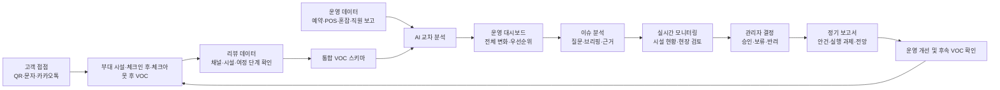

# SensePlace 호텔 VOC·운영 지원 플랫폼 화면설계서

| 항목 | 내용 |
|---|---|
| 문서 구분 | 화면설계서 작업본 |
| 버전 | 3.2 |
| 상태 | 현재 프론트 목업 반영 |
| 문서 기준일 | 2026-07-22 |
| 작성·수정 | 송민지 |
| 프로젝트 | SensePlace 호텔 VOC·운영 이슈 분석 Agent |
| 요구사항 기준 | `docs/markdown/01_요구사항정의서.md` |
| 구현 기준 | `frontend/src` 현재 목업 |

> 고객 여정의 실시간 VOC를 수집하고, 호텔 운영 데이터와 함께 분석해 관리자의 점검·의사결정·보고를 지원하는 화면 기준을 정의한다. 이 문서의 수치와 운영 사례는 별도 표기가 없는 한 `synthetic` 목업 데이터다.

## 1. 문서 목적과 적용 범위

### 1.1 목적

이 문서는 현재 구현된 프론트 목업을 기준으로 다음 항목을 통일한다.

- 관리자와 고객 화면의 정보 구조 및 연결 관계
- 화면별 목적, 정보 우선순위, 입력과 출력
- 클릭·탭·폼·시설 선택 등 주요 상호작용
- 실시간 VOC가 운영 분석과 보고서로 연결되는 흐름
- 정상·빈 결과·로딩·오류·권한 상태의 표시 기준
- 반응형, 접근성, 데이터 신뢰성 및 UI QA 기준

### 1.2 현재 범위

| 구분 | 포함 화면 | 현재 상태 |
|---|---|---|
| 관리자 | 운영 대시보드 | 목업 구현 |
| 관리자 | 실시간 모니터링 | 목업 구현 |
| 관리자 | 이슈 분석 | 목업 구현 |
| 관리자 | 정기 보고서 | 목업 구현 |
| 관리자 | 리뷰 데이터 | 목업 구현 |
| 고객 | 부대 시설 만족도 | 목업 구현 |
| 고객 | 체크인 후 투숙객 안내 | 목업 구현 |
| 고객 | 체크아웃 후 숙박 리뷰 | 목업 구현 |

### 1.3 제외 범위

- 실제 PMS·POS·CRM·IoT·메시지 발송 API 연동
- 실제 인증·SSO·역할별 권한 제어
- AI 분석, 리포트 PDF·PPT 생성 및 공유의 실제 실행
- 시설 대응안의 자동 실행
- 삭제된 데이터 관리 페이지

## 2. UX 방향과 디자인 시스템

### 2.1 경험 원칙

1. 관리자는 첫 화면에서 핵심 변화, 영향, 근거, 다음 행동 순으로 읽는다.
2. 실시간 현황과 경영 보고서를 분리한다. 모니터링은 현장 대응, 정기 보고서는 의사결정에 집중한다.
3. 고객 설문은 한 화면에서 빠르게 완료하며 입력 부담을 최소화한다.
4. AI 결과는 확정 사실처럼 표현하지 않고 관측 사실, 원인 후보, 반대 근거, 권장 확인을 구분한다.
5. 합성 데이터, 분석 시각, 데이터 출처를 관리자 화면에서 식별할 수 있어야 한다.

### 2.2 시각 체계

| 요소 | 기준 |
|---|---|
| 브랜드 | `SENSE PLACE` |
| 관리자 화면 | 네이비 사이드바, 아이보리 배경, 화이트 카드, 브라운·골드 강조 |
| 고객 화면 | 베이지·아이보리·브라운 기반 프리미엄 호텔 모바일 UI |
| 카드 | 둥근 모서리, 얇은 테두리, 부드러운 그림자, 충분한 여백 |
| 상태 | 정상=녹색, 주의=골드/주황, 위험=적색. 아이콘과 문구를 함께 사용 |
| 글꼴 | 제목은 고급스러운 세리프 계열, 본문과 데이터는 가독성 높은 산세리프 계열 |
| 밀도 | 대시보드는 요약 중심, 보고서는 문서형, 고객 화면은 단일 과업 중심 |

## 3. 사용자와 핵심 과업

| 사용자 | 핵심 과업 | 주요 화면 |
|---|---|---|
| 총괄 매니저 `박준희` | 호텔 전체 현황 파악, 우선 이슈 확인, 정기 의사결정 | 운영 대시보드, 정기 보고서 |
| 현장 운영 관리자 | 시설 상태 감시, 원인·VOC 확인, 대응안 검토 | 실시간 모니터링 |
| CX·VOC 담당자 | 수집 채널 확인, 고객 여정별 데이터 성격 검토 | 리뷰 데이터 |
| 투숙객·방문객 | 시설 만족도 제출, 시설 안내 확인, 숙박 리뷰 제출 | 고객 모바일 3종 |

## 4. 정보 구조

### 4.1 관리자 내비게이션

```text
SENSE PLACE VOC Intelligence
├─ 운영 대시보드                 /
├─ 실시간 모니터링               /monitoring
├─ 이슈 분석                     /issues
├─ 정기 보고서                   /reports
└─ 리뷰 데이터                   /evidence-review
   ├─ 부대 시설                  /feedback 임베드
   ├─ 체크인 후                  /guest-guide 임베드
   └─ 체크아웃 후                /stay-review 임베드
```

### 4.2 고객 링크 진입

```text
시설 QR → /feedback?facility={facility_key}
체크인 문자·카카오톡 → /guest-guide?name={guest_name}
체크아웃 문자·카카오톡 → /stay-review?room={room}&from={date}&to={date}&hotel={hotel}
```

실제 배포 시 개인정보는 URL 평문 파라미터 대신 만료되는 서명 토큰으로 전달한다.

### 4.3 관리자 공통 셸

- 왼쪽 고정 사이드바: 브랜드, 5개 메뉴, `박준희 · 총괄 매니저` 프로필, 접기 버튼
- 콘텐츠 상단: 페이지 제목, 설명, 기준 시각 또는 주요 액션
- 운영 대시보드 우측 상단: `KOR/ENG` 언어 선택
- 사이드바 활성 메뉴는 배경, 골드 라인, 굵은 글씨로 구분
- 좁은 화면에서는 사이드바를 접고 콘텐츠를 단일 열로 재배치

- 관리자 5개 페이지의 헤더 계층과 좌우 정보 비율은 동일하게 유지한다.

## 5. 전체 서비스 흐름

### 5.1 전체 VOC 운영 순환



이 흐름에서 각 화면은 독립 메뉴가 아니라 같은 VOC와 운영 이슈를 서로 다른 의사결정 단계에서 보여주는 역할을 한다.

### 5.2 고객 VOC 수집 흐름

1. 고객은 이용 시점에 맞는 QR·문자·카카오톡 링크로 진입한다.
2. 부대 시설은 이용 직후, 체크인 후 화면은 투숙 중, 체크아웃 후 화면은 숙박 종료 후 의견을 수집한다.
3. 세 채널의 응답은 채널·시설·여정 단계·평가·사유·의견 기준으로 통합한다.
4. 리뷰 데이터 화면에서 세 접점의 수집 화면과 분석 활용 차이를 탭으로 검토한다.
5. 통합된 VOC는 운영 데이터와 교차 분석되어 관리자 화면의 근거로 사용된다.

### 5.3 관리자 판단 흐름

1. 운영 대시보드에서 전체 KPI, VOC 변화와 개선 우선순위를 확인한다.
2. AI Assistant 질문을 제출하면 질문 문맥을 유지한 채 이슈 분석으로 이동한다.
3. 이슈 분석에서 자연어 브리핑, 관측 사실, 원인 후보와 우선 확인 항목을 검토한다.
4. 실시간 모니터링으로 이동해 관련 시설의 현재 지표, 최근 VOC와 현장 대응 후보를 확인한다.
5. 관리자는 자동 실행이 아닌 승인·보류·반려와 메모로 판단을 기록한다.
6. 정기 보고서에서 누적 이슈를 경영 안건으로 검토하고 담당·기한·진척도를 관리한다.

### 5.4 화면 전환과 문맥

| 출발 화면 | 사용자 행동 | 도착 화면 | 유지해야 할 문맥 | 현재 목업 |
|---|---|---|---|---|
| 고객 링크 | 설문·리뷰 제출 | 완료 화면 | 채널, 시설, 여정 단계 | 구현 |
| 리뷰 데이터 | 탭 선택 | 고객 화면 미리보기 | 선택 채널과 수집 계약 | 구현 |
| 운영 대시보드 | AI 분석 요청 | 이슈 분석 | 질문 원문 | 구현 |
| 이슈 분석 | 실시간 운영 맵 확인 | 실시간 모니터링 | 후속 구현 시 시설·시간·이슈 ID | 화면 이동 구현 |
| 실시간 모니터링 | 시설 마커 선택 | 시설 상세 패널 | 시설 ID와 현재 상태 | 구현 |
| 실시간 모니터링 | 대응안 판단 | 동일 화면 결과 상태 | 시설, 선택안, 메모, 판단 | 목업 구현 |
| 이슈 분석·모니터링 | 보고 안건 반영 | 정기 보고서 | analysis ID, 시설, 기간, 근거 버전 | 후속 연동 |
| 정기 보고서 | 승인·보류 | 실행 과제 | 안건 ID, 담당, 목표일, 상태 | 목업 구현 |

## 6. 화면 인벤토리

| 화면 ID | 화면명 | 경로 | 사용자 | 상태 |
|---|---|---|---|---|
| `APP-000` | 관리자 공통 셸 | 공통 | 관리자 | 구현 |
| `ADM-010` | 운영 대시보드 | `/` | 관리자 | 구현 |
| `ADM-020` | 실시간 모니터링 | `/monitoring` | 운영 관리자 | 구현 |
| `ADM-030` | 이슈 분석 | `/issues` | 관리자 | 구현 |
| `ADM-040` | 정기 보고서 | `/reports` | 총괄 관리자 | 구현 |
| `ADM-050` | 리뷰 데이터 | `/evidence-review` | CX·VOC 담당자 | 구현 |
| `CUS-010` | 부대 시설 만족도 | `/feedback` | 고객 | 구현 |
| `CUS-020` | 체크인 후 투숙객 안내 | `/guest-guide` | 투숙객 | 구현 |
| `CUS-030` | 체크아웃 후 숙박 리뷰 | `/stay-review` | 투숙객 | 구현 |

## 7. `ADM-010` 운영 대시보드

### 7.1 목적

관리자가 현재 호텔 VOC와 운영 현황의 핵심 변화를 짧은 시간 안에 파악하고 우선 점검 항목으로 이동하게 한다.

### 7.2 화면 구성

1. `호텔 운영 및 VOC 대시보드` 페이지 헤더와 `KOR/ENG` 선택
2. 호텔·시설·주차·채널 필터
3. 자연어 분석 질문 입력 및 추천 질문
4. 운영 요약 브리핑
5. KPI 카드
6. 개선 우선순위
7. VOC 추이 차트
8. 원인 후보 및 가능성
9. 권장 점검 체크리스트
10. 최근 근거 리뷰

### 7.3 주요 상호작용

| 요소 | 동작 | 현재 구현 | 후속 연동 |
|---|---|---|---|
| 언어 선택 | KOR/ENG 전환 | 선택 UI | 전체 번역 리소스 적용 |
| 주차 선택 | 2026년 7월 1~4주차·8월 1주차 선택, 헤더 날짜 범위 동시 변경 | 구현 | 조회 조건과 전체 KPI·차트 API 연동 |
| 추천 질문 | 입력창에 질문 반영 | 목업 | 질문 템플릿 API |
| 분석 요청 | 질문을 `/issues`로 전달 | 구현 | analysis ID 생성 및 결과 조회 |
| 점검 체크 | 완료 상태 토글 | 로컬 상태 | 담당자·완료 시각 저장 |
| 근거 리뷰 | 최신 VOC 확인 | 정적 표 | 필터·상세 drawer 연동 |

### 7.4 표시 원칙

- KPI에는 값, 단위, 비교 기준, 변화 방향을 함께 표시한다.
- 원인 후보는 `가능성`으로 표현하고 근거 없는 확정 원인 표현을 금지한다.
- 데이터가 부족하면 카드 자체를 숨기지 않고 `표본 부족`과 필요한 표본을 안내한다.
- AI Assistant에서 질문을 제출하면 `/issues?q={encoded_query}`로 이동하고 질문 문맥을 이슈 분석 브리핑에 전달한다.
- 빈 질문은 이동하지 않으며, 추천 질문은 입력값으로 선택한 뒤 동일한 분석 요청 흐름을 사용한다.

## 8. `ADM-020` 실시간 모니터링

### 8.1 목적

시설별 운영 상태와 실시간 VOC 신호를 공간 맥락에서 확인하고, 관리자 검토를 거쳐 대응 후보를 기록한다.

### 8.2 레이아웃

- 상단: 화면 제목, 설명, 기준 시각, `Synthetic` 배지
- 왼쪽: 호텔 리조트형 운영 맵, 상태 범례, 시설 마커, 시뮬레이션 제어
- 오른쪽: 선택 시설 상세 패널
- 하단: 시설 상태 요약 목록

### 8.3 운영 맵

- 실제 리조트 안내도처럼 호텔, 컨벤션, 주차장, 로비·부속동을 서로 다른 실루엣으로 표현한다.
- 도로·건물·시설 위치는 하나의 리조트 단지로 이해되도록 일관된 공간 구조를 사용한다.
- 시설 라벨은 건물과 겹치지 않도록 오프셋 위치에 배치하고 리더 라인으로 실제 위치를 연결한다.
- 마커는 정상·주의·위험을 색상, 아이콘, 상태 문구로 중복 표현한다.
- 선택된 시설은 외곽선과 그림자로 강조한다.
- 지도는 운영 의사결정을 위한 개념도이며 실제 길찾기 지도로 오인되지 않게 한다.
- 시설별 운영 지표는 의미가 불분명한 장식 대신 상세 패널과 상태 마커로 일관되게 제공한다.

### 8.4 시설별 상세 계약

조식당, 프런트, 주차장, 객실층, 로비, 컨벤션은 모두 동일한 상세 구조를 사용한다.

| 영역 | 내용 |
|---|---|
| 시설 요약 | 시설명, 상태, 담당 부서 |
| 핵심 지표 | 시설별 대표 값, 단위, 관측 시각 |
| 관측 사실 | VOC·운영 데이터에서 확인한 사실 목록 |
| 원인 후보 | 현재 데이터가 지지하는 설명 |
| 반대 근거 | 단정 방지를 위한 대안 설명·누락 데이터 |
| 최근 VOC | 선택 시설의 대표 고객 의견 |
| 권장 확인·조치 | 현장 확인 순서 또는 대응 후보 |
| 관리자 메모 | 판단 근거 기록 |
| 의사결정 | 승인·보류·반려 및 결과 메시지 |

시설을 변경하면 이전 시설의 메모와 의사결정 상태를 초기화한다.

### 8.5 조식당 시뮬레이션

- 조식당은 대응 옵션 선택과 예상 영향 비교를 추가 제공한다.
- 시뮬레이션은 `synthetic` 예상값이며 실제 조치를 자동 실행하지 않는다.
- 비용과 효과는 근거 데이터·산식이 연결되기 전에는 확정값으로 사용하지 않는다.

### 8.6 상태

| 상태 | 화면 처리 |
|---|---|
| 정상 | 녹색 아이콘과 `정상` 문구 |
| 주의 | 골드 아이콘, 혼잡·대기 등 원인 요약 |
| 위험 | 적색 아이콘, 즉시 확인이 필요한 근거 표시 |
| 데이터 지연 | 마지막 수신 시각과 갱신 지연 표시 |
| 시설 미선택 | 기본 시설을 선택하거나 선택 안내 표시 |

## 9. `ADM-030` 이슈 분석

### 9.1 목적

운영 대시보드에서 관리자가 요청한 질문을 그대로 이어받아 VOC와 운영 데이터의 핵심 변화를 자연어 브리핑으로 설명하고, 원인 후보와 현장 확인 순서를 제공한다.

### 9.2 진입과 질문 전달

```text
운영 대시보드 AI Assistant
  → 질문 입력 또는 추천 질문 선택
  → 분석 요청
  → /issues?q={encoded_query}
  → 전달된 질문을 제목으로 AI 브리핑 표시
```

- `q`가 없거나 공백이면 `이번 주 위험 이슈 요약`을 기본 질문으로 사용한다.
- 질문은 URL에 안전하게 인코딩한다.
- 실제 서비스에서는 URL의 질문을 서버 로그·공유 링크에 남길 수 있으므로 개인정보 입력을 차단하거나 analysis ID 기반 전달로 전환한다.

### 9.3 화면 구성

1. 페이지 제목과 분석 목적
2. `Synthetic data`와 분석 ID
3. AI Assistant 후속 질문 입력
4. 질문을 제목으로 사용하는 AI 브리핑
5. AI 한계와 관리자 확인 필요 고지
6. 부정 VOC, 집중 시간, 평균 대기, 주요 키워드 근거 카드
7. 원인 후보와 근거 상태
8. 관리자 우선 확인 항목
9. 실시간 운영 맵 이동

### 9.4 AI 브리핑 계약

| 영역 | 표시 내용 |
|---|---|
| 질문 해석 | 관리자가 제출한 원문 질문 |
| 자연어 요약 | 핵심 변화, 발생 시간, 영향, 함께 변한 운영지표 |
| 관측 사실 | VOC 건수, 시간대, 대기시간, 키워드와 비교 기준 |
| 원인 후보 | 지지 근거와 `근거 강함·추가 확인·가설` 상태 |
| 한계 | 현장 확인 전 확정 원인이 아님을 명시 |
| 다음 행동 | 담당자가 확인할 항목과 목표 시점 |

분류 점수와 원인 근거 상태를 하나의 종합 신뢰도로 합치지 않는다.

### 9.5 후속 질문과 관련 화면 이동

- 화면 상단 입력창에서 질문을 다시 제출하면 로딩 상태 후 같은 페이지에서 브리핑을 갱신한다.
- 새 질문은 URL에 반영하되 실제 API 연동 시 질문 원문 대신 analysis ID를 사용한다.
- 빈 질문은 현재 결과를 유지한다.
- `실시간 운영 맵에서 확인`을 선택하면 `/monitoring`으로 이동한다.
- 후속 구현에서는 시설·시간·이슈 ID를 함께 전달해 관련 시설을 자동 선택한다.

### 9.6 상태

| 상태 | 화면 처리 |
|---|---|
| 초기 진입 | 전달 질문으로 브리핑 즉시 표시 |
| 재분석 중 | 스피너와 분석 진행 문구 표시 |
| 정상 | 브리핑, 근거, 원인 후보, 확인 항목 표시 |
| 부분 실패 | 기존 수치 유지, 실패한 AI 설명만 재시도 |
| 표본 부족 | 원인 후보 생성을 제한하고 현재 표본 수 표시 |
| 오류 | 질문을 유지하고 안전한 오류와 재시도 제공 |

## 10. `ADM-040` 정기 보고서

### 10.1 목적

운영 현황을 반복 표시하는 대시보드가 아니라, 관리자가 회의에서 안건을 검토하고 실행 결정을 내릴 수 있는 문서형 보고서를 제공한다.

### 10.2 화면 구성

1. 보고 주기 선택: 일간·주간·월간
2. 보고서 생성·PDF 다운로드·공유 액션
3. 경영진 종합 결론
4. 이번 회의에서 결정할 안건
5. 목표 대비 주요 성과
6. 핵심 이슈와 근거
7. 결정 이후 실행 과제
8. 다음 기간 전망과 시나리오
9. 하단 내보내기·공유 액션

### 10.3 의사결정 안건

각 안건은 문제, 근거, 기대 효과, 필요한 결정, 승인·보류 상태를 포함한다. 모든 안건을 검토하지 않아도 현재 결정 수를 확인할 수 있다.
- 승인·보류는 안건별로 동일한 위치와 표현을 사용하며 결정 이후 실행 과제로 이어진다.

### 10.4 실행 추적

| 필드 | 설명 |
|---|---|
| 실행 과제 | 승인된 결정의 후속 업무 |
| 담당 | 책임 부서 또는 담당자 |
| 완료 목표 | 목표일 |
| 상태 | 예정·진행·완료·지연 |
| 진척도 | 백분율과 시각 막대 |

### 10.5 내보내기 원칙

- 현재 생성·다운로드·공유는 토스트를 보여주는 목업이다.
- 실제 연동 시 보고 기간, 생성 시각, 출처, analysis ID, 버전을 포함한다.
- 불완전한 데이터나 마스킹 실패가 있으면 공식 파일 생성을 차단한다.

## 11. `ADM-050` 리뷰 데이터

### 11.1 목적

세 고객 접점 화면을 별도 서비스처럼 강조하지 않고 한 페이지의 탭으로 묶어, VOC 수집 시점과 분석 활용의 차이를 함께 검토한다.

### 11.2 탭 구조

| 탭 | 수집 시점 | 포함 화면 | 주요 데이터 |
|---|---|---|---|
| 부대 시설 | 시설 이용 직후 | `CUS-010` | 시설, 만족도, 사유, 의견 |
| 체크인 후 | 투숙 중 | `CUS-020` | 시설 안내 이용, 당일 만족도, 의견 |
| 체크아웃 후 | 숙박 종료 후 | `CUS-030` | 종합 만족도, 시설별 별점, 불편 항목, 의견 |

### 11.3 공통 정보

- 상단에 실시간 VOC 채널 설명과 통합 VOC Schema를 표시한다.
- 탭 선택 시 수집 화면, 수집 계약, 분석 활용 항목을 함께 전환한다.
- 외부 온라인 리뷰와 실시간 VOC는 출처 유형을 구분해 저장하고, 동일 기간 분석 시 채널별 표본·편향을 분리 표시한다.

## 12. `CUS-010` 부대 시설 만족도

### 12.1 진입과 목적

시설 QR을 스캔하면 해당 시설이 선택된 만족도 페이지가 열린다. 사용자는 최소한의 입력으로 즉시 경험을 전달한다.

### 12.2 화면 구성

1. SENSE PLACE 워드마크와 화면 제목
2. 시설 선택 드롭다운
3. 시설명, 위치·안내 문구
4. 5단계 이모지 만족도
5. 선택 후 나타나는 복수 사유 칩
6. 추가 의견 300자 입력
7. `피드백 보내기` 버튼
8. 개인정보 활용 안내와 완료 화면

### 12.3 시설 선택

- URL의 `facility` 값으로 초기 시설을 지정한다.
- 드롭다운에는 목업에 정의된 전체 부대시설을 제공한다.
- 시설을 변경하면 URL과 화면의 시설 정보가 함께 바뀐다.
- 잘못된 시설 키는 조식 레스토랑을 기본값으로 사용한다.

### 12.4 유효성

- 만족도 선택 전 제출 버튼은 비활성화한다.
- 사유와 추가 의견은 선택 사항이다.
- 제출 후 감사 화면을 표시하며 중복 제출 정책은 API 연동 시 정의한다.

## 13. `CUS-020` 체크인 후 투숙객 안내

### 13.1 목적

체크인 완료 직후 환영 메시지, 시설 정보, AI Concierge 추천과 간단 만족도 수집을 한 흐름으로 제공한다.

### 13.2 화면 구성

1. `Good Afternoon, Guest Name` 환영 메시지
2. 체크인 완료 상태
3. Breakfast, Fitness, Pool, Lounge, Spa, Restaurant, Parking 시설 카드
4. 시설별 운영시간과 위치
5. AI Concierge 실시간 추천 카드
6. 오늘 이용 만족도 5단계
7. 의견 입력과 제출

### 13.3 데이터 원칙

- 고객명은 현재 `name` 파라미터 목업이며 실서비스에서는 토큰 기반 조회를 사용한다.
- 운영시간·혼잡 정보에는 기준 시각과 데이터 출처를 표시한다.
- 추천 정보가 없으면 일반 시설 안내는 유지하고 추천 영역만 빈 상태로 처리한다.

## 14. `CUS-030` 체크아웃 후 숙박 리뷰

### 14.1 목적

문자 또는 카카오톡 링크로 숙박 종료 후 종합 경험과 시설별 평가를 수집한다.

### 14.2 화면 구성

1. 감사 메시지
2. 예약 정보 카드: 객실, 숙박 기간, 호텔
3. 종합 만족도 5단계
4. 시설별 별점: Breakfast, Room, Pool, Fitness, Staff, Cleanliness
5. 불편 항목 복수 선택
6. 추가 의견 500자 입력
7. `리뷰 제출` 버튼과 완료 화면

### 14.3 유효성·보안

- 종합 만족도 선택 후 제출할 수 있다.
- 별점 초기값이 응답으로 오인되지 않도록 실제 연동 시 미선택 상태 또는 명시적 기본 정책을 정한다.
- 예약 정보는 URL 평문 대신 일회성 토큰으로 조회한다.
- 만료·중복·잘못된 링크 상태를 별도 안내한다.

## 15. 공통 데이터 계약

### 15.1 VOC 최소 필드

| 필드 | 설명 |
|---|---|
| `voc_id` | VOC 고유 ID |
| `channel_type` | facility_qr, during_stay, post_stay, online_review 등 |
| `facility_id` | 시설 표준 ID |
| `journey_stage` | 부대 시설, 체크인 후, 체크아웃 후 |
| `rating` | 공통 만족도 또는 환산값 |
| `reason_codes` | 복수 선택 사유 |
| `comment` | 마스킹된 자유 의견 |
| `submitted_at` | 제출 시각 |
| `source_type` | real, public, synthetic |
| `schema_version` | 스키마 버전 |

### 15.2 분석 결과 최소 필드

- `analysis_id`, 분석 기간, 생성 시각
- 시설·채널·여정 필터
- 표본 수와 결측 수
- 관측 사실과 계산식
- 원인 후보와 지지·반대 근거
- 모델·프롬프트·규칙 버전
- 합성 데이터 사용 여부, seed, schema version

## 16. 공통 화면 상태

| 코드 | 상태 | 표시 원칙 |
|---|---|---|
| `S0` | 초기 | 기본 안내와 가능한 행동 표시 |
| `S1` | 로딩 | 기존 문맥을 유지하고 진행 상태 표시 |
| `S2` | 정상 | 값, 기준 시각, 출처 표시 |
| `S3` | 빈 결과 | 조건과 다음 행동 안내 |
| `S4` | 표본 부족 | 현재 n과 최소 기준 표시 |
| `S5` | 부분 성공 | 성공 영역 유지, 실패 영역만 분리 |
| `S6` | 오류 | 안전한 오류 문구, 재시도 또는 문의 안내 |
| `S7` | 권한 없음 | 정보 비노출, 접근 거부 안내 |
| `S8` | 링크 만료 | 고객 링크 재발급 또는 문의 안내 |

## 17. 반응형 설계

### 17.1 관리자 화면

- 1280px 이상: 사이드바와 다열 카드 레이아웃
- 768~1279px: 사이드바 축소, 2열 중심
- 767px 이하: 단일 열, 표는 카드형 또는 가로 스크롤
- 운영 맵은 지도와 상세 패널을 세로 배치하고, 선택 시설명을 상단에 고정한다.
- 보고서는 문서 읽기 순서를 유지하며 버튼을 하단 고정하지 않는다.

### 17.2 고객 화면

- 모바일 우선, 최대 콘텐츠 폭을 제한한다.
- 만족도 5단계는 한 줄을 우선하되 작은 화면에서 라벨이 겹치면 이모지와 라벨을 2행으로 재배치한다.
- 입력창과 제출 버튼의 터치 영역은 최소 44px 이상으로 한다.

## 18. 접근성

- 모든 아이콘 버튼에 접근 가능한 이름을 제공한다.
- 현재 메뉴와 현재 탭은 `aria-current` 또는 선택 상태로 전달한다.
- 시설 마커는 시설명, 상태, 핵심 지표를 하나의 레이블로 읽는다.
- 색상만으로 상태를 구분하지 않고 아이콘·텍스트를 병행한다.
- 키보드만으로 사이드바, 탭, 시설 마커, 별점, 만족도, 칩, 제출을 조작할 수 있어야 한다.
- focus 표시를 제거하지 않고 카드 배경과 3:1 이상 대비를 확보한다.
- 차트와 지도는 동일 정보를 제공하는 텍스트 요약 또는 목록을 함께 제공한다.

## 19. 콘텐츠 가이드

### 19.1 관리자 문체

- `원인` 대신 `원인 후보`, `예상`, `함께 관측됨`을 사용한다.
- `자동 처리` 대신 `관리자 검토 필요`, `실행 후보 등록`을 사용한다.
- 수치에는 기간, 단위, 비교 기준을 붙인다.

### 19.2 고객 문체

- 짧고 정중하며 입력 이유와 선택 여부를 명확히 안내한다.
- 필수·선택 항목을 구분한다.
- 제출 완료 후 활용 목적과 감사 메시지를 제공한다.

## 20. UI QA 시나리오

| 테스트 ID | 시나리오 | 기대 결과 |
|---|---|---|
| `UX-TC-001` | 관리자 메뉴 이동 | 현재 메뉴가 강조되고 해당 경로가 열린다. |
| `UX-TC-002` | 사이드바 접기·펼치기 | 아이콘과 tooltip으로 메뉴 의미가 유지된다. |
| `UX-TC-019` | 대시보드 AI Assistant 질문 제출 | `/issues`로 이동하고 제출 질문이 브리핑 제목과 URL에 유지된다. |
| `UX-TC-020` | 이슈 분석에서 후속 질문 제출 | 로딩 후 같은 화면의 브리핑과 URL 질문이 갱신된다. |
| `UX-TC-021` | 빈 질문 제출 | 화면 이동이나 기존 브리핑 변경 없이 입력을 유지한다. |
| `UX-TC-022` | 이슈 분석에서 운영 맵 이동 | `/monitoring`이 열리고 관리자 셸이 유지된다. |
| `UX-TC-003` | 운영 맵의 6개 시설 순차 선택 | 각 시설의 지표·근거·VOC·권장 조치가 오른쪽에 표시된다. |
| `UX-TC-004` | 시설 전환 | 이전 메모와 의사결정 상태가 남지 않는다. |
| `UX-TC-005` | 조식 시뮬레이션 실행 | 예상 상태와 비교표가 갱신되고 synthetic 안내가 유지된다. |
| `UX-TC-006` | 맵 축소·모바일 전환 | 건물·라벨·안내 카드가 겹치지 않고 상세 패널이 아래로 이동한다. |
| `UX-TC-007` | 정기 보고서 주기 변경 | 선택 주기가 활성화되고 보고서 문맥이 유지된다. |
| `UX-TC-008` | 보고 안건 승인·보류 | 안건별 상태와 전체 결정 건수가 갱신된다. |
| `UX-TC-009` | 리뷰 데이터 탭 전환 | 부대 시설·체크인 후·체크아웃 후 화면과 계약이 함께 바뀐다. |
| `UX-TC-010` | QR 시설 키 진입 | 해당 시설이 선택된 만족도 화면이 열린다. |
| `UX-TC-011` | 만족도 미선택 제출 | 제출이 차단되고 선택 안내가 유지된다. |
| `UX-TC-012` | 사유 칩 복수 선택 | 여러 사유가 독립적으로 선택·해제된다. |
| `UX-TC-013` | 체크인 후 추천 데이터 실패 | 시설 안내와 만족도 설문은 계속 사용할 수 있다. |
| `UX-TC-014` | 체크아웃 링크 만료 | 예약 정보를 노출하지 않고 재발급 안내를 표시한다. |
| `UX-TC-015` | 키보드만으로 주요 흐름 수행 | 기능 손실 없이 focus 순서와 선택 상태를 확인한다. |
| `UX-TC-016` | 200% 확대 | 핵심 정보와 버튼이 겹치거나 잘리지 않는다. |
| `UX-TC-017` | 마스킹 실패 데이터 조회 | 원문과 다운로드를 차단하고 안전한 오류만 표시한다. |
| `UX-TC-018` | 분석 일부 실패 | KPI 등 성공 결과를 유지하고 실패 카드만 재시도한다. |
| `UX-TC-023` | 세 고객 접점에서 VOC 제출 | 채널·시설·여정 단계가 통합 스키마에 구분되어 리뷰 데이터 분석으로 연결된다. |
| `UX-TC-024` | 대시보드에서 이슈 분석 요청 | 질문 문맥이 유지되고 브리핑·근거·원인 후보를 확인할 수 있다. |
| `UX-TC-025` | 이슈 분석에서 현장 확인 이동 | 모니터링 화면이 열리고 후속 연동 시 시설·시간·이슈 ID를 이어받는다. |
| `UX-TC-026` | 이슈 검토부터 정기 보고까지 진행 | 근거와 관리자 판단이 보고 안건·담당·기한·실행 상태로 연결된다. |

## 21. 구현 상태와 후속 과제

### 21.1 확인된 구현

- 관리자 5개 메뉴의 공통 사이드바와 접기 기능
- `호텔 운영 및 VOC 대시보드`와 KOR/ENG·주차 선택 UI
- 관리자 화면의 일관된 헤더 계층과 내비게이션
- 실시간 운영 맵, 충돌 방지 라벨, 6개 시설 상세 패널
- 조식 시뮬레이션과 관리자 의사결정 목업
- 문서형 정기 보고서와 안건 결정 UI
- 리뷰 데이터 3개 탭과 고객 화면 임베드
- 고객 모바일 3종의 입력·완료 화면
- 운영 대시보드 질문을 전달받아 브리핑·근거·원인 후보·후속 질문을 제공하는 이슈 분석 화면

### 21.2 후속 구현 필요

1. 실제 라우터 적용과 브라우저 상태 복구
2. API·DB·AI 분석 연동 및 analysis ID 관리
3. 이슈 분석 질문의 개인정보 입력 차단과 서버 저장 정책
4. 로그인·역할·권한·감사 로그
5. 고객 링크 서명·만료·중복 제출 제어
6. 실시간 데이터 갱신·지연·연결 끊김 상태
7. 보고서 PDF·PPT 생성, 다운로드, 공유
8. 다국어 번역 리소스와 언어 상태 유지
9. 실제 시설 위치·운영정보 검증 및 지도 자산 사용 권한 확인

## 22. 최종 수용 기준

1. 관리자 5개 메뉴와 고객 3개 화면의 목적·경로·전환이 문서와 일치한다.
2. 실시간 모니터링에서 모든 시설이 동일한 상세 계약으로 동작한다.
3. 운영 대시보드와 정기 보고서의 역할이 중복되지 않는다.
4. 리뷰 데이터에서 세 VOC 접점이 탭으로 통합되고 채널 차이가 설명된다.
5. 합성 데이터와 AI 추정이 실제 사실·자동 실행으로 오인되지 않는다.
6. 정상 외 로딩·빈 결과·표본 부족·부분 실패·오류·권한·링크 만료 상태가 정의된다.
7. 모바일, 200% 확대, 키보드, 색상 외 상태 구분을 검증한다.
8. 실제 연동 전 개인정보, 링크 토큰, 데이터 출처, 시설 정보와 브랜드 자산 권한을 확정한다.

## 23. 변경 내역

| 버전 | 일자 | 작성·수정 | 내용 |
|---|---|---|---|
| 3.2 | 2026-07-22 | 송민지 | 고객 VOC 수집부터 통합 분석, 대시보드, 이슈 브리핑, 현장 모니터링, 관리자 판단, 정기 보고와 후속 개선으로 이어지는 전체 화면 흐름·전환 문맥·통합 QA 반영 |
| 3.1 | 2026-07-22 | 송민지 | 운영 대시보드 AI Assistant 질문을 `/issues`로 전달하고 AI 브리핑·근거·원인 후보·후속 질문·운영 맵 이동으로 이어지는 이슈 분석 화면과 QA 기준 반영 |
| 3.0 | 2026-07-22 | 송민지 | 현재 프론트 목업 기준으로 관리자 IA, 고객 VOC 3종, 실시간 운영 맵, 시설 상세, 정기 의사결정 보고서와 UI QA를 전면 개편 |
| 2.0 | 2026-07-21 | 송민지 | 요구사항 중심 화면 구조 및 상태 정의 |
