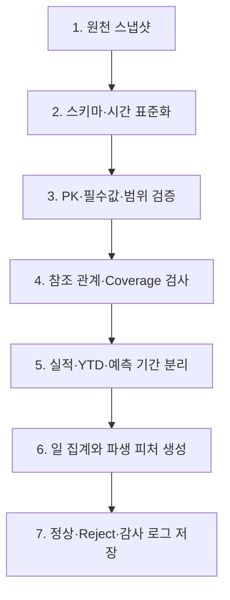

# 데이터전처리결과서

| 항목 | 내용 |
|---|---|
| 문서 설명 | Answervice 합성 데이터의 적재 현황, 품질 진단과 전처리 기준을 정리한 작업본 |
| 문서 분류 | 산출물 작업본 |
| 버전 | v1.0 |
| 문서 기준일 | 2026-07-30 11:52 |
| 작성·수정 | 김재홍 |
| 산출물 번호 | 06 |
| 제출 일자 | — |
| 대응 템플릿 | `templates/[데이터 전처리] 데이터 전처리 결과서_27기_0팀.docx` |

## /TL;DR

- 6개 물리 DB에 **3,165,138건**의 합성 운영 데이터가 실제 적재되어 있다.
- 49개 물리 테이블 중 33개에 데이터가 있으며, `pms_stays_actual` 167,071건은 파생 View라 총계에서 제외한다.
- 19개 조회 객체의 키는 NULL과 중복이 없고, 10개 내부 참조 관계도 미매칭이 없다.
- 이번 단계는 **원천 적재 및 품질 진단 완료**이며, 값 대체·행 삭제·정제 결과 저장·ML 학습은 아직 실행하지 않았다.
- 다음 핵심 작업은 정상/reject/audit 계층 생성, 시간 분할 실행, 객실 수요 예측용 일 단위 curated 데이터 생성이다.

## /ELI10

서로 다른 여섯 창고에 물건이 쌓여 있다고 생각하면 된다. 창고마다 이름표와 날짜 표기 방식이 다르기 때문에, 바로 한 상자에 섞으면 수량이 중복되거나 미래 물건이 과거 물건에 섞일 수 있다.

이번 작업에서는 물건을 버리거나 바꾸지 않았다. 대신 다음을 확인했다.

1. 각 창고에 물건이 실제로 몇 개 있는지 셌다.
2. 같은 번호가 두 번 나오거나 번호가 비어 있는지 검사했다.
3. 주문 상세처럼 부모 주문이 필요한 데이터가 고아 상태인지 확인했다.
4. 취소일처럼 상황에 따라 비어 있어도 되는 값과 실제 오류를 구분했다.
5. 앞으로 정리할 때 사용할 공통 규칙과 보관 위치를 정했다.

즉, **청소를 끝낸 것이 아니라 청소 전에 모든 방을 조사하고 청소 규칙을 확정한 상태**다.

## /LISTIFY: 확인된 데이터 현황

| DB | 엔진 | 물리 적재 건수 | 주요 데이터 |
|---|---:|---:|---|
| app_db | PostgreSQL | 2,013 | 기준정보와 재현성 메타 |
| pms_db | PostgreSQL | 494,377 | 고객·예약·객실 재고·투숙 |
| pos_db | MySQL | 1,333,450 | 매장·서비스 기간·주문·주문 상세 |
| crm_db | SQL Server | 600,002 | 회원·등급 이력·포인트·고객 매핑 |
| facility | ClickHouse | 718,392 | 시설 이벤트·인력·자원 사용 |
| banquet_db | PostgreSQL | 16,904 | 연회 예약·매출 |
| **합계** |  | **3,165,138** | 파생 View 제외 |

## /VISUALIZE#1: 전체 흐름

## 품질 진단 결과

| 영역 | 결과 | 의미 |
|---|---:|---|
| 합성 원천 | 3,163,115건, 100% synthetic | 실데이터와 권한·계층 분리 필요 |
| 키 품질 | 19개 객체 모두 NULL 0, 중복 0 | 식별자 기준 정상 |
| 내부 참조 | 10개 관계 미매칭 0 | 부모-자식 관계 정상 |
| 외부 고객키 | POS 20,672 / 시설 16,800 / 연회 400건 미출현 | 삭제하지 않고 coverage로 관리 |
| 시간 형식 | ClickHouse DateTime64가 Trino에서 문자열 노출 가능 | UTC 명시 변환 및 실패 reject 필요 |
| 예측 누수 | 일부 데이터가 2026-12-31까지 존재 | 실적·YTD·예측 시나리오 분리 필요 |
| 운영 테이블 | app_db 16개 테이블 0건 | 기능 데이터 유입 후 재진단 필요 |

## /VISUALIZE#2: 전처리 단계

## /SIMPLIFY: 무엇을 했고 무엇을 하지 않았나

| 항목 | 상태 | 설명 |
|---|---|---|
| 실제 DB 적재 확인 | 완료 | 6개 DB, 3,165,138건 |
| 키·내부 참조 검증 | 완료 | 중복·고아 행 없음 |
| 조건부 결측 규칙 | 완료 | 상태에 따라 정상 NULL과 오류 분리 |
| 외부키 coverage 확인 | 완료 | 미출현 수를 연결 한계로 기록 |
| 값 대체·행 삭제 | 미수행 | 원본을 변경하지 않음 |
| 정제 데이터셋 저장 | 미수행 | standardized/validated/curated 계층 필요 |
| Train/Validation/Test 생성 | 미수행 | 시간 분할 기준만 확정 |
| ML 학습·평가 | 미수행 | 객실 수요 예측 단계에서 수행 |

## 학습·검증·테스트 권장 분할

- Train: 2022-01-01 ~ 2024-12-31
- Validation: 2025-01-01 ~ 2025-12-31
- Test: 2026-01-01 ~ 2026-07-28
- 제외: 2026-07-29 이후 `FORECAST_SCENARIO`
- CRM 예외: 2024년까지이므로 별도 분할 또는 2025~2026 시나리오 재생성 필요

## /MUDA: 지금 하지 않아야 할 일

불필요한 작업을 늘리면 문서 분량만 늘고 데이터 신뢰도는 그대로다. 현재 단계에서 다음은 보류하는 편이 맞다.

- 결측값을 0이나 평균으로 일괄 대체하기
- 파생 View를 물리 적재 건수에 다시 더하기
- 외부 고객키 미출현 행을 무조건 삭제하기
- 2026년 예측 시나리오를 학습 데이터에 포함하기
- 정제 데이터셋이 없는데 ML 성능 수치를 먼저 만들기
- 정형 데이터만 있는 상태에서 RAG·VectorDB·GraphDB 완료로 표현하기

## 다음 실행 순서

1. `raw`, `standardized`, `validated`, `curated`, `audit`, `reject` 계층을 확정한다.
2. 18개 원천 테이블의 공통 검증 SQL을 자동화한다.
3. 실행별 `run_id`, 버전, query hash, 입력·정상·reject 건수를 저장한다.
4. 실적·YTD·예측 시나리오 필터를 공통 함수나 View로 고정한다.
5. 객실 수요 예측용 일 단위 curated 테이블을 생성한다.
6. 시간 분할을 실제로 적용한 뒤에만 ML 학습과 평가를 시작한다.

## 재현성 기준

| 항목 | 값 |
|---|---|
| data class | synthetic |
| seed | 20260729 |
| schema version | 1.0.0 |
| scenario version | 1.0.0 |
| fixture version | 1.0.0 |
| 검증 브랜치 | dev |
| 검증 commit | `8fb2a871a56c90928b54bc445729c49f406fb56a` |

## 최종 판정

현재 데이터는 **원천 적재와 기본 품질 검증 관점에서는 양호**하다. 그러나 전처리 완료를 “정제 데이터셋 생성 완료”로 해석하면 아직 미완료다. 평가 시에는 다음 문장으로 설명하는 것이 가장 정확하다.

> 6개 이기종 DB의 합성 데이터 3,165,138건을 적재하고, 키·참조 무결성·조건부 결측·기간 상태·재현성을 검증했다. 현재는 품질 진단과 전처리 기준 정의를 완료했으며, 후속 단계에서 정상·reject·감사 계층과 시간 분할 데이터셋을 생성한다.

## 변경 내역

| 버전 | 일시 | 요약 |
|---|---|---|
| v1.0 | 2026-07-30 11:52 | 데이터전처리결과서 작업본 등록 및 표준 문서 메타데이터 적용 |
