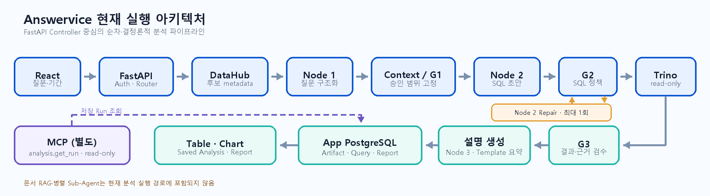

# AI 시스템 아키텍처 (멀티 에이전트 아키텍처)

| 항목 | 내용 |
|---|---|
| 문서 설명 | Answervice의 현재 코드 기준 AI 시스템 아키텍처와 제어·신뢰성·평가 전략 |
| 문서 분류 | 산출물 작업본 |
| 버전 | v1.1 |
| 문서 기준일 | 2026-08-13 11:36 KST |
| 작성·수정 | 박준희·김재홍 / Codex 반영 |
| 산출물 번호 | 12 |
| 제출 일자 | 2026-08-14 |
| 대응 템플릿 | `docs/templates/[모델링 및 평가] AI 시스템 아키텍처 (멀티 에이전트 아키텍처)_양식_27기_0팀.docx` |

## 1. 에이전트 설계 개요

### 1.1 서비스 개요 및 목적

Answervice는 호텔 운영 질문을 승인된 데이터 범위 안에서 SQL로 변환하고, 읽기 전용 연합 조회 결과를 표·차트·근거·리포트로 제공하는 대화형 데이터 분석 서비스다. 현재 구현은 자율 Agent들이 직접 협업하는 구조가 아니라, FastAPI Controller가 전문화된 AI Node와 결정론적 Gate를 고정 순서로 호출하는 **제어형 멀티 노드 AI 아키텍처**다.

### 1.2 주요 사용자 및 핵심 기능

- `hotel_analyst`: 자연어 질문 분석, 표·차트·Evidence 확인, Saved Analysis 저장·재실행, Artifact 기반 Report 초안 생성
- `report_admin`: Report 승인·수동 실행·예약 실행·Report Assistant 사용
- 핵심 기능: Bearer 인증, 승인 자산 검색, 질문 구조화, SQL 생성·검수, Trino 연합 조회, 결과 검수, 설명·Artifact 생성
- 분석 대상: 합성 PMS·Banquet·POS·CRM·Facility 데이터와 승인된 serving context
- 결과 추적: Analysis 상태 전이, Query checksum, Artifact checksum, prompt/model/policy version, source·기간 근거 저장
- 보조 연동: `/mcp`의 `analysis.get_run@1.0.0`을 통해 소유자 본인의 저장된 Analysis Run만 읽기 전용 조회

### 1.3 에이전트 시스템 설계 목표

- Controller가 권한·상태 전이·모델 호출 예산·Gate 통과 여부를 단일 통제한다.
- Node의 생성 결과를 strict schema로 제한하고, 실행 전후에 G1·G2·G3를 적용한다.
- DataHub live metadata, versioned contract, Trino read-only 정책을 결합해 승인 범위 밖 조회를 차단한다.
- 결과와 근거를 동일 Artifact에 결속해 재현성과 감사 가능성을 확보한다.
- 실패를 오래된 결과나 fake 결과로 대체하지 않고 명시적인 terminal 상태와 오류로 반환한다.

### 1.4 설계 시 고려사항

문서와 코드가 다른 경우 현재 `dev` 작업 트리의 코드·설정·테스트를 기준으로 판정했다.

| 템플릿·문서에서 오해 가능한 표현 | 현재 코드 기준 반영 |
|---|---|
| LangGraph 기반 자율·병렬 Agent 협업 | 중앙 FastAPI Controller의 동기식 순차 orchestration |
| Node가 MCP Tool을 자율 호출 | MCP는 핵심 분석 흐름 밖의 저장 Run 조회 API |
| VectorDB·GraphDB 기반 RAG | 현재 runtime에 RAG 검색 경로 없음 |
| 별도 Fine-tuned sLLM 고정 사용 | 기본 설정은 OpenAI-compatible `gpt-5.4-mini`; 별도 provider는 선택적 adapter 경계 |
| SQL compiler가 Node 2 SQL을 대체 | Node 2가 생성한 SQL을 parameter sealing 후 G2에서 검증하고, 일반 경로만 Repair 1회 허용 |
| 모든 성공 경로에서 Node 3 호출 | 일반 경로만 Node 3, 승인 Template 경로는 결정론적 요약 생성 |

별도 Sub-Agent 병렬 실행과 Join Node는 현재 없다. `ConcurrentExecutionGate`의 최대 2건은 서로 다른 Analysis 요청의 동시 실행 제한이며, 한 요청 안의 Node 병렬화가 아니다. 문서 RAG와 ML-as-a-Tool은 향후 편입 대상이지 현재 구현 사실이 아니다.

## 2. 멀티 에이전트 아키텍처

### 2.1 에이전트 아키텍처



그림 1. FastAPI Controller 중심의 순차·결정론적 분석 파이프라인. DataHub는 live metadata를 검증하고, Trino는 G2 token이 있는 읽기 전용 쿼리만 실행한다. MCP는 App PostgreSQL에 저장된 본인 Run을 조회하는 별도 경로다.

### 2.2 구성 및 역할 정의

| 에이전트 명 | 기술 스택 | 주요 역할 및 책임 |
|---|---|---|
| Node 1 Interpreter | `node1.normalize@PROMPT-v1.2.0`, strict JSON Schema | 질문·승인 business term·기간을 intent, metric, dimension으로 구조화. dataset·권한·SQL·Gate를 결정하지 않음 |
| Node 2 SQL Generator | `node2.sql@PROMPT-v1.2.13`, OpenAI-compatible adapter | 승인 Context 안에서 SQL과 사용 asset·metric을 생성. 실행 권한과 정책 통과 판정 권한 없음 |
| Node 2 Repair | `node2.repair@PROMPT-v1.2.11` | G2가 정규화한 위반과 거절 SQL을 동일 Context 안에서 1회 교정. 반복 재계획 금지 |
| Node 3 Narrator | `node3.explain@PROMPT-v1.2.1` | G3 통과 결과·metric·기간·source를 설명. SQL 수정, 수치 재계산, 근거 없는 원인 추론 금지 |
| Report Assistant | `report.assistant@PROMPT-v1.0.0` | 승인 Artifact에서 제목·요약·table/chart 제목 초안을 생성. 조회·승인·실행 권한 없음 |

Node 간 직접 통신, 공유 scratchpad, 자율 Tool 선택은 없다. 모든 입력·출력은 Controller가 `MODEL-v1.1.0` Node I/O 계약으로 검증한다.

### 2.3 에이전트 오케스트레이션 및 상태 관리

Controller는 `POST /analysis` 요청 안에서 순차 실행한다. Router가 `APPROVED_TEMPLATE` 또는 `GENERAL_LLM` 경로를 선택하고, General 경로의 G2 위반만 Repair 후 G2 재검사를 1회 수행한다. Template 경로는 Repair하지 않는다. 병렬 Sub-Agent와 Join은 없으며, Controller가 검수 결과와 Trace를 최종 상태에 합친다.

주요 공유 상태는 다음과 같다.

- `RequestContext`: `request_id`, `trace_id`, `conversation_id`, `user_id`, `role`, `as_of`, `timezone`, `contract_version`
- `ContextPackage`: `context_release`, `policy_version`, `time_version`, `entitlement_hash`, `assets`, `dataset_count`, `column_count`, `token_count`, `token_limit`, `package_hash`, `approved_join_ids`, `metrics`, `parameter_bindings`, `required_filters`
- `AnalysisData`: `status`, `transitions`, `route`, `template_id`, `gates`, `result`, `trace`, `repair_count`, `artifact`
- 상태: `RECEIVED → ROUTED → SUCCEEDED | BLOCKED | PARTIAL | FAILED | CANCELLED`
- Trace stage: `ROUTER`, `CONTROLLER`, `CONTEXT`, `G1`, `MODEL`, `G2`, `REPAIR`, `QUERY`, `G3`, `ARTIFACT`
- 모델 호출 예산: 요청당 최대 4회, Node 2 Repair 최대 1회, 서로 다른 Analysis 동시 실행 최대 2건
- plan/result cache: process-local 각 128건. Context·policy·entitlement·as-of·watermark·mask scope를 key에 포함하고, cache hit에도 G2를 다시 수행

### 2.4 기술 스택 및 연동 구조

- Frontend: React `19.2.7`, Vite `8.1.5`, Recharts `3.10.0`, Nginx `1.28-alpine`; 제품 route는 `/agent`, `/reports`
- Control Plane: Python `3.12`, FastAPI `>=0.115,<1.0`, Pydantic strict contract, SQLAlchemy `2.x`, Alembic head `20260813_14`
- Metadata·Query: DataHub Core `v1.7.0`, Trino `476`, file-based read-only access control
- Source: PostgreSQL `16.13` PMS·Banquet, MySQL `8.4.6` POS, SQL Server `2022-CU17` CRM, ClickHouse `24.8.4.13` Facility
- Model: 기본 `gpt-5.4-mini`; transport 최대 2회 시도, 연속 실패 2회에서 circuit open, fake fallback 없음
- Storage: App PostgreSQL에 Analysis·상태 전이·Query·Artifact·Audit 저장. raw SQL은 `[REDACTED]`로 저장하고 hash·checksum·source·기간 근거를 보존
- Report: Backend lifespan 내부의 단일-process Scheduler가 `daily`, `weekly`, `monthly` 예약을 polling하며 별도 queue/worker service는 없음
- MCP: protocol `2026-07-28`, `tools/list`·`tools/call`, read-only `analysis.get_run` 1개. Analysis Node orchestration에는 연결되지 않음

## 3. Workflow

1. React가 Bearer token, 질문, 시작일·종료일을 FastAPI에 전송한다.
2. 인증·role 검증 후 Controller와 Router가 Analysis 상태를 `RECEIVED → ROUTED`로 전이한다.
3. Adapter가 Trino·DataHub health를 확인하고, versioned contract 후보를 DataHub exact URN·schema·column과 대조한다.
4. Node 1이 질문·metric·기간을 구조화하고, `ContextPackageBuilder`가 G1 승인 범위를 고정한다. 최대 8 dataset, 60 column, 6,000 token 또는 model context의 25%를 적용한다.
5. 승인 Template·plan cache를 사용할 수 없으면 Node 2가 SQL 초안을 생성한다. Controller가 기간·필터 literal을 typed parameter로 봉인한다.
6. G2가 단일 `SELECT`/`WITH…SELECT`, `LIMIT 1~1000`, asset·column·metric·binding·join·time·required filter를 검사한다. unsafe SQL은 즉시 차단한다.
7. General 경로의 교정 가능한 G2 위반만 Node 2 Repair 1회 후 재검사한다. 두 번째 Repair나 무한 loop는 없다.
8. G2 token이 있는 SQL만 result cache 또는 읽기 전용 Trino로 실행한다. timeout 시 cancel을 요청하고 terminal 취소가 확인되지 않으면 실패 처리한다.
9. G3가 Evidence와 scalar row schema, suspicious empty, 최대 100행·20열·2,000 cell을 검사한다. 실패하면 Artifact를 생성하지 않는다.
10. 일반 경로는 Node 3 설명, Template 경로는 `TEMPLATE-RESULT-v1.0.0` 결정론적 요약을 만든다. Query·Artifact·Audit을 App PostgreSQL에 저장한 뒤 표·차트·Evidence·Report에 제공한다.

## 4. 시스템 장애 대응 및 신뢰성 설계

### 4.1 RAG 검색 및 데이터 누락 대응

현재 분석 runtime에는 RAG·VectorDB·GraphDB 검색이 없다. 따라서 문서 검색 결과를 근거로 사용하는 fallback도 없다. DataHub exact URN·schema·column 검증, versioned contract, G1 package limit 중 하나라도 충족하지 못하면 fail-closed 한다. Trino 결과가 의심스러운 empty이면 G3에서 차단하며, 누락을 추정값이나 이전 결과로 보충하지 않는다.

### 4.2 판단 오류 및 무한 루프 대응

Node I/O strict schema, 요청당 모델 호출 최대 4회, transport 최대 2회, Repair 최대 1회를 코드로 제한한다. `UNSAFE_SQL`과 Template 위반은 Repair 없이 차단한다. Node 3에는 G3 통과 결과만 전달하고 SQL 변경·수치 재계산·근거 없는 원인 추론을 금지한다.

### 4.3 외부 시스템 및 API 장애 대응

Readiness 모델 probe는 최대 3회·회당 5초이며, DataHub·Trino health를 요청 경로에서 확인한다. Trino timeout은 cancel 후 terminal 상태를 확인하고, 모델 연속 실패 2회에는 circuit을 연다. 외부 장애를 fake·fixture·오래된 결과로 대체하지 않고 `BLOCKED`, `FAILED`, `PARTIAL`, `CANCELLED`와 stage trace로 반환한다.

### 4.4 출력 검수 (Guardrails)

G3는 `evidence_complete`, filter·sampling·masking schema, scalar rows, suspicious empty, 100행·20열·2,000 cell 상한을 검증한다. 통과한 경우에만 Query와 Artifact를 영속화한다. Artifact에는 table snapshot, chart spec, narrative, evidence, checksum을 함께 저장하며 raw SQL은 노출하지 않는다.

## 5. 평가 및 테스트 전략

| 평가 대상 | 측정 지표 (Metrics) | 목표치 |
|---|---|---|
| Node I/O 계약 | strict request·response schema 적합률 | 100% |
| G1·G2·G3 Guardrail | 비승인 Context·unsafe SQL·부적합 Result 차단률 | 100% |
| Repair 제어 | Analysis별 `repair_count` | 1회 이하 |
| Artifact 무결성 | G3 실패 시 Artifact 미생성률 | 100% |
| Golden Path | Docker·HTTP·외부 model·DataHub·Trino·UI E2E 성공률 | 100% |

현재 문서 작성 시점에 다음 선택 테스트를 실행했다.

```text
python -m pytest tests/ai/test_node1.py tests/ai/test_node2.py tests/ai/test_node3.py
  tests/ai/test_contracts.py tests/backend/test_analysis_pipeline.py
  tests/backend/test_execution_control.py tests/backend/test_context_builder.py
  tests/backend/test_mcp_protocol.py -q
```

결과는 `77 passed, 62 subtests passed`다. 다만 Docker Compose, 실제 HTTP, 외부 model, live DataHub·Trino, frontend를 한 번에 연결한 전체 제품 E2E는 이번 문서 작업에서 **Not Run**이며, 해당 목표를 달성했다고 판정하지 않는다.

## 6. 결론 및 향후 개선 방향

현재 Answervice는 자율 Agent의 자유로운 상호작용보다 중앙 Controller, strict contract, G1·G2·G3, read-only query, Evidence 결속을 우선한 구조다. 이 구조는 Node별 책임을 분리하면서도 실행 권한과 최종 판정을 결정론적 Control Plane에 남겨 보안·재현성·감사 가능성을 확보한다.

향후에는 실제 Docker·HTTP·외부 model·DataHub·Trino·UI Golden Path를 CI에서 자동화하고, 외부 model 장애·부하·circuit 복구 시험을 정례화한다. RAG·ML-as-a-Tool·별도 model provider는 권한·contract·평가 Gate가 승인된 뒤 현재 Controller와 Guardrail을 우회하지 않는 adapter로만 편입한다. 현재 작업 트리에 별도 공식 일정 문서가 없어 제출일은 현행 WBS의 `2026-08-14`를 적용했다.

## 변경 내역

| 버전 | 일자 | 작성·수정 | 내용 |
|---|---|---|---|
| v1.1 | 2026-08-13 | 박준희·김재홍 / Codex 반영 | Trino 이후 반환 방향, G2 Repair 재검사, Node 3·Template 요약 분기를 아키텍처 그림에 교정 |
| v1.0 | 2026-08-13 | 박준희·김재홍 / Codex 반영 | 현재 코드·설정·테스트를 우선해 AI 시스템 아키텍처 최초 작성 |
