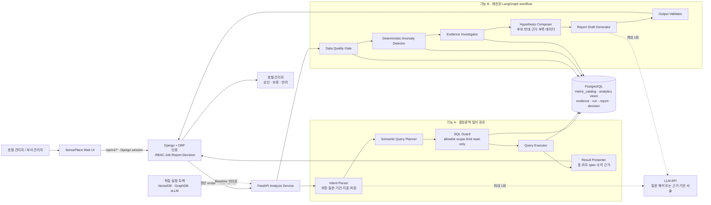
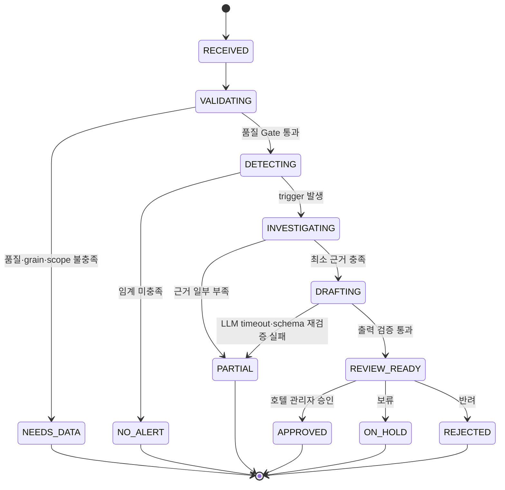
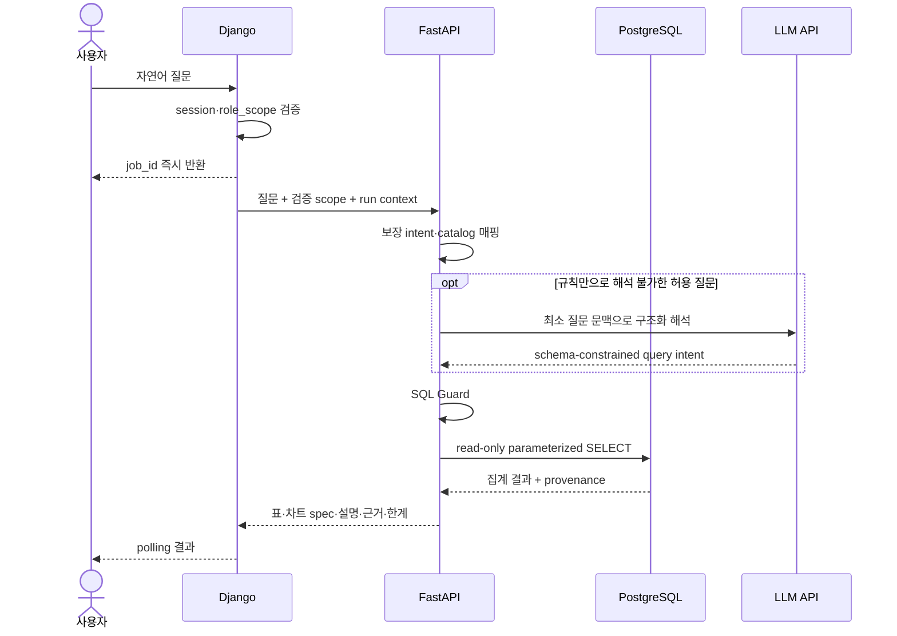
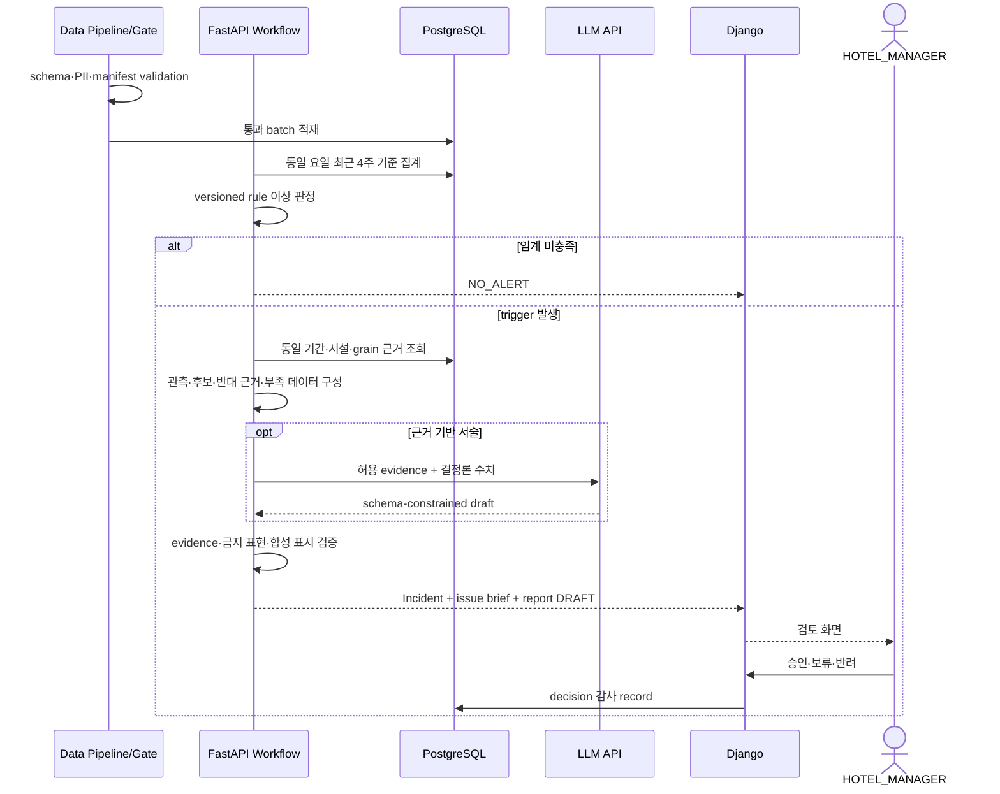

# SensePlace AI 시스템 아키텍처

| 항목 | 내용 |
|---|---|
| 문서 설명 | 지금까지 확정된 요구사항·기획·화면 흐름을 구현 가능한 AI 시스템 경계와 실행 흐름으로 정리한 작업본 |
| 문서 분류 | 산출물 작업본 |
| 버전 | v0.1 |
| 문서 기준일 | 2026-07-21 00:00 |
| 작성·수정 |  |
| 산출물 번호 | 12 |
| 제출 일자 | 2026-08-14 |
| 대응 템플릿 | `docs/templates/[모델링 및 평가] AI 시스템 아키텍처 (멀티 에이전트 아키텍처)_양식_27기_0팀.docx` |
| 구현 상태 | 설계 초안 — 실제 코드·DB·API·모델 연결 전 |

> **결론:** SensePlace는 Django가 인증·권한·상태·승인을 소유하고, FastAPI가 read-only 분석을 수행하며, PostgreSQL이 수치와 근거의 단일 기준이 되는 구조를 사용한다. LLM은 질문 해석과 근거 기반 서술에만 제한적으로 사용한다. 기능 A는 결정론적 파이프라인, 기능 B만 제한된 LangGraph workflow를 사용하며 모든 실행은 호텔 관리자의 승인·보류·반려에서 종료한다.

## 1. 에이전트 설계 개요

### 1.1 서비스 개요 및 목적

SensePlace는 단일 호텔을 모델링한 `synthetic` VOC·운영 데이터를 교차 분석하는 내부 운영 지원 PoC다. 사용자가 권한 범위 안에서 제한된 자연어 질문을 조회하는 **기능 A**와, 품질 검사를 통과한 데이터에서 이상을 탐지해 근거·원인 후보·주간 보고서 초안을 만드는 **기능 B**를 제공한다.

시스템은 상관관계를 인과관계로 확정하지 않으며 실제 호텔의 운영 상태를 주장하지 않는다. 수치 계산과 이상 판정은 SQL·Python·versioned rule이 담당하고, LLM은 실행당 최대 1회 질문 해석 또는 근거 기반 문장 생성에만 사용한다.

### 1.2 주요 사용자 및 핵심 기능

| 사용자 | 데이터 범위 | 핵심 기능 | 허용 결정 |
|---|---|---|---|
| `HOTEL_MANAGER` | 단일 호텔 전체 데모 scope | 운영 브리핑, 대화형 분석, 이상·근거 검토, 보고서 검토 | DRAFT 승인·보류·반려 |
| `FNB_MANAGER` | F&B scope | 조식 등 F&B VOC·운영 조회, 근거 검토 | 조회·검토만 수행 |
| `ROOMS_MANAGER` | 객실 scope | 객실 VOC·운영 조회, 근거 검토 | 조회·검토만 수행 |

핵심 기능은 다음 두 경로로 고정한다.

1. **기능 A — 권한 기반 대화형 분석:** 보장 질문 8종을 semantic query plan으로 변환하고, SQL Guard를 통과한 read-only SQL만 실행해 표·차트 specification·근거·한계를 반환한다.
2. **기능 B — 이상 감지·근거 조사·보고서 검토:** 결정론적 rule로 이상을 탐지하고, 허용된 근거만 조사해 원인 후보와 반대 근거를 분리한 Incident 및 주간 보고서 DRAFT를 생성한다.

### 1.3 에이전트 시스템 설계 목표

- **진실성:** 수치·기간·단위·표본·timezone·`evidence_id`·version을 결과와 함께 보존한다.
- **권한 안전성:** Django가 인증과 role scope를 확정하고 FastAPI는 전달받은 scope를 확대하지 않는다.
- **결정론 우선:** 데이터 품질, SQL 검증, 수치 계산, 이상 판정, 보고서 핵심 수치는 LLM 밖에서 처리한다.
- **재현성:** `dataset_manifest`, `schema_version`, `seed`, `analysis_run`, `rule_version`, `prompt_version`, `sql_hash`를 기록한다.
- **실패 격리:** LLM 또는 일부 분석 실패 시 핵심 수치는 유지하고 `PARTIAL`, 데이터 부족 시 `NEEDS_DATA`로 종료한다.
- **Human-in-the-loop:** 시스템이 조치·승인·배포를 자동 실행하지 않는다.

### 1.4 설계 시 고려사항

| 구분 | 결정 | 제약·근거 |
|---|---|---|
| 서비스 경계 | Django 공개 계층과 FastAPI 내부 분석 계층 분리 | 공개 API는 `/api/v1/*`, 내부 API는 `/internal/v1/*` |
| 데이터 저장 | PostgreSQL 단일 기준 | 합성 데이터, 분석 view, catalog, evidence, report·decision 추적 |
| 자연어 조회 | `metric_catalog` 기반 제한적 Text-to-SQL | 임의 table·column·DDL/DML·scope 확대 금지 |
| Agent 적용 | 기능 B에만 제한된 LangGraph | 기능 A와 수치 계산을 불필요한 agent loop에서 분리 |
| 검색 | Baseline은 PostgreSQL evidence 조회 | VectorDB·GraphDB는 독립 실험이며 실행 의존성에서 제외 |
| 외부 연동 | LLM API 외 실제 PMS·CRM·OTA 미연동 | 실제 고객 데이터·실시간 운영·자동 조치는 비목표 |
| 배포 구성 | 현재 추가 확인 필요 | frontend framework, queue, cache, container, cloud는 구현 결정 전 확정하지 않음 |

## 2. 멀티 에이전트 아키텍처

### 2.1 에이전트 아키텍처



신뢰 경계는 세 곳이다. 브라우저 입력은 Django에서 인증·권한을 검증하고, Django→FastAPI 호출은 내부 계약과 검증된 scope를 사용하며, FastAPI→PostgreSQL 조회는 read-only 계정과 allowlist view로 제한한다. LLM 입력은 최소화한 구조화 데이터와 비신뢰 인용문으로 구성하고, LLM 출력은 schema와 evidence allowlist를 통과해야 한다.

### 2.2 구성 및 역할 정의

| 구성 요소 | 구현 위치·기술 | 주요 역할 | 입력 | 출력·실패 상태 |
|---|---|---|---|---|
| Access Gateway | Django session + DRF | 로그인, 3역할 RBAC, 공개 API, audit context | 사용자 요청 | 검증된 `user_id`, `role_scope` 또는 `403` |
| Job Coordinator | Django | job 생성·상태·polling, 내부 호출, 결과 보관 | 질문 또는 분석 요청 | `job_id`, `PENDING/RUNNING/SUCCEEDED/PARTIAL/FAILED` |
| Intent Parser | FastAPI + 규칙, 필요 시 LLM | 보장 intent·지표·기간·차원 해석 | 질문, scope | semantic query plan 또는 `UNSUPPORTED_QUERY` |
| Semantic Query Planner | FastAPI 결정론 모듈 | `metric_catalog`에서 허용 지표·동의어·dimension을 SQL template에 매핑 | query plan | 검증 전 SQL AST·parameter |
| SQL Guard | FastAPI 결정론 모듈 | single `SELECT`, allowlist view·column, parameter binding, scope predicate, row limit 검사 | SQL AST, scope | 실행 승인 또는 차단 사유 |
| Query Executor | FastAPI + PostgreSQL read-only | analytics view 조회와 결정론적 집계 | 승인 SQL·parameter | table data, metric provenance |
| Data Quality Gate | pipeline + FastAPI | 적재 전 schema/PII 검사와 적재 후 analytical Gate 분리 | batch, manifest | `VALID`, `REJECTED`, `NEEDS_DATA` |
| Anomaly Detector | FastAPI SQL/Python rule | 동일 요일 최근 4주 등 versioned rule 기반 이상 판정 | 품질 통과 집계 | trigger, rule id/version 또는 무경보 |
| Evidence Investigator | 제한된 LangGraph node | 동일 기간·시설·grain의 VOC span과 운영 수치·반대 근거 조회 | trigger, scope | 허용된 `evidence_id` 묶음 |
| Hypothesis Composer | 결정론 template + 선택적 LLM | 관측·원인 후보·반대 근거·부족 데이터 분리 | metrics, evidence | 구조화 issue brief |
| Report Draft Generator | template + 선택적 LLM | 결정론적 수치를 보존한 주간 보고서 문장 생성 | issue brief | DRAFT 또는 `PARTIAL` template |
| Output Validator | schema·rule validator | evidence 참조, 금지 표현, 합성 표시, PII, version 검사 | draft | 검증 출력 또는 `PARTIAL/FAILED` |
| Decision Service | Django | 호텔 관리자 승인·보류·반려, 승인본 불변·감사 로그 | DRAFT, decision | immutable decision record |

> 이 문서에서 “에이전트”는 독립 자율 주체가 아니라 입력·출력·도구·종료 조건이 고정된 workflow node를 뜻한다. Supervisor의 자유 재계획, agent 간 무제한 대화, 병렬 tool 실행은 Baseline에 포함하지 않는다.

### 2.3 에이전트 오케스트레이션 및 상태 관리

기능 A는 DAG가 아닌 직선형 결정론 파이프라인으로 처리한다. 기능 B에서만 LangGraph를 사용하며 최대 단계 수와 전이를 고정한다.



공유 상태의 최소 schema는 다음과 같다.

```text
analysis_run_id, dataset_id, schema_version, seed
actor_id, role_scope, request_type, query_intent
metric_ids, dimensions, date_range, timezone, grain
rule_id, rule_version, trigger_status
evidence_ids, observations, hypotheses, counter_evidence, missing_data
sql_hash, prompt_version, model_id
report_id, report_status, error_code
started_at, completed_at
```

상태는 PostgreSQL의 run·job·report·decision record에 저장하며 승인 결과를 LangGraph memory나 LLM 대화 기록만으로 보존하지 않는다. 동일 `analysis_run_id` 재실행은 입력·version을 비교할 수 있어야 하고 승인본은 새 version 없이 덮어쓰지 않는다.

### 2.4 기술 스택 및 연동 구조

| 계층 | 확정 기술 | 역할 | 현재 상태 |
|---|---|---|---|
| Web·인증·관리 | Django session + DRF | 공개 API, RBAC, job, report, decision, 최소 운영 조회 | 문서 확정·미구현 |
| 내부 분석 API | FastAPI | query plan, SQL Guard, 결정론 분석, 기능 B workflow | 문서 확정·미구현 |
| Agent orchestration | LangGraph | 기능 B의 유한 상태 workflow만 처리 | 문서 확정·미구현 |
| 데이터·감사 | PostgreSQL | 합성 fact, analytics view, catalog, evidence, run, report, decision | 문서 확정·미구현 |
| 데이터 처리 | Python·SQL | 생성, validation, 집계, 이상 감지 | 문서 확정·미구현 |
| 생성형 AI | 외부 LLM API | 질문 해석 또는 근거 기반 서술 | 모델·provider 추가 확인 필요 |
| 독립 평가 | VectorDB·GraphDB·sLLM 실험 | 교육 산출물 비교 | Baseline 비의존 |
| Frontend·queue·cache·배포 | 추가 확인 필요 | UI, 비동기 worker, 운영 배포 | 아직 결정하지 않음 |

연동 계약은 Django가 소유한다. FastAPI는 브라우저에 직접 공개하지 않고 Django가 전달한 `role_scope`, `request_id`, `analysis_run_id`를 필수로 검증한다. PostgreSQL 쓰기는 Django와 데이터 pipeline의 허용 service만 수행하고 FastAPI 분석 계정은 analytics view read-only를 원칙으로 한다. 분석 결과 저장이 필요하면 FastAPI가 임의 DB write를 하지 않고 Django 내부 결과 수신 API로 반환한다.

## 3. Workflow

### 3.1 기능 A — 권한 기반 대화형 분석



차단 조건은 미지원 intent, scope 밖 dimension, catalog 미등록 지표, DDL/DML·다중 문장·주석·임의 함수, row limit 누락, 기간·timezone 불명확, 빈 표본이다. 차단된 질의는 SQL을 실행하지 않고 수정 가능한 조건을 안내한다.

### 3.2 기능 B — 이상 감지·근거 조사·보고서 검토



### 3.3 데이터 lineage

```text
synthetic source
  → dataset_manifest(schema_version, seed, generated_at)
  → pre-load validation(schema, PII, key, time semantics)
  → PostgreSQL raw/staging
  → post-load analytical Gate
  → analytics view + metric_catalog
  → analysis_run(rule/query/prompt/model version)
  → evidence
  → Incident / issue brief / report DRAFT
  → report_decision(approve / hold / reject)
```

모든 화면과 보고서는 `synthetic` 표시와 analysis metadata를 유지한다. 원본 VOC와 정제본·mention·evidence span의 lineage를 보존하며 prompt injection 문장은 명령이 아닌 비신뢰 인용 데이터로 처리한다.

## 4. 시스템 장애 대응 및 신뢰성 설계

### 4.1 검색 및 데이터 누락 대응

- pre-load validation 실패 batch는 적재하지 않고 `REJECTED`로 기록한다.
- post-load Gate에서 날짜 범위·grain·shift·join key·표본이 부족하면 분석을 중단하고 `NEEDS_DATA`를 반환한다.
- evidence는 동일 기간·시설·grain·scope 조건을 모두 충족해야 하며 허용 목록 밖 `evidence_id`는 출력에서 차단한다.
- VectorDB·GraphDB 실험 실패는 Baseline 경로에 영향을 주지 않는다.
- 정상 데이터는 이상을 만들지 않고 `NO_ALERT`로 종료한다.

### 4.2 판단 오류 및 무한 루프 대응

- 이상 판정은 LLM이 아니라 versioned rule로 수행한다.
- 기능 B graph는 고정된 node와 단방향 전이를 사용하며 재계획·재귀 도구 호출을 허용하지 않는다.
- LLM schema 검증 실패 시 재생성은 최대 1회로 제한하고 이후 결정론 template으로 `PARTIAL`을 생성한다.
- 원인 후보에는 supporting evidence, counter evidence, missing data를 모두 연결하며 인과 확정 표현을 금지한다.
- 승인·조치 node는 graph에 두지 않고 Django의 사용자 결정으로 분리한다.

### 4.3 외부 시스템 및 API 장애 대응

| 장애 | 시스템 동작 | 사용자 표시 | 보존 항목 |
|---|---|---|---|
| LLM timeout·오류 | 결정론 수치와 template 설명 유지 | `PARTIAL`, 재시도 가능 안내 | metric result, evidence, error code |
| FastAPI timeout | Django job을 `FAILED` 또는 `PARTIAL`로 종료 | 무한 spinner 대신 상태·재시도 안내 | request id, retry count, elapsed time |
| PostgreSQL 조회 오류 | 자동 승인·과거 수치 재사용 금지 | `FAILED`, 데이터 조회 실패 | sql hash, DB error class |
| 중복 batch | 두 번째 적재 skip | 중복 batch 안내 | manifest hash, duplicate status |
| 내부 계약 불일치 | 호출 차단 | 시스템 버전 불일치 | API version, schema version |

재시도 횟수·timeout·backoff 수치는 구현 단계에서 endpoint별로 확정한다. 현재 문서에서는 무한 재시도 금지와 idempotency key 사용 원칙만 결정한다.

### 4.4 출력 검수(Guardrails)

출력은 다음 순서로 검증한다.

1. JSON schema와 필수 필드 검증
2. `evidence_id` allowlist와 source span 대조
3. 수치·기간·단위·표본·timezone의 결정론 결과 대조
4. 원인 확정·자동 조치·실데이터 오인 문구 검사
5. PII·secret·system prompt 노출 검사
6. `synthetic`, DRAFT, `PARTIAL/NEEDS_DATA` 상태 표시 검사
7. rule·prompt·model·schema version 기록 검사

Guardrail은 검출 결과를 조용히 수정해 정상처럼 반환하지 않는다. 핵심 진실성 필드가 없으면 차단하고, 서술만 실패하면 결정론 결과를 유지한 `PARTIAL`로 강등한다.

## 5. 평가 및 테스트 전략 (Evaluation Metrics)

| 평가 대상 | 측정 지표 | 목표·통과 기준 | 근거 요구사항·테스트 |
|---|---|---|---|
| 데이터 품질 | schema·PII·key·시간 정합성 | validation 실패 batch 적재 0건 | `REQ-F-001`, `TC-BL-001`~`005` |
| 인증·권한 | 3역할 scope 차단율 | 권한 우회 0건 | `REQ-F-002`, `TC-BL-006`,`007` |
| 기능 A intent | 보장 질문 성공률 | 보장 질문 8종과 24발화 suite 통과 | `REQ-F-003`, `TC-BL-008`~`011` |
| SQL 안전성 | 금지 SQL·scope 우회 실행률 | 0건, SQL Guard suite 100% 차단 | `AI-010`, `TC-BL-010` |
| 이상 감지 | trigger·정상 무경보 | 최소 3 seed에서 기대 trigger와 `NORMAL` 무경보 | `REQ-F-004`, `TC-BL-012`,`013` |
| 근거 충실성 | 주장별 evidence·반대 근거 | 허위 evidence 0건, 원인 단정 0건 | `REQ-F-005`, `TC-BL-014`,`015` |
| 보고서 fallback | LLM 실패 시 핵심 수치 보존 | template `PARTIAL` 생성, 수치 손실 0건 | `REQ-F-006`, `TC-BL-016`,`TC-E2E-001` |
| 관리자 결정 | 승인 권한·불변성 | 비관리자 결정 0건, 승인본 덮어쓰기 0건 | `REQ-F-007`, `TC-E2E-002` |
| 안전 반례 | 반례 세트 v2 + prompt injection | 22건 100% PASS, 심각도 1·2 미해결 0건 | `REQ-NF-001`, `REQ-NF-002`, `TST-003` |
| 재현성 | Golden Path | 동일 version 조건 연속 5회 성공 | `TC-E2E-003`~`005` |

성능 목표는 현재 요구사항의 최종 검증 대상이지만 구체 percentile과 동시 사용자 수는 구현 환경 확정 후 보정한다. 모델·검색 실험 지표는 Baseline 통과 여부와 분리하고, 실제 실행 경로의 정확성·권한·근거·fallback을 우선 평가한다.

## 6. 결론 및 향후 개선 방향

### 6.1 결정

- Django를 시스템의 공개 신뢰 경계이자 권한·job·보고서·결정의 소유자로 둔다.
- FastAPI는 검증된 scope 아래 read-only 분석만 수행한다.
- 기능 A는 결정론적 pipeline, 기능 B만 제한된 LangGraph workflow로 구성한다.
- PostgreSQL `metric_catalog`와 analytics view를 semantic layer의 Baseline으로 사용한다.
- LLM은 수치 계산·이상 판정·승인에서 제외하고 질문 해석 또는 근거 기반 서술에 실행당 최대 1회 사용한다.
- VectorDB·GraphDB·sLLM은 독립 실험 트랙으로 격리한다.

### 6.2 추가 확인 필요

| 결정 항목 | 선택 기준 | 결정 시점·검증 |
|---|---|---|
| Frontend framework | 화면설계서 구현성, 팀 역량, Django 연동 | 구현 착수 전 spike |
| 비동기 worker·queue | job 지속시간, 재시도, 프로세스 분리 필요성 | 기능 A/B latency 측정 후 |
| cache | 재현성·staleness·권한 누출 위험 | cache 없이 부하 측정 후 |
| LLM provider·model | 한국어 구조화 출력, timeout, 비용, 데이터 정책 | 고정 평가 세트 비교 |
| 배포 환경 | 비용, secret, DB 네트워크, 관측성 | 시스템 구성도 작성 전 |
| PostgreSQL RLS | Django scope + view만으로 충분한지 | 권한 우회 테스트 후 |
| MCP adapter | 별도 agent client·외부 도구 재사용 필요성 | Baseline Gate 통과 후 |

### 6.3 단계별 검증

1. DB·API 구현 전: schema, catalog, role scope, 8 intent, 내부 계약을 합의한다.
2. 골격 단계: 합성 fixture로 validation, Django job, FastAPI query plan·rule 단위 테스트를 수행한다.
3. Baseline Gate: Django·FastAPI·PostgreSQL·LLM을 연결하고 반례 22건과 두 핵심 경로를 자동 채점한다.
4. Gate 이후: 결함 회귀와 비차단 성능·접근성·운영 이력을 검증한다.
5. 최종 단계: Golden Path를 동일 version 조건에서 연속 5회 실행한다.

### 6.4 비목표와 확장 조건

실데이터, 실제 PMS·CRM·OTA, 다호텔, 고객 자동 응답, 실시간 조치, 자유형 범용 Agent, GraphDB 기반 인과관계, 자체 sLLM 운영은 현재 범위가 아니다. 확장은 Baseline Gate 통과, 필요성 증명, 데이터 계약·권한·실패 격리·회귀 테스트가 모두 준비된 경우에만 검토한다.

## 변경 이력

| 버전 | 일시 | 요약 |
|---|---|---|
| v0.1 | 2026-07-21 00:00 | 기존 Markdown 산출물과 12번 공식 양식 구조를 기반으로 AI 시스템 아키텍처 초안 작성 |
