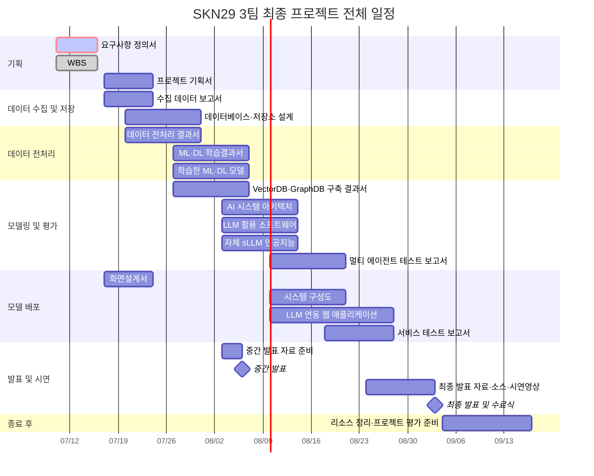

# AI Agent WBS

> 이 문서는 프로젝트 작업 상태의 단일 기준점이다. Codex를 포함한 AI 에이전트는 저장소 파일을 변경한 작업을 마칠 때 이 문서를 함께 갱신한다.

## 프로젝트 정보

| 항목 | 값 |
|---|---|
| 프로젝트 | 호텔 VOC/운영 이슈 분석 Agent |
| 교육 과정 | SK네트웍스 Family AI 캠프 29기 |
| 팀 | 3팀 |
| 프로젝트 기간 | 2026-07-10 ~ 2026-09-03 |
| 프로젝트 관리자 | `미정` |
| 최종 갱신 | `2026-07-20 10:54 KST` |
| 최종 갱신자 | `Codex` |

## 상태 및 작성 규칙

### 상태 값

| 표시 | 상태 | 의미 |
|---|---|---|
| ⚪ | `TODO` | 아직 시작하지 않음 |
| 🔵 | `IN_PROGRESS` | 현재 작업 중 |
| 🔴 | `BLOCKED` | 외부 결정·권한·데이터 등이 필요해 진행 불가 |
| 🟠 | `REVIEW` | 구현은 끝났으며 사람 또는 다른 담당자의 검토 필요 |
| 🟢 | `DONE` | 완료 기준과 검증을 모두 충족 |
| ⚫ | `CANCELLED` | 합의에 따라 수행하지 않음 |

> 색상 이모지는 사람을 위한 표시이며, 에이전트와 자동화는 대문자 상태 코드(`TODO`, `IN_PROGRESS`, `BLOCKED`, `REVIEW`, `DONE`, `CANCELLED`)를 기준으로 판정한다.

### 우선순위 값

- `P0`: 즉시 처리하지 않으면 일정 또는 핵심 기능이 중단됨
- `P1`: 현재 주차에 반드시 완료해야 함
- `P2`: 계획된 일반 작업
- `P3`: 개선 또는 선택 작업

### 갱신 원칙

1. 한 행은 검증 가능한 하나의 작업 단위로 작성한다.
2. 작업 ID는 `단계 코드-세 자리 번호` 형식을 사용한다. 예: `PLAN-001`, `DATA-001`.
3. 날짜는 `YYYY-MM-DD` 형식으로 작성한다.
4. 진척률은 `0`, `25`, `50`, `75`, `100` 중 하나를 기본으로 사용한다.
5. `DONE`은 진척률이 100이고 완료 기준 및 검증 결과가 기록된 경우에만 사용한다.
6. `BLOCKED`는 차단 사유와 해제에 필요한 결정 또는 행동을 비고에 기록한다.
7. 산출물·코드 경로는 저장소 루트 기준 경로로 기록한다.
8. 에이전트는 저장소 파일을 변경한 작업을 마칠 때 관련 행, 갠트 차트와 작업 로그를 함께 갱신한다.
9. 사실로 확인하지 않은 일정·담당자·기술은 임의로 채우지 않고 `미정`으로 둔다.
10. 기존 행을 삭제하지 않는다. 더 이상 수행하지 않는 작업은 `CANCELLED`로 변경하고 이유를 남긴다.
11. 작업 목록의 상태는 `색상 이모지 + 상태 코드` 형식으로 표시하고, 상태 변경 시 두 값을 위 표의 매핑에 맞게 함께 갱신한다.

## 전체 일정 갠트 차트

> 산출물 마감 일정을 기준으로 구성한 계획이다. 시작일은 해당 주차의 시작일을 기준으로 배치했으며, 실제 작업 상태와 세부 일정은 아래 `작업 목록`을 기준으로 갱신한다. Mermaid 표시는 `TODO=기본`, `IN_PROGRESS=active`, `REVIEW=crit+active`, `BLOCKED=crit`, `DONE=done`을 사용한다.

### 주요 마일스톤

| 날짜 | 마일스톤 |
|---|---|
| 2026-07-16 | 요구사항 정의서 및 WBS 마감 |
| 2026-07-24 | 프로젝트 기획서, 수집 데이터 보고서 및 화면설계서 마감 |
| 2026-07-31 | DB·저장소 설계 및 데이터 전처리 결과서 마감 |
| 2026-08-06 | 중간 발표 |
| 2026-08-07 | ML/DL 및 VectorDB·GraphDB 관련 산출물 마감 |
| 2026-08-14 | AI 아키텍처, LLM 소프트웨어 및 sLLM 관련 산출물 마감 |
| 2026-08-21 | 멀티 에이전트 테스트 보고서 및 시스템 구성도 마감 |
| 2026-08-28 | 웹 애플리케이션 및 서비스 테스트 보고서 마감 |
| 2026-09-03 | 최종 발표, 개발 소스코드 및 시연영상 마감 |

## 작업 목록

| ID | 단계 | 주요 업무 | 세부 작업 | 담당자 | 상태 | 우선순위 | 시작일 | 마감일 | 진척률(%) | 선행 작업 | 완료 기준 | 검증 결과 | 산출물/경로 | 최종 갱신 | 비고 |
|---|---|---|---|---|---|---|---|---|---:|---|---|---|---|---|---|
| PLAN-001 | 기획 | 프로젝트 범위 정의 | 호텔 VOC/운영 이슈 분석 Agent의 사용자·문제·범위 확정 | 미정 | ⚪ TODO | P1 | 미정 | 미정 | 0 | - | 사용자, 문제, 범위와 제외 범위가 문서화됨 | 미실행 | `docs/markdown/HOTEL_VOC_AI_AGENT.md` | 미정 | 예시 행: 실제 상태 확인 후 갱신 |
| PLAN-002 | 기획 | 요구사항 정의서 작성 | 호텔 VOC·운영 이슈 분석 AI Agent의 기능·데이터·AI·비기능 요구사항을 지정 Excel 양식에 작성 | Codex | 🟠 REVIEW | P1 | 2026-07-15 | 2026-07-16 | 100 | PLAN-001 | 지정 양식의 7개 필드에 고유 ID를 가진 요구사항이 작성되고 원본 문서와 대조됨 | Excel Open XML 패키지 정상 압축 해제, 요구사항 34건·고유 ID 34건·헤더 병합 5건 확인 | `docs/호텔_VOC_AI_Agent_요구사항_정의서_3팀_junhee.xlsx` | 2026-07-15 | 팀 검토 후 요구사항 범위와 미정 성능 목표 확정 필요 |
| PLAN-003 | 기획 | 팀 요구사항 통합 | 팀원별 요구사항 정의서 5개를 원본 추적 가능한 단일 Excel로 통합 | Codex | 🟠 REVIEW | P1 | 2026-07-15 | 2026-07-16 | 100 | PLAN-002 | 5개 본표의 모든 요구사항이 고유 통합 ID와 원본 작성자·ID를 포함해 보존됨 | 원본 484건 → 완전 동일 설명 17건 병합 → 고유 ID 467건, 원본 참조 484건, XML 10개 파싱 성공 | `docs/deliverables/01_요구사항정의서_29기_3팀.xlsx` | 2026-07-16 17:16 | 문장이 다른 의미 중복과 우선순위 충돌은 팀 검토 후 정리 필요 |
| DATA-001 | 데이터 수집 및 저장 | 데이터 확보 | 사용할 VOC/운영 데이터 출처와 사용 조건 확정 | 미정 | ⚪ TODO | P1 | 미정 | 미정 | 0 | PLAN-001 | 출처, 라이선스, 스키마와 데이터 구분이 기록됨 | 미실행 | 미정 | 미정 | 합성 데이터는 `synthetic`, seed, schema version 필수 |
| OPS-001 | 프로젝트 운영 | WBS 운영 체계 | AI 에이전트가 작업 종료 시 갱신하는 텍스트 기반 WBS 템플릿 구축 | Codex | 🟢 DONE | P1 | 2026-07-15 | 2026-07-15 | 100 | - | Excel WBS 필드를 포괄하고 에이전트 갱신 규칙이 자동 인식 지침에 연결됨 | 문서 구조 및 필드 대응 검토 | `docs/markdown/AI_AGENT_WBS.md`, `AGENTS.md` | 2026-07-15 14:53 | WBS Excel 2종의 공통 필드 통합 |
| OPS-002 | 프로젝트 운영 | 일정 시각화 | 전체 산출물 일정·마일스톤과 상태별 표시를 Mermaid 갠트 차트로 구성 | Codex | 🟢 DONE | P1 | 2026-07-15 | 2026-07-15 | 100 | OPS-001 | 전체 일정과 마일스톤이 표시되고 작업 상태를 색상 이모지와 Mermaid 상태 태그로 구분할 수 있음 | 상태 코드·이모지 매핑 및 Mermaid `done`, `active`, `crit`, `milestone` 문법 대조 | `docs/markdown/AI_AGENT_WBS.md` | 2026-07-15 17:31 | 실제 색상은 Markdown renderer의 Mermaid theme에 따라 달라질 수 있음 |
| OPS-003 | 프로젝트 운영 | Git 협업 | main 최신화 후 변경을 junhee 브랜치로 이전 | Codex | 🟢 DONE | P1 | 2026-07-15 | 2026-07-15 | 100 | OPS-002 | 원격 최신 변경과 WBS 커밋이 junhee 브랜치에 충돌 없이 통합됨 | `origin/junhee`의 `8b0761e` 병합 및 ahead 2 확인 | `AGENTS.md`, `docs/markdown/AI_AGENT_WBS.md` | 2026-07-15 15:25 | main 직접 커밋을 피하고 개인 브랜치 규칙 준수 |
| OPS-004 | 프로젝트 운영 | Git 협업 | minji를 제외한 개인 브랜치를 dev에 직접 통합 | Codex | 🟢 DONE | P1 | 2026-07-15 | 2026-07-15 | 100 | OPS-003 | junhee, seung, jaehong 브랜치가 dev 이력에 포함되고 minji는 제외됨 | 세 브랜치 ancestry 확인, minji 비포함 확인, `git diff --check` 통과 | `AGENTS.md`, `docs/markdown/AI_AGENT_WBS.md`, `docs/` | 2026-07-15 16:39 | 관리자 직접 merge 방식 적용 |
| OPS-005 | 프로젝트 운영 | Git 협업 | minji 브랜치 변경을 dev에 후속 통합 | Codex | 🟢 DONE | P1 | 2026-07-15 | 2026-07-15 | 100 | OPS-004 | minji 브랜치의 최신 산출물과 commit 이력이 dev에 포함됨 | `origin/minji` ancestry 및 추가 파일 4개 확인, `git diff --check` 통과 | `docs/markdown/AI_AGENT_WBS.md`, `docs/WBS_송민지.xlsx`, `docs/서비스흐름도.png`, `docs/요구사항정의서_송민지.md`, `docs/요구사항정의서_송민지.xlsx` | 2026-07-15 16:43 | 사용자 후속 요청에 따라 제외 결정을 변경함 |
| OPS-006 | 프로젝트 운영 | 일일보고 표준화 | 팀원별 단일 파일에 날짜별 작업 목록을 누적하는 간단한 Markdown 템플릿 생성 및 보고 반영 | Codex | 🟢 DONE | P2 | 2026-07-16 | 2026-07-16 | 100 | - | 팀원 5명 모두에게 폴더명으로 작성자를 식별하는 날짜·작업 목록 구조가 제공되고 전달받은 보고가 반영됨 | branch 폴더 5개 대응, 이름 미포함 및 20260710·20260714·20260715 보고 항목 대조 | `docs/markdown/daily_reports/` | 2026-07-16 10:09 | 최신 날짜 블록을 파일 상단에 추가하는 방식 |
| OPS-007 | 프로젝트 운영 | 일일보고 자동 갱신 지침 | Codex의 저장소 변경 작업 종료 시 현재 개인 branch의 일일보고를 갱신하는 규칙 연결 | Codex | 🟢 DONE | P2 | 2026-07-16 | 2026-07-16 | 100 | OPS-006 | root 지침에서 갱신 절차와 branch별 보고 파일을 찾을 수 있고 현재 작업이 일일보고에 기록됨 | branch 5개 매핑, 기록·제외 조건, 20260716 보고 및 root 지침 연결 확인 | `AGENTS.md`, `docs/markdown/daily_reports/README.md`, `docs/markdown/daily_reports/junhee/일일보고.md` | 2026-07-16 10:10 | `main`, `dev`, 미등록 branch에서는 작성자를 추정하지 않음 |
| OPS-008 | 프로젝트 운영 | 주간보고 자동 작성 지침 | 지정 기간의 팀원별 일일보고를 작업 주제별 주간보고로 통합하고 프로젝트 주차를 표시하는 규칙 연결 | Codex | 🟢 DONE | P2 | 2026-07-16 | 2026-07-16 | 100 | OPS-007 | 날짜 또는 기간을 지정한 요청에서 원본 일일보고와 일정 문서의 주차 구분을 사용해 동일 형식의 주간보고를 누적할 수 있음 | 5개 원본 파일, 기간 해석, 통합·추정 금지, 단일·복수 주차 표기 및 root 지침 연결 확인 | `AGENTS.md`, `docs/markdown/daily_reports/README.md`, `docs/markdown/daily_reports/주간보고.md` | 2026-07-16 11:42 | 일정 문서 기준 동일 주차는 `N주차`, 여러 주차는 `N~M주차`로 표시 |
| OPS-009 | 프로젝트 운영 | 주간보고 작성 | 20260710~20260716 팀원별 일일보고와 공통 진행·멘토링 내용을 주제별 주간보고로 통합 | Codex | 🟢 DONE | P2 | 2026-07-16 | 2026-07-16 | 100 | OPS-008 | 지정 기간의 팀 활동, 아이디어 변경 근거와 멘토링 핵심 피드백이 간결한 상위·세부 목록으로 정리됨 | 일정 문서의 1주차 기간 07/10~07/16과 보고 제목 대조, 수행 기준·아이디어 변경·멘토링 권고 확인 | `docs/markdown/daily_reports/주간보고.md` | 2026-07-16 11:46 | 프로젝트 1주차 종료일을 보고 종료일로 반영 |
| OPS-010 | 프로젝트 운영 | 보고서 연속 갱신 | 일일보고 작성 시 해당 프로젝트 주차의 주간보고를 유사 항목 통합 방식으로 자동 갱신하고 분량·내용 제한 적용 | Codex | 🟢 DONE | P2 | 2026-07-16 | 2026-07-20 | 100 | OPS-008 | 새로 추가·수정하는 일일보고 날짜 블록은 5줄, 주간보고 주차 블록은 40줄 이내로 유지되고 Git 운영 이력은 주간보고에서 제외됨 | root 지침·상세 절차 연결, 현재 20260720 일일보고 5줄·2주차 주간보고 13줄 및 Git 운영 표현 0건 확인 | `AGENTS.md`, `docs/markdown/daily_reports/README.md`, `docs/markdown/daily_reports/` | 2026-07-20 10:54 | 제목부터 다음 제목 직전까지 빈 줄 포함 계산하며 실제 작업 결과는 보존 |
| OPS-011 | 프로젝트 운영 | 문서 구조 표준화 | `docs/`를 Markdown과 산출물 중심의 두 폴더로 정리하고 공식 산출물 번호·파일명 규칙을 지속 지침으로 연결 | Codex | 🟢 DONE | P2 | 2026-07-16 | 2026-07-20 | 100 | - | `docs/` 바로 아래에 `markdown/`, `deliverables/`만 존재하고 파일명 표준화가 공식 산출물에만 적용됨 | 루트 구조·Markdown 기존 이름·산출물 번호 형식·이미지 이동·Git diff 검사 | `AGENTS.md`, `README.md`, `docs/markdown/문서관리규칙.md`, `docs/markdown/`, `docs/deliverables/` | 2026-07-20 | 제공 원본 양식과 Markdown 문서 이름은 표준화 대상에서 제외 |
| OPS-012 | 프로젝트 운영 | 문서 규칙·WBS 정비 | 문서관리규칙 파일명 3부류 규칙 지정·templates 분리, 산출물 연관 문서 4건 개명, WBS·요구사항 정의서 일정 검증과 담당 실명화 | Claude | 🟢 DONE | P2 | 2026-07-20 | 2026-07-20 | 100 | OPS-011 | 파일명 규칙이 문서관리규칙에 명시되고 WBS 담당이 실명으로 표기되며 검증 결과가 문서화됨 | 산출물 21건 마감일 3중 대조 일치, 요구사항 ID 62건 양방향 일치, 실행 태스크 61개 확인, 잔여 역할 코드 0건 | `docs/문서관리규칙.md`, `docs/markdown/02_WBS.md`, `docs/markdown/01_요구사항정의서.md`, `docs/markdown/WBS_요구사항정의서_검증결과_20260720.md`, `docs/templates/` | 2026-07-20 | 02 xlsx 담당 실명화는 서식 보존 위해 엑셀 직접 작업 권장 |
| OPS-013 | 프로젝트 운영 | 워커힐 문서 구조 정리 | 워커힐 전용 조사·분석 문서 4건을 영문 주제 폴더로 이동하고 저장소 내 참조 경로 갱신 | Codex | 🟢 DONE | P2 | 2026-07-20 | 2026-07-20 | 100 | OPS-012 | 워커힐 전용 문서가 영문 이름의 단일 폴더에 모이고 기존 경로를 가리키는 저장소 참조가 없음 | 이동 문서 4건 존재, 원본 경로 4건 부재, 상대 경로 참조 및 `git diff --check` 확인 | `docs/markdown/walkerhill/`, `docs/markdown/VOC_핵심개선사항_분석.md` | 2026-07-20 10:36 | 과거 외부 작업 경로인 `D:\bootcamp\...` 표기는 근거 기록으로 유지 |

## 단계 코드

| 단계 | 코드 | 설명 |
|---|---|---|
| 기획 | `PLAN` | 문제 정의, 요구사항, WBS, 화면 기획 |
| 데이터 수집 및 저장 | `DATA` | 데이터 확보, 탐색, DB·저장소 설계 |
| 데이터 전처리 | `PREP` | 정제, 라벨링, 분할, 품질 검증 |
| 모델링 및 평가 | `MODEL` | ML/DL, RAG, 에이전트, sLLM, 평가 |
| 모델 배포 | `DEPLOY` | 애플리케이션, 인프라, 통합 테스트 |
| 발표 및 시연 | `DEMO` | 발표 자료, 소스코드 정리, 시연영상 |
| 프로젝트 운영 | `OPS` | 협업, 문서, 리소스, 회의 및 일정 관리 |

## 에이전트 작업 종료 절차

AI 에이전트는 저장소 파일을 변경한 작업을 종료하기 전에 다음 순서로 이 문서를 갱신한다.

1. 수행한 작업과 연결되는 기존 WBS 행을 찾는다.
2. 기존 행이 없으면 가장 적합한 단계 코드로 새 작업 ID를 생성한다.
3. 상태, 진척률, 산출물 경로, 최종 갱신 시각을 수정한다.
4. 실행한 테스트·검증 결과를 `검증 결과`에 짧게 기록한다.
5. 진행을 막는 사항이나 사람의 결정이 필요하면 `BLOCKED` 또는 `REVIEW`로 표시한다.
6. 일정 또는 상태가 바뀌었다면 갠트 차트의 해당 작업 기간과 상태를 동기화한다.
7. 아래 작업 로그 맨 위에 한 행을 추가한다.
8. 최종 답변에 WBS 갱신 여부와 변경한 작업 ID를 포함한다.

문서 조사·질문 답변처럼 저장소 파일을 변경하지 않은 작업은 WBS를 갱신하지 않는다.

## 작업 로그

최신 기록을 위에 추가한다. 한 작업에서 여러 WBS 항목을 변경했다면 ID를 쉼표로 구분한다.

| 일시(KST) | 작업 ID | 수행자 | 변경 요약 | 상태 변화 | 검증 | 관련 파일 |
|---|---|---|---|---|---|---|
| 2026-07-20 10:54 | OPS-010 | Codex | 2주차 주간보고에서 branch 최신화·commit 관련 표현을 제거하고 Git 운영 이력 제외 규칙 추가 | DONE 유지 | root·상세 규칙 일치, 2주차 블록 Git 운영 표현 0건 및 13줄 확인 | `AGENTS.md`, `docs/markdown/daily_reports/README.md`, `docs/markdown/daily_reports/junhee/일일보고.md`, `docs/markdown/daily_reports/주간보고.md`, `docs/markdown/AI_AGENT_WBS.md` |
| 2026-07-20 10:49 | OPS-010 | Codex | 새로 추가·수정하는 일일보고 날짜 블록을 5줄, 주간보고 주차 블록을 40줄 이내로 제한하는 규칙 추가 | DONE 유지 | root·상세 규칙 일치, 20260720 일일보고 5줄 및 2주차 주간보고 13줄 확인 | `AGENTS.md`, `docs/markdown/daily_reports/README.md`, `docs/markdown/daily_reports/junhee/일일보고.md`, `docs/markdown/daily_reports/주간보고.md`, `docs/markdown/AI_AGENT_WBS.md` |
| 2026-07-20 10:36 | OPS-013 | Codex | 워커힐 전용 조사·분석 문서 4건을 `docs/markdown/walkerhill/`로 이동하고 공통 분석 문서의 참조 경로 갱신 | TODO → DONE | 이동 문서 4건과 원본 경로 부재, 상대 경로 참조 및 `git diff --check` 확인 | `docs/markdown/walkerhill/`, `docs/markdown/VOC_핵심개선사항_분석.md`, `docs/markdown/AI_AGENT_WBS.md`, `docs/markdown/daily_reports/junhee/일일보고.md`, `docs/markdown/daily_reports/주간보고.md` |
| 2026-07-20 10:20 | OPS-012 | Claude | 문서관리규칙 3부류 파일명 규칙·templates 분리, 산출물 연관 문서 4건 개명, WBS 태스크 수 62→61 정정·담당 실명화·일정 검증 결과 문서화 | TODO → DONE | 산출물 21건 마감일 일정·md·xlsx 3중 대조 일치, 요구사항 ID 62건 양방향 일치, 태스크 표 잔여 역할 코드 0건 | `docs/문서관리규칙.md`, `docs/markdown/02_WBS.md`, `docs/markdown/01_요구사항정의서.md`, `docs/markdown/WBS_요구사항정의서_검증결과_20260720.md`, `docs/markdown/AI_AGENT_WBS.md`, `docs/markdown/daily_reports/daesung/일일보고.md`, `docs/markdown/daily_reports/주간보고.md` |
| 2026-07-20 | OPS-011 | Codex | 원격 `origin/dev`와 동일한 기준 커밋을 확인하고 서비스 흐름도 초안 이미지를 `docs/` 바로 아래로 이동 | DONE 유지 | 원격 대비 `0/0`, 원본 `service_flow.png`와 SHA-1 동일, `docs/` 표준 폴더와 초안 이미지 위치 및 내부 참조 확인 | `docs/서비스흐름도.png`, `docs/markdown/AI_AGENT_WBS.md`, `docs/markdown/daily_reports/daesung/일일보고.md`, `docs/markdown/daily_reports/주간보고.md` |
| 2026-07-16 17:24 | OPS-011 | Codex | `docs/`를 Markdown과 산출물 두 축으로 재배치하고 파일명 표준화 범위를 공식 산출물로 한정 | DONE 유지 | Markdown 3개 원래 이름 복원, 공식 산출물 `01`·`02`·`05` 형식, 내부 참조 및 `git diff --check` 확인 | `AGENTS.md`, `README.md`, `docs/markdown/문서관리규칙.md`, `docs/markdown/`, `docs/deliverables/`, `docs/markdown/daily_reports/daesung/일일보고.md`, `docs/markdown/daily_reports/주간보고.md` |
| 2026-07-16 12:21 | OPS-010 | Codex | 일일보고 갱신 시 해당 주차 주간보고를 자동 요약하고 유사 항목 통합·50줄 제한을 적용하는 규칙 추가 | TODO → DONE | AGENTS·README 트리거 연결, 기존 블록 갱신과 초과 시 재요약 규칙 및 1주차 블록 41줄 확인 | `AGENTS.md`, `docs/markdown/daily_reports/README.md`, `docs/markdown/daily_reports/주간보고.md`, `docs/markdown/daily_reports/junhee/일일보고.md`, `docs/markdown/AI_AGENT_WBS.md` |
| 2026-07-16 11:46 | OPS-009 | Codex | 첫 주 주간보고 종료일을 프로젝트 일정의 1주차 종료일인 20260716으로 변경 | DONE 유지 | 일정 문서 07/10~07/16과 주간보고 제목 일치 확인 | `docs/markdown/최종_프로젝트_산출물_및_전체_일정.md`, `docs/markdown/daily_reports/주간보고.md`, `docs/markdown/daily_reports/junhee/일일보고.md`, `docs/markdown/AI_AGENT_WBS.md` |
| 2026-07-16 11:42 | OPS-008, OPS-009 | Codex | 일정 문서의 주차 구분을 기준으로 주간보고 날짜 옆에 단일·복수 프로젝트 주차를 표시하는 규칙 추가 | DONE 유지 | 07/10~07/15가 1주차에 포함됨을 대조하고 제목·템플릿 형식 확인 | `docs/markdown/최종_프로젝트_산출물_및_전체_일정.md`, `docs/markdown/daily_reports/README.md`, `docs/markdown/daily_reports/주간보고.md`, `docs/markdown/daily_reports/junhee/일일보고.md`, `docs/markdown/AI_AGENT_WBS.md` |
| 2026-07-16 11:29 | OPS-009 | Codex | 일일보고의 주간보고 관련 변경 기록 4개를 핵심 결과 한 문장으로 통합 | DONE 유지 | 주간보고 관련 기록 1개 및 별도 자동 갱신 규칙 보존 확인 | `docs/markdown/daily_reports/junhee/일일보고.md`, `docs/markdown/AI_AGENT_WBS.md` |
| 2026-07-16 11:11 | OPS-009 | Codex | 주간보고의 프로젝트 수행 기준을 대상·필수 구현·배포 기준 3개 항목으로 요약 | DONE 유지 | 기존 6개 요구사항의 핵심 내용 보존 및 3개 항목 구조 확인 | `docs/markdown/daily_reports/주간보고.md`, `docs/markdown/daily_reports/junhee/일일보고.md`, `docs/markdown/AI_AGENT_WBS.md` |
| 2026-07-16 10:49 | OPS-009 | Codex | 사내 메신저·이메일 업무 효율 분석의 외부 도구 API 연동 및 자체 플랫폼 구축 부담을 아이디어 변경 사유로 추가 | DONE 유지 | Slack·Jira·Notion 연동과 구현·데이터 부담 및 변경 결과 확인 | `docs/markdown/daily_reports/주간보고.md`, `docs/markdown/daily_reports/junhee/일일보고.md`, `docs/markdown/AI_AGENT_WBS.md` |
| 2026-07-16 10:37 | OPS-009 | Codex | 멘토링 메모를 호텔 VOC 기술 방향과 검증·운영 권고사항 2개 항목으로 요약해 주간보고에 반영 | DONE 유지 | 요약 2개 항목 및 예정→진행 상태 변경 확인 | `docs/markdown/daily_reports/주간보고.md`, `docs/markdown/daily_reports/junhee/일일보고.md`, `docs/markdown/AI_AGENT_WBS.md` |
| 2026-07-16 10:31 | OPS-009 | Codex | 20260710~20260715 일일보고와 공통 진행 내용을 프로젝트 기준·기획·구현·협업·멘토링 주제로 통합 | TODO → DONE | 일일보고 5개 및 제공 내용 대조, 날짜 범위·작성자·상위 항목 구조 확인 | `docs/markdown/daily_reports/주간보고.md`, `docs/markdown/AI_AGENT_WBS.md` |
| 2026-07-16 10:16 | OPS-008 | Codex | 지정 기간의 팀원별 일일보고를 작업 주제별로 통합하는 주간보고 템플릿과 작성 규칙 추가 | TODO → DONE | 기간 해석·원본 범위·통합 기준·추정 금지·출력 형식 및 root 지침 연결 확인 | `AGENTS.md`, `docs/markdown/daily_reports/README.md`, `docs/markdown/daily_reports/주간보고.md`, `docs/markdown/daily_reports/junhee/일일보고.md`, `docs/markdown/AI_AGENT_WBS.md` |
| 2026-07-16 10:10 | OPS-007 | Codex | 저장소 변경 작업마다 현재 개인 branch의 일일보고를 갱신하도록 root 지침과 상세 절차 추가 | TODO → DONE | branch 5개 매핑·기록 조건·제외 조건 및 junhee 20260716 보고 확인 | `AGENTS.md`, `docs/markdown/daily_reports/README.md`, `docs/markdown/daily_reports/junhee/일일보고.md`, `docs/markdown/AI_AGENT_WBS.md` |
| 2026-07-16 10:09 | OPS-006 | Codex | 팀원 5명의 20260715 일일보고를 작성자별 파일에 추가 | DONE 유지 | 5개 날짜 블록과 상위 작업 13건·세부 작업 11건 대조 | `docs/markdown/daily_reports/`, `docs/markdown/AI_AGENT_WBS.md` |
| 2026-07-16 10:08 | OPS-006 | Codex | 박준희의 20260714 일일보고와 주제 top5 세부 목록 추가 | DONE 유지 | 날짜 역순 및 상위 작업 3건·세부 주제 5건 대조 | `docs/markdown/daily_reports/junhee/일일보고.md`, `docs/markdown/AI_AGENT_WBS.md` |
| 2026-07-16 10:07 | OPS-006 | Codex | 20260710 일일보고를 작성자별 파일로 분리하고 날짜 표기를 YYYYMMDD로 통일 | DONE 유지 | 전달된 작업 6건의 작성자별 반영 결과 대조 | `docs/markdown/daily_reports/junhee/일일보고.md`, `docs/markdown/daily_reports/daesung/일일보고.md`, `docs/markdown/daily_reports/minji/일일보고.md`, `docs/markdown/AI_AGENT_WBS.md` |
| 2026-07-16 10:05 | OPS-006 | Codex | 폴더명으로 작성자를 식별하도록 일일보고 본문의 팀원 이름을 제거하고 날짜별 작업 목록으로 단순화 | DONE 유지 | 5개 파일에서 이름 제거 및 공통 구조 확인 | `docs/markdown/daily_reports/`, `docs/markdown/AI_AGENT_WBS.md` |
| 2026-07-16 10:05 | OPS-006 | Codex | 실제 보고 예시에 맞춰 일일보고를 날짜·전체 이름·작업 목록의 간단한 2단계 목록으로 변경 | DONE 유지 | 5개 파일의 전체 이름과 목록 구조 확인 | `docs/markdown/daily_reports/`, `docs/markdown/AI_AGENT_WBS.md` |
| 2026-07-16 09:50 | OPS-006 | Codex | 팀원별 일일보고를 날짜별 파일 생성 방식에서 단일 파일 내 날짜별 누적 방식으로 단순화 | DONE 유지 | 5개 파일의 날짜 제목 및 공통 항목 구조 확인 | `docs/markdown/daily_reports/`, `docs/markdown/AI_AGENT_WBS.md` |
| 2026-07-16 09:46 | OPS-006 | Codex | README의 팀원·branch 목록을 기준으로 팀원별 일일보고 폴더와 표준 Markdown 템플릿 생성 | TODO → DONE | 팀원·branch 5개 대응 및 템플릿 필수 섹션 확인 | `docs/markdown/daily_reports/`, `docs/markdown/AI_AGENT_WBS.md` |
| 2026-07-15 17:31 | OPS-002 | Codex | 작업 목록과 Mermaid 갠트 차트에 상태별 색상 표시 규칙 적용 | DONE 유지 | 상태 코드·이모지 매핑 및 Mermaid 상태 태그 문법 대조 | `docs/markdown/AI_AGENT_WBS.md` |
| 2026-07-15 17:03 | PLAN-003 | Codex | 팀원별 요구사항 정의서 5개의 본표를 통합 ID와 원본 추적 정보가 있는 단일 Excel로 병합 | TODO → REVIEW | 데이터 467행·고유 ID 467개·원본 참조 484개·XML 파싱 오류 0건 확인 | `docs/deliverables/01_요구사항정의서_29기_3팀.xlsx`, `docs/markdown/AI_AGENT_WBS.md` |
| 2026-07-15 16:43 | OPS-005 | Codex | 사용자 후속 요청에 따라 minji 브랜치의 최신 산출물 4개와 commit 이력을 dev에 merge | TODO → DONE | `origin/minji` ancestry 및 추가 파일 4개 확인, `git diff --check` 통과 | `docs/markdown/AI_AGENT_WBS.md`, `docs/WBS_송민지.xlsx`, `docs/서비스흐름도.png`, `docs/요구사항정의서_송민지.md`, `docs/요구사항정의서_송민지.xlsx` |
| 2026-07-15 16:39 | OPS-004 | Codex | minji를 제외하고 junhee, seung, jaehong 브랜치를 dev에 직접 merge | TODO → DONE | 세 브랜치 ancestry 확인, minji 비포함 확인, `git diff --check` 통과 | `AGENTS.md`, `docs/markdown/AI_AGENT_WBS.md`, `docs/` |
| 2026-07-15 | PLAN-002 | Codex | 프로젝트 기준 문서 3종을 바탕으로 지정 Excel 양식에 요구사항 정의서 34건 작성 | TODO → REVIEW | Excel 패키지 압축 해제 및 데이터 행·고유 ID·병합 구조 검증 | `docs/호텔_VOC_AI_Agent_요구사항_정의서_3팀_junhee.xlsx`, `docs/markdown/AI_AGENT_WBS.md` |
| 2026-07-15 15:25 | OPS-003 | Codex | main 최신화 후 WBS 변경을 junhee 브랜치로 이전하고 원격 동시 변경 통합 | TODO → DONE | `origin/junhee`의 `8b0761e` 병합 및 ahead 2 확인 | `AGENTS.md`, `docs/markdown/AI_AGENT_WBS.md` |
| 2026-07-15 15:08 | OPS-002 | Codex | 전체 산출물 일정 및 주요 마일스톤 갠트 차트 추가 | TODO → DONE | Mermaid 문법 및 일정 대조 | `docs/markdown/AI_AGENT_WBS.md` |
| 2026-07-15 14:53 | OPS-001 | Codex | 에이전트 친화적 WBS와 작업 종료 갱신 규칙 추가 | TODO → DONE | 문서 구조 및 Excel 필드 대응 검토 | `docs/markdown/AI_AGENT_WBS.md`, `AGENTS.md` |
| YYYY-MM-DD HH:mm | OPS-000 | agent | 로그 작성 예시 | TODO → DONE | 검증 명령 또는 `문서 검토` | `path/to/file` |

## 기존 Excel 양식과의 필드 대응

| Excel WBS 항목 | 이 문서의 항목 |
|---|---|
| Task ID / WBS 번호 | ID |
| 주요 업무 | 주요 업무 |
| 세부 업무 / 작업 제목 | 세부 작업 |
| 담당자 / 작업 소유자 | 담당자 |
| 상태 | 상태 |
| 시작일 | 시작일 |
| 마감일 | 마감일 |
| 우선순위 | 우선순위 |
| 기간 | 시작일과 마감일로 계산 |
| 작업 완료 비율 | 진척률(%) |
| 단계별 갠트 영역 | 단계, 시작일, 마감일로 변환 |

이 문서를 Excel로 옮길 때는 `작업 목록` 표를 기준으로 사용한다. 갠트 차트가 필요하면 시작일·마감일·진척률을 이용해 별도로 생성한다.
