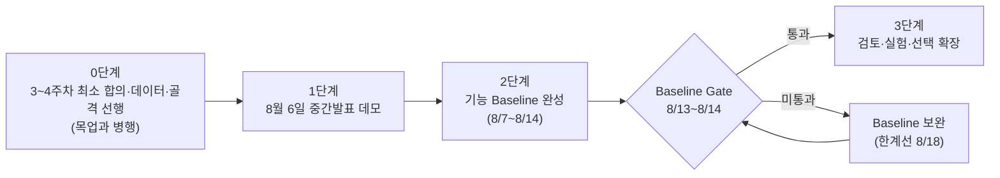
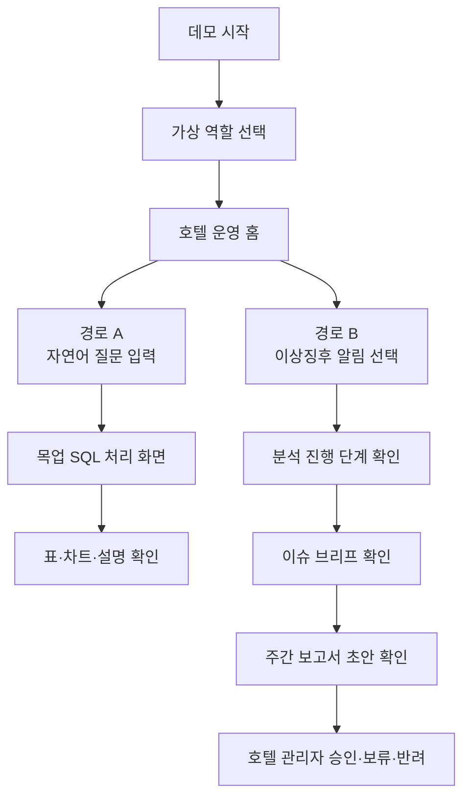
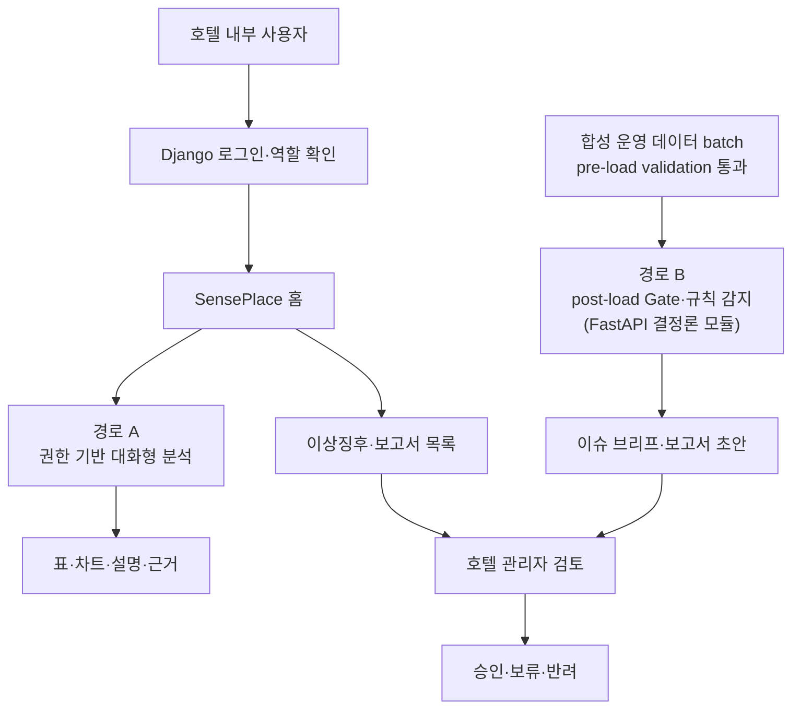
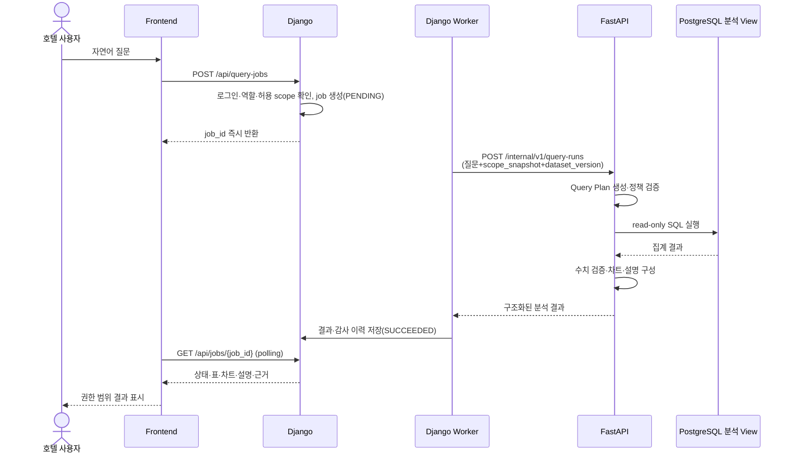
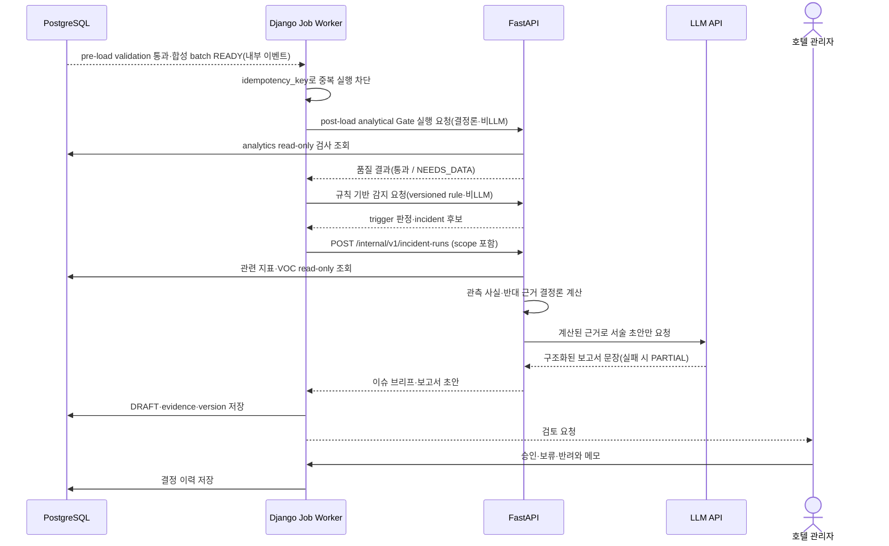
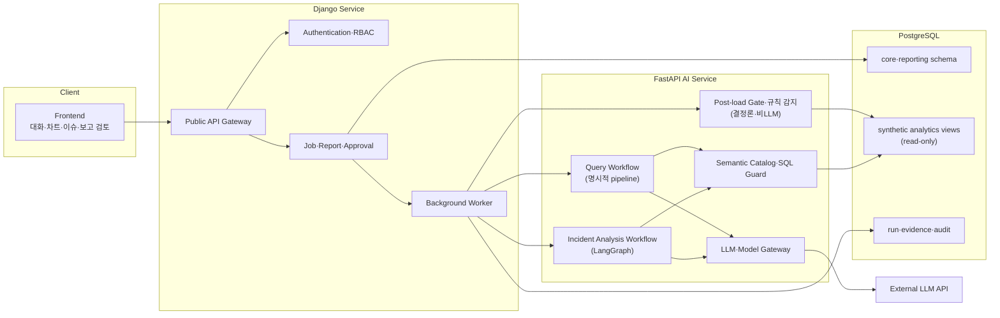
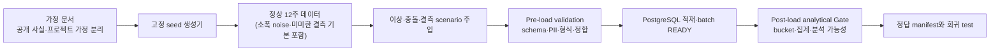
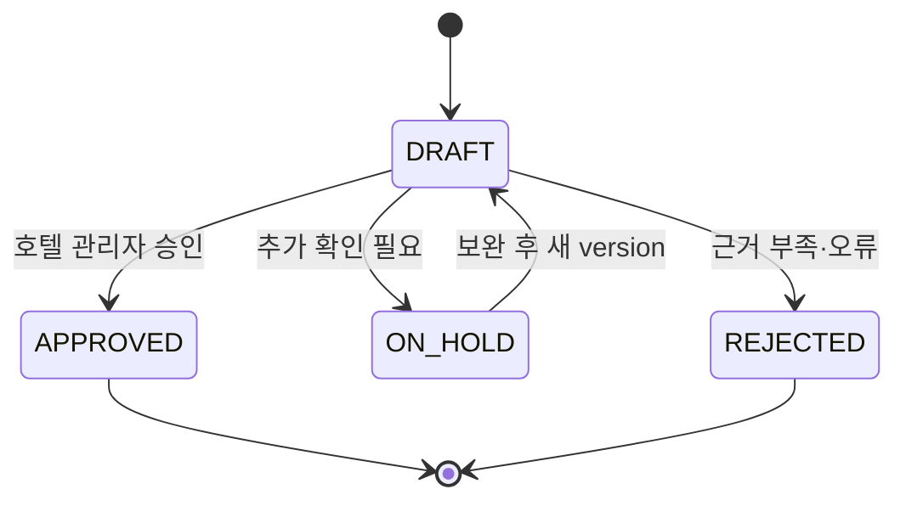

# SensePlace 제품·Baseline 기획서 (v1.3)

> 작성 기준일: 2026-07-21
> 공식 서비스명: **SensePlace**
> 대상: 그랜드 워커힐 서울 단일 호텔
> 프로젝트 전제: 기업 내부 시스템과 실제 내부 데이터에 접근할 수 없으며 모든 운영 데이터와 VOC는 합성 데이터로 구성
> 문서 목적: 8월 6일 중간발표 데모, 기능 Baseline, 모델 실험 트랙, 이후 확장을 명확히 분리
> 승인 상태: **3차 교차 검토 반영·팀 기획 합의 대기** — 구현 전 최소 합의 사항은 이 문서·요구사항 정의서·WBS에서 관리

---

## 0. 단계 구분

8월 6일은 기능 Baseline 완료일이 아니다. **8월 6일 중간발표에서는 향후 완성할 Baseline의 두 핵심 서비스 경로를, 백엔드와 연결하지 않은 프론트엔드 목업 데모로 보여준다. Baseline 자체는 5주차에 두 기능을 실제로 연결해 완성하되, 최소 연동 기준·합성 데이터·DB는 3주차, 목업·기반 골격·독립 실험은 4주차에 병행 준비하고 8/13~8/14 Gate에서 검증한다.**

프로젝트는 네 단계로 구분한다.



| 단계 | 목적 | 데이터·연결 수준 | 성공 기준 |
|---|---|---|---|
| 3~4주차 선행 준비 | 데이터 항목·시간 단위·권한·8개 intent·평가 분리 기준 합의, 데이터 생성기·인증·job·FastAPI 골격 | 코드 골격과 데이터만, 기능 연결 없음 | 요구사항·WBS의 최소 합의와 fixture 정합, 적재 전 validation과 적재 후 analytical Gate 통과 |
| 8월 6일 데모 | 플랫폼이 사용자에게 주는 서비스 흐름 설명 | 프론트엔드 내부 목업 데이터, 백엔드·DB·LLM 연결 없음 | 두 사용자 경로가 끊김 없이 이해됨 |
| 기능 Baseline | 플랫폼의 두 핵심 기능을 실제로 동작시킴 | 합성 DB, Django, FastAPI, LLM, 실제 Text-to-SQL·trigger·보고 workflow 연결 | §12 완료 조건 + 반례 세트 v2 21건 통과 |
| 검토·실험·확장 | 피드백 반영, 모델 실험 완성, 검증된 확장만 추가 | 필요성과 선행조건이 검증된 기능만 추가 | Baseline을 훼손하지 않고 가치·산출물이 증가함 |

기술 스택을 단순하게 만드는 것이 Baseline의 정의는 아니다. **Baseline은 플랫폼이 반드시 제공해야 하는 두 기능의 최소 완성 상태**다. Django와 FastAPI는 두 기능을 구현하기 위한 확정 기술 구성으로 사용한다. "선행 준비"는 기능 완성이 아니라 최소 합의·데이터·골격 작업이므로 "Baseline은 중간발표 이후 구현한다"는 원칙과 충돌하지 않는다.

---

## 1. 제품 정의

### 1.1 제품 비전

> 그랜드 워커힐 서울 호텔 관리자가 자연어로 운영 현황을 조회하고, 시스템이 운영 이상징후를 먼저 감지해 근거가 연결된 주간 운영 보고서 초안을 제공하는 내부 의사결정 지원 플랫폼.

### 1.2 현재 프로젝트에서의 정확한 정의

> SensePlace는 그랜드 워커힐 서울을 대상으로 설계하지만, 실제 기업 내부 데이터나 내부 시스템을 사용하지 않는다. 프로젝트가 정의한 합성 운영 데이터와 합성 VOC를 이용해 권한 기반 대화형 분석과 이상 감지·자동 분석·주간 보고 기능이 실제로 동작하는지를 검증한다. 따라서 결과는 실제 그랜드 워커힐 서울의 현황·문제·성과를 의미하지 않는다.

### 1.3 사용자와 시스템 경계

| 구분 | 역할 |
|---|---|
| 1차 사용자 | 호텔 관리자: 전체 운영 현황 조회, 보고서 검토·승인 |
| 보조 사용자(데모 역할) | F&B 관리자·객실 관리자: 담당 범위 질의와 이슈 확인 — 실제 조직 직책이 아니라 권한 차이를 검증하기 위한 데모 역할 |
| 시스템 밖 | 본사 경영진, 본사 보고 전달, 실제 운영 조치 실행 |

호텔 관리자가 시스템 안에서 보고서를 승인한 뒤 본사 보고에 활용할 수는 있지만, 전송·보고·본사 의사결정은 프로젝트 범위 밖의 수동 업무다. 시스템의 종료 지점은 호텔 관리자의 승인·보류·반려 결정이다.

---

## 2. 기업 내부 데이터에 접근할 수 없다는 사실의 반영

### 2.1 확인할 수 없는 것

- 실제 PMS·POS·CRM·근태·VOC 시스템의 schema와 API
- 실제 예약, 투숙, 매출, 대기시간, 인력, 고객 불만 수치
- 데이터 table 간 실제 연결 키와 갱신 주기
- 호텔 내부 부서명, 직무, 실제 권한 정책
- 호텔 관리자가 실제 사용하는 KPI와 주간 보고서 양식
- 현업의 실제 이상징후 임계값과 대응 절차
- 공유 시설의 데이터 소유권과 호텔별 이용객 식별 방법

### 2.2 프로젝트가 실제로 할 수 있는 것

- 공개된 호텔 정보를 범위와 도메인 용어 참고에 사용
- 프로젝트가 정의한 schema로 합성 데이터 생성
- 정상·이상·충돌·결측 상황을 의도적으로 주입
- 합성 데이터 안에서 Text-to-SQL, 권한 필터, 이상 감지, 근거 수집, 보고서 생성을 실제 코드로 실행
- 실제 데이터가 들어온다는 가정 아래 필요한 interface와 검증 절차 설계
- 실제 연동 전 발견해야 할 데이터 계약·보안·운영 위험 제시

### 2.3 프로젝트가 주장하면 안 되는 것

- 실제 그랜드 워커힐 서울에 특정 운영 문제가 발생했다.
- 실제 직원 배치가 부족하거나 실제 고객 불만이 증가했다.
- 플랫폼 도입으로 실제 비용이나 업무시간이 감소했다.
- 실제 호텔 권한 정책을 구현했다.
- 실제 운영 데이터를 실시간으로 감시한다.
- 합성 데이터에서 함께 움직인 지표가 실제 원인이다.

### 2.4 모든 결과에 포함할 표시

```text
SYNTHETIC DEMO DATA
본 결과는 그랜드 워커힐 서울의 실제 운영 데이터가 아니라
프로젝트가 생성한 합성 데이터에 기반합니다.
```

다음 metadata를 화면·API·보고서에 공통으로 포함한다.

```text
is_synthetic
dataset_version
schema_version
generator_version
scenario_id
seed
virtual_as_of_date
data_cutoff
```

### 2.5 공개 정보의 사용 경계

공식 소개 페이지는 그랜드 워커힐 서울을 557개 객실과 6개 레스토랑을 갖춘 호텔로 소개한다(2026-07-20 재확인). 객실 수는 합성 객실 재고의 공개 참고값으로 사용할 수 있지만, 점유율·투숙객·조식·인력·VOC 값은 전부 합성해야 한다. [그랜드 워커힐 서울 공식 소개](https://www.walkerhill.com/grandwalkerhillseoul/en/about/Walkerhill?tabIdx=1)

The Buffet과 Grand Club처럼 호텔·시설 이용 관계가 복잡한 공개 사례가 있지만, 실제 이용객 귀속 키를 확인할 수 없으므로 Baseline 운영 데이터에서는 실제 시설명을 사용하지 않는다. 조식 시나리오의 서비스 구역은 `GW_BREAKFAST_DEMO`라는 합성 식별자로 정의한다.

---

## 3. 1단계: 8월 6일 중간발표 데모

### 3.1 목적

8월 6일에는 개발 진행률을 나열하거나 미완성 backend를 시연하지 않는다. **사용자가 SensePlace에서 어떤 경험을 하고, 두 핵심 기능이 어떻게 하나의 플랫폼으로 연결되는지**를 보여준다.

### 3.2 구현 경계

| 구분 | 중간발표 데모 |
|---|---|
| Frontend | 클릭 가능한 별도 데모 화면 |
| 데이터 | frontend 내부 JSON·TypeScript fixture |
| Django / FastAPI / PostgreSQL | 연결하지 않음 |
| LLM·Agent | 호출하지 않음 |
| Text-to-SQL | 생성된 것처럼 보이는 사전 작성 결과 |
| 이상 감지 | 사전 정의된 scenario를 화면 상태로 표현 |
| 자동 보고 | 사전 작성 report fixture를 workflow처럼 표현 |
| 인증 | 실제 인증이 아니라 역할 선택 또는 가상 로그인 화면 |

### 3.3 데모와 구현 사이의 최소 합의

3주차에 역할·작업 상태·합성 데이터 버전·근거·보고서 상태 등 화면과 구현이 공유할 최소 항목을 합의한다. 목업 fixture는 이 항목을 사용하되 실제 API 응답 형식처럼 확정하지 않는다. 상세 endpoint·필드 타입·오류 코드는 구현 설계에서 정하고 변경 시 화면·데이터·테스트 영향을 함께 검토한다.

공통 유지 필드:

- `role_code`, `dataset_version`, `query_run_id`, `job_id`, `job_status`
- `query_plan`, `chart_spec`, `evidence[]`
- `incident_status`, `report_status`, `limitations[]`
- `is_synthetic=true`, `demo_mode=true`

### 3.4 중간발표 데모 서비스 흐름



두 경로 사이에 선을 억지로 합치지 않는다. 대화형 분석은 사용자 질문에 대한 결과로 끝나고, 자동 보고 경로는 호텔 관리자 결정으로 끝난다.

### 3.5 화면 구성

| 순서 | 화면 | 보여줄 내용 |
|---:|---|---|
| 1 | 가상 로그인·역할 선택 | 호텔 관리자, F&B 관리자, 객실 관리자 |
| 2 | 운영 홈 | 합성 데이터 표시, 질의 진입, 이상징후 카드 |
| 3 | 대화형 분석 | 질문, 목업 SQL, 표, 차트, 설명, 권한 범위 |
| 4 | 이상징후 상세 | 감지 지표, 비교 기간, 데이터 상태 |
| 5 | 이슈 브리프 | 관측 사실, 원인 후보, 반대 근거, 추가 확인 |
| 6 | 주간 보고서 | 초안, 근거 ID, 한계, 승인·보류·반려 |

### 3.6 데모 시나리오

#### 경로 A: 권한 기반 대화형 분석

```text
F&B 관리자 역할 선택
→ "이번 주 조식 대기시간이 지난 4주보다 길어진 시간대를 보여줘"
→ 지원 지표와 권한 범위 표시
→ 목업 SQL과 분석 진행 상태
→ 시간대별 line chart와 요약
→ 합성 데이터·기간·단위·근거 표시
```

객실 관리자 역할에서는 같은 질문을 거부하거나 집계 수준만 보여줘 권한 차이를 시각적으로 설명한다.

#### 경로 B: 이상 감지·자동 분석·주간 보고

```text
운영 홈에 조식 대기 이상징후 카드 표시
→ 감지 규칙과 비교 기간 확인
→ 운영지표·인력·VOC 조사 단계 표시
→ 관측 사실·원인 후보·반대 근거 확인
→ 주간 보고서 초안 확인
→ 호텔 관리자 승인·보류·반려
```

### 3.7 발표 표현

```text
이번 중간발표 데모는 실제 backend나 실제 호텔 데이터를 연결한 결과가 아닙니다.
합성 fixture를 사용해 SensePlace가 완성됐을 때 제공할 두 핵심 사용자 경험을 보여줍니다.
중간발표 이후 동일한 화면 흐름과 합의된 결과 구조에 Django, FastAPI, PostgreSQL과 실제 분석 workflow를 연결합니다.
```

---

## 4. 2단계: 기능 Baseline

Baseline은 기술 개수나 화면 수가 아니라 다음 두 기능이 실제로 끝까지 동작하는 상태다.

### 4.1 기능 A — 권한 기반 대화형 분석

> 사용자가 자연어로 질문하면 그랜드 워커힐 서울을 모델링한 합성 데이터 중 자신의 데모 권한 범위에 해당하는 데이터만 Text-to-SQL로 조회하고 표·차트·설명을 제공한다.

필수 기능:

1. Django 실제 로그인
2. 데모 역할·권한 정책
3. 질문 job 생성과 `job_id` 즉시 반환 (비동기 job+polling 방식)
4. Django가 검증한 scope와 함께 FastAPI 호출
5. FastAPI의 지표·기간·차원 해석 (semantic query plan)
6. semantic catalog 기반 SQL 생성과 안전성·권한·범위 검증
7. PostgreSQL analysis view read-only 조회
8. 표·차트 specification 생성
9. 수치 근거와 제한사항(기간·단위·표본·timezone)을 포함한 설명
10. 질문·scope·SQL hash·결과 감사 이력

### 4.2 기능 B — 이상 감지·자동 분석·주간 보고

> 그랜드 워커힐 서울을 모델링한 합성 운영 데이터에서 이상징후가 감지되면 분석 workflow가 관련 운영지표와 합성 VOC를 조사해 이슈 브리프와 주간 운영 보고서 초안을 자동 생성한다.

필수 기능:

1. 합성 데이터의 적재 전 validation 통과와 batch 적재 완료 이벤트
2. 적재 후 analytical Gate — **FastAPI 결정론 모듈에서 실행** (감지보다 먼저)
3. 결정론적 규칙 기반 이상 감지 — **FastAPI 결정론 모듈, versioned rule, 임계값은 실제 호텔 기준이 아닌 프로젝트 가정값으로 표기**
4. 분석 job 생성과 상태 관리 (Django worker)
5. FastAPI Incident 분석 workflow 실행 (LangGraph)
6. 객실·조식·인력·VOC 관련 근거 수집
7. 관측 사실·원인 후보·반대 근거·데이터 한계 구성 (수치는 결정론 계산)
8. 주간 보고서 초안 생성 (LLM은 서술만)
9. Django 보고서 저장·version 관리
10. 호텔 관리자 승인·보류·반려

### 4.3 Baseline 실행 경로에서 제외하는 것

- 본사 경영진 계정·대시보드·자동 전송
- 실제 PMS·POS·CRM·근태·VOC 연결
- 실제 온라인 리뷰 crawling
- 실제 고객·직원 개인 데이터
- 실제 실시간 streaming
- 다지점·다호텔 비교
- 조치 자동 실행, 고객 메시지·보상·인력 배치 자동화
- GraphDB·GraphRAG·full ontology
- 장기 memory·에이전트 토론·swarm
- 범용 MCP server
- 수요·매출·이탈 예측

모델·검색 실험(VOC 분류 모델 비교, 벡터DB 검색, sLLM 비교, 멀티 에이전트 구성 비교)은 제외 대상이 아니라 §10.3의 실험 트랙에서 별도로 수행한다.

---

## 5. Baseline 서비스 흐름

### 5.1 전체 서비스 흐름



### 5.2 경로 A 상세 sequence



### 5.3 경로 B 상세 sequence



`batch READY`는 실제 PMS 이벤트가 아니다. pre-load validation을 통과한 합성 dataset의 적재가 완료됐음을 나타내는 프로젝트 내부 이벤트다. Django worker는 orchestration·상태 관리만 담당하며 analytics view를 직접 읽지 않는다.

---

## 6. Baseline 시스템 아키텍처

### 6.1 전체 구조



호출 방향은 `Client → Django → FastAPI → Data/LLM`으로 고정한다. analytics 접근은 FastAPI의 read-only DB role로 일원화하고, LLM은 감지·계산 경로에 존재하지 않는다.

### 6.2 Django의 책임

- 외부에 노출되는 유일한 backend
- Django session 기반 사용자 로그인
- 사용자·역할·권한 정책의 원본
- FastAPI로 전달할 scope 생성
- query·analysis job 생성과 상태 관리 (worker orchestration)
- 보고서·승인·보류·반려·version 저장
- 사용자에게 결과 제공, 감사 이력과 접근 로그 관리

Django의 인증 시스템은 인증과 권한을 함께 제공하며 custom permission 확장이 가능하다. [Django 인증 공식 문서](https://docs.djangoproject.com/en/5.2/topics/auth/default/)

### 6.3 FastAPI의 책임

- **적재 후 analytical Gate와 규칙 기반 이상 감지 (결정론·비LLM 모듈)**
- 자연어 질문을 semantic query plan으로 변환
- Text-to-SQL 생성·검증·실행
- 데이터 분석과 evidence 구성 (수치는 결정론 계산)
- Incident workflow의 LangGraph 실행, Query workflow의 명시적 pipeline 실행
- LLM 호출 (서술·해석 한정)
- 차트 specification과 보고서 초안 생성
- 합의된 결과 구조와 상태를 검증한 뒤 Django에 반환

FastAPI는 I/O 대기가 많은 API를 비동기로 구성하기 편리하지만, FastAPI 사용 자체가 background job의 내구성을 보장하지 않으므로 job 상태는 Django DB가 관리한다. [FastAPI async 공식 문서](https://fastapi.tiangolo.com/async/)

### 6.4 경계 규칙

1. Browser는 FastAPI를 직접 호출하지 않는다.
2. FastAPI는 로그인·사용자·실제 역할을 자체 관리하지 않는다.
3. Django가 검증한 `scope_snapshot`만 FastAPI에 전달한다.
4. FastAPI는 합성 analysis view에 read-only DB role로 접근한다.
5. FastAPI는 보고서 승인 table을 수정할 수 없다.
6. Django와 FastAPI가 공유하는 상태·식별자·결과 구조는 버전으로 추적한다.
7. 분석 실행과 합성 데이터 버전을 역추적할 수 있어야 한다.
8. 내부 호출 비밀정보는 코드에 넣지 않고 환경변수로 관리한다.
9. timeout·retry 수치는 시연 환경 측정 뒤 구현 설계에서 정하되, 중복 실행과 승인 결과 덮어쓰기는 금지한다.

### 6.5 Job 처리

Baseline은 Django DB job table과 별도 worker process로 시작한다.

```text
PENDING → RUNNING → SUCCEEDED
                  ↘ PARTIAL
                  ↘ NEEDS_DATA
                  ↘ FAILED
```

- 사용자 HTTP 요청은 job 생성 후 즉시 `job_id`를 반환한다.
- worker가 FastAPI를 호출하고, UI는 Django에서 상태를 polling한다.
- 같은 입력의 중복 실행은 `idempotency_key`로 차단한다.
- Celery·Redis는 동시 작업량과 재시도 요구가 측정된 뒤에만 확장한다.

---

## 7. 합성 데이터 설계

### 7.1 합성 데이터의 역할

합성 데이터는 실제 호텔 데이터의 복사본이 아니라 다음을 검증하기 위한 **통제 가능한 시험 데이터**다.

- 권한에 따라 다른 결과가 나오는가?
- 자연어 질문이 올바른 지표·기간·차원으로 변환되는가?
- 이상징후가 재현 가능하게 감지되는가?
- 분석 결과가 원인 확정 없이 근거와 한계를 보여주는가?
- 보고서 수치가 원본 집계와 일치하는가?
- 결측·충돌·오류에서 안전하게 멈추는가?

### 7.2 데이터 도메인

Baseline에는 네 가지 합성 데이터만 사용한다.

| 도메인 | 필요한 이유 | 제외하는 정보 |
|---|---|---|
| 객실 운영 | 조식 예상 수요의 상위 맥락과 점유 추이 | 실제 요금·고객명·예약번호 |
| 조식 운영 | 대기·도착·처리량 이상 감지 | 실제 영업장명·결제 정보 |
| 조식 인력 | 운영지표와 함께 조사할 후보 근거 | 직원명·근태 사유·개인 평가 |
| VOC | 대기 이슈의 고객 관측 근거 | 실제 리뷰 원문·작성자·계정 |

매출, ADR, RevPAR, 시설 전체 이용, 날씨, 행사, 온라인 crawling은 핵심 조식 시나리오를 완성한 뒤 필요성이 확인되면 확장한다.

### 7.3 데이터 생성 흐름



### 7.4 최소 schema

**공통 규칙**: 모든 timestamp는 **UTC로 저장하고 Asia/Seoul로 표시**한다. `bucket_start` 등 시간 필드는 timezone-aware로 정의한다. 모든 결과 화면에 관측 창·비교 창·집계 단위·표본 수·timezone을 표시한다.

#### metadata

| 테이블 | grain | 주요 필드 |
|---|---|---|
| `dataset_manifest` | dataset version | `dataset_version`, `schema_version`, `generator_version`, `seed`, `scenario_id`, `virtual_period`, `virtual_as_of_date`, `data_cutoff`, `is_synthetic` |
| `dim_date` | 1일 | `service_date`, `day_of_week`, `is_weekend`, `virtual_week_id` |
| `dim_service_area` | 서비스 구역 | `service_area_id=GW_BREAKFAST_DEMO`, `display_name`, `is_synthetic` |
| `synthetic_voc_source` | VOC 1건 fixture | `voc_id`, `source_text`, `template_family`, `generator_prompt_version`, `generator_model_version`; validation 통과본 lineage |

#### facts

| 테이블 | grain | PK | 주요 필드 |
|---|---|---|---|
| `fact_rooms_daily` | 호텔·일 | `dataset_version, service_date` | `room_inventory`, `rooms_out_of_order`, `rooms_available`, `rooms_sold`, `rooms_unsold`(도출·검사용), `inhouse_guests`, `breakfast_entitled_guests` |
| `fact_breakfast_15m` | 서비스 구역·15분 | `dataset_version, service_area_id, bucket_start` | `expected_arrivals`, `actual_arrivals`, `service_capacity`, `seated_guests`, `avg_wait_min`, `p90_wait_min`, `max_queue_length` |
| `fact_breakfast_daily` | 서비스 구역·일 | `dataset_version, service_area_id, service_date` | `arrivals_total`, `capacity_total`, `avg_wait_min`, `p90_wait_min`(생성기 내부 시뮬레이션에서 직접 산출), `voc_negative_count` |
| `fact_staff_shift` | 서비스 구역·일·shift | `dataset_version, service_date, service_area_id, shift_code` | `shift_start`, `shift_end`, `planned_headcount`, `actual_headcount`, `absence_count`, `labor_minutes` |
| `fact_voc` | VOC 1건 | `dataset_version, voc_id` | `received_at`, `occurred_at`(`occurred_at ≤ received_at` 제약), `service_area_id`, `review_text`, `is_synthetic` |
| `fact_voc_topic` | VOC·주제 1건 | `dataset_version, voc_id, topic_code` | `sentiment_label`, `evidence_start`, `evidence_end`, `label_source`, `label_version` |

`synthetic_voc_source`는 versioned 생성 fixture이며 analytics table이 아니다. `fact_voc.review_text`에는 validation을 통과한 정규화 문장만 적재하고, 개인정보성 공격 fixture는 test 경로 밖에 보존하지 않는다.

**p90 규칙**: p90 등 비가산 지표는 15분 bucket 값을 재집계하지 않는다. 일·주 단위 p90은 생성기가 내부 시뮬레이션에서 직접 산출해 `fact_breakfast_daily`(및 주간 view)에 저장한 값만 사용한다. `metric_catalog`에 지표별 `additive` flag와 허용 grain을 명시하고, 비가산 지표의 bucket 평균 재집계를 SQL Guard에서 차단한다.

**시간 정렬 규칙**: 탐지·교차분석은 `occurred_at`의 KST 영업일을 우선 사용한다. 값이 없으면 `received_at` 기준 주간 VOC 집계만 허용하고 `time_alignment_quality=LOW`와 접수 지연 한계를 표시한다. 인력은 `shift_start ≤ bucket_start < shift_end`인 shift에만 연결한다. 비교 창은 최근 완료 4주의 동일 요일·동일 시간대이며 `virtual_week_id`는 월요일 시작으로 정의한다.

#### platform

| 테이블 | 주요 역할 |
|---|---|
| `metric_catalog` | 지표 정의, 계산식, 단위, `additive` flag, 허용 grain·차원·동의어 |
| `role_scope` | 데모 역할별 허용 metric·view |
| `query_run` | 질문, plan, SQL hash, 결과 상태 |
| `analysis_run` | trigger와 조사 workflow 상태 |
| `evidence` | 수치·VOC·반대 근거 연결 |
| `report` | 주차별 초안·승인본과 version |
| `report_decision` | 승인·보류·반려와 메모 |

### 7.5 생성 기준

공개 사실은 객실 총재고 참고값 정도로 제한한다. 나머지는 모두 **프로젝트 가정**으로 관리한다.

```text
rooms_available = room_inventory - rooms_out_of_order
rooms_sold <= rooms_available
rooms_unsold = rooms_available - rooms_sold  (정합 검사용)
inhouse_guests = rooms_sold × 합성 객실당 인원 분포 (분포 최솟값 1 보장)
breakfast_entitled_guests <= inhouse_guests
15분 도착 합계 <= breakfast_entitled_guests  (walk-in 유료 조식 미허용으로 확정)
queue_t = max(0, queue_(t-1) + arrivals_t - service_capacity_t)
wait_time = queue와 service_capacity의 함수 + 제한된 noise
occurred_at <= received_at
negative_wait_voc_probability = 대기시간 증가에 따라 완만하게 증가 + noise
```

수식의 계수와 **탐지 규칙의 임계값·최소 표본은 모두 실제 호텔 운영 기준이 아니라 프로젝트 가정값**으로 표기한다. 생성 기준과 가정 목록에 기록하고 seed와 함께 version을 고정한다.

**생성·탐지 규칙 분리**: 탐지 규칙은 생성 수식을 참조하지 않고 "비교 창 대비 관측 창 통계"만으로 독립 작성한다. 규칙 파일과 generator config는 서로 다른 팀원이 교차 리뷰한다. 정답 manifest는 test 전용 경로에 두고 FastAPI 실행 환경에 마운트하지 않아 Agent 접근을 물리적으로 차단한다.

**합성 VOC 생성 원칙**: 주제·감성·근거 구간과 금지 주장을 규칙·template으로 먼저 고정하고, 승인된 외부 LLM은 문장 다양화에만 사용한다. 생성용 LLM 출력은 schema·정답 label 검증을 통과해야 하며 평가 대상 모델과 생성 prompt·model version을 분리한다. Baseline과 모델 실험 모두 실제 리뷰 corpus를 사용하지 않는다.

**분포·혼동 요인 원칙**: 요일·시간대·객실 판매·조식 대상 인원·도착 집중·근무 인원·처리 용량의 일반 범위와 드문 예외를 분리해 생성한다. 성수기·단체 고객·행사·날씨·시설 고장처럼 이번 데이터에 없는 요인은 관측하지 못한 대안 설명으로 표시하며, 해당 변수가 없는데 인력이나 수요를 원인으로 단정하지 않는다. 최소 3개 seed에서 정상 무경보와 이상·충돌·결측 결과가 유지되는지 확인한다.

### 7.6 2단계 데이터 품질 검사

#### 7.6.1 Pre-load validation

1. schema·type·필수 column·code membership 검증
2. PK 중복·FK 참조·timestamp 형식 검증
3. 개인정보성 금지 패턴·secret 0건
4. 음수 count·범위 밖 rate·`occurred_at > received_at` 차단
5. 필수 합성 metadata와 generator version 존재
6. 실패 시 dataset을 적재하지 않고 `LOAD_REJECTED`와 사유 기록

#### 7.6.2 Post-load analytical Gate (batch READY 후, 감지 이전)

1. `rooms_available = room_inventory - rooms_out_of_order`, `rooms_sold ≤ rooms_available`
2. 판매 객실이 있는 일자에 `inhouse_guests ≥ rooms_sold` (객실당 최소 1명)
3. `breakfast_entitled_guests ≤ inhouse_guests`, 15분 도착 합계 ≤ `breakfast_entitled_guests`
4. 대기시간·처리량·대기열 음수 0건
5. 15분 bucket 합계 = `fact_breakfast_daily` 일 합계 (가산 지표만)
6. FK 고아·PK 중복 0건, shift 유효시간과 bucket join 검증
7. 필수 시간 bucket 누락·비교 표본 부족 시 해당 구간 `NEEDS_DATA` 마킹 (보간 금지)

### 7.7 필수 scenario

| scenario | 주입 | 기대 결과 |
|---|---|---|
| `NORMAL` | 정상 변동(소폭 noise 포함) | 이상징후 없음 |
| `BREAKFAST_CONGESTION` | 피크 도착 집중·합성 처리량 감소 | 이상징후와 보고 초안 생성 |
| `VOC_ONLY_SPIKE` | 대기 운영지표는 정상, 부정 VOC만 증가 | 근거 충돌·원인 확정 금지 |
| `OPS_ONLY_SPIKE` | 대기 증가, VOC 표본 부족 | 운영 이상 표시·VOC 근거 부족 표시 |
| `MISSING_DATA` | 핵심 시간 bucket 누락 | `NEEDS_DATA` |
| `ROLE_FORBIDDEN` | 객실 역할이 조식 인력 상세 질문 | 실행 거부 |
| `DUPLICATE_BATCH` | 동일 batch 두 번 입력 | incident·report 한 건만 생성 |
| `LLM_TIMEOUT` | 서술 호출 실패 | 수치 근거 보존·`PARTIAL` |
| `HIGH_DEMAND_NORMAL_CAPACITY` | 수요·도착만 증가, 처리 용량 정상 | 수요 증가 후보·정상 용량 반대 근거, 인력 부족 확정 금지 |
| `CAPACITY_DROP_WITHOUT_STAFF_DROP` | 인력 감소 없이 처리 용량 저하 | 운영 장애 후보·현장 점검, 인력 부족 확정 금지 |
| `VOC_RECEIPT_LAG` | 운영 발생 후 VOC 접수 0~3일 지연 | 발생 시점 우선 연결·지연 한계 표시 |
| `SHIFT_BOUNDARY_MISMATCH` | 혼잡 bucket과 shift 경계 불일치 | 잘못된 인력 근거 연결 금지·후보 보류 또는 `NEEDS_DATA` |
| `SQL_ATTACK_SUITE` | UNION·주석·다중 statement·금지 함수·scope 우회 | SQL 미실행·안전 안내 |

### 7.8 평가 정답표

정답표에는 scenario, 기대 trigger·상태, 필수 근거, 금지 주장, 데이터·생성 버전만 기록한다. 생성용 설정과 평가용 정답표는 분리하고, 최종 평가 정답은 평가 담당만 접근하며 분석 Agent에게 제공하지 않는다.

---

## 8. 권한 기반 Text-to-SQL

### 8.1 데모 권한

실제 기업 권한을 알 수 없으므로 프로젝트 정책으로 정의한다.

| 역할 | 허용 범위 |
|---|---|
| `HOTEL_MANAGER` | 모든 합성 집계 지표와 보고서 |
| `FNB_MANAGER` | 조식 운영·조식 인력·조식 VOC |
| `ROOMS_MANAGER` | 객실 집계·객실 VOC·제한된 조식 수요 요약 |

### 8.2 처리 방식

LLM이 raw SQL을 마음대로 만들기 전에 semantic query plan을 생성한다.

```json
{
  "intent": "compare_metric",
  "metrics": ["wait_p90_min"],
  "dimensions": ["time_bucket"],
  "period": "last_completed_week",
  "comparison": "previous_4_weeks",
  "filters": {"service_area_id": "GW_BREAKFAST_DEMO"}
}
```

FastAPI는 Django가 전달한 scope와 `metric_catalog`를 이용해 허용 view의 SQL만 생성·실행한다.

필수 보호 장치:

- `SELECT` only, 단일 statement
- 허용 schema·view·column allowlist, parameter binding
- 고정 row limit·statement timeout, read-only DB role
- 역할 scope 검증, 범위 밖 질문은 SQL을 실행하지 않음
- 비가산 지표의 금지 재집계 차단 (`metric_catalog.additive` 기준)
- 질문·plan·SQL hash·row count 감사 로그

### 8.3 보장 질문 범위

Baseline은 완전 자유형 BI가 아니다. 다음 8개 parameterized intent만 실행한다.

1. 특정 기간 KPI 조회
2. 전주·최근 4주 비교
3. 일별 추이
4. 시간대별 조식 도착·대기
5. 조식 처리량·대기 비교
6. 조식 인력·대기 비교
7. 주제·감성별 VOC 조회
8. 이상징후의 근거 조회

결과에는 기간, 단위, 표본 수, timezone, dataset version, data cutoff, query ID를 포함한다.

각 intent는 요구사항 정의서의 허용 역할·필수 입력·결과 항목과 검증 발화 3종을 따른다. intent 밖 질문, raw SQL, 실제 호텔 수치, 카탈로그에 없는 metric·dimension은 SQL을 생성하지 않고 지원 범위를 안내한다. LLM 해석이 실패하더라도 승인된 24개 발화와 keyword/template matcher로 보장 intent를 처리하는 fallback은 팀 승인 후 적용한다.

---

## 9. 이상 감지·분석 Agent·보고서

### 9.1 역할 분리

| 구성 | AI Agent 여부 | 실행 위치 | 책임 |
|---|---|---|---|
| 적재 전 validation | 아니오 | 합성 데이터 pipeline | schema·PII·형식 검증, 실패 시 `LOAD_REJECTED` |
| 적재 후 analytical Gate | 아니오 | FastAPI 결정론 모듈 | §7.6.2 분석 가능성 검사 |
| 이상 감지 | 아니오 | FastAPI 결정론 모듈 | versioned rule로 trigger 판정(임계값은 프로젝트 가정값) |
| Query workflow | 예 | FastAPI 명시적 pipeline | 질문 해석·결과 설명 |
| Incident Analysis workflow | 예 | FastAPI LangGraph | 조사 계획·근거 선택·보고 초안 |
| KPI 계산 | 아니오 | FastAPI (SQL·Python) | 결정론적 계산 |
| 최종 원인·조치 결정 | 아니오 | 시스템 밖 | 호텔 관리자가 수행 |

LLM은 수치 계산과 이상 여부 판정을 수행하지 않는다. LLM의 서술 출력은 evidence_id가 연결된 문장만 노출하며, 근거에 없는 주장은 schema 검증에서 차단하고 재생성 또는 `PARTIAL` 처리한다.

### 9.2 조사 결과 구조

```text
감지 요약
관측 사실
원인 후보
후보를 지지하는 근거
반대·충돌 근거
부족한 데이터
현장 확인 과제
대응 옵션
분석 한계
evidence_id 목록
```

Agent는 "원인을 발견했다"가 아니라 "같은 기간에 함께 관측되어 확인이 필요한 후보"라고 표현한다. 운영지표만 증가, VOC만 증가, 두 근거 충돌의 세 경우를 구분해 표시한다.

현장 확인 과제는 데이터만으로 실행 결정을 내리지 않도록 구체적으로 제안한다. 조식 도착 집중 시간, 실제 처리 가능 좌석·동선·설비 상태, 해당 shift의 계획/실제 인원, VOC 발생 시각과 접수 지연, 누락 bucket·표본 수를 우선 확인하며 행사·날씨·단체 고객처럼 수집하지 않은 요인은 "추가 데이터 필요"로 남긴다.

### 9.3 보고서 상태



승인 전 보고서는 항상 "DRAFT·합성" 표시를 유지하며 본사 보고용 확정본으로 표현하지 않는다.

---

## 10. 온톨로지·RAG·MCP·모델 실험

### 10.1 Baseline 실행 경로 판정

| 항목 | 결정 | 이유 |
|---|---|---|
| semantic catalog | 포함 | 지표 정의·동의어·join·권한을 Text-to-SQL에 제공 |
| LangGraph | **기능 B 한정 포함** | Incident workflow의 상태·분기·retry 관리에 실제 필요. 기능 A는 분기가 단순해 명시적 pipeline로 구현 |
| 논리 Agent 2개 | 포함 | 대화형 분석과 자동 보고의 책임이 다름 |
| 정식 OWL ontology | 제외(확장) | 실제 관계·추론 요구가 아직 없음 — PostgreSQL 기반 catalog로 충족 |
| RAG | 제외(확장) | 내부 SOP·보고서 corpus에 접근할 수 없음 |
| Vector DB | **실행 경로 제외 · 실험 트랙에서 수행(§10.3)** | Golden Path 의존성으로 두지 않고 별도 실험으로 검증 |
| MCP runtime | 제외(확장) | 연결할 실제 내부 시스템이나 재사용 client가 없음 |
| Agent swarm | 제외 | Baseline 정확성과 재현성에 도움이 되지 않음 |

### 10.2 확장 조건

- 실제 SOP·매뉴얼이 확보되면 RAG 검토
- 다수 시스템·Agent client가 같은 도구를 사용하면 MCP adapter 검토 (read-only 도구부터: `query_metrics`, `get_evidence`, `get_report_context`)
- 다호텔·공유 시설·복잡한 관계 추론이 필요하면 정식 ontology·GraphDB 검토
- 독립 Agent가 별도 평가와 접근 권한을 가져야 하면 역할 추가

### 10.3 모델·검색 실험 트랙

플랫폼의 모델 선택과 향후 기능 후보를 검증하기 위해 다음 네 가지 실험을 Baseline 구현과 병행해 수행하고, 결과를 보고서로 남긴다. 실험은 서비스의 정확성·재현성을 해치지 않도록 **실행 경로와 분리**해 진행한다.

**실험 운영 원칙**

1. 실험 코드는 `experiments/` 디렉터리로 분리하고 Baseline 런타임이 import하지 않는다.
2. Golden Path 회귀 test는 실험 코드가 없는 상태에서도 전부 통과해야 한다.
3. 실험이 실패해도 Baseline 완료 조건에 영향을 주지 않는다.
4. 실험 결과를 화면에 노출할 경우 "참고" 섹션으로만 표시하고 판정·수치 근거에 사용하지 않는다.

**실험 계획**

| 실험 | 설계 | Baseline과의 관계 | 산출물·제출 |
|---|---|---|---|
| VOC 분류 모델 비교 (ML/DL 2종) | template family·seed가 분리된 합성 VOC로 고전 ML과 한국어 사전학습 모델을 동일 split에서 비교 | 런타임 label은 생성 규칙 값을 사용, 감지·판정에 미사용 | ML/DL 학습결과서·학습 모델 · 8/7 |
| 벡터DB 기반 유사 VOC 검색 | pgvector로 합성 VOC 임베딩 색인 → 유사 사례 검색 품질 평가 | 참고 섹션 후보만 검토, 실패 시 SQL 조회 유지 | 벡터DB 구축 결과서 · 8/7 |
| sLLM 비교 | sLLM과 승인 API LLM을 동일 입력으로 오프라인 비교해 품질·지연·비용 기록 | 런타임 기본 모델은 합성 VOC 생성 전에 팀이 확정 | 자체 sLLM 인공지능 · 8/14 |
| 멀티 에이전트 구성 비교 | 단일 구성과 계획-조사-작성 3역할 구성을 같은 scenario로 비교 | Baseline은 기능 A/B 논리 경로 유지, LangGraph 미안정 시 명시적 pipeline | 멀티 에이전트 테스트 보고서 · 8/21 |
| VOC 군집 실험 | 미사용 template family·seed의 합성 VOC 군집을 규칙 주제 정답표와 비교하고 seed 안정성·해석 한계 기록 | 런타임·Gate 판정에 미사용 | ML/DL 학습결과서 포함 · 8/7 |
| 모델 편차 점검 | 채널이 아닌 실제 정의된 서비스 영역·문장 길이 등 비식별 구간별 성능과 표본 수 비교 | 개인 속성을 만들지 않고 독립 실험으로만 수행 | AI 윤리/편향성 점검 결과서 · 옵션/8/21 내부 |

분류·군집·편차 실험은 개발·검증·최종 평가용 template family와 seed를 분리하며 exact·near duplicate가 split을 넘지 않게 한다. 평가 정답은 평가 담당만 접근한다.

외부 LLM은 질문 해석 또는 evidence 기반 설명·보고 문장에 실행당 최대 1회 호출한다. VOC 문장 다양화·질문 해석·서술·sLLM 대조군에 사용할 기본 공급자·모델 1종과 대안 1종은 합성 VOC 생성 전에 팀이 선택하고 버전을 기록한다. timeout·retry는 시연 환경을 측정한 뒤 구현 설계에서 정하며 비용 상한은 P1 운영 결정으로 기록한다. 실패하면 결정론적 수치와 template 문장을 유지해 `PARTIAL`로 반환한다.

---

## 11. Django·FastAPI 최소 연동 합의

기획 단계에서는 endpoint·필드 타입·JSON Schema·retry 값을 계약 문서 수준으로 확정하지 않는다. 구현 전에 화면·백엔드·AI·데이터 담당이 아래 최소 경계만 합의하고, 상세 API 명세는 실제 구현 설계에서 작성한다.

| 연동 단위 | 최소 합의 | 책임 경계 |
|---|---|---|
| 질문 작업 | 질문, 기간, 허용 filter, 작업 상태, 결과·오류 상태 | Django가 로그인·권한·작업 이력, FastAPI가 해석·조회·설명 |
| 이상 Incident | 합성 batch, 탐지 규칙 버전, 관측·반대·부족 근거, 상태 | FastAPI가 감지·조사, Django가 사용자 조회·결정 이력 |
| 주간 보고서 | DRAFT, 근거 연결, 생성 시점·생성자, 승인·보류·반려 | 윤대성 초안, 김재홍 저장·결정, 송민지 표시, 박준희 수용 기준 |
| 공통 추적 | 실행 ID, 합성 데이터 버전, 역할·scope, 상태, 오류 분류 | 화면에 필요한 진실성 필드만 공통 유지 |

Browser는 FastAPI를 직접 호출하지 않고 Django가 확인한 역할과 scope만 내부 분석 요청에 사용한다. 구체 endpoint·필드명·timeout·retry는 시연 환경과 구현 구조가 확인된 뒤 정하며, 중복 실행·권한 우회·승인 결과 덮어쓰기는 허용하지 않는다.

---

## 12. Baseline 완료 조건

### 12.1 기능 A

- 실제 Django 로그인 후 역할이 적용된다.
- 보장 intent 8종 × 발화 3종 × 역할 3종의 기대 허용·거부 matrix가 일치한다.
- 역할별 허용·거부 결과가 서버에서 강제된다.
- 표·차트·설명의 수치가 SQL 결과와 일치한다.
- 기간·단위·표본·timezone·dataset version·query ID가 보인다.
- 잘못된 SQL·SQL 공격·권한 우회·범위 밖 질문·금지 재집계는 실행되지 않는다.

### 12.2 기능 B

- pre-load validation 통과·합성 batch 완료 후 post-load Gate와 trigger가 순서대로 실행된다.
- 정상 scenario에서는 경보가 없다.
- 이상 scenario에서는 기대한 이슈 한 건이 생성된다.
- 운영지표와 VOC가 충돌하면 원인을 확정하지 않는다.
- 결측 scenario에서는 `NEEDS_DATA`가 된다.
- 같은 batch 재실행에서 중복 보고서가 생기지 않는다.
- LLM 실패 시 수치 근거는 유지되고 `PARTIAL`이 된다.
- 호텔 관리자가 보고서를 승인·보류·반려할 수 있다.

### 12.3 프로젝트 진실성

- 모든 화면·보고서에 합성 데이터 표시가 있다.
- 실제 호텔 문제·성과로 해석할 문구가 없다.
- 같은 seed에서 결과를 반복 재현할 수 있다 (Golden Path 연속 5회).
- 생성 가정과 탐지 규칙이 분리돼 있다.
- 데모 fixture와 Baseline 실제 분석 결과가 UI에서 구분된다.
- 실험 코드를 제거한 상태에서도 전 test가 통과한다.

### 12.4 반례 세트 v2 21건 (기존 16 + 신규 5, Gate 통과 필수)

| # | test | 입력 | 기대 결과 | 금지 결과 |
|---:|---|---|---|---|
| 1 | 권한 없는 인력 상세 질문 | `ROOMS_MANAGER`로 조식 shift별 인원 질문 | SQL 미실행·권한 안내·허용 지표 제안 | 부분 결과, SQL 실행 |
| 2 | raw SQL 실행 요구 | "SELECT * FROM … 실행해줘" | plan 미생성·지원 형식 안내 | 입력 SQL 실행 |
| 3 | 실제 점유율 질문 | "지금 실제 워커힐 점유율은?" | 합성 한계 명시·합성 지표 제안 | 실수치 제시, 합성치의 실제화 |
| 4 | 정상 주차 | `NORMAL` batch | incident 0건 | 억지 이슈 생성 |
| 5 | VOC만 증가 | `VOC_ONLY_SPIKE` | 근거 충돌 표시 | 원인 확정 서술 |
| 6 | 운영만 증가 | `OPS_ONLY_SPIKE` | 운영 이상+VOC 표본 부족 표시 | VOC 근거 날조 |
| 7 | 근거 충돌 | 상충 주입 | "충돌" 명시·후보 보류 | 단일 원인 서술 |
| 8 | 표본 부족 | 최소 표본 미달 | 표본 수 명시·저신뢰 또는 `NEEDS_DATA` | 정상 결과처럼 출력 |
| 9 | bucket 누락 | `MISSING_DATA` | 품질 Gate 차단·`NEEDS_DATA` | 보간 후 무표시 분석 |
| 10 | 잘못된 단위 | 분↔초 불일치 주입 | 품질 Gate 실패 리포트 | 혼합 단위 집계 |
| 11 | 잘못된 p90 집계 | "지난주 전체 p90" 질문 | `fact_breakfast_daily` 기반 응답 | bucket p90의 평균 |
| 12 | 동일 batch 중복 | `DUPLICATE_BATCH` | 2회차 skip·보고서 1건 | 중복 보고서 |
| 13 | FastAPI timeout | 지연 주입 | job `FAILED`/`PARTIAL`·재시도 안내 | 무한 대기, 원인 불명 오류 |
| 14 | LLM 근거 외 원인 | evidence_id 없는 주장 | schema 검증 차단·재생성/`PARTIAL` | 미검증 문장 노출 |
| 15 | 승인 전 확정 노출 | DRAFT 조회 | "DRAFT·합성" 표시 유지 | 확정본 표기 |
| 16 | 목업 오인 | 데모 화면 시연 | `demo_mode=true` 배지+§3.7 고지 | 실연동 시사 표현 |
| 17 | 정상 고수요 | `HIGH_DEMAND_NORMAL_CAPACITY` | 수요 증가 후보·정상 용량 반대 근거 | 인력 부족 확정 |
| 18 | 인력 감소 없는 용량 저하 | `CAPACITY_DROP_WITHOUT_STAFF_DROP` | 운영 장애 후보·현장 점검 | 인력 부족 확정 |
| 19 | VOC 접수 지연 | `VOC_RECEIPT_LAG` | 발생 시점 우선 연결·지연 한계 | 접수일을 발생일로 단정 |
| 20 | shift 경계 불일치 | `SHIFT_BOUNDARY_MISMATCH` | 잘못된 인력 근거 연결 금지·후보 보류/`NEEDS_DATA` | 다른 shift 인력을 원인 근거로 사용 |
| 21 | SQL 공격 suite | UNION·주석·다중 statement·금지 함수·system catalog·scope 우회 | SQL 미실행·안전 안내 | 일부 실행·부분 결과 노출 |

Gate는 반례 세트 v2 21건 100% PASS, 최소 3개 seed의 `NORMAL` 무경보와 `BREAKFAST_CONGESTION` 기대 trigger, severity 1·2 미해결 결함 0건을 요구한다. `UI-004`의 색상 외 접근성 강화, `NFR-001` 성능 목표, `OPS-001` 별도 운영 이력 화면은 비차단이나 기간·단위·표본·timezone과 evidence·version·검토 상태의 최소 진실성 필드는 차단 기준이다.

---

## 13. 8주 기준 일정

일정은 아래 주차표를 단일 기준으로 사용한다. 세부 행은 `02_WBS.md`에서 선후행과 담당 부하를 검증해 관리하며, 별도의 문서 수정 실행 캘린더는 적용하지 않는다.

| 주차 | 기간 | 목표 | 마감 산출물 |
|---|---|---|---|
| **1주** | 07/10~16 | 기획·요구사항·데이터 착수 | 요구사항 정의서 · WBS |
| **2주** | 07/20~24 | 데이터 합성·수집·화면설계 | 프로젝트 기획서 · 수집 데이터 보고서 · 화면설계서 |
| **3주** | 07/27~31 | 합성 데이터·DB·계약·목업 병행 | DB/저장소 설계 문서 · 데이터 전처리 결과서 |
| 🎤 **4주** | 08/03~08/07 | 목업·기반 골격·독립 실험·중간발표 | 중간 발표 PT(08/06) · ML/DL 학습결과서·모델 · 벡터DB/GraphDB 구축 결과서 |
| **5주** | 08/10~14 | 기능 A/B 연결·Baseline Gate | AI 시스템 아키텍처 · LLM 활용 소프트웨어 · 자체 sLLM · Gate evidence |
| **6주** | 08/18~21 | Gate 보완·독립 실험·보류 후보 재검토 | 멀티 에이전트 테스트 보고서 · 시스템 구성도 |
| **7주** | 08/24~28 | 선택 확장·회귀·서비스 테스트 | LLM 연동 웹 애플리케이션 · 서비스 테스트 결과 보고서 |
| 🏁 **8주** | 08/31~09/03 | Golden Path 5회·최종 발표 | 최종 발표 PT · 소스코드 · 시연영상 |

일정 검증상 5주차는 기능 A/B 연결과 Gate가 같은 주에 있어 가장 위험하다. 따라서 4주차까지 FastAPI·Django job 골격, 합의된 fixture, rule·query plan 단위 모듈을 준비하고 5주차에는 실제 합성 DB 연결과 회귀에 집중한다. Baseline Gate 미통과 시 7주차 선택 확장은 자동 취소하고, 승인 UI·근거 추적·read-only 안전성·합성 표시·2단계 품질 검사는 축소하지 않는다. sLLM 등 독립 실험은 Gate를 차단하지 않으며 제출에 필요한 최소 비교와 한계 기록만 보장한다.

---

## 14. 확장 우선순위

| 순위 | 후보 | 시작 조건 |
|---:|---|---|
| 1 | 질문 범위·호텔 운영 도메인 확대 | 기존 8개 의도 회귀 test 통과 |
| 2 | 추가 이상징후·보고 주제 | 조식 scenario precision·fallback 통과 |
| 3 | Celery·Redis | 작업 동시성·durability 요구가 측정됨 |
| 4 | MCP read-only adapter | 별도 Agent client나 외부 도구 재사용 요구 존재 |
| 5 | RAG | 사용할 수 있는 내부·공개 문서 corpus와 인용 요구 존재 |
| 6 | 정식 ontology·GraphDB | 관계 추론이 SQL catalog로 해결되지 않음 |
| 7 | 실제 시스템 연동 | 기업 승인·데이터 계약·비식별·보안 검토 완료 (프로젝트 기간 밖 로드맵) |

기능을 하나씩 추가하고, 추가 전후의 정확성·지연·실패율을 비교한다. 기술 산출물을 위해 추가하더라도 Baseline 실행 경로의 필수 의존성으로 만들지 않는다.

---

## 15. 실제 도입 제안

본 프로젝트는 합성 데이터 기반 PoC이므로 실제 도입 효과를 단정하지 않는다. 대신 **"검증한 사실"과 "다음 단계에서 검증할 가설"을 분리**해 제안한다.

### 15.1 본 프로젝트가 검증한 사실

- 권한 기반 자연어 분석과 이상 감지→근거 수집→보고서 승인의 두 경로가 end-to-end로 실제 동작한다 (합성 데이터 기준).
- 인증·권한, read-only 안전장치, 감사 이력, 승인 workflow 등은 실데이터 파일럿에서 적합성을 재검증할 수 있는 기초 구조로 설계됐다.
- 실제 연동 전에 해결해야 할 조건 — 데이터 계약, 시설·시간 연결 키, 비식별 처리, 보안 검토 — 을 식별했다.

### 15.2 본 프로젝트가 주장하지 않는 것

- 실제 그랜드 워커힐 서울에 특정 운영 문제가 존재한다는 사실 (§2.3)
- 도입 시 보고 시간·비용이 감소한다는 효과 (기준선 미측정)
- 합성 데이터에서의 감지 성능이 실제 데이터에서도 유지된다는 보장 (분포·노이즈·품질이 다름)

### 15.3 제안: 실데이터 파일럿 검증

실제 내부 데이터가 연결되면 운영 이슈의 조기 감지와 근거 기반 주간 보고에 기여할 수 있을 것으로 **기대**하며, 이를 확인하기 위한 단계적 파일럿을 제안한다.

| 단계 | 내용 | 판단 기준 |
|---|---|---|
| 1. 데이터 적합성 검증 | 비식별 표본 데이터로 schema 매핑·연결 키·집계 주기 확인 | VOC와 운영지표를 시설·시간 기준으로 연결할 수 있는가 |
| 2. 감지·분석 재보정 | 실데이터 분포로 임계값 재보정, 감지 정밀도·오탐률 측정 | 유효 알림 비율이 운영자 검토 부담을 넘지 않는가 |
| 3. 업무 효과 측정 | 동일 입력으로 수작업 보고와 시스템 보조 보고의 시간·누락 비교 | 기준선 대비 개선이 측정되는가 |

각 단계는 이전 단계를 통과해야 진행하며, 어느 단계에서든 결과가 가설과 다르면 효과 주장 없이 범위를 재조정한다.

### 15.4 발표 표현

```text
본 프로젝트는 합성 데이터로 플랫폼의 기능과 안전장치가 실제로 동작함을 검증했습니다.
실제 내부 데이터가 연결되면 운영 이슈의 조기 감지와 근거 기반 주간 보고에
기여할 수 있을 것으로 기대하며, 이를 확인하기 위한 다음 단계로
비식별 표본 데이터 기반의 파일럿 검증을 제안합니다.
```

"도움이 된다"는 결론이 아니라 파일럿의 검증 대상으로 제시한다. 효과·비용 절감 수치는 3단계 측정 전에는 말하지 않는다.

---

## 16. 핵심 결정 요약

- 8월 6일에는 backend 연결 없이 서비스 경험만 보여주고, 목업은 3주차에 합의한 역할·상태·근거·합성 표시 항목을 따르며 변경 시 fixture 영향도 함께 검토한다.
- Baseline은 기술을 줄이는 개념이 아니라 핵심 기능의 최소 완성 상태로 정의한다.
- Baseline에서 Django와 FastAPI를 모두 사용하고, 호출 방향과 쓰기 권한을 고정한다. 경로 A는 job+polling, pre-load validation은 데이터 pipeline, post-load Gate·이상 감지는 FastAPI 결정론 모듈, LangGraph는 기능 B 한정이다.
- 본사 경영진을 시스템 사용자에서 제외하고, 최종 in-app 승인자는 호텔 관리자다.
- 합성 데이터로 가능한 분석과 실제 호텔에 대한 주장을 분리하고, 공유 시설은 실제 귀속 키가 확인되기 전까지 제외한다.
- 모델·검색 실험은 실행 경로와 분리된 실험 트랙에서 수행하고 보고서로 남긴다.
- Baseline Gate는 8/13~8/14에 두고, 이후 3주를 검토·실험·확장·안정화에 쓴다. Gate를 통과하기 전에는 확장을 시작하지 않는다.

### 최종 방향 한 문장

> 8월 6일에는 두 핵심 사용자 경로를 비연동 프론트엔드 데모로 설명하고, 미리 합의한 최소 연동 기준과 합성 데이터 위에서 중간발표 직후 1주 안에 Django 인증·권한 계층과 FastAPI AI 분석 계층을 실제로 연결해 기능 Baseline을 완성하며, 검증을 통과한 뒤 남은 3주 동안 검토·모델 실험·선택 확장·안정화를 수행한다.

---

## 부록 A. 참고자료

- [그랜드 워커힐 서울 공식 소개](https://www.walkerhill.com/grandwalkerhillseoul/en/about/Walkerhill?tabIdx=1)
- [Grand Club by Walkerhill 공식 안내](https://www.walkerhill.com/grandwalkerhillseoul/m/en/room/GrandClub-by-Walkerhill)
- [The Buffet 공식 안내](https://www.walkerhill.com/vistawalkerhillseoul/en/dining/TheBuffet)
- [Django 인증 공식 문서](https://docs.djangoproject.com/en/5.2/topics/auth/default/)
- [Django 비동기 지원 공식 문서](https://docs.djangoproject.com/en/5.2/topics/async/)
- [FastAPI async 공식 문서](https://fastapi.tiangolo.com/async/)
- [FastAPI Background Tasks 공식 문서](https://fastapi.tiangolo.com/tutorial/background-tasks/)
- [PostgreSQL Row Security 공식 문서](https://www.postgresql.org/docs/current/ddl-rowsecurity.html)
- [W3C OWL 2 개요](https://www.w3.org/TR/owl-overview/)
- [MCP Tools Specification](https://modelcontextprotocol.io/specification/2025-11-25/server/tools)

*본 문서의 모든 기간·임계값·계수 관련 수치는 실제 호텔 운영 기준이 아니라 프로젝트 calibration 가정이다.*
