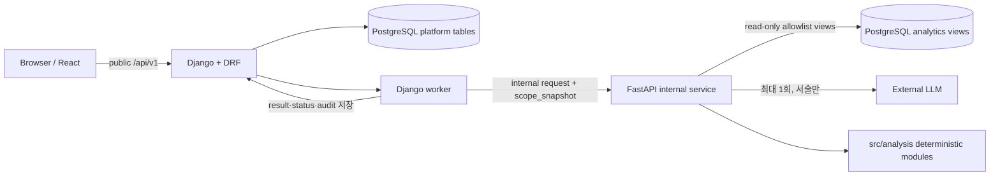

# SensePlace — 호텔 VOC·운영 지원 플랫폼 백엔드 작업영역 검토

> 문서 유형: 일반 작업 문서(공식 산출물 아님)
> 작성 기준일: 2026-07-21
> 검토 대상 commit: `f29f5ad8942c4a6b829c7d134f7dfcc99c71ddb0`
> 상태: 사람 결정 후 구현 가능
> 담당 기준: 김재홍(B 백엔드·통합)
> 사용 템플릿: 전용 템플릿 없음. `docs/문서관리규칙.md`의 일반 문서 규칙과 작업 프롬프트 목차를 적용함

## 0. 결론

백엔드 P0는 `Django 외부 게이트웨이 + Django worker + 내부 FastAPI + PostgreSQL`의 한 방향 호출 경계를 유지하고, 기능 A와 기능 B의 최소 vertical slice를 2026-08-13~14 Gate 전에 실제 연결하는 범위다. Browser는 Django만 호출하며, Django는 인증·RBAC·`scope_snapshot`·job·report·decision·audit·migration의 원본이고 FastAPI는 품질 Gate·결정론적 감지·query·Incident·LLM 연동을 내부 API로 제공한다.

현재 저장소에는 `app/django`, `app/fastapi`, `src/analysis`, `src/common`, `tests`의 `.gitkeep`만 있고 실행 코드·dependency·migration·test evidence가 없다. 따라서 현재 완료 상태는 **구현 전 계약 검토**이며 기능 완료로 판정할 수 없다.

가장 먼저 할 일은 역할 코드, 8개 intent, 상태 enum, 감성 정책, API schema v0, DB migration 소유권, worker 방식, report version 규칙을 동결하는 것이다. 이 결정 없이 framework를 초기화하면 React fixture·Django·FastAPI·데이터 schema가 서로 달라질 위험이 크다.

### 0.1 사람이 판단해야 할 사항

- [ ] 역할 코드를 `HOTEL_MANAGER`, `FNB_MANAGER`, `ROOMS_MANAGER`로 동결한다.
  - 현재 문서 상태: 요구사항·기획서는 `ROOMS_MANAGER`, 화면설계서 P0는 `ROOM_MANAGER`를 사용한다.
  - 충돌 또는 위험: session·fixture·API enum·권한 test가 불일치한다.
  - 권장안: `ROOMS_MANAGER`를 단일 코드로 사용한다.
  - 선택 시 영향: 역할 matrix와 `scope_snapshot` schema를 고정할 수 있다.
  - 보류 시 영향: 로그인·권한·fixture 병렬 작업을 시작할 수 없다.
  - 결정 기한: framework 초기화 전, WBS `1.7` 종료 전
  - 관련 요구사항·WBS: `REQ-F-002`, `FUN-002`, `SEC-002`, `1.7`, `6.1`, `PV-6.1`

- [ ] 백엔드 Baseline API를 중간발표 6개 화면의 기능 A·B 흐름으로 제한한다.
  - 현재 문서 상태: 최신 기획·요구사항은 6개 흐름을 우선하지만 화면설계서 본문에는 전체 Core 화면과 업로드·관리 기능이 남아 있다.
  - 충돌 또는 위험: Gate 전에 전체 Core API를 구현하면 일정과 보안 검증 범위가 급증한다.
  - 권장안: 6개 화면의 실제 연결에 필요한 API만 P0로 구현하고 나머지는 Gate 후 확장으로 둔다.
  - 선택 시 영향: 기능 A·B E2E와 21개 반례에 집중할 수 있다.
  - 보류 시 영향: API 수와 migration 범위를 확정할 수 없다.
  - 결정 기한: API schema v0 승인 전
  - 관련 요구사항·WBS: `REQ-F-003`~`007`, `UI-001`~`005`, `6.2`~`6.6`, `7.1`

- [ ] 보장 intent 8종의 최종 계약을 승인한다.
  - 현재 문서 상태: 요구사항·기획서는 8종, 화면설계서 구 본문은 10종을 요구한다.
  - 충돌 또는 위험: query plan·fixture·회귀 matrix의 개수가 달라진다.
  - 권장안: 8종을 유지하고 7번을 `주제별 부정 VOC 조회`로 변경하며 자유형 Text-to-SQL은 금지한다.
  - 선택 시 영향: `8 intent × 3 roles × 3 utterances` 회귀 계약을 만들 수 있다.
  - 보류 시 영향: SQL builder·Guard와 UI 추천 질문을 구현할 수 없다.
  - 결정 기한: WBS `1.7`, `6.9` 시작 전
  - 관련 요구사항·WBS: `REQ-F-003`, `FUN-006`, `AI-010`, `1.7`, `6.9`, `6.12`

- [ ] Django worker 실행 방식을 정한다.
  - 현재 문서 상태: job+polling과 Django worker 책임은 확정됐으나 process 형태는 미정이다.
  - 충돌 또는 위험: 별도 queue 도입 시 일정·장애 지점·배포 복잡도가 늘어난다.
  - 권장안: P0는 DB job table을 polling하는 Django management command 한 개로 시작한다.
  - 선택 시 영향: Redis·Celery 없이 transaction·idempotency를 검증할 수 있다.
  - 보류 시 영향: job 상태와 재시도 책임을 구현할 수 없다.
  - 결정 기한: `6.2` 구현 전
  - 관련 요구사항·WBS: `REQ-F-003`, `OPS-001`, `6.2`, `PV-6.2`

- [ ] DB migration과 analytics DDL 소유권을 승인한다.
  - 현재 문서 상태: 보호 계약은 Django 단일 migration을 요구하지만 analytics schema의 데이터 담당 경계가 구현 수준으로 확정되지 않았다.
  - 충돌 또는 위험: Django와 FastAPI가 같은 table을 중복 생성하거나 FastAPI에 write 권한이 생길 수 있다.
  - 권장안: Django가 platform table migration의 단일 주체이고 analytics table·view DDL은 데이터 담당과 공동 검토하며 FastAPI는 allowlist view read-only role만 사용한다.
  - 선택 시 영향: table owner와 배포 순서를 고정할 수 있다.
  - 보류 시 영향: migration과 DB credential을 만들면 안 된다.
  - 결정 기한: WBS `2.8` 완료 전
  - 관련 요구사항·WBS: `DAT-007`, `DAT-008`, `REQ-NF-001`, `2.7`~`2.9`, `PV-6.3`

- [ ] report 상태·version·decision 규칙을 승인한다.
  - 현재 문서 상태: `DRAFT`, `APPROVED`, `ON_HOLD`, `REJECTED`와 승인본 불변 원칙은 일치하지만 반려 후 재생성·동일 주차 unique key·decision comment 필수 여부는 미정이다.
  - 충돌 또는 위험: 승인본 덮어쓰기와 중복 보고서가 발생할 수 있다.
  - 권장안: 승인본은 immutable, `ON_HOLD`·`REJECTED` 후 새 `DRAFT` version, `(virtual_week_id, analysis scope, template_version)` 기반 unique 정책, 보류·반려 comment 필수로 한다.
  - 선택 시 영향: 낙관적 잠금과 audit test를 확정할 수 있다.
  - 보류 시 영향: report migration·decision API를 구현할 수 없다.
  - 결정 기한: `6.2`, `6.6` 구현 전
  - 관련 요구사항·WBS: `REQ-F-006`, `REQ-F-007`, `RPT-001`, `SEC-003`, `6.2`, `6.6`

- [ ] LLM 공급자·모델·실행 제한을 승인한다.
  - 현재 문서 상태: 실행당 최대 1회와 template Fallback은 확정됐지만 공급자·모델·timeout·비용 상한·재시도 정의가 미정이다.
  - 충돌 또는 위험: `최대 1회`와 기존 계약의 `1회 retry` 권장이 동시에 적용되면 실제 호출 수가 달라진다.
  - 권장안: P0는 한 실행당 실제 호출 총 1회, retry 0회로 시작하고 timeout은 `PROJECT_CALIBRATION`으로 측정·version 관리한다. 실패·invalid JSON은 즉시 `PARTIAL` template Fallback으로 전환한다.
  - 선택 시 영향: 비용·지연·장애 test가 결정론적으로 재현된다.
  - 보류 시 영향: LLM gateway와 장애 test를 완료할 수 없다.
  - 결정 기한: 합성 VOC 생성·`PV-6.4` 시작 전
  - 관련 요구사항·WBS: `INT-001`, `NFR-002`, `1.7`, `5.7`, `PV-6.4`

- [ ] VectorDB 독립 실험 경계를 재확인한다.
  - 현재 문서 상태: `DAT-006`, `INT-002`, WBS `3.6`은 독립 실험이며 Baseline runtime 의존성이 아니다.
  - 충돌 또는 위험: 검색 실패가 Incident·report를 중단하면 Gate 범위가 바뀐다.
  - 권장안: pgvector 실험은 별도 결과서로 유지하고 Baseline은 SQL evidence만으로 완결한다.
  - 선택 시 영향: 교육 산출물과 P0 안정성을 함께 유지한다.
  - 보류 시 영향: runtime dependency graph를 동결할 수 없다.
  - 결정 기한: `3.6` 시작 전
  - 관련 요구사항·WBS: `DAT-006`, `INT-002`, `3.6`

- [ ] 관리자·업로드·외부 전달 기능을 Gate 이후로 보류한다.
  - 현재 문서 상태: 요구사항은 승인 후 후보이나 화면설계서 구 Core에는 업로드·관리 화면이 남아 있다.
  - 충돌 또는 위험: upload validation·파일 보안·외부 채널 연동이 P0에 유입된다.
  - 권장안: `FUN-003`, `FUN-004`, `FUN-009`~`011`, `INT-003`, `OPS-002`, `OPS-003`은 P0 구현 금지로 유지한다.
  - 선택 시 영향: P0가 고정 합성 fixture와 내부 승인 흐름으로 제한된다.
  - 보류 시 영향: 화면·API·보안 범위가 계속 흔들린다.
  - 결정 기한: P0 backlog 승인 전
  - 관련 요구사항·WBS: 위 요구사항, `6.10`, `7.4`, `7.7`

### 0.2 판단 체크리스트

- [ ] 공식 제목이 `SensePlace — 호텔 VOC·운영 지원 플랫폼`으로 승인됐다.
- [ ] `ROOMS_MANAGER`와 8개 intent가 fixture·API·test에서 동일하다.
- [ ] API schema v0와 공통 envelope·오류 코드가 승인됐다.
- [ ] Browser→Django→worker→FastAPI 외의 호출 경로가 없다.
- [ ] Django가 `scope_snapshot`·job·report·decision·audit·migration의 원본이다.
- [ ] FastAPI가 allowlist analytics view만 read-only로 조회한다.
- [ ] `POSITIVE`, `NEUTRAL`, `NEGATIVE` 저장 계약과 `NEGATIVE` 전용 Baseline 활용 정책이 분리됐다.
- [ ] job·report 상태와 낙관적 잠금·idempotency가 정의됐다.
- [ ] LLM 없이 KPI·trigger·evidence·template DRAFT가 생성된다.
- [ ] 21개 반례 Gate와 8 intent 역할 matrix가 구현 완료 조건에 연결됐다.

### 0.3 고정된 팀 결정

| 항목 | 단일 기준 |
|---|---|
| 공식 제목 | `SensePlace — 호텔 VOC·운영 지원 플랫폼` |
| 호출 경계 | `Browser → Django → Django worker → FastAPI → PostgreSQL/LLM` |
| 외부 backend | Django 하나 |
| 인증·권한 원본 | Django session·RBAC·server-side `scope_snapshot` |
| 분석 경계 | FastAPI 내부 API, analytics view read-only |
| migration | Django 단일 소유 |
| KPI·품질·trigger | SQL·Python·versioned rule |
| LLM | 질문 해석 또는 evidence 기반 서술, 실행당 최대 1회 |
| LLM 장애 | 수치·trigger·evidence 보존, template Fallback, `PARTIAL` |
| semantic 계층 | PostgreSQL `metric_catalog`; 정식 ontology·GraphDB 제외 |
| 감성 저장 enum | `POSITIVE`, `NEUTRAL`, `NEGATIVE` |
| Baseline 감성 활용 | `NEGATIVE`만 KPI·trigger·evidence·report에 사용 |
| Positive·Neutral | 저장·독립 실험만 허용, P1 전까지 UI·API·보고 판단에 사용 금지 |
| 중간발표 | backend 미연동 6화면 fixture |
| 기능 Baseline | 2026-08-13~14 Gate 전 실제 기능 A·B 연결 |

### 0.4 백엔드 최우선 업무

| 순위 | 업무 | 이유 | 선행 결정 | 완료 기준 | 관련 ID | P0 여부 |
|---:|---|---|---|---|---|---|
| 1 | 공통 계약 동결 | 모든 연동의 선행조건 | 역할·상태·감성·intent | 계약 검토 완료 | `1.7`, `REQ-*` | P0 |
| 2 | Django session·RBAC·scope | 보안 경계 | 역할 코드 | 권한 matrix test 설계 | `6.1`, `PV-6.1` | P0 |
| 3 | Platform DB·상태 설계 | job·report 기반 | migration·version | ERD·상태표 review | `2.8`, `6.2` | P0 |
| 4 | job·worker·polling | 기능 A/B 공통 | worker 방식 | 상태 전이·idempotency test | `6.2`, `PV-6.2` | P0 |
| 5 | FastAPI 내부 계약 | Django·AI 연동 | endpoint·timeout | schema stub 계약 | `6.14`, `PV-6.3` | P0 |
| 6 | SQL builder·Guard | 기능 A 안전성 | 8 intent | 공격·scope 차단 test | `6.9`, `6.12` | P0 |
| 7 | Incident·report·decision | 기능 B 종료 흐름 | 상태·version | E2E 1건 | `6.3`, `6.6`, `PV-6.5` | P0 |
| 8 | LLM Fallback | 부분 장애 대응 | 모델·timeout | 수치 유지·`PARTIAL` | `5.7`, `PV-6.4` | P0 |
| 9 | 통합·보안 Gate | 완료 판정 | fixture·test | 21건 PASS·차단 결함 0 | `7.1`, `TST-001` | P0 |
| 10 | VectorDB 실험 | 교육 산출물 | 평가 범위 | 독립 결과서 | `3.6`, `INT-002` | P1 |

### 0.5 최소 기능 구현 방향

첫 vertical slice는 다음 두 경로만 끝까지 연결한다.

```text
기능 A
Django 로그인 → FNB_MANAGER scope → 조식 대기 질문 1종
→ job 생성 → worker → FastAPI query run → SQL Guard
→ read-only 조회 → 표·차트·결정론 설명 → Django 저장 → polling

기능 B
BREAKFAST_CONGESTION batch READY → analytical Gate
→ RULE-001 → Incident 1건 → evidence → template report DRAFT
→ HOTEL_MANAGER 승인·보류·반려 → audit
```

첫 slice에서 LLM은 필수 의존성이 아니다. LLM을 끈 상태에서도 기능 A 수치 결과와 기능 B Incident·evidence·template DRAFT·decision이 완료돼야 한다.

## 1. 검토 범위와 현재 상태

### 1.1 기준 문서

내용 판단 우선순위는 `AGENTS.md`와 `docs/문서관리규칙.md`에 따라 다음처럼 적용했다.

1. 사용자 제공 최종 프롬프트의 고정 결정
2. `docs/markdown/01_요구사항정의서.md` v2.4
3. `docs/markdown/02_WBS.md` v2.3
4. `docs/markdown/SensePlace_기획서_초안.md` v1.3
5. `docs/markdown/03_프로젝트기획서.md` v3.5
6. `docs/markdown/05_화면설계서_초안.md`
7. 보호 기준 자료 `docs/markdown/final_project/`
8. `README.md`, 실제 저장소 구조

### 1.2 실제 저장소 상태

| 경로 | 확인 결과 | 판정 |
|---|---|---|
| `app/django/` | `.gitkeep`만 존재 | Django project·model·migration·worker 미구현 |
| `app/fastapi/` | `.gitkeep`만 존재 | FastAPI app·route·Pydantic schema 미구현 |
| `app/react/` | `.gitkeep`만 존재 | 목업·fixture 미구현 |
| `src/analysis/` | `.gitkeep`만 존재 | 품질·KPI·rule·evidence 미구현 |
| `src/common/` | `.gitkeep`만 존재 | enum·계약·오류 원본 미구현 |
| `tests/`, `evals/` | `.gitkeep`만 존재 | test evidence 없음 |

확인된 사실은 구현 경계만 존재한다는 것이다. framework 버전, dependency 관리, DB connection, Docker, migration, API 응답의 실제 동작은 확인되지 않았다.

### 1.3 문서 템플릿·번호 적용

| 항목 | 결과 |
|---|---|
| 문서 분류 | 공식 산출물과 직접 연결되지 않은 일반 검토 문서 |
| 저장 위치 | `docs/markdown/` |
| 전용 템플릿 | 없음 |
| 최상위 목차 | 사용자 프롬프트의 필수 구조 적용 |
| 추가 하위 절 | 서비스 경계·DB·API·권한·worker·Guard·Fallback·Gate |
| 번호 충돌 | 공식 산출물 번호를 사용하지 않아 없음 |
| 보호 문서 | `docs/markdown/final_project/`, `docs/templates/` 수정 금지 유지 |

## 2. 공식 제목 불일치와 최소 패치 대상

| 문서 | 현재 제목·명칭 | 변경 권장 제목 | 본문 영향 | 코드·API 영향 | 우선순위 |
|---|---|---|---|---|---|
| `README.md` | `Hotel Signal AI` | `SensePlace — 호텔 VOC·운영 지원 플랫폼` | 첫 정의·공통 문서명 | API 문서 title·OpenAPI metadata | 높음 |
| `01_요구사항정의서.md` | SensePlace 호텔 VOC·운영 지원 서비스 | 공식 제목 | 표지·서비스 설명 | enum·path 영향 없음 | 중간 |
| `02_WBS.md` | SensePlace 호텔 VOC·운영 지원 PoC | 공식 제목 | 문서 제목 | 없음 | 중간 |
| `03_프로젝트기획서.md` | SensePlace 호텔 VOC·운영 지원 PoC | 공식 제목 | 문서 제목·한 줄 정의 | OpenAPI·화면 공통 header | 높음 |
| `05_화면설계서_초안.md` | Hotel Signal AI 화면설계서 | 공식 제목 + 화면설계서 | header·본문 legacy 명칭 | frontend header | 높음 |
| `final_project/*` | Hotel Signal AI | 공식 제목으로 후속 개정 필요 | 보호 문서 전체 | 계약 문서 title | 높음·사용자 승인 필요 |

이번 작업에서는 기존 문서를 일괄 수정하지 않는다. 최소 패치는 title·공통 header·OpenAPI title·화면 header부터 적용하고, 과거 변경 이력의 legacy 명칭은 유지한다.

## 3. 백엔드 요구사항·WBS 매핑

| 백엔드 결과 | 요구사항 | 실행 WBS | 완료 evidence |
|---|---|---|---|
| 계약 동결 | `REQ-F-001`~`007`, `REQ-NF-001`,`002` | `1.7` | 승인된 역할·상태·intent·API·schema 표 |
| Django 인증·권한 | `FUN-001`,`FUN-002`,`SEC-002` | `6.1`, `PV-6.1` | 비로그인·역할별 허용/거부 test |
| job·polling·worker | `REQ-F-003`,`OPS-001`,`NFR-002` | `6.2`, `PV-6.2` | 상태 전이·timeout·stale job·중복 test |
| DB·catalog·migration | `DAT-007`,`DAT-008`,`REQ-NF-001` | `2.8`,`2.9` | ERD·migration review·read-only role test |
| FastAPI 내부 API | `REQ-F-001`,`003`~`006` | `6.14`,`5.7`,`PV-6.3` | contract test·Django 외 직접 접근 차단 |
| query plan·SQL Guard | `FUN-006`,`AI-010`,`SEC-002` | `6.9`,`6.12` | 8 intent matrix·SQL 공격 suite |
| quality·detection | `REQ-F-001`,`004` | `5.3`,`5.9`,`5.10` | 정상·이상·결측·중복 scenario |
| Incident·evidence | `REQ-F-005`,`AI-003`,`AI-009` | `5.4`,`6.3` | 관측·후보·반대·부족 데이터 분리 test |
| report·decision·audit | `REQ-F-006`,`007`,`RPT-001`,`SEC-003` | `6.2`,`6.6`,`PV-6.5` | immutable 승인본·version conflict test |
| LLM Fallback | `INT-001`,`NFR-002` | `5.7`,`PV-6.4` | timeout에도 수치·evidence 유지 |
| 통합 Gate | `TST-001`,`TST-003` | `7.1`,`7.6` | 반례 21건·복수 seed·차단 결함 0 |

## 4. 문서 충돌과 변경 영향

| conflict_id | 항목 | 문서 A | 문서 B | 현재 내용 | 권장 단일 기준 | 백엔드 영향 | 사람 결정 | 우선순위 |
|---|---|---|---|---|---|---|---|---|
| `CF-001` | 공식 제목 | 요구사항·WBS | README·화면·보호 문서 | SensePlace 변형과 Hotel Signal AI 혼재 | 공식 제목 사용 | OpenAPI·로그·report title | 예 | P0 |
| `CF-002` | 역할 코드 | 요구사항·기획서 | 화면설계서 P0 | `ROOMS_MANAGER` vs `ROOM_MANAGER` | `ROOMS_MANAGER` | enum·RBAC·fixture·test | 예 | P0 |
| `CF-003` | 질문 수 | 요구사항·기획서 | 화면설계서 구 Core | 8 intent vs 10 질문 | 8 intent | plan·Guard·회귀 수 | 예 | P0 |
| `CF-004` | 감성 활용 | 사용자 고정 결정 | 화면설계서 | NEGATIVE 전용 vs 다중 감성 filter·표시 | 저장 3종, P0 활용 NEGATIVE만 | API filter·KPI·trigger·report | 확정 반영 | P0 |
| `CF-005` | 감성 intent | 사용자 고정 결정 | 기획서·공통 명세 | 주제·감성별 VOC | 주제별 부정 VOC | intent 7 schema·fixture | 예 | P0 |
| `CF-006` | report 긍정 절 | 사용자 고정 결정 | 보호 API 계약 | Positive 사용 금지 vs `positive_voc` section | P0 section 제거 | report schema | 예 | P0 |
| `CF-007` | 화면 범위 | 최신 기획 | 화면설계서 구 Core | 6화면 vs 전체 Core | 6화면 기능 A·B | 공개 API·migration 범위 | 예 | P0 |
| `CF-008` | 업로드 | 요구사항 | 화면설계서 Core | 승인 후 후보 vs Core 업로드 | P0 제외 | upload API·file security 제거 | 예 | P0 |
| `CF-009` | Gate 반례 | 요구사항 v2.4 | 보호 test 가이드 | 21건 vs 16건 | 21건 | test ID·합격 판정 | 아니오 | P0 |
| `CF-010` | Golden Path 시점 | 최신 기획·WBS | 보호 test 가이드 | 8주차 5회 vs Gate 5회 | Gate는 21건, 5회는 8주차 | 일정·완료 판정 | 예 | P0 |
| `CF-011` | VOC schema | 최신 기획·요구사항 | 보호 data 가이드 | `fact_voc_topic` 분리 vs `fact_voc.sentiment_label` | `fact_voc_topic` 분리 | migration·join·label enum | 예 | P0 |
| `CF-012` | platform table | 백엔드 고정 책임 | 보호 data 가이드 | job·audit 책임은 있으나 table 목록에 없음 | Django `job`, `audit_event` 논리 entity 추가 검토 | migration·retention | 예 | P0 |
| `CF-013` | API version path | 사용자 프롬프트 | 보호 API 계약 | `/api/v1/*` vs `/api/*` | `/api/v1/*` 권장 | frontend client·OpenAPI | 예 | P0 |
| `CF-014` | 내부 report 서술 | 사용자 프롬프트 | 보호 API 계약 | 별도 `report-narratives` 후보 vs Incident 내 draft | 별도 endpoint 권장 | LLM timeout·재사용 경계 | 예 | P0 |
| `CF-015` | job 상태 | 최신 기획·요구사항 | legacy 표현 검색 | 최신은 `SUCCEEDED`; `SUCCESS`·`COMPLETED` 금지 | 6개 enum 동결 | polling·DB check | 예 | P0 |
| `CF-016` | VectorDB·GraphDB | 최신 기획·요구사항 | 과거 기술 지향 표현 | 독립 실험 vs runtime 오해 | P0 runtime 비의존 | dependency·장애 경로 | 아니오 | P1 |

## 5. 최소 백엔드 아키텍처



의존 방향은 `app → src`다. `src`는 Django·FastAPI를 import하지 않으며 품질·KPI·rule·evidence 같은 framework 독립 로직만 포함한다.

## 6. 서비스 책임과 금지 경계

| 소유자 | 반드시 소유 | 금지 |
|---|---|---|
| Django | session·CSRF·RBAC·scope·job·report·decision·audit·platform migration | KPI·trigger·LLM 판정 중복 구현 |
| Django worker | job claim·상태·timeout·retry·idempotency·FastAPI orchestration·결과 저장 | analytics view 직접 계산·Browser 노출 |
| FastAPI | quality Gate·detection·query plan·SQL Guard·read-only query·Incident·LLM gateway | 사용자 인증 원본·report decision·migration |
| `src/analysis` | 순수 quality·metric·rule·evidence | HTTP·ORM migration·framework 설정 |
| `src/common` | role/job/report enum·contract·ID·error | consumer별 상충 schema |
| PostgreSQL | analytics view와 platform persistence | LLM 임의 접근·FastAPI write role |

## 7. DB·상태·버전 설계 검토

### 7.1 P0 논리 entity

| entity | 소유 | 목적 | 핵심 제약 |
|---|---|---|---|
| `job` | Django | query·analysis 비동기 작업 | idempotency, 상태 전이, stale recovery |
| `query_run` | Django 저장 / FastAPI 결과 | 질문 plan·SQL hash·결과 이력 | actor·scope·dataset version 추적 |
| `analysis_run` | Django 저장 / FastAPI 결과 | Incident 실행 | batch·rule별 중복 방지 |
| `evidence` | Django persistence | 수치·원문 근거 연결 | source key·기간·단위·표본 필수 |
| `report` | Django | versioned DRAFT·승인본 | 승인본 immutable |
| `report_decision` | Django | 승인·보류·반려 이력 | HOTEL_MANAGER만 생성 |
| `field_note` | Django | 현장 확인 메모 | PII pattern·version 검사 |
| `audit_event` | Django | 로그인·거부·조회·상태·결정 | append-only 원칙 |

실제 table명과 DB ID는 데이터 담당과 migration review에서 확정한다. 보호 data 가이드의 DB ID를 임의 재사용하지 않는다.

### 7.2 감성 계약

```text
fact_voc_topic.sentiment_label ∈ {POSITIVE, NEUTRAL, NEGATIVE}
```

- `NEGATIVE`: P0 KPI·trigger·query·Incident evidence·report에 사용한다.
- `POSITIVE`, `NEUTRAL`: 저장 또는 독립 분류 실험만 허용한다.
- P0 API는 감성 다중 filter를 받지 않는다. 필요한 경우 `sentiment=NEGATIVE`를 서버 고정값으로 처리한다.
- 부정 VOC 비율의 분모는 유효한 전체 분류 건수로 정의할 수 있지만 Positive·Neutral 자체를 원인·유지 요인·추천 근거로 사용하지 않는다.

### 7.3 상태

```text
Job: PENDING → RUNNING → SUCCEEDED | PARTIAL | NEEDS_DATA | FAILED
Report: DRAFT → APPROVED | ON_HOLD | REJECTED
```

- `ON_HOLD`, `REJECTED` 보완은 기존 row를 덮어쓰지 않고 새 `DRAFT` version을 생성한다.
- `APPROVED` version은 immutable이다.
- `READY_FOR_REVIEW`는 Incident 화면 상태이며 report 상태로 저장하지 않는다.
- `SUCCESS`, `COMPLETED`는 사용하지 않는다.

### 7.4 추적 version

`dataset_version`, `schema_version`, `generator_version`, `scope_version`, `metric_catalog_version`, `rule_version`, `gate_version`, `analysis_version`, `model_version`, `prompt_version`, `template_version`, `report_version`을 결과 또는 추적 가능한 parent에 기록한다.

## 8. 외부·내부 API 계약 초안

### 8.1 공통 envelope

```json
{
  "data": {},
  "meta": {
    "request_id": "uuid",
    "timestamp": "ISO-8601 UTC",
    "dataset_version": "string",
    "schema_version": "string",
    "analysis_version": "string",
    "is_synthetic": true
  },
  "error": null
}
```

실패 응답은 `data=null`과 `error.code`, 사용자용 `message`, 구조화된 `details[]`를 사용한다. 내부 stack·SQL·secret은 노출하지 않는다.

### 8.2 Django 외부 API

| 분류 | method·path | 목적 | P0 판정 |
|---|---|---|---|
| Gate 필수 | `POST /api/v1/auth/login` | session 생성 | 필수 |
| Gate 필수 | `POST /api/v1/auth/logout` | session 종료 | 필수 |
| Gate 필수 | `GET /api/v1/session` | actor·role·허용 scope 요약 | 필수 |
| 첫 vertical slice | `POST /api/v1/query-jobs` | query job 생성·202 반환 | 필수 |
| 첫 vertical slice | `GET /api/v1/jobs/{job_id}` | 상태·결과 polling | 필수 |
| Gate 필수 | `GET /api/v1/incidents` | 허용 scope 이슈 목록 | 필수 |
| Gate 필수 | `GET /api/v1/incidents/{incident_id}` | 이슈 브리프 | 필수 |
| Gate 필수 | `GET /api/v1/incidents/{incident_id}/evidence` | 근거·반대 근거 | 필수 |
| Gate 필수 | `POST /api/v1/incidents/{incident_id}/field-notes` | 현장 확인 메모 | 6화면 계약 승인 시 필수 |
| Gate 필수 | `GET /api/v1/reports` | report 목록·version | 필수 |
| Gate 필수 | `GET /api/v1/reports/{report_id}` | 특정 version 조회 | 필수 |
| Gate 필수 | `POST /api/v1/reports/{report_id}/decisions` | 승인·보류·반려 | 필수 |
| Gate 후 | upload·download·rule admin·external delivery | 선택 확장 | P0 금지 |

### 8.3 Django→FastAPI 내부 API

| endpoint | 목적·caller | request·response 핵심 | 상태·timeout·retry | idempotency·DB·LLM | Fallback | 관련 ID·test |
|---|---|---|---|---|---|---|
| `POST /internal/v1/quality-gates` | worker가 batch 검증 | dataset·gate version → checks·gate status | `PROJECT_CALIBRATION`, retry 0 권장 | batch+gate version; read-only; LLM 없음 | `NEEDS_DATA`, detection 중단 | `REQ-F-001`, `TC-DQ-*` |
| `POST /internal/v1/detection-runs` | worker가 versioned rule 실행 | dataset·rule version → trigger·evidence IDs | timeout versioned, retry 0 권장 | batch+rule unique; read-only; LLM 없음 | `FAILED` 또는 보존 결과 `PARTIAL` | `REQ-F-004`, `TC-GATE-004`~`012` |
| `POST /internal/v1/query-runs` | worker가 기능 A 실행 | question·intent·scope·dataset → plan·table·chart·evidence | job 상태 사용, retry는 idempotency 있을 때만 | query hash; read-only; 해석에 최대 1회 | 승인 utterance matcher 또는 `UNSUPPORTED_INTENT` | `REQ-F-003`, `TC-E2E-001` |
| `POST /internal/v1/incident-runs` | worker가 기능 B 조사 | detection·scope·dataset → facts·candidates·counter evidence | job 상태 사용, retry는 unique key 필요 | batch+rule; read-only; 서술 최대 1회 | 결정론 brief·`PARTIAL` | `REQ-F-005`, `TC-E2E-002` |
| `POST /internal/v1/report-narratives` | worker가 evidence 서술 요청 | section schema·evidence IDs → 검증된 문장 | LLM timeout versioned, 총 호출 1회 권장 | report draft key; DB 직접 쓰기 금지; LLM 사용 | template DRAFT·`PARTIAL` | `REQ-F-006`, `TC-AI-002`~`005` |
| `GET /internal/v1/health` | worker·운영 점검 | service·contract version | 짧은 timeout, retry 0 | DB deep check는 별도; LLM 없음 | unavailable로 job 시작 차단 | `OPS-001`, `TC-INT-*` |

내부 API는 service credential과 network restriction을 함께 사용한다. Browser가 내부 endpoint를 호출하거나 role·scope를 직접 제출하는 경로는 허용하지 않는다.

### 8.4 오류 코드

`AUTHENTICATION_REQUIRED`, `PERMISSION_DENIED`, `UNSUPPORTED_INTENT`, `INVALID_SCOPE`, `INVALID_DATASET_VERSION`, `DATA_QUALITY_FAILED`, `NEEDS_DATA`, `SQL_GUARD_REJECTED`, `QUERY_TIMEOUT`, `LLM_TIMEOUT`, `LLM_INVALID_RESPONSE`, `STATE_CONFLICT`, `DUPLICATE_REQUEST`, `INTERNAL_SERVICE_UNAVAILABLE`를 P0 후보로 동결한다. HTTP status와 사용자 문구는 API schema review에서 확정한다.

## 9. 권한·scope 설계

| 기능 | HOTEL_MANAGER | FNB_MANAGER | ROOMS_MANAGER |
|---|---|---|---|
| 전체 합성 운영 집계 | 가능 | F&B 범위 | 객실 범위 |
| 조식 인력 상세 | 가능 | 가능 | 불가 |
| 객실 집계 | 가능 | 제한 | 가능 |
| 조식 부정 VOC | 가능 | 가능 | 허용 요약만 |
| 이슈 브리프 | 전체 | F&B | 객실·허용 요약 |
| field note | 가능 | 담당 이슈 | 담당 이슈 |
| report 조회 | 전체 | 담당 scope DRAFT 조회 | 담당 scope DRAFT 조회 |
| report decision | 가능 | 불가 | 불가 |

`scope_snapshot`은 Django가 로그인 시점의 role과 요청 시점의 허용 resource를 서버에서 계산해 job에 저장한다. FastAPI는 저장된 snapshot과 DB `role_scope`를 이중 검사하되 새로운 권한 원본을 만들지 않는다.

## 10. job·worker·polling 설계

```text
POST request
→ Django transaction에서 job(PENDING) 생성
→ 202 + job_id 반환
→ worker가 lock/claim 후 RUNNING
→ 내부 FastAPI 호출
→ 결과·오류·audit 저장
→ terminal status
→ UI polling 종료
```

필수 규칙:

- `idempotency_key`가 같으면 기존 job 또는 결과를 반환한다.
- worker는 DB row lock 또는 동등한 claim 전략으로 중복 실행을 막는다.
- stale `RUNNING`의 기준 시간은 `PROJECT_CALIBRATION`으로 관리한다.
- 무한 polling·무한 retry를 금지한다.
- 사용자 취소는 P0에서 제외한다.
- `PARTIAL`은 성공한 결정론 결과가 존재할 때만 사용한다.
- `NEEDS_DATA`는 품질·표본·필수 bucket 부족을 나타내며 일반 오류와 분리한다.

## 11. 결정론적 SQL builder·Guard

Guard 순서는 다음으로 고정한다.

1. intent allowlist와 필수 parameter 확인
2. Django `scope_snapshot`과 `role_scope` 일치 확인
3. metric·dimension·grain을 `metric_catalog`로 검증
4. P0 감성 조건을 `NEGATIVE`로 고정
5. 승인된 query template 선택과 parameter binding
6. SELECT-only·single statement·schema/view/column allowlist 검사
7. 금지 keyword·주석·`UNION`·다중 statement·system catalog·금지 함수 차단
8. 비가산 지표 재집계 차단
9. row limit·statement timeout·read-only transaction 적용
10. plan hash·SQL hash·row count·거부 사유 audit 저장

미지원 intent나 scope 위반은 SQL 생성·실행 0건이어야 한다. 사용자 입력 raw SQL을 실행하거나 LLM이 SQL 문자열을 자유 생성하는 endpoint는 만들지 않는다.

## 12. LLM·Fallback

| 단계 | LLM 허용 | 결정론 원본 | 실패 처리 |
|---|---|---|---|
| 질문 해석 | 승인된 8 intent parameter 후보 | intent allowlist·utterance fixture | 미지원 안내 또는 승인 matcher |
| query 설명 | evidence 기반 문장 | SQL 결과·기간·단위·표본 | template 설명·`PARTIAL` |
| Incident 설명 | 후보·반대 근거 서술 | rule·evidence 구조 | 결정론 brief·`PARTIAL` |
| report narrative | evidence ID가 있는 section 문장 | report section JSON | template DRAFT·`PARTIAL` |
| KPI·품질·trigger | 금지 | SQL·Python·versioned rule | 해당 없음 |

LLM 출력은 JSON schema를 통과하고 모든 수치·사실 문장이 `evidence_id`와 연결돼야 한다. 실제 호출 총 1회 원칙과 재시도 정책이 충돌하므로 P0 권장안은 retry 0회다. 팀이 retry 1회를 승인하려면 `실행당 최대 1회` 정의와 비용·timeout test를 함께 수정해야 한다.

## 13. 보고서·decision·audit

P0 report section은 `summary`, `key_incidents`, `negative_voc`, `evidence`, `cause_candidates`, `counter_evidence`, `field_checks`, `response_options`, `limitations`으로 제안한다. `positive_voc`와 만족·유지 요인 절은 P0에서 제외한다.

필수 transaction 규칙:

- decision 요청은 `expected_report_version`을 포함한다.
- `HOTEL_MANAGER` 권한과 report scope를 같은 transaction에서 검사한다.
- 최신 version이 아니면 `STATE_CONFLICT`를 반환한다.
- 승인·보류·반려와 audit event를 원자적으로 저장한다.
- 승인 version은 수정하지 않는다.
- 새 DRAFT는 이전 version과 evidence lineage를 참조한다.
- 같은 batch·rule·virtual week의 report 중복을 unique key로 차단한다.

audit 최소 필드:

```text
request_id, run_id, job_id, actor_id, role_code, scope_snapshot_hash,
dataset_version, schema_version, rule_version, analysis_version,
query_plan_hash, sql_hash, row_count, evidence_ids,
job_status, report_id, report_version, decision, error_code, timestamps
```

질문 원문·VOC 원문·token·secret은 일반 로그에 저장하지 않는다. 필요한 질문은 redacted form 또는 hash만 보존한다.

## 14. 테스트·Gate

P0 완료는 코드·폴더 존재가 아니라 실제 evidence로 판정한다.

| 영역 | 필수 검증 |
|---|---|
| 인증 | 비로그인 접근 차단, session·CSRF, 로그인 실패 정책 |
| 권한 | 3역할 metric·view·object matrix, 직접 URL 차단 |
| 내부 경계 | Browser→FastAPI 차단, service credential 실패 |
| SQL | injection·prompt injection·raw SQL·scope 우회·비가산 재집계 차단 |
| job | 중복 요청, stale RUNNING, timeout, terminal polling |
| 데이터 | 적재 전 validation, analytical Gate, 결측·단위·시간·PII |
| 감성 | `POSITIVE`·`NEUTRAL`이 KPI·trigger·Incident·report에 사용되지 않음 |
| report | 상태 충돌, 승인 권한, 승인본 불변, 중복 report 차단 |
| LLM | timeout·invalid JSON에도 수치·trigger·evidence 유지 |
| E2E | 기능 A 조식 질문 1종, 기능 B 정상·이상·결측·LLM 장애 |

Gate 기준은 최신 요구사항의 반례 세트 v2 21건 100% PASS, 최소 3개 seed의 `NORMAL` 무경보와 `BREAKFAST_CONGESTION` 기대 trigger, severity 1·2 미해결 결함 0건이다. Golden Path 연속 5회는 최신 기획·WBS에 따라 8주차 최종 안정화에서 검증한다.

## 15. 구현 순서

| 단계 | 결과 | 진행 조건 |
|---:|---|---|
| 1 | role·status·intent·sentiment·error enum 동결 | 사람 결정 완료 |
| 2 | 공통 envelope·context·fixture schema v0 | frontend·data·AI review |
| 3 | Django auth·RBAC·scope·job model | migration ownership 승인 |
| 4 | worker management command·polling | 상태·idempotency test 작성 |
| 5 | FastAPI health·query stub | 내부 인증·contract test |
| 6 | 조식 질문 1종 SQL builder·Guard | catalog·view 준비 |
| 7 | quality Gate·RULE-001·Incident | scenario fixture 준비 |
| 8 | report DRAFT·decision·audit | report version 승인 |
| 9 | LLM gateway·template Fallback | 기본 모델·timeout 승인 |
| 10 | 기능 A/B E2E·21개 Gate | 단위·통합 test 통과 |

각 단계는 실패 test를 먼저 식별하고 evidence가 없으면 완료로 표시하지 않는다.

## 16. P1·P2 확장

### P1

- Positive·Neutral 조회·filter·차트·보고 section
- VectorDB 유사 VOC 검색 독립 실험 결과의 참고 노출
- 추가 intent·시설·이상 규칙
- Celery·Redis는 측정된 동시성·내구성 요구가 있을 때만 검토
- 분류 보정·관리자 rule UI·download

### P2 또는 프로젝트 밖

- 실제 PMS·POS·CRM·근태·VOC read-only adapter
- SSO·실제 조직 권한
- 외부 보고 전달
- 정식 ontology·GraphDB·RAG·MCP runtime
- 자동 고객 응대·보상·인력 배치·운영 조치
- 실데이터 개인정보 처리·보존·삭제 정책

## 17. 변경 이력

| version | 일자 | 변경 내용 |
|---|---|---|
| `0.1` | 2026-07-21 | 최신 기획·요구사항·WBS·화면설계·보호 계약·실제 저장소를 대조해 백엔드 P0 경계, 판단 항목, API·상태·권한·DB·Fallback·Gate 기준을 최초 정리 |

## 18. 최종 판정

**사람 결정 후 구현 가능**

- 백엔드 P0 범위: 기능 A·B의 6화면 실제 연결에 필요한 Django·worker·FastAPI·PostgreSQL 경계
- 가장 먼저 해야 할 일: WBS `1.7`의 역할·8 intent·상태·감성·API·migration·worker·LLM 계약 승인
- 현재 최대 위험: 화면설계서 legacy 범위와 보호 계약의 구 버전이 최신 요구사항·21개 Gate·NEGATIVE 전용 정책과 충돌함
- 코드 구현 여부: 없음
- migration·dependency·Docker 변경: 없음
- 구현 시작 조건: 0.1의 사람 판단 항목 중 P0 계약 항목 승인
