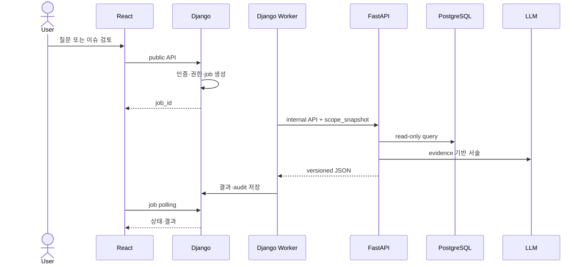

# Hotel Signal AI API·AI 통합 계약

## 결론

Browser가 호출하는 공개 backend는 Django 하나다. 비동기 기능은 Django DB job과 worker, 즉시 `job_id` 반환, React polling으로 처리한다. FastAPI는 품질 Gate·규칙 감지·Text-to-SQL·Incident 분석을 실제 실행하며 read-only analysis view와 LLM만 호출한다. 기존의 Django 통합 demo endpoint 5개와 FastAPI 미실행 계약은 폐기한다.

## 사람이 판단해야 할 사항

- [ ] API schema v0 승인
  - 권장안: 아래 endpoint, job 상태, 공통 context, query·incident 결과를 2026-07-26까지 동결한다.
  - 선택 시 영향: 중간발표 fixture를 실제 backend 응답으로 교체할 수 있다.
  - 미선택 시 영향: React·Django·FastAPI 병렬 작업이 불가능하다.

- [ ] service timeout·retry 값
  - 권장안: worker→FastAPI timeout, LLM timeout, retry 1회와 backoff를 `PROJECT_CALIBRATION`으로 둔다.
  - 선택 시 영향: 장애 반례를 재현할 수 있다.
  - 미선택 시 영향: 무한 대기·중복 실행 위험이 있다.

- [ ] 내부 인증 방식
  - 권장안: service credential과 network restriction을 모두 사용한다.
  - 선택 시 영향: browser 직접 호출과 role 위조를 차단한다.
  - 미선택 시 영향: FastAPI 내부 endpoint가 우회 경로가 된다.

## 판단 체크리스트

- [ ] 공개·내부 API의 소유자가 구분됐는가
- [ ] POST job 생성이 장시간 요청을 기다리지 않고 `job_id`를 반환하는가
- [ ] `scope_snapshot`은 Django가 서버에서 생성했는가
- [ ] SQL이 SELECT-only·allowlist·parameter binding·read-only인가
- [ ] API와 fixture가 동일한 schema를 통과하는가
- [ ] AI 수치·문장에 `evidence_id`가 있는가
- [ ] timeout·invalid JSON에서도 trigger·metric evidence가 유지되는가
- [ ] 모든 응답에 합성·demo·version이 표시되는가

## 필수 최소 기능 구현 방향

### 1. 시스템 경계



### 2. 공통 응답 envelope

```json
{
  "data": {},
  "meta": {
    "request_id": "uuid",
    "timestamp": "2026-07-20T08:00:00Z",
    "dataset_version": "gw-synthetic-1.0.0",
    "schema_version": "1.0.0",
    "generator_version": "generator-v1",
    "scenario_id": "BREAKFAST_CONGESTION",
    "seed": 20260720,
    "virtual_as_of_date": "2026-08-16",
    "data_cutoff": "2026-08-16T14:59:59Z",
    "analysis_version": "analysis-v1",
    "is_synthetic": true,
    "demo_mode": false
  },
  "error": null
}
```

```json
{
  "data": null,
  "meta": {"request_id": "uuid", "timestamp": "2026-07-20T08:00:00Z"},
  "error": {
    "code": "VALIDATION_ERROR",
    "message": "요청값을 확인하세요.",
    "details": [{"field": "question", "reason": "required"}]
  }
}
```

### 3. Django 외부 API

| ID | method·path | 권한 | 기능 |
|---|---|---|---|
| `API-001` | `POST /api/query-jobs` | 세 역할 | 질문 job 생성, `202`와 `job_id` 즉시 반환 |
| `API-002` | `GET /api/jobs/{job_id}` | job 소유·허용 scope | job 상태·query/incident 결과 polling |
| `API-003` | `GET /api/incidents` | scope별 | 이슈 목록·상태 조회 |
| `API-004` | `GET /api/incidents/{run_id}` | scope별 | trigger·이슈 브리프·evidence 조회 |
| `API-005` | `POST /api/incidents/{run_id}/field-notes` | 담당 manager·hotel manager | 현장 확인 메모 저장 |
| `API-006` | `GET /api/reports/{report_id}` | report scope | 특정 report version 조회 |
| `API-007` | `POST /api/reports/{report_id}/decision` | `HOTEL_MANAGER` | 승인·보류·반려 저장 |

최종 기획서 §11.1의 공개 API 6개에 화면설계서의 현장 확인 메모 저장 요구를 충족하는 `API-005`를 추가했다. 나머지 path와 책임은 기획서 계약을 그대로 유지한다.

중간발표 fixture는 위 endpoint 응답 형태를 그대로 사용한다. upload·dataset 전환 UI는 Baseline 공개 API에 추가하지 않고 관리 command 또는 seed job으로 준비한다.

### 4. FastAPI 내부 API

| ID | method·path | 기능 | 결정론·AI |
|---|---|---|---|
| `API-AI-001` | `POST /internal/v1/quality-gates` | batch 품질 Gate | 결정론 |
| `API-AI-002` | `POST /internal/v1/detections` | versioned rule 감지 | 결정론 |
| `API-AI-003` | `POST /internal/v1/query-runs` | query plan·SQL·표·chart·설명 | 혼합, 계산 결정론 |
| `API-AI-004` | `POST /internal/v1/incident-runs` | evidence 조사·brief·report draft | 혼합, LangGraph |
| `API-AI-005` | `GET /internal/v1/health` | service health | 결정론 |

### 5. 공통 내부 context

```json
{
  "request_id": "a2edc33e-947d-4e5e-b637-373392da3127",
  "run_id": "6be7a136-5a94-49d9-93ca-2db1498e1c66",
  "job_id": "dfbe6aa4-a1ec-427e-a2df-289466c2c869",
  "idempotency_key": "dataset:gw-synthetic-1.0.0:query:hash",
  "actor_id": "demo-fnb-001",
  "role_code": "FNB_MANAGER",
  "scope_snapshot": {
    "property_ids": ["GRAND_WALKERHILL_SEOUL"],
    "metric_groups": ["BREAKFAST", "FNB_VOC"],
    "allowed_views": ["analytics.v_breakfast_15m", "analytics.v_staff_shift", "analytics.v_voc_summary"]
  },
  "dataset_version": "gw-synthetic-1.0.0",
  "virtual_as_of_date": "2026-08-16"
}
```

FastAPI는 client가 보낸 role·scope를 받지 않는다. Django가 인증 후 저장한 snapshot만 worker가 전달한다.

### 6. Query job 계약

Request:

```json
{
  "question": "이번 주 조식 대기시간이 지난 4주보다 길어진 시간대를 보여줘",
  "dataset_version": "gw-synthetic-1.0.0"
}
```

Accepted response data:

```json
{
  "job_id": "uuid",
  "job_status": "PENDING",
  "poll_url": "/api/jobs/uuid"
}
```

Semantic query plan:

```json
{
  "intent": "compare_metric",
  "metrics": ["wait_p90_min"],
  "dimensions": ["time_bucket"],
  "period": "last_completed_week",
  "comparison": "previous_4_weeks",
  "filters": {"service_area_id": "GW_BREAKFAST_DEMO"}
}
```

Completed result:

```json
{
  "job_id": "uuid",
  "job_status": "SUCCEEDED",
  "query_run_id": "uuid",
  "query_plan": {},
  "sql_preview": "SELECT ...",
  "sql_hash": "sha256",
  "table": {"columns": [], "rows": []},
  "chart_spec": {"type": "line", "x": "bucket_start", "y": "wait_p90_min"},
  "explanation": "합성 데이터의 지난 완료 주차를 비교했습니다.",
  "evidence": [],
  "limitations": [],
  "period": {},
  "unit": "minutes",
  "sample_size": 0,
  "timezone": "Asia/Seoul",
  "data_cutoff": "ISO-8601"
}
```

### 7. SQL Guard

- SELECT-only, single statement
- schema·view·column allowlist
- parameter binding, row limit, statement timeout
- FastAPI read-only DB role
- `scope_snapshot`과 `role_scope` 이중 검사
- `metric_catalog.additive=false`의 금지 grain 재집계 차단
- raw SQL 사용자 입력 실행 금지
- plan·SQL hash·row count 감사 기록

권한·단위·grain 검증 실패 시 SQL을 실행하지 않는다.

### 8. 품질 Gate 계약

Request data:

```json
{
  "dataset_version": "gw-synthetic-1.0.0",
  "gate_version": "dq-v1"
}
```

Response data:

```json
{
  "job_status": "SUCCEEDED",
  "gate_status": "PASSED",
  "checks": [
    {"check_id": "DQ-PK-001", "status": "PASSED", "violation_count": 0}
  ],
  "limitations": []
}
```

필수 bucket 누락·단위 불일치·핵심 정합성 실패는 `gate_status=NEEDS_DATA`이며 detection을 호출하지 않는다.

### 9. Detection 계약

```json
{
  "rule_id": "RULE-001",
  "rule_version": "rule-v1",
  "calibration_label": "PROJECT_CALIBRATION",
  "triggered": true,
  "observed_window": {},
  "comparison_window": {},
  "observed_values": [],
  "thresholds": [],
  "minimum_sample_size": 0,
  "incident_candidate_id": "uuid",
  "evidence_ids": []
}
```

LLM은 이 응답을 생성·수정하지 않는다.

### 10. Incident·AI 출력 계약

```json
{
  "analysis_run_id": "uuid",
  "job_status": "SUCCEEDED",
  "incident_status": "READY_FOR_REVIEW",
  "detection_summary": {},
  "observed_facts": [],
  "cause_candidates": [],
  "supporting_evidence": [],
  "counter_evidence": [],
  "missing_data": [],
  "recommended_checks": [],
  "response_options": [],
  "limitations": [],
  "evidence_ids": [],
  "report_draft": {},
  "model_version": "",
  "prompt_version": "",
  "analysis_version": "analysis-v1"
}
```

AI 금지:

- 원인을 확정하는 표현
- evidence ID 없는 수치·사실
- 실제 호텔 문제·성과 주장
- trigger 판정·KPI 계산
- 자동 보상·고객 응답·인력 배치 결정
- 개인정보와 prompt instruction 실행

### 11. Field note 계약

Request:

```json
{
  "verification_status": "PARTIALLY_CONFIRMED",
  "note": "합성 시나리오 기준으로 피크 시간대 안내 동선을 추가 확인함",
  "expected_note_version": 0
}
```

Response data:

```json
{
  "field_note_id": "uuid",
  "analysis_run_id": "uuid",
  "verification_status": "PARTIALLY_CONFIRMED",
  "note_redacted": "합성 시나리오 기준으로 피크 시간대 안내 동선을 추가 확인함",
  "note_version": 1,
  "created_at": "ISO-8601 UTC",
  "updated_at": "ISO-8601 UTC"
}
```

허용 상태는 `CONFIRMED`, `PARTIALLY_CONFIRMED`, `UNCONFIRMED`, `DISPUTED`다. Django가 actor·scope·version을 검사하고 PII pattern을 차단·마스킹한다.

### 12. Report 계약

```json
{
  "report_id": "uuid",
  "report_version": 1,
  "report_status": "DRAFT",
  "virtual_week_id": "2026-W33",
  "sections": {
    "summary": [],
    "key_incidents": [],
    "positive_voc": [],
    "evidence": [],
    "cause_candidates": [],
    "counter_evidence": [],
    "field_checks": [],
    "limitations": []
  },
  "evidence_ids": [],
  "is_synthetic": true
}
```

Decision request:

```json
{
  "report_version": 1,
  "decision": "ON_HOLD",
  "comment": "현장 확인 메모 보완 필요"
}
```

`HOTEL_MANAGER`만 decision을 제출한다. `ON_HOLD` 보완 후에는 같은 version을 덮어쓰지 않고 새 DRAFT version을 만든다.

### 13. 오류 코드

| code | HTTP | 처리 |
|---|---:|---|
| `VALIDATION_ERROR` | 400 | 필드 오류 표시 |
| `AUTHENTICATION_REQUIRED` | 401 | 로그인 요구 |
| `FORBIDDEN_SCOPE` | 403 | SQL 미실행·허용 범위 안내 |
| `NOT_FOUND` | 404 | 권한 밖 객체도 상세 노출 금지 |
| `VERSION_CONFLICT` | 409 | 최신 report·dataset 재조회 |
| `DATA_QUALITY_FAILED` | 422 | `NEEDS_DATA`, 감지 중단 |
| `UNSUPPORTED_QUERY` | 422 | 지원 의도 제안 |
| `UPSTREAM_TIMEOUT` | 504 | 제한된 retry, 최종 상태 저장 |
| `AI_OUTPUT_INVALID` | 502 | 1회 재생성 후 `PARTIAL` |
| `INTERNAL_ERROR` | 500 | request ID 제공, 내부 상세 미노출 |

### 14. timeout·retry·idempotency

- HTTP request는 job 생성 후 즉시 반환한다.
- worker→FastAPI와 FastAPI→LLM timeout은 versioned calibration이다.
- retry는 1회를 기본 권장하며 `idempotency_key`가 있을 때만 수행한다.
- 무한 retry·무한 polling 금지
- LLM 실패 시 metric·trigger·evidence 보존, 설명·report 문장만 `PARTIAL`
- 동일 batch의 incident·report는 unique idempotency key로 한 건만 저장

### 15. version 계약

```text
dataset_version
schema_version
generator_version
scope_version
metric_catalog_version
rule_version
gate_version
analysis_version
model_version
prompt_version
template_version
report_version
```

각 consumer는 알 수 없는 major schema version을 조용히 처리하지 않고 명시적으로 거부한다.

## 확장 방향

- P1: 보장 질문 확대, server-sent progress, Celery·Redis는 측정 후 검토
- P2: 실제 read-only data adapter, SSO, 운영 rate limit·observability 강화
- 제외: Browser→FastAPI 직접 호출, raw SQL endpoint, 범용 MCP server, 자동 조치 API

## 변경 이력

| version | date | 변경 |
|---|---|---|
| `2.0` | 2026-07-20 | Django 공개 7개·FastAPI 내부 5개 API, job+polling, Text-to-SQL·Incident·report schema로 재작성 |
