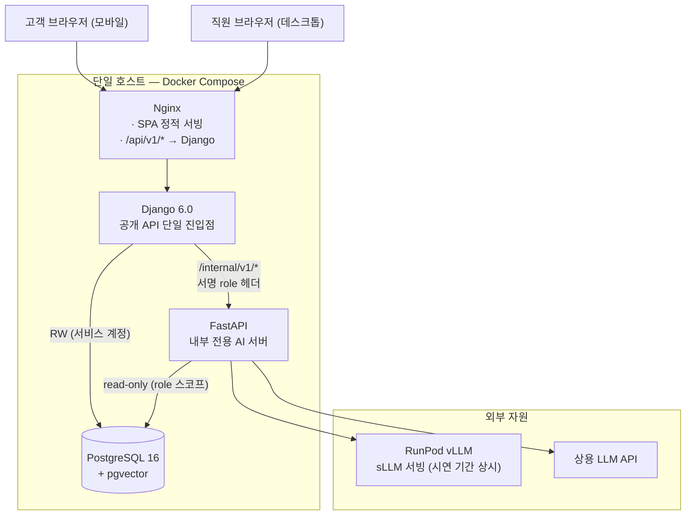
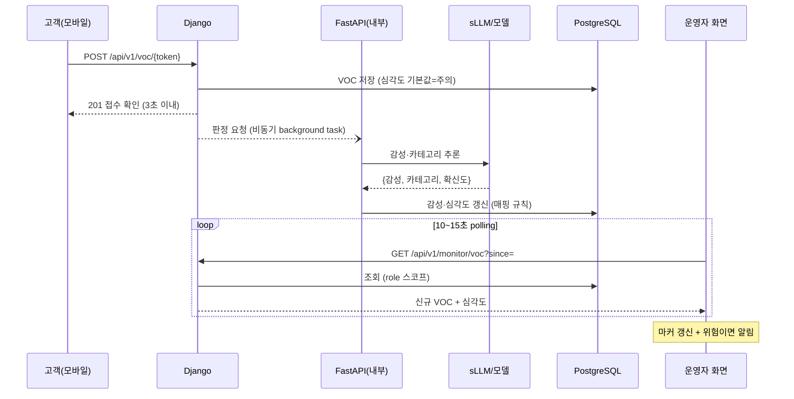
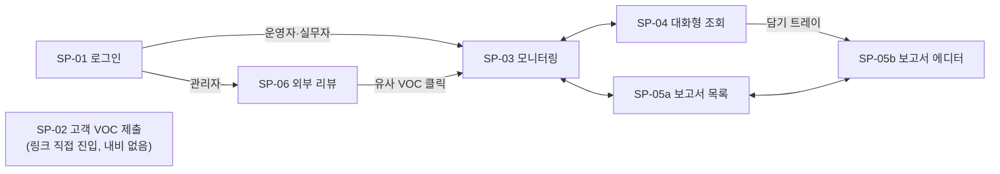
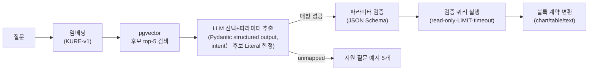
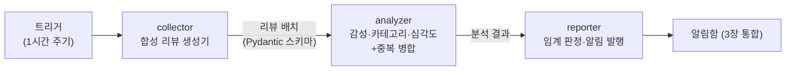
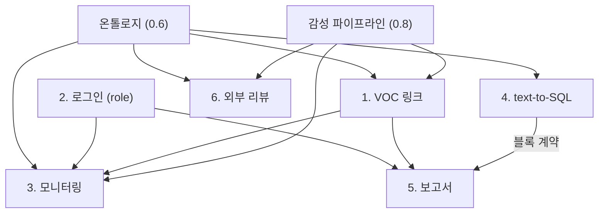

# SensePlace 기능 명세서

| 항목 | 내용 |
|---|---|
| 문서 설명 | SensePlace의 기능 6개와 공통 설계(아키텍처·기술 스택·온톨로지·합성 데이터·모델 전략), 화면 설계, 검토·검증 결과를 정의한 기능 명세서 |
| 문서 분류 | 일반 문서 |
| 버전 | v1.2 |
| 문서 기준일 | 2026-07-23 |
| 작성·수정 | 윤대성 (Claude 초안) |

## 서비스 개요

SensePlace는 호텔 리조트 단지의 고객 VOC(Voice of Customer)를 수집·분석하고, 지도 기반 실시간 모니터링·대화형 조회·보고서 작성으로 이어주는 운영 지원 서비스다.

- 대상 공간: 워커힐 단지 전역의 시설 15곳 내외(객실동·다이닝·레저·MICE·인프라).
- 데이터: 실데이터 확보 전이므로 전량 합성 데이터를 사용하며, 모든 화면·산출물에 합성 표시를 한다.
- 시연 목표: 고객이 링크로 VOC를 실시간 제출하면 15초 안에 운영자 지도에 반영되는 것을 라이브로 보여준다.
- 문서 범위: 기능·기술 설계·화면 설계. 데이터 모델·스키마(테이블·컬럼)는 별도 스키마 설계 문서에서 다룬다.

용어

| 용어 | 정의 |
|---|---|
| VOC | 고객이 남긴 불편·요청 텍스트 1건 |
| 감성 | 긍정/부정/중립 3분류. 모델이 판정 |
| 심각도 | 정상/주의/위험 3단계. 감성×카테고리 매핑으로 산정 |
| incident | VOC 1건에 대한 대응 티켓(접수→확인→진행중→완료) |
| 온톨로지 | 장소·카테고리·판정을 잇는 공통 어휘 체계(0.6) |
| 블록 계약 | 대화형 조회 결과를 보고서 블록으로 전달하는 공용 JSON 규격(4.2) |

---

## 0. 공통 설계

### 0.1 아키텍처

**시스템 구성도 (배포 관점)** — 단일 호스트 Docker Compose 5개 컨테이너 + 외부 자원 2종.



**역할 분담 (논리 관점)** — 요청은 언제나 `브라우저 → Nginx → Django`로 들어오고, AI 처리가 필요한 것만 Django가 FastAPI로 위임한다.

```mermaid
flowchart LR
    subgraph FE["Frontend (React 19 + Vite + TS)"]
        direction TB
        f1["TanStack Query — polling·캐시"]
        f2["Leaflet — 변형 가이드맵"]
        f3["BlockNote — 보고서 에디터"]
        f4["Recharts — 차트"]
    end
    subgraph D["Django — 도메인·게이트웨이"]
        direction TB
        d1["인증·세션·role"]
        d2["VOC·incident·근무표·알림"]
        d3["보고서 저장·목록"]
        d4["AI 요청 게이트웨이"]
        d5["admin — 카탈로그·온톨로지 관리"]
        d6["background tasks — 스케줄"]
    end
    subgraph F["FastAPI — AI 전용 (내부망)"]
        direction TB
        a1["감성·심각도 판정"]
        a2["text-to-SQL (방식 B)"]
        a3["보고서 자동 채움·LLM 초안"]
        a4["LangGraph — 리뷰 파이프라인"]
        a5["임베딩 (KURE-v1)"]
    end
    FE -->|"REST /api/v1/*"| D
    D -->|"위임"| F
```



구조 결정과 근거
- **공개 진입점은 Django 하나다.** 프런트는 FastAPI의 존재를 모른다. 대화형 조회(`/api/v1/agent/query`)도 Django가 받아 내부(`/internal/v1/*`)로 위임한다. 이렇게 해야 "인증은 Django만 안다"가 예외 없이 성립한다 — 프록시가 FastAPI로 직접 분기하는 구조는 FastAPI에 세션 검증을 요구하게 되어 배제했다.
- 위임 호출에는 서명(HMAC) role 헤더를 붙인다. FastAPI는 서명 검증만 하고 세션·비밀번호를 만지지 않는다.
- 쓰기 경계: 도메인 데이터 쓰기는 Django만. FastAPI는 read-only 연결과 자기 소유 산출물(판정 결과·보고서 초안 내용)만 쓴다.
- 게이트웨이 경유 오버헤드(내부 1 hop)는 이 규모에서 무시 가능하며, 대화형 조회의 지연 예산(5초)에서 LLM 호출이 지배적이다.
- 오류 응답은 전 API 공통 envelope: `{"error": {"code", "message", "detail"}}`.
- 판정·계산은 SQL/코드가 수행하고 LLM은 자연어 해석과 결과 표현만 담당한다.
- 축소 경로: 2서버 유지가 부담이면 FastAPI 기능을 Django async view로 이관한다(게이트웨이 구조라 프런트 변경 없음). 2단계 착수 전 1회 점검.

### 0.2 VOC 실시간 처리 흐름

시연의 핵심 컷이자 대표 데이터 흐름이다.



- 저장(동기)과 판정(비동기)을 분리해 "3초 내 접수 확인"이 모델 추론 지연에 영향받지 않게 한다.
- 판정 전 기본 심각도는 주의(보수적) — 놓침 방지. 판정 완료 시 다음 polling에서 자연 갱신된다.

### 0.3 기술 스택과 선정 근거

기술은 필요가 입증된 곳에만 적용한다.

| 영역 | 선택 | 근거 |
|---|---|---|
| Frontend | React 19 + Vite + TypeScript + Tailwind CSS v4 | 전 화면이 내부 대시보드이고 공개 화면(VOC 링크)도 검색 노출 불필요 — SSR 이점 없음. 정적 서빙으로 배포 단순. 구조화 응답·블록 JSON 타입 안정성 위해 TS |
| 차트 | Recharts | 조회 차트·보고서 차트 블록 공용. PDF용 SVG→PNG 변환 병행 |
| 서버 상태 | TanStack Query v5 | polling·캐시·낙관적 업데이트 일원화(0.5) |
| 지도 | Leaflet (CRS.Simple + ImageOverlay) | 변형 가이드맵 위 마커·줌·팬·팝업. 타일 서버 불필요(3.2) |
| 에디터 | BlockNote | 순서 기반 블록·드래그·드롭 가이드 내장(5.2) |
| Backend (도메인·게이트웨이) | Django 6.0 | 인증·세션·ORM + admin으로 카탈로그·온톨로지·근무표 관리 화면 무상 확보. background tasks를 판정 위임·6장 트리거에 사용 |
| Backend (AI) | FastAPI + Pydantic v2 | async LLM 호출, structured output 스키마 강제 |
| DB | PostgreSQL 16+ / pgvector | 단일 DB + 확장으로 벡터 검색(4·6장). 별도 VectorDB 서버 불필요 |
| LLM | 로컬 sLLM 학습 + 상용 API 비교 채택 | 0.8 |
| 오케스트레이션 | LangGraph (6장 한정) | 4·5장은 단일 호출이라 미적용 |
| 배포 | Docker Compose 단일 호스트 + RunPod(학습·서빙) | 팀 규모에 맞는 최소 인프라. Kubernetes 미적용 |

단계적 결정 항목 — 지금 결정하지 않아도 1단계 구현(폴링·세션 쿠키·규칙 기반 생성)이 유효하도록 설계한다.

| 항목 | 결정 시점 | 판단 기준 |
|---|---|---|
| 세션 vs JWT | 배포 구조 확정 시 | 게이트웨이 구조 유지 시 세션으로 충분. FastAPI 직접 노출로 바뀌면 JWT |
| SSE vs WebSocket | 확장 범위 확정 시 | 양방향 요구(지원핑 등) 생기면 WebSocket, 단방향뿐이면 SSE |
| SDV(통계적 합성) | 스키마 확정 후 | 수치 시계열의 컬럼 간 상관을 규칙 기반으로 감당 못할 때 |

### 0.4 인증·권한

- role 기반 접근 제어. 분석·조회 쿼리는 role 스코프의 read-only DB 연결로 실행해 권한 밖 접근을 DB 단계에서 차단한다.
- 역할 체계 3요소: 역할 코드 + 권한 범위 + 담당 구역(온톨로지 구역 단위). 구역 담당자는 자기 구역 VOC만 처리 권한을 갖는다.
- 고객 VOC는 로그인 없이 링크 토큰만으로 접근.
- 비밀번호는 해시만 저장, 인증 토큰류 DB 미저장.
- 감사 로그: 로그인 성공·실패, 상태 변경, 대화형 조회 실행, 보고서 확정을 공통 기록. 테스트 보고서 근거 자료 겸용.

### 0.5 서버 상태 관리 (TanStack Query v5)

서버 데이터는 전부 TanStack Query 캐시가 소유하고 컴포넌트는 fetch를 직접 하지 않는다. queryKey는 `[도메인, 리소스, 파라미터]`, 무효화는 도메인 prefix 단위.

| 기능 | 방식 | 핵심 설정 |
|---|---|---|
| 내 정보(2장) | `useQuery(['auth','me'])` | `staleTime: Infinity`, 로그아웃 시 캐시 전체 clear |
| 모니터링(3장) | `useQuery(['monitor','voc',filters])` | `refetchInterval: 10~15s`, 탭 비활성 시 자동 중단. SSE 전환 시 훅 내부만 교체 |
| 상태 변경(3장) | `useMutation` + 낙관적 업데이트 | `onMutate` 선반영, `onError` 롤백+안내 |
| 근무표(3장) | `useQuery(['schedule',...])` | `staleTime: 1h` |
| 대화형 조회(4장) | `useMutation`, 결과를 `['agent','result',id]`에 저장 | 담기·서랍 드래그 시 재사용 |
| 보고서(5장) | 블록은 에디터 지역 상태, 저장만 `useMutation`(30s debounce) | 블록 새로고침은 개별 mutation |
| 외부 리뷰(6장) | `useQuery(['ext-reviews',filters])` | polling 60s |

UI 상태(모달·필터·드래그 중)는 컴포넌트 지역 상태로 처리한다.

### 0.6 온톨로지

시설·VOC·심각도 판정을 잇는 공통 어휘 체계. 저장은 RDB 계층·코드 구조(스키마 문서), 관리는 Django admin. GraphDB는 다단계 관계 탐색 질의가 실제 요구로 등장할 때만 재검토한다.

**1) 장소 축** — 단지 > 구역 > 시설 3계층.

| 구역 | 시설 | 비고 |
|---|---|---|
| 객실동 | 그랜드 워커힐, 비스타 워커힐, 더글라스 하우스, 애스톤 하우스 | 객실 VOC는 동 단위 접수 |
| 다이닝 | 피자힐, 명월관 | |
| 레저·웰니스 | 리버파크, 테네즈 파크, 포레스트 파크, 힐링 포레스트, 더글라스 가든, 워커힐 골프클럽 | 계절 운영 시설은 운영 기간 속성 보유 |
| MICE·엔터 | 컨벤션 센터, 빛의 시어터, Casino | |
| 인프라 | 주차타워, South/East Gate | 이동·주차 VOC 접수처 |

**2) VOC 카테고리 축** — 청결·위생 / 안전 / 대기·혼잡 / 직원 서비스 / 시설 고장 / 소음 / 온도·환경 / 가격·결제 / 예약·안내. 최종 목록은 합성 데이터 생성 전 확정.

**3) 판정 축** — 감성 × 카테고리 가중 → 심각도(0.8).

공유처: 1장 장소 선택(구역→시설 2단), 3장 지도 구역 필터·집계, 4장 질의 해석("다이닝 쪽 불만"→다이닝 시설 집합), 5장 보고서 구역 섹션, 6장 리뷰 카테고리 라벨. 한 곳에서 정의하고 다섯 기능이 공유하는 것이 도입 이유다.

### 0.7 합성 데이터 원칙

- 모든 합성 데이터에 synthetic 표시·생성 seed·스키마 버전 기록, 화면·보고서에도 합성 표시.
- VOC·리뷰 텍스트는 LLM 생성 + 라벨(감성·카테고리) 동시 생성. 장소·카테고리·감성·문체·길이 조건 조합으로 다양성 확보. 생성 후 임베딩 유사도 중복 제거·규칙 검사.
- 감성 모델 평가는 합성 테스트셋 외에 공개 한국어 리뷰 데이터(NSMC 등)를 보조 평가셋으로 병용 — LLM 생성 문장을 LLM 계열이 분류하는 순환 평가 착시 점검.
- 수치 시계열은 규칙 기반(seed 고정). SDV는 0.3 기준으로 스키마 확정 후 판단.
- 상세 규모·분포는 스키마 확정 후 별도 문서.

### 0.8 ML/DL/sLLM 전략 — 감성분석 중심

학습 태스크는 **감성분석: VOC/리뷰 텍스트 → 긍정/부정/중립 3분류**. 학습 과정을 기록하고 동일 조건 성능 비교 후 우수한 모델(상용 API 포함)을 서비스에 채택한다.

심각도는 별도 모델 없이 `감성 × 카테고리` 매핑으로 산정한다. 매핑표는 온톨로지와 함께 관리해 규칙 변경이 코드 배포 없이 가능하다.

```
부정 × (안전 | 청결·위생)   → 위험
부정 × 그 외                → 주의   (확신도 낮으면 주의로 상향하는 보수 판정)
중립 × 임의                 → 정상~주의 (카테고리 가중)
긍정 × 임의                 → 정상
```

#### 1) ML baseline

- TF-IDF(char 2~5gram + word 1~2gram) → Logistic Regression, 비교로 LightGBM. scikit-learn.
- 데이터: 합성 라벨 train 70 / val 15 / test 15 (stratified, seed 고정).
- 목적: 하한선. 이후 모든 모델은 이 baseline을 유의미하게 이겨야 채택 후보가 된다.

#### 2) DL fine-tuning 후보

| 후보 | 계열 | 특징 | 역할 |
|---|---|---|---|
| **KcELECTRA-base** | ELECTRA | 댓글 데이터 사전학습 — 구어체·오탈자·노이즈(VOC와 동일 성격)에 강함 | **주력** |
| KLUE-RoBERTa-base | RoBERTa | 정제 말뭉치 표준 모델 | 비교군(정제 텍스트 기준선) |
| KF-DeBERTa-base | DeBERTa-v2 | 범용+금융 말뭉치. 범용 평가에서도 KLUE-RoBERTa 대비 평균 2%+ 우위 보고 | 비교군(성능 상한 도전) |
| KoELECTRA-base | ELECTRA | 보편적 베이스라인, 자료 풍부 | 예비 |

- 학습 설정: max_len 256, batch 32, lr 2e-5~5e-5, 3~5 epochs, early stopping(val macro-F1), 중립 클래스 가중 조정 실험. RunPod RTX 4090 1장, 수 시간 이내.
- 진행: 주력+비교군 2종까지 3종 학습해 비교표를 만든다.

#### 3) sLLM 후보 (QLoRA instruction tuning)

태스크: 감성+카테고리+심각도 후보를 한 번에 내는 멀티태스크 instruction(JSON 출력 강제). 4장 intent 분류도 같은 모델의 태스크로 포함.

| 후보 | 규모 | 라이선스 | 강점 | 약점 | 역할 |
|---|---|---|---|---|---|
| **A.X 4.0 Light** (SKT) | 7B급 | Apache 2.0 | Qwen2.5 기반+대규모 한국어 추가 학습, KMMLU 78.3으로 GPT-4o(72.5) 상회 보고. 워커힐이 SK 계열이라 도메인 스토리 정합 | 공개 최근, 레퍼런스 적음 | **주력 파일럿 1** |
| **Kanana-1.5 8B** (카카오) | 8B | Apache 2.0 | 상업 자유, instruct 제공, 함수 호출·JSON 출력 강화. Kanana-2로 계열 지속 발전 | 후보 중 서빙 비용 최대 | **주력 파일럿 2** |
| **Mi:dm 2.0 Mini** (KT) | 2.3B | **MIT** | 후보 중 가장 자유로운 라이선스. 초경량 — 저비용 서빙·빠른 실험. Base 11B 상향 여지 | 소형이라 멀티태스크 한계 가능 | **경량 주력 후보** |
| EXAONE 3.5 2.4B / 4.0 (LG) | 2.4B~ | 연구·교육 한정 | 한국어 벤치마크 최상위권 | 상업 별도 계약 — 서비스 전환 시 걸림 | 성능 비교군 |
| HyperCLOVA X SEED 1.5B (네이버) | 1.5B | 자체(조건부) | 초경량, 한국어 자연스러움 | 소형 한계, 라이선스 조건 확인 필요 | 경량 비교군 |
| Solar Open 2 (업스테이지) | 중형 | Upstage Solar License(상업·파생 허용) | 에이전트 특화, 테크 리포트 공개 | 한국어 특화도 검증 필요 | 예비 |
| Qwen3 8B (Alibaba) | 8B | Apache 2.0 | 글로벌 생태계 최대, 튜닝 자료 풍부 | 한국어 뉘앙스 열세 보고 | 글로벌 기준선 |

- 진행: **파일럿(합성 500건 zero/few-shot)으로 A.X 4.0 Light vs Kanana-1.5 8B vs Mi:dm 2.0 Mini 비교** → 주력 1개(7~8B급)+경량 1개(2~3B급) 확정 → 본 학습(QLoRA)은 이 2종만. 7종 전부 fine-tune하지 않는다.
- 경량 모델을 따로 두는 이유: 시연 상시 서빙 비용 절감 + "작은 모델로 충분한가" 비교 축 확보.
- RunPod 학습: QLoRA 4bit — 7~8B가 RTX 4090 24GB(시간당 약 $0.7~0.8)에서 학습 가능. LoRA r=16, α=32, lr 1e-4~2e-4, 2~3 epochs, instruction 3천~5천 건 기준 회당 2~4시간. 2.3B급은 1시간 내외.
- 서빙: vLLM + LoRA 어댑터(베이스 공유, 어댑터 교체 용이). 시연 기간만 상시 pod, 평시 중지.
- 기록: 실험별 base model·데이터 버전·하이퍼파라미터·macro-F1을 실험 대장으로 남긴다.

#### 4) 임베딩 모델 후보

| 후보 | 차원/규모 | 특징 | 역할 |
|---|---|---|---|
| **KURE-v1** (고려대) | base급 | 한국어 검색 특화, Korean-MTEB 상위권, 장문 검색 강점 | **주력** |
| Qwen3-Embedding 0.6B | 0.6B | 2026 공개, Korean-MTEB 10위권, 다국어 100+, 경량 | 비교군(최신·경량) |
| KoE5 | base급 | multilingual-e5 한국어 파인튜닝 | 예비 |
| BGE-M3 | 1024차원 | 다국어·8K 컨텍스트·dense/sparse 겸용 | 다국어 확장 대비 |

- 용도: 4장 검증 쿼리 후보 검색, 6장 중복 제거·유사 VOC 검색, 합성 데이터 중복 제거.
- 파일럿: 카탈로그 20개×변형 질문 100개로 top-5 recall을 재 KURE-v1 vs Qwen3-Embedding 비교 후 확정.

#### 5) 상용 API 비교·채택

- 동일 테스트셋 zero/few-shot으로 상용 API 평가, `baseline < DL/sLLM ≤ 상용` 확인 후 최종 채택 결정. 지표는 held-out macro-F1로 통일.
- 서비스에는 판정 주체(rule/ml/dl/sllm/llm_api)를 기록해 추적 가능하게 한다.
- 규칙(rule) 판정은 1단계 임시 방편, 2단계에서 모델 판정으로 교체.

### 0.9 화면 설계 공통 규칙

화면 목록과 이동 흐름



| 항목 | 규칙 |
|---|---|
| 내비게이션 | 직원 화면 상단 고정 바: 모니터링 / 대화형 조회 / 보고서 / 외부 리뷰(관리자) + 우측 사용자 메뉴(이름·role 뱃지·로그아웃). role에 없는 메뉴는 렌더하지 않음. 고객 화면(SP-02)은 내비 없음 |
| 합성 표시 | 모든 직원 화면 우상단에 `합성 데이터 v{버전}` 뱃지 상시 표시. 고객 화면은 헤더에 데모 표시 |
| 심각도 색 | 위험=red-600 ●, 주의=amber-500 ◐, 정상=emerald-500 ○. **색+아이콘(모양) 병용** — 색만으로 구분하지 않는다(색각 대응) |
| 상태 색 | 접수=slate-400, 확인=blue-500, 진행중=violet-500, 완료=emerald-600. 뱃지 형태 통일 |
| 시간 표기 | 24시간 이내 상대시간("3분 전") + 툴팁 절대시각(KST `MM/DD HH:mm`). 그 외 절대시각 |
| 로딩 | 화면 최초 로딩은 스켈레톤, 액션 진행은 버튼 내 스피너. 전체 화면 스피너 금지 |
| 오류 | 폼 오류는 필드 하단 인라인, 액션 실패는 토스트(4초), 연결·세션 문제는 상단 배너(지속) |
| 모달 | 파괴적·비가역 액션(보고서 확정, 로그아웃)에만 확인 모달. 그 외 모달 지양 |
| 반응형 | 직원 화면 기준 1280px+, 1024~1279px에서 좌측 패널 접힘(아이콘 바), 1024px 미만 미지원 안내. 고객 화면 360px 모바일 우선, 데스크톱 중앙 480px 카드 |
| 키보드 | 폼 Enter 제출, 모달 Esc 닫기, 대화형 조회 입력창 `/` 포커스 단축키 |
| 빈 상태 | 모든 목록은 빈 상태 문구+다음 행동 안내를 정의한다(각 화면 절 참조) |

---

## 1. 고객 데이터 — 예약 연동 VOC 수집 링크

호텔이 예약별 개별 링크를 고객에게 보내고, 고객은 로그인 없이 그 링크로 VOC를 남긴다. 제출된 VOC는 실시간으로 모니터링과 보고서로 이어진다. 실시간 제출 흐름 그대로 시연하는 것을 목표로 한다.

### 1.1 기능 명세

사용자 스토리
- 고객으로서, 받은 링크를 열면 로그인 없이 내 예약에 대한 불편을 남기고 싶다.
- 호텔 운영자로서, 고객이 남긴 VOC를 예약 정보와 함께 실시간으로 확인하고 싶다.

수용 기준
- 예약 1건마다 고유 토큰이 발급되고 `도메인/voc/{token}` 형태 링크로 접근한다.
- 링크를 열면 예약 요약(객실·투숙 기간)과 VOC 입력창이 나타난다.
- 장소 선택은 온톨로지 2단(구역 → 시설). 객실 VOC는 객실동 단위 선택.
- 제출하면 3초 안에 저장되고 접수 확인 문구가 뜬다. 감성·심각도는 제출 직후 비동기 산정(0.2).
- 제출된 VOC는 다음 polling 주기(15초 이내)에 모니터링 지도에 반영된다.
- 토큰은 체크아웃 당일 24:00(KST) 이후 만료. 만료 토큰은 조회·제출 모두 차단되고 만료 안내가 뜬다.
- 같은 토큰으로 여러 건 제출 가능하되 60초 간격 제한. 실패 시 입력 유지+재시도 버튼.
- 모바일 뷰포트(360px)에서 깨짐 없이 동작한다.

### 1.2 기술 설계 (Django 담당)

- 토큰: `secrets.token_urlsafe(32)` 무작위 43자, 만료 시각 보유. 상태 확인이 DB 조회이므로 서명 토큰(JWT) 불사용.
- API
```
GET  /api/v1/voc/{token}  → 200 {예약 요약, 온톨로지 장소 트리} / 410 expired / 404
POST /api/v1/voc/{token}  {place_code, text}
     → 201 {voc_id} / 400 검증 실패 / 429 / 410 / 404
```
- 제출 처리: 저장 후 즉시 201 반환, 감성·심각도는 비동기 산정 후 갱신(기본값 주의).
- 안전: 입력 1,000자 제한, `nh3`로 HTML 태그 제거, React 기본 이스케이프 출력, rate limit(토큰당 1분 1회 + IP 분당 10회), 실패 응답에 예약 정보 미노출.
- 시연 운영: 준비된 토큰 N개+사전 점검 스크립트로 리허설. 리허설에서 제출→지도 반영 15초 초과 또는 오류 재현 시, 제출 화면은 유지하되 제출값을 시연 전용 저장소에 분리 적재하는 절충안으로 전환하고, 그마저 어려우면 사전 적재 데이터 재생으로 전환한다.

### 1.3 화면 설계 — SP-02 고객 VOC 제출

| 항목 | 내용 |
|---|---|
| 목적 | 고객이 30초 안에 불편 1건을 남기게 한다 |
| 진입 | 문자·알림톡 링크 `도메인/voc/{token}` (내비 없음, 직접 진입) |
| 접근 | 비로그인. 유효 토큰만 |
| 기준 해상도 | 360~430px 모바일 우선, 데스크톱 중앙 480px 카드 |

레이아웃 (단일 컬럼: 헤더 / 예약 카드 / 폼 / 버튼)

```
┌─────────────────────────────────┐
│  SensePlace · 고객의 소리  [데모] │
├─────────────────────────────────┤
│  ▣ 내 예약                      │
│  그랜드 워커힐 · 객실 1203       │
│  07/23(목) ~ 07/25(토) · 2박     │
├─────────────────────────────────┤
│  어떤 점이 불편하셨나요?         │
│  ┌─────────────────────────────┐ │
│  │ (자유 입력)                 │ │
│  │                       0/1000│ │
│  └─────────────────────────────┘ │
│  장소                            │
│  [ 다이닝      ▼ ]               │
│  [ 피자힐      ▼ ]               │
│                                 │
│  [        제출하기        ]      │
└─────────────────────────────────┘
```

구성 요소

| 요소 | 동작·규칙 | 데이터 |
|---|---|---|
| 예약 요약 카드 | 읽기 전용. 시설명·객실·기간 표시 | `GET /voc/{token}` |
| 텍스트 영역 | 1~1,000자. 카운터 실시간. 공백만 입력 시 제출 불가 | — |
| 구역 셀렉트 | 온톨로지 구역 5종 | 장소 트리 |
| 시설 셀렉트 | 구역 선택 시 활성화, 해당 구역 시설만. 객실동 선택 시 동 4곳 노출 | 장소 트리 |
| 제출 버튼 | 텍스트+시설 선택 완료 시 활성. 제출 중 스피너+비활성(중복 방지) | `POST /voc/{token}` |

상태 정의

| 상태 | 화면 |
|---|---|
| 로딩 | 예약 카드·폼 스켈레톤 |
| 만료(410) | 폼 대신: "링크가 만료되었습니다. 도움이 필요하시면 프런트데스크(내선 0)로 연락해 주세요." |
| 무효(404) | "유효하지 않은 링크입니다." |
| 제출 완료 | 체크 아이콘 + "접수되었습니다. 감사합니다." + [추가로 남기기](폼 초기화 재표시) |
| 제출 실패(네트워크) | 입력 유지, 상단 오류 배너 + [다시 시도] |
| 재제출 제한(429) | "잠시 후 다시 시도해 주세요" + 남은 초 카운트다운, 버튼 비활성 |

인터랙션: 구역 변경 시 시설 선택 초기화. 제출 성공 시 스크롤 최상단. 뒤로가기로 완료 화면→폼 복귀 시 빈 폼.

---

## 2. 로그인 — 역할 기반 접근

직원이 role로 로그인하면 role에 따라 볼 수 있는 화면과 데이터가 정해진다. 이 role을 모니터링 권한과 보고서 템플릿 매핑이 그대로 사용한다.

### 2.1 기능 명세

사용자 스토리
- 직원으로서, 내 계정으로 로그인하면 내 역할에 맞는 화면만 보고 싶다.

수용 기준
- 로그인 성공 시 role/shift가 세션에 저장되고 프런트는 `me` 조회로 메뉴를 구성한다.
- 권한 밖 화면은 메뉴에서 숨기고 URL 직접 접근도 403 화면으로 막는다(이중 방어).
- 5회 연속 실패 시 5분 잠금, 남은 시간 안내.
- 세션 12시간 유효, 브라우저 종료 시 만료(교대 근무 반영). 로그아웃 시 즉시 만료.

### 2.2 기술 설계

- Django 세션+CSRF. 게이트웨이 구조(0.1)에서는 세션으로 충분하며, JWT 전환이 결정되어도 auth 모듈만 교체되도록 국소화한다.
- API
```
POST /api/v1/auth/login   → 200 {role, shift, zone} / 401 {남은 시도} / 423 {잠금 해제 시각}
POST /api/v1/auth/logout  → 204
GET  /api/v1/auth/me      → 200 {name, role, shift, zone, allowed_reports} / 401
```

### 2.3 화면 설계 — SP-01 로그인

| 항목 | 내용 |
|---|---|
| 목적 | 직원 인증 후 role 기본 화면으로 보낸다 |
| 진입 | 직원용 루트 URL. 세션 만료 시 리다이렉트 |
| 기준 해상도 | 데스크톱 중앙 400px 카드 |

```
┌───────────────────────────────┐
│           SensePlace          │
│      호텔 운영 지원 서비스      │
│                               │
│  아이디                        │
│  [_________________________]  │
│  비밀번호                   👁 │
│  [_________________________]  │
│                               │
│  [         로그인         ]    │
│                               │
│  ⚠ 아이디 또는 비밀번호가      │
│    올바르지 않습니다 (3/5)     │
└───────────────────────────────┘
```

구성 요소

| 요소 | 동작·규칙 | 데이터 |
|---|---|---|
| 아이디·비밀번호 | 필수. 비밀번호 표시 토글(👁). Enter 제출 | — |
| 로그인 버튼 | 두 필드 입력 시 활성. 진행 중 스피너 | `POST /auth/login` |
| 오류 영역 | 인라인. 실패 시 남은 시도 횟수(401 응답값) 표시 | 401 응답 |

상태 정의

| 상태 | 화면 |
|---|---|
| 실패(401) | "아이디 또는 비밀번호가 올바르지 않습니다 (n/5)" |
| 잠금(423) | 폼 비활성 + "잠시 후 다시 시도해 주세요 — 4:32 남음" 카운트다운, 0이 되면 자동 활성 |
| 세션 만료 후 진입 | 상단 배너 "세션이 만료되었습니다. 다시 로그인해 주세요." |

이동: 성공 시 운영자·실무자→SP-03, 관리자→SP-06(또는 최근 화면). 이미 로그인 상태로 진입 시 기본 화면으로 즉시 리다이렉트.

---

## 3. 실시간 모니터링

지도 위에서 VOC 발생을 팝업으로 보고, 심각도에 따라 알림을 받고, 현장 대응 진행을 추적한다. 실시간 위치추적은 넣지 않으며 근무는 정적 근무표로만 표시한다.

### 3.1 기능 명세

사용자 스토리
- 운영자로서, 지도에서 어디에 어떤 VOC가 떴는지 한눈에 보고 싶다.
- 운영자로서, 위험한 VOC만 알림으로 받아 놓치지 않고 싶다.
- 실무자로서, 내가 처리 중인 VOC의 진행 상태를 표시하고 싶다.

수용 기준
- 지도에 시설 15곳 내외 마커, 온톨로지 구역 필터.
- 마커는 시설당 1개, 미해결 건수 배지, 색·모양은 미해결 중 최고 심각도.
- 신규 VOC는 다음 polling 주기 안에 반영. 위험 VOC는 목록 최상단 고정+브라우저 알림(허용 시).
- 정상은 무알림, 주의·위험만 알림. 운영 시간 밖 시설은 서버가 알림 억제(클라이언트 시계 비의존).
- 상단 KPI 바: 오늘 VOC·미해결·평균 처리 시간·위험 미처리.
- 상태 접수→확인→진행중→완료 변경 시 즉시 반영(낙관적, 실패 롤백), 이력 기록.
- 위험 VOC 30분 이상 접수 상태 유지 시 재알림(SLA, 서버 판정).
- 상세 패널에서 처리 메모 입력, 이력과 함께 표시.
- 알림함: 지나간 알림 시간순 확인·읽음 처리. 6장 외부 리뷰 알림도 여기 통합.
- 상태 변경 권한: 담당 구역 실무자 또는 운영자 이상 — 서버 강제.
- 근무표 조회 전용. 목록 필터: 심각도·상태·구역·시설.

범위 밖: 실시간 위치추적, 주간/야간 동적 연출. 주간/야간 모드는 핵심 구현 완료 후 도입.

### 3.2 기술 설계

- 갱신: TanStack Query polling 10~15초. 리허설에서 10초까지 줄여 검증. 스트림 전환은 0.3 기준.
- 지도: **워커힐 가이드맵을 변형(단순화·재작화)한 일러스트를 배경으로 사용한다.** 원본을 그대로 쓰지 않고 구역 색 블록+시설 아이콘+도로·게이트 수준으로 재작화해 저작권·해상도 문제를 피한다. 렌더링은 Leaflet `CRS.Simple` + `ImageOverlay`.
  - 마커 좌표는 이미지 교체에 견디도록 상대 좌표(0~1) 저장.
  - 구역 오버레이: 구역별 반투명 폴리곤. 필터 선택 시 해당 폴리곤 하이라이트+비선택 흐림.
  - 마커 겹침: 낮은 줌에서 구역 집계 마커로 묶고 줌 인 시 시설 마커로 전개.
- SLA 재알림: polling 응답에 `overdue: true` 포함, 클라이언트가 재알림 표시.
- API
```
GET   /api/v1/monitor/voc?since=&severity=&status=&zone=
GET   /api/v1/monitor/kpi?date=
PATCH /api/v1/incidents/{id}        {status | note}
GET   /api/v1/notifications?after=   · POST /api/v1/notifications/{id}/read
GET   /api/v1/schedule?place=&weekday=
```

### 3.3 화면 설계 — SP-03 실시간 모니터링

| 항목 | 내용 |
|---|---|
| 목적 | 단지 전체의 VOC 발생·대응 현황을 한 화면에서 파악하고 처리한다 |
| 진입 | 로그인 후 운영자·실무자 기본 화면. 상단 내비 "모니터링" |
| 접근 | 운영자·실무자·관리자. 실무자는 담당 구역 외 상태 변경 불가(보기는 가능) |
| 기준 해상도 | 1280px+. 1024~1279px에서 좌측 패널 아이콘 바로 접힘 |

레이아웃: 상단 KPI 바(48px) / 좌측 패널 300px(알림·알림함·근무표 탭) / 중앙 지도(가변) / 우측 상세 패널 360px(선택 시 슬라이드 인).

```
┌────────────────────────────────────────────────────────────────────┐
│ SensePlace  모니터링·조회·보고서·리뷰   오늘 24 · 미해결 7 · 평균 41분 · 위험 1 ⚠  [합성v1.0][정승▼]│
├──────────────┬──────────────────────────────────┬──────────────────┤
│[알림|알림함|근무표]│ 필터 [구역: 전체▼][심각도▼][상태▼]  │ VOC 상세         │
│              │                                  │ ● 피자힐 · 위험   │
│ ● 피자힐 위험 │      [ 변형 가이드맵 ]           │ "대기 40분째      │
│  "대기 40분…" │                                  │  입니다"          │
│  3분 전 ⏱28분 │   ◉피자힐(2)                     │ 부정 0.91·대기·혼잡│
│              │        ◍리버파크(1)              │ ───────────────  │
│ ◍ 리버파크 주의│     ○컨벤션                      │ 상태 [진행중 ▼]   │
│  12분 전      │   ┌─구역: 다이닝 하이라이트─┐     │ ⏱ 접수 후 28분    │
│              │   │ ◉피자힐  ○명월관        │     │ 메모             │
│ ─ 알림함 탭 ─ │   └────────────────────────┘     │ [주방 인력 호출__]│
│  읽지 않음 2  │                                  │ 이력             │
│ ─ 근무표 탭 ─ │  ▸ 마커 팝업(간이): 시설명·미해결  │ ·14:02 접수(자동) │
│  피자힐 09-21 │    건수·최신 VOC 1줄· [상세보기]   │ ·14:10 확인 이OO  │
│  담당: 김OO   │                                  │ ·14:15 진행중 이OO│
└──────────────┴──────────────────────────────────┴──────────────────┘
```

구성 요소

| 영역 | 요소 | 동작·규칙 | 데이터 |
|---|---|---|---|
| KPI 바 | 오늘 VOC·미해결·평균 처리·위험 미처리 | 위험 미처리>0이면 강조색+⚠. 클릭 시 해당 필터 적용 | `GET /monitor/kpi` |
| 좌측: 알림 탭 | 실시간 알림 목록 | 위험 상단 고정, SLA 경과 타이머(⏱) 표시, 항목 클릭→상세 | polling 응답 |
| 좌측: 알림함 탭 | 지난 알림 시간순 | 읽음 처리, 미읽음 카운트 뱃지. 외부 리뷰 알림 포함 | `GET /notifications` |
| 좌측: 근무표 탭 | 시설·요일 선택 근무표 | 조회 전용 | `GET /schedule` |
| 지도 | 변형 가이드맵+마커+구역 폴리곤 | 마커: 심각도 색·모양+미해결 건수 배지. 클릭→간이 팝업→[상세보기]→우측 패널. 낮은 줌에서 구역 집계 마커 | polling 응답 |
| 필터 바 | 구역·심각도·상태 | 지도·좌측 목록 동기 필터. 구역 선택 시 폴리곤 하이라이트 | — |
| 우측 상세 | VOC 원문·판정 뱃지(감성·확신도·카테고리)·상태 드롭다운·경과 타이머·메모·이력 | 상태 변경 낙관적 반영. 권한 없으면 드롭다운 비활성+사유 툴팁. 메모 Enter 저장 | `PATCH /incidents/{id}` |

상태 정의

| 상태 | 화면 |
|---|---|
| 최초 로딩 | 지도·패널 스켈레톤 |
| polling 실패 | 상단 배너 "연결 지연 — 마지막 갱신 14:23:05" + [지금 새로고침]. 기존 데이터 유지 |
| 데이터 없음 | 지도는 정상, 목록 "오늘 접수된 VOC가 없습니다" |
| 알림 권한 거부 | 안내 배너 1회(화면 내 알림은 정상 동작) |
| 상태 변경 실패 | 롤백+토스트 "변경에 실패했습니다" |
| 판정 대기 | 상세 패널 판정 뱃지 자리에 "분석 중…"(기본 심각도 주의로 표시) |

인터랙션: 신규 위험 VOC 수신 → 알림 목록 최상단 삽입+브라우저 알림+해당 마커 펄스 1회. 마커/알림/KPI 어디서 진입해도 우측 상세로 수렴. 상세 열린 채 polling 갱신 시 열린 VOC 데이터도 갱신(이력 추가 등).

---

## 4. 대화형 에이전트 — text-to-SQL

운영자가 자연어로 물으면 시스템이 검증된 쿼리로 조회해 표와 차트로 답한다. LLM은 SQL을 창작하지 않고, 사람이 검증한 쿼리에 값만 채운다(방식 B). 자유 생성(방식 A)은 확장 단계에서 검토한다.

### 4.1 기능 명세

사용자 스토리
- 운영자로서, "지난주 피자힐 평균 대기시간 보여줘"처럼 자연어로 물어 바로 표·차트로 보고 싶다.
- 운영자로서, 방금 본 결과에 이어 "그럼 지난달은?"처럼 후속 질문을 하고 싶다.

수용 기준
- 자연어 질문을 검증 쿼리 카탈로그의 한 항목으로 매핑하고 기간·장소 파라미터만 채운다.
- 장소 표현은 온톨로지로 해석("다이닝 쪽 불만" → 다이닝 구역 시설 집합).
- 후속 질문은 직전 질의의 intent·파라미터를 승계하고 바뀐 값만 갱신.
- 파라미터 모호 시 기본값 적용+명시("기간 미지정 → 최근 7일 적용").
- 응답에 실행 intent명·적용 필터·표본 수·합성 표시 포함(투명성).
- 매핑 실패 시 SQL 미생성, 지원 질문 예시 최대 5개 제시(클릭 시 즉시 질의).
- 대화 이력은 세션 내 유지, 이전 결과 재열람 가능.
- 모든 결과는 블록 계약으로 반환: `{block_type: "chart"|"table"|"text", chart_spec|table_spec|text, source: {intent, params}}` — 5장 보고서 블록의 입력.
- 응답 시간 p95 5초 이내 목표.

### 4.2 기술 설계 (FastAPI 담당, Django 게이트웨이 경유)



- intent 분류는 0.8 sLLM 멀티태스크에 포함 — sLLM vs 상용 비교 대상.
- 후속 질문: 직전 턴 `{intent, params}`를 컨텍스트로 전달, 변경분만 추출·병합.
- 안전 가드: read-only 전용 계정, `LIMIT`·statement timeout 강제, 시스템 테이블·다중 statement 차단, 매핑 실패 시 미실행, 전 실행 감사 로그.
- 카탈로그: 시연 시나리오 역산으로 검증 쿼리 15~25개 우선 작성. 관리(추가·수정·역할 배정)는 Django admin.
- API: `POST /api/v1/agent/query {question, context?}` → `{intent, params, applied_defaults, blocks[], narrative}` 또는 `{unmapped, suggestions[]}`.

### 4.3 화면 설계 — SP-04 대화형 조회

| 항목 | 내용 |
|---|---|
| 목적 | 운영 지표를 SQL 없이 질문 한 줄로 확인하고, 결과를 보고서 재료로 담는다 |
| 진입 | 상단 내비 "대화형 조회" |
| 접근 | 운영자·관리자(실무자는 role 정책에 따름) |
| 기준 해상도 | 중앙 800px 단일 컬럼 |

```
┌──────────────────────────────────────────────────┐
│ 대화형 조회                        [합성 v1.0]    │
├──────────────────────────────────────────────────┤
│                        나: 지난주 피자힐 평균     │
│                            대기시간 보여줘        │
│ ┌──────────────────────────────────────────────┐ │
│ │ avg_wait_time · 07/14~07/20 · 피자힐 · 표본 7일│ │
│ │ ┌──────────────────────────┐                 │ │
│ │ │   ▁▂▅▇▅▃  (막대 차트)    │  [보고서 담기]   │ │
│ │ └──────────────────────────┘                 │ │
│ │ 평균 대기 12.4분 (전주 대비 +2.1분)   [담기]  │ │
│ │ [차트↔표 전환]                               │ │
│ └──────────────────────────────────────────────┘ │
│                        나: 그럼 지난달은?         │
│ ┌──────────────────────────────────────────────┐ │
│ │ avg_wait_time · 06/23~07/22 · 피자힐          │ │
│ │ (직전 질문에서 기간만 변경)                    │ │
│ └──────────────────────────────────────────────┘ │
├──────────────────────────────────────────────────┤
│ ▣ 담긴 블록 3 → [보고서에서 열기]                 │
│ [ 질문 입력 (/로 포커스) ............ ] [전송]    │
└──────────────────────────────────────────────────┘
```

구성 요소

| 요소 | 동작·규칙 | 데이터 |
|---|---|---|
| 대화 스트림 | 질문 우측·응답 좌측. 세션 내 이력 유지, 스크롤 상단에서 이전 이력 로드 | 지역 상태 |
| 응답 카드 | 실행 정보 헤더(intent·기간·장소·표본·기본값 적용 표시) / 차트 / 요약 텍스트 / 차트↔표 토글 | `POST /agent/query` |
| [담기] 버튼 | 차트·표·요약 텍스트 블록별 개별 담기. 담으면 [담김 ✓]로 전환, 재클릭 시 해제 | 블록 계약 |
| 담기 트레이 | 하단 고정. 담긴 블록 수+[보고서에서 열기](SP-05b로 이동, 트레이 내용이 서랍 상단에 적재) | 지역 상태 |
| 입력창 | `/` 단축키 포커스, Enter 전송, 전송 중 재전송 방지 | — |

상태 정의

| 상태 | 화면 |
|---|---|
| 응답 대기 | 타이핑 인디케이터. 8초 초과 시 "조금만 기다려 주세요" |
| 매핑 실패 | "이 질문은 아직 지원하지 않습니다" + 제안 질문 버튼 ≤5개 |
| 실행 오류 | "조회에 실패했습니다" + [다시 시도] |
| 권한 밖 intent | "이 조회는 내 역할에서 사용할 수 없습니다" |
| 첫 진입(빈 대화) | 추천 질문 4개 카드("이번 주 VOC 추이", "구역별 미해결 현황" 등) |

---

## 5. 보고서 작성 — 블록 에디터

빈 템플릿에서 시작해 자동으로 내용을 채우고 사용자가 수정한다. 대화형 조회로 만든 차트·텍스트를 서랍에서 보고서의 원하는 위치로 끌어다 놓는다. 순서 기반 블록 에디터이며 자유 좌표·Canva식 디자인 편집은 넣지 않는다.

### 5.1 기능 명세

사용자 스토리
- 운영자로서, 빈 주간 보고서 템플릿을 열면 지표가 자동으로 채워지고 필요한 부분만 고치고 싶다.
- 운영자로서, 조회한 차트·요약 텍스트를 보고서의 원하는 위치에 끌어다 놓고 싶다.
- 운영자로서, 지난 보고서를 목록에서 찾아 다시 열고 사본으로 새 보고서를 시작하고 싶다.

수용 기준
- 유형(주간/월간/분기) 선택 시 role에 맞는 템플릿 로드.
- 각 섹션 자동 채움+사용자 수정 가능. 자동 채움 실패해도 빈 템플릿·기존 블록 유지, 실패 블록에 "자동 작성 실패 — 직접 입력" 표시.
- 차트·텍스트 블록을 서랍에서 직접 드래그해 배치. 드롭 예정 위치 점선 가이드.
- 서랍: 상단 — 대화형 조회에서 담은 블록, 하단 — 템플릿 기본 블록(텍스트·구역 섹션).
- 블록은 위아래 순서로만 배치.
- 30초 debounce 자동 저장, 이탈 경고.
- 차트 블록은 출처(intent+파라미터) 보존, "데이터 새로고침" 재조회.
- 목록: 유형·기간·작성자·상태 검색, 열람·사본 생성.
- 확정 보고서는 불변, 사본 생성만 가능.
- PDF 내보내기, 차트는 이미지 변환 포함.

### 5.2 기술 설계

에디터는 BlockNote. 드래그앤드롭은 두 단계로 구현하며 최종 목표는 2단계다.

| 단계 | 내용 | 사용 기술 |
|---|---|---|
| 1단계 | 차트·텍스트 커스텀 블록(`createReactBlockSpec`). 서랍 카드 클릭→`insertBlocks` 삽입. 에디터 안 이동은 내장 드래그 핸들+드롭 인디케이터 | BlockNote 공식 API |
| 2단계 (최종) | 서랍 카드를 draggable로, 에디터 위 드래그 중 y좌표로 인접 블록 계산→점선 가이드 렌더→drop 시 해당 위치 `insertBlocks` | HTML5 DnD(또는 dnd-kit) + `insertBlocks`·블록 DOM 좌표 |

1단계만으로 시연이 성립하게 만들고 2단계를 얹는다. 2단계는 독립 브랜치로 개발해 1단계를 데모 기본선으로 유지한다.

- LLM 초안: 텍스트 블록 초안은 보고서 생성당 1회만 호출.
- PDF: Recharts SVG→canvas→PNG 변환 후 서버에서 PDF 조립. 차트 블록에 데이터 스냅샷 저장으로 재렌더 가능.
- 저장: 순서 배열 JSON. 확정 보고서 불변, 사본은 새 ID.
- 담당: 템플릿·저장·목록 Django, 자동 채움·LLM 초안 FastAPI(게이트웨이 경유).
- API
```
GET   /api/v1/reports?type=&period=&author=&status=
GET   /api/v1/reports/template?type=&role=
POST  /api/v1/reports               · POST /api/v1/reports/{id}/duplicate
PATCH /api/v1/reports/{id}          · POST /api/v1/reports/{id}/refresh-block/{block_id}
GET   /api/v1/reports/{id}/export?format=pdf
```

### 5.3 화면 설계 — SP-05a 보고서 목록 / SP-05b 에디터

**SP-05a 목록**

| 항목 | 내용 |
|---|---|
| 목적 | 보고서 탐색·생성·사본의 허브 |
| 진입 | 상단 내비 "보고서" |

```
┌──────────────────────────────────────────────────┐
│ 보고서        [유형▼][기간▼][상태▼]   [+ 새 보고서] │
├──────────────────────────────────────────────────┤
│ 주간 │ 07/14~07/20 │ [초안] │ 윤OO │ 10분 전 수정  │
│ 주간 │ 07/07~07/13 │ [확정] │ 윤OO │ [열람][사본]  │
│ 월간 │ 06월        │ [확정] │ 박OO │ [열람][사본]  │
└──────────────────────────────────────────────────┘
```

- [+ 새 보고서]: 유형·기간 선택 모달 → 템플릿 로드+자동 채움 시작 → SP-05b.
- 빈 상태: "아직 보고서가 없습니다. 새 보고서로 시작하세요."
- 행 클릭 = 열람. 초안은 이어서 편집, 확정은 읽기 전용+[사본].

**SP-05b 에디터**

| 항목 | 내용 |
|---|---|
| 목적 | 자동 채움 결과를 다듬고 조회 블록을 배치해 보고서를 완성한다 |
| 진입 | SP-05a에서 생성·열람, 또는 SP-04 담기 트레이의 [보고서에서 열기] |
| 기준 해상도 | 1280px+. 서랍 280px+캔버스 최대 800px |

```
┌───────────────┬──────────────────────────────────┐
│ 블록 서랍      │ 주간 보고서 · 07/14~07/20  [초안] │
│ ─ 조회 결과 ─ │ ✓ 자동 저장 14:32   [PDF] [확정]  │
│ ┌───────────┐ │ ┌──────────────────────────────┐ │
│ │▦ 대기 차트 │ │ │ 1. 요약 (자동 작성)          │ │
│ │ 피자힐·7일 │ │ │  이번 주 다이닝 대기시간이 … │ │
│ │ avg_wait…  │ │ ├──────────────────────────────┤ │
│ └───────────┘ │ │ 2. ▦ 대기시간 차트  [⟳][🗑]   │ │
│ ┌───────────┐ │ ├ ─ ─ ─ 여기에 놓기 ─ ─ ─ ─ ─┤ │ ← 드래그 중 점선 가이드
│ │≡ 요약 텍스트│ │ │ 3. ▦ VOC 추이 차트           │ │
│ └───────────┘ │ ├──────────────────────────────┤ │
│ ─ 기본 블록 ─ │ │ 4. 구역 섹션: 다이닝          │ │
│ [텍스트]      │ │  ⚠ 자동 작성 실패 — 직접 입력 │ │
│ [구역 섹션]   │ │ └────────────────────────────┘ │
│  ↓ 드래그      │                                  │
└───────────────┴──────────────────────────────────┘
```

구성 요소

| 영역 | 요소 | 동작·규칙 | 데이터 |
|---|---|---|---|
| 서랍(조회 결과) | 블록 카드: 미니 썸네일+출처(intent·기간·장소) | 드래그(2단계) 또는 클릭 삽입(1단계 폴백, 문서 끝). 사용된 카드는 흐림+✓ | SP-04 담기 트레이 |
| 서랍(기본 블록) | 텍스트·구역 섹션 | 동일 삽입 규칙 | 템플릿 |
| 캔버스 | 번호 블록: 텍스트(인라인 편집)·차트(썸네일+새로고침⟳+삭제🗑) | 내장 핸들로 순서 변경. 차트 새로고침은 출처 파라미터로 재조회 | `PATCH /reports/{id}` |
| 상단 바 | 저장 표시·PDF·확정 | 자동 저장 30s debounce, "✓ 자동 저장 HH:mm". 확정은 모달 확인 | — |

상태 정의

| 상태 | 화면 |
|---|---|
| 자동 채움 진행 | 블록별 스켈레톤+"작성 중…" |
| 자동 채움 실패 | 해당 블록 ⚠ 표시+직접 입력 유도(문서 유지) |
| 저장 실패 | 상단 "저장 실패 — 재시도 중" 배너, 로컬 상태 유지 |
| 확정 상태 | 전체 편집 비활성, [사본 만들기]만 노출 |
| 드래그 중 | 카드 고스트, 점선 가이드가 y좌표 따라 이동, 드롭 불가 영역 금지 커서 |
| PDF 생성 중 | 버튼 스피너 → 완료 시 다운로드 |

인터랙션: 드롭 성공 시 삽입 블록 1초 하이라이트. 확정 모달 "확정 후에는 수정할 수 없습니다 — 확정 / 취소". 이탈 시 미저장 변경 있으면 브라우저 경고.

---

## 6. 외부 리뷰 관리자 알림 (확장)

외부 채널의 호텔 리뷰를 수집하고 심각도·성격을 분석해 관리자에게 알린다. 수집·분석·리포팅 세 에이전트로 나누며, 핵심 기능이 동작한 뒤 착수한다.

### 6.1 기능 명세

사용자 스토리
- 관리자로서, 외부에 올라온 부정 리뷰를 놓치지 않고 알림으로 받고 싶다.
- 관리자로서, 외부 리뷰가 내부 VOC와 같은 문제를 가리키는지 확인하고 싶다.

수용 기준
- 수집 에이전트가 지정 소스에서 리뷰를 가져온다. 소스는 합성 리뷰 생성기로 시작(실 크롤링은 약관·법적 검토 필요로 범위 제외), 출력 인터페이스는 실소스 교체 가능하게 고정.
- 분석 에이전트가 감성·카테고리·심각도를 매긴다 — 0.8 파이프라인 재사용.
- 중복 수집은 1건으로 병합(임베딩 유사도 임계, 초기 0.95에서 튜닝).
- 리포팅 에이전트가 임계 초과 시 알림 — 위험 1건 즉시, 24시간 내 주의 5건 초과(임계값 팀 확정). 알림은 3장 알림함 통합.
- 리뷰 상세에서 유사 내부 VOC 표시(pgvector) — 외부 평판과 내부 VOC 연결이 차별점.
- 소스 1개·트리거 1개로 개념 검증 후 확대.

### 6.2 기술 설계



- LangGraph 상태 그래프 3노드. 노드별 입출력을 Pydantic 스키마로 고정해 노드 단위 테스트 가능.
- 트리거: Django 스케줄 1시간 주기 — 1차 Django 6.0 background tasks, 문제 시 APScheduler 대체.
- 착수 조건: 2단계 데모 시나리오 통과 후.

### 6.3 화면 설계 — SP-06 외부 리뷰

| 항목 | 내용 |
|---|---|
| 목적 | 외부 부정 리뷰를 감지하고 내부 VOC와 연결해 본다 |
| 진입 | 상단 내비 "외부 리뷰"(관리자 role) |
| 기준 해상도 | 1280px+, 2열(목록 480px / 상세 가변) |

```
┌──────────────────────────┬───────────────────────┐
│ 외부 리뷰  [소스▼][심각도▼]│ 리뷰 상세              │
├──────────────────────────┤ 네이버 · 07/22 14:00   │
│ ● 위험 · 네이버 · 3시간 전 │ "예약과 다른 객실 배정" │
│  "예약과 다른 객실 배정"  │ 부정 0.94 · 예약·안내   │
│ ◍ 주의 · 구글 · 어제      │ ─────────────────     │
│  "체크인 대기 김"         │ 유사 내부 VOC (2)      │
│ ○ 정상 · 트립 · 어제      │ ·객실동 "배정 착오"    │
│  "조식 만족"              │  07/18 · 완료  [보기]  │
│                          │ ·객실동 "룸타입 문의"  │
│ 다음 수집 15:00           │  07/15 · 완료  [보기]  │
└──────────────────────────┴───────────────────────┘
```

구성 요소

| 요소 | 동작·규칙 | 데이터 |
|---|---|---|
| 리뷰 목록 | 심각도 아이콘+소스+상대시간+본문 1줄. 필터: 소스·심각도 | `GET /ext-reviews` (polling 60s) |
| 다음 수집 안내 | 하단 고정, 다음 트리거 예정 시각 | 파이프라인 상태 |
| 상세 | 원문 전체·판정 뱃지·수집 시각 | 선택 리뷰 |
| 유사 내부 VOC | 유사도 상위 표시, [보기]→SP-03 해당 VOC 상세로 이동 | pgvector 검색 |

상태: 로딩 스켈레톤 / 수집 이력 없음("아직 수집된 리뷰가 없습니다 — 다음 수집 15:00") / 유사 VOC 없음("연관된 내부 VOC가 없습니다").

---

## 7. 우선순위와 단계

| 단계 | 항목 | 완료 판정 |
|---|---|---|
| 0 (선행) | 온톨로지 확정(0.6) → 스키마 확정(별도 문서) → 합성 데이터 생성(0.7) → 변형 가이드맵 제작(3.2) | 합성 VOC/리뷰 라벨 적재, 지도 이미지 확정 |
| 1 (핵심) | 로그인(2) → VOC 링크(1) → 모니터링(3, polling+규칙 심각도) → 보고서 1단계(5.2) | 시연 컷 통과: 제출→15초 내 지도 반영 |
| 2 | text-to-SQL(4) → 블록 계약 → 드래그인 2단계(5) / 감성 ML→DL→sLLM 학습·비교(0.8) → 규칙 판정을 모델 판정으로 교체 | 모델 비교표(macro-F1), 서랍→에디터 직접 드래그 동작 |
| 3 (확장) | 외부 리뷰 3-에이전트(6) / SSE·WebSocket 결정(0.3) / 방식 A 검토 | 2단계 데모 통과가 착수 조건 |

의존 관계



## 8. 추후 결정 사항

1. 세션 vs JWT / SSE vs WebSocket / SDV 도입 — 결정 시점·기준은 0.3.
2. VOC 카테고리 축 최종 목록(0.6) — 합성 데이터 생성 전 확정.
3. sLLM 주력·경량 확정 — A.X 4.0 Light vs Kanana-1.5 8B vs Mi:dm 2.0 Mini 파일럿(0.8) 후.
4. 임베딩 확정 — KURE-v1 vs Qwen3-Embedding 0.6B 파일럿(0.8) 후.
5. 외부 리뷰 알림 임계값·확장 채널.
6. 세션 유효기간·잠금 정책 수치, polling 주기(10 vs 15초) — 리허설에서 확정.
7. 변형 가이드맵의 스타일 수준(구역 색 블록 vs 시설 일러스트 포함) — 제작 착수 시.

## 9. 검토·검증

명세 확정 전 수행한 자체 검토와, 구현 단계에서 수행할 검증 계획이다.

### 9.1 구조적 검토

| 점검 항목 | 결과 |
|---|---|
| 공개 진입점 단일성 | Django 하나로 통일. 프록시가 FastAPI로 직접 분기하는 안은 FastAPI에 세션 검증을 요구해 "인증은 Django만" 원칙과 모순되므로 배제(0.1) |
| 2서버 경계 | 인증=Django, 도메인 쓰기=Django, AI=FastAPI(read-only+자기 산출물). 위반 발생 설계 없음 확인 |
| 공용 계약 재사용 | 블록 계약(4↔5), 감성 파이프라인(1·3·6), 온톨로지(1·3·4·5·6), 알림함(3·6), 오류 envelope(전 API) — 5개 공용 지점 |
| 단일 장애 지점 | sLLM 중단: 기본값(주의)+상용 API 폴백으로 지속. LLM API 중단: 보고서 초안만 실패, 문서 유지. RunPod 중단: 판정만 지연, 접수·모니터링 무영향(비동기 분리 덕) |
| 확장 경로 | polling→SSE(훅 내부), 세션→JWT(auth 모듈), 합성 소스→실소스(수집 인터페이스), 규칙→모델 판정(판정 주체 기록), FastAPI→Django 이관(게이트웨이 구조라 프런트 무변경) — 교체 지점 모두 국소화 |

### 9.2 기능적 검토 — 요구 커버리지

| 사용자 스토리 | 화면 | API/메커니즘 | 판정 |
|---|---|---|---|
| 고객: 로그인 없이 VOC 제출 | SP-02 | GET/POST /voc/{token} | 충족 |
| 운영자: 실시간 확인 | SP-03 | GET /monitor/voc (≤15초) | 충족 |
| 운영자: 위험만 알림 | SP-03 | 서버 판정+Notification | 충족 (운영시간·심각도 필터) |
| 실무자: 진행 상태 표시 | SP-03 | PATCH /incidents | 충족 (+메모·이력·SLA) |
| 운영자: 자연어 조회 | SP-04 | POST /agent/query | 충족 (+후속 질문·이력) |
| 운영자: 차트·텍스트 드래그 배치 | SP-05b | insertBlocks | 충족 (2단계 직접 드래그인) |
| 운영자: 보고서 재열람·사본 | SP-05a | GET /reports, duplicate | 충족 |
| 관리자: 외부 부정 리뷰 알림 | SP-06 | LangGraph+알림함 | 충족 |
| 관리자: 외부↔내부 연결 | SP-06 | pgvector 유사 검색 | 충족 |

화면-기능 정합: 모든 화면(SP-01~06)이 최소 1개 스토리에 대응하고, 진입 경로가 화면 흐름도(0.9)에 닫혀 있음(고아 화면 없음)을 확인했다.

### 9.3 현실성 검토 — 난이도·공수·비용

| 작업 | 난이도 | 비고 |
|---|---|---|
| 로그인·VOC 링크·근무표 | 하 | 프레임워크 표준 범위 |
| 모니터링 지도+polling | 중 | Leaflet CRS.Simple은 성숙 패턴. 변형 가이드맵 제작(반나절~1일) 별도 |
| 감성 ML/DL 학습 | 중 | 학습보다 합성 데이터 품질 관리가 관건 |
| sLLM QLoRA+vLLM 서빙 | 중상 | 검증된 레시피 존재. 실험 관리 규율 필요 |
| text-to-SQL 방식 B | 중 | 카탈로그 작성이 실질 공수 |
| BlockNote 1단계 | 중 | 공식 API 범위 |
| BlockNote 2단계(직접 드래그인) | 상 | 유일한 "상" 난이도. 독립 브랜치+1단계 폴백으로 격리 |
| LangGraph 3-에이전트 | 중 | 3노드 직렬, 스키마 고정으로 단순화 |

비용 개산(시연 준비 기간): RunPod 학습 ~10회×3h×$0.8 ≈ $25 / 시연 서빙 3일×8h×$0.8 ≈ $20 / 합성 생성·LLM 초안 API ≈ $20~50. 총 $70~100 수준.

### 9.4 구현 가능성 검증 — 스파이크 목록

구현 착수 전 반나절 이내 검증 코드로 확인한다.

| # | 검증 항목 | 확인 방법 | 근거 상태 |
|---|---|---|---|
| V1 | BlockNote `createReactBlockSpec`으로 Recharts 차트 블록 렌더 | 공식 예제 변형 | 공식 API 문서로 지원 확인 |
| V2 | 외부 드롭 좌표→블록 인덱스 계산+`insertBlocks` | 스파이크 필수 | 공식 API 아님 — **최우선 스파이크** |
| V3 | Leaflet CRS.Simple+ImageOverlay+상대좌표 마커 | 변형 지도 시안 | 성숙 패턴 |
| V4 | pgvector 후보 검색 top-5 recall | 카탈로그 20개×변형 질문 100개 | 임베딩 파일럿(0.8) 겸함 |
| V5 | QLoRA 7B급 24GB 학습·vLLM 어댑터 서빙 | RunPod 파일럿 1회 | 공개 가이드로 VRAM 요건 확인 |
| V6 | Django 6.0 background tasks 주기 실행 | 최소 태스크 | 신기능 — 실패 시 APScheduler 확정 |
| V7 | SVG→PNG→PDF 조립 | 차트 1개 파이프라인 | 표준 기법 |
| V8 | 제출→판정→polling 반영 15초 | 1단계 통합 후 리허설 계측 | **시연 게이트 지표** |

### 9.5 수용 기준 검증 방법

- 기능별 수용 기준은 통합 테스트 시나리오로 1:1 전환한다(예: "만료 토큰 410" → 만료 토큰 접근 테스트).
- 감성 모델: held-out macro-F1 비교표+NSMC 보조 평가(0.7). 심각도 매핑: 감성×카테고리 전수 조합 테이블 테스트.
- text-to-SQL: 카탈로그별 정상·파라미터 누락·권한 밖·매핑 실패 4종 케이스.
- 화면: 각 화면의 상태 정의 표(로딩·빈·오류·권한)를 상태별 캡처로 검증.
- 시연 게이트: V8 리허설 15초 미달 시 1.2 전환 절차(절충→재생) 적용.
- 감사 로그·실험 대장이 테스트 근거 자료를 겸한다.

## 참고 자료 (2026-07-23 조사)

- text-to-SQL: [dbt — Semantic Layer vs Text-to-SQL 2026](https://docs.getdbt.com/blog/semantic-layer-vs-text-to-sql-2026)
- sLLM: [SKT A.X-4.0](https://github.com/SKT-AI/A.X-4.0), [카카오 Kanana 1.5](https://tech.kakao.com/posts/706), [KT Mi:dm 2.0(MIT)](https://www.idailynews.co.kr/news/articleView.html?idxno=105312), [LG EXAONE 4.0](https://www.lgresearch.ai/blog/view?seq=575), [HyperCLOVA X SEED](https://clova.ai/tech-blog/ai-%EC%83%9D%ED%83%9C%EA%B3%84%EC%97%90-%EC%94%A8%EC%95%97%EC%9D%84-%EB%BF%8C%EB%A6%AC%EB%8B%A4-%EC%83%81%EC%97%85%EC%9A%A9-%EC%98%A4%ED%94%88%EC%86%8C%EC%8A%A4-ai-hyperclova-x-seed), [업스테이지 Solar Open 2](https://www.venturesquare.net/1100495)
- 감성분석: [KcELECTRA](https://huggingface.co/beomi/KcELECTRA-base), [KF-DeBERTa](https://github.com/kakaobank/KF-DeBERTa)
- 임베딩: [KURE](https://github.com/nlpai-lab/KURE), [Korean-MTEB 리더보드](https://github.com/OnAnd0n/ko-embedding-leaderboard), [Qwen3-Embedding](https://huggingface.co/Qwen/Qwen3-Embedding-0.6B-GGUF)
- 학습 인프라: [RunPod LoRA/QLoRA Guide](https://www.runpod.io/articles/guides/maximizing-efficiency-fine-tuning-large-language-models-with-lora-and-qlora-on-runpod)
- 프레임워크: [Django 6.0](https://docs.djangoproject.com/en/6.0/releases/6.0/), [FastAPI](https://fastapi.tiangolo.com/release-notes/), [pgvector](https://github.com/pgvector/pgvector), [BlockNote](https://www.blocknotejs.org/docs/features/custom-schemas/custom-blocks)

## 변경 내역

| 버전 | 일시 | 요약 |
|---|---|---|
| v1.2 | 2026-07-23 | 아키텍처 재검토 — 공개 진입점을 Django 단일 게이트웨이로 정정(프록시의 FastAPI 직접 분기는 인증 경계와 모순되어 배제), 구성도를 배포 관점·역할 분담 2장으로 재구성. 화면 설계 상세화 — 공통 규칙(0.9: 화면 흐름도·색·상태·반응형·키보드), 화면별 목적·진입·접근·구성 요소 표·상태 표·인터랙션 정의. 검토·검증 갱신 |
| v1.1 | 2026-07-23 | 구조도 추가, 모델 후보 확장, 화면 상세화 1차, 검토·검증 장 신설 |
| v1.0 | 2026-07-23 | 최초 작성 |
