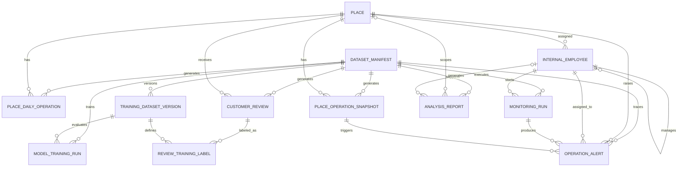

# SensePlace 데이터베이스 스키마 설계

## 1. 문서 목적

이 문서는 SensePlace의 다음 기능을 검증하기 위한 최소 데이터베이스 구조를 정의한다.

- A기능: 장소별 매출·운영·VOC 대화형 분석 및 시각화
- B기능: VOC 분류 학습과 리포팅
- C기능: 관리자·담당자 알림, 처리 여부와 처리자 관리
- D기능: 관리자 요청 시 실행되는 합성 운영 시나리오 모니터링
- 공통 기능: 호텔 매뉴얼·업무 지침 저장 및 조회

이 설계는 실제 기업 내부 데이터나 내부 프로세스를 알고 있다는 전제를 두지 않는다. 현재 확보 가능한 데이터가 없으므로 데이터는 합성으로 생성하고, 실제 운영 데이터로 오인되지 않도록 생성 버전과 seed를 추적한다.

처음 읽을 때는 다음 순서만 확인하면 된다.

1. 전체 구성과 용어: 2장
2. 테이블·관계: 4~5장
3. 화면 조회 방식: 6장
4. 학습 데이터와 평가: 9장
5. 시나리오 시연 방식: 11장
6. 최종 결정 요약: 18장

## 2. 설계 결론

### 2.1 권장 구성

최소 구성은 **물리 테이블 13개와 읽기 전용 View 4개**다.

| 구분 | 테이블 | 역할 |
|---|---|---|
| 공통 | `dataset_manifest` | 합성 데이터의 버전·생성기·seed·기간·현재 조회 대상 추적 |
| 공통 | `place` | 모든 기능이 참조하는 장소 기준정보 |
| A | `place_daily_operation` | 장소별 일 단위 매출·비용·예약·체크인·체크아웃·판매 객실·인력 |
| B | `customer_review` | 수정하지 않는 원본 VOC 리뷰 |
| B | `training_dataset_version` | 학습 버전과 원본 데이터셋의 1:1 관계 |
| B | `review_training_label` | 학습 라벨·데이터 분할·학습 버전 |
| B | `model_training_run` | 학습 실행 조건·모델 버전·평가지표 |
| B | `analysis_report` | 생성된 리포트의 기간·조건·구조화된 결과 저장 |
| C | `internal_employee` | 관리자 관계·담당 장소·권한·알림 설정 |
| C | `operation_alert` | 알림 내용·담당자·처리 여부·실제 처리자 |
| D | `place_operation_snapshot` | 장소별 특정 시점의 운영 상태 |
| D | `monitoring_run` | 요청형 모니터링 실행 순서·상태·시작자 |
| 공통 | `hotel_document` | 매뉴얼·업무 지침의 버전별 본문 |

### 2.2 핵심 설계 결정

1. 원본 리뷰와 학습 데이터를 통째로 복제하지 않는다.
   - `customer_review`를 리뷰의 단일 원본으로 유지한다.
   - `training_dataset_version`으로 한 `training_version`이 한 `ANALYTICS` 데이터셋만 가리키도록 강제한다.
   - 학습 과정에서 추가되는 감성 라벨, train/validation/test 구분, 학습 버전만 `review_training_label`에 저장한다.
2. 직원과 알림은 분리한다.
   - 직원 한 명에게 여러 알림이 발생하므로 한 테이블에 합치면 반복 컬럼과 갱신 이상이 발생한다.
3. 일별 운영과 시점 운영 스냅샷은 분리한다.
   - 두 데이터는 행의 기준 시점, 생성 주기, 보관량과 조회 방식이 다르다.
4. 장소는 별도 기준 테이블로 관리한다.
   - 리뷰·운영·직원·알림·시나리오 데이터에 장소명을 반복 저장하지 않는다.
5. 운영수익은 중복 저장하지 않는다.
   - `operating_profit_amount = sales_amount - operating_cost_amount` 생성 컬럼으로 계산한다.
6. 생성된 리포트는 `analysis_report`에 저장한다.
   - 리포트 본문·수치·차트 데이터는 `JSONB`로 보관한다.
   - PDF·CSV 파일 자체는 DB에 넣지 않고 저장된 결과에서 필요할 때 생성한다.
   - 승인 workflow와 승인 이력은 현재 범위에서 제외한다.
7. 영업일 운영 데이터와 리뷰 평점을 같은 일자 행에 결합하지 않는다.
   - `business_date`는 호텔 영업 기준이고 `reviewed_at`은 리뷰 게시 기준이므로 인과관계를 보장하지 않는다.
   - 운영 요약과 게시일 기준 평점 추세를 별도 View로 제공한다.
8. 여러 데이터셋 버전이 공존해도 기본 조회는 현재 데이터셋 한 개만 사용한다.
   - `dataset_manifest.is_current`는 A/B 분석용 `ANALYTICS` 데이터셋에만 사용한다.
   - A/B 조회용 View는 `dataset_scope = 'ANALYTICS' AND is_current = TRUE`를 기본 조건으로 사용한다.
9. D기능의 테이블은 범용 운영 구조로 설계하고, 현재 시연은 합성 시나리오 데이터로 수행한다.
   - `place_operation_snapshot`은 시나리오 종류와 무관한 시점 운영 데이터를 저장한다.
   - 인력 부족·예약 급증 같은 시나리오는 합성 fixture의 `dataset_code`와 값의 변화 패턴으로 표현한다.
   - 백그라운드 수집기·주기 실행 작업·실시간 메시지 처리는 두지 않는다.
   - 선택한 `MONITORING` 데이터셋 ID를 `monitoring_run`에 저장하며 A/B의 `is_current`는 변경하지 않는다.
10. 모델 평가 결과는 운영·VOC 리포트와 분리한다.
   - `model_training_run`에 `training_version`별 모델·전처리 버전과 평가지표를 저장한다.
   - 모델 파일은 DB에 넣지 않고 외부 파일 경로만 선택적으로 기록한다.
11. 매뉴얼 조회는 현재 카테고리·제목·키워드 검색으로 제한한다.
   - 자유로운 의미 기반 질의응답이나 RAG를 구현했다고 표현하지 않는다.

### 2.3 핵심 용어

| 용어 | 의미 |
|---|---|
| `ANALYTICS` 데이터셋 | A/B 분석·리뷰·학습에 사용하는 현재 데이터 |
| `MONITORING` 데이터셋 | D기능 화면에 사용할 시점 운영 스냅샷 묶음 |
| `dataset_version` | 합성 원천 데이터 묶음의 버전 |
| `training_version` | 한 `ANALYTICS` 데이터셋에서 만든 라벨·분할 버전 |
| `monitoring_run` | 사용자가 시작한 모니터링의 현재 순서와 상태 |
| `business_date` | 호텔 운영 기준 영업일 |
| `reviewed_at` | 고객 리뷰 게시 시각이며 실제 방문일이 아님 |

### 2.4 기능별 데이터 흐름

```text
A 분석: ANALYTICS 데이터셋 → 일별 운영·리뷰 → 조회 View → 저장 리포트
B 학습: ANALYTICS 데이터셋 → 학습 버전 → 라벨·분할 → 모델 실행·평가지표
C 알림: 모니터링 실행 → 조건 감지 → 담당자 알림 → 처리자·처리 시각
D 시연: MONITORING 데이터셋 → 운영 스냅샷 → 실행 순서 → 화면 갱신
문서: 게시된 매뉴얼 → 유형·키워드 조회 → 근거 본문 표시
```

### 2.5 스키마와 시나리오 데이터의 구분

| 구분 | 포함 내용 | 변경 시점 |
|---|---|---|
| 범용 DB 스키마 | `place_operation_snapshot`, `monitoring_run`, `operation_alert` | 업무 데이터 구조가 바뀔 때 |
| 합성 fixture | `dataset_code`, 관측시각별 매출·예약·고객·인력 값 | 새로운 시나리오가 필요할 때 |
| 실행 설정 | 진행 속도, 현재 순서, 일시정지·재개 상태 | 사용자가 모니터링을 실행할 때 |

새로운 시나리오를 추가할 때는 테이블이나 컬럼을 만들지 않는다. 기존 스키마를 그대로 사용하고 새 `dataset_version`과 스냅샷 행을 생성한다.

## 3. 범위와 가정

### 3.1 포함 범위

- 장소별 일 단위 운영 실적
- 고객 리뷰 원문과 평점
- 리뷰 감성 분류용 라벨과 데이터 분할
- 학습 실행 조건과 모델 평가지표
- 생성된 분석 리포트와 생성 조건
- 내부 직원의 관리자 관계와 담당 범위
- 운영 알림의 처리 여부·처리자·처리 시각
- 관리자 요청 시 조회되는 장소별 시점 운영 스냅샷
- 요청형 모니터링 실행 상태와 현재 순서
- 호텔 매뉴얼과 지침의 버전 관리
- 합성 데이터의 재현성 정보

### 3.2 제외 범위

- 실제 고객·직원의 개인정보
- 예약번호, 객실번호, 결제수단, 전화번호, 이메일
- 로그인 비밀번호와 인증 토큰
- 보고서 승인 workflow와 승인 이력
- 알림의 모든 상태 변경 이력
- 고객 응대·보상·업무 자동 배정
- 실제 호텔 시스템 연동과 상시 실시간 데이터 수집
- Vector DB, Graph DB, 전문검색, 메시지 브로커
- 데이터 웨어하우스, 샤딩, 읽기 Replica

### 3.3 기술 가정

| 항목 | 권장값 | 근거 |
|---|---|---|
| DBMS | PostgreSQL | FK·CHECK·생성 컬럼·부분 인덱스·View 지원 |
| 명명 규칙 | `snake_case` | 테이블·컬럼 이름 통일 |
| PK | `BIGINT GENERATED ALWAYS AS IDENTITY` | 단일 DB에서 단순하고 추적하기 쉬움 |
| 저장 시간대 | UTC `TIMESTAMPTZ` | 일광절약시간·서버 위치와 무관한 저장 |
| 영업일 | KST 기준 `DATE` | 호텔 운영 리포트의 일 단위 기준 |
| 금액 | KRW `BIGINT` | 원 단위 금액에 소수점 불필요 |
| 코드값 | `VARCHAR` + `CHECK` | 초기 단계에서 PostgreSQL ENUM 변경 부담 회피 |
| 삭제 정책 | 기준정보 비활성화, 사실 데이터 삭제 제한 | 분석 재현성과 참조 무결성 보존 |

UTC timestamp에서 영업일을 만들 때는 모든 적재·집계에서 다음 표현식을 공통으로 사용한다.

```sql
(event_at AT TIME ZONE 'Asia/Seoul')::date
```

리뷰 게시일은 같은 방식으로 KST 날짜를 구할 수 있지만 이를 `business_date` 또는 실제 숙박일로 해석하지 않는다.

## 4. 논리 관계



`hotel_document`는 운영 사실 데이터와 직접적인 생명주기를 공유하지 않으므로 독립 테이블로 둔다.

## 5. 물리 스키마

### 5.1 `dataset_manifest`

합성 데이터 묶음의 생성 조건과 재현 정보를 저장한다. 데이터셋은 덮어쓰지 않고 새 버전으로 생성한다.

| 컬럼 | 타입 | NULL | 제약·설명 |
|---|---|---:|---|
| `dataset_id` | `BIGINT IDENTITY` | 불가 | PK |
| `dataset_version` | `VARCHAR(40)` | 불가 | 사람이 식별할 수 있는 버전, UNIQUE |
| `dataset_scope` | `VARCHAR(20)` | 불가 | `ANALYTICS` 또는 `MONITORING` |
| `dataset_code` | `VARCHAR(40)` | 불가 | 데이터셋 용도·fixture를 식별하는 논리 코드 |
| `alert_rule_version` | `VARCHAR(40)` | 가능 | `MONITORING` 데이터에 적용할 알림 규칙 버전 |
| `schema_version` | `VARCHAR(20)` | 불가 | 데이터베이스 스키마 버전 |
| `generator_version` | `VARCHAR(40)` | 불가 | 합성 데이터 생성 코드 버전 |
| `master_data_version` | `VARCHAR(40)` | 불가 | 공통 장소·직원 fixture 버전 |
| `seed` | `BIGINT` | 불가 | 동일 데이터 재생성을 위한 난수 seed |
| `period_start` | `DATE` | 불가 | 합성 데이터 시작 영업일 |
| `period_end` | `DATE` | 불가 | 합성 데이터 종료 영업일 |
| `is_synthetic` | `BOOLEAN` | 불가 | 현재 데이터는 항상 `TRUE` |
| `is_current` | `BOOLEAN` | 불가 | A/B 기본 분석에 사용할 현재 `ANALYTICS` 데이터셋 여부 |
| `generated_at` | `TIMESTAMPTZ` | 불가 | 생성 완료 시각 |

필수 제약:

```sql
UNIQUE (dataset_version)
CHECK (dataset_scope IN ('ANALYTICS', 'MONITORING'))
CHECK (length(btrim(dataset_code)) > 0)
CHECK (
  (
    dataset_scope = 'ANALYTICS'
    AND alert_rule_version IS NULL
  )
  OR
  (
    dataset_scope = 'MONITORING'
    AND alert_rule_version IS NOT NULL
    AND length(btrim(alert_rule_version)) > 0
    AND is_current = FALSE
  )
)
CHECK (period_start <= period_end)
CHECK (is_synthetic = TRUE)
```

여러 버전이 공존할 때 매출과 건수가 섞이지 않도록 현재 데이터셋은 한 건만 허용한다.

```sql
CREATE UNIQUE INDEX uq_dataset_single_current
ON dataset_manifest ((1))
WHERE dataset_scope = 'ANALYTICS' AND is_current = TRUE;
```

현재 분석 데이터셋 변경은 기존 `ANALYTICS` 행의 `is_current`를 `FALSE`로 바꾸고 새 분석 행을 `TRUE`로 바꾸는 작업을 하나의 트랜잭션에서 처리한다. 모니터링 시작은 선택한 `MONITORING` 행의 `dataset_id`를 직접 사용하며 `is_current`를 변경하지 않는다. 과거 분석 버전 조회는 명시적인 `dataset_version`을 받은 관리·검증 기능에서만 허용한다.

### 5.2 `place`

장소명 반복과 표기 불일치를 방지하는 공통 기준정보다. 특정 시설 유형에 종속되지 않도록 `place_type`을 코드로 둔다.

| 컬럼 | 타입 | NULL | 제약·설명 |
|---|---|---:|---|
| `place_id` | `BIGINT IDENTITY` | 불가 | PK |
| `master_data_version` | `VARCHAR(40)` | 불가 | 장소 fixture 버전 |
| `place_code` | `VARCHAR(40)` | 불가 | 시스템 내부 장소 코드 |
| `place_name` | `VARCHAR(100)` | 불가 | 화면 표시용 장소명 |
| `place_type` | `VARCHAR(40)` | 불가 | `ROOMS`, `FOOD_BEVERAGE`, `FACILITY`, `COMMON` |
| `room_count` | `INTEGER` | 가능 | 객실 장소의 판매 가능 기준 객실 수, 그 외 장소는 NULL |
| `is_synthetic` | `BOOLEAN` | 불가 | 합성 장소 여부, 현재 `TRUE` |
| `is_active` | `BOOLEAN` | 불가 | 사용 중 여부 |
| `created_at` | `TIMESTAMPTZ` | 불가 | 생성 시각 |

필수 제약:

```sql
UNIQUE (master_data_version, place_code)
CHECK (place_type IN ('ROOMS', 'FOOD_BEVERAGE', 'FACILITY', 'COMMON'))
CHECK (
  (place_type = 'ROOMS' AND room_count > 0)
  OR (place_type <> 'ROOMS' AND room_count IS NULL)
)
CHECK (is_synthetic = TRUE)
```

장소를 삭제하지 않고 `is_active = FALSE`로 비활성화한다.

### 5.3 `place_daily_operation`

장소·영업일당 한 행을 저장하는 A기능의 중심 운영 테이블이다.

| 컬럼 | 타입 | NULL | 제약·설명 |
|---|---|---:|---|
| `operation_id` | `BIGINT IDENTITY` | 불가 | PK |
| `dataset_id` | `BIGINT` | 불가 | FK → `dataset_manifest` |
| `place_id` | `BIGINT` | 불가 | FK → `place` |
| `business_date` | `DATE` | 불가 | KST 기준 영업일 |
| `sales_amount` | `BIGINT` | 불가 | 해당 일자의 매출액 |
| `operating_cost_amount` | `BIGINT` | 불가 | 해당 일자의 운영비용 |
| `operating_profit_amount` | `BIGINT` | 불가 | 매출액-운영비용 생성 컬럼 |
| `reservation_count` | `INTEGER` | 불가 | 예약 건수 |
| `check_in_count` | `INTEGER` | 불가 | 체크인 건수 |
| `check_out_count` | `INTEGER` | 불가 | 체크아웃 건수 |
| `sold_room_count` | `INTEGER` | 가능 | 객실 장소의 당일 판매 객실 수, 그 외 장소는 NULL |
| `operating_staff_count` | `INTEGER` | 불가 | 해당 장소 운영인원 |
| `created_at` | `TIMESTAMPTZ` | 불가 | 최초 적재 시각 |

필수 제약:

```sql
UNIQUE (dataset_id, place_id, business_date)
CHECK (sales_amount >= 0)
CHECK (operating_cost_amount >= 0)
CHECK (reservation_count >= 0)
CHECK (check_in_count >= 0)
CHECK (check_out_count >= 0)
CHECK (sold_room_count IS NULL OR sold_room_count >= 0)
CHECK (operating_staff_count >= 0)
```

운영수익은 다음과 같이 DB가 계산한다.

```sql
operating_profit_amount BIGINT
GENERATED ALWAYS AS (sales_amount - operating_cost_amount) STORED
```

예약·체크인·체크아웃 사이에 기업 내부 프로세스가 확인되지 않은 산식을 강제로 적용하지 않는다. 예를 들어 당일 체크인은 전일 예약이나 현장 접수를 포함할 수 있으므로 `check_in_count <= reservation_count` 같은 제약은 두지 않는다.

`check_in_count`는 당일 도착 건수이며 전일부터 재실 중인 객실을 포함하지 않으므로 점유율 분자로 사용하지 않는다. 객실 KPI는 `sold_room_count`를 사용한다.

`sold_room_count`의 장소 유형·수용량 교차 제약은 일반 CHECK로 표현할 수 없으므로 `BEFORE INSERT OR UPDATE` 트리거로 강제한다. 객실 장소는 값이 필수이고 `room_count` 이하여야 하며, 객실 외 장소는 NULL이어야 한다. 위반하면 행 단위 수정이 아니라 적재 batch 전체를 거부한다. 생성기에도 같은 assertion을 두되 DB 트리거를 최종 방어선으로 사용한다.

객실 장소에서 `sales_amount`는 ADR 계산이 가능하도록 객실 판매 매출로 정의한다. 식음·시설 장소에서는 해당 장소의 운영 매출을 뜻한다. 한 행에 객실 매출과 식음 매출을 섞지 않는다.

### 5.4 `customer_review`

리뷰의 단일 원본이다. 적재 후 원문과 평점을 직접 수정하지 않고, 잘못된 데이터는 새 데이터셋 버전에서 재생성한다.

| 컬럼 | 타입 | NULL | 제약·설명 |
|---|---|---:|---|
| `voc_id` | `BIGINT IDENTITY` | 불가 | PK |
| `dataset_id` | `BIGINT` | 불가 | FK → `dataset_manifest` |
| `place_id` | `BIGINT` | 불가 | FK → `place` |
| `review_text` | `TEXT` | 불가 | 합성·비식별 리뷰 원문 |
| `reviewed_at` | `TIMESTAMPTZ` | 불가 | 리뷰 게시 시각 |
| `rating` | `SMALLINT` | 불가 | 1~5점 |
| `review_hash` | `CHAR(64)` | 불가 | 정규화된 리뷰의 SHA-256 |
| `created_at` | `TIMESTAMPTZ` | 불가 | 적재 시각 |

필수 제약:

```sql
CHECK (rating BETWEEN 1 AND 5)
CHECK (length(btrim(review_text)) > 0)
UNIQUE (dataset_id, review_hash)
UNIQUE (dataset_id, voc_id)
```

`reviewed_at`은 리뷰가 게시된 시각이며 실제 방문일이나 숙박일로 해석하지 않는다.

`(dataset_id, voc_id)` UNIQUE는 `review_training_label`의 복합 FK가 리뷰와 데이터셋을 동시에 검증할 수 있게 하는 제약이다.

### 5.5 `training_dataset_version`

한 학습 버전이 정확히 한 `ANALYTICS` 데이터셋만 사용하도록 연결하는 작은 매니페스트다. 리뷰 텍스트나 라벨을 복제하지 않는다.

| 컬럼 | 타입 | NULL | 제약·설명 |
|---|---|---:|---|
| `training_version` | `VARCHAR(40)` | 불가 | PK, 라벨·분할 버전 |
| `dataset_id` | `BIGINT` | 불가 | 학습 원본 `ANALYTICS` 데이터셋, FK → `dataset_manifest` |
| `split_strategy` | `VARCHAR(20)` | 불가 | 현재 `TIME_ORDERED` |
| `created_at` | `TIMESTAMPTZ` | 불가 | 학습 버전 생성 시각 |

필수 제약:

```sql
PRIMARY KEY (training_version)
UNIQUE (dataset_id, training_version)
CHECK (length(btrim(training_version)) > 0)
CHECK (split_strategy IN ('TIME_ORDERED'))
```

`dataset_id`가 `dataset_scope = 'ANALYTICS'`인지는 학습 버전 생성 트랜잭션에서 검증한다. `training_version`이 PK이므로 같은 버전을 다른 데이터셋에 다시 등록할 수 없다.

### 5.6 `review_training_label`

리뷰 원문을 복사하지 않고 학습 과정에서 생성되는 정보만 저장한다. 동일한 리뷰를 서로 다른 학습 버전에서 다시 분류할 수 있다.

| 컬럼 | 타입 | NULL | 제약·설명 |
|---|---|---:|---|
| `dataset_id` | `BIGINT` | 불가 | 리뷰·학습 버전의 공통 데이터셋 |
| `voc_id` | `BIGINT` | 불가 | 복합 FK → `customer_review(dataset_id, voc_id)` |
| `training_version` | `VARCHAR(40)` | 불가 | 복합 FK → `training_dataset_version(dataset_id, training_version)` |
| `sentiment_label` | `VARCHAR(20)` | 불가 | `POSITIVE`, `NEUTRAL`, `NEGATIVE` |
| `dataset_split` | `VARCHAR(20)` | 불가 | `TRAIN`, `VALIDATION`, `TEST` |
| `label_method` | `VARCHAR(30)` | 불가 | `SYNTHETIC_GROUND_TRUTH`, `MANUAL_VALIDATED` |
| `labeled_at` | `TIMESTAMPTZ` | 불가 | 라벨 확정 시각 |

기본키와 제약:

```sql
PRIMARY KEY (dataset_id, voc_id, training_version)
FOREIGN KEY (dataset_id, voc_id)
  REFERENCES customer_review (dataset_id, voc_id)
  ON DELETE RESTRICT
FOREIGN KEY (dataset_id, training_version)
  REFERENCES training_dataset_version (dataset_id, training_version)
  ON DELETE RESTRICT
CHECK (sentiment_label IN ('POSITIVE', 'NEUTRAL', 'NEGATIVE'))
CHECK (dataset_split IN ('TRAIN', 'VALIDATION', 'TEST'))
CHECK (label_method IN ('SYNTHETIC_GROUND_TRUTH', 'MANUAL_VALIDATED'))
```

팀원이 실제로 검수하지 않은 라벨에는 `MANUAL_VALIDATED`를 사용하지 않는다.

### 5.7 `model_training_run`

완료된 모델 학습·평가 실행의 재현 정보와 지표를 저장한다. 운영·VOC 화면 리포트인 `analysis_report`와 섞지 않는다.

| 컬럼 | 타입 | NULL | 제약·설명 |
|---|---|---:|---|
| `training_run_id` | `BIGINT IDENTITY` | 불가 | PK |
| `dataset_id` | `BIGINT` | 불가 | 학습 리뷰가 속한 `ANALYTICS` 데이터셋, FK → `dataset_manifest` |
| `training_version` | `VARCHAR(40)` | 불가 | `review_training_label` 추출에 사용한 학습 데이터 버전 |
| `model_name` | `VARCHAR(80)` | 불가 | 모델 또는 기준선 이름 |
| `model_version` | `VARCHAR(40)` | 불가 | 저장 모델·실험 버전 |
| `preprocessing_version` | `VARCHAR(40)` | 불가 | 토크나이징·벡터화 등 전처리 버전 |
| `training_config` | `JSONB` | 불가 | seed·하이퍼파라미터·분할 설정 |
| `evaluation_metrics` | `JSONB` | 불가 | Macro F1·클래스별 P/R/F1·Confusion Matrix |
| `artifact_uri` | `TEXT` | 가능 | DB 밖 모델 파일 또는 실험 결과 경로 |
| `trained_at` | `TIMESTAMPTZ` | 불가 | 학습·평가 완료 시각 |

필수 제약:

```sql
UNIQUE (dataset_id, training_version, model_name, model_version)
FOREIGN KEY (dataset_id, training_version)
  REFERENCES training_dataset_version (dataset_id, training_version)
  ON DELETE RESTRICT
CHECK (length(btrim(training_version)) > 0)
CHECK (length(btrim(model_name)) > 0)
CHECK (length(btrim(model_version)) > 0)
CHECK (length(btrim(preprocessing_version)) > 0)
CHECK (jsonb_typeof(training_config) = 'object')
CHECK (jsonb_typeof(evaluation_metrics) = 'object')
```

`evaluation_metrics`는 애플리케이션 JSON Schema로 `macro_f1`, `per_class`, `confusion_matrix`, `sample_count` 키와 값의 범위를 검증한다. 학습 결과 적재 전 해당 데이터셋·`training_version` 조합에 라벨이 존재하는지 확인한다. 같은 학습 버전에서 여러 모델을 비교할 수 있으므로 `training_version`만의 UNIQUE는 두지 않는다. 모델 바이너리와 상세 로그는 DB에 저장하지 않는다.

### 5.8 `internal_employee`

합성 내부 직원, 관리자 관계, 담당 장소, 권한과 알림 설정을 관리한다. 인증 비밀번호와 토큰은 저장하지 않는다.

직원은 데이터셋마다 다시 생성되는 fact가 아니라 같은 `master_data_version`의 데이터셋들이 공유하는 합성 마스터로 정의한다. `dataset_manifest.master_data_version`이 장소·직원 fixture 버전을 가리키며, 알림 생성기는 해당 버전의 활성 직원만 사용한다.

| 컬럼 | 타입 | NULL | 제약·설명 |
|---|---|---:|---|
| `employee_id` | `BIGINT IDENTITY` | 불가 | PK |
| `master_data_version` | `VARCHAR(40)` | 불가 | 직원 fixture 버전 |
| `manager_id` | `BIGINT` | 가능 | 자기참조 FK → `internal_employee` |
| `place_id` | `BIGINT` | 가능 | FK → `place`, 전사 관리자는 NULL 가능 |
| `employee_name` | `VARCHAR(80)` | 불가 | 합성 표시명 |
| `role_code` | `VARCHAR(20)` | 불가 | `ADMIN`, `MANAGER`, `STAFF` |
| `department_name` | `VARCHAR(80)` | 불가 | 부서명 |
| `assigned_part` | `VARCHAR(80)` | 불가 | 담당 파트 |
| `permission_code` | `VARCHAR(40)` | 불가 | 애플리케이션 권한 코드 |
| `notification_enabled` | `BOOLEAN` | 불가 | 알림 수신 여부 |
| `is_synthetic` | `BOOLEAN` | 불가 | 합성 직원 여부, 현재 `TRUE` |
| `is_active` | `BOOLEAN` | 불가 | 재직·사용 여부 |
| `created_at` | `TIMESTAMPTZ` | 불가 | 생성 시각 |
| `updated_at` | `TIMESTAMPTZ` | 불가 | 수정 시각 |

필수 제약:

```sql
CHECK (role_code IN ('ADMIN', 'MANAGER', 'STAFF'))
CHECK (permission_code IN ('FULL_ACCESS', 'ASSIGNED_PLACE', 'READ_ONLY'))
CHECK (manager_id IS NULL OR manager_id <> employee_id)
CHECK (length(btrim(department_name)) > 0)
CHECK (length(btrim(assigned_part)) > 0)
CHECK (is_synthetic = TRUE)
```

부서·파트·권한 테이블은 현재 만들지 않는다. 관리자가 화면에서 해당 코드들을 생성·수정해야 하는 요구가 생길 때만 기준 테이블로 분리한다.

직원의 `manager_id`와 `place_id`가 같은 `master_data_version`의 행을 가리키는지는 적재 품질 검사에서 확인한다.

### 5.9 `operation_alert`

관리자와 담당자가 확인할 운영 알림, 처리 여부와 실제 처리자를 저장한다.

| 컬럼 | 타입 | NULL | 제약·설명 |
|---|---|---:|---|
| `alert_id` | `BIGINT IDENTITY` | 불가 | PK |
| `dataset_id` | `BIGINT` | 불가 | FK → `dataset_manifest` |
| `place_id` | `BIGINT` | 불가 | FK → `place` |
| `monitoring_run_id` | `UUID` | 불가 | 알림을 생성한 FK → `monitoring_run` |
| `source_snapshot_id` | `BIGINT` | 불가 | 알림을 발생시킨 FK → `place_operation_snapshot` |
| `assigned_employee_id` | `BIGINT` | 불가 | 알림 담당자, FK → `internal_employee` |
| `processed_by_employee_id` | `BIGINT` | 가능 | 실제 처리자, FK → `internal_employee` |
| `alert_type` | `VARCHAR(40)` | 불가 | `SALES_CHANGE`, `RESERVATION_CHANGE`, `CHECK_IN_CHANGE`, `STAFFING_CHANGE` |
| `severity` | `VARCHAR(20)` | 불가 | `INFO`, `WARNING`, `CRITICAL` |
| `alert_title` | `VARCHAR(150)` | 불가 | 알림 제목 |
| `alert_message` | `TEXT` | 불가 | 수치와 판단 근거를 포함한 메시지 |
| `is_processed` | `BOOLEAN` | 불가 | 처리 완료 여부, 기본값 `FALSE` |
| `action_note` | `TEXT` | 가능 | 처리 메모 |
| `detected_at` | `TIMESTAMPTZ` | 불가 | 이상 또는 조건 감지 시각 |
| `notified_at` | `TIMESTAMPTZ` | 가능 | 알림 전송 시각 |
| `processed_at` | `TIMESTAMPTZ` | 가능 | 처리 완료 시각 |
| `updated_at` | `TIMESTAMPTZ` | 불가 | 최신 수정 시각 |

필수 제약:

```sql
CHECK (
  alert_type IN (
    'SALES_CHANGE',
    'RESERVATION_CHANGE',
    'CHECK_IN_CHANGE',
    'STAFFING_CHANGE'
  )
)
CHECK (severity IN ('INFO', 'WARNING', 'CRITICAL'))
CHECK (
  (
    is_processed = FALSE
    AND processed_by_employee_id IS NULL
    AND processed_at IS NULL
  )
  OR
  (
    is_processed = TRUE
    AND processed_by_employee_id IS NOT NULL
    AND processed_at IS NOT NULL
    AND processed_at >= detected_at
  )
)
```

관리자 ID는 알림에 중복 저장하지 않는다. 관리자는 담당 직원의 `manager_id` 관계와 `permission_code`를 통해 알림을 조회한다.

알림 적재 전 다음 조건을 검사한다.

- 직원과 장소의 `master_data_version`이 알림 데이터셋의 `master_data_version`과 일치
- `assigned_employee_id`가 활성 상태
- 직원의 `place_id`가 알림의 `place_id`와 같거나 직원 권한이 `FULL_ACCESS`
- `monitoring_run_id`, `source_snapshot_id`, 알림의 `dataset_id`가 동일한 `MONITORING` 데이터셋을 참조
- `source_snapshot_id`의 장소가 알림의 `place_id`와 일치

이 규칙은 다른 테이블의 값을 참조하므로 단순 CHECK 대신 알림 생성 트랜잭션에서 검증한다. 현재 알림은 모두 운영 스냅샷의 변화에서 생성한다. 평점 변화와 데이터 지연은 생성 경로가 없으므로 `RATING_CHANGE`, `DATA_STALE`를 허용값에 두지 않는다.

처리 시에는 `processed_by_employee_id`도 활성 직원이고 해당 장소를 처리할 권한이 있는지 같은 방식으로 확인한다. 사용자별 읽음 여부는 저장하지 않는다. 현재 요구에서는 처리 여부와 실제 처리자만 중요하므로 `alert_recipient`와 `alert_action_history`를 만들지 않는다.

### 5.10 `place_operation_snapshot`

장소의 특정 시점 운영 상태를 저장하는 불변 스냅샷이다. 테이블 구조는 시나리오 종류를 알지 않으며, 현재 프로젝트에서는 합성 fixture를 데이터셋과 함께 미리 생성한다.

| 컬럼 | 타입 | NULL | 제약·설명 |
|---|---|---:|---|
| `snapshot_id` | `BIGINT IDENTITY` | 불가 | PK |
| `dataset_id` | `BIGINT` | 불가 | FK → `dataset_manifest` |
| `place_id` | `BIGINT` | 불가 | FK → `place` |
| `sequence_no` | `INTEGER` | 불가 | 데이터셋·장소 안에서 0부터 증가하는 순서 |
| `observed_at` | `TIMESTAMPTZ` | 불가 | 스냅샷이 나타내는 시점 |
| `sales_today_amount` | `BIGINT` | 불가 | 해당 시점까지 누적 매출 |
| `active_reservation_count` | `INTEGER` | 불가 | 해당 시점의 유효 예약 건수 |
| `check_in_today_count` | `INTEGER` | 불가 | 해당 일자의 누적 체크인 |
| `check_out_today_count` | `INTEGER` | 불가 | 해당 일자의 누적 체크아웃 |
| `current_guest_count` | `INTEGER` | 불가 | 해당 시점의 고객 수 |
| `on_duty_staff_count` | `INTEGER` | 불가 | 해당 시점의 근무 인원 |

필수 제약:

```sql
UNIQUE (dataset_id, place_id, sequence_no)
UNIQUE (dataset_id, place_id, observed_at)
CHECK (sequence_no >= 0)
CHECK (sales_today_amount >= 0)
CHECK (active_reservation_count >= 0)
CHECK (check_in_today_count >= 0)
CHECK (check_out_today_count >= 0)
CHECK (current_guest_count >= 0)
CHECK (on_duty_staff_count >= 0)
```

초기 합성 fixture는 데이터셋당 장소별 12~24개 스냅샷으로 구성한다. 스냅샷은 5분 간격의 `observed_at`을 가지며 시연에서는 2초마다 다음 `sequence_no`로 이동할 수 있다. `dataset_id`가 `MONITORING`인지와 장소 master version이 일치하는지는 적재 트랜잭션에서 검증한다. 인력 부족·예약 급증 등의 시나리오는 별도 테이블이나 컬럼이 아니라 `dataset_code`와 스냅샷 값의 변화로 만든다.

### 5.11 `monitoring_run`

사용자가 시작한 요청형 모니터링의 현재 순서와 상태를 저장한다. 실행 상태를 DB에 남겨 알림의 `monitoring_run_id`가 고아 값이 되지 않게 하고, 애플리케이션 재시작 후에도 일시정지 상태에서 이어갈 수 있게 한다.

| 컬럼 | 타입 | NULL | 제약·설명 |
|---|---|---:|---|
| `monitoring_run_id` | `UUID` | 불가 | PK, 시작 시 애플리케이션이 생성 |
| `dataset_id` | `BIGINT` | 불가 | 조회할 `MONITORING` 데이터셋, FK → `dataset_manifest` |
| `started_by_employee_id` | `BIGINT` | 불가 | 실행을 시작한 FK → `internal_employee` |
| `current_sequence_no` | `INTEGER` | 불가 | 현재 표시 중인 순서, 기본값 0 |
| `run_state` | `VARCHAR(20)` | 불가 | `RUNNING`, `PAUSED`, `FINISHED` |
| `started_at` | `TIMESTAMPTZ` | 불가 | 실행 시작 시각 |
| `updated_at` | `TIMESTAMPTZ` | 불가 | 순서 또는 상태 변경 시각 |
| `finished_at` | `TIMESTAMPTZ` | 가능 | 종료 시각 |

필수 제약:

```sql
CHECK (current_sequence_no >= 0)
CHECK (run_state IN ('RUNNING', 'PAUSED', 'FINISHED'))
CHECK (
  (run_state = 'FINISHED' AND finished_at IS NOT NULL)
  OR
  (run_state <> 'FINISHED' AND finished_at IS NULL)
)
CHECK (updated_at >= started_at)
CHECK (finished_at IS NULL OR finished_at >= started_at)
```

`dataset_id`가 `dataset_scope = 'MONITORING'`인지, 시작자가 해당 데이터셋의 master version과 일치하는 활성 직원인지, `current_sequence_no`가 해당 데이터셋의 최대 순서를 넘지 않는지는 실행 제어 트랜잭션에서 검증한다. 앱이 비정상 종료되면 남아 있는 `RUNNING` 실행은 다음 시작 시 `PAUSED`로 전환하고 사용자가 명시적으로 재개한다.

### 5.12 `hotel_document`

호텔 매뉴얼과 업무 지침을 한 테이블에서 버전별로 저장한다. 문서 본문과 버전을 다른 테이블로 나누지 않는다.

| 컬럼 | 타입 | NULL | 제약·설명 |
|---|---|---:|---|
| `document_id` | `BIGINT IDENTITY` | 불가 | PK, 문서 버전 행 식별자 |
| `document_code` | `VARCHAR(50)` | 불가 | 버전 간 유지되는 논리 문서 코드 |
| `document_type` | `VARCHAR(40)` | 불가 | `MANUAL`, `GUIDELINE`, `POLICY`, `FAQ` |
| `document_title` | `VARCHAR(200)` | 불가 | 문서 제목 |
| `document_content` | `TEXT` | 불가 | 문서 본문 |
| `version_no` | `INTEGER` | 불가 | 1부터 증가하는 버전 |
| `document_status` | `VARCHAR(20)` | 불가 | `DRAFT`, `PUBLISHED`, `RETIRED` |
| `is_synthetic` | `BOOLEAN` | 불가 | 생성 문서 여부, 현재 `TRUE` |
| `effective_from` | `DATE` | 가능 | 적용 시작일 |
| `created_at` | `TIMESTAMPTZ` | 불가 | 버전 생성 시각 |
| `published_at` | `TIMESTAMPTZ` | 가능 | 게시 시각 |

필수 제약:

```sql
UNIQUE (document_code, version_no)
CHECK (version_no >= 1)
CHECK (document_type IN ('MANUAL', 'GUIDELINE', 'POLICY', 'FAQ'))
CHECK (document_status IN ('DRAFT', 'PUBLISHED', 'RETIRED'))
CHECK (
  (document_status = 'PUBLISHED' AND published_at IS NOT NULL)
  OR document_status <> 'PUBLISHED'
)
CHECK (length(btrim(document_content)) > 0)
```

같은 `document_code`에서 현재 게시 버전이 한 건만 존재하도록 부분 UNIQUE 인덱스를 사용한다. 새 버전을 게시할 때 기존 게시 버전을 `RETIRED`로 바꾸는 작업과 새 버전 게시를 하나의 트랜잭션으로 처리한다.

현재는 모든 장소에 공통으로 적용되는 문서만 저장한다. 장소별 매뉴얼 요구가 확인되면 새 테이블을 만들지 않고 `place_id NULL` 컬럼을 추가해 NULL은 공통 문서, 값이 있으면 장소별 문서로 확장한다.

현재 매뉴얼 조회 범위는 최신 `PUBLISHED` 문서에 대한 `document_type` 필터와 제목·본문 키워드 검색이다. 문서 수가 적은 시연 단계에서는 `ILIKE` 조회로 충분하며 자유로운 표현의 의미 기반 질의응답을 보장하지 않는다. 대화 화면도 검색된 문서 제목과 본문 근거를 그대로 제시한다. 동의어·문장 의미 검색이 필수라는 요구와 평가셋이 생길 때 PostgreSQL 전문검색 또는 vector 검색을 별도 검토한다.

### 5.13 `analysis_report`

사용자가 생성한 리포트의 조회 조건과 결과를 보존한다. 각 행은 생성 시점의 불변 리포트 한 건이며, 같은 조건으로 다시 생성해도 기존 행을 덮어쓰지 않고 새 `report_id`를 만든다.

| 컬럼 | 타입 | NULL | 제약·설명 |
|---|---|---:|---|
| `report_id` | `BIGINT IDENTITY` | 불가 | PK |
| `dataset_id` | `BIGINT` | 불가 | 리포트가 사용한 데이터셋, FK → `dataset_manifest` |
| `place_id` | `BIGINT` | 가능 | 특정 장소 리포트면 FK → `place`, 전체 장소면 NULL |
| `generated_by_employee_id` | `BIGINT` | 가능 | 사용자 생성 시 FK → `internal_employee`, 예약 작업이면 NULL |
| `report_type` | `VARCHAR(20)` | 불가 | `OPERATIONS`, `VOC`, `COMBINED` |
| `period_start` | `DATE` | 불가 | 분석 시작일 |
| `period_end` | `DATE` | 불가 | 분석 종료일 |
| `report_title` | `VARCHAR(200)` | 불가 | 화면 표시 제목 |
| `report_content` | `JSONB` | 불가 | 생성 조건·요약·지표·차트 데이터를 포함한 결과 |
| `generated_at` | `TIMESTAMPTZ` | 불가 | 리포트 생성 시각 |

필수 제약:

```sql
CHECK (report_type IN ('OPERATIONS', 'VOC', 'COMBINED'))
CHECK (period_start <= period_end)
CHECK (length(btrim(report_title)) > 0)
CHECK (jsonb_typeof(report_content) = 'object')
```

`report_content`는 최소한 다음 구조를 가진다.

```json
{
  "meta": {
    "dataset_version": "sp-synthetic-1.0.0",
    "is_synthetic": true,
    "generated_at": "ISO-8601 UTC"
  },
  "filters": {},
  "summary": "",
  "metrics": [],
  "charts": []
}
```

DB에는 PDF·CSV·DOCX 바이너리를 저장하지 않는다. 다운로드 요청이 오면 `report_content`로 파일을 생성한다. 이렇게 하면 같은 저장 결과를 화면과 여러 출력 형식에서 재사용할 수 있고 DB가 대용량 파일 저장소가 되는 것을 막을 수 있다.

리포트 생성 시 다음 조건을 검사한다.

- `dataset_id`는 생성 당시 조회한 데이터셋과 동일
- `place_id`가 있으면 장소의 `master_data_version`이 데이터셋과 동일
- `generated_by_employee_id`가 있으면 활성 직원이고 해당 장소 또는 전체 범위를 조회할 권한이 있음
- 분석 기간이 데이터셋 기간 안에 있음
- `report_content`가 `meta`, `filters`, `summary`, `metrics`, `charts`를 요구하는 애플리케이션 JSON Schema를 통과함
- 수치·차트 데이터가 화면에 사용한 조회 결과와 동일

승인 상태와 승인자는 현재 저장하지 않는다. 리포트 승인 workflow가 실제 요구가 될 때만 승인 필드를 추가한다.

새 리포트 생성은 기본적으로 `dataset_scope = 'ANALYTICS' AND is_current = TRUE`인 데이터셋을 사용한다. 저장된 과거 리포트를 다시 열 때는 현재 데이터셋으로 바꾸어 계산하지 않고, 해당 리포트의 `dataset_id`와 저장된 `report_content`를 그대로 사용한다.

## 6. 조회용 View와 기능별 조회 규칙

대화형 분석 계정은 물리 테이블이 아니라 허용된 View만 조회하도록 한다. A/B View는 공통으로 `dataset_scope = 'ANALYTICS' AND is_current = TRUE`를 적용하고, `place.master_data_version = dataset_manifest.master_data_version`인 장소만 포함한다. D의 `v_monitoring_snapshot`은 실행 ID로 `monitoring_run`과 조인해 데이터셋과 현재 순서를 확정한다.

### 6.1 `v_place_daily_summary`

장소·영업일 단위로 다음 항목을 제공한다.

```text
dataset_version
business_date
place_id
place_name
sales_amount
operating_cost_amount
operating_profit_amount
reservation_count
check_in_count
check_out_count
room_count
sold_room_count
occupancy_rate
adr_amount
operating_staff_count
```

이 View에는 리뷰 평점과 리뷰 건수를 넣지 않는다. 운영일인 `business_date`와 게시일인 `reviewed_at`을 같은 날짜로 조인하면 관리자가 해당 운영일의 고객 평가로 오독할 수 있기 때문이다.

모든 행은 `dataset_scope = 'ANALYTICS' AND is_current = TRUE`인 데이터셋으로 제한한다. 객실 KPI는 `place_type = 'ROOMS'`일 때만 계산하고 다른 장소에서는 NULL을 반환한다.

```sql
occupancy_rate =
  sold_room_count::NUMERIC / NULLIF(room_count, 0)

adr_amount =
  sales_amount::NUMERIC / NULLIF(sold_room_count, 0)
```

점유율은 당일 도착 건수인 `check_in_count`가 아니라 재실을 포함하는 판매 객실 수 `sold_room_count`로 계산한다. 현재 설계에서는 `room_count`를 판매 가능 기준 객실 수로 사용하므로, 판매 불가 객실 관리가 추가되면 `available_room_count`를 별도로 도입해야 한다.

`occupancy_rate`는 0~1 비율이고 `adr_amount`는 판매 객실 1실당 KRW 금액이다. 판매 객실이 0이면 점유율은 0이고 ADR은 0으로 왜곡하지 않고 NULL로 반환한다.

### 6.2 `v_review_rating_trend`

리뷰 평점은 운영일 요약과 분리해 **게시일 기준 추세**로만 제공한다.

```text
dataset_version
review_published_date
place_id
place_name
average_rating
review_count
```

`review_published_date`는 `(reviewed_at AT TIME ZONE 'Asia/Seoul')::date`로 계산한다. 이 날짜는 리뷰 게시일이며 실제 방문일·숙박일·운영일이 아니다. 매출 추세와 평점 추세를 같은 화면에 표시하더라도 서로 다른 시간축 의미를 명시하고 인과관계를 주장하지 않는다.

이 View도 `dataset_scope = 'ANALYTICS' AND is_current = TRUE`인 데이터셋만 조회한다.

### 6.3 `v_recent_low_rating_review`

다음 조건을 DB View에서 제한한다.

- `dataset_scope = 'ANALYTICS'`
- `dataset_manifest.is_current = TRUE`
- `rating <= 3`
- 데이터셋 종료일 기준 최근 6개월 이내
- 고객·직원 식별정보 미포함
- 필요한 컬럼만 노출

```text
dataset_version
voc_id
place_id
place_name
reviewed_at
rating
review_text
```

애플리케이션은 이 View에 추가 기간 조건을 적용한다.

- 기본 상세 조회: 최근 3개월
- 사용자가 반기를 요청한 경우: 최근 6개월
- 최대 반환: 20건

### 6.4 `v_monitoring_snapshot`

`dataset_scope = 'MONITORING'`인 데이터셋의 운영 스냅샷만 노출하는 읽기 전용 View다. View를 단독 조회하지 않고 반드시 `monitoring_run_id`로 실행 행과 조인해 장소별 가장 마지막 행을 조회한다.

```sql
SELECT DISTINCT ON (s.place_id)
  s.*
FROM monitoring_run AS run
JOIN v_monitoring_snapshot AS s
  ON s.dataset_id = run.dataset_id
 AND s.sequence_no <= run.current_sequence_no
WHERE run.monitoring_run_id = :monitoring_run_id
ORDER BY s.place_id, s.sequence_no DESC;
```

애플리케이션의 모니터링 조회 함수는 `monitoring_run_id`만 입력받고 위 prepared query를 사용한다. 호출자가 `dataset_id`나 `current_sequence_no`를 직접 조합하지 않게 해 필터 누락 가능성을 줄인다. DB의 실제 현재시각이나 A/B의 `is_current`와도 무관하다.

### 6.5 대화형 VOC 노출 단계

1. 최초 VOC 질문에서는 `v_review_rating_trend`의 게시일 기준 `average_rating`과 `review_count`만 제공한다.
2. 사용자가 낮은 평점, 원인 또는 리뷰 내용을 명시적으로 추가 질문할 때만 `v_recent_low_rating_review`를 조회한다.
3. 상세 리뷰는 3점 이하이며 최근 분기 또는 반기로 제한한다.
4. 리뷰 원문을 무제한 내려받거나 전체 기간을 탐색하는 기능은 제공하지 않는다.
5. 모든 조회에는 장소, 기간, 표본 수, `dataset_version`과 합성 데이터 표시를 함께 반환한다.
6. 게시일 기준 평점과 영업일 기준 운영 지표를 함께 보여줄 때는 두 날짜가 같은 사건을 의미하지 않는다고 표시한다.

### 6.6 매뉴얼 조회 단계

1. `document_status = 'PUBLISHED'`인 최신 버전만 조회한다.
2. 문서 유형이 지정되면 `document_type`으로 먼저 제한한다.
3. 제목 또는 본문에 사용자 키워드가 포함된 문서를 최대 10건 반환한다.
4. 검색 결과가 없으면 의미상 비슷한 문서를 만들어 답하지 않고 검색되지 않았다고 표시한다.
5. 답변에는 `document_code`, 제목, 버전과 근거 본문을 함께 표시한다.

## 7. 인덱스 설계

FK 컬럼은 PostgreSQL이 자동으로 인덱스를 만들지 않으므로 실제 조인 경로에 필요한 인덱스를 명시한다.

```sql
-- 일별 운영
CREATE UNIQUE INDEX uq_daily_operation_grain
ON place_daily_operation (dataset_id, place_id, business_date);

-- 리뷰 기간 조회
CREATE INDEX ix_review_place_date
ON customer_review (dataset_id, place_id, reviewed_at DESC);

-- 낮은 평점 후속 조회
CREATE INDEX ix_review_low_rating
ON customer_review (dataset_id, place_id, reviewed_at DESC)
WHERE rating <= 3;

-- 학습 데이터 추출
CREATE INDEX ix_training_split
ON review_training_label
  (training_version, dataset_id, dataset_split, sentiment_label);

-- 학습 실행 결과 조회
CREATE INDEX ix_model_training_version
ON model_training_run
  (dataset_id, training_version, trained_at DESC);

-- 모니터링 데이터셋 선택
CREATE INDEX ix_dataset_monitoring_code
ON dataset_manifest
  (dataset_code, generated_at DESC)
WHERE dataset_scope = 'MONITORING';

-- 관리자 조직 조회
CREATE INDEX ix_employee_manager
ON internal_employee (manager_id);

CREATE INDEX ix_employee_master_place_active
ON internal_employee (master_data_version, place_id, is_active);

-- 미처리 알림 조회
CREATE INDEX ix_alert_assignee_processed
ON operation_alert
  (assigned_employee_id, is_processed, detected_at DESC);

CREATE INDEX ix_alert_place_processed
ON operation_alert
  (place_id, is_processed, detected_at DESC);

CREATE INDEX ix_alert_dataset_date
ON operation_alert
  (dataset_id, detected_at DESC);

CREATE INDEX ix_alert_source_snapshot
ON operation_alert
  (source_snapshot_id);

-- 동일 실행에서 같은 스냅샷·유형의 알림 중복 방지
CREATE UNIQUE INDEX uq_alert_monitoring_trigger
ON operation_alert
  (monitoring_run_id, source_snapshot_id, alert_type);

-- 운영 스냅샷 순서 조회
CREATE UNIQUE INDEX uq_operation_snapshot_sequence
ON place_operation_snapshot
  (dataset_id, place_id, sequence_no);

CREATE INDEX ix_operation_snapshot_dataset_sequence
ON place_operation_snapshot
  (dataset_id, sequence_no, place_id);

-- 실행 재개와 실행별 조회
CREATE INDEX ix_monitoring_run_dataset_state
ON monitoring_run
  (dataset_id, run_state, updated_at DESC);

CREATE UNIQUE INDEX uq_monitoring_run_one_open_per_user
ON monitoring_run (started_by_employee_id)
WHERE run_state IN ('RUNNING', 'PAUSED');

-- 최신 게시 문서 조회
CREATE UNIQUE INDEX uq_document_version
ON hotel_document (document_code, version_no);

CREATE UNIQUE INDEX uq_document_current_published
ON hotel_document (document_code)
WHERE document_status = 'PUBLISHED';

-- 저장된 리포트 목록·상세 조회
CREATE INDEX ix_report_dataset_place_date
ON analysis_report
  (dataset_id, place_id, generated_at DESC);

CREATE INDEX ix_report_generator_date
ON analysis_report
  (generated_by_employee_id, generated_at DESC);
```

초기에는 리뷰·매뉴얼 전문검색 인덱스와 vector index를 만들지 않는다. 문서 수가 작으므로 매뉴얼은 유형과 `ILIKE` 키워드 검색으로 시작하고, 의미 검색이 실제 요구사항과 평가셋으로 확정될 때만 추가한다.

## 8. 합성 데이터 생성 원칙

### 8.1 기본 생성 범위

- 분기·반기·계절 비교가 가능하도록 최소 18개월 생성
- 서로 다른 운영 특성을 가진 여러 장소 유형 포함
- 영업일, 주말, 계절, 행사성 변동과 무작위 노이즈 포함
- 정상·저매출·고매출·인력 변동·예약 변동 등 여러 상태를 혼합
- 하나의 장애 또는 특정 장소만 과도하게 반복하지 않음

장소 수, 리뷰 수, 감성 비율과 이상 주입 비율은 실제 기업 수치로 표현하지 않고 생성기 설정값으로 기록한다.

### 8.2 리뷰 다양성

- 청결, 응대, 소음, 접근성, 가격, 시설, 예약, 식음 등 여러 주제 포함
- 긍정·중립·부정을 동일한 단어나 문장 구조로만 표현하지 않음
- 복합 감정, 부정어, 짧은 리뷰, 긴 리뷰와 중립 서술 포함
- 정상 운영일에도 일부 부정 리뷰가 존재하고 혼잡일에도 일부 긍정 리뷰가 존재하도록 생성
- 감성 라벨과 평점은 상관관계를 갖되 완전히 동일하게 결정되지 않도록 생성

### 8.3 금지 정보

- 실제 고객·직원 이름
- 전화번호, 이메일, 계정 ID
- 예약번호, 결제정보, 객실번호
- 실제 기업 내부 시스템명과 조직도
- 실제 호텔의 수치로 오인될 수 있는 표현

### 8.4 재현성

모든 생성 작업은 다음 값을 함께 남긴다.

```text
dataset_version
dataset_scope
dataset_code
alert_rule_version
schema_version
generator_version
master_data_version
seed
period_start
period_end
generated_at
is_synthetic
is_current
```

`dataset_code`는 모든 데이터셋에 존재한다. `alert_rule_version`은 `MONITORING` 데이터셋에만 존재하며 `ANALYTICS` 데이터셋에서는 NULL이다. 시나리오 이름은 별도 스키마가 아니라 `dataset_code`와 fixture 생성 설정에 기록한다.

동일한 `generator_version`과 `seed`로 같은 결과를 재생성할 수 있어야 한다. 데이터셋을 수정하거나 덮어쓰지 않고 새 `dataset_version`을 발급한다.

## 9. 학습 데이터 구성과 검증

### 9.1 학습 데이터 생성

학습 데이터는 다음 조인 결과를 일시적으로 추출해 사용한다.

```sql
SELECT
  r.voc_id,
  r.review_text,
  l.sentiment_label,
  l.dataset_split
FROM training_dataset_version AS t
JOIN review_training_label AS l
  ON l.dataset_id = t.dataset_id
 AND l.training_version = t.training_version
JOIN customer_review AS r
  ON r.dataset_id = l.dataset_id
 AND r.voc_id = l.voc_id
WHERE t.training_version = :training_version;
```

`training_version`이 PK이므로 이 쿼리는 한 데이터셋의 라벨만 반환한다. 리뷰 텍스트·일자·평점·장소를 복사한 별도 학습 테이블은 만들지 않는다.

### 9.2 데이터 분할

- 시간 순서 기준으로 `TRAIN → VALIDATION → TEST` 분할
- 권장 시작 비율은 70% / 15% / 15%
- 동일하거나 유사한 리뷰는 동일 분할에 배치
- test 기간은 학습·하이퍼파라미터 조정에 사용하지 않음
- 새로운 학습 버전을 만들 때 기존 test 결과를 학습 데이터로 자동 편입하지 않음

비율은 설계 기본값이며 실제 생성량을 확인한 뒤 조정할 수 있다.

### 9.3 데이터 누수 방지

- 감성 모델 입력은 `review_text`만 사용한다.
- `rating`은 감성 라벨과 강하게 연관되므로 모델 입력에서 제외한다.
- 생성 과정의 감성 정답이나 템플릿 ID를 모델 피처로 전달하지 않는다.
- 동일 `review_hash` 또는 유사도가 높은 문장을 서로 다른 분할에 배치하지 않는다.
- 테스트셋으로 전처리 규칙이나 임계값을 결정하지 않는다.

### 9.4 클래스 불균형과 평가

- 실제 분포를 알 수 없으므로 무조건 1:1:1 균형을 실제 분포로 주장하지 않는다.
- 생성 목표 분포와 실제 생성 결과 분포를 함께 기록한다.
- 오버샘플링은 필요할 경우 TRAIN에만 적용한다.
- 텍스트 증강은 기본적으로 사용하지 않는다. 데이터 부족으로 증강할 경우 TRAIN에만 적용하고 증강 방법·비율·버전을 기록하며 의미가 보존됐는지 표본 검수한다.
- 증강 데이터와 원문이 서로 다른 분할에 들어가지 않도록 같은 그룹으로 관리한다.
- 먼저 `class_weight`를 적용한 단순 모델을 검토한다.
- Accuracy 단독 사용을 피하고 다음을 함께 보고한다.

```text
Macro F1
클래스별 Precision
클래스별 Recall
클래스별 F1
Confusion Matrix
```

각 모델 평가가 끝나면 위 지표와 표본 수를 `model_training_run.evaluation_metrics`에 저장한다. 같은 `training_version`에서 기준선과 후보 모델을 여러 행으로 비교할 수 있으며, 모델 파일은 `artifact_uri`가 가리키는 DB 외부 경로에 둔다.

학습의 당위성은 데이터를 실제 데이터라고 표현해서 입증하는 것이 아니라, 합성 데이터에도 실제 운영과 같은 버전·분할·누수 방지·평가 절차를 적용하고 단순 기준선보다 개선되는지 검증해 입증한다.

### 9.5 권장 최소 모델 비교

1. 다수 클래스만 예측하는 기준선
2. 단순 키워드 또는 평점 기반 규칙 기준선
3. TF-IDF + Logistic Regression

딥러닝·sLLM은 이 최소 비교에서 성능 또는 기능상 한계가 확인된 이후에만 추가한다.

### 9.6 드리프트 확인

운영 데이터가 생기는 단계에서는 월별 또는 분기별로 다음 분포 변화를 확인한다.

- 감성 클래스 비율
- 평점 분포
- 리뷰 길이 분포
- 주요 단어·토큰 분포
- 장소별 리뷰 건수

분포 변화만으로 자동 재학습하지 않고, 성능 저하 또는 사람 검토 결과와 함께 재학습 여부를 결정한다.

## 10. 데이터 품질 규칙

### 10.1 DB가 강제할 규칙

- PK 중복 금지
- FK 고아 데이터 금지
- 장소·영업일 운영 데이터 중복 금지
- 동일 합성 리뷰 중복 금지
- 한 `training_version`은 한 `ANALYTICS` 데이터셋만 참조
- 학습 라벨의 데이터셋이 원본 리뷰와 학습 버전의 데이터셋에 모두 일치
- 평점 1~5
- 수량·매출·비용 음수 금지
- 감성·분할·상태 코드 허용값 제한
- 객실 장소의 `sold_room_count` 필수·수용량 이하와 객실 외 장소의 NULL을 트리거로 강제
- 처리 완료 시 처리자·처리 시각 필수, 처리 시각이 감지 시각보다 빠른 알림 금지
- 모니터링 실행 없는 알림과 원인 스냅샷 없는 알림 금지
- 동일 문서 코드·버전 중복 금지
- 현재 게시 문서는 문서 코드당 최대 한 건
- 리포트 기간 역전 금지, `report_content`는 JSON object만 허용

### 10.2 적재·학습 파이프라인에서 검사할 규칙

- 데이터셋 기간 밖의 운영·리뷰 데이터
- 운영·리뷰·알림·운영 스냅샷의 장소 `master_data_version`과 데이터셋 버전 불일치
- 장소별 `sequence_no` 누락·중복 또는 `observed_at` 역전
- 직원·관리자·담당 장소의 `master_data_version` 불일치
- 생성기에서 객실 장소의 판매 객실 수가 수용량을 넘지 않는지 DB 적재 전 assertion
- 금지 개인정보 패턴
- 리뷰 텍스트의 근접 중복
- 운영 데이터 날짜 누락
- 학습 분할 간 리뷰 중복
- 학습 추출 건수와 해당 `training_version`의 라벨 건수 일치
- 시간 분할 순서 위반
- 장소별·감성별 데이터 과소 대표
- 생성 설정과 실제 생성 분포 차이
- 리포트의 데이터셋·장소·생성자 권한 불일치
- 저장된 리포트의 지표와 생성 당시 화면 조회 결과 불일치

잘못된 행을 운영 테이블에 넣은 뒤 수정하는 방식보다, 적재 전에 검증하고 batch 전체를 거부하는 방식을 우선한다. 결측·중복·범위 오류를 시험하기 위한 데이터는 정상 데이터셋과 분리된 테스트 fixture로 관리한다.

## 11. 요청형 모니터링과 합성 fixture 시연

### 11.1 실행 원칙

모니터링은 백그라운드에서 자동 실행하지 않는다. 관리자가 화면에서 합성 fixture 데이터셋을 선택하고 `시작` 버튼을 누른 경우에만 작동한다.

```text
합성 MONITORING 데이터셋 선택
→ 시작 버튼
→ monitoring_run_id 생성·현재 순서=0
→ place_operation_snapshot 순차 조회
→ 순서별 알림 규칙 실행
→ 조건 충족 시 operation_alert 생성
→ 관리자·담당자 화면 표시
→ 처리 여부·처리자 기록
```

운영 스냅샷은 실행 전에 모두 생성되어 있으며 실행 중에는 DB에 새 행을 계속 INSERT하지 않는다. 실행 상태는 `monitoring_run`에 저장한다. 테이블은 일반적인 운영 상태만 표현하고, 시나리오는 fixture 생성 시 값의 변화 패턴으로 만든다.

```text
monitoring_run_id
dataset_id
current_sequence_no
run_state = RUNNING | PAUSED | FINISHED
```

선택 목록에는 `dataset_scope = 'MONITORING'`인 데이터셋만 표시한다. `dataset_code`로 fixture를 구분하고 선택한 `dataset_id`를 실행 행에 저장하므로 D기능을 시작해도 A/B 분석용 `is_current` 값은 바뀌지 않는다.

### 11.2 재생 제어

- `시작`: 선택한 `MONITORING` 데이터셋 ID로 새 `monitoring_run_id`, 순서 0, `RUNNING` 행을 생성한다.
- `일시정지`: 실행 행을 `PAUSED`로 바꾸고 `current_sequence_no` 증가를 멈춘다.
- `재개`: `PAUSED` 행을 `RUNNING`으로 바꾸고 멈춘 순서 다음부터 계속한다.
- `초기화`: 기존 실행은 `FINISHED`로 닫고 동일 데이터셋에 새 실행 행을 생성한다.
- `종료`: 마지막 순서 또는 사용자 종료 시 `run_state = 'FINISHED'`와 `finished_at`을 기록한다.

시작 시 같은 사용자의 열린 실행이 이미 있으면 새 행을 만들지 않고 기존 실행의 `재개` 또는 `종료`를 안내한다.

합성 fixture의 `observed_at`은 5분 간격이고 시연에서는 2초마다 다음 `sequence_no`로 진행한다. 한 시간의 운영 변화 데이터를 약 24초에 보여줄 수 있다. 화면에는 실제 현재시각과 혼동되지 않도록 `데이터 관측시각`, `합성 데이터`, `dataset_code`를 표시한다.

초기화 후 같은 조건의 알림이 다시 발생할 수 있지만 새 `monitoring_run_id`로 구분된다. 이전 실행의 알림은 삭제하지 않고 이력으로 유지하며 현재 화면은 현재 `monitoring_run_id`만 필터링한다.

초기 `alert_rule_version`의 생성 경로는 다음 네 가지로 고정한다.

| 알림 유형 | 스냅샷 입력 | 생성 조건 |
|---|---|---|
| `SALES_CHANGE` | `sales_today_amount` | 이전 순서 대비 증가액 또는 증가율이 설정 임계값 이상 |
| `RESERVATION_CHANGE` | `active_reservation_count` | 이전 순서 대비 예약 증감이 설정 임계값 이상 |
| `CHECK_IN_CHANGE` | `check_in_today_count` | 이전 순서 대비 신규 체크인 증가가 설정 임계값 이상 |
| `STAFFING_CHANGE` | `current_guest_count`, `on_duty_staff_count` | 고객 대비 근무 인원이 설정 하한 미만 |

임계값은 `alert_rule_version`으로 버전 관리되는 애플리케이션 설정이며 실행 중에는 바꾸지 않는다. 평점 변화와 데이터 지연 알림은 현재 스냅샷과 실행 구조에서 생성할 수 없으므로 범위에서 제외한다.

### 11.3 시연과 테스트

시연 예:

```text
순서 0 / 관측 10:00  예약 30 / 근무 8 / 정상
순서 1 / 관측 10:05  예약 35 / 근무 8 / 정상
순서 2 / 관측 10:10  예약 43 / 근무 5 / 주의
순서 3 / 관측 10:15  예약 51 / 근무 4 / 알림 발생
순서 4 / 관측 10:20  관리자가 알림 처리
```

필수 테스트:

- 시작 전에는 순서가 진행되지 않고 알림도 생성되지 않음
- `current_sequence_no = 2`이면 각 장소의 순서 2 이하 최신 행만 반환
- 일시정지 중에는 화면 값과 알림 수가 변하지 않음
- 같은 실행·같은 스냅샷·같은 알림 유형은 한 번만 생성
- 초기화하면 새 `monitoring_run_id`로 동일 fixture를 재현
- 같은 사용자의 두 번째 `RUNNING` 또는 `PAUSED` 실행 생성은 UNIQUE 위반으로 거부
- 앱 재시작 후 `RUNNING` 실행이 `PAUSED`로 복구되고 사용자 재개 전에는 진행되지 않음
- 정상 시나리오는 알림이 발생하지 않음
- 알림 처리 시 처리 여부·처리자·처리 시각이 저장됨

### 11.4 중복과 동시성

- 스냅샷은 `(dataset_id, place_id, sequence_no)` UNIQUE로 중복 방지
- 알림은 `(monitoring_run_id, source_snapshot_id, alert_type)` UNIQUE 인덱스로 중복 방지
- 한 사용자에게 `RUNNING` 또는 `PAUSED` 실행은 최대 한 건만 허용
- 순서 갱신은 `monitoring_run` 행을 잠그고 현재 상태가 `RUNNING`일 때만 수행
- 알림 처리 변경은 짧은 트랜잭션으로 처리
- 처리 UPDATE에 `is_processed = FALSE` 조건을 포함해 중복 처리를 방지

알림 처리 예:

```sql
UPDATE operation_alert
SET
  is_processed = TRUE,
  processed_by_employee_id = :actor_employee_id,
  processed_at = now(),
  updated_at = now()
WHERE alert_id = :alert_id
  AND is_processed = FALSE;
```

## 12. 보안과 접근 권한

### 12.1 데이터 최소화

- 실제 개인정보를 생성하거나 저장하지 않는다.
- 직원명은 합성 표시명만 사용한다.
- 리뷰 텍스트에 개인정보 패턴이 있으면 적재를 거부한다.
- 인증 비밀번호·API key·token은 DB 스키마 대상에서 제외한다.

### 12.2 권한 분리

| 역할 | 허용 범위 |
|---|---|
| 합성 데이터 적재 계정 | staging 검증 후 불변 fact·학습 결과 INSERT, 일반 서비스에서 사용 금지 |
| 애플리케이션 쓰기 계정 | `monitoring_run`, `operation_alert`, `analysis_report`에 필요한 SELECT·INSERT·제한된 UPDATE |
| 대화형 분석 계정 | 허용된 View에 대한 SELECT |
| 학습 계정 | `customer_review`, `review_training_label` SELECT와 `model_training_run` INSERT |
| 관리자 계정 | migration·백업 등 운영 작업, 일반 서비스에서 사용 금지 |

대화형 분석에는 다음 제한을 적용한다.

- SELECT-only
- View allowlist
- parameter binding
- 조회 기간 제한
- 최대 반환 행 제한
- statement timeout
- 원본 리뷰는 명시적인 후속 질문에서만 조회

## 13. 트랜잭션과 변경 정책

- 기본 격리 수준은 PostgreSQL `READ COMMITTED`
- 모든 FK는 기본적으로 `ON DELETE RESTRICT`를 사용하며 CASCADE 삭제를 두지 않음
- 합성 일괄 데이터 적재는 하나의 짧은 batch 트랜잭션으로 처리
- 데이터셋은 생성 완료 후 불변으로 취급
- `place_daily_operation`은 INSERT 후 UPDATE하지 않으며 정정은 새 `dataset_version`으로 재생성
- 직원은 삭제 대신 비활성화
- 원본 리뷰는 직접 수정하지 않고 새 데이터셋 버전으로 교체
- 문서 게시 전환은 기존 게시본 은퇴와 신규 게시를 같은 트랜잭션에서 처리
- 알림 조치는 상태 조건이 포함된 UPDATE로 동시 수정 충돌 방지
- 리포트는 생성 완료된 결과만 INSERT하고 이후 수정하지 않음
- 같은 조건의 재생성 결과는 기존 행을 덮어쓰지 않고 새 `report_id`로 저장

## 14. 확장성과 보관

초기에는 파티셔닝, 샤딩과 Replica를 사용하지 않는다.

`place_operation_snapshot`은 현재 데이터셋당 장소별 12~24건의 작은 합성 fixture이므로 기간 기반 삭제나 파티셔닝을 하지 않는다. 데이터셋 버전과 함께 보관하고 새로운 변화 패턴은 새 `dataset_version`으로 추가한다.

`monitoring_run`, 실행별 알림과 `model_training_run`은 재현·시연 근거이므로 자동 삭제하지 않는다. 반복 테스트로 정리가 필요하면 관리자만 데이터셋 단위로 참조 순서에 따라 명시적으로 삭제하며, FK의 `ON DELETE RESTRICT`가 고아 데이터를 막는다.

저장된 `analysis_report`는 생성 당시 수치와 설명을 보존해야 하므로 자동 삭제하지 않는다.

리뷰 전문검색·vector index, 복수 알림 수신자, 알림 조치 이력, 보고서 승인 workflow는 다음 요구가 실제로 생겼을 때만 추가한다.

## 15. 백업과 복구

개발·시연 환경은 다음 두 방법으로 복구 가능해야 한다.

1. `dataset_manifest`의 `generator_version`과 `seed`로 합성 원천 데이터 재생성
2. 저장 리포트와 사용자 처리 기록을 보존하기 위한 PostgreSQL logical dump 생성

운영 환경의 백업 주기와 RPO/RTO는 배포 환경과 중요도가 정해진 뒤 확정한다. 현재 단계에서 근거 없는 복구 시간을 약속하지 않는다.

## 16. 검증 기준

### 16.1 스키마 검증

- 모든 물리 테이블에 PK 존재
- 모든 관계에 FK가 있고 `ON DELETE RESTRICT`가 적용됨
- 실제 조회·삭제 제한 확인 경로에 필요한 FK 인덱스 존재
- 허용 코드와 수치 범위에 CHECK 존재
- 합성 데이터 버전과 seed 추적 가능
- `dataset_scope = 'ANALYTICS' AND is_current = TRUE`인 데이터셋이 정확히 한 건이며 A/B View가 이를 필터링함
- `MONITORING` 데이터셋은 `dataset_code`와 `alert_rule_version`이 있고 `is_current = FALSE`임
- 공통 직원·장소 마스터 버전과 데이터셋의 `master_data_version`이 일치함
- 원본 리뷰가 학습 테이블에 중복 저장되지 않음
- `training_version`이 정확히 한 `ANALYTICS` 데이터셋을 가리키고 다른 데이터셋 라벨 등록이 FK에서 거부됨
- 운영수익이 매출과 비용에서 일관되게 계산됨
- 일별 운영 View에 게시일 기준 평점이 포함되지 않음
- 객실 KPI가 `sold_room_count`를 사용하고, 수용량 초과 적재가 트리거에서 거부되며, 판매 객실 0건의 ADR은 NULL을 반환함
- 리뷰 상세 조회가 평점과 기간 제한을 따름
- 리포트가 사용한 데이터셋·기간·장소·생성자와 구조화된 결과를 추적할 수 있음
- 리포트 재생성이 기존 저장 결과를 덮어쓰지 않음
- `training_version`별 모델 조건과 필수 평가지표가 `model_training_run`에서 조회됨
- `operation_alert`의 모든 실행 ID와 스냅샷 ID가 실제 부모 행을 참조함
- 한 사용자에게 열린 `monitoring_run`이 최대 한 건이고 모니터링 조회가 실행 ID로 데이터셋을 확정함

### 16.2 기능 검증

| 기능 | 최소 검증 |
|---|---|
| A | 현재 `ANALYTICS` 데이터셋만 사용해 장소·기간별 매출·운영수익·예약·인력 집계가 중복 없이 계산됨 |
| A 객실 KPI | 객실 장소에서 점유율=`sold_room_count/room_count`, ADR=`sales_amount/sold_room_count`로 계산되고 수용량 초과는 적재 거부, 다른 장소는 NULL |
| A VOC | 게시일 기준 별도 평점 추세를 사용하고, 명시적 후속 질문에서만 최근 3~6개월의 3점 이하 리뷰 반환 |
| B 학습 | 동일 리뷰 원본으로 여러 학습 버전 생성 가능, 학습 버전별 단일 데이터셋 보장, 추출·라벨 건수 일치, 시간 분할·누수 검사 통과, 모델 지표 조회 가능 |
| B 리포트 | 생성 결과가 `analysis_report`에 저장되고 목록·상세 재조회와 PDF·CSV 재생성 가능 |
| C | 현재 master version의 활성 담당자에게만 알림 할당, 미처리 조회, 처리 여부·실제 처리자·처리 시각 조회 가능 |
| D | 시작해도 A/B `is_current`가 바뀌지 않고, 실행 ID 기반 순서 조회·사용자별 단일 열린 실행·일시정지·재개·초기화·재시작 복구·중복 알림 차단이 정상 동작 |
| 문서 | 문서 코드별 최신 게시 버전 한 건만 존재하고 유형·제목·본문 키워드 조회 결과에 근거 문서가 표시됨 |

## 17. 선택지와 확정 결정

아래 항목은 모두 현재 프로젝트 범위에 맞는 최소 설계로 확정했다.

### 17.1 `수입`의 의미 확정

| 선택 | 의미 | 스키마 영향 | 적합한 경우 |
|---|---|---|---|
| A. 매출과 동일 | `수입 = sales_amount` | 같은 값을 두 번 저장하지 않고 `수입` 컬럼 제거 | 수입을 단순히 들어온 매출이라는 뜻으로 사용한 경우 |
| B. 현금 수납액 | 결제 완료 또는 실제 입금된 금액 | `collected_amount` 추가, 매출 인식일과 수납일 구분 필요 | 외상·선결제·환불·미수금까지 분석해야 하는 경우 |
| C. 운영수익 | `수입 = operating_profit_amount` | 새 컬럼 없이 `sales_amount - operating_cost_amount` 생성 컬럼 사용 | 매출에서 운영비를 뺀 실제 운영 성과를 뜻한 경우 |

**결정은 C**다. `수입`은 `operating_profit_amount`와 같은 운영수익으로 정의한다. `sales_amount - operating_cost_amount` 생성 컬럼을 사용하므로 새 컬럼은 추가하지 않는다.

화면·API·문서에서는 의미가 모호한 `income` 또는 `수입` 대신 `매출액`, `운영비용`, `운영수익`을 구분해 표시한다.

### 17.2 알림 읽음 여부와 처리 기록

**결정: 사용자별 읽음 여부는 저장하지 않는다.**

이 프로젝트에서 중요한 것은 알림을 누가 읽었는지가 아니라 실제 처리가 끝났는지와 누가 처리했는지다. 따라서 `operation_alert`에 다음 정보만 둔다.

```text
assigned_employee_id       알림을 처음 배정받은 담당자
is_processed               처리 완료 여부
processed_by_employee_id   실제 처리한 직원
processed_at               처리 완료 시각
action_note                처리 메모
```

담당자와 처리자는 다를 수 있다. 예를 들어 담당자가 부재중일 때 관리자가 직접 처리할 수 있으므로 두 ID를 구분한다. `is_processed = TRUE`이면 처리자와 처리 시각이 반드시 존재하도록 CHECK로 강제한다.

### 17.3 리포트 저장·승인·버전 관리

리포팅 기능은 결과를 보여주는 것과 결과를 DB에 보관하는 것이 서로 다른 요구다.

| 선택 | 동작 | 장점 | 비용·제약 |
|---|---|---|---|
| A. 조회 시 생성 | 사용자가 요청할 때 집계·차트를 생성하고 저장하지 않음 | 테이블 불필요, 가장 단순 | 이전 결과를 그대로 다시 열 수 없음 |
| B. 결과 저장 | 생성된 리포트 한 건을 `analysis_report`에 저장 | 다시 열기·공유·다운로드 가능 | 저장 시점, 삭제, 재생성 규칙 필요 |
| C. 버전·승인 관리 | 리포트 버전, 상태, 승인자, 승인 시각 저장 | 공식 보고와 변경 이력 관리 가능 | 승인 workflow와 권한 설계까지 필요 |

**현재 결정은 B**다. 생성된 리포트는 `analysis_report`에 저장하며 사용자는 과거 리포트를 다시 열거나 같은 저장 결과를 PDF·CSV로 내려받을 수 있다.

- 리포트 결과는 `report_content JSONB`로 저장한다.
- PDF·CSV 파일 자체는 저장하지 않고 다운로드할 때 생성한다.
- 리포트를 다시 생성하면 기존 행을 덮어쓰지 않고 새 `report_id`를 만든다.
- 승인 상태·승인자·승인 시각은 아직 저장하지 않는다.

승인 전·후 상태와 승인자를 감사해야 한다는 요구가 생길 때만 C로 확장한다.

### 17.4 범용 모니터링 테이블과 합성 시나리오 데이터

**결정: 테이블은 특정 시나리오에 종속시키지 않고, 합성 fixture의 변화 패턴으로 시나리오를 만든다.**

- `place_operation_snapshot`은 장소의 시점 운영 상태만 저장한다.
- 인력 부족·예약 급증·매출 변화 같은 시나리오는 `dataset_code`와 스냅샷 값의 흐름으로 표현한다.
- 데이터셋당 장소별 12~24개 `sequence_no`를 미리 생성한다.
- `observed_at`은 5분 간격이며 시연에서는 기본 2초마다 다음 순서로 이동한다.
- 화면은 `시작`, `일시정지`, `재개`, `초기화`, `종료`를 제공한다.
- 시작 전에는 자동으로 값이 바뀌지 않으며 백그라운드 스케줄러도 실행하지 않는다.
- 현재 실행 상태는 `monitoring_run`의 `monitoring_run_id`, `dataset_id`, `current_sequence_no`, `run_state`로 관리한다.
- 모니터링 시작은 선택한 `MONITORING` 데이터셋 ID만 실행 행에 저장하고 A/B 분석용 `is_current`를 바꾸지 않는다.
- 앱이 재시작되면 진행 중 `RUNNING` 실행을 `PAUSED`로 복구하고 사용자가 재개한다.
- 초기화하거나 같은 fixture를 다시 시작할 때는 새 `monitoring_run_id`를 발급해 이전 실행의 알림과 구분한다.
- 한 사용자는 `RUNNING` 또는 `PAUSED` 실행을 한 건만 가질 수 있다.
- 화면 조회는 `monitoring_run_id`만 전달하고 실행 행에서 데이터셋과 현재 순서를 결정한다.
- 같은 실행·같은 스냅샷·같은 알림 유형의 중복 생성은 UNIQUE 인덱스로 차단한다.

실행 행은 DB에 남으므로 알림의 실행 ID가 고아 UUID가 되지 않는다. 현재는 실제 데이터 수집이 아니므로 기존에 검토했던 60초 화면 조회와 90일 스냅샷 보관정책은 적용하지 않는다.

### 17.5 장소·부서·파트·권한 코드 관리

코드를 어디에서 수정할지에 대한 선택이다.

| 방식 | 설명 | 장점 | 단점 |
|---|---|---|---|
| A. 고정 설정 | 허용값이 닫힌 코드는 CHECK, 장소·조직 값은 versioned seed에서 관리 | 테이블·조인·관리 화면 불필요, 닫힌 코드 오타 차단 | 비개발자가 즉시 추가·수정하기 어려움 |
| B. 기준 테이블 | `department`, `part`, `permission` 같은 별도 테이블에서 관리 | 화면에서 추가·비활성화·표시명 변경 가능 | 테이블·FK·관리 API·권한·검증 증가 |

**현재 결정은 A**다. 합성 데이터로 기능을 검증하는 단계이며 관리자가 조직 값을 직접 바꿔야 한다는 요구가 없기 때문이다.

- `role_code`, `permission_code`, `place_type`, 감성·분할·알림·문서 상태처럼 허용값이 명확한 닫힌 코드는 CHECK로 제한한다.
- `place_code`는 `(master_data_version, place_code)` UNIQUE와 versioned seed로 관리한다.
- `department_name`, `assigned_part`는 현재 조직 체계를 추정하지 않기 위해 비어 있지 않은 합성 텍스트로 두고 versioned seed에서 관리한다.
- 닫힌 코드 변경은 schema migration, 장소·조직 값 변경은 `master_data_version`이 바뀐 seed로 관리한다.

다음 중 하나가 실제 요구가 되면 B로 전환한다.

- 비개발자가 관리 화면에서 코드를 추가·수정해야 함
- 코드별 사용 시작일·종료일 또는 변경 이력이 필요함
- 다국어 표시명이나 별칭이 필요함
- 한 직원에게 여러 권한을 동시에 부여해야 함

## 18. 최종 검토 결과

추가 검토 의견은 다음처럼 판단했다.

| 검토 항목 | 판단 | 반영 결과 |
|---|---|---|
| 생성 경로 없는 알림 유형 | 결함 인정 | 평점 변화·데이터 지연 유형 제거, 스냅샷에서 생성 가능한 4개 유형과 입력 경로 명시 |
| 학습 평가지표 저장 부재 | 필수 보완 | `model_training_run` 추가, 운영·VOC 리포트와 분리 |
| A/B와 D의 `is_current` 결합 | 결함 인정 | `dataset_scope` 도입, `is_current`는 `ANALYTICS` 전용, D는 실행의 `dataset_id` 직접 사용 |
| 매뉴얼 대화형 검색 | 범위 명확화 | 현재는 유형·제목·본문 키워드 검색만 보장, 의미검색·RAG는 평가 요구 발생 시 검토 |
| 점유율 100% 초과 가능 | 필수 보완 | 생성기 assertion과 DB 트리거로 `sold_room_count <= room_count` 강제 |
| 불변 운영 행의 `updated_at` | 불일치 인정 | 컬럼 제거, 정정은 새 데이터셋 버전으로 처리 |
| 알림의 데이터셋 인덱스 | 조회 경로 인정 | `(dataset_id, detected_at DESC)` 인덱스 추가 |
| FK 삭제 동작 | 명시 필요 | 모든 FK에 `ON DELETE RESTRICT` 적용 |
| 실행 ID의 부모 부재 | 시연 위험 인정 | 최소 `monitoring_run` 추가, 재시작 시 `PAUSED` 복구 |
| 분석 데이터셋의 시나리오 코드 강제 | 의미 과부하 인정 | 모든 데이터셋이 사용하는 범용 `dataset_code`로 변경 |
| 학습 버전의 데이터셋 범위 | 결함 인정 | `training_dataset_version` 추가, 라벨·모델 실행에 복합 FK 적용 |
| 같은 사용자의 동시 활성 실행 | 작은 비용으로 예방 | `RUNNING`·`PAUSED` 대상 부분 UNIQUE 인덱스 추가 |
| 모니터링 View 필터 누락 | 조회 계약 강화 | 화면은 실행 ID만 전달하고 실행 행과 View를 조인하는 prepared query 사용 |
| 시나리오 중심 테이블 명명 | 구조 개선 필요 | 범용 운영 스냅샷·모니터링 실행 구조로 변경하고 시나리오는 fixture 데이터로 분리 |

이 설계는 현재 요구 기능을 13개 테이블로 구현하면서 다음 과설계를 제외한다.

- 리뷰 원본을 복제한 학습 테이블
- 별도 수익 테이블
- 직원과 알림을 섞은 통합 테이블
- 일별 운영과 시점 운영 스냅샷을 섞은 통합 테이블
- 알림 수신자·조치 이력 테이블
- 부서·파트·권한 코드 테이블
- Vector DB, Graph DB, 전문검색, 메시지 브로커
- 초기 파티셔닝, 샤딩, Replica

반대로 데이터 무결성, 합성 데이터 표시, 버전·seed 추적, 학습 데이터 누수 방지, 권한 분리와 최근 리뷰 노출 제한은 단순화를 이유로 제거하지 않는다.

재검토 결과 다음 보완 사항을 필수 설계로 확정했다.

- 영업일 운영 요약과 게시일 기준 평점 추세를 별도 View로 분리
- `is_current`를 A/B `ANALYTICS` 전용 활성 포인터로 제한하고 D 모니터링 선택과 분리
- 모든 데이터셋은 범용 `dataset_code`를 사용하고 `alert_rule_version`은 `MONITORING`에만 허용
- 객실 장소의 `room_count`와 일별 `sold_room_count`로 점유율·ADR을 파생하고 수용량 초과를 DB 트리거로 거부
- 범용 `place_operation_snapshot`에 합성 fixture 데이터를 생성하고 사용자 요청 시 순서대로 조회
- `monitoring_run`으로 실행 상태를 영속화하고 재시작 시 일시정지 상태로 복구
- 실제 생성 가능한 4개 알림 유형만 허용하고 실행·스냅샷 기준 UNIQUE 인덱스로 중복 차단
- `training_dataset_version`과 복합 FK로 학습 버전의 단일 데이터셋 범위 강제
- `model_training_run`에 학습 조건과 모델 평가지표를 저장
- 사용자별 열린 모니터링 실행을 한 건으로 제한하고 실행 ID 기반 prepared query 사용
- 매뉴얼 조회를 최신 게시본의 유형·제목·본문 키워드 검색으로 명시
- 모든 FK에 `ON DELETE RESTRICT` 적용, 알림의 데이터셋 선두 인덱스 추가
- 불변 운영 행의 `updated_at`을 제거하고 정정은 새 데이터셋 버전으로 처리
- 허용값이 닫힌 코드값을 CHECK로 제한
- 장소·직원 공통 마스터를 `master_data_version`으로 데이터셋과 정합화
- KST 영업일 변환식을 한 가지 SQL 표현식으로 고정
- 운영수익을 `sales_amount - operating_cost_amount`로 확정
- 생성된 리포트를 `analysis_report`에 구조화된 JSONB로 저장
- 5분 간격 `observed_at` 데이터를 시연 시 2초마다 다음 `sequence_no`로 이동하고 시작·일시정지·재개·초기화 지원
- 실제 수집기·백그라운드 스케줄러·60초 polling·90일 TTL은 현재 범위에서 제외
