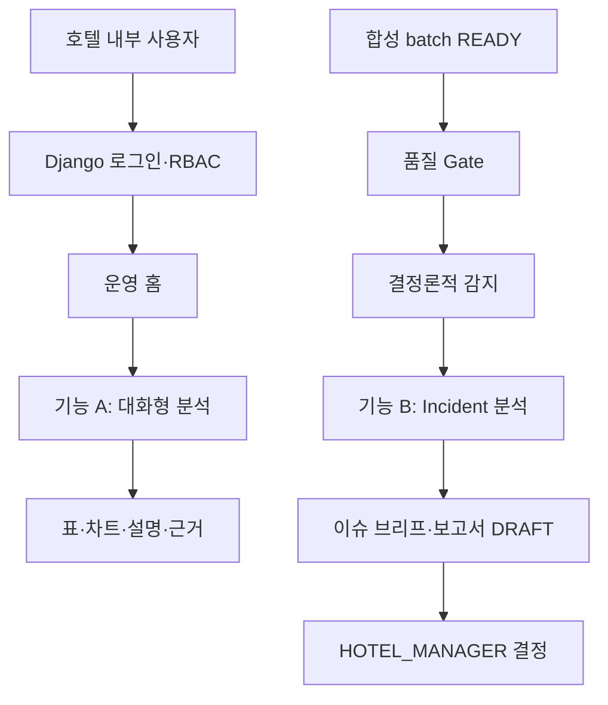

# Hotel Signal AI 공통 명세서

> 작업 전 필수 참고: `/AGENTS.md` → 이 문서 → 담당 작업별 공용 계약. 충돌 시 `AGENTS.md`와 `00_project_control.md`가 우선한다.

## 결론

Hotel Signal AI는 그랜드 워커힐 서울을 대상으로 모델링한 합성 데이터에서 권한 기반 대화형 분석과 이상 감지·근거 조사·주간 보고를 검증하는 내부 의사결정 지원 플랫폼이다. Baseline은 React, Django, Django worker, FastAPI, PostgreSQL, 외부 LLM을 실제 연결하며, 중간발표만 동일 JSON 계약의 frontend fixture로 시연한다.

## 사람이 판단해야 할 사항

- [ ] `PROJECT_CALIBRATION` 값: 탐지 임계값, 최소 표본, timeout, retry, backoff
  - 권장안: 실제 호텔 기준과 분리된 versioned 설정으로 승인한다.
  - 선택 시 영향: 합성 시나리오를 반복 재현할 수 있다.
  - 미선택 시 영향: trigger·장애 시험의 합격값을 확정할 수 없다.

- [ ] Django worker 구현 방식
  - 권장안: Baseline은 DB job table과 단일 worker process로 시작한다.
  - 선택 시 영향: Redis·Celery 없이 job+polling 계약을 검증할 수 있다.
  - 미선택 시 영향: 동시성 인프라가 일정과 장애 지점을 늘린다.

- [ ] 보고서 본문 저장 형식
  - 권장안: versioned JSON section과 렌더링 텍스트를 함께 저장한다.
  - 선택 시 영향: 근거 추적과 화면 수정이 쉽다.
  - 미선택 시 영향: 자유 텍스트만 저장하면 section·evidence 검증이 어렵다.

## 판단 체크리스트

- [ ] 기능 A와 기능 B를 독립적으로 실행·시험할 수 있는가
- [ ] Browser는 Django만 호출하는가
- [ ] Django가 검증한 `scope_snapshot`만 FastAPI가 사용하는가
- [ ] FastAPI DB 연결은 analysis view read-only인가
- [ ] 품질 Gate·trigger·KPI는 LLM 없이 재현 가능한가
- [ ] 모든 결과에 합성·기간·단위·표본·timezone·version이 표시되는가
- [ ] 승인 전 보고서가 `DRAFT·합성`으로 표시되는가
- [ ] 실제 호텔 현황·효과를 주장하는 문장이 없는가

## 필수 최소 기능 구현 방향

### 1. 프로젝트 정의

```text
property_id = GRAND_WALKERHILL_SEOUL
service_area_id = GW_BREAKFAST_DEMO
display_timezone = Asia/Seoul
storage_timezone = UTC
currency = KRW
data = synthetic only
```

최종 사용자는 `HOTEL_MANAGER`다. `FNB_MANAGER`, `ROOMS_MANAGER`는 권한 차이를 검증하는 보조 데모 역할이다. 실제 호텔 내부 데이터·권한·KPI·시설 귀속을 구현했다고 주장하지 않는다.

### 2. 단계별 범위

| 단계 | 포함 | 제외 |
|---|---|---|
| 중간발표 목업 | 6화면, frontend fixture, 가상 역할, 사전 작성 SQL·report | backend·DB·LLM 호출 |
| 기능 Baseline | 실제 로그인·RBAC, job+polling, Text-to-SQL, 품질 Gate, trigger, Incident workflow, report decision | 실제 시스템 연동·자동 조치 |
| 실험 트랙 | ML/DL, pgvector, sLLM, agent 구성 비교 | Baseline 필수 의존성 사용 |
| P1·P2 | 검증된 질문·시나리오·인프라 확장 | 승인 없는 선행 구현 |

### 3. Baseline 서비스 흐름



### 4. 서비스 책임

| 경계 | 책임 | 금지 |
|---|---|---|
| React | 6개 화면, polling, table·chart, 합성·version·근거·오류 표시 | 권한·trigger·KPI 직접 판정 |
| Django | 유일한 공개 API, 로그인·RBAC, scope 생성, job·report·decision·audit, DB migration | AI 분석·SQL 생성 중복 구현 |
| Django worker | job 상태·idempotency·FastAPI orchestration·결과 저장 | analytics view 직접 조회 |
| FastAPI | 품질 Gate, trigger, query plan·SQL Guard, read-only 분석, Incident LangGraph, LLM gateway | 사용자·권한 DB, report 승인 변경 |
| PostgreSQL | core/reporting, synthetic analytics view, run/evidence/audit | FastAPI migration 소유 |
| External LLM | evidence 기반 설명·보고 문장 | 수치·trigger·최종 원인·조치 결정 |

호출 방향은 `Client → Django → worker → FastAPI → Data/LLM`으로 고정한다.

### 5. 기능 A: 권한 기반 대화형 분석

1. Django가 로그인·역할·허용 scope를 검증한다.
2. `POST /api/query-jobs`가 `job_id`를 즉시 반환한다.
3. worker가 질문·scope snapshot·dataset version으로 FastAPI를 호출한다.
4. FastAPI가 semantic query plan을 만든다.
5. SQL Guard가 SELECT-only, allowlist, parameter binding, row limit, timeout, 권한, 비가산 재집계를 검사한다.
6. read-only analysis view를 조회한다.
7. 결정론적으로 표 데이터와 chart spec을 만든다.
8. 설명에 기간·단위·표본·timezone·dataset version·data cutoff·query ID를 포함한다.
9. Django가 plan·SQL hash·row count·결과를 저장한다.
10. React가 `GET /api/jobs/{job_id}`를 polling한다.

보장 의도는 KPI 조회, 전주·최근 4주 비교, 일별 추이, 시간대별 도착·대기, 처리량·대기, 인력·대기, 주제·감성별 VOC, 이상징후 근거 조회의 8종이다.

### 6. 기능 B: 이상 감지·자동 분석·주간 보고

1. 합성 dataset batch를 적재하고 READY 이벤트를 만든다.
2. FastAPI 결정론 모듈이 데이터 품질 Gate를 실행한다.
3. 통과한 데이터에 versioned rule을 실행한다.
4. Django worker가 `idempotency_key`로 중복 job을 막는다.
5. FastAPI Incident LangGraph가 운영·인력·VOC evidence를 수집한다.
6. 관측 사실·원인 후보·반대 근거·missing data·현장 확인 과제를 분리한다.
7. KPI·변화율은 SQL·Python으로 계산한다.
8. LLM은 evidence가 연결된 문장만 생성한다.
9. Django가 report DRAFT와 version을 저장한다.
10. `HOTEL_MANAGER`가 승인·보류·반려하고 결정 이력을 저장한다.

### 7. 역할과 scope

| 기능 | HOTEL_MANAGER | FNB_MANAGER | ROOMS_MANAGER |
|---|---:|---:|---:|
| 전체 합성 운영 집계 | 가능 | F&B 범위 | 객실 범위 |
| 조식 인력 상세 | 가능 | 가능 | 불가 |
| 객실 집계 | 가능 | 제한 | 가능 |
| 이슈 브리프 | 전체 | F&B | 객실·허용 요약 |
| 현장 확인 메모 | 가능 | 담당 이슈 | 담당 이슈 |
| 보고서 결정 | 가능 | 불가 | 불가 |

프론트 메뉴 숨김은 보안 통제가 아니다. Django가 모든 객체·metric·view 권한을 다시 검사한다.

### 8. 공통 상태값

Job:

```text
PENDING → RUNNING → SUCCEEDED
                  ↘ PARTIAL
                  ↘ NEEDS_DATA
                  ↘ FAILED
```

Report:

```text
DRAFT → APPROVED
DRAFT → ON_HOLD → DRAFT(new version)
DRAFT → REJECTED
```

Field note verification:

```text
CONFIRMED
PARTIALLY_CONFIRMED
UNCONFIRMED
DISPUTED
```

`READY_FOR_REVIEW`는 Incident 분석 결과의 화면 상태이며 report 저장 상태 `DRAFT`와 혼용하지 않는다.

### 9. 공통 API envelope

성공:

```json
{
  "data": {},
  "meta": {
    "request_id": "uuid",
    "timestamp": "ISO-8601 UTC",
    "dataset_version": "gw-synthetic-1.0.0",
    "schema_version": "1.0.0",
    "generator_version": "generator-v1",
    "scenario_id": "BREAKFAST_CONGESTION",
    "seed": 20260720,
    "virtual_as_of_date": "2026-08-16",
    "data_cutoff": "2026-08-16T14:59:59Z",
    "analysis_version": "analysis-v1",
    "is_synthetic": true,
    "demo_mode": false
  },
  "error": null
}
```

실패:

```json
{
  "data": null,
  "meta": {"request_id": "uuid", "timestamp": "ISO-8601 UTC"},
  "error": {
    "code": "VALIDATION_ERROR",
    "message": "요청값을 확인하세요.",
    "details": []
  }
}
```

### 10. 공통 요청 context

```json
{
  "request_id": "uuid",
  "run_id": "uuid",
  "actor_id": "demo-user-id",
  "role_code": "FNB_MANAGER",
  "scope_snapshot": {
    "property_ids": ["GRAND_WALKERHILL_SEOUL"],
    "metric_groups": ["BREAKFAST", "FNB_VOC"]
  },
  "dataset_version": "gw-synthetic-1.0.0",
  "virtual_as_of_date": "2026-08-16"
}
```

### 11. 데이터 계약 요약

물리 schema의 원본은 `02_data_standard_guide.md`다.

| 영역 | table·view |
|---|---|
| metadata | `dataset_manifest`, `dim_date`, `dim_service_area` |
| facts | `fact_rooms_daily`, `fact_breakfast_15m`, `fact_breakfast_daily`, `fact_staff_shift`, `fact_voc` |
| platform | `metric_catalog`, `role_scope`, `query_run`, `analysis_run`, `evidence`, `report`, `report_decision`, `field_note` |

모든 화면·API·보고서가 `is_synthetic`, `dataset_version`, `schema_version`, `generator_version`, `scenario_id`, `seed`, `virtual_as_of_date`, `data_cutoff`를 전달하거나 추적 가능한 참조를 가진다.

### 12. 결정론·LLM 경계

| 작업 | 주체 |
|---|---|
| PK/FK·단위·시간·결측 품질 검사 | SQL·Python |
| 이상 여부·threshold·minimum sample | versioned rule |
| KPI·p90·변화율·표본 수 | SQL·Python |
| query plan 후보·설명·보고 문장 | LLM 허용 |
| SQL safety·role scope·evidence schema | 결정론 검증 |
| 원인 확정·보상·인력 배치·최종 조치 | 사람, 시스템 밖 |

LLM 출력은 `evidence_id`가 없는 수치·사실 문장을 노출하지 않는다. 검증 실패 시 한 번 재생성하고 계속 실패하면 `PARTIAL`이다.

### 13. 오류·fallback

- 품질 Gate 실패: 감지 중단, `NEEDS_DATA`, 실패 항목 표시
- FastAPI timeout: 제한된 retry 후 `FAILED` 또는 보존 결과가 있으면 `PARTIAL`
- LLM timeout·invalid JSON: trigger·수치·evidence 유지, AI 설명만 실패 표시
- 권한 위반: SQL 미실행, 허용 범위 안내
- 중복 batch: 같은 `idempotency_key`의 incident·report 재생성 금지
- report version 충돌: 낙관적 잠금 오류 후 최신 version 재조회

### 14. 로그·감사

최소 기록:

```text
request_id, run_id, job_id, actor_id, role_code, scope_snapshot_hash,
dataset_version, schema_version, rule_version, analysis_version,
query_plan_hash, sql_hash, row_count, evidence_ids,
job_status, report_id, report_version, decision, error_code, timestamps
```

질문 원문·VOC 텍스트·token·secret은 일반 로그에 남기지 않는다.

### 15. 보안

- `.env`와 secret은 commit하지 않는다.
- Django가 인증·권한의 원본이다.
- FastAPI 내부 API는 service credential과 network restriction으로 보호한다.
- SQL은 SELECT-only·single statement·allowlist·binding·limit·timeout·read-only role을 적용한다.
- VOC 문장을 명령으로 실행하지 않는다.
- 실제 고객·직원 이름, 연락처, 예약번호, 객실번호를 생성·노출하지 않는다.

### 16. Definition of Done

- 요구사항·API·data·화면·test ID가 연결됐다.
- 정상·결측·충돌·권한·timeout·중복 반례를 시험했다.
- fixture와 실제 응답이 같은 JSON schema를 통과한다.
- 합성·demo·version 표시가 화면·API·보고서에서 일치한다.
- 수치가 source SQL과 일치하고 비가산 재집계가 차단된다.
- 승인 전 report가 확정본으로 표시되지 않는다.
- 실행 evidence와 미실행 검증을 구분한다.
- `git diff --check`가 통과하고 secret이 추가되지 않았다.

## 확장 방향

- P1: 보장 질문·이상 시나리오 확대, 필요 시 Celery·Redis, 실험 결과의 참고 노출
- P2: 실제 비식별 표본의 schema mapping, 임계값 재보정, read-only PMS adapter
- 제외: 실제 고객 응답, 자동 보상·업무 배정, 본사 자동 전송, swarm

## 변경 이력

| version | date | 변경 |
|---|---|---|
| `2.0` | 2026-07-20 | 최종 Baseline 기획서의 두 경로, 실제 Django/FastAPI 연결, 3역할, 6화면, job·schema 계약으로 전면 정합화 |
