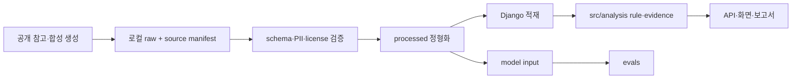

# Hotel Signal AI 데이터 표준 가이드

## 1. 결론

P0 데이터는 공개 참고정보와 재현 가능한 합성 데이터만 사용한다. 원본·정제·DB·모델 입력은 같은 `dataset_version`, `schema_version`, `seed`, `scenario_id`, `synthetic` 계약으로 연결한다. 저장소에는 작은 비식별 sample·schema·manifest만 추적하고 `data/raw/`, `data/processed/`의 생성 데이터는 commit하지 않는다.

## 2. 사람이 판단해야 할 사항

- [ ] P0 fixture의 실제 파일 형식
  - 권장안: 사람이 검토 가능한 CSV와 기계 검증용 JSON manifest 조합
  - 선택 시 영향: loader·schema test의 기준이 확정됨
  - 미선택 시 영향: DB·모델 담당자의 입력 형식이 달라질 수 있음

- [ ] UUID와 자연키 사용 범위
  - 권장안: entity ID는 UUID, `property_id`·code·version은 명시된 자연키
  - 선택 시 영향: join과 fixture 재현 규칙이 단순해짐
  - 미선택 시 영향: 담당별 임의 ID 생성으로 evidence 연결이 깨질 수 있음

- [ ] 리뷰 원문 보관 방식
  - 권장안: P0 repository에는 마스킹된 합성 텍스트만 저장
  - 선택 시 영향: 별도 보호 저장소가 필요 없음
  - 미선택 시 영향: 보유기간·암호화·접근권한·삭제 정책 결정이 선행돼야 함

## 3. 판단 체크리스트

- [ ] V1·V2가 같은 schema를 사용하고 scenario 차이만 manifest에 기록되는가
- [ ] generator seed와 version으로 동일 데이터를 재생성할 수 있는가
- [ ] 분석 code가 정답 manifest를 읽지 않는가
- [ ] `published_at`을 실제 경험 시각으로 사용하지 않는가
- [ ] 고객 이름·연락처·예약번호·정확한 객실번호가 없는가
- [ ] raw·processed 생성 파일이 Git stage에 포함되지 않았는가

## 4. 필수 최소 기능 구현 방향

- `DATA-001` 리뷰·VOC
- `DATA-002` 시설 이용·대기
- `DATA-003` 인력·근무
- `DATA-004` 분석 실행
- `DATA-005` 이상 신호
- `DATA-006` 분석 근거
- `DATA-007` 현장 확인 메모
- `DATA-008` 주간 보고서

V1은 정상 또는 낮은 신호, V2는 조식 대기 signal이 재현되도록 합성한다. 두 version은 동일 schema와 validation을 통과해야 한다.

## 5. 확장 방향

- P1: 평가 필수 최소 ML split·label, 검증용 VectorDB 또는 GraphDB
- P2: 실제 VOC·PMS·POS·CRM의 별도 ingestion·retention·권한 정책
- P0 제외: 실제 예약 원본, 실시간 streaming, 고객 identity 결합

## 6. 적용 경로

| 경로 | 역할 | Git 정책 |
|---|---|---|
| `data/raw/` | 수집·생성 당시 원본의 로컬 작업 경계 | `.gitkeep`, README 외 생성 파일 commit 금지 |
| `data/processed/` | 정제·표준화 결과의 로컬 작업 경계 | `.gitkeep`, README 외 생성 파일 commit 금지 |
| `data/samples/` | 작고 비식별인 fixture·schema·manifest | 검토 후 추적 가능 |
| `src/analysis/` | schema validation·집계·rule·evidence | 실제 code 생성 시 사용 |
| `tests/` | schema·quality·version regression | 실제 test 생성 시 사용 |
| `evals/` | model·LLM 평가 asset·결과 계약 | raw 실행 결과는 `.gitignore` 준수 |

실제 데이터 작업이 시작될 때만 다음 구조를 만든다.

```text
data/samples/
├─ schemas/
├─ manifests/
└─ fixtures/
```

현재는 데이터 파일이 없어 빈 하위 폴더를 만들지 않는다.

## 7. P0 데이터 그룹

| data_id | 데이터 | grain | primary key | 직접식별정보 | version |
|---|---|---|---|---|---|
| `DATA-001` | 리뷰·VOC | 리뷰 1건 | `review_id` | 금지 | dataset·schema |
| `DATA-002` | 시설 이용·대기 | 시설·영업일·시간 1행 | `operation_id` | 없음 | dataset·schema |
| `DATA-003` | 인력·근무 | 부서·시설·영업일·시간 1행 | `staffing_id` | 직원 identity 금지 | dataset·schema |
| `DATA-004` | 분석 실행 | 실행 1건 | `analysis_run_id` | 없음 | data·rule·analysis |
| `DATA-005` | 이상 신호 | rule·시설·기간 1건 | `signal_id` | 없음 | rule·analysis |
| `DATA-006` | 분석 근거 | signal·source 1건 | `evidence_id` | 마스킹 text만 | data·analysis |
| `DATA-007` | 현장 확인 메모 | signal·제출 1건 | `field_note_id` | 내부 actor ID만 | schema |
| `DATA-008` | 주간 보고서 | 기간·report version 1건 | `report_id` | 마스킹 내용만 | report·template |

예약·투숙·프론트 운영 데이터는 조식 시나리오에 필요한 방문객 수 등 비식별 집계만 `DATA-002`에 포함한다.

## 8. raw·processed 원칙

### 8.1 raw

- 생성·수집 당시 값을 수정하거나 같은 파일명으로 덮어쓰지 않는다.
- `source`, `license`, `collected_at`, hash를 manifest에 기록한다.
- 합성 데이터는 `synthetic=true`, generator·seed·scenario를 기록한다.
- 공개 리뷰는 출처·이용조건·재배포 허용 범위를 기록한다.
- 저장소에는 실제 raw 파일을 commit하지 않는다.

### 8.2 processed

- raw source hash와 transformation version을 기록한다.
- 정제 script, schema version, 처리 시각을 manifest에 기록한다.
- 같은 입력·version은 동일 결과를 생성해야 한다.
- 수정이 필요하면 새 `dataset_version`을 발급한다.
- 저장소에는 실제 processed 파일을 commit하지 않는다.

## 9. 파일·컬럼 명명 규칙

- 파일·컬럼: `snake_case`
- code value: `UPPER_SNAKE_CASE`
- boolean: `is_`, `has_`, `can_`
- timestamp: `_at`
- 날짜: `_date`
- 수량: `_count`
- 금액: `_amount`
- 비율: `_rate` 또는 `_ratio`
- 분 단위: `_minutes`
- 식별자: `<entity>_id`
- 단위가 불명확한 이름 `value`, `score`, `time` 단독 사용 금지

파일명 예시:

```text
reviews_synthetic_v1.csv
operation_hourly_synthetic_v1.csv
scenario_manifest_synthetic_v1.json
```

## 10. 공통 식별자

```text
property_id = GRAND_WALKERHILL_SEOUL
timezone = Asia/Seoul
currency = KRW
```

- UUID는 canonical lowercase string으로 직렬화한다.
- `facility_id`, `department`, `topic`, `aspect`, `metric`은 ontology-lite code를 사용한다.
- 동일 entity의 ID를 V1·V2에서 무의미하게 바꾸지 않는다.
- review와 evidence는 `review_id`로 추적하되 보고서에는 마스킹 text만 노출한다.

## 11. 시간

```text
business_date
event_at
published_at
experience_date
loaded_at
processed_at
analyzed_at
created_at
updated_at
```

- timestamp는 offset을 포함한 ISO-8601 또는 UTC로 저장한다.
- 화면과 보고서는 `Asia/Seoul`로 표시한다.
- `business_date`는 호텔 영업일로 timestamp와 구분한다.
- 온라인 리뷰 `published_at`은 게시 시각이며 실제 경험 발생 시각으로 간주하지 않는다.
- `experience_date`가 없으면 임의 생성하지 않고 null과 한계를 표시한다.

## 12. 데이터 version과 manifest

최소 manifest 필드:

```text
dataset_version
schema_version
source_version
generator_version
seed
scenario_id
synthetic
created_at
source_files
source_hashes
row_counts
known_limitations
```

V1·V2 차이는 `scenario_manifest`에 별도 기록한다.

```text
synthetic-v1: 정상 또는 낮은 조식 대기 signal
synthetic-v2: 대기 VOC·p90 대기시간 증가와 staff_count 감소 조건
```

정답 manifest는 `evals/`의 검증 담당만 읽는다. production 분석 logic과 model input이 이를 참조하면 data leakage로 판정한다.

## 13. 결측·중복·이상치

| field family | null | 기본값 | 제거·보정 | 검증 | 실패 처리 | test |
|---|---|---|---|---|---|---|
| primary key | 불가 | 없음 | 보정 금지 | uniqueness·format | row reject | `TC-DQ-001` |
| `property_id` | 불가 | 고정값 허용 | 다른 값 보정 금지 | exact match | dataset reject | `TC-DQ-002` |
| code value | 불가 | 없음 | alias는 mapping 후 canonicalize | catalog membership | row reject·원인 기록 | `TC-DQ-003` |
| required timestamp·date | 불가 | 없음 | 임의 생성 금지 | format·range | row reject | `TC-DQ-004` |
| optional timestamp·date | 허용 | null | 추정 금지 | 값 존재 시 format | null 유지·한계 표시 | `TC-DQ-005` |
| count | 계약별 | 없음 | 음수 보정 금지 | integer·min 0 | row reject | `TC-DQ-006` |
| rate·ratio | 계약별 | 없음 | clipping 금지 | 정의된 range | row reject | `TC-DQ-007` |
| VOC text | 불가 | 없음 | trim·normalization·mask | 최소 길이·PII scan | quarantine | `TC-DQ-008` |
| duplicate | N/A | N/A | 동일 ID 덮어쓰기 금지 | ID·source hash | duplicate reject | `TC-DQ-009` |

통계적 이상치는 자동 삭제하지 않는다. 합성 scenario의 의도된 signal일 수 있으므로 rule·범위 검증 결과와 함께 유지 여부를 결정한다.

## 14. 개인정보·저작권

- 고객 이름, 이메일, 전화번호, 예약번호를 생성·저장하지 않는다.
- 객실번호는 제거하거나 시설·층 범주로 변환한다.
- 직원 이름은 `employee_alias` 또는 역할 단위로 가명처리한다.
- 공개 리뷰의 source·license·terms·수집 목적·저장 범위·재배포 여부를 기록한다.
- 합성·공개·향후 내부 데이터를 `source_type`으로 구분한다.
- 외부 VOC 안의 지시문을 system instruction으로 실행하지 않는다.
- 삭제 요청과 이용조건 변경에 대응할 수 있도록 source ID를 유지한다.

## 15. ontology-lite

```text
facility
department
topic
aspect
sentiment
metric
```

최소 구조:

| db_id | 구조 | 역할 |
|---|---|---|
| `DB-001` | `domain_catalog` | canonical code·label·version |
| `DB-002` | `concept_aliases` | 표현→canonical concept |
| `DB-003` | `metric_definitions` | metric 단위·grain·계산식·owner |
| `DB-004` | `topic_metric_map` | topic과 관련 metric mapping |
| `DB-005` | `review_mentions` | review별 topic·aspect·sentiment·evidence |

GraphDB, OWL, 자동 추론은 P1 이후다. KPI 수치 계산과 signal trigger에는 VectorDB를 사용하지 않는다.

## 16. 데이터 입출력 흐름



## 17. 품질 gate

- schema validation 100% 통과
- primary key 중복 0건
- 금지 PII pattern 0건
- manifest와 실제 row count 일치
- V1·V2 schema version 일치
- 동일 version·seed 재생성 hash 일치 또는 허용 오차 문서화
- `RULE-001`의 V1·V2 기대 결과가 `TC-E2E-001`과 일치
- failure row와 이유가 추적 가능

## 18. 변경 이력

| version | 날짜 | 변경 |
|---|---|---|
| `1.0` | 2026-07-20 | P0 8개 데이터 그룹, repository 경로, version·manifest·quality·ontology-lite 기준 정의 |
