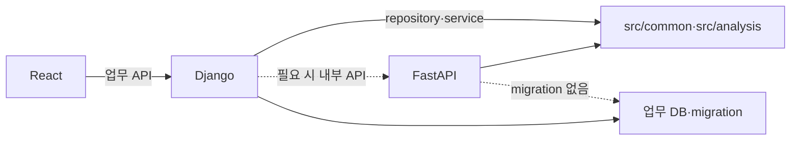

# Hotel Signal AI API·AI 통합 계약

## 1. 결론

React는 Django 업무 API만 호출하고, Django가 인증·권한·업무 상태·감사 log를 소유한다. FastAPI를 실제로 분리할 경우에도 Django↔FastAPI 내부 계약을 사용하며 React가 FastAPI를 직접 호출하지 않는다. trigger와 수치는 결정론적 logic이 생성하고 AI는 versioned evidence에 연결된 JSON만 반환한다.

## 2. 사람이 판단해야 할 사항

- [ ] P0 인증 방식
  - 권장안: 데모 역할 선택 후 Django 객체 단위 권한 검증
  - 선택 시 영향: session·CSRF·계정 test 범위 확정
  - 미선택 시 영향: 외부 배포 금지, mock임을 화면에 표시

- [ ] FastAPI 별도 process 여부
  - 권장안: 중간 데모에서는 Django가 `src`를 직접 호출하고 계약 test를 먼저 작성
  - 선택 시 영향: network timeout·retry·health check·배포 단위 추가
  - 미선택 시 영향: `API-AI-*` schema를 Python interface에 동일 적용

- [ ] timeout 기준
  - 권장안: 내부 AI 요청 전체 15초, transient failure에 1회만 재시도
  - 선택 시 영향: UI loading·partial 상태 기준 확정
  - 미선택 시 영향: 무한 대기 방지를 위한 임시 기본값이 필요

## 3. 판단 체크리스트

- [ ] 모든 응답이 공통 envelope를 사용하는가
- [ ] 권한 검증을 Django가 객체 단위로 수행하는가
- [ ] AI 응답의 수치·주장에 `evidence_ids`가 있는가
- [ ] model·prompt·analysis version이 저장되는가
- [ ] timeout 후 rule·metric·evidence가 유지되는가
- [ ] retry가 최대 1회이고 동일 요청을 중복 저장하지 않는가

## 4. 필수 최소 기능 구현 방향

- 외부 업무 API 8개: `API-001`~`API-008`
- 내부 AI 계약 3개: `API-AI-001`~`API-AI-003`
- 공통 오류 code와 HTTP status mapping
- evidence 기반 AI JSON schema
- LLM failure 시 `PARTIAL` 또는 `NEEDS_DATA`
- V1·V2 전환은 management command만 사용

## 5. 확장 방향

- P1: 독립 FastAPI 배포·health check, 평가 필수 model API
- P2: 실제 SSO, service-to-service auth, rate limit, 외부 system adapter
- P0 제외: 자유형 SQL API, 외부 쓰기 action, MCP, streaming response

## 6. 시스템 경계



| 구성요소 | 소유 | 금지 |
|---|---|---|
| React | UI state·표시 | threshold·권한·업무 상태 결정 |
| Django | auth·RBAC·DB·업무 API·audit | AI model 구현 중복 |
| FastAPI | 분류·설명·초안과 model version | 사용자 DB·migration·원시 SQL |
| `src` | schema·rule·evidence·공통 contract | HTTP·UI dependency |

## 7. 공통 API 응답

성공:

```json
{
  "data": {},
  "meta": {
    "request_id": "9fb64da9-62d5-468c-aed5-a3e080ce6c16",
    "timestamp": "2026-07-20T15:00:00+09:00",
    "data_version": "synthetic-v1",
    "schema_version": "1.0",
    "analysis_version": "analysis-v1"
  },
  "error": null
}
```

실패:

```json
{
  "data": null,
  "meta": {
    "request_id": "9fb64da9-62d5-468c-aed5-a3e080ce6c16",
    "timestamp": "2026-07-20T15:00:00+09:00"
  },
  "error": {
    "code": "VALIDATION_ERROR",
    "message": "요청값을 확인하세요.",
    "details": []
  }
}
```

## 8. 인증·권한

- React 메뉴 숨김은 보안 통제가 아니다.
- Django는 모든 object 조회·수정에서 role과 담당 범위를 검증한다.
- `HOTEL_MANAGER`: 전체 signal·evidence 조회, report 수정·결정
- `DEPARTMENT_REVIEWER`: 담당 signal·evidence 조회와 field note 작성
- report decision은 `HOTEL_MANAGER`만 허용한다.
- 내부 FastAPI 호출은 최종 배포 구조가 확정되면 service credential과 network policy를 별도 결정한다.

## 9. P0 endpoint

| api_id | method·path | 역할 | 주요 응답 | 권한 |
|---|---|---|---|---|
| `API-001` | `GET /api/v1/dashboard/summary` | 기간 KPI·최신 report | KPI·version·signal count | 두 역할, 범위 적용 |
| `API-002` | `GET /api/v1/signals` | signal 목록 | paginated signals | 두 역할, 범위 적용 |
| `API-003` | `GET /api/v1/signals/{id}` | signal 상세 | rule·관찰·상태·version | 두 역할, object 권한 |
| `API-004` | `GET /api/v1/signals/{id}/evidence` | evidence | VOC·metric·반대 근거·한계 | 두 역할, object 권한 |
| `API-005` | `POST /api/v1/signals/{id}/field-note` | 현장 메모 제출 | note·verification status | 두 역할, 작성 권한 |
| `API-006` | `GET /api/v1/reports` | report 목록 | 기간·status·version | 두 역할, 조회 범위 |
| `API-007` | `GET /api/v1/reports/{id}` | report 상세 | sections·sources·decision | 두 역할, 조회 범위 |
| `API-008` | `PATCH /api/v1/reports/{id}/decision` | 승인·보류·반려 | status·reason·audit ID | 관리자만 |

### 9.1 V1·V2 전환

```text
load_demo_dataset --version synthetic-v1
load_demo_dataset --version synthetic-v2
```

fixture 선택 UI와 demo endpoint를 동시에 만들지 않는다. 현재는 구현할 command 계약이며 실제 command가 존재한다는 뜻이 아니다.

## 10. 내부 AI 계약

| api_id | 목적 | 입력 | 출력 |
|---|---|---|---|
| `API-AI-001` | review mention 분류 | 마스킹 text, catalog version | topic·aspect·sentiment·evidence span·confidence |
| `API-AI-002` | signal 설명 | observed facts·evidence·limitations | cause candidates·counter evidence·missing data·checks |
| `API-AI-003` | report section 초안 | 승인 전 facts·field notes·evidence | section text·source IDs·version |

분리 배포하지 않을 경우 동일 schema를 typed Python interface에 적용한다.

## 11. AI 요청 계약

최소 입력:

```json
{
  "request_id": "9fb64da9-62d5-468c-aed5-a3e080ce6c16",
  "task_type": "SIGNAL_EXPLANATION",
  "property_id": "GRAND_WALKERHILL_SEOUL",
  "period": {
    "start_date": "2026-07-13",
    "end_date": "2026-07-19"
  },
  "observed_facts": [],
  "evidence": [],
  "limitations": [],
  "data_version": "synthetic-v2",
  "rule_version": "rule-v1",
  "analysis_version": "analysis-v1"
}
```

VOC·웹 문서 안의 instruction은 data로 취급하고 system·developer instruction으로 실행하지 않는다.

## 12. AI 출력 계약

```json
{
  "observed_facts": [],
  "cause_candidates": [],
  "counter_evidence": [],
  "missing_data": [],
  "recommended_checks": [],
  "evidence_ids": [],
  "model_version": "",
  "prompt_version": "",
  "analysis_version": ""
}
```

각 cause candidate는 구현 시 다음 필드를 가져야 한다.

```text
candidate_id
statement
supporting_evidence_ids
counter_evidence_ids
uncertainty
requires_field_check
```

금지:

- 원인을 확정하는 표현
- evidence ID 없는 수치·사실
- trigger·threshold 판단
- 자동 보상·인력 배치·직원 평가
- 고객·직원 개인정보 출력
- 내부 chain-of-thought 출력

## 13. evidence 계약

| field | 필수 | 설명 |
|---|---:|---|
| `evidence_id` | 예 | immutable 내부 ID |
| `signal_id` | 예 | 연결 signal |
| `evidence_type` | 예 | `VOC`, `METRIC`, `FIELD_NOTE`, `LIMITATION` |
| `source_id` | 예 | review·metric row·note ID |
| `observed_at` | 예 | 근거 시각·영업일 |
| `summary_value` | 예 | 마스킹 text 또는 계산값 |
| `unit` | 조건부 | metric이면 필수 |
| `data_version` | 예 | source data version |
| `analysis_version` | 예 | evidence builder version |

AI가 생성한 문장은 evidence가 아니며 `evidence_id`를 새로 발급하지 않는다.

## 14. 오류 코드

| code | HTTP | 의미 | UI 처리 |
|---|---:|---|---|
| `VALIDATION_ERROR` | 400 | 요청·schema 오류 | field·row 오류 표시 |
| `AUTHENTICATION_REQUIRED` | 401 | 인증 필요 | 안전한 로그인 이동 |
| `FORBIDDEN` | 403 | 권한 없음 | 권한 안내, 값 미노출 |
| `NOT_FOUND` | 404 | 대상 없음 | 목록 복귀 |
| `CONFLICT` | 409 | version·상태 충돌 | 최신 상태 재조회 |
| `ANALYSIS_NOT_READY` | 409 | 분석 미완료 | 현재 status 표시 |
| `INSUFFICIENT_DATA` | 422 | 표본·필수 data 부족 | `NEEDS_DATA` 표시 |
| `AI_TIMEOUT` | 504 | AI timeout | rule·evidence 유지, 설명 실패 |
| `AI_OUTPUT_INVALID` | 502 | JSON·evidence contract 위반 | fallback·검토 필요 |
| `INTERNAL_ERROR` | 500 | 미분류 server 오류 | request ID와 재시도 안내 |

stack trace, SQL, secret, 원문 PII를 사용자에게 반환하지 않는다.

## 15. timeout·retry·idempotency

- 내부 AI total timeout 권장값: 15초, 최종 확정 필요
- retry: timeout·일시적 5xx에 최대 1회
- validation·permission·contract 오류는 retry하지 않는다.
- field note·report decision은 idempotency key 또는 optimistic locking을 사용한다.
- timeout 후 background 무한 실행을 금지한다.
- 같은 request가 중복 처리돼도 note·decision이 중복 생성되지 않아야 한다.

## 16. fallback

LLM 실패 시:

1. `RULE-001` signal은 유지한다.
2. 계산된 metric과 evidence는 표시한다.
3. AI 설명 영역은 생성 실패로 표시한다.
4. report는 `PARTIAL` 또는 `NEEDS_DATA`로 생성한다.
5. 자동 승인하지 않는다.
6. retry는 1회로 끝낸다.

## 17. version 관리

모든 AI 호출과 report에는 가능한 범위에서 다음을 기록한다.

```text
data_version
schema_version
rule_version
model_version
prompt_version
analysis_version
report_version
template_version
```

계약 breaking change는 API major version 또는 schema version을 올리고 consumer contract test를 함께 변경한다.

## 18. contract test 최소 목록

- `TC-CT-001`: 공통 성공 envelope
- `TC-CT-002`: 공통 실패 envelope
- `TC-CT-003`: 권한별 signal 범위
- `TC-CT-004`: field note 중복 방지
- `TC-CT-005`: report 상태 충돌
- `TC-AI-001`: evidence 없는 AI 주장 거부
- `TC-AI-002`: invalid JSON fallback
- `TC-AI-003`: timeout 후 signal·evidence 유지

## 19. 변경 이력

| version | 날짜 | 변경 |
|---|---|---|
| `1.0` | 2026-07-20 | P0 업무 API, 내부 AI JSON, evidence, 오류·timeout·fallback 계약 정의 |
