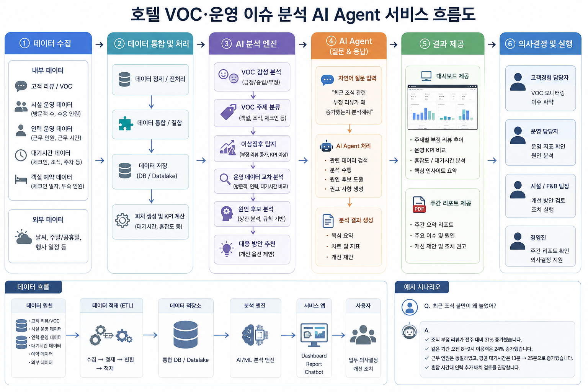

# 문서 관리 규칙

| 항목 | 내용 |
|---|---|
| 문서 설명 | 프로젝트 산출물 작업본 작성, 템플릿 대조, 형식 변환 및 문서 간 정합성 검증 기준 |
| 문서 분류 | 규칙 문서 |
| 버전 | v2.8 |
| 문서 기준일 | 2026-07-22 16:50 |
| 작성·수정 | 박준희 |
| 권장 저장 위치 | `docs/문서관리규칙.md` |

## 1. 목적과 적용 범위

이 문서는 프로젝트 문서의 저장·작성·검증·변환·제출 전 과정을 관리하며, 공식 산출물의 원고를 Markdown으로 작성하고 DOCX·XLSX·PPTX·MP4·소스 묶음 등으로 변환하거나 제출할 때 적용한다.

검증의 중심은 다음과 같다.

1. 템플릿과 일정 문서가 요구하는 필수 목차·필드·내용의 누락 여부
2. 프로젝트 사실, 실제 코드, 테스트, 데이터와 문서 내용의 일치 여부
3. 요구사항·WBS·설계·구현·테스트·발표 사이의 추적성과 일관성
4. 저장 위치, 파일명, 문서 헤더, 보호 폴더, 제출본 동기화 규칙 준수 여부

일반적인 “초과 내용 검사”는 하지 않는다. 다만 추가 내용은 템플릿의 가장 가까운 필수 항목 아래에 배치하고, 공식 양식의 제목·순서·계층과 XLSX 기본 시트·필드 구조를 훼손하지 않아야 한다.

## 2. 문서 근거와 충돌 처리

### 2.1 정보 확인 기준

근거의 우선순위는 판단 목적에 따라 나눈다.

- 현재 요구사항·기획·운영 내용은 아래 `작업별 참고 문서`의 활성 Markdown을 기준으로 한다.
- 실제 구현 여부와 성능은 코드·테스트·데이터를 기준으로 한다.
- 공식 마감·산출물 번호·제출 요건은 최신 공식 공지와 최종 프로젝트 일정 문서를 기준으로 한다.
- 이미 제출한 시점의 내용은 `deliverables/` 제출본을 기준으로 하되 현재 운영 내용으로 전용하지 않는다.
- 보조 분석 문서와 일일·주간보고는 근거·이력으로 사용하고, `templates/`는 구조·필드 확인에만 사용한다.

- 템플릿은 목차·구조·필수 필드의 기준이며 프로젝트의 최신 사실, 일정, 구현 상태 또는 성능 결과의 근거가 아니다.
- 요구사항·범위·수용 기준은 `01_요구사항정의서.md`를 기준으로 한다.
- 일정·담당·진행 상태는 `02_WBS.md`를 기준으로 한다.
- 화면 상세는 요구사항을 준수하는 범위에서 `05_화면설계서_초안.md`와 실제 구현을 확인한다.
- 공식 마감·산출물 번호·제출 요건은 최종 프로젝트 일정 문서와 최신 공식 공지를 확인한다.
- 현재 구현 여부는 문서만으로 확정하지 않고 실제 코드·테스트·데이터를 확인한다.

### 2.2 충돌 발견 시 기록 형식

```md
#### 충돌 기록

| 항목 | 기준 A | 기준 B | 적용 근거 | 적용 결정 | 확인 필요 |
|---|---|---|---|---|---|
| 예: 제출일 | WBS 07-31 | 공식 공지 08-01 | 최신 공식 공지 | WBS 갱신 필요 | 팀 확인 |
```

충돌을 임의로 평균내거나 서로 다른 내용을 섞지 않는다. 차이, 기준일, 근거와 적용 결정을 기록하고 편집 가능한 문서에만 후속 내용을 반영한다.

## 답변 참고 라우팅

아래 규칙은 사용자 질문에 답할 때 기존 Markdown 문서를 찾는 기준이다. 새 문서 생성이나 답변 저장 위치를 정하는 규칙이 아니다. 저장소 문서로 답변할 수 있으면 해당 문서를 먼저 읽고, 문서에 없는 내용이나 시점에 따라 바뀔 수 있는 정보는 확인 한계를 밝히고 필요한 경우 최신 공식 출처로 재검증한다.

| 질문의 중심 주제 | 우선 확인 위치 | 답변 기준 |
|---|---|---|
| 워커힐 기업·브랜드·시설·시장·비즈니스 모델·AI Guide·WISE·공식 VOC 채널·워커힐 적용안 | `docs/markdown/walkerhill/`의 관련 Markdown 전체 | `워커힐_기업분석.md`를 종합 기준으로 삼고 세부 주제 문서를 함께 확인한다. 워커힐의 변동 가능한 사실은 문서 기준일과 최신 공식 출처를 대조한다. |
| 범용 호텔 VOC, VOC-to-Action, AI Agent의 목표·기능·데이터·분석·평가·안전·Human-in-the-loop | `docs/markdown/voc/`의 관련 Markdown 전체 | `HOTEL_VOC_AI_AGENT.md`를 서비스 정의 기준으로 삼고 `VOC_핵심개선사항_분석.md`를 방법론·고도화 참고로 사용한다. 프로젝트 범위 질문이면 `01_요구사항정의서.md`와 `02_WBS.md`도 확인한다. |
| 프로젝트 요구사항·일정·기획·화면 | `docs/markdown/`의 번호 문서 | 아래 `작업별 참고 문서` 표에서 질문에 맞는 1차 기준 문서를 선택한다. |
| 최종 프로젝트 일정·산출물·교육 운영 | `docs/markdown/final_project/` | 정확한 마감일·번호는 전체 일정 문서를 우선하고 이후 공식 공지가 있는지 확인한다. |
| Git 협업 또는 일일·주간보고 | `docs/markdown/collaboration/`, `docs/markdown/daily_reports/` | 각 폴더의 `README.md`를 먼저 읽고 실제 branch 상태나 개별 보고 내용을 함께 확인한다. |
| 위 분류에 없는 질문 | `docs/markdown/` 전체와 아래 작업별 표 | 파일명만으로 판단하지 않고 관련 문서의 범위·기준일·근거 수준을 확인한다. 문서 근거가 부족하면 추정하지 않는다. |

혼합 질문은 관련 폴더를 모두 확인한다. 예를 들어 “워커힐에 VOC Agent를 적용하는 방법”은 `walkerhill/`을 1차, `voc/`를 보조 근거로 사용하고, “호텔 VOC Agent를 설계하면서 워커힐을 사례로 사용”은 `voc/`를 1차, `walkerhill/`을 사례 근거로 사용한다.

## 작업별 참고 문서

| 작업 유형 | 1차 기준 문서 | 보조 참고 문서 | 사용 시 주의사항 |
|---|---|---|---|
| 문서 위치·파일명·번호 결정 | `docs/문서관리규칙.md` | `markdown/final_project/최종_프로젝트_산출물_및_전체_일정.md` | 공식 산출물 번호는 일정 문서의 마감 순서를 사용한다. |
| 기능 범위·요구사항 ID·우선순위·수용 기준·비기능 요구사항 | `markdown/01_요구사항정의서.md` | `markdown/voc/HOTEL_VOC_AI_AGENT.md`, `markdown/03_프로젝트기획서.md` | 일정·담당·현황은 요구사항 문서에서 판단하지 않고 `02_WBS.md`를 사용한다. |
| 실행 일정·담당·현황·제출일·작업 이력 | `markdown/02_WBS.md` | `markdown/final_project/최종_프로젝트_산출물_및_전체_일정.md` | `02_WBS.md`가 저장소 일정 관리의 단일 기준이다. 공식 공지 마감이 바뀌면 일정 문서를 먼저 확인한 뒤 WBS를 동기화한다. |
| 프로젝트 배경·목표·비목표·사용자·가치·아키텍처 요약·리스크·완료 정의 | `markdown/03_프로젝트기획서.md` | `markdown/01_요구사항정의서.md`, `markdown/final_project/최종_프로젝트_오프닝_자료_요약_3팀.md` | 요구사항은 `01`, 일정·담당은 `02`가 우선한다. 기획서의 과거 역할 표기는 현재 담당 근거로 사용하지 않는다. |
| 화면 구조·IA·사용자 흐름·화면 상태·접근성·UI QA | `markdown/05_화면설계서_초안.md` | `markdown/01_요구사항정의서.md`, `서비스흐름도.png` | 초안의 기술명·추적 ID는 `01`과 실제 구현을 다시 대조하고, 충돌하면 요구사항을 우선한다. |
| 서비스 개념 흐름·발표용 처리 순서 | `서비스흐름도.png` | `markdown/03_프로젝트기획서.md`, `markdown/05_화면설계서_초안.md` | 개념 이미지일 뿐 기능·데이터·리포트 형식의 계약으로 사용하지 않는다. |
| 범용 호텔 VOC·AI Agent 정의, MVP, 데이터 구조, 분석·표현 원칙 | `markdown/voc/HOTEL_VOC_AI_AGENT.md` | `markdown/voc/VOC_핵심개선사항_분석.md`, `markdown/01_요구사항정의서.md` | 프로젝트 구현 범위는 번호가 붙은 요구사항·WBS 문서와 실제 코드·테스트를 다시 확인한다. |
| VOC 방법론·고도화·평가·개선 백로그·재발 추적 | `markdown/voc/VOC_핵심개선사항_분석.md` | `markdown/voc/HOTEL_VOC_AI_AGENT.md` | 논문 사례의 빈도·우선순위·Kano 결과를 워커힐 현황으로 전용하지 않고, 제안 기능을 자동으로 MVP에 추가하지 않는다. |
| 워커힐 전체 기업·사업·브랜드·디지털·VOC 적용성 | `markdown/walkerhill/워커힐_기업분석.md` | 나머지 `walkerhill/` 문서와 `voc/` 문서 | `[사실]`, `[해석]`, `[가정]`, `[확인 필요]`를 구분하며 워커힐 내부 운영 현황을 추정하지 않는다. |
| 워커힐 서울 숙박·예약·객실 VOC | `markdown/walkerhill/워커힐_기업분석_VOC관점.md` | `markdown/walkerhill/워커힐_기업분석.md` | 고정 범위는 그랜드·비스타의 객실 숙박과 예약 여정이며 전사 분석으로 확대하지 않는다. |
| 워커힐 비즈니스 모델·고객군·채널·수익 구조 | `markdown/walkerhill/워커힐_호텔_BM_분석.md` | `markdown/walkerhill/워커힐_기업분석.md` | 실제 세부 매출·비용·데이터 보유 사실로 단정하지 않는다. |
| 워커힐 시장·관광·럭셔리·AI·ESG·모빌리티 동향 | `markdown/walkerhill/워커힐_호텔_시장동향_VOC_시사점.md` | `markdown/walkerhill/워커힐_기업분석.md` | 전망치와 시장 수치는 최신 공식 출처로 재확인한다. |
| 공식 산출물 마감·주차·번호·작성 요건·제출 점검 | `markdown/final_project/최종_프로젝트_산출물_및_전체_일정.md` | `markdown/02_WBS.md` | 2026-07-15 조회 스냅샷이므로 이후 공식 공지는 우선하되 보호된 스냅샷을 수정하지 않고 `02_WBS.md` 등 편집 가능한 문서에 반영한다. |
| 과정 주제·필수 수행 단계·비즈니스 연계·리소스·멘토링·발표 운영 | `markdown/final_project/최종_프로젝트_오프닝_자료_요약_3팀.md` | `markdown/final_project/최종_프로젝트_산출물_및_전체_일정.md` | 정확한 마감일과 산출물 세부는 전체 일정 문서를 우선한다. |
| Git 협업·hook·개인 branch·dev/main 통합 | `markdown/collaboration/README.md` | 저장소 루트 `AGENTS.md` | 사용자 지시와 `AGENTS.md`가 우선하며 README는 구체 Git 절차를 제공한다. |
| 일일·주간보고 작성·통합 | `markdown/daily_reports/README.md` | 각 branch의 `일일보고.md`, `team_summaries/N주차/YYYYMMDD.md`, `team_summaries/N주차/주간보고.md` | 개별 일일보고가 실제 수행 사실의 1차 근거이고 날짜별 팀 요약·주간보고는 파생 요약이다. 현재 요구사항·일정을 보고서에서 추정하지 않는다. |
| 공식 제출 파일 작성·검증 | 같은 번호의 `markdown/` 작업본과 `final_project` 일정 문서 | `templates/`의 해당 양식, `deliverables/`의 기존 제출본 | 템플릿은 목차·구조의 기준이며 프로젝트 사실·최신 일정의 근거는 아니다. 기존 제출본을 명시적 요청 없이 덮어쓰지 않는다. |
| 제출된 요구사항·WBS 내용 확인 | `deliverables/01_요구사항정의서_29기_3팀.xlsx`, `deliverables/02_WBS_29기_3팀.xlsx` | `markdown/01_요구사항정의서.md`, `markdown/02_WBS.md` | Excel은 제출본이고 Markdown은 현재 편집·운영 기준이다. 제출 전 양방향 동기화를 검증한다. |

### 참고 우선순위와 충돌 처리

1. **문서 작업 절차:** 사용자의 현재 명시 지시 → 저장소 루트 `AGENTS.md` → 이 문서와 `manage-project-documents` Skill 순서로 적용한다. Git·보고 작업은 각각의 전용 README와 Skill을 따른다.
2. **내용 판단:** 위 `2.1 정보 확인 기준`에 따라 목적별 기준을 선택하고, 위 표의 1차 기준 문서 → 보조 분석 문서 → 일일·주간보고 순서로 확인한다. `templates/`는 내용 판단 근거가 아니다.
3. 요구사항·범위·수용 기준은 `01_요구사항정의서.md`, 실행 일정·담당·현황은 `02_WBS.md`, 화면 상세는 요구사항을 준수하는 범위에서 `05_화면설계서_초안.md`, 공식 마감·번호는 최종 프로젝트 전체 일정 문서를 우선한다.
4. 워커힐의 최신 상태·시장 수치·AI Guide·WISE 등 변동 가능한 사실은 문서 기준일을 확인하고 공식 출처로 재검증한다.
5. 문서의 `[사실]`과 직접 근거는 `[해석]`, `[가정]`, `[추가 제안]`보다 우선한다. `현재 구현` 주장은 문서만으로 확정하지 않고 실제 코드·WBS·테스트를 확인한다.
6. 충돌을 발견하면 임의로 내용을 합치지 말고 차이, 기준일과 우선 기준을 기록한 뒤 필요한 확인 사항을 남긴다.

## 3. 저장소 구조와 보호 규칙

아래 번호형 작업본 목록은 목표 경로를 나타낸다. 실제로 생성된 파일만 현재 작업·검토 대상으로 삼으며, 없는 번호 문서를 이 규칙만으로 새로 만들지 않는다.

```text
docs/
├─ 문서관리규칙.md
├─ 서비스흐름도.png 등 소수의 보조 파일
├─ markdown/
│  ├─ 01_요구사항정의서.md
│  ├─ 02_WBS.md
│  ├─ 03_프로젝트기획서.md
│  ├─ 04_수집데이터보고서.md
│  ├─ 05_화면설계서.md
│  ├─ 06_데이터베이스저장소설계서.md
│  ├─ 07_데이터전처리결과서.md
│  ├─ 08_중간발표자료.md
│  ├─ 09_머신러닝딥러닝학습결과서.md
│  ├─ 10_학습MLDL모델.md
│  ├─ 11_벡터DBGraphDB구축결과서.md
│  ├─ 12_AI시스템아키텍처.md
│  ├─ 13_LLM활용소프트웨어.md
│  ├─ 14_자체sLLM인공지능.md
│  ├─ 15_멀티에이전트테스트계획및결과보고서.md
│  ├─ 16_시스템구성도.md
│  ├─ 17_개발된LLM연동웹애플리케이션.md
│  ├─ 18_서비스테스트계획및결과보고서.md
│  ├─ 19_최종발표자료.md
│  ├─ 20_프로젝트개발소스코드.md
│  ├─ 21_시연영상.md
│  ├─ walkerhill/
│  ├─ voc/
│  ├─ final_project/          # 읽기 전용
│  ├─ collaboration/
│  └─ daily_reports/
├─ deliverables/             # 공식 제출 파일만
└─ templates/                # 제공 원본, 읽기 전용
```

### 3.1 폴더 역할

- `docs/markdown/`: 모든 Markdown 작업본, 일반 문서, 협업·보고 문서
- `docs/deliverables/`: 제출하는 공식 문서, 이미지, 영상, 모델, 소스 묶음
- `docs/templates/`: 제공받은 27기 원본 양식
- `docs/markdown/final_project/`: 공식 일정과 교육 운영 스냅샷
- `docs/` 바로 아래: 규칙 문서와 소수의 보조 이미지·다이어그램만 허용

### 3.2 읽기 전용 보호

다음 경로의 파일은 읽기만 한다.

```text
docs/markdown/final_project/
docs/templates/
```

금지 작업:

- 생성, 수정, 삭제, 이동, 이름 변경, 덮어쓰기
- 자동 formatting, 일괄 치환, 링크 경로 자동 갱신
- 템플릿의 팀명·기수·예시 내용을 원본 파일에 직접 반영

변경 필요성을 발견하면 사용자에게 알리고 `docs/markdown/`, `docs/markdown/02_WBS.md`, 신규 검토본 또는 `docs/deliverables/`의 승인된 결과에 반영한다.

## 4. 파일명과 산출물 번호

### 4.1 공식 제출 파일

```text
두 자리 번호_문서이름_29기_3팀.확장자
```

예:

```text
01_요구사항정의서_29기_3팀.xlsx
02_WBS_29기_3팀.xlsx
03_프로젝트기획서_29기_3팀.docx
19_최종발표자료_29기_3팀.pptx
```

복수 파일 산출물은 같은 이름의 폴더를 사용한다.

```text
docs/deliverables/10_학습MLDL모델_29기_3팀/
docs/deliverables/17_개발된LLM연동웹애플리케이션_29기_3팀/
```

### 4.2 Markdown 작업본

```text
팀 공동 작업본: 01~21_산출물이름.md
개인 작업본·초안: 01~21_산출물이름_구분어.md
```

같은 번호의 Markdown이 제출 파일의 원고가 된다. 일반 조사·분석 문서에는 산출물 번호를 붙이지 않는다.

### 4.3 공식 산출물 번호

| 번호 | 산출물 | Markdown 작업본 예시 | 공식 결과 형식 |
|---:|---|---|---|
| 01 | 요구사항정의서 | `markdown/01_요구사항정의서.md` | XLSX |
| 02 | WBS | `markdown/02_WBS.md` | XLSX |
| 03 | 프로젝트기획서 | `markdown/03_프로젝트기획서.md` | DOCX |
| 04 | 수집데이터보고서 | `markdown/04_수집데이터보고서.md` | DOCX |
| 05 | 화면설계서 | `markdown/05_화면설계서_초안.md` | 일정 문서 요건에 따름 |
| 06 | 데이터베이스저장소설계서 | `markdown/06_데이터베이스저장소설계서.md` | DOCX |
| 07 | 데이터전처리결과서 | `markdown/07_데이터전처리결과서.md` | DOCX |
| 08 | 중간발표자료 | `markdown/08_중간발표자료.md` | PPTX |
| 09 | 머신러닝딥러닝학습결과서 | `markdown/09_머신러닝딥러닝학습결과서.md` | DOCX |
| 10 | 학습MLDL모델 | `markdown/10_학습MLDL모델.md` | DOCX·모델 묶음 |
| 11 | 벡터DBGraphDB구축결과서 | `markdown/11_벡터DBGraphDB구축결과서.md` | DOCX |
| 12 | AI시스템아키텍처 | `markdown/12_AI시스템아키텍처.md` | DOCX |
| 13 | LLM활용소프트웨어 | `markdown/13_LLM활용소프트웨어.md` | 일정 문서 요건에 따름 |
| 14 | 자체sLLM인공지능 | `markdown/14_자체sLLM인공지능.md` | DOCX |
| 15 | 멀티에이전트테스트계획및결과보고서 | `markdown/15_멀티에이전트테스트계획및결과보고서.md` | DOCX |
| 16 | 시스템구성도 | `markdown/16_시스템구성도.md` | DOCX |
| 17 | 개발된LLM연동웹애플리케이션 | `markdown/17_개발된LLM연동웹애플리케이션.md` | DOCX·실행 묶음 |
| 18 | 서비스테스트계획및결과보고서 | `markdown/18_서비스테스트계획및결과보고서.md` | DOCX |
| 19 | 최종발표자료 | `markdown/19_최종발표자료.md` | PPTX |
| 20 | 프로젝트개발소스코드 | `markdown/20_프로젝트개발소스코드.md` | 소스 묶음 |
| 21 | 시연영상 | `markdown/21_시연영상.md` | MP4·설명 문서 |

번호와 제출일은 `docs/markdown/final_project/최종_프로젝트_산출물_및_전체_일정.md`를 확인한다. 보호된 일정 문서는 수정하지 않고 변경 사항을 `02_WBS.md`에 동기화한다.

### 4.4 작업본·제출본·템플릿 매핑

아래 표는 작성 편의를 위한 요약이다. 실제 경로 또는 일정이 변경되면 `docs/문서관리규칙.md`와 최종 프로젝트 일정 문서를 우선한다.

| 번호 | 작성 시 확인 순서 |
|---:|---|
| 01 | `markdown/01_요구사항정의서.md` → 기존 `deliverables/01_...xlsx` → 요구사항 정의서 XLSX 템플릿 |
| 02 | `markdown/02_WBS.md` → 기존 `deliverables/02_...xlsx` → WBS XLSX 템플릿 2종 |
| 03 | `markdown/03_프로젝트기획서.md` → 프로젝트 기획서 DOCX 템플릿 |
| 04 | 전체 일정의 작성 요건 → 수집 데이터 보고서 DOCX 템플릿 |
| 05 | `markdown/05_화면설계서_초안.md` → 요구사항 → 서비스흐름도 · 전용 템플릿 없음 |
| 06 | 전체 일정의 작성 요건 → 데이터베이스/저장소 설계 DOCX 템플릿 |
| 07 | 실제 전처리 코드·검증 결과 → 데이터 전처리 결과서 DOCX 템플릿 |
| 08 | 현재 기획·WBS·구현 결과 → 중간 발표 PPTX 템플릿 |
| 09 | 실제 모델 비교·평가 결과 → ML/DL 학습 결과서 DOCX 템플릿 |
| 10 | 실제 저장 모델·재현 절차 → 학습한 ML/DL 모델 DOCX 템플릿 |
| 11 | 실제 DB 스키마·검색 평가 → VectorDB/GraphDB 구축 결과서 DOCX 템플릿 |
| 12 | 실제 시스템·Agent 구조 → AI 시스템 아키텍처 DOCX 템플릿 |
| 13 | 요구사항·VOC 서비스 정의·실제 코드·테스트 · 전용 템플릿 없음 |
| 14 | 실제 학습 데이터·기본/학습 모델 비교 → 자체 sLLM DOCX 템플릿 |
| 15 | 실제 Agent 설계·테스트 결과 → 멀티 에이전트 테스트 DOCX 템플릿 |
| 16 | 실제 배포 구성·기술 버전 → 시스템 구성도 DOCX 템플릿 |
| 17 | 실제 실행 가능한 웹앱·보안 점검 → LLM 연동 웹 애플리케이션 DOCX 템플릿 |
| 18 | 실제 사용자 시나리오·통합 테스트 → 서비스 테스트 DOCX 템플릿 |
| 19 | 전체 산출물·구현·평가·시연 결과 → 최종 발표 PPTX 템플릿 |
| 20 | 실제 저장소 소스·README·실행 절차 · 전용 템플릿 없음 |
| 21 | 실제 대표 시나리오·MP4 검증 · 전용 템플릿 없음 |

## 5. Markdown 작업본 공통 형식

### 5.1 문서 헤더

모든 번호 작업본은 최상위 제목 바로 아래에 다음 표를 둔다. YAML Front Matter는 사용하지 않는다.

```md
# 프로젝트기획서

| 항목 | 내용 |
|---|---|
| 문서 설명 | 프로젝트 배경·목표·구현 계획을 정리한 산출물 작업본 |
| 문서 분류 | 산출물 작업본 |
| 버전 | v1.0 |
| 문서 기준일 | 2026-07-22 11:49 |
| 작성·수정 | 실제 편집자 이름 |
| 산출물 번호 | 03 |
| 제출 일자 | YYYY-MM-DD |
| 대응 템플릿 | `templates/[기획] 프로젝트 기획서_양식_27기_0팀.docx` |
```

규칙:

- 행 이름과 순서를 유지한다.
- `문서 분류` 허용값은 `산출물 작업본`, `일반 문서`, `규칙 문서`다.
- `작성·수정`에는 실제 편집자 이름을 쓰며 공란, `—`, 가짜 이름을 금지한다.
- 해당 없는 표준 행은 삭제하지 않고 `—`를 쓴다.
- 문서 고유 메타데이터는 표준 행 뒤에 추가할 수 있다.
- 날짜·시간은 KST `YYYY-MM-DD HH:MM`, 버전은 `vX.Y` 형식으로 작성한다.
- 편집할 때마다 버전·기준일과 하단 변경 내역을 갱신한다.
- 전용 템플릿이 없는 05·13·20·21은 `대응 템플릿 | 없음`으로 작성한다.

### 5.2 작업 원본과 제출본

- 번호 Markdown은 현재 편집·운영 기준이다.
- `deliverables/` 파일은 공식 제출 스냅샷이다.
- 01·02의 기존 XLSX 제출본과 Markdown은 제출 전 양방향 동기화를 검사한다.
- 기존 제출 파일을 명시적 요청 없이 덮어쓰지 않는다.
- DOCX·XLSX·PPTX에서 수정된 내용은 Markdown에 역반영되기 전까지 현재 작업 기준으로 보지 않는다.
- 구현 사실은 Markdown보다 실제 코드·테스트·데이터를 우선 확인한다.

### 5.3 제목과 추가 내용

- 문서 제목은 `#` 한 개만 사용한다.
- 템플릿의 대목차, 순서, 계층을 유지한다.
- 프로젝트 고유 설명, 검증, 추가 표, 그림, 부록은 가장 가까운 템플릿 항목의 하위 절로 작성한다.
- 같은 레벨의 별도 대목차를 임의로 만들지 않는다.
- 템플릿에 명시적 목차가 없으면 DOCX 본문 순서, XLSX 시트·필드 구조, PPTX 슬라이드 섹션 순서를 기준으로 한다.
- 전용 템플릿이 없는 산출물은 전체 일정 문서와 1차 기준 문서의 구조를 따른다.

### 5.4 표 작성

- 파이프 표 문법을 사용한다.
- 템플릿의 필수 필드 이름과 상대적 순서를 유지한다.
- XLSX 기본 시트의 추가 컬럼은 임의로 만들지 않는다.
- 추가 데이터는 `보조`, `근거`, `추적성` 등의 별도 보조 시트 또는 Markdown 하위 절로 둔다.
- 셀 내부 중첩 표, 복잡한 HTML, 과도한 줄바꿈은 피한다.
- 빈 값은 `TBD`, `N/A — 사유`, `미측정` 중 하나로 표시한다.
- `review` 또는 제출 단계에서는 `TBD`를 제거한다.

### 5.5 사실·근거·상태

- 입력 자료에 없는 성능, 건수, 버전, 일정, 구현 여부를 생성하지 않는다.
- `Pass`, 완료, 배포 완료는 코드·테스트·로그·캡처·제출본 중 하나 이상의 근거와 연결한다.
- 테스트 미실행은 `Not Run`, 실행 불가는 `Blocked`로 표시한다.
- 워커힐 관련 문서에서는 `[사실]`, `[해석]`, `[가정]`, `[확인 필요]`를 구분한다.
- 변동 가능한 기업·시장·정책 정보는 문서 기준일과 최신 공식 출처를 대조한다.

### 5.6 코드·이미지·다이어그램

````md
```python
def example():
    pass
```



*그림 1. 전체 시스템 구성도*
````

- 코드 블록에 언어를 명시한다.
- Mermaid 원본과 렌더링 PNG 또는 SVG를 함께 관리한다.
- 링크는 저장소 기준 상대경로를 사용한다.
- 보조 파일이 많아지면 성격에 맞는 하위 폴더로 정리한다.

### 5.7 변경 내역

문서 하단에 최근 3~5건만 기록한다.

```md
## 변경 내역

| 버전 | 일시 | 요약 |
|---|---|---|
| v2.4 | 2026-07-22 12:28 | AI 에이전트의 정보 탐색을 위한 답변 참고 라우팅·작업별 참고 문서·참고 우선순위 규칙 복원 |
| v1.1 | 2026-07-22 11:49 | 테스트 근거와 요구사항 추적성 보완 |
| v1.0 | 2026-07-21 09:00 | 최초 작성 |
```


## 6. 산출물별 작성 규격

산출물 01~21의 템플릿별 필드·작성 기준·검증 규칙은 [산출물별 작성 규격](markdown/document_specs/산출물작성규격.md)에서 관리한다.

### 6.1 AI 에이전트 참고 기준

- 01~21 번호의 작업본·공식 제출물을 새로 만들거나 구조·필드·목차를 편집할 때 해당 번호의 상세 규격을 읽는다.
- 기존 산출물의 구조·필드·목차를 검토하거나 형식 변환·제출 검증할 때도 해당 번호의 상세 규격과 매핑된 원본 템플릿을 함께 확인한다.
- 구조에 영향을 주지 않는 단순 문구 수정에는 상세 규격과 원본 템플릿 대조를 생략할 수 있다.
- 일반 문서, 일일·주간보고, Git 작업처럼 01~21 산출물의 구조를 다루지 않는 작업에는 상세 규격을 읽지 않는다.
- 먼저 이 문서의 공통 규칙을 확인한 뒤 상세 규격에서 작업 대상 번호의 절만 읽고, 구조 변경이 있으면 원본 템플릿을 직접 대조한다.
- 위치·번호·파일명·공통 헤더·보호 폴더·변환·제출 규칙은 이 문서, 목차·필드 구조는 원본 템플릿, 프로젝트 사실은 활성 문서·코드·테스트·데이터를 우선한다. 충돌이나 매핑 불명확성이 남으면 임의 결정하지 않는다.

## 7. 참고 문서 라우팅

질문에 답할 때는 앞의 `답변 참고 라우팅`, 문서를 생성·편집할 때는 `작업별 참고 문서` 표를 사용한다. 혼합 주제는 관련 기준을 함께 확인하되 중심 목적에 따라 1차·보조 근거를 나눈다. 정책 표를 Agent Skill에 복제하지 않는다.

## 8. 형식별 변환 규칙

### 8.1 Markdown → DOCX

| Markdown 요소 | DOCX 변환 |
|---|---|
| 최상위 제목 | 표지 문서명 |
| 메타데이터 표 | 표지 또는 문서 정보 표 |
| 템플릿 대목차 | 제목 1 |
| 템플릿 세부 목차 | 제목 2~3 |
| 파이프 표 | Word 표 |
| 이미지 | 가운데 정렬 그림과 캡션 |
| 코드 블록 | 고정폭 코드 박스 |
| Mermaid | 렌더링 이미지 |

검사:

- 제목·순서·계층이 원본 템플릿과 일치하는가.
- 추가 내용이 가장 가까운 필수 목차 아래에 있는가.
- 표와 그림이 페이지 밖으로 잘리지 않는가.
- 표 머리글 반복과 한글 글꼴 대체가 정상인가.
- 29기·3팀 정보가 원본 템플릿에 직접 저장되지 않고 결과 파일에만 반영되었는가.

### 8.2 Markdown → XLSX

- 원본 템플릿 파일을 직접 수정하지 않고 복사본 또는 신규 결과 파일을 생성한다.
- 기존 공식 제출본은 명시적 승인 없이 덮어쓰지 않는다.
- 템플릿의 시트명, 필수 필드, 병합 헤더, 서식과 수식을 유지한다.
- 추가 데이터는 기본 시트 변경보다 별도 보조 시트를 우선한다.
- 요구사항의 `분류`는 병합 표시 헤더이며 데이터 필드로 중복 생성하지 않는다.
- WBS 기간과 진행률은 날짜·비율 값으로부터 계산한다.
- Markdown과 기존 제출 XLSX의 양방향 동기화 차이를 검증 보고서에 표시한다.

### 8.3 Markdown → PPTX

슬라이드 구분자는 `---`를 사용하고 `slide_id`를 부여한다.

```md
<!-- slide_id: FINAL-01 -->
# 프로젝트명

- 핵심 메시지
- 근거 또는 시각 자료

---
```

- 템플릿의 Part와 슬라이드 섹션 순서를 유지한다.
- 추가 슬라이드는 가장 가까운 Part 안에 배치한다.
- 안내용 슬라이드는 제출 전에 제거한다.
- 글자 크기, 표·차트 가독성, 이미지 비율과 출처를 검사한다.
- PPTX 예시 프로젝트와 기술명을 실제 프로젝트 정보로 교체한다.

### 8.4 Markdown → 소스·모델·영상 묶음

- Markdown은 파일 manifest와 재현 절차를 관리한다.
- 원본 바이너리, 모델, 소스와 문서의 파일명·hash·버전을 대조한다.
- 제출 폴더에는 제출 대상 외 파일을 두지 않는다.
- 압축 또는 묶음 생성 전에 비밀정보와 개인정보를 검사한다.

## 9. 검증 기준과 자동화 대상

이 절은 제출 전 확인 기준을 정의한다. 현재 저장소의 `check_document_policy.py`는 경로·보호 폴더·Markdown 헤더·로컬 링크의 기초 검사만 자동화한다. 템플릿 목차·제출본 동기화·문서 간 추적성·형식 변환 검사는 전용 도구가 추가되기 전까지 수동 검토 또는 별도 검증 결과로 확인한다.

### 9.1 오류 등급

| 등급 | 의미 | 처리 |
|---|---|---|
| ERROR | 문서 관리 규칙, 필수 템플릿, 사실성 또는 제출 안전 위반 | 변환·제출 중단 |
| WARNING | 변환·완성도·동기화 위험 | 검토 후 진행 |
| INFO | 개선 권고 | 선택 반영 |

### 9.2 오류 코드

| 코드 | 등급 | 설명 |
|---|---|---|
| `PROTECTED_PATH_MUTATION` | ERROR | `final_project/` 또는 `templates/` 변경 시도 |
| `FILE_LOCATION_INVALID` | ERROR | 문서 부류와 저장 폴더 불일치 |
| `FILE_NAME_INVALID` | ERROR | 공식 번호·이름·기수·팀 형식 불일치 |
| `DELIVERABLE_NUMBER_INVALID` | ERROR | 01~21 공식 번호와 산출물 불일치 |
| `HEADER_MISSING` | ERROR | 표준 메타데이터 행 누락 |
| `AUTHOR_INVALID` | ERROR | 실제 편집자 이름 누락 또는 허위 표기 |
| `TEMPLATE_MAPPING_UNRESOLVED` | ERROR | 불명확한 템플릿을 임의로 공식 기준 지정 |
| `HEADING_MISSING` | ERROR | 필수 템플릿 목차 누락 |
| `HEADING_ORDER_INVALID` | ERROR | 필수 목차 순서·계층 불일치 |
| `ADDITIONAL_CONTENT_LEVEL_INVALID` | ERROR | 추가 내용을 같은 레벨의 별도 목차로 생성 |
| `TABLE_MISSING` | ERROR | 필수 표 누락 |
| `TABLE_COLUMN_MISSING` | ERROR | 필수 필드 누락 |
| `TEMPLATE_MAIN_SCHEMA_CHANGED` | ERROR | XLSX 기본 시트·필드 구조 무단 변경 |
| `REQUIRED_CELL_EMPTY` | ERROR | 필수 값 공란 |
| `DUPLICATE_ID` | ERROR | 요구사항·WBS·화면·테스트 ID 중복 |
| `INVALID_DATE_RANGE` | ERROR | 시작일이 마감일보다 늦음 |
| `PLACEHOLDER_REMAINING` | ERROR | 예시·자리표시자 잔존 |
| `CLAIM_WITHOUT_EVIDENCE` | ERROR | 근거 없는 완료·Pass·성능 주장 |
| `CROSS_DOC_INCONSISTENCY` | ERROR | 문서 간 ID·이름·수치·일정 불일치 |
| `SOURCE_PRIORITY_VIOLATION` | ERROR | 신뢰도가 낮은 자료로 공식 근거 또는 실제 구현 결과를 덮어씀 |
| `SUBMISSION_SYNC_MISMATCH` | ERROR | Markdown과 공식 제출본 불일치 |
| `OVERWRITE_WITHOUT_APPROVAL` | ERROR | 기존 제출본 무단 덮어쓰기 |
| `BROKEN_ASSET_LINK` | ERROR | 이미지·파일 상대경로 오류 |
| `FORMAT_CONVERSION_RISK` | WARNING | 표 너비, 셀 내용, 슬라이드 밀도 등 변환 위험 |
| `UNMEASURED_METRIC` | WARNING | 목표는 있으나 측정 결과가 없음 |
| `STALE_REFERENCE` | WARNING | 변동 가능한 사실의 기준일 또는 재검증 누락 |

추가 설명·표·그림의 존재 자체는 오류가 아니다. `ADDITIONAL_CONTENT_LEVEL_INVALID`는 추가 내용이 이 문서의 배치·계층 규칙을 위반할 때만 사용한다.

### 9.3 필수 목차 검사

1. 원본 템플릿의 DOCX 본문, XLSX 시트·필드, PPTX Part 순서를 읽는다.
2. 필수 항목을 정규화하되 의미와 계층을 보존한다.
3. 필수 항목의 존재, 상대적 순서와 계층을 검사한다.
4. 추가 내용은 검사 대상에서 제외하되 가장 가까운 필수 항목 아래인지 확인한다.
5. 전용 템플릿이 없으면 전체 일정 문서의 작성 요건과 1차 기준 문서를 검사 기준으로 사용한다.

### 9.4 필드 검사

1. 기본 표 또는 XLSX 기본 시트에서 필수 필드가 모두 있는지 확인한다.
2. 필수 필드의 이름·타입·상대적 순서와 병합 헤더를 확인한다.
3. 추가 정보가 보조 시트나 Markdown 하위 절로 분리되었는지 확인한다.
4. 필수 시트·필드 변경이 필요하면 사용자 또는 팀의 명시적 승인 기록을 요구한다.

### 9.5 자리표시자 검사

다음 값은 제출 단계에서 오류다.

```text
000
00기
_____팀
내용 입력
입력해주세요
프로젝트명을 입력해주세요
[프로젝트 이름]
[회사명]
[버전 정보]
[Size]
[0.XX]
XX%
O/O
TBD
```

`TBD`는 초안 단계에서만 허용한다.

## 10. 문서 간 교차 검증

### 10.1 요구사항 추적성

```text
01 요구사항정의서
→ 05 화면설계서
→ 13 LLM활용소프트웨어
→ 17 웹 애플리케이션
→ 15·18 테스트 보고서
→ 19 최종발표자료
```

각 요구사항 ID에 구현 위치, 화면 ID, 테스트 ID, 결과와 근거가 연결되어야 한다.

### 10.2 일정 추적성

```text
공식 일정 스냅샷
→ 02 WBS
→ 08 중간발표
→ 19 최종발표
```

- 공식 마감 변경은 WBS에 반영한다.
- WBS의 담당·상태와 일일보고가 다르면 실제 작업과 Git 상태를 확인한다.
- 완료되지 않은 항목을 발표 자료에서 완료로 표현하지 않는다.

### 10.3 데이터 추적성

```text
04 수집데이터보고서
→ 07 데이터전처리결과서
→ 06·11 저장소 설계·구축
→ 09·10·14 모델
→ 15·18 평가
```

데이터명, 원천·제거·최종 건수, 필드·타입, 라이선스, 개인정보 처리와 저장 위치를 대조한다.

### 10.4 시스템·모델 추적성

```text
03 기획서
→ 12 AI 시스템 아키텍처
→ 16 시스템 구성도
→ 13·17 소프트웨어
→ 20 소스코드
→ 21 시연영상
```

모델명, 버전, State, Agent, API, 포트, 환경 변수, 배포 위치와 흐름이 일치해야 한다.

### 10.5 제출본 동기화

- Markdown 변경 후 변환 파일을 생성하고 내용 차이를 검사한다.
- 기존 제출본 변경은 사용자 승인 후 수행한다.
- 제출 파일에서 발견된 수정은 Markdown에 역반영한다.
- 최종 제출 시 Markdown, 산출물 파일, 소스 commit, 영상 파일의 버전과 기준일을 기록한다.

## 11. AI 실행 및 제출 확인

- 문서 작업에는 `.agents/skills/manage-project-documents/SKILL.md`를 적용하고 이 문서를 정책 원본으로 사용한다.
- 01~21 산출물의 구조·필드·목차를 생성·변경·검토·변환·제출할 때만 대상 번호의 상세 규격과 대응 템플릿을 확인한다.
- `docs/markdown/final_project/`와 `docs/templates/`는 읽기만 하고, 기존 제출본은 명시적 승인 없이 덮어쓰지 않는다.
- 템플릿의 필수 구조를 유지하고 예시 기술명·인명·수치를 사실로 복사하지 않는다. 추가 내용은 가장 가까운 필수 항목 아래에 둔다.
- 완료·Pass·성능 주장은 코드·테스트·로그 등 확인 가능한 근거가 있을 때만 기록한다.
- 변경한 Markdown의 헤더·변경 내역을 갱신하고 문서 정책 검증기와 `git diff --check`를 실행한다.
- 검증 `ERROR`가 있으면 변환·제출을 중단한다. 완료 보고에는 변경 경로, 검증 결과, 동기화 여부와 미해결 충돌을 남긴다.

## 12. 템플릿 정규화 예외

1. 프로젝트기획서 마지막의 반복된 “프로젝트 주제”는 중복 목차로 생성하지 않는다.
2. 요구사항정의서의 `분류`는 병합 표시 헤더이며 데이터 컬럼이 아니다.
3. WBS 템플릿의 예시 행 번호와 누락된 예시 번호는 스키마로 보지 않는다.
4. 벡터DB/GraphDB 결과서의 중복 장 번호는 제목 순서를 유지하면서 정규화한다.
5. 중간발표의 예시 Q&A 때문에 예상 결과 목표를 누락하지 않는다.
6. 최종발표의 작성 안내용 슬라이드는 제출본에서 제거한다.
7. 05·13·20·21에는 전용 템플릿이 없으므로 임의 양식을 공식 템플릿으로 표현하지 않는다.
8. 전용 양식이 둘 이상이거나 매핑이 불명확하면 사용자 또는 팀 결정을 받는다.

## 13. 변경 관리

- 이 문서의 변경은 `vX.Y` 형식으로 관리한다.
- 규칙, 공식 번호, 폴더 또는 템플릿 매핑 변경은 주요 버전으로 처리한다.
- 변경 후 기존 번호 문서를 일괄 수정하지 않고 다음 편집부터 적용한다.
- Agent Skill은 정책 표를 복제하지 않는다. 자동 검증 스크립트는 검사에 필요한 최소 허용값을 구현할 수 있으며 정책 변경 시 함께 동기화한다.
- 공식 제출본의 변경은 별도 승인과 동기화 검증을 거친다.

## 변경 내역

| 버전 | 일시 | 요약 |
|---|---|---|
| v2.8 | 2026-07-22 16:50 | 근거 우선순위를 용도별로 분리하고 중복 라우팅·AI 요청 예시를 축약했으며 WBS 갱신·검증기 적용 범위를 명확화 |
| v2.7 | 2026-07-22 16:31 | AI 에이전트의 산출물별 상세 규격 참고 조건·생략 범위·확인 순서 추가 |
| v2.6 | 2026-07-22 16:06 | 산출물 01~21 상세 작성 규격을 조건부 참조 문서로 분리하고 우선순위 명시 |
| v2.5 | 2026-07-22 15:08 | 화면설계서 기준 경로, 실제 편집자·변경 내역, 목표 경로 표기와 자동 검증 범위를 현재 저장소 기준으로 정합화 |
| v2.4 | 2026-07-22 12:28 | AI 에이전트의 정보 탐색을 위한 답변 참고 라우팅·작업별 참고 문서·참고 우선순위 규칙 복원 |
| v2.3 | 2026-07-22 12:14 | 기존 분리형 설명을 제거하고 문서 관리 규칙과 산출물 작성·검증 기준을 단일 문서로 정리 |
| v2.2 | 2026-07-22 12:12 | `00` 항목을 제거하고 최종 문서명과 저장 위치를 `docs/문서관리규칙.md`로 변경 |
| v2.1 | 2026-07-22 12:04 | 저장소 구조 예시를 번호가 붙은 산출물 Markdown 형식으로 정비 |
